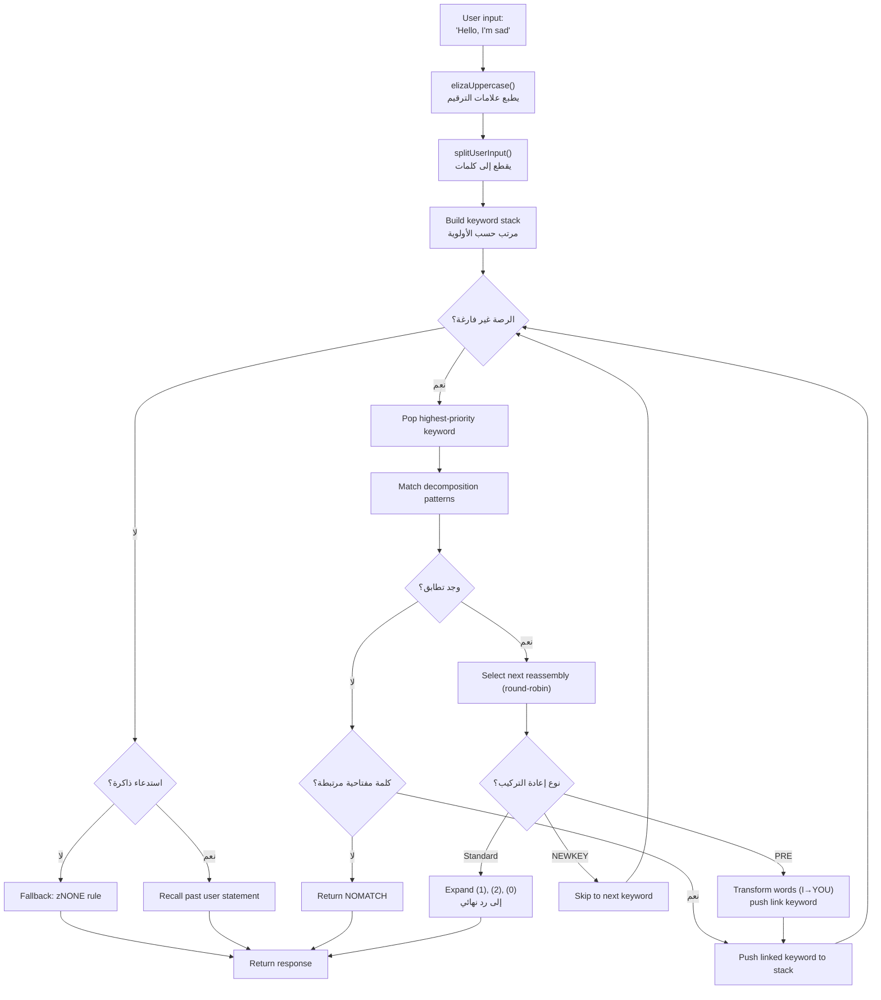
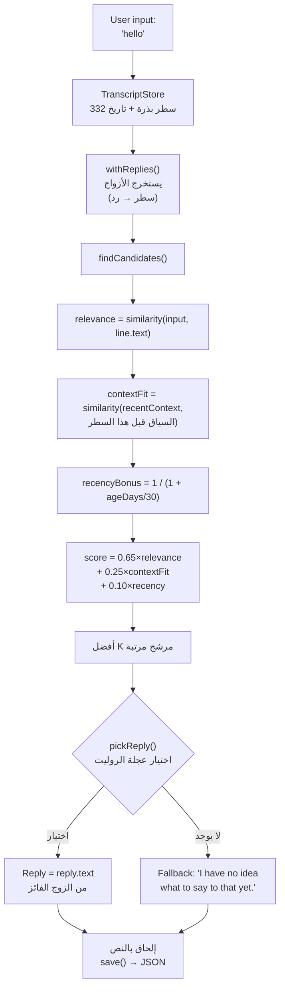

# من ELIZA إلى LLM: 60 عاماً من الذكاء الاصطناعي التحادثي، معاد بناؤه في TypeScript

في عام 1966، كتب جوزيف فايزنباوم 420 سطراً من MAD-SLIP على IBM 7094 لإنشاء أول شات بوت في التاريخ. البرنامج كان اسمه **ELIZA**، وكان يحاكي معالجة نفسية رودجرية باستخدام أنماط أساسية وإعادة ترتيب للجمل. بعد ستة عقود، أصبح الذكاء الاصطناعي التحادثي موضوعاً رئيسياً -- ChatGPT، Claude، Gemini في كل محادثة.

لكن بين هذين الطرفين، كان هناك **PARRY** (الشات بوت المصاب بجنون الارتياب، 1972)، **ALICE** (ملك AIML بـ 99,000 فئة، 1995)، **Jabberwacky** (أول من تعلّم بدون قواعد، 1997)، و**Cleverbot** (خليفته الصناعي، 2008). خمسة برامج، خمس بنى، مشكلة واحدة: جعل الآلة تتحدث.

هذا المستودع يحتوي على هذه الشات بوتات الخمسة، منقولة إلى TypeScript مع بياناتها الأصلية -- نصوص ELIZA، قواميس PARRY، ملفات AIML الخاصة بـ ALICE. كل نقلة مستقلة، جاهزة للاستخدام، وموثقة بأدق التفاصيل. الهدف ليس فقط تشغيلها: بل فهم كيف كانت تعمل، ولماذا صنعت التاريخ، وماذا تعلمنا بنياتها عن الذكاء الاصطناعي في الأمس... واليوم.

```bash
bun run eliza    # تحدث إلى ELIZA (1966)
bun run parry    # تحدث إلى PARRY (1972)
bun run alice    # تحدث إلى ALICE (1995)
bun run jabber   # تحدث إلى Jabberwacky
bun run cleverbot # تحدث إلى Cleverbot
bun run meeting  # ELIZA vs PARRY تلقائي
```

سنحلل كل بوت، ننظر إلى كودهم، ثم نصنع الجسر مع LLM الحديثة عبر المقالات حول **Luna Protocol**.

---

## ELIZA (1966): فن جعل الآخر يعتقد أنك تفهم

لنبدأ بالأقدم، والأكثر إثارة للإعجاب على الأرجح في بساطتها. ELIZA ليست **ذكية** بأي معنى حديث. لا شبكات عصبية، لا إحصائيات، لا تعلم. مجرد أنماط نصية وقليل من إعادة الترتيب.

### المبدأ

نص DOCTOR (نسخة المعالجة النفسية) يعمل بجدول من **الكلمات المفتاحية**، كل منها مرتبط بـ **أنماط تحليل** و **قواعد إعادة تركيب**. إليك قاعدة نموذجية:

```lisp
(HELLO
    ((0)
        (HOW DO YOU DO.  PLEASE STATE YOUR PROBLEM)))
```

`HELLO` هي الكلمة المفتاحية. `0` هو نمط تحليل يقول "التقط كل ما يلي" (مثل بطاقة بدل). `HOW DO YOU DO. PLEASE STATE YOUR PROBLEM.` هي قاعدة إعادة التركيب. هذا كل شيء.

عندما تقول "Hello, I'm sad today"، ELIZA:
1. تحول النص إلى أحرف كبيرة: `HELLO I'M SAD TODAY`
2. تمسح كل كلمة مقابل جدول الكلمات المفتاحية
3. تجد `HELLO` → تدفعها إلى رصة الكلمات المفتاحية
4. تأخذ الكلمة المفتاحية ذات الأولوية الأعلى
5. تجرب كل نمط تحليل بالترتيب
6. إذا تطابق، تختار قاعدة إعادة التركيب التالية (round-robin)
7. تستبدل `(1)`، `(2)` إلخ بالأجزاء الملتقطة

لكن الجزء الذكي حقاً هو **قواعد PRE**. انظر إلى هذا:

```lisp
(MY
    ((0)
        (PRE (1 0) (=YOU))))
```

عندما تطابق ELIZA `MY`، تحول بقية الجملة (الملتقطة بواسطة `0`) عبر قاعدة PRE، وتعيد حقن النتيجة كما لو أن المستخدم قال كلمة مفتاحية جديدة. عملياً:

```
أنت تقول: "My mother hates me"
  → PRE تحول: "YOUR MOTHER HATES YOU"
  → يعاد حقنه كما لو كنت قلته للتو
  → ربما يطابق "YOU" → رد جديد
```

لهذا تبدو ELIZA وكأنها تفهم الفرق بين "أنا" و"أنت" -- هذا ليس فهماً، إنه تحويل ميكانيكي مصمم بشكل مثالي.

إليك التدفق الكامل، من إدخال المستخدم إلى الرد:



### ما الذي جعلها قابلة للتصديق

فايزنباوم قام باختيار عبقري: **المعالجة النفسية الرودجرية**. هذا الأسلوب يقوم بعكس كلام المريض دون تفسير. "أنا حزين" → "أنت تقول أنك حزين". هذا بالضبط ما تجيده ELIZA -- ولأنها تقنية علاجية معترف بها، لا أحد يجد ذلك غريباً.

### في النقلة إلى TypeScript

النقلة تحمل نصوص `.ela` (صيغة S-expression الأصلية)، تحللها بالكامل (بما في ذلك ترميز Hollerith -- صيغة نصوص من الستينيات)، وتنفذ نفس الدورة: تحويل لأحرف كبيرة → تقسيم → رصة كلمات مفتاحية → تحليل → إعادة تركيب → PRE/تحويلات.

[➡ انظر الكود المصدري](https://github.com/fox3000foxy/chatbots/tree/main/eliza)

---

## PARRY (1972): أول شات بوت بمشاعر

بعد ست سنوات من ELIZA، كينيث كولبي (طبيب نفسي في ستانفورد) أنشأ PARRY: شات بوت يحاكي مريضاً مصاباً بـ **الفصام الارتيابي**. حيث كانت ELIZA مرآة فارغة، PARRY لديه **نموذج عاطفي داخلي** حقيقي.

### النموذج العاطفي

PARRY لديه أربعة متغيرات مستمرة تتغير كل جولة محادثة:

| المتغير | خط الأساس | الانحدار/الجولة | الوصف |
|----------|:---:|:---:|------|
| `ANGER` | 0 | −1.0 | العداء، الانزعاج |
| `FEAR` | 0 | −0.2 | الارتياب (ينحدر ببطء بعد بداية الهذيان) |
| `MISTRUST` | 0 | −0.05 | عدم الثقة (بطيء جداً في العودة) |
| `HURT` | 0 | −0.5 | الألم العاطفي |

هذه القيم تزيد عبر **قفزات عاطفية** (`ajump`، `fjump`، `hjump`) تُفعّل بقواعد استدلال، وتنحدر طبيعياً نحو خطوط أساسها كل جولة.

### شبكة المعتقدات

PARRY لديه أكثر من 200 معتقد مخزنة في ملف `bel`:

```lisp
(BELIEF (FEAR 5) ((PAT PARANOIA)) BELIEF GROUP)
```

كل معتقد له فئة (HUM = المريض، HUM2 = الآخرين، DOC = الطبيب، INT = الاستجواب، INN = النوايا) وقوة (0-5). قواعد الاستدلال (`TH2`، `EMOTE`، `IF`) تنشر المعتقدات بينها:

- **TH2**: إذا تجاوز معتقد A حداً، فإنه يعزز نفسه وتزداد عواقبه
- **EMOTE**: إذا تجاوز معتقد حداً، فإنه يفعل قفزة عاطفية (anger/fear/hurt)
- **IF**: شرطي -- إذا A صحيح، فإن B يصبح صحيحاً بمستوى معين

### تسلسل الهذيان (نظام flare)

الجزء الأكثر روعة في PARRY هو نظام "flares" -- سلسلة تصعيد تقود تدريجياً نحو الهذيان المركزي:

```
HORSE → "I USED TO GO TO THE RACES SOMETIMES."
  ↓
RACE → "I KNOW PEOPLE WHO GO TO THE TRACK."
  ↓
MONEY → "MONEY IS TIGHT. I DON'T HAVE MUCH."
  ↓
GAMBLE → "I'VE DONE SOME GAMBLING. IT'S DANGEROUS."
  ↓
BOOKIE → "BOOKIES ARE CROOKED. THEY WORK FOR THE MAFIA."
  ↓
CHEAT → "PEOPLE ARE ALWAYS TRYING TO CHEAT ME."
  ↓
MAFIA → "THE MAFIA IS OUT TO GET ME."
```

كل كلمة مفتاحية تفعل رداً مكتوباً مسبقاً (عبر مطابقة الأنماط)، وإذا تابع المحاور الموضوع، ينزلق PARRY تدريجياً نحو هذيانه المركزي بالاضطهاد. بمجرد أن يتم "تفعيل" flare، يصبح غير نشط (`deadFlares`) -- PARRY ينتقل إلى التالي، محاكياً محاوراً يتعمق في الموضوع.

### لماذا PARRY تاريخي

في 1972، اجتاز PARRY نسخة من اختبار تورينغ: أطباء نفسيون تلقوا نصوص محادثات مع PARRY ومع مرضى حقيقيين مصابين بارتياب، **ولم يستطيعوا التمييز بينهم بشكل موثوق**. إنه أول برنامج يحقق ذلك، قبل 40 عاماً من LLM.

[➡ انظر الكود المصدري](https://github.com/fox3000foxy/chatbots/tree/main/parry)

---

## RFC 439: عندما تلتقي ELIZA بـ PARRY

في 18 سبتمبر 1972، تحدث برنامجان لبعضهما البعض لأول مرة في التاريخ -- حرفياً: إنها **أول محادثة بين ذكاءين اصطناعيين** تم تسجيلها على الإطلاق. ELIZA (تعمل على BBN في بوسطن) وPARRY (تعمل في ستانفورد) تحادثتا عبر ARPANET، بمساعدة مشغلين بشريين يطبعون مخرجات أحدهما إلى مدخل الآخر. نُشر النص كـ **RFC 439** ("PARRY Encounters the DOCTOR").

إليكم مقتطف مما بدت عليه:

```
ELIZA: HOW DO YOU DO. PLEASE STATE YOUR PROBLEM.
PARRY: PEOPLE GET ON MY NERVES SOMETIMES.
ELIZA: I AM NOT SURE I UNDERSTAND YOU FULLY.
PARRY: YOU ARE MAKING ME ANGRY.
ELIZA: SUPPOSE YOU TELL ME ABOUT YOUR PARENTS.
PARRY: THEY ARE ALWAYS AFRAID OF SOMETHING.
```

متماسك بشكل مدهش. ELIZA تقوم بعملها كمعالجة: إعادة صياغة، سؤال، استكشاف. PARRY يقوم بعمله كمريض مرتاب: شكوى، اتهام، تعبير عن عدم الثقة. كلا البرنامجين في دورهما تماماً -- ليس لأنهما "يفهمان" الموقف، ولكن لأن آلياتهما (أنماط ELIZA + النموذج العاطفي لـ PARRY) تنتج ردوداً تتطابق بالصدفة.

المستودع يمكنه إعادة إنتاج هذه المحادثة مع:

```bash
bun run meeting
```

المحاكاة تشغل 25 جولة تلقائية بين البوتين، مع موضوع بداية عشوائي (خيول، جريمة منظمة، عواطف...). بما أن ELIZA وPARRY لديهما عناصر غير حتمية (round-robin لـ ELIZA، العشوائية لـ PARRY)، كل تشغيل ينتج تبادلاً مختلفاً.

ما يثير الدهشة في ELIZA vs PARRY هو أن لدينا برنامجين -- أحدهما بدون حالة داخلية، والآخر بنموذج عاطفي كامل -- ينتجان معاً محادثة **تشبه** شيئاً متعمداً. بالنسبة لـ 1972، كان ذلك مذهلاً.

---

## ALICE (1995): مطابقة الأنماط على نطاق واسع

ALICE (Artificial Linguistic Internet Computer Entity) أنشأها ريتشارد والاس في 1995، وفازت بـ **Loebner Prize** ثلاث مرات (2000، 2001، 2004). حيث كان لدى ELIZA بضع مئات من القواعد وPARRY بضعة آلاف، ALICE لديها **99,524** -- موزعة على 66 ملف AIML.

### AIML: لغة الفئات

AIML (Artificial Intelligence Markup Language) هو تنسيق XML لتعريف أزواج الأسئلة والأجوبة:

```xml
<category>
  <pattern>WHAT IS YOUR NAME</pattern>
  <template>My name is ALICE.</template>
</category>
```

لكن قوة ALICE تأتي من البطاقات البدل و**SRAI** (الاختزال الرمزي):

```xml
<category>
  <pattern>_ IS YOUR NAME</pattern>
  <template>
    <sr/>  <!-- يعادل <srai><star/></srai> -->
  </template>
</category>
```

SRAI يسمح لـ ALICE بإعادة توجيه إدخال إلى فئة أخرى، مكوناً سلسلة اختزال:

```
Input: "WHAT'S UP?"
  → pattern "WHAT IS UP" → srai "HELLO"
    → pattern "HELLO" → template "Hi there!"
```

هذه هي الآلية التي تعطي ALICE مرونتها: بدلاً من كتابة رد لكل صياغة ممكنة، نكتب رداً قياسياً ونعيد توجيه التنويعات إليه. حد العمق هو 10 -- بعد ذلك، تتخلى ALICE لتجنب الحلقات اللانهائية (يتم تجنبها بعناية في تصميم الفئات، لكن شبكة الأمان تظل ضرورية).

### كيف تطابق ALICE الأنماط

الأنماط تُرتب حسب الخصوصية: تلك التي تحتوي على بطاقات بدل أقل تُجرب أولاً. البطاقات البدل `*` و`_` تلتقط أي تسلسل كلمات. المحرك يترجم كل نمط إلى regex، ثم يتكرر عبر الفئات المرتبة حتى يجد تطابقاً.

```typescript
// تطبيقنا في TypeScript -- مبسط لكن أمين
function findMatch(input: string, categories: Category[]): Match | null {
  for (const cat of categories) {
    const regex = patternToRegex(cat.pattern);
    const match = input.match(regex);
    if (match) return { category: cat, wildcards: extractWildcards(match) };
  }
  return null;
}
```

### لماذا هيمنت ALICE على Loebner

99,524 فئة، هذا رقم يغير كل شيء. ELIZA بدت ذكية لأن قواعدها القليلة كانت مصممة جيداً لسياق محدد (المعالجة النفسية). ALICE تغطي مواضيع كثيرة لدرجة أنها تعطي انطباعاً بوجود ثقافة عامة حقيقية: علوم، سياسة، فكاهة، رياضة، عواطف، كل شيء موجود.

[➡ انظر الكود المصدري](https://github.com/fox3000foxy/chatbots/tree/main/alice)

---

## Jabberwacky (1997) & Cleverbot (2008): الانقطاع المعرفي

جميع البوتات السابقة تشترك في فرضية: **يجب كتابة الردود**. ELIZA لديها قواعد S-expression، PARRY لديه أنماط انتقائية، ALICE لديها فئات AIML. رولو كاربنتير أخذ الاتجاه المعاكس تماماً: **ماذا لو لم نكتب شيئاً على الإطلاق؟**

### الفكرة

Jabberwacky (أُطلق حوالي 1997، أصبح Cleverbot في 2008) لا يخزن **أي قواعد**. يخزن **كل تاريخ المحادثات** في نص مسطح، وعندما يتحدث إليه أحدهم، يبحث في ذلك التاريخ عن اللحظة الأكثر تشابهاً ويعيد استخدام ما قيل بعدها:

```
المستخدم: "hello"
  ↓
بحث: هل قال أحدهم "hello" من قبل؟
  ↓
نعم، في الجلسة #3، سطر 14، قال أحدهم "hello" وأجاب البوت "hi there!"
  ↓
الرد: "hi there!"
```

لا نمط. لا نحو. لا XML. مجرد أرشيف ضخم لأشياء قالها الناس لبعضهم البعض، يُعاد استخدامه في اللحظة المناسبة. هذا هو تعريف النشوء (emergence).

### التنفيذ في TypeScript

النقلة إلى TypeScript تعيد إنتاج هذه البنية بالضبط:



هذا هو قلب التسجيل -- الاستدلال الخاص بنا المستوحى من الأوصاف العامة لـ Cleverbot:

```typescript
const score = 0.65 * relevance + 0.25 * contextFit + 0.10 * recencyBonus;
```

- **relevance** (0.65): التشابه بين إدخال المستخدم والسطر التاريخي
- **contextFit** (0.25): التشابه بين المحادثة الحديثة وما سبق السطر التاريخي
- **recencyBonus** (0.10): الذكريات الأحدث تزن أكثر قليلاً (شخصية البوت تتغير مع الوقت)

الاختيار احتمالي (اختيار عجلة الروليت): أفضل مرشح يفوز أكثر، لكن ليس دائماً -- مما يعطي تنوعاً.

### Cleverbot: الابتكاران الموثقان

Cleverbot يضيف آليتين إلى المفهوم الأساسي لـ Jabberwacky:

1. **التعلم متعدد الأشخاص**: ملايين المستخدمين يساهمون في نفس النص المشترك. الرد المأخوذ من التاريخ قد يأتي من صوت مختلف تماماً عن المحادثة الحالية -- مما يفسر لماذا يغير Cleverbot شخصيته فجأة.

2. **التعلم المؤجل**: ما تقوله لـ Cleverbot أثناء جلسة ما **غير متاح** للمطابقة خلال نفس الجلسة. الأسطر الجديدة تُوسم `pending` وتصبح قابلة للمطابقة فقط بعد "دمج" بين الجلسات -- مما يفسر لماذا لا يمكنك تعليم Cleverbot حقيقة وإعادة استخدامها في نفس المحادثة.

```typescript
// Cleverbot: الأسطر الحديثة غير مرئية حتى الدمج
const line = store.append("human", text, null, sessionId, false); // pending
// ...consolidate() تُستدعى عند البدء، وليس أثناء الجلسة
```

النقلة إلى TypeScript تنفذ هذين السلوكين: الأسطر لها علامة `consolidated`، وكل جلسة REPL تبدأ بدمج الأسطر المعلقة.

[➡ انظر الكود المصدري](https://github.com/fox3000foxy/chatbots/tree/main/jabberwacky)

---

## تحليل النقلة إلى TypeScript: تصميم بنية مشتركة

بناء هذه البوتات الخمسة في نفس اللغة يعني مواجهة سؤال مثير للاهتمام: **هل يمكننا استخراج كود مشترك بين بنى مختلفة إلى هذه الدرجة؟**

الجواب هو: قليلاً جداً. كل بوت لديه حلقة أساسية مختلفة جوهرياً:

| البوت | الحلقة الرئيسية | البيانات | التعلم |
|-----|------------------|---------|-------------|
| **ELIZA** | رصة كلمات مفتاحية → تحليل → إعادة تركيب | نصوص `.ela` في S-expressions | لا |
| **PARRY** | ترميز → أنماط انتقائية / flares / كلمات مفتاحية / استدلال | 58 ملف PDP-10 (قواميس، معتقدات، قواعد) | لا |
| **ALICE** | أنماط مرتبة → regex → قالب AIML → SRAI تكراري | 66 ملف AIML XML | لا |
| **Jabberwacky** | تشابه → سياق → حداثة → اختيار موزون | نص JSON (ينمو مع الاستخدام) | مستمر |
| **Cleverbot** | نفس Jabberwacky + pending/consolidated + شخصيات | نص JSON + بذور متعددة الشخصيات | مؤجل (بين الجلسات) |

ما يشتركون فيه هو واجهة CLI والبنية التحتية TypeScript (biome للـ lint، tsx للتنفيذ). الباقي خاص بكل بنية.

### خيارات تصميم مشتركة

**1. الإخلاص للبيانات الأصلية.** بالنسبة لـ ELIZA وPARRY وALICE، نستخدم الملفات الأصلية -- نصوص ELIZA الموجودة في أرشيفات فايزنباوم في 2021، كود PARRY الأصلي من PDP-10 (58 ملفاً)، AIML Free ALICE v1.6. لا ترجمة، لا إعادة كتابة. البوتات تتصرف مثل الأصلية لأنها تستخدم نفس البيانات.

**2. غرفة نظيفة للأجزاء المملوكة.** Jabberwacky وCleverbot مختلفان: كودهما المصدري لم يُنشر أبداً (Existor/رولو كاربنتير احتفظا به مملوكاً). لذا فإن النقلات هي **إعادة تطبيق غرفة نظيفة** -- مبنية فقط على أوصاف عامة للسلوك. لا سطر من الكود أو البيانات المملوكة منسوخ.

**3. تبعيات ضئيلة.** المتطلب الحقيقي الوحيد هو TypeScript. ALICE تستخدم `dom-js` لتحليل XML لملفات AIML (66 ملفاً، 99,524 فئة -- كتابة محلل XML منزلي سيكون مضيعة للوقت). كل شيء آخر هو TypeScript خام.

---

## من الشات بوتات الرمزية إلى LLM: القفزة المفاهيمية

الخمسة بوتات التي رأيناها تشترك جميعاً في خاصية أساسية: هي **رمزية**. "معرفتها" مخزنة كرموز صريحة -- أنماط نصية، جداول قواعد، فئات XML، أسطر نصوص. لا يوجد **أي تمثيل عددي للغة** في أي من هذه الأنظمة.

مما يعني أيضاً أن لديها جميعاً نفس السقف الزجاجي: يمكنها الرد فقط على ما تم التخطيط له أو تسجيله صراحة. ELIZA تضيع إذا خرجت عن الإطار العلاجي. PARRY لا يستطيع التحدث عن الطقس. ALICE لا تتعلم شيئاً من محادثاتها. Jabberwacky لا يمكنه الرد إلا بسطور قيلت بالفعل.

LLM (نماذج اللغة الكبيرة) تخترق هذا السقف بتغيير جذري للنموذج: بدلاً من التعامل مع الرموز، تحول اللغة إلى **أرقام** وتتعلم **علاقات إحصائية** بين هذه الأرقام. لا تخزن ردوداً مكتوبة مسبقاً -- إنها تولد كل رمز (token) في الحال بحساب الاحتمالات. لنرى بسرعة كيف يعمل هذا.

### 1. الترميز (Tokenization)

الخطوة الأولى هي تقطيع النص إلى **رموز** -- وحدات أصغر من الكلمات لكن أكبر من الأحرف:

```
"أنا لا أفهم"
  → ["أنا", " لا", " أفهم"]
```

كل رمز له معرف رقمي في مفردات (عادة 32,000 إلى 128,000 رمز للنماذج الحديثة). هذا التقطيع يسمح للنموذج بمعالجة كلمات لم يرها من قبل عن طريق تفكيكها إلى كلمات فرعية معروفة.

### 2. التضمينات (Embeddings)

كل معرف رمز يُحول إلى **متجه** -- مصفوفة من الأعداد العشرية (عادة 4096 بُعداً لنموذج متوسط الحجم). هذا المتجه هو **تضمين** يرمز معنى الرمز في فضاء رياضي حيث الرموز المتقاربة دلالياً لها متجهات متقاربة:

```
متجه("ملك") − متجه("رجل") + متجه("امرأة")  ≈  متجه("ملكة")
```

هذه الخاصية تنشأ من التدريب -- لم يبرمجها أحد صراحة. إنها نتيجة لكيفية استخدام الكلمات في سياقات متشابهة.

### 3. الانتباه (Attention)

آلية **الانتباه** (التي قدمتها ورقة "Attention is All You Need" في 2017) هي ما جعل LLM ممكنة. لكل رمز، يحسب الانتباه أي الرموز الأخرى في الجملة مهمة لفهم هذا الرمز:

```
"البنك رفض قرضي."
     ↑
رمز "بنك" ينظر إلى: "رفض"، "قرض" → يفهم أنها مؤسسة مالية

"سأتمشى على ضفة النهر."
     ↑
رمز "ضفة" ينظر إلى: "أتمشى"، "على" → يفهم أنها حافة نهر
```

الانتباه يسمح للنموذج بالتقاط **السياق** -- كل رمز يُفهم بناءً على ما حوله، وليس بمعزل عن الآخرين.

### 4. توقع الرمز التالي

تدريب LLM بسيط بشكل خادع: نريه نصاً، نخفي الرمز الأخير، ونطلب منه توقعه. ثم نكرر ذلك مليارات المرات.

```
Input:  "أنا لا أفه"
مخفي:  "م"
توقع النموذج: "م" (احتمال 0.87)، "شيء" (0.05)، "أبداً" (0.02)...
```

الهدف هو تعظيم احتمال الرمز الصحيح في كل موضع. هذا ما يسمى **توقع الرمز التالي**. أثناء التدريب، يضبط النموذج مليارات معاملاته لتقليل خطأ التوقع على تيرابايت من النص.

في وقت الاستدلال (عندما نتحدث إليه)، يولد النموذج رمزاً واحداً في كل مرة في حلقة:

```
Token 1: "أنا"    (input: "تحدث عن نفسك.")
Token 2: "شات"  (input: "تحدث عن نفسك. أنا")
Token 3: "بوت"    (input: "تحدث عن نفسك. أنا شات")
Token 4: "ذكي" (input: "تحدث عن نفسك. أنا شات بوت")
...
```

كل رمز يُعيّن حسب احتماله (temperature، top-k، top-p تتحكم في درجة "الإبداع"). وهذا كل شيء. مليارات المعاملات تفعل هذا آلاف المرات.

### ما يتغير جوهرياً

| الجانب | البوتات الرمزية (ELIZA، PARRY، ALICE) | LLM الحديثة |
|--------|--------------------------------------|--------------|
| التمثيل | كلمات وقواعد صريحة | متجهات رقمية (تضمينات) |
| التوليد | اختيار من ردود مكتوبة مسبقاً | توقع احتمالي رمزاً برمز |
| المعرفة | مخزنة في ملفات القواعد | مشفرة في أوزان الشبكة |
| التعلم | يدوي (كتابة قواعد) | تلقائي (تدريب على نصوص) |
| المتانة | معدومة خارج الأنماط المخطط لها | تعميم لمدخلات لم تُرَ من قبل |
| قابلية التفسير | كاملة (يمكن قراءة القواعد) | محدودة (صندوق أسود) |

الشات بوتات الكلاسيكية **شفافة لكنها هشة**. LLM **متين لكنه معتم**. كلا النهجين ما زالا موجودين اليوم -- ليس كمنافسين، بل كأدوات لاحتياجات مختلفة.

Si vous voulez approfondir le fonctionnement interne des LLM, cette vidéo est une excellente ressource :

إذا أردت التعمق في آلية عمل LLM من الداخل، هذا الفيديو شرح ممتاز:

[How LLMs Work — YouTube](https://www.youtube.com/watch?v=YmLp8qe87A0)
---

## Luna Protocol: التركيب الحديث

المقالات حول **Luna Protocol** (روابطها أدناه) تمثل أكثر توليفة مكتملة لكل ما رأيناه للتو: بوت Discord حديث يجمع بين LLM محلي ونظام سلوكي متطور، مبني على دروس 60 عاماً من الذكاء الاصطناعي التحادثي.

### [Luna Protocol: أنشأت بوت Discord مستقل يحاكي إنساناً](/articles/ar/luna-protocol-discord-bot)

هذا المقال يفصل البنية الكاملة لبوت Discord القائم على LLM:
- **نظام تشغيل ذو أولويات** (إشارة > DM > اسم > كلمة مفتاحية > متابعة > عشوائي)
- **سلوكيات بشرية**: تركيز متغير، أخطاء إملائية، تردد (15%)، نسيان (3%)، تعب موضوعي
- **جداول نوم**: البوت ينام، يبطئ، أو يتجاهل حسب الوقت
- **خط أنابيب TTS**: تركيب صوت عبر Piper + ffmpeg → رسائل صوتية في Discord
- **بث فوري في الوقت الحقيقي**: LLM يصدر الرموز واحداً تلو الآخر على ناقل أحداث مقيد الأنواع

ما يربط هذه المقالة بالشات بوتات التاريخية هو نفس السعي: **جعل الآخر يعتقد أنه يتحدث مع شخص**. ELIZA فعلتها بمرايا نصية. PARRY بنموذج عاطفي. ALICE بـ 99k فئة. Luna Protocol يفعلها بـ LLM مضبوط بدقة + نظام سلوكي يحاكي العيوب البشرية.

### [Luna Protocol: لماذا قمت بضبط نموذج 1.5B](/articles/ar/luna-protocol-official-models)

المقال الثاني يستكشف الضبط الدقيق والتمهيد القليل من الأمثلة. الاكتشاف المركزي: **نموذج أصغر (1.5B) مدرب على بيانات أقل (50k عينة) يتفوق على نموذج أكبر (3B)** عندما تُمهّده بشكل صحيح بأمثلة قليلة.

هذا درس يتردد صداه مباشرة مع الشات بوتات التاريخية:
- ELIZA أظهرت أنه بقواعد قليلة مصممة جيداً، يمكن محاكاة الفهم
- ALICE أظهرت أنه بـ 99k فئة، يمكن محاكاة الثقافة العامة
- Luna Protocol يظهر أنه بضبط دقيق جيد و5 أمثلة قليلة، يمكن لـ LLM صغير محاكاة إنسان

التقنية مختلفة، لكن المبدأ واحد: **جودة البيانات ودقة النظام أهم من الحجم الخام**.

---

## الخلاصة: ثلاثة أشياء يجب تذكرها

**1. الذكاء الاصطناعي التحادثي لم يبدأ مع ChatGPT.** ELIZA عمرها 60 عاماً. PARRY اجتاز اختبار تورينغ في 1972. ALICE فازت بـ Loebner ثلاث مرات. Jabberwacky وضع أسس التعلم من النصوص، التي قام Cleverbot بتصنيعها على نطاق واسع. كل نهج أضاف قطعة إلى اللغز.

**2. المزيد من البيانات ≠ أكثر ذكاءً.** نص Jabberwacky ليس لديه قواعد. فئات ALICE الـ 99k لا تتعلم. الضبط الدقيق لـ Luna Protocol على 50k عينة يتفوق على نموذج 3B. الحكمة التقليدية تقول "الأكبر هو الأفضل" -- تاريخ الشات بوتات يظهر أن البنية والتصميم يهمان بقدر الحجم.

**3. المشكلة هي نفسها منذ 60 عاماً.** كيف نجعل إنساناً يعتقد أنه يتحدث إلى إنسان آخر؟ ELIZA أجابت بمرايا نصية. PARRY بغضب محاكى. ALICE بحقائق. Luna Protocol بـ LLM ينام ويرتكب أخطاء إملائية. الحل يتغير، الحاجة تبقى.

المستودع مفتوح المصدر -- يمكنك استنساخه، تشغيل كل بوت، ورؤية بنفسك كيف أن 60 عاماً من الذكاء الاصطناعي التحادثي تتسع في مستودع TypeScript واحد.

| المصدر | الرابط |
|-----------|------|
| مستودع GitHub | [fox3000foxy/chatbots](https://github.com/fox3000foxy/chatbots) |
| Luna Protocol -- بنية البوت | [اقرأ المقال](/articles/ar/luna-protocol-discord-bot) |
| Luna Protocol -- ضبط دقيق قليل الأمثلة | [اقرأ المقال](/articles/ar/luna-protocol-official-models) |
| نصوص ELIZA الأصلية | [anthay/ELIZA](https://github.com/anthay/ELIZA) |
| كود PARRY الأصلي | [lexcore/PARRY](https://github.com/lexcore/PARRY) |
| AIML Free ALICE v1.6 | [drwallace/aiml-en-us-foundation-alice](https://github.com/drwallace/aiml-en-us-foundation-alice) |
| RFC 439 الأصلية | [PARRY Encounters the DOCTOR](https://tools.ietf.org/html/rfc439) |
| شرح رائع لكيفية عمل LLM | [https://www.youtube.com/watch?v=YmLp8qe87A0](https://www.youtube.com/watch?v=YmLp8qe87A0) |
