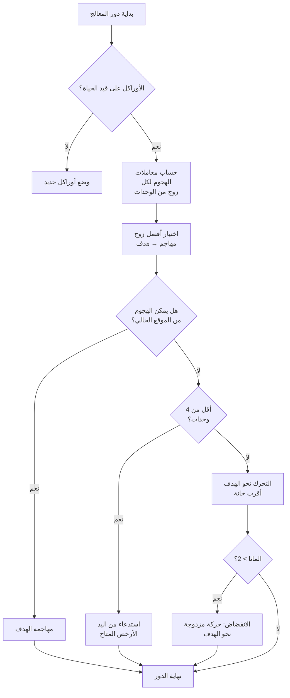

## ذكائي الاصطناعي التافه من أجل Nausicaa

هناك مشاريع تبدأ بـ "ماذا لو صنعت لعبة شطرنج بالأساطير؟" وتنتهي بشيء يملك ذكاءً اصطناعياً يقرر معاملاته الفائقة بنفسه كل 5 أدوار.

Nausicaa هي هذا. لعبة رقعة تعتمد على الأدوار حيث تبني مجموعة كائناتك الأسطورية، وتدير مانا (mana) خاصتك، وتنشر الوحدات على رقعة 10×8. ولديها ذكاء اصطناعي يعاني من نوبات انفصام في الشخصية.

قضيت وقتاً لا بأس به على هذا الذكاء الاصطناعي، والنتيجة لا تُطاق ×د

## اللعبة في الحقيقة

قبل التحدث عن الدماغ، يجب فهم الجسد:

- رقعة 10×8، منطقة نشر من صفين لكل لاعب
- المانا يبدأ من 1، +1 كل دور، حد أقصى 6. تنفقه لاستدعاء، مهاجمة، استخدام قدرات
- الهدف: القضاء على أوراكل (Oracle) الخصم

12 وحدة، تكاليف وأنماط حركة مختلفة:

| Unit | Cost | Movement | HP |
| --- | --- | --- | --- |
| Oracle | 0 | King (8 directions) | 1 |
| Gobelin | 1 | Forward 3 squares | 1 |
| Harpy | 1 | King (8 directions) | 1 |
| Naiad | 1 | Diagonal | 1 |
| Griffin | 2 | Jump 2 squares | 2 |
| Siren | 2 | Lateral | 1 |
| Centaur | 2 | Knight (L-shape) | 2 |
| Archer | 3 | Lateral | 1 |
| Phoenix | 3 | Diagonal (dark squares) | 1 |
| Shapeshifter | 4 | Swap places | 1 |
| Seer | 4 | None (generates mana) | 1 |
| Titan | 6 | Limited (area attack) | 3 |

لكل وحدة نمط هجوم خاص بها. الحورية (Siren) تضرب في الأقطار الأربعة، الرامي (Archer) عن بعد على 3 خانات، التايتن (Titan) يدمر كل شيء حوله عند الاستدعاء. باختصار لعبة شطرنج بمخلوقات أسطورية وبناء مجموعات ×د

## كيف جعلت المعالج يفكر

الفكرة الأساسية بسيطة بشكل سخيف: **لكل وحدة معادية معامل جاذبية**. كلما كانت أكثر خطورة، كلما أراد الذكاء الاصطناعي التعامل معها.

```javascript
const UNITS_ATTRACTIVENESS = {
    "oracle": 100,
    "titan": 95,
    "shapeshifter": 90,
    "phoenix": 80,
    "siren": 70,
    "archer": 70,
    "seer": 70,
    "griffin": 60,
    "centaur": 60,
    "harpy": 50,
    "naiad": 30,
    "gobelin": 20
};
```

الأوراكل 100 -- منطقي، هو شرط الفوز. التايتن 95 لأنه يدمر كل شيء مجاور عند الاستدعاء. القوبلين 20، جندي مشاة، لا يهم.

ثم لكل زوج من الوحدات (واحدة حليفة وواحدة معادية)، أحسب:

```
interest = attractiveness × coeff_attract / (distance × coeff_dist)
```

باختصار: كلما كنت خطيراً وقريباً، كلما أراد الذكاء الاصطناعي تحطيمك.

```javascript
calculateAttackCoefficient(x1, y1, x2, y2) {
    const distance = this.calculateEuclideanDistance(x1, y1, x2, y2);
    if (distance === 0) return Infinity;
    return (UNITS_ATTRACTIVENESS[unit.type] * COEFFICIENTS_IMPORTANCE["attractiveness"]) / distance;
}
```

### خدعة المعاملات المتغيرة

المضحك أن معاملات الأهمية **تتغير عشوائياً كل 5 أدوار**.

```javascript
if (this.turnCount % 5 === 0) {
    const distanceCoefficient = parseInt(Math.random() * 100);
    const attractivenessCoefficient = parseInt(Math.random() * 100);
    this.regulateImportanceCoefficients({
        distance: distanceCoefficient,
        attractiveness: attractivenessCoefficient
    });
}
```

مرة يصبح الذكاء الاصطناعي عدوانياً جداً (جاذبية 95، مسافة 5)، يعبر كل شيء ليقضي على أوراكلك. المرة التالية يعطي أولوية للمسافة ويعيد التموضع.

هذا مقتبس من أشباح Pac-Man -- Blinky يطارد، Pinky يكمُن. هنا الذكاء الاصطناعي يغير "شخصيته" كل مرحلة.

**النتيجة: من المستحيل توقع الذكاء الاصطناعي خلال مباراة كاملة.** المعالج لا يكرر نفس المباراة أبداً.

### الأوراكل جبان

الأوراكل المعادي يهرب. حرفياً.

```javascript
const awayFromTarget = {
    row: Math.max(0, Math.min(7, botUnitElement.row + (botUnitElement.row - targetUnitElement.row))),
    col: Math.max(0, Math.min(9, botUnitElement.col + (botUnitElement.col - targetUnitElement.col)))
};
```

يحسب الاتجاه المعاكس للتهديد ويهرب. إذا وجد جداراً، يبحث عن أقرب خانة فارغة في ذلك الاتجاه.

تقضي 3 أدوار تقترب من الأوراكل، وفجأة يهرب كالجبان ×د

### حلقة القرار

هكذا يقرر الذكاء الاصطناعي:

1. إذا لم يعد لدي أوراكل (مات)، أضع أوراكلاً جديداً
2. حساب المعامل لكل زوج وحدة حليفة → وحدة معادية
3. اختيار أفضل زوج
4. إذا كانت الوحدة تستطيع مهاجمة الهدف من موقعها → هاجم
5. إذا كان لدي أقل من 4 وحدات → استدع الأرخص المتاح من اليد
6. وإلا، تحرك نحو الهدف (أقرب خانة حركة للعدو)
7. إذا كان المانا كافياً (>2)، انقضاض (حركة مزدوجة) للاقتراب أكثر
8. إذا كانت الوحدة هي الأوراكل → اهرب



```javascript
async makeAction(dash=false) {
    // كل هذا بالتسلسل
    // المعالج ينقض إذا كان لديه مانا كافٍ
    if(botPlayer.mana > 2) {
        this.makeAction(true);
    }
}
```

### لماذا المسافة الإقليدية

أستخدم المسافة الإقليدية:

```javascript
calculateEuclideanDistance(x1, y1, x2, y2) {
    const deltaX = Math.pow(x1 - x2, 2);
    const deltaY = Math.pow(y1 - y2, 2);
    return Math.sqrt(deltaX + deltaY) * COEFFICIENTS_IMPORTANCE["distance"];
}
```

لماذا لا منهاتن؟ لأن الوحدات لديها أنماط حركة متنوعة (L مثل الحصان، قطري، إلخ). المسافة في خط مستقيم هي تقريب أفضل للخطر.

## لماذا ليس minimax

كان بإمكاني كتابة minimax تقليدي. لكن مع 12 نوعاً من الوحدات، أنماط حركة مختلفة، قدرات خاصة... شجرة اللعبة تنفجر بسرعة لدرجة أنها تصبح غير قابلة للعب. المنهج الاستدلالي يتخذ خيارات ذكية دون استكشاف 10 ملايين حالة.

## ما هو رائع

نظام الجاذبية يخلق معضلات مضحكة:

- الرائي (Seer) بقيمة 70 يولّد مانا. إذا تركته يعيش، الخصم لديه موارد أكثر. لكن التايتن (95) لا يزال أكثر خطورة.
- متغير الشكل (Shapeshifter) بقيمة 90 يمكنه مبادلة مكانه مع أي وحدة. يمكنه سرقة أوراكلك.
- الهاربي (Harpy) بقيمة 50 لديها هجوم انفجاري يقتلها أيضاً. ليست أولوية... حتى تصبح بجانب 3 من وحداتك.

الذكاء الاصطناعي يقيم الخطر العام حسب المواقع، وليس فقط الإحصائيات الخام.

هناك أيضاً دالة `activateSimulation()` لاختبار سيناريوهات دون إعادة مباراة:

```javascript
activateSimulation() {
    // يضع وحدات محددة على الرقعة
    // مفيد لتصحيح الذكاء الاصطناعي
    this.game.board = simulation.board;
    this.game.players = simulation.players;
}
```

## ما ينقص

لو كان لدي المزيد من الوقت:

- الذكاء الاصطناعي يتفاعل مع الحالة الحالية، لا يتنبأ بما سيفعله اللاعب
- لا يخطط ليده على عدة أدوار
- متغير الشكل والقنطور (Centaur) لديهما قدرات لا يستغلهما جيداً
- التعلم المعزز: جعله يلعب ضد نفسه لضبط المعاملات

لكن كلعبة متصفح، يؤدي المهم. بعض الأصدقاء يخسرون أمامه، إذن هو جيد ×د

## جربها

متاحة على [nausicaa-game.github.io](https://nausicaa-game.github.io/). تضغط على "JOUER"، وضع المعالج ON، وتشاهد الذكاء الاصطناعي وهو يفعل.

نصيحة: دع الذكاء الاصطناعي يلعب ضد نفسه. سترى مراحل عدوانية، ثم فجأة يتراجع كل شيء.

الكود على [GitHub](https://github.com/nausicaa-game/nausicaa-game.github.io) في `js/cpu.js`.

**3 أشياء:**

1. **معاملات استدلالية** -- لا minimax، كل وحدة لها جاذبية
2. **معاملات تتغير كل 5 أدوار** -- الذكاء الاصطناعي يتبادل بين العدوانية والتحكم، بأسلوب Pac-Man
3. **الأوراكل يهرب** -- يحسب الاتجاه المعاكس للتهديد ويجري

إذا كانت لديك أفكار لجعل الذكاء الاصطناعي أكثر دهاءً، افتح issue. لدي خطط لإصدار يتعلم من هزائمه، لكن ذلك سيكون لمقال قادم ×د
