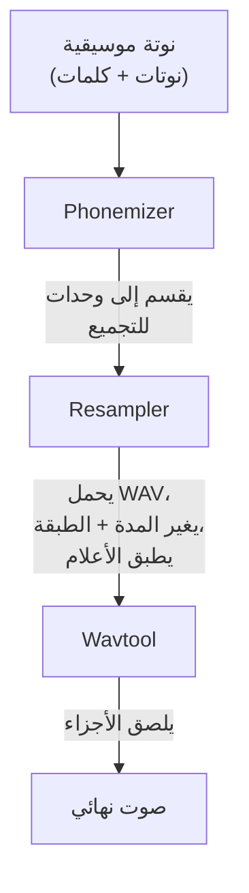

## UTAU : كيف أضفى برنامج بلغة Visual Basic 6 الطابع الديمقراطي على الصوت الاصطناعي

لقد أشرت إليه في صفحتي الرئيسية: أنا أحب UTAU. إليكم السبب.

في عام 2008، إذا أردت جعل صوت اصطناعي يغني، كان لديك خيار واحد : VOCALOID. برنامج Yamaha. مكلف، مغلق، بأصوات رسمية لم يكن بإمكانك إنشاؤها بنفسك.

ثم جاء رجل ياباني، Ameya/Ayame، وأصدر شيئًا في زاويته الخاصة. برنامج كُتب بلغة **Visual Basic 6**. مجاني. يتيح لك إنشاء صوتك الخاص باستخدام... ملفات WAV تسجلها بنفسك.

هذا الشيء اسمه **UTAU** (歌う، "يغني" باليابانية). وبالنسبة لعصره، كان سحرًا.

لطالما وجدت هذا البرنامج رائعًا. ليس لأنه كان نظيفًا تقنيًا (تنبيه : في الحقيقة، كان عليك حقًا التفكير في إنشاء هذا الشيء يا إلهي... إنها فوضى جميلة)، ولكن لأنه فعل شيئًا لم يفعله أي شخص آخر : لقد جعل التركيب الصوتي في متناول الجمهور العام. أعني أنت، أنا، أي شخص لديه ميكروفون.

دعني أشرح لك لماذا كان هذا رائعًا.

---

## أولاً، لماذا تركيب الغناء صعب

الصوت الغنائي ليس مجرد نوتات. لديك الحرف الساكن الذي يبدأ، والحرف المتحرك الذي يستمر، والتنفس، والانتقالات بينهما. كلمة "sa" في "salut" هي حرف "s" يصفر ثم ينزلق نحو "a" مفتوح، وهذا الانزلاق هو ما يجعل الصوت بشريًا أم لا.

اليوم نحل هذا بالتعلم العميق : تدرب نموذجًا على ساعات من الغناء فيولد الصوت (Synthesizer V, DiffSinger). لكن هذا كان 2020+. في 2008، لا شيء.

يستخدم UTAU الطريقة الأقدم والأكثر ذكاءً : **التركيب التجميعي**.

---

## التركيب التجميعي : قص ولصق أجزاء الصوت

الفكرة بسيطة جدًا : تسجل أجزاء صغيرة من الصوت وتلصقها معًا لتكوين كلمات. "salut" = عينة "sa" + "lu" + "to" متسلسلة. أحجية صوتية تقودها نوتة موسيقية.

هذا هو مبدأ YouTube Poop حيث يتم تقطيع كلمات شخصية ما لجعلها تقول أي شيء -- إلا أن الأمر هنا منظم ومؤتمت.

وUTAU جاء حرفيًا من هنا. قبله كان هناك **"Jinriki Vocaloid"** (人力ボーカロイド، "Vocaloid يدوي") : حيث كان الناس يقطعون المقاطع الصوتية يدويًا، يستخرجون الفونيمات، يعدلون الطبقة الصوتية، ويعيدون تجميع الكل في محرر صوتي لتقليد صوت VOCALOID. يدويًا. تخيل ذلك العمل.

رأى Ameya هذه المعاناة وكتب الأداة لأتمتتها. في الأساس، كان UTAU مجرد ذلك : مساعد لـ Vocaloid اليدوي.

---

## لماذا كان ثوريًا : أنت من تصنع الصوت

هذا هو الشيء الذي يغير كل شيء.

في VOCALOID، كنت تشتري صوتًا. Miku، Luka، إلخ. صممها محترفون، تباع بواسطة Yamaha. لا يمكنك صنع واحد بنفسك. أما في UTAU، **أي شخص يمكنه تسجيل صوته وجعله آلة غنائية**.

وضع CV (الأبسط) : تسجل الـ ~100 مقطع أساسي من اليابانية ("a"، "ka"، "sa"، "ta"...)، تضبط نقاط القطع، وفويلا لديك voicebank. بضع ساعات عمل.

النتيجة : انفجر النظام البيئي. الآلاف من voicebanks أنشأها المجتمع -- أصوات معجبين، أصدقاء، شخصيات مخترعة. عالم كامل من المطربين الافتراضيين، مجانًا. وكان البرنامج يأتي مع **Defoko** (Utane Uta)، صوت افتراضي يُولد عبر محرك TTS AquesTalk، لذا يمكنك البدء حتى بدون ميكروفون.

---

## oto.ini : قلب النظام

كيف يعرف UTAU أين يقطع ويلصق الأصوات؟ عبر ملف إعداد لكل voicebank : **`oto.ini`**. لكل ملف WAV، يحدد نقاط القطع (بالمللي ثانية) :

- **Offset** → الصمت الذي يجب إزالته في البداية
- **Preutterance** → النقطة التي ينتقل فيها الحرف الساكن إلى الحرف المتحرك (الحدود "s"←"a" في "sa")
- **Overlap** → مقدار تداخل النوتة السابقة مع هذه النوتة
- **Fixed region** → الجزء الذي يجب ألا يُمدد على نوتة طويلة (عادة الحرف الساكن)
- **Cutoff** → أين يُقطع النهاية

**Preutterance** هي المعلمة الأكثر ذكاءً. المقطع دائمًا يحتوي على جزء من الحرف الساكن قبل الحرف المتحرك. لكي تقع نوتتك على الزمن، يجب أن يقع *الحرف المتحرك* بالضبط، وليس الحرف الساكن. لذلك يزاح UTAU العينة للخلف : حرف "a" من "sa" يصل على الزمن، بينما "s" يسبقه قليلاً. مثل عازف طبول يستعد لضربته لكي يصدر الصوت في الوقت المناسب -- لكن الفرق أن هذا في ملف `.ini`.

بصريًا، على عينة "ka"، تُقطع مناطق `oto.ini` بهذا الشكل :

```mermaid
flowchart LR
    A["🔇 صمت<br/>(offset)"] --> B["🅺 حرف ساكن<br/>(fixed region،<br/>غير ممدد)"]
    B --> C["🅰 حرف متحرك<br/>(منطقة قابلة للمد)"]
    C --> D["🔇 نهاية مقطوعة<br/>(cutoff)"]
    style B fill:#3b4a6b
    style C fill:#5b3b6b
```



الحدود بين الحرف الساكن والمتحرك هي preutterance. الحرف المتحرك هو المنطقة التي تُمدد للنوتات الطويلة؛ الحرف الساكن يبقى سليمًا، وإلا فإن حرف "k" سيستمر لثانيتين وسيبدو فظيعًا.

```ini
# oto.ini (مبسط)
# ملف=alias,offset,consonant,cutoff,preutterance,overlap
_ka.wav=ka,120,80,-200,90,40
```

خمس قيم لكل صوت، على جميع عيناتك، وUTAU يجمع أي كلمة بشكل صحيح.

---

## CV، VCV، CVVC : السباق نحو الواقعية

الوضع الأساسي، **CV** (حرف ساكن-متحرك Consonne-Voyelle)، هو صوت واحد لكل مقطع. بسيط لكنه آلي بعض الشيء : الوصلات بين المقاطع خشنة.

في 2010 اخترع المجتمع **VCV** (حرف متحرك-ساكن-متحرك Voyelle-Consonne-Voyelle). بدلاً من تسجيل "ka" بمفردها، تسجل "a ka" -- مع ذيل الحرف المتحرك السابق. يصبح الانتقال طبيعيًا لأنه *داخل* التسجيل، وليس محسوبًا بعد القص.

التفصيل اللافت : **VOCALOID لم يحصل على VCV قبل VOCALOID3 في 2011.** البرنامج المجاني بلغة VB6 الذي كتبه شخص بمفرده سبق Yamaha بعام كامل في واقعية الانتقالات. مجتمع من المعجبين أسرع من شركة متعددة الجنسيات.

ثم جاء **CVVC**، **ARPAsing** (للإنجليزية)، **VCCV**... كل طريقة تدفع الواقعية أبعد، جميعها اخترعت ووثقت من قبل المجتمع.

---

## المسار الكامل : كيف تتحول الكلمة إلى صوت

عندما تضع نوتة وتكتب كلمة، إليك ما يحدث في الكواليس :



**Resampler** هو القطعة الأساسية : يأخذ عينتك "ka" المسجلة عند طبقة معينة ويمدد/يغير طبقتها لتطابق النوتة المطلوبة -- ممددًا فقط المنطقة القابلة للمد مع إبقاء الحرف الساكن سليمًا (من هنا يأتي `oto.ini`).

وهو **معياري**. أتى UTAU مع resampler أساسي، لكن المجتمع ابتكر آخرين (moresampler، TIPS...)، كل منها بصوته الخاص. كنت تغير محرك التركيب مثل إضافة Plugin. في 2008. على برنامج مجاني.

---

## الفوضى تحت الغطاء (ولماذا هي محببة)

يجب أن نكون صادقين بشأن الحالة التقنية لهذا الشيء :

- **مكتوب بلغة Visual Basic 6.** لغة كانت ميتة حتى في 2008. يتطلب تشغيل VB6 runtime.
- **لنظام Windows فقط في الأساس** (إصدار Mac، UTAU-Synth، جاء في 2011).
- **ترميز Shift-JIS إلزامي.** إذا كانت ملفاتك غير مشفرة بـ Shift-JIS الياباني، UTAU لا يفهم شيئًا. حتى اليوم يجب غالبًا ضبط جهاز الكمبيوتر على اللغة اليابانية أو استخدام AppLocale لتشغيله.
- **واجهة زاهدة**، وثائق 100% تقريبًا باليابانية في ذلك الوقت.

ومع ذلك. ورغم هذا، خلق هذا الشيء حركة عالمية. عشرات الآلاف من voicebanks. أغانٍ استمع إليها الملايين.

أفضل مثال : **Kasane Teto**. شخصية أنشئت في 2008 وأطلقت كخدعة كذبة أبريل، متظاهرة بأنها VOCALOID. كانت مزحة. لكن الناس أحبوا الشخصية، وتم إنشاء voicebank حقيقي لـ UTAU فيما بعد، وأصبحت Teto واحدة من أشهر المطربات الافتراضيات في العالم. في 2023 حصلت حتى على صوت Synthesizer V رسمي. شخصية ولدت من كذبة أبريل على برنامج مجاني.

---

## لماذا لا يزال مهمًا

UTAU هو المثال المثالي لتقنية "فقيرة" تربح بالانفتاح.

VOCALOID كان متفوقًا تقنيًا، أفضل تمويلًا، أكثر احترافية. لكنه مغلق. UTAU كان مرقعًا، قبيحًا، بلغة VB6 -- لكنه سمح للجميع بالمشاركة. إنشاء أصوات، إنشاء resamplers، إنشاء إضافات، إنشاء طرق تسجيل. المجتمع فعل الباقي.

والمفهوم لا يزال حيًا تمامًا اليوم. **OpenUtau**، الخلف مفتوح المصدر الحديث، يأخذ الفكرة وينفض عنها الغبار (متعدد المنصات، UTF-8، دعم resamplers الحديثة والذكاء الاصطناعي). التركيب التجميعي لا يزال صامدًا بجانب نماذج التعلم العميق، لأنه يمتلك شيئًا لا تملكه : أنت تفهم بالضبط ما يحدث، وتتحكم بكل مللي ثانية.

هذا ما أعجبني دائمًا في UTAU. ترى بالضبط ما يحدث. ليس ذكاء اصطناعي يبصق لك شيئًا سحريًا لا تفهمه : لديك ملفات WAV، نقاط القطع، وأنت من يقرر كل شيء. عندما يبدو الصوت سيئًا، تعرف السبب ويمكنك التصحيح. أحب هذا النوع من التحكم.

---

**3 أشياء يجب تذكرها :**

1. **التركيب التجميعي = أحجية صوت** -- UTAU يلصق عينات WAV صغيرة معًا لتكوين كلمات. `oto.ini` يحدد أين يقطع ويلصق كل صوت. تتحكم بكل شيء، بدقة المللي ثانية، دون صندوق أسود.

2. **الانفتاح يهزم التقنية** -- VOCALOID كان أفضل لكنه مغلق. UTAU كان مرقعًا لكنه سمح للجميع بإنشاء أصواتهم. المجتمع فجر النظام البيئي، بل وسبق Yamaha في VCV.

3. **الفكرة الجيدة تنجو من شفرتها** -- VB6، Shift-JIS، Windows فقط... ومع ذلك المفهوم لا يزال يعمل عبر OpenUtau. تقنية رائعة يمكن كتابتها بأرجل.

بصراحة، فقط من أجل Kasane Teto التي ولدت من كذبة أبريل، هذا البرنامج يستحق الاحترام xD
