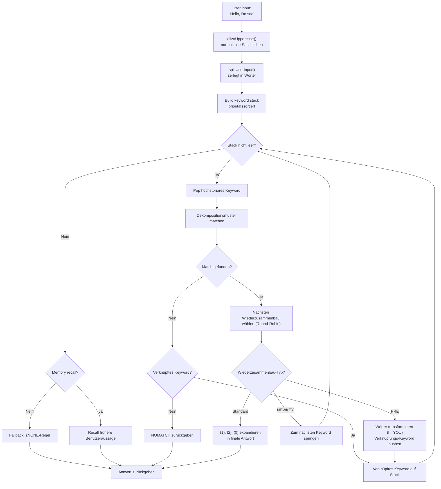
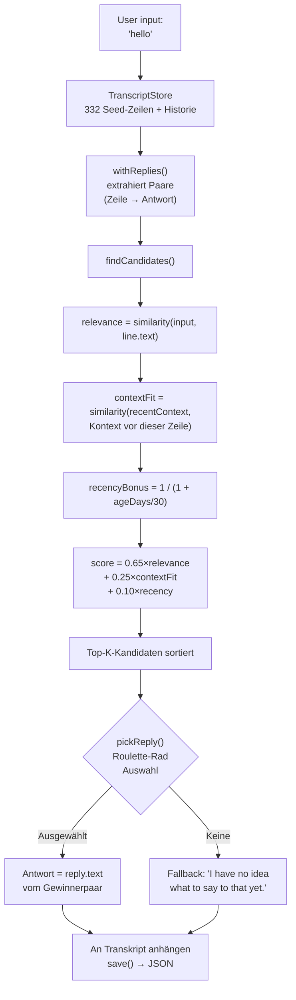

# Von ELIZA zu LLMs: 60 Jahre conversationale KI, neu aufgebaut in TypeScript

1966 schrieb Joseph Weizenbaum 420 Zeilen MAD-SLIP auf einem IBM 7094, um den ersten Chatbot der Geschichte zu erschaffen. Das Programm hieß **ELIZA** und simulierte eine rogerianische Psychotherapeutin mit einfachen Mustern und Satzpermutationen. Sechs Jahrzehnte später ist conversationale KI zum Mainstream geworden -- ChatGPT, Claude, Gemini sind in aller Munde.

Aber zwischen diesen beiden Extremen gab es **PARRY** (den paranoiden Chatbot, 1972), **ALICE** (den AIML-König mit 99.000 Kategorien, 1995), **Jabberwacky** (den ersten, der ohne Regeln lernte, 1997) und **Cleverbot** (seinen industriellen Nachfolger, 2008). Fünf Programme, fünf Architekturen, ein Problem: eine Maschine zum Sprechen bringen.

Dieses Repo enthält diese fünf Bots, portiert nach TypeScript mit ihren Originaldaten -- ELIZA-Skripte, PARRY-Wörterbücher, ALICE-AIML-Dateien. Jeder Port ist eigenständig, einsatzbereit und bis ins Detail dokumentiert. Das Ziel ist nicht nur, sie laufen zu lassen: es geht darum zu verstehen, wie sie funktionierten, warum sie Geschichte schrieben und was ihre jeweiligen Architekturen über die KI von gestern... und heute lehren.

```bash
bun run eliza    # Sprich mit ELIZA (1966)
bun run parry    # Sprich mit PARRY (1972)
bun run alice    # Sprich mit ALICE (1995)
bun run jabber   # Sprich mit Jabberwacky
bun run cleverbot # Sprich mit Cleverbot
bun run meeting  # ELIZA vs PARRY automatisch
```

Wir werden jeden Bot auseinandernehmen, ihren Code ansehen und dann eine Brücke zu modernen LLMs schlagen -- durch die Artikel über **Luna Protocol**.

---

## ELIZA (1966): die Kunst, glauben zu machen, man versteht

Fangen wir mit der ältesten und wahrscheinlich beeindruckendsten in ihrer Schlichtheit an. ELIZA hat **keine Intelligenz** im modernen Sinne. Kein neuronales Netz, keine Statistik, kein Lernen. Nur Textmuster und ein bisschen Permutation.

### Das Prinzip

Das DOCTOR-Skript (die Psychotherapeuten-Version) arbeitet mit einer Tabelle von **Keywords**, denen jeweils **Dekompositionsmuster** und **Wiederzusammenbauregeln** zugeordnet sind. Hier eine typische Regel:

```lisp
(HELLO
    ((0)
        (HOW DO YOU DO.  PLEASE STATE YOUR PROBLEM)))
```

`HELLO` ist das Keyword. `0` ist ein Dekompositionsmuster, das sagt "fange alles Folgende ein" (wie ein Wildcard). `HOW DO YOU DO. PLEASE STATE YOUR PROBLEM.` ist die Wiederzusammenbauregel. Das ist alles.

Wenn du "Hello, I'm sad today" sagst, macht ELIZA:
1. Text in Großbuchstaben: `HELLO I'M SAD TODAY`
2. Scannt jedes Wort gegen seine Keyword-Tabelle
3. Findet `HELLO` → schiebt es auf den Keyword-Stack
4. Nimmt das Keyword mit der höchsten Priorität
5. Probiert jedes Dekompositionsmuster der Reihe nach
6. Bei Treffer: wählt die nächste Wiederzusammenbauregel (Round-Robin)
7. Ersetzt `(1)`, `(2)` usw. durch die erfassten Teile

Aber der wirklich clevere Teil sind die **PRE-Regeln**. Schau dir das an:

```lisp
(MY
    ((0)
        (PRE (1 0) (=YOU))))
```

Wenn ELIZA `MY` matcht, transformiert sie den Rest des Satzes (erfasst durch `0`) via die PRE-Regel und injiziert das Ergebnis neu, als ob der Benutzer gerade ein neues Keyword gesagt hätte. Konkret:

```
Du sagst: "My mother hates me"
  → PRE transformiert: "YOUR MOTHER HATES YOU"
  → neu injiziert, als hättest du es gerade gesagt
  → matcht wahrscheinlich "YOU" → neue Antwort
```

Deshalb scheint ELIZA den Unterschied zwischen "ich" und "du" zu verstehen -- es ist kein Verstehen, es ist eine perfekt entworfene mechanische Transformation.

Hier der vollständige Ablauf, von der Benutzereingabe bis zur Antwort:



### Was sie glaubwürdig machte

Weizenbaum traf eine geniale Entscheidung: **die rogerianische Psychotherapie**. Dieser Ansatz besteht darin, die Aussagen des Patienten widerzuspiegeln, ohne zu interpretieren. "Ich bin traurig" → "Du sagst, dass du traurig bist." Genau das kann ELIZA -- und da es eine anerkannte Therapietechnik ist, findet niemand es seltsam.

### Im TypeScript-Port

Der Port lädt die `.ela`-Skripte (originales S-Expression-Format), parsed sie vollständig (inklusive Hollerith-Kodierung -- ein String-Format aus den 60ern) und führt denselben Zyklus aus: Großschreibung → Split → Keyword-Stack → Dekomposition → Wiederzusammenbau → PRE/Transforms.

[➡ Quellcode ansehen](https://github.com/fox3000foxy/chatbots/tree/main/eliza)

---

## PARRY (1972): der erste Chatbot mit Emotionen

Sechs Jahre nach ELIZA erschuf Kenneth Colby (Psychiater in Stanford) PARRY: einen Chatbot, der einen Patienten mit **paranoider Schizophrenie** simuliert. Wo ELIZA ein leerer Spiegel war, hat PARRY ein echtes **inneres Emotionsmodell**.

### Das Emotionsmodell

PARRY hat vier kontinuierliche Variablen, die sich mit jeder Gesprächsrunde ändern:

| Variable | Basislinie | Abfall/Runde | Beschreibung |
|----------|:---:|:---:|------|
| `ANGER` | 0 | −1,0 | Feindseligkeit, Gereiztheit |
| `FEAR` | 0 | −0,2 | Paranoia (fällt langsam nach Wahnbeginn) |
| `MISTRUST` | 0 | −0,05 | Misstrauen (sehr langsam fallend) |
| `HURT` | 0 | −0,5 | Emotionaler Schmerz |

Diese Werte steigen durch **emotionale Sprünge** (`ajump`, `fjump`, `hjump`), die von Inferenzregeln ausgelöst werden, und fallen natürlich zu ihren Basislinien pro Runde ab.

### Das Glaubensnetzwerk

PARRY hat über 200 Glaubenssätze in der `bel`-Datei:

```lisp
(BELIEF (FEAR 5) ((PAT PARANOIA)) BELIEF GROUP)
```

Jeder Glaubenssatz hat eine Kategorie (HUM = der Patient, HUM2 = andere, DOC = der Arzt, INT = das Verhör, INN = die Absichten) und eine Stärke (0-5). Inferenzregeln (`TH2`, `EMOTE`, `IF`) verbreiten Glaubenssätze zwischen ihnen:

- **TH2**: wenn ein Glaubenssatz A einen Schwellwert überschreitet, verstärkt er sich und seine Konsequenzen wachsen
- **EMOTE**: wenn ein Glaubenssatz einen Schwellwert überschreitet, löst er einen emotionalen Sprung aus (Wut/Angst/Schmerz)
- **IF**: bedingt -- wenn A wahr ist, wird B auf einem bestimmten Niveau wahr

### Die Wahn-Hierarchie (Flare-System)

Der faszinierendste Teil von PARRY ist sein "Flare"-System -- eine Eskalationskette, die progressiv zum zentralen Wahn führt:

```
HORSE → "I USED TO GO TO THE RACES SOMETIMES."
  ↓
RACE → "I KNOW PEOPLE WHO GO TO THE TRACK."
  ↓
MONEY → "MONEY IS TIGHT. I DON'T HAVE MUCH."
  ↓
GAMBLE → "I'VE DONE SOME GAMBLING. IT'S DANGEROUS."
  ↓
BOOKIE → "BOOKIES ARE CROOKED. THEY WORK FOR THE MAFIA."
  ↓
CHEAT → "PEOPLE ARE ALWAYS TRYING TO CHEAT ME."
  ↓
MAFIA → "THE MAFIA IS OUT TO GET ME."
```

Jedes Keyword löst eine vorgefertigte Antwort aus (via Pattern Matching), und wenn der Gesprächspartner dem Thema folgt, driftet PARRY allmählich zu seinem zentralen Verfolgungswahn ab. Sobald ein Flare "ausgelöst" ist, wird er inaktiv (`deadFlares`) -- PARRY geht zum nächsten über und simuliert einen Gesprächspartner, der tiefer gräbt.

### Warum PARRY historisch ist

1972 bestand PARRY eine Variante des Turing-Tests: Psychiater bekamen Transkripte von Gesprächen mit PARRY und echten paranoiden Patienten und **konnten sie nicht zuverlässig unterscheiden**. Es ist das erste Programm, dem das gelang, 40 Jahre vor den LLMs.

[➡ Quellcode ansehen](https://github.com/fox3000foxy/chatbots/tree/main/parry)

---

## RFC 439: wenn ELIZA auf PARRY trifft

Am 18. September 1972 sprachen zum ersten Mal in der Geschichte zwei Programme miteinander -- buchstäblich: es ist das **erste inter-KI-Gespräch**, das je aufgezeichnet wurde. ELIZA (auf BBN in Boston) und PARRY (in Stanford) unterhielten sich über ARPANET, vermittelt durch menschliche Operatoren, die die Ausgabe des einen in die Eingabe des anderen tippten. Das Transkript wurde als **RFC 439** ("PARRY Encounters the DOCTOR") veröffentlicht.

Hier ein Auszug, wie es aussah:

```
ELIZA: HOW DO YOU DO. PLEASE STATE YOUR PROBLEM.
PARRY: PEOPLE GET ON MY NERVES SOMETIMES.
ELIZA: I AM NOT SURE I UNDERSTAND YOU FULLY.
PARRY: YOU ARE MAKING ME ANGRY.
ELIZA: SUPPOSE YOU TELL ME ABOUT YOUR PARENTS.
PARRY: THEY ARE ALWAYS AFRAID OF SOMETHING.
```

Es ist erstaunlich kohärent. ELIZA macht ihren Therapeutenjob: umformulieren, fragen, erkunden. PARRY macht seinen paranoiden Patientenjob: klagen, anklagen, Misstrauen ausdrücken. Beide Programme sind perfekt in ihrer Rolle -- nicht weil sie die Situation "verstehen", sondern weil ihre jeweiligen Mechanismen (ELIZA-Muster + PARRY-Emotionsmodell) Antworten produzieren, die zufällig zusammenpassen.

Das Repo kann dieses Gespräch reproduzieren mit:

```bash
bun run meeting
```

Die Simulation läuft 25 automatische Runden zwischen den beiden Bots mit einem zufälligen Startthema (Pferde, organisierte Kriminalität, Emotionen...). Da sowohl ELIZA als auch PARRY nicht-deterministische Elemente haben (ELIZA Round-Robin, PARRY Randomisierung), erzeugt jeder Durchlauf einen anderen Austausch.

Das Beeindruckende an ELIZA vs PARRY ist, dass man zwei Programme hat -- eines ohne inneren Zustand, das andere mit einem vollständigen Emotionsmodell -- die zusammen ein Gespräch produzieren, das **aussieht** wie etwas Absichtliches. Für 1972 war das atemberaubend.

---

## ALICE (1995): Pattern Matching in großem Maßstab

ALICE (Artificial Linguistic Internet Computer Entity) wurde 1995 von Richard Wallace erschaffen und gewann den **Loebner Prize** dreimal (2000, 2001, 2004). Wo ELIZA ein paar hundert Regeln und PARRY ein paar tausend hatte, hat ALICE **99.524** -- verteilt auf 66 AIML-Dateien.

### AIML: die Sprache der Kategorien

AIML (Artificial Intelligence Markup Language) ist ein XML-Format zur Definition von Frage-Antwort-Paaren:

```xml
<category>
  <pattern>WHAT IS YOUR NAME</pattern>
  <template>My name is ALICE.</template>
</category>
```

Aber die Stärke von ALICE kommt von Wildcards und **SRAI** (Symbolic Reduction):

```xml
<category>
  <pattern>_ IS YOUR NAME</pattern>
  <template>
    <sr/>  <!-- entspricht <srai><star/></srai> -->
  </template>
</category>
```

SRAI erlaubt ALICE, eine Eingabe an eine andere Kategorie umzuleiten, wodurch eine Reduktionskette entsteht:

```
Eingabe: "WHAT'S UP?"
  → pattern "WHAT IS UP" → srai "HELLO"
    → pattern "HELLO" → template "Hi there!"
```

Das ist der Mechanismus, der ALICE ihre Flexibilität verleiht: statt für jede mögliche Formulierung eine Antwort zu schreiben, schreibt man eine kanonische Antwort und leitet Variationen dorthin um. Das Tiefenlimit ist 10 -- danach gibt ALICE auf, um Endlosschleifen zu vermeiden (im Kategorien-Design sorgfältig vermieden, aber ein Sicherheitsnetz ist essenziell).

### Wie ALICE Muster matcht

Die Muster werden nach Spezifität sortiert: solche mit den wenigsten Wildcards werden zuerst probiert. Die Wildcards `*` und `_` erfassen jede Wortsequenz. Die Engine kompiliert jedes Muster in einen Regex und iteriert dann durch die sortierten Kategorien, bis ein Treffer gefunden wird.

```typescript
// Unsere TypeScript-Implementierung -- vereinfacht, aber originalgetreu
function findMatch(input: string, categories: Category[]): Match | null {
  for (const cat of categories) {
    const regex = patternToRegex(cat.pattern);
    const match = input.match(regex);
    if (match) return { category: cat, wildcards: extractWildcards(match) };
  }
  return null;
}
```

### Warum ALICE die Loebner dominierte

99.524 Kategorien sind eine Zahl, die alles verändert. ELIZA wirkte intelligent, weil ihre wenigen Regeln gut für einen spezifischen Kontext (Therapie) entworfen waren. ALICE deckt so viele Themen ab, dass sie den Eindruck echter Allgemeinbildung vermittelt: Wissenschaft, Politik, Humor, Sport, Emotionen -- alles ist da.

[➡ Quellcode ansehen](https://github.com/fox3000foxy/chatbots/tree/main/alice)

---

## Jabberwacky (1997) & Cleverbot (2008): der epistemische Bruch

Alle bisherigen Bots teilen eine Annahme: **man muss die Antworten schreiben**. ELIZA hat ihre S-Expression-Regeln, PARRY seine selektiven Muster, ALICE ihre AIML-Kategorien. Rollo Carpenter ging den völlig entgegengesetzten Weg: **was, wenn man gar nichts schreibt?**

### Die Idee

Jabberwacky (gestartet um 1997, wurde 2008 zu Cleverbot) speichert **keine Regeln**. Es speichert **die gesamte Gesprächshistorie** in einem flachen Transkript, und wenn jemand mit ihm spricht, durchsucht es diese Historie nach dem ähnlichsten Moment und verwendet wieder, was danach gesagt wurde:

```
Benutzer: "hello"
  ↓
Suche: hat schon mal jemand "hello" gesagt?
  ↓
Ja, in Sitzung #3, Zeile 14, sagte jemand "hello" und der Bot antwortete "hi there!"
  ↓
Antworte: "hi there!"
```

Kein Muster. Keine Grammatik. Kein XML. Nur ein riesiges Archiv von Dingen, die Leute zueinander gesagt haben, zum richtigen Zeitpunkt wiederverwendet. Das ist die Definition von Emergenz.

### Die TypeScript-Implementierung

Der TypeScript-Port reproduziert diese exakte Architektur:



Hier ist der Kern des Scorings -- unsere eigene Heuristik, inspiriert von öffentlichen Beschreibungen von Cleverbot:

```typescript
const score = 0.65 * relevance + 0.25 * contextFit + 0.10 * recencyBonus;
```

- **relevance** (0,65): Ähnlichkeit zwischen Benutzereingabe und historischer Zeile
- **contextFit** (0,25): Ähnlichkeit zwischen aktueller Konversation und dem Kontext vor der historischen Zeile
- **recencyBonus** (0,10): neuere Erinnerungen zählen etwas mehr (die Persönlichkeit des Bots driftet mit der Zeit)

Die Auswahl ist probabilistisch (Roulette-Rad-Selektion): der beste Kandidat gewinnt öfter, aber nicht immer -- was für Abwechslung sorgt.

### Cleverbot: die zwei dokumentierten Innovationen

Cleverbot fügt Jabberwackys Grundkonzept zwei Mechanismen hinzu:

1. **Multi-Personen-Lernen**: Millionen von Benutzern tragen zum selben gemeinsamen Transkript bei. Eine aus der Historie gezogene Antwort kann von einer völlig anderen Stimme stammen als der aktuellen Unterhaltung -- was erklärt, warum Cleverbot plötzlich die Persönlichkeit wechselt.

2. **Verzögertes Lernen**: Was du Cleverbot in einer Sitzung sagst, ist NICHT für Matches während derselben Sitzung verfügbar. Neue Zeilen werden als `pending` markiert und werden erst nach einer "Konsolidierung" zwischen den Sitzungen matchbar -- was erklärt, warum du Cleverbot keine Tatsache beibringen und in derselben Unterhaltung wiederverwenden kannst.

```typescript
// Cleverbot: neue Zeilen sind bis zur Konsolidierung unsichtbar
const line = store.append("human", text, null, sessionId, false); // pending
// ...consolidate() wird beim Start aufgerufen, nicht während der Sitzung
```

Der TypeScript-Port implementiert beide Verhaltensweisen: Zeilen haben ein `consolidated`-Flag, und jede REPL-Sitzung beginnt mit der Konsolidierung ausstehender Zeilen.

[➡ Quellcode ansehen](https://github.com/fox3000foxy/chatbots/tree/main/jabberwacky)

---

## Analyse des TypeScript-Ports: Entwurf einer gemeinsamen Architektur

Diese fünf Bots in derselben Sprache zu bauen, konfrontiert dich mit einer interessanten Frage: **kann man Code zwischen so unterschiedlichen Architekturen gemeinsam nutzen?**

Die Antwort ist: sehr wenig. Jeder Bot hat eine fundamental andere Hauptschleife:

| Bot | Hauptschleife | Daten | Lernen |
|-----|------------------|---------|-------------|
| **ELIZA** | Keyword-Stack → Dekomposition → Wiederzusammenbau | `.ela`-Skripte in S-Expressions | Keins |
| **PARRY** | Tokenisierung → selektive Muster / Flares / Keywords / Inferenzen | 58 PDP-10-Dateien (Wörterbücher, Glaubenssätze, Regeln) | Keins |
| **ALICE** | Sortierte Muster → Regex → AIML-Template → rekursives SRAI | 66 AIML-XML-Dateien | Keins |
| **Jabberwacky** | Ähnlichkeit → Kontext → Aktualität → gewichtete Auswahl | JSON-Transkript (wächst mit Nutzung) | Kontinuierlich |
| **Cleverbot** | Wie Jabberwacky + pending/consolidated + Personas | JSON-Transkript + Multi-Persona-Seeds | Verzögert (zwischen Sitzungen) |

Was sie teilen, ist die CLI-Schnittstelle und die TypeScript-Infrastruktur (Biome für Linting, tsx für Ausführung). Der Rest ist architekturspezifisch.

### Gemeinsame Designentscheidungen

**1. Werktreue zu den Originaldaten.** Für ELIZA, PARRY und ALICE verwenden wir die Originaldateien -- ELIZA-Skripte aus Weizenbaums Archiven von 2021, Original-PARRY-Code vom PDP-10 (58 Dateien), Free ALICE v1.6 AIML. Keine Übersetzung, keine Umschreibung. Die Bots verhalten sich wie die Originale, weil sie dieselben Daten verwenden.

**2. Clean-Room für proprietäre Teile.** Jabberwacky und Cleverbot sind anders: ihr Quellcode wurde nie veröffentlicht (Existor/Rollo Carpenter hielten ihn proprietär). Die Ports sind daher **Clean-Room-Reimplementierungen** -- ausschließlich aus öffentlichen Verhaltensbeschreibungen erstellt. Es wird kein proprietärer Code oder keine proprietären Daten kopiert.

**3. Minimale Abhängigkeiten.** Die einzige echte Voraussetzung ist TypeScript. ALICE verwendet `dom-js` zum Parsen des XML der AIML-Dateien (66 Dateien, 99.524 Kategorien, handgemachtes XML-Parsing wäre Zeitverschwendung). Alles andere ist Vanilla-TypeScript.

---

## Von symbolischen Chatbots zu LLMs: der konzeptuelle Sprung

Alle fünf Bots, die wir gerade gesehen haben, teilen eine grundlegende Eigenschaft: sie sind **symbolisch**. Ihr "Wissen" wird als explizite Symbole gespeichert -- Textmuster, Regel-Tabellen, XML-Kategorien, Transkript-Zeilen. Es gibt **keine numerische Repräsentation von Sprache** in irgendeinem dieser Systeme.

Was auch bedeutet, dass sie alle dieselbe Glasdecke haben: sie können nur auf das antworten, was explizit vorgesehen oder aufgezeichnet wurde. ELIZA ist verloren, wenn du den therapeutischen Rahmen verlässt. PARRY kann nicht übers Wetter reden. ALICE lernt nichts aus ihren Gesprächen. Jabberwacky kann nur mit bereits gesagten Sätzen antworten.

LLMs (Large Language Models) durchbrechen diese Decke, indem sie das Paradigma radikal ändern: statt Symbole zu manipulieren, wandeln sie Sprache in **Zahlen** um und lernen **statistische Beziehungen** zwischen diesen Zahlen. Sie speichern keine vorgefertigten Antworten -- sie generieren jeden Token spontan durch die Berechnung von Wahrscheinlichkeiten. Lass uns kurz ansehen, wie das funktioniert.

### 1. Tokenisierung

Der erste Schritt ist, Text in **Tokens** zu zerlegen -- Einheiten, die kleiner als Wörter, aber größer als Zeichen sind:

```
"Ich verstehe nicht"
  → ["Ich", " ver", "stehe", " nicht"]
```

Jeder Token hat eine numerische ID in einem Vokabular (typischerweise 32.000 bis 128.000 Tokens für aktuelle Modelle). Diese Fragmentierung erlaubt dem Modell, Wörter, die es nie gesehen hat, durch Zerlegung in bekannte Unterwörter zu verarbeiten.

### 2. Embeddings

Jede Token-ID wird in einen **Vektor** umgewandelt -- ein Array von Fließkommazahlen (typischerweise 4096 Dimensionen für ein mittelgroßes Modell). Dieser Vektor ist ein **Embedding**, das die Bedeutung des Tokens in einem mathematischen Raum codiert, in dem semantisch nahe Tokens nahe beieinanderliegende Vektoren haben:

```
vector("König") − vector("Mann") + vector("Frau") ≈ vector("Königin")
```

Diese Eigenschaft entsteht aus dem Training -- niemand hat sie explizit programmiert. Sie ist eine Folge davon, wie Wörter in ähnlichen Kontexten verwendet werden.

### 3. Attention

Der **Attention**-Mechanismus (eingeführt durch das Paper "Attention is All You Need" 2017) ist das, was LLMs möglich gemacht hat. Für jeden Token berechnet Attention, welche anderen Tokens im Satz wichtig sind, um ihn zu verstehen:

```
"Die Bank hat meinen Kredit abgelehnt."
     ↑
Token "Bank" schaut auf: "Kredit", "abgelehnt" → versteht finanzielle Institution

"Ich setze mich auf die Bank im Park."
     ↑
Token "Bank" schaut auf: "setze", "Park" → versteht Sitzgelegenheit
```

Attention erlaubt dem Modell, den **Kontext** zu erfassen -- jeder Token wird basierend auf den ihn umgebenden verstanden, nicht isoliert.

### 4. Next-Token-Vorhersage

Das Training eines LLM ist täuschend einfach: man zeigt ihm Text, versteckt den letzten Token und bittet ihn, ihn vorherzusagen. Dann wiederholt man das milliardenfach.

```
Eingabe:  "Ich verstehe"
Versteckt: "nicht"
Modellvorhersage: "nicht" (Wahrscheinlichkeit 0,87), "gar nichts" (0,05)...
```

Das Ziel ist es, die Wahrscheinlichkeit des echten Tokens an jeder Position zu maximieren. Das nennt man **Next-Token-Vorhersage**. Während des Trainings passt das Modell seine Milliarden von Parametern an, um den Vorhersagefehler auf Terabytes von Text zu minimieren.

Während der Inferenz (wenn man mit ihm spricht) generiert das Modell einen Token nach dem anderen in einer Schleife:

```
Token 1: "Ich"     (Eingabe: "Erzähl mir von dir.")
Token 2: "bin"     (Eingabe: "Erzähl mir von dir. Ich")
Token 3: "ein"     (Eingabe: "Erzähl mir von dir. Ich bin")
Token 4: "Chatbot" (Eingabe: "Erzähl mir von dir. Ich bin ein")
...
```

Jeder Token wird entsprechend seiner Wahrscheinlichkeit abgetastet (Temperatur, Top-k, Top-p steuern den Grad der "Kreativität"). Und das ist alles. Milliarden von Parametern, die das tausendfach tun.

### Was sich grundlegend ändert

| Aspekt | Symbolische Bots (ELIZA, PARRY, ALICE) | Moderne LLMs |
|--------|--------------------------------------|--------------|
| Repräsentation | Explizite Wörter und Regeln | Numerische Vektoren (Embeddings) |
| Generierung | Auswahl aus vorgefertigten Antworten | Probabilistische Token-für-Token-Vorhersage |
| Wissen | In Regeldateien gespeichert | In Netzwerkgewichten codiert |
| Lernen | Manuell (Regeln schreiben) | Automatisch (Training auf Korpus) |
| Robustheit | Null außerhalb erwarteter Muster | Verallgemeinert auf unbekannte Eingaben |
| Interpretierbarkeit | Perfekt (man kann Regeln lesen) | Begrenzt (Black Box) |

Klassische Chatbots sind **transparent, aber zerbrechlich**. Ein LLM ist **robust, aber undurchsichtig**. Beide Ansätze existieren noch heute -- nicht als Konkurrenten, sondern als Werkzeuge für unterschiedliche Bedürfnisse.

Si vous voulez approfondir le fonctionnement interne des LLM, cette vidéo est une excellente ressource :

Wenn du tiefer in die innere Funktionsweise von LLMs eintauchen möchtest, ist dieses Video eine hervorragende Ressource:

[How LLMs Work — YouTube](https://www.youtube.com/watch?v=YmLp8qe87A0)
---

## Luna Protocol: die moderne Synthese

Die Artikel über **Luna Protocol** (Links unten) repräsentieren die gelungenste Synthese von allem, was wir gerade gesehen haben: ein moderner Discord-Bot, der ein lokales LLM mit einem hochentwickelten Verhaltenssystem kombiniert, aufgebaut auf den Lehren von 60 Jahren conversationaler KI.

### [Luna Protocol: Ich habe einen autonomen Discord-Bot erschaffen, der einen Menschen simuliert](/articles/de/luna-protocol-discord-bot)

Dieser Artikel beschreibt die vollständige Architektur eines LLM-basierten Discord-Bots:
- **Prioritätsbasiertes Auslösesystem** (Erwähnung > DM > Name > Keyword > Follow-up > Zufall)
- **Menschliche Verhaltensweisen**: variable Konzentration, Tippfehler, Zögern (15%), Vergesslichkeit (3%), thematische Ermüdung
- **Schlafzeiten**: der Bot schläft, wird langsamer oder ignoriert je nach Uhrzeit
- **TTS-Pipeline**: Sprachsynthese via Piper + ffmpeg → Discord-Sprachnachrichten
- **Echtzeit-Streaming**: das LLM gibt Tokens einzeln auf einem typisierten Event-Bus aus

Was diesen Artikel mit den historischen Chatbots verbindet, ist dieselbe Suche: **glauben zu machen, dass man mit einer Person spricht**. ELIZA tat es mit Textspiegeln. PARRY mit einem Emotionsmodell. ALICE mit 99k Kategorien. Luna Protocol tut es mit einem feinjustierten LLM + einem Verhaltenssystem, das menschliche Unvollkommenheiten simuliert.

### [Luna Protocol: Warum ich ein 1,5B-Modell fine-getunt habe](/articles/de/luna-protocol-official-models)

Der zweite Artikel erkundet Fine-Tuning und Few-Shot-Priming. Die zentrale Entdeckung: **ein kleineres Modell (1,5B), trainiert auf weniger Daten (50k Stichproben), übertrifft ein größeres Modell (3B)**, wenn es richtig mit Few-Shot-Beispielen geprimt wird.

Das ist eine Lektion, die direkt mit den historischen Chatbots resoniert:
- ELIZA zeigte, dass man mit wenigen gut entworfenen Regeln Verständnis simulieren kann
- ALICE zeigte, dass man mit 99k Kategorien Allgemeinwissen simulieren kann
- Luna Protocol zeigt, dass man mit gutem Fine-Tuning und 5 Few-Shot-Beispielen einen Menschen simulieren kann

Die Technik ist anders, aber das Prinzip ist dasselbe: **Datenqualität und Systempräzision zählen mehr als rohe Größe**.

---

## Fazit: drei Dinge zum Merken

**1. Conversationale KI begann nicht mit ChatGPT.** ELIZA ist 60 Jahre alt. PARRY bestand den Turing-Test 1972. ALICE gewann den Loebner drei Mal. Jabberwacky legte den Grundstein für Transkript-basiertes Lernen, das Cleverbot in großem Maßstab industrialisierte. Jeder Ansatz brachte ein Puzzlestück.

**2. Mehr Daten ≠ intelligenter.** Jabberwackys Transkript hat keine Regeln. ALICEs 99k Kategorien lernen nicht. Luna Protocols Fine-Tuning auf 50k Proben übertrifft das 3B-Modell. Die konventionelle Weisheit sagt "größer ist besser" -- die Chatbot-Geschichte zeigt, dass Architektur und Design genauso wichtig sind wie die Größe.

**3. Das Problem ist seit 60 Jahren dasselbe.** Wie bringt man einen Menschen glauben, dass er mit einem anderen Menschen spricht? ELIZA antwortete mit Textspiegeln. PARRY mit simulierter Wut. ALICE mit Fakten. Luna Protocol mit einem LLM, der schläft und Tippfehler macht. Die Lösung ändert sich, das Bedürfnis bleibt.

Das Repo ist Open Source -- du kannst es klonen, jeden Bot starten und selbst sehen, wie 60 Jahre conversationale KI in ein einziges TypeScript-Repository passen.

| Ressource | Link |
|-----------|------|
| GitHub-Repo | [fox3000foxy/chatbots](https://github.com/fox3000foxy/chatbots) |
| Luna Protocol -- Bot-Architektur | [Artikel lesen](/articles/de/luna-protocol-discord-bot) |
| Luna Protocol -- Few-Shot-Fine-Tuning | [Artikel lesen](/articles/de/luna-protocol-official-models) |
| Originale ELIZA-Skripte | [anthay/ELIZA](https://github.com/anthay/ELIZA) |
| Originaler PARRY-Quellcode | [lexcore/PARRY](https://github.com/lexcore/PARRY) |
| AIML Free ALICE v1.6 | [drwallace/aiml-en-us-foundation-alice](https://github.com/drwallace/aiml-en-us-foundation-alice) |
| Original RFC 439 | [PARRY Encounters the DOCTOR](https://tools.ietf.org/html/rfc439) |
| Hervorragende Erklärung, wie LLMs funktionieren | [https://www.youtube.com/watch?v=YmLp8qe87A0](https://www.youtube.com/watch?v=YmLp8qe87A0) |
