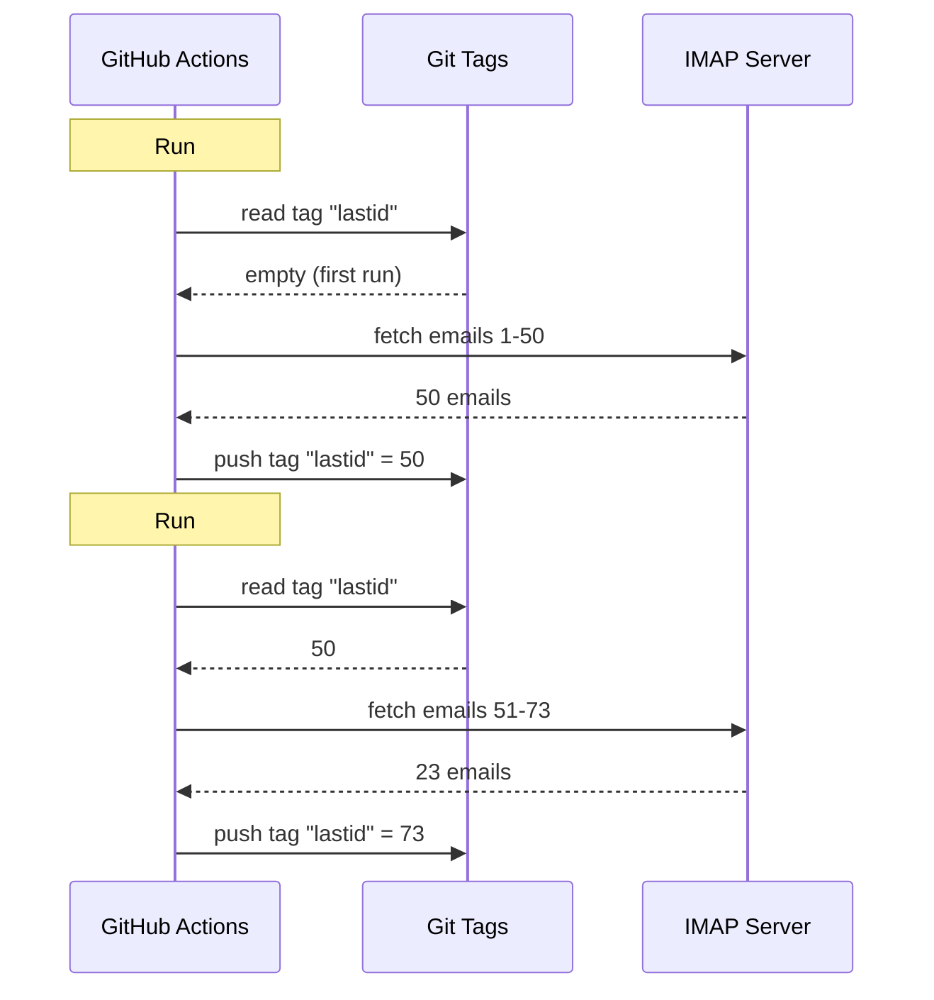

# I used git as a database to run a free bot on GitHub Actions

I've got an automatic email responder running 24/7.

It reads my emails, figures out what they're about, and replies all by itself with AI. It remembers previous conversations. It ignores newsletters and `noreply@` addresses. It forwards to a human when things get too hot.

Monthly cost: **$0**.

No server. No VPS. No database. Just GitHub Actions and one insane hack: **using git as a database**.

You see where this is going? No? Alright, hold on, this is dumb and brilliant at the same time.

---

## The problem: GitHub Actions is stateless

GitHub Actions is free. You can run a cron every 5 minutes, execute your code, for free.

But there's a catch: it's **stateless**.

Each run starts on a fresh machine. Nothing is saved between executions. The previous run? Forgotten. Wiped. Like it never existed.

For an email responder, that's a huge problem. Like:

> "What's the last email I already processed?"

If the bot forgets that every run, it'll either re-answer the same emails in a loop (disaster) or miss emails.

You need persistent state. And normally, persistent state = database. But a database means a server, and a server isn't free anymore.

That's where it gets interesting.

---

## The solution: git tags as a database

Your GitHub repo is already persistent storage. Free. Versioned. Always there.

So why not store state in it?

The idea: each run, the bot reads the last processed email UID from a **git tag**. It processes new emails. Then it re-pushes the tag with the new UID.



The git tag IS the database. A single value, but that's all you need.

### Reading state

At the start of the job, you grab the value from the tag:

```bash
git fetch origin --tags lastid || true
git show refs/tags/lastid:data/lastId > data/lastId || true
```

`git show refs/tags/lastid:data/lastId` means: "give me the content of file `data/lastId` as it was in the tag `lastid`".

Boom. You've got your value, no database needed.

### Writing state

At the end, you re-create the tag with the new value:

```bash
git switch --orphan lastid-tmp   # fresh branch with no history
git rm -rf .                      # wipe everything
mkdir -p data
printf "%s\n" "${LAST_ID_CONTENT}" > data/lastId

git add data/lastId
git commit -m "lastId snapshot"
git tag -f lastid                 # force tag onto this commit
git push --force ...origin lastid # push the tag
```

You create an **orphan** branch (no history), put just the `lastId` file, commit, tag, force push.

Why orphan? So you don't accumulate 10,000 state commits in the repo history. Each update overwrites the previous one. The tag always points to ONE single commit that holds ONE single value.

It's clean. It's free. It's completely broken xD

---

## The second hack: runtime snapshot

There's another problem with GitHub Actions: `npm install`.

If every run (every 5 minutes) you do `npm install` + `npm run build`, you waste 60-90 seconds each time. On a frequent cron, that's minutes of compute wasted for nothing.

Solution: pre-compile the code ONCE, and store it in a git tag too.

The build workflow (which runs when you push to `master`) does this:

```bash
# compile the code
bun install
bun run build

# store dist/ + node_modules/ in a "runtime" tag
git checkout --orphan temp-runtime
git rm -rf .
cp -r "$TMPDIR"/* .
git add dist node_modules package.json bun.lock data
git commit -m "runtime build"
git tag -f runtime
git push --force ...origin runtime
```

The `runtime` tag contains the compiled code AND `node_modules`. Ready to run.

And the cron checks out this tag directly:

```yaml
- name: Checkout runtime snapshot
  uses: actions/checkout@v4
  with:
    ref: refs/tags/runtime    # pre-built code, not the source
    fetch-depth: 1

# no npm install, no build!
- name: Process emails
  run: node dist/index.js --action
```

No install. No build. The cron starts instantly and just runs `node dist/index.js`.

So you have two tags doing two jobs:
- `runtime` = code ready to run (updated when you push code)
- `lastid` = persistent state (updated every run)

It's elegant as hell.

---

## The bot itself: AI auto-responder

Alright, the git hack is cool, but what does the bot actually do?

It reads your emails via IMAP, understands them with AI (Groq + Llama 3.3 70B), and replies automatically.

Clean service architecture with dependency injection (InversifyJS):

```
App
├── ImapService      → reads emails (IMAP)
├── SmtpService      → sends replies (SMTP)
├── ParserService    → parses email content
├── ReplyService     → generates AI reply
├── SummaryService   → conversation memory
├── AccountsService  → manages multiple email accounts
└── ConfigService    → config / env vars
```

### Two operation modes

The bot can run in two ways:

**Listener mode** (real-time): persistent IMAP connection with exponential reconnect. For a VPS.

```typescript
this.imapService.on("exists", async (data) => {
  console.log(`[MAIL] New email! Total: ${data.count}`);
  // process the new email immediately
});
```

**Action mode** (batch): processes new emails since `lastId`, then exits. For the GitHub Actions cron.

```bash
node dist/index.js --action
```

The `--action` mode is the one using the git hack. It reads `lastId`, processes what's new, writes the new `lastId`, done.

### Don't reply to robots

If your bot replies to EVERY email, it'll answer newsletters, notifications, `noreply@` addresses. Disaster. Worse: if two bots reply to each other, you get an infinite email loop. Nightmare.

So aggressive filtering:

```typescript
export function isAutomatedSender(address) {
  const automatedPatterns = [
    "noreply", "no-reply", "donotreply",
    "mailer-daemon", "postmaster", "bounce",
    "newsletter", "notification", "marketing",
    "billing", "receipt", "promo", ...
  ];
  const local = address.split("@")[0].toLowerCase();
  return automatedPatterns.some(p => local.includes(p));
}
```

And also detection via email headers:

```typescript
export function isAutomatedByHeaders(headers) {
  return (
    ["bulk", "list", "junk"].includes(headers.precedence) ||
    headers["auto-submitted"] !== "no" ||
    headers["list-unsubscribe"] !== "" ||   // newsletters have this
    /mailchimp|sendgrid|mailgun|brevo/i.test(headers["x-mailer"])
  );
}
```

`List-Unsubscribe` in headers? That's a newsletter. `Precedence: bulk`? Mass-mailing. `X-Mailer: Mailchimp`? You get the idea. We ignore.

It's like a bouncer at a nightclub: robots don't get in xD

### The magic triggers

The AI can decide not to reply at all, or to hand things over to a human. How? With special triggers in its response.

The system prompt tells it:

> If it's an automated email/newsletter → reply with `<no_reply>`
> If it's too important/sensitive (legal, financial...) → reply with `<manual_reply_required>`
> Otherwise → write a real response

And the code reads that:

```typescript
const aiReply = completion.choices[0].message.content.trim();
const manualTrigger = aiReply.includes(MANUAL_REPLY_TRIGGER);
const noReply = aiReply.includes(NO_REPLY_TRIGGER);

if (noReply) {
  console.log("[MAIL] AI decided to ignore. Skip.");
  return;
}

if (manualTrigger) {
  console.log("[MAIL] Too hot, forwarding to a human.");
  await this.smtpService.sendManualForward(...);
  return;
}

// otherwise send the AI reply
await this.smtpService.sendReply(...);
```

Like the AI has the right to say "nah I'm not touching this, get a real human". That's wisdom.

---

## Conversation memory

A detail that changes everything: the bot **remembers** conversations.

When it replies to someone, it saves a summary of the exchange. Next time that person writes, the summary gets re-injected into the prompt.

Storage: one JSON file per contact.

```
data/customers/
├── me%40gmail.com/
│   ├── alice%40example.com.json
│   └── bob%40client.fr.json
```

And the summary is itself generated by the AI, which merges the old summary with the new message:

```typescript
const completion = await groq.chat.completions.create({
  model: "llama-3.3-70b-versatile",
  messages: [
    { role: "system", content: "You are a memory assistant. Merge the old summary with the new message without losing info." },
    { role: "user", content: `Existing summary:\n${existing}\n\nNew message:\n${incomingContent}` }
  ],
  temperature: 0.0,  // deterministic, no creativity
  max_tokens: 800,
});
```

So the bot builds a compressed memory over time. No need to store every email, just a summary that grows intelligently.

And those JSON files? Well... they're also stored in git, in the runtime tag. Git everywhere xD

---

## The clever thing about prompt length

Small technical detail that made me smile.

Models have a token limit. If your email + summary + persona prompt exceed it, the API returns an error.

The code handles this with **cascading truncation** + retry:

```typescript
try {
  // first try with normal limits
  completion = await groq.chat.completions.create({...});
} catch (error) {
  if (!this.isLengthError(error)) throw error;

  // it was a length error: retry with tighter limits
  ({ systemContent, userContent } = this.buildPromptPayload({
    ...,
    limits: {
      systemPromptChars: 2200,  // instead of 3000
      summaryChars: 1800,       // instead of 4000
      personaChars: 900,        // instead of 1500
      userContentChars: 2200,   // instead of 8000
    },
  }));
  completion = await groq.chat.completions.create({...});  // retry
}
```

If it doesn't pass, you cut shorter and retry. Simple, effective, no crash.

---

## So, concretely, how does it run?

The full flow of a cron run:

```
1. GitHub Actions triggers (cron every 5 min)
2. Checkout of "runtime" tag (pre-built code)
3. git show refs/tags/lastid → gets the last processed UID
4. node dist/index.js --action
   ├── IMAP connection
   ├── fetch emails since lastId+1
   ├── for each email:
   │   ├── parse content
   │   ├── filter robots (skip if automated)
   │   ├── match recipient account
   │   ├── fetch conversation memory
   │   ├── generate AI reply (Groq)
   │   ├── <no_reply> ? skip
   │   ├── <manual_reply_required> ? forward to human
   │   ├── otherwise: send reply (SMTP)
   │   └── update conversation memory
   └── write new lastId
5. git push --force tag "lastid" with the new value
```

And it starts again in 5 minutes. Forever. Free.

---

**The 3 things to remember:**

1. **Git = free database** -- An orphan tag can store your persistent state between stateless runs. `git show refs/tags/X:file` to read, force-push to write. No DB needed.

2. **Pre-compile into a runtime tag** -- Instead of `npm install` every cron run, store the compiled code + node_modules in a git tag. The cron starts instantly.

3. **An AI bot must know when to shut up** -- The `<no_reply>` and `<manual_reply_required>` triggers let the AI decide not to reply or to hand things off. Plus anti-robot filtering. Otherwise you create an infinite email loop.

Serverless cron with persistent state, AI, memory, all at $0/month. It's completely broken and I love it xD
