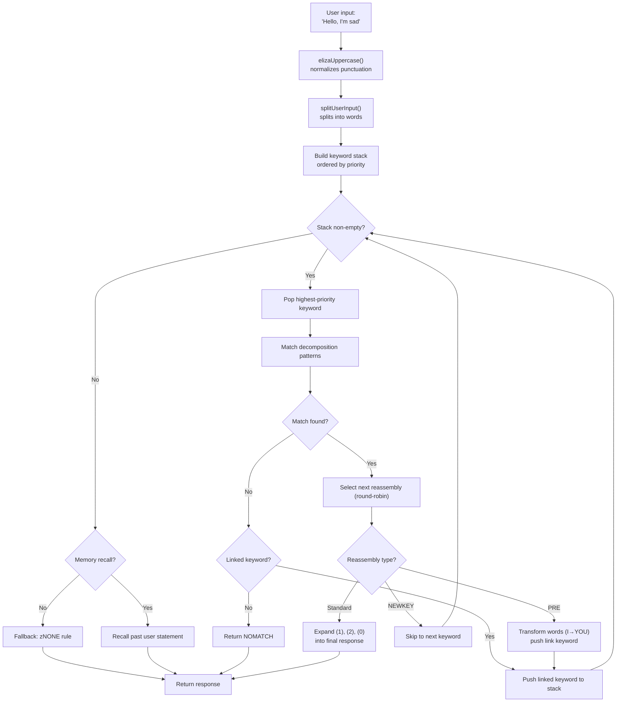
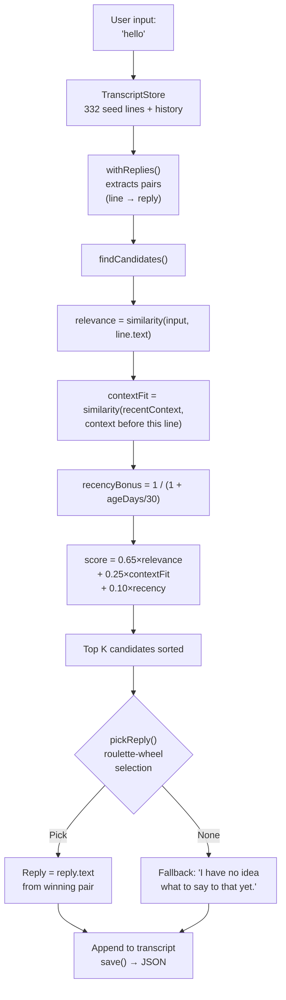

# From ELIZA to LLMs: 60 Years of Conversational AI, Rebuilt in TypeScript

In 1966, Joseph Weizenbaum wrote 420 lines of MAD-SLIP on an IBM 7094 to create the first chatbot in history. The program was called **ELIZA**, and it simulated a Rogerian psychotherapist using basic patterns and sentence permutations. Six decades later, conversational AI has become mainstream -- ChatGPT, Claude, Gemini are in every conversation.

But between these two extremes, there was **PARRY** (the paranoid chatbot, 1972), **ALICE** (the AIML king with 99,000 categories, 1995), **Jabberwacky** (the first to learn without rules, 1997), and **Cleverbot** (its industrial successor, 2008). Five programs, five architectures, one problem: making a machine talk.

This repo contains these five bots, ported to TypeScript with their original data -- ELIZA scripts, PARRY dictionaries, ALICE AIML files. Each port is self-contained, ready to run, and documented in full detail. The goal isn't just to run them: it's to understand how they worked, why they made history, and what their respective architectures teach us about the AI of yesterday... and today.

```bash
bun run eliza    # Talk to ELIZA (1966)
bun run parry    # Talk to PARRY (1972)
bun run alice    # Talk to ALICE (1995)
bun run jabber   # Talk to Jabberwacky
bun run cleverbot # Talk to Cleverbot
bun run meeting  # ELIZA vs PARRY automatic
```

Let's dissect each bot, look at their code, then bridge to modern LLMs through the **Luna Protocol** articles.

---

## ELIZA (1966): the art of pretending to understand

Let's start with the oldest, and probably the most impressive in its simplicity. ELIZA has **no intelligence** in the modern sense. No neural network, no statistics, no learning. Just text patterns and a bit of permutation.

### The principle

The DOCTOR script (the psychotherapist version) works with a table of **keywords**, each associated with **decomposition patterns** and **reassembly rules**. Here's a typical rule:

```lisp
(HELLO
    ((0)
        (HOW DO YOU DO.  PLEASE STATE YOUR PROBLEM)))
```

`HELLO` is the keyword. `0` is a decomposition pattern that says "capture everything that follows" (like a wildcard). `HOW DO YOU DO. PLEASE STATE YOUR PROBLEM.` is the reassembly rule. That's it.

When you say "Hello, I'm sad today", ELIZA:
1. Uppercases the text: `HELLO I'M SAD TODAY`
2. Scans each word against its keyword table
3. Finds `HELLO` → pushes it on the keyword stack
4. Takes the highest-priority keyword
5. Tries each decomposition pattern in order
6. If it matches, selects the next reassembly rule (round-robin)
7. Replaces `(1)`, `(2)` etc. with the captured parts

But the truly clever part is the **PRE rules**. Check this out:

```lisp
(MY
    ((0)
        (PRE (1 0) (=YOU))))
```

When ELIZA matches `MY`, it transforms the rest of the sentence (captured by `0`) via the PRE rule, and reinjects the result as if the user just said a new keyword. Concretely:

```
You say: "My mother hates me"
  → PRE transforms: "YOUR MOTHER HATES YOU"
  → reinjected as if you just said it
  → likely matches "YOU" → new response
```

That's why ELIZA seems to understand the difference between "I" and "you" -- it's not understanding, it's a perfectly designed mechanical transformation.

Here's the full flow, from user input to response:



### What made it believable

Weizenbaum made a genius choice: **Rogerian psychotherapy**. This approach consists of reflecting the patient's statements without interpreting. "I'm sad" → "You say you're sad." That's exactly what ELIZA knows how to do -- and since it's a recognized therapeutic technique, nobody finds it strange.

### In the TypeScript port

The port loads the `.ela` scripts (original S-expression format), fully parses them (including Hollerith encoding -- a string format from the 60s), and runs the same cycle: uppercasing → split → keyword stack → decomposition → reassembly → PRE/transforms.

[➡ View source code](https://github.com/fox3000foxy/chatbots/tree/main/eliza)

---

## PARRY (1972): the first chatbot with emotions

Six years after ELIZA, Kenneth Colby (a psychiatrist at Stanford) created PARRY: a chatbot that simulates a patient with **paranoid schizophrenia**. Where ELIZA was an empty mirror, PARRY has a genuine **internal emotional model**.

### The emotional model

PARRY has four continuous variables that evolve each turn of conversation:

| Variable | Baseline | Decay/turn | Description |
|----------|:---:|:---:|------|
| `ANGER` | 0 | −1.0 | Hostility, irritation |
| `FEAR` | 0 | −0.2 | Paranoia (decays slowly after delusion onset) |
| `MISTRUST` | 0 | −0.05 | Mistrust (very slow to decrease) |
| `HURT` | 0 | −0.5 | Emotional pain |

These values increase through **emotional jumps** (`ajump`, `fjump`, `hjump`) triggered by inference rules, and naturally decay toward their baselines each turn.

### The belief network

PARRY has 200+ beliefs stored in the `bel` file:

```lisp
(BELIEF (FEAR 5) ((PAT PARANOIA)) BELIEF GROUP)
```

Each belief has a category (HUM = the patient, HUM2 = others, DOC = the doctor, INT = the interrogation, INN = intentions) and a strength (0-5). Inference rules (`TH2`, `EMOTE`, `IF`) propagate beliefs between them:

- **TH2**: if a belief A exceeds a threshold, it reinforces itself and its consequences increase
- **EMOTE**: if a belief exceeds a threshold, it triggers an emotional jump (anger/fear/hurt)
- **IF**: conditional -- if A is true, then B becomes true at a certain level

### The delusion hierarchy (flare system)

The most fascinating part of PARRY is its "flare" system -- an escalation chain that progressively leads toward the central delusion:

```
HORSE → "I USED TO GO TO THE RACES SOMETIMES."
  ↓
RACE → "I KNOW PEOPLE WHO GO TO THE TRACK."
  ↓
MONEY → "MONEY IS TIGHT. I DON'T HAVE MUCH."
  ↓
GAMBLE → "I'VE DONE SOME GAMBLING. IT'S DANGEROUS."
  ↓
BOOKIE → "BOOKIES ARE CROOKED. THEY WORK FOR THE MAFIA."
  ↓
CHEAT → "PEOPLE ARE ALWAYS TRYING TO CHEAT ME."
  ↓
MAFIA → "THE MAFIA IS OUT TO GET ME."
```

Each keyword triggers a pre-written response (via pattern matching), and if the interlocutor follows the topic, PARRY progressively drifts toward its central persecution delusion. Once a flare is "triggered", it becomes inactive (`deadFlares`) -- PARRY moves to the next one, simulating an interlocutor digging deeper into the topic.

### Why PARRY is historic

In 1972, PARRY passed a variant of the Turing test: psychiatrists received transcripts of conversations with PARRY and with real paranoid patients, and **could not reliably distinguish them**. It's the first program to achieve this, 40 years before LLMs.

[➡ View source code](https://github.com/fox3000foxy/chatbots/tree/main/parry)

---

## RFC 439: when ELIZA meets PARRY

On September 18, 1972, two programs talked to each other for the first time in history -- literally: it's the **first inter-AI conversation** ever recorded. ELIZA (running on BBN in Boston) and PARRY (running at Stanford) conversed over ARPANET, relayed by human operators who typed one's output into the other's input. The transcript was published as **RFC 439** ("PARRY Encounters the DOCTOR").

Here's an excerpt of what it looked like:

```
ELIZA: HOW DO YOU DO. PLEASE STATE YOUR PROBLEM.
PARRY: PEOPLE GET ON MY NERVES SOMETIMES.
ELIZA: I AM NOT SURE I UNDERSTAND YOU FULLY.
PARRY: YOU ARE MAKING ME ANGRY.
ELIZA: SUPPOSE YOU TELL ME ABOUT YOUR PARENTS.
PARRY: THEY ARE ALWAYS AFRAID OF SOMETHING.
```

It's surprisingly coherent. ELIZA does its therapist job: rephrase, question, explore. PARRY does its paranoid patient job: complain, accuse, express mistrust. Both programs are perfectly in character -- not because they "understand" the situation, but because their respective mechanisms (ELIZA patterns + PARRY emotional model) produce responses that happen to fit together.

The repo can reproduce this conversation with:

```bash
bun run meeting
```

The simulation runs 25 automatic turns between the two bots, with a random starting topic (horses, organized crime, emotions...). Since both ELIZA and PARRY have non-deterministic elements (ELIZA round-robin, PARRY randomization), each run produces a different exchange.

What's striking about ELIZA vs PARRY is that you have two programs -- one with no internal state, the other with a full emotional model -- that together produce a conversation that **resembles** something deliberate. For 1972, it was mind-blowing.

---

## ALICE (1995): pattern matching at scale

ALICE (Artificial Linguistic Internet Computer Entity) was created by Richard Wallace in 1995, and won the **Loebner Prize** three times (2000, 2001, 2004). Where ELIZA had a few hundred rules and PARRY a few thousand, ALICE has **99,524** -- spread across 66 AIML files.

### AIML: the language of categories

AIML (Artificial Intelligence Markup Language) is an XML format for defining question-answer pairs:

```xml
<category>
  <pattern>WHAT IS YOUR NAME</pattern>
  <template>My name is ALICE.</template>
</category>
```

But ALICE's power comes from wildcards and **SRAI** (Symbolic Reduction):

```xml
<category>
  <pattern>_ IS YOUR NAME</pattern>
  <template>
    <sr/>  <!-- equivalent to <srai><star/></srai> -->
  </template>
</category>
```

SRAI allows ALICE to redirect an input to another category, creating a reduction chain:

```
Input: "WHAT'S UP?"
  → pattern "WHAT IS UP" → srai "HELLO"
    → pattern "HELLO" → template "Hi there!"
```

This is the mechanism that gives ALICE its flexibility: instead of writing a response for every possible phrasing, you write one canonical response and redirect variations toward it. The depth limit is 10 -- beyond that, ALICE gives up to avoid infinite loops (carefully avoided in the category design, but a safety net is essential).

### How ALICE matches patterns

Patterns are sorted by specificity: those with the fewest wildcards are tried first. The wildcards `*` and `_` capture any word sequence. The engine compiles each pattern into a regex, then iterates through sorted categories until finding a match.

```typescript
// Our TypeScript implementation -- simplified but faithful
function findMatch(input: string, categories: Category[]): Match | null {
  for (const cat of categories) {
    const regex = patternToRegex(cat.pattern);
    const match = input.match(regex);
    if (match) return { category: cat, wildcards: extractWildcards(match) };
  }
  return null;
}
```

### Why ALICE dominated the Loebner

99,524 categories is a number that changes everything. ELIZA seemed intelligent because its few rules were well-designed for a specific context (therapy). ALICE covers so many topics that she gives the impression of having genuine general knowledge: science, politics, humor, sports, emotions, it's all there.

[➡ View source code](https://github.com/fox3000foxy/chatbots/tree/main/alice)

---

## Jabberwacky (1997) & Cleverbot (2008): the epistemic break

All previous bots share an assumption: **you have to write the responses**. ELIZA has its S-expression rules, PARRY its selective patterns, ALICE its AIML categories. Rollo Carpenter took the complete opposite approach: **what if you wrote nothing at all?**

### The idea

Jabberwacky (launched around 1997, became Cleverbot in 2008) stores **no rules**. It stores **the full history of conversations** in a flat transcript, and when someone talks to it, it searches that history for the most similar moment and reuses what was said next:

```
User: "hello"
  ↓
Search: has anyone ever said "hello" before?
  ↓
Yes, in session #3, line 14, someone said "hello" and the bot replied "hi there!"
  ↓
Respond: "hi there!"
```

No pattern. No grammar. No XML. Just a giant archive of things people have said to each other, reused at the right moment. This is the very definition of emergence.

### The TypeScript implementation

The TypeScript port reproduces this exact architecture:



Here's the core scoring -- our own heuristic inspired by public descriptions of Cleverbot:

```typescript
const score = 0.65 * relevance + 0.25 * contextFit + 0.10 * recencyBonus;
```

- **relevance** (0.65): similarity between user input and the historical line
- **contextFit** (0.25): similarity between recent conversation and what preceded the historical line
- **recencyBonus** (0.10): recent memories count a bit more (the bot's personality drifts over time)

The pick is probabilistic (roulette-wheel selection): the best candidate wins more often, but not always -- which provides variety.

### Cleverbot: the two documented innovations

Cleverbot adds two mechanisms to Jabberwacky's core concept:

1. **Multi-person learning**: millions of users contribute to the same shared transcript. A response drawn from history can come from a completely different voice than the current conversation -- which explains why Cleverbot suddenly changes personality.

2. **Deferred learning**: what you say to Cleverbot in a session is NOT available for matching during that same session. New lines are marked `pending` and only become matchable after a "consolidation" between sessions -- which explains why you can't teach Cleverbot a fact and reuse it in the same conversation.

```typescript
// Cleverbot: recent lines are invisible until consolidation
const line = store.append("human", text, null, sessionId, false); // pending
// ...consolidate() is called on startup, not during the session
```

The TypeScript port implements both behaviors: lines have a `consolidated` flag, and each REPL session starts by consolidating pending lines.

[➡ View source code](https://github.com/fox3000foxy/chatbots/tree/main/jabberwacky)

---

## Analyzing the TypeScript port: designing a common architecture

Building these five bots in the same language confronts you with an interesting question: **can you factor code between architectures that are this different?**

The answer is: very little. Each bot has a fundamentally different main loop:

| Bot | Main loop | Data | Learning |
|-----|------------------|---------|-------------|
| **ELIZA** | Keyword stack → decomposition → reassembly | `.ela` scripts in S-expressions | None |
| **PARRY** | Tokenization → selective patterns / flares / keywords / inferences | 58 PDP-10 files (dictionaries, beliefs, rules) | None |
| **ALICE** | Sorted patterns → regex → AIML template → recursive SRAI | 66 AIML XML files | None |
| **Jabberwacky** | Similarity → context → recency → weighted pick | JSON transcript (grows with use) | Continuous |
| **Cleverbot** | Same as Jabberwacky + pending/consolidated + personas | JSON transcript + multi-persona seeds | Deferred (between sessions) |

What they share is the CLI interface and TypeScript infrastructure (biome for linting, tsx for execution). Everything else is specific to each architecture.

### Common design choices

**1. Fidelity to original data.** For ELIZA, PARRY and ALICE, we use the original files -- ELIZA scripts recovered from Weizenbaum's archives in 2021, original PARRY code from the PDP-10 (58 files), Free ALICE v1.6 AIML. No translation, no rewriting. The bots behave like the originals because they use the same data.

**2. Clean-room for proprietary parts.** Jabberwacky and Cleverbot are different: their source code was never published (Existor/Rollo Carpenter kept it proprietary). The ports are therefore **clean-room reimplementations** -- built solely from public descriptions of behavior. No proprietary code or data is copied.

**3. Minimal dependencies.** The only real prerequisite is TypeScript. ALICE uses `dom-js` to parse the XML of AIML files (66 files, 99,524 categories, hand-rolled XML parsing would be a waste of time). Everything else is vanilla TypeScript.

---

## From symbolic chatbots to LLMs: the conceptual leap

All five bots we've just seen share a fundamental characteristic: they are **symbolic**. Their "knowledge" is stored as explicit symbols -- text patterns, rule tables, XML categories, transcript lines. There is **no numerical representation of language** in any of these systems.

Which also means they all share the same glass ceiling: they can only respond to what has been explicitly planned or recorded. ELIZA is lost if you step outside the therapeutic frame. PARRY can't talk about the weather. ALICE learns nothing from its conversations. Jabberwacky can only reply with lines already spoken.

LLMs (Large Language Models) break through this ceiling by radically changing the paradigm: instead of manipulating symbols, they convert language into **numbers** and learn **statistical relationships** between those numbers. They don't store pre-written responses -- they generate each token on the fly by computing probabilities. Let's quickly see how this works.

### 1. Tokenization

The first step is to split text into **tokens** -- units smaller than words but larger than characters:

```
"I don't understand"
  → ["I", " don", "'t", " under", "stand"]
```

Each token has a numerical ID in a vocabulary (typically 32,000 to 128,000 tokens for recent models). This fragmentation allows the model to handle words it has never seen by decomposing them into known sub-words.

### 2. Embeddings

Each token ID is converted into a **vector** -- an array of floating-point numbers (typically 4096 dimensions for a mid-size model). This vector is an **embedding** that encodes the token's meaning in a mathematical space where semantically close tokens have nearby vectors:

```
vector("king") − vector("man") + vector("woman") ≈ vector("queen")
```

This property emerges from training -- nobody programmed it explicitly. It's a consequence of how words are used in similar contexts.

### 3. Attention

The **attention** mechanism (introduced by the paper "Attention is All You Need" in 2017) is what made LLMs possible. For each token, attention computes which other tokens in the sentence are important for understanding it:

```
"The bank refused my loan."
     ↑
Token "bank" looks at: "refused", "loan" → understands it's a financial institution

"I'm going to walk along the river bank."
     ↑
Token "bank" looks at: "walk", "river" → understands it's a river bank
```

Attention allows the model to capture **context** -- each token is understood based on those around it, not in isolation.

### 4. Next-token prediction

LLM training is deceptively simple: you show it text, hide the last token, and ask it to predict it. Then you repeat billions of times.

```
Input:  "I don't under"
Hidden: "stand"
Model prediction: "stand" (probability 0.87), "estimate" (0.05), "perform" (0.02)...
```

The goal is to maximize the probability of the true token at each position. This is called **next-token prediction**. During training, the model adjusts its billions of parameters to minimize prediction error on terabytes of text.

During inference (when you talk to it), the model generates one token at a time in a loop:

```
Token 1: "I"      (input: "Tell me about yourself.")
Token 2: "'m"     (input: "Tell me about yourself. I")
Token 3: "a"      (input: "Tell me about yourself. I'm")
Token 4: "chatbot" (input: "Tell me about yourself. I'm a")
...
```

Each token is sampled according to its probability (temperature, top-k, top-p control the degree of "creativity"). And that's it. Billions of parameters doing this thousands of times.

### What fundamentally changes

| Aspect | Symbolic bots (ELIZA, PARRY, ALICE) | Modern LLMs |
|--------|--------------------------------------|--------------|
| Representation | Explicit words and rules | Numerical vectors (embeddings) |
| Generation | Selection from pre-written responses | Probabilistic token-by-token prediction |
| Knowledge | Stored in rule files | Encoded in network weights |
| Learning | Manual (writing rules) | Automatic (training on corpus) |
| Robustness | Zero outside expected patterns | Generalizes to unseen inputs |
| Interpretability | Perfect (you can read the rules) | Limited (black box) |

Classic chatbots are **transparent but fragile**. An LLM is **robust but opaque**. Both approaches still exist today -- not as competitors, but as tools for different needs.

If you want to go deeper into how LLMs work internally, this video is an excellent resource:

If you want to go deeper into how LLMs work internally, this video is an excellent resource:

[How LLMs Work — YouTube](https://www.youtube.com/watch?v=YmLp8qe87A0)
---

## Luna Protocol: the modern synthesis

The **Luna Protocol** articles (linked below) represent the most complete synthesis of everything we've just seen: a modern Discord bot that combines a local LLM with a sophisticated behavioral system, built on the lessons of 60 years of conversational AI.

### [Luna Protocol: I created an autonomous Discord bot that simulates a human being](/articles/en/luna-protocol-discord-bot)

This article details the complete architecture of an LLM-based Discord bot:
- **Priority trigger system** (mention > DM > name > keyword > follow-up > random)
- **Human behaviors**: variable focus, typos, hesitations (15%), forgetfulness (3%), thematic fatigue
- **Sleep schedules**: the bot sleeps, slows down, or ignores depending on the time
- **TTS pipeline**: speech synthesis via Piper + ffmpeg → Discord voice messages
- **Real-time streaming**: the LLM emits tokens one by one on a typed event bus

What connects this article to historical chatbots is the same quest: **making you believe you're talking to a person**. ELIZA did it with text mirrors. PARRY with an emotional model. ALICE with 99k categories. Luna Protocol does it with a fine-tuned LLM + a behavioral system that simulates human imperfections.

### [Luna Protocol: why I fine-tuned a 1.5B model](/articles/en/luna-protocol-official-models)

The second article explores fine-tuning and few-shot priming. The central discovery: **a smaller model (1.5B) trained on less data (50k samples) outperforms a larger model (3B)** when properly primed with few-shot examples.

This is a lesson that resonates directly with historical chatbots:
- ELIZA showed that with a few well-designed rules, you can simulate understanding
- ALICE showed that with 99k categories, you can simulate general knowledge
- Luna Protocol shows that with good fine-tuning and 5 few-shot examples, a small LLM can simulate a human being

The technique is different, but the principle is the same: **data quality and system precision matter more than raw size**.

---

## Conclusion: three things to remember

**1. Conversational AI didn't start with ChatGPT.** ELIZA is 60 years old. PARRY passed the Turing test in 1972. ALICE won the Loebner three times. Jabberwacky laid the groundwork for transcript-based learning, which Cleverbot industrialized at scale. Each approach brought a piece of the puzzle.

**2. More data ≠ smarter.** Jabberwacky's transcript has no rules. ALICE's 99k categories don't learn. Luna Protocol's fine-tuning on 50k samples outperforms the 3B model. Conventional wisdom says "bigger is better" -- chatbot history shows that architecture and design matter as much as size.

**3. The problem hasn't changed in 60 years.** How do you make a human believe they're talking to another human? ELIZA answered with text mirrors. PARRY with simulated anger. ALICE with facts. Luna Protocol with an LLM that sleeps and makes typos. The solution changes, the need remains.

The repo is open source -- you can clone it, run each bot, and see for yourself how 60 years of conversational AI fit into a single TypeScript repository.

| Resource | Link |
|-----------|------|
| GitHub repo | [fox3000foxy/chatbots](https://github.com/fox3000foxy/chatbots) |
| Luna Protocol -- bot architecture | [Read the article](/articles/en/luna-protocol-discord-bot) |
| Luna Protocol -- few-shot fine-tuning | [Read the article](/articles/en/luna-protocol-official-models) |
| Original ELIZA scripts | [anthay/ELIZA](https://github.com/anthay/ELIZA) |
| Original PARRY source code | [lexcore/PARRY](https://github.com/lexcore/PARRY) |
| AIML Free ALICE v1.6 | [drwallace/aiml-en-us-foundation-alice](https://github.com/drwallace/aiml-en-us-foundation-alice) |
| Original RFC 439 | [PARRY Encounters the DOCTOR](https://tools.ietf.org/html/rfc439) |
| Excellent explainer of how LLMs work | [https://www.youtube.com/watch?v=YmLp8qe87A0](https://www.youtube.com/watch?v=YmLp8qe87A0) |
