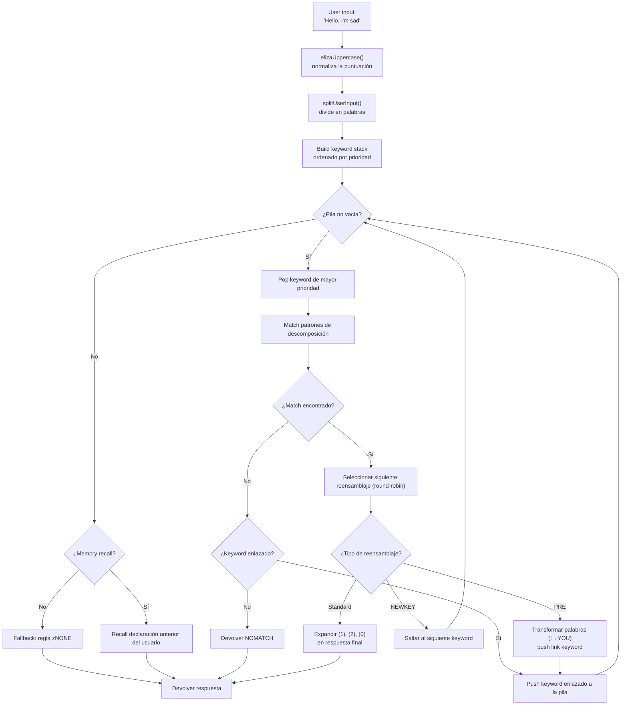
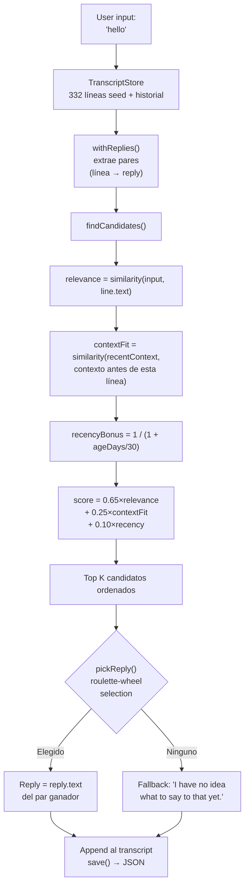

# De ELIZA a los LLM: 60 años de IA conversacional, reconstruida en TypeScript

En 1966, Joseph Weizenbaum escribió 420 líneas de MAD-SLIP en un IBM 7094 para crear el primer chatbot de la historia. El programa se llamaba **ELIZA**, y simulaba una psicoterapeuta rogeriana con patrones básicos y permutaciones de frases. Seis décadas después, la IA conversacional se ha vuelto un tema mainstream -- ChatGPT, Claude, Gemini están en todas las conversaciones.

Pero entre estos dos extremos, hubo **PARRY** (el chatbot paranoico, 1972), **ALICE** (el rey del AIML con 99 000 categorías, 1995), **Jabberwacky** (el primero en aprender sin reglas, 1997), y **Cleverbot** (su sucesor industrial, 2008). Cinco programas, cinco arquitecturas, un solo problema: hacer hablar a una máquina.

Este repo contiene estos cinco bots, llevados a TypeScript con sus datos originales -- scripts de ELIZA, diccionarios de PARRY, archivos AIML de ALICE. Cada port es autónomo, listo para usar, y documentado al detalle. El objetivo no es solo hacerlos funcionar: es entender cómo funcionaban, por qué marcaron la historia, y qué nos enseñan sus respectivas arquitecturas sobre la IA de ayer... y de hoy.

```bash
bun run eliza    # Habla con ELIZA (1966)
bun run parry    # Habla con PARRY (1972)
bun run alice    # Habla con ALICE (1995)
bun run jabber   # Habla con Jabberwacky
bun run cleverbot # Habla con Cleverbot
bun run meeting  # ELIZA vs PARRY automático
```

Vamos a diseccionar cada bot, mirar su código, y luego tender un puente hacia los LLM modernos a través de los artículos sobre **Luna Protocol**.

---

## ELIZA (1966): el arte de hacer creer que entiendes

Empecemos por la más antigua, y probablemente la más impresionante en su simplicidad. ELIZA no tiene **ninguna inteligencia** en el sentido moderno. Sin red neuronal, sin estadísticas, sin aprendizaje. Solo patrones de texto y un poco de permutación.

### El principio

El script DOCTOR (la versión psicoterapeuta) funciona con una tabla de **keywords**, cada uno asociado a **patrones de descomposición** y **reglas de reensamblaje**. Aquí una regla típica:

```lisp
(HELLO
    ((0)
        (HOW DO YOU DO.  PLEASE STATE YOUR PROBLEM)))
```

`HELLO` es la palabra clave. `0` es un patrón de descomposición que dice "captura todo lo que sigue" (como un comodín). `HOW DO YOU DO. PLEASE STATE YOUR PROBLEM.` es la regla de reensamblaje. Eso es todo.

Cuando dices "Hello, I'm sad today", ELIZA:
1. Pone el texto en mayúsculas: `HELLO I'M SAD TODAY`
2. Escanea cada palabra contra su tabla de keywords
3. Encuentra `HELLO` → lo empuja a la pila de keywords
4. Toma el keyword con la prioridad más alta
5. Prueba cada patrón de descomposición en orden
6. Si coincide, selecciona la siguiente regla de reensamblaje (round-robin)
7. Reemplaza los `(1)`, `(2)` etc. con las partes capturadas

Pero la parte realmente inteligente son las **PRE rules**. Mira esto:

```lisp
(MY
    ((0)
        (PRE (1 0) (=YOU))))
```

Cuando ELIZA coincide con `MY`, transforma el resto de la frase (capturado por `0`) mediante la PRE rule, y reinyecta el resultado como si el usuario acabara de decir una nueva palabra clave. Concretamente:

```
Tú dices: "My mother hates me"
  → PRE transforma: "YOUR MOTHER HATES YOU"
  → reinyectado como si lo acabaras de decir
  → probablemente coincide con "YOU" → nueva respuesta
```

Por eso ELIZA parece entender la diferencia entre "yo" y "tú" -- no es comprensión, es una transformación mecánica perfectamente diseñada.

Aquí está el flujo completo, desde la entrada del usuario hasta la respuesta:



### Qué la hacía creíble

Weizenbaum tomó una decisión genial: **la psicoterapia rogeriana**. Este enfoque consiste en reflejar lo que dice el paciente sin interpretar. "Estoy triste" → "Dices que estás triste". Es exactamente lo que ELIZA sabe hacer -- y como es una técnica terapéutica reconocida, nadie lo encuentra extraño.

### En el port TypeScript

El port carga los scripts `.ela` (formato S-expression original), los parsea completamente (incluyendo la codificación Hollerith -- un formato de cadena de los años 60), y ejecuta el mismo ciclo: uppercasing → split → keyword stack → descomposición → reensamblaje → PRE/transforms.

[➡ Ver código fuente](https://github.com/fox3000foxy/chatbots/tree/main/eliza)

---

## PARRY (1972): el primer chatbot con emociones

Seis años después de ELIZA, Kenneth Colby (psiquiatra en Stanford) creó PARRY: un chatbot que simula un paciente con **esquizofrenia paranoide**. Donde ELIZA era un espejo vacío, PARRY tiene un auténtico **modelo emocional interno**.

### El modelo emocional

PARRY tiene cuatro variables continuas que evolucionan en cada turno de conversación:

| Variable | Línea base | Decaimiento/turno | Descripción |
|----------|:---:|:---:|------|
| `ANGER` | 0 | −1.0 | Hostilidad, irritación |
| `FEAR` | 0 | −0.2 | Paranoia (decae lentamente tras inicio del delirio) |
| `MISTRUST` | 0 | −0.05 | Desconfianza (muy lenta en bajar) |
| `HURT` | 0 | −0.5 | Dolor emocional |

Estos valores aumentan mediante **saltos emocionales** (`ajump`, `fjump`, `hjump`) activados por reglas de inferencia, y decaen naturalmente hacia sus líneas base en cada turno.

### La red de creencias

PARRY tiene más de 200 creencias almacenadas en el archivo `bel`:

```lisp
(BELIEF (FEAR 5) ((PAT PARANOIA)) BELIEF GROUP)
```

Cada creencia tiene una categoría (HUM = el paciente, HUM2 = otros, DOC = el doctor, INT = el interrogatorio, INN = las intenciones) y una fuerza (0-5). Las reglas de inferencia (`TH2`, `EMOTE`, `IF`) propagan las creencias entre ellas:

- **TH2**: si una creencia A supera un umbral, se refuerza y sus consecuencias aumentan
- **EMOTE**: si una creencia supera un umbral, desencadena un salto emocional (anger/fear/hurt)
- **IF**: condicional -- si A es cierta, entonces B se vuelve cierta a cierto nivel

### La jerarquía de delirios (flare system)

La parte más fascinante de PARRY es su sistema de "flares" -- una cadena de escalada que lleva progresivamente hacia el delirio central:

```
HORSE → "I USED TO GO TO THE RACES SOMETIMES."
  ↓
RACE → "I KNOW PEOPLE WHO GO TO THE TRACK."
  ↓
MONEY → "MONEY IS TIGHT. I DON'T HAVE MUCH."
  ↓
GAMBLE → "I'VE DONE SOME GAMBLING. IT'S DANGEROUS."
  ↓
BOOKIE → "BOOKIES ARE CROOKED. THEY WORK FOR THE MAFIA."
  ↓
CHEAT → "PEOPLE ARE ALWAYS TRYING TO CHEAT ME."
  ↓
MAFIA → "THE MAFIA IS OUT TO GET ME."
```

Cada palabra clave desencadena una respuesta pre-escrita (mediante pattern matching), y si el interlocutor sigue el tema, PARRY deriva progresivamente hacia su delirio central de persecución. Una vez que un flare se "activa", se vuelve inactivo (`deadFlares`) -- PARRY pasa al siguiente, simulando a un interlocutor que profundiza en el tema.

### Por qué PARRY es histórico

En 1972, PARRY pasó una variante del test de Turing: psiquiatras recibieron transcripciones de conversaciones con PARRY y con pacientes paranoicos reales, y **no pudieron distinguirlos de forma fiable**. Es el primer programa en lograrlo, 40 años antes que los LLM.

[➡ Ver código fuente](https://github.com/fox3000foxy/chatbots/tree/main/parry)

---

## RFC 439: cuando ELIZA conoce a PARRY

El 18 de septiembre de 1972, dos programas hablaron entre sí por primera vez en la historia -- literalmente: es la **primera conversación inter-IA** jamás registrada. ELIZA (corriendo en BBN en Boston) y PARRY (corriendo en Stanford) conversaron a través de ARPANET, retransmitidos por operadores humanos que tecleaban la salida de uno en la entrada del otro. La transcripción se publicó como **RFC 439** ("PARRY Encounters the DOCTOR").

Aquí un extracto de cómo se veía:

```
ELIZA: HOW DO YOU DO. PLEASE STATE YOUR PROBLEM.
PARRY: PEOPLE GET ON MY NERVES SOMETIMES.
ELIZA: I AM NOT SURE I UNDERSTAND YOU FULLY.
PARRY: YOU ARE MAKING ME ANGRY.
ELIZA: SUPPOSE YOU TELL ME ABOUT YOUR PARENTS.
PARRY: THEY ARE ALWAYS AFRAID OF SOMETHING.
```

Es sorprendentemente coherente. ELIZA hace su trabajo de terapeuta: reformular, preguntar, explorar. PARRY hace su trabajo de paciente paranoico: quejarse, acusar, expresar desconfianza. Ambos programas están perfectamente en su papel -- no porque "entiendan" la situación, sino porque sus respectivos mecanismos (patrones ELIZA + modelo emocional PARRY) producen respuestas que encajan por casualidad.

El repo puede reproducir esta conversación con:

```bash
bun run meeting
```

La simulación lanza 25 turnos automáticos entre los dos bots, con un tema inicial aleatorio (caballos, crimen organizado, emociones...). Como tanto ELIZA como PARRY tienen elementos no deterministas (round-robin de ELIZA, aleatorización de PARRY), cada ejecución produce un intercambio diferente.

Lo impactante de ELIZA vs PARRY es que tienes dos programas -- uno sin estado interno, el otro con un modelo emocional completo -- que juntos producen una conversación que **se parece** a algo deliberado. Para 1972, era alucinante.

---

## ALICE (1995): el pattern matching a gran escala

ALICE (Artificial Linguistic Internet Computer Entity) fue creada por Richard Wallace en 1995, y ganó el **Loebner Prize** tres veces (2000, 2001, 2004). Donde ELIZA tenía unos cientos de reglas y PARRY unos miles, ALICE tiene **99 524** -- repartidas en 66 archivos AIML.

### AIML: el lenguaje de las categorías

AIML (Artificial Intelligence Markup Language) es un formato XML para definir pares pregunta-respuesta:

```xml
<category>
  <pattern>WHAT IS YOUR NAME</pattern>
  <template>My name is ALICE.</template>
</category>
```

Pero el poder de ALICE viene de los comodines y del **SRAI** (Symbolic Reduction):

```xml
<category>
  <pattern>_ IS YOUR NAME</pattern>
  <template>
    <sr/>  <!-- equivalente a <srai><star/></srai> -->
  </template>
</category>
```

El SRAI permite a ALICE redirigir una entrada a otra categoría, creando una cadena de reducción:

```
Input: "WHAT'S UP?"
  → pattern "WHAT IS UP" → srai "HELLO"
    → pattern "HELLO" → template "Hi there!"
```

Este es el mecanismo que da a ALICE su flexibilidad: en lugar de escribir una respuesta para cada formulación posible, se escribe una respuesta canónica y se redirigen las variaciones hacia ella. El límite de profundidad es 10 -- más allá, ALICE abandona para evitar bucles infinitos (cuidadosamente evitados en el diseño de categorías, pero una red de seguridad sigue siendo esencial).

### Cómo ALICE compara los patrones

Los patrones se ordenan por especificidad: aquellos con menos comodines se prueban primero. Los comodines `*` y `_` capturan cualquier secuencia de palabras. El motor compila cada patrón en una regex, luego itera las categorías ordenadas hasta encontrar una coincidencia.

```typescript
// Nuestra implementación TypeScript -- simplificada pero fiel
function findMatch(input: string, categories: Category[]): Match | null {
  for (const cat of categories) {
    const regex = patternToRegex(cat.pattern);
    const match = input.match(regex);
    if (match) return { category: cat, wildcards: extractWildcards(match) };
  }
  return null;
}
```

### Por qué ALICE dominó los Loebner

99 524 categorías es un número que lo cambia todo. ELIZA parecía inteligente porque sus pocas reglas estaban bien diseñadas para un contexto específico (la terapia). ALICE cubre tantos temas que da la impresión de tener una auténtica cultura general: ciencias, política, humor, deportes, emociones, todo está ahí.

[➡ Ver código fuente](https://github.com/fox3000foxy/chatbots/tree/main/alice)

---

## Jabberwacky (1997) & Cleverbot (2008): la ruptura epistemológica

Todos los bots anteriores comparten una hipótesis: **hay que escribir las respuestas**. ELIZA tiene sus reglas S-expression, PARRY sus patrones selectivos, ALICE sus categorías AIML. Rollo Carpenter tomó el contrapié total: **¿y si no escribimos nada en absoluto?**

### La idea

Jabberwacky (lanzado hacia 1997, convertido en Cleverbot en 2008) no almacena **ninguna regla**. Almacena **todo el historial de conversaciones** en un transcript plano, y cuando alguien le habla, busca en ese historial el momento más similar y reutiliza lo que se dijo después:

```
Usuario: "hello"
  ↓
Buscar: ¿alguien ha dicho "hello" antes?
  ↓
Sí, en la sesión #3, línea 14, alguien dijo "hello" y el bot respondió "hi there!"
  ↓
Responder: "hi there!"
```

Sin patrón. Sin gramática. Sin XML. Solo un archivo gigante de cosas que la gente se ha dicho, reutilizado en el momento oportuno. Es la definición misma de la emergencia.

### La implementación TypeScript

El port TypeScript reproduce esta arquitectura exacta:



Aquí está el núcleo del scoring -- nuestra propia heurística inspirada en descripciones públicas de Cleverbot:

```typescript
const score = 0.65 * relevance + 0.25 * contextFit + 0.10 * recencyBonus;
```

- **relevance** (0.65): similitud entre la entrada del usuario y la línea histórica
- **contextFit** (0.25): similitud entre la conversación reciente y lo que precedía a la línea histórica
- **recencyBonus** (0.10): los recuerdos recientes cuentan un poco más (la personalidad del bot deriva con el tiempo)

La selección es probabilística (roulette-wheel selection): el mejor candidato gana más a menudo, pero no siempre -- lo que da variedad.

### Cleverbot: las dos innovaciones documentadas

Cleverbot añade dos mecanismos al concepto base de Jabberwacky:

1. **Aprendizaje multi-persona**: millones de usuarios contribuyen al mismo transcript compartido. Una respuesta extraída del historial puede venir de una voz completamente diferente a la de la conversación actual -- lo que explica por qué Cleverbot cambia repentinamente de personalidad.

2. **Aprendizaje diferido**: lo que le dices a Cleverbot durante una sesión NO está disponible para coincidencias durante esa misma sesión. Las nuevas líneas se marcan `pending` y solo se vuelven emparejables tras una "consolidación" entre sesiones -- lo que explica por qué no puedes enseñarle un dato a Cleverbot y reutilizarlo en la misma conversación.

```typescript
// Cleverbot: las líneas recientes son invisibles hasta la consolidación
const line = store.append("human", text, null, sessionId, false); // pending
// ...consolidate() se llama al inicio, no durante la sesión
```

El port TypeScript implementa ambos comportamientos: las líneas tienen un flag `consolidated`, y cada sesión de REPL comienza consolidando las líneas pendientes.

[➡ Ver código fuente](https://github.com/fox3000foxy/chatbots/tree/main/jabberwacky)

---

## Análisis del port TypeScript: diseñando una arquitectura común

Construir estos cinco bots en el mismo lenguaje te enfrenta a una pregunta interesante: **¿se puede factorizar código entre arquitecturas tan diferentes?**

La respuesta es: muy poco. Cada bot tiene un bucle fundamental diferente:

| Bot | Bucle principal | Datos | Aprendizaje |
|-----|------------------|---------|-------------|
| **ELIZA** | Keyword stack → descomposición → reensamblaje | Scripts `.ela` en S-expressions | Ninguno |
| **PARRY** | Tokenización → patrones selectivos / flares / keywords / inferencias | 58 archivos PDP-10 (diccionarios, creencias, reglas) | Ninguno |
| **ALICE** | Patrones ordenados → regex → template AIML → SRAI recursivo | 66 archivos AIML XML | Ninguno |
| **Jabberwacky** | Similitud → contexto → recencia → selección ponderada | Transcript JSON (crece con el uso) | Continuo |
| **Cleverbot** | Igual que Jabberwacky + pending/consolidated + personas | Transcript JSON + semillas multi-persona | Diferido (entre sesiones) |

Lo que comparten es la interfaz CLI y la infraestructura TypeScript (biome para lint, tsx para ejecución). El resto es específico de cada arquitectura.

### Decisiones de diseño comunes

**1. Fidelidad a los datos originales.** Para ELIZA, PARRY y ALICE, usamos los archivos originales -- scripts ELIZA recuperados de los archivos Weizenbaum en 2021, código original PARRY del PDP-10 (58 archivos), AIML Free ALICE v1.6. Sin traducción, sin reescritura. Los bots se comportan como los originales porque usan los mismos datos.

**2. Clean-room para las partes propietarias.** Jabberwacky y Cleverbot son diferentes: su código fuente nunca se publicó (Existor/Rollo Carpenter lo mantuvieron propietario). Los ports son por tanto **clean-room reimplementations** -- construidas únicamente a partir de descripciones públicas del comportamiento. No se copia ninguna línea de código ni datos propietarios.

**3. Dependencias mínimas.** El único requisito real es TypeScript. ALICE usa `dom-js` para parsear el XML de los archivos AIML (66 archivos, 99 524 categorías, parsear XML a mano sería una pérdida de tiempo). Todo lo demás es TypeScript vanilla.

---

## De los chatbots simbólicos a los LLM: el salto conceptual

Los cinco bots que acabamos de ver comparten todos una característica fundamental: son **simbólicos**. Su "conocimiento" se almacena como símbolos explícitos -- patrones de texto, tablas de reglas, categorías XML, líneas de transcript. No hay **ninguna representación numérica del lenguaje** en ninguno de estos sistemas.

Lo que también significa que todos comparten el mismo techo de cristal: solo pueden responder a lo que se ha previsto o registrado explícitamente. ELIZA se pierde si sales del marco terapéutico. PARRY no puede hablar del clima. ALICE no aprende nada de sus conversaciones. Jabberwacky solo puede responder con réplicas ya pronunciadas.

Los LLM (Large Language Models) rompen este techo cambiando radicalmente de paradigma: en lugar de manipular símbolos, convierten el lenguaje en **números** y aprenden **relaciones estadísticas** entre esos números. No almacenan respuestas pre-escritas -- generan cada token sobre la marcha calculando probabilidades. Veamos rápidamente cómo funciona.

### 1. Tokenización

El primer paso es dividir el texto en **tokens** -- unidades más pequeñas que palabras pero más grandes que caracteres:

```
"No entiendo"
  → ["No", " enti", "endo"]
```

Cada token tiene un ID numérico en un vocabulario (típicamente 32 000 a 128 000 tokens para modelos recientes). Esta fragmentación permite al modelo manejar palabras que nunca ha visto descomponiéndolas en subpalabras conocidas.

### 2. Embeddings

Cada ID de token se convierte en un **vector** -- un array de números flotantes (típicamente 4096 dimensiones para un modelo mediano). Este vector es un **embedding** que codifica el significado del token en un espacio matemático donde tokens semánticamente cercanos tienen vectores próximos:

```
vector("rey") − vector("hombre") + vector("mujer") ≈ vector("reina")
```

Esta propiedad emerge del entrenamiento -- nadie la programó explícitamente. Es una consecuencia de cómo las palabras se usan en contextos similares.

### 3. Attention

El mecanismo de **attention** (introducido por el artículo "Attention is All You Need" en 2017) es lo que hizo posibles los LLM. Para cada token, la attention calcula qué otros tokens en la frase son importantes para entenderlo:

```
"El banco rechazó mi préstamo."
     ↑
Token "banco" mira: "rechazó", "préstamo" → entiende que es una institución financiera

"Me voy a sentar en el banco del parque."
     ↑
Token "banco" mira: "sentar", "parque" → entiende que es un asiento
```

La attention permite al modelo capturar el **contexto** -- cada token se entiende en función de los que lo rodean, no de forma aislada.

### 4. Predicción del siguiente token

El entrenamiento de un LLM es de una simplicidad engañosa: se le muestra un texto, se le oculta el último token, y se le pide que lo prediga. Luego se repite miles de millones de veces.

```
Input:  "No enti"
Oculto: "endo"
Predicción del modelo: "endo" (probabilidad 0.87), "endo mucho" (0.05)...
```

El objetivo es maximizar la probabilidad del token real en cada posición. Esto se llama **next-token prediction**. Durante el entrenamiento, el modelo ajusta sus miles de millones de parámetros para minimizar el error de predicción en terabytes de texto.

Durante la inferencia (cuando le hablamos), el modelo genera un token a la vez en bucle:

```
Token 1: "Soy"    (input: "Háblame de ti.")
Token 2: "un"     (input: "Háblame de ti. Soy")
Token 3: "chatbot" (input: "Háblame de ti. Soy un")
...
```

Cada token se muestrea según su probabilidad (temperatura, top-k, top-p controlan el grado de "creatividad"). Y eso es todo. Miles de millones de parámetros haciendo esto miles de veces.

### Lo que cambia fundamentalmente

| Aspecto | Bots simbólicos (ELIZA, PARRY, ALICE) | LLM modernos |
|--------|--------------------------------------|--------------|
| Representación | Palabras y reglas explícitas | Vectores numéricos (embeddings) |
| Generación | Selección en respuestas pre-escritas | Predicción probabilística token por token |
| Conocimiento | Almacenado en archivos de reglas | Codificado en los pesos de la red |
| Aprendizaje | Manual (redacción de reglas) | Automático (entrenamiento en corpus) |
| Robustez | Nula fuera de los patrones previstos | Generaliza a entradas nunca vistas |
| Interpretabilidad | Perfecta (se pueden leer las reglas) | Limitada (caja negra) |

Los chatbots clásicos son **transparentes pero frágiles**. Un LLM es **robusto pero opaco**. Ambos enfoques existen todavía hoy -- no como competidores, sino como herramientas para necesidades diferentes.

Si quieres profundizar en el funcionamiento interno de los LLM, este vídeo es un excelente recurso:

Si quieres profundizar en el funcionamiento interno de los LLM, este vídeo es un excelente recurso:

[How LLMs Work — YouTube](https://www.youtube.com/watch?v=YmLp8qe87A0)
---

## Luna Protocol: la síntesis moderna

Los artículos sobre **Luna Protocol** (cuyos enlaces están abajo) representan la síntesis más lograda de todo lo que hemos visto: un bot Discord moderno que combina un LLM local con un sistema conductual sofisticado, todo construido sobre las lecciones de 60 años de IA conversacional.

### [Luna Protocol: creé un bot Discord autónomo que simula un ser humano](/articles/es/luna-protocol-discord-bot)

Este artículo detalla la arquitectura completa de un bot Discord basado en LLM:
- **Sistema de activación prioritaria** (mención > MD > nombre > palabra clave > follow-up > aleatorio)
- **Comportamientos humanos**: concentración variable, erratas, dudas (15%), olvidos (3%), fatiga temática
- **Horarios de sueño**: el bot duerme, se ralentiza o ignora según la hora
- **Pipeline TTS**: síntesis de voz mediante Piper + ffmpeg → mensajes de voz Discord
- **Streaming en tiempo real**: el LLM emite los tokens uno a uno en un bus de eventos tipado

Lo que conecta este artículo con los chatbots históricos es la misma búsqueda: **hacer creer que se habla con una persona**. ELIZA lo hacía con espejos textuales. PARRY con un modelo emocional. ALICE con 99k categorías. Luna Protocol lo hace con un LLM fine-tunado + un sistema conductual que simula las imperfecciones humanas.

### [Luna Protocol: por qué hice fine-tuning de un modelo de 1,5B](/articles/es/luna-protocol-official-models)

El segundo artículo explora el fine-tuning y el few-shot priming. El descubrimiento central: **un modelo más pequeño (1,5B) entrenado en menos datos (50k muestras) supera a un modelo más grande (3B)** cuando se amortiza correctamente con ejemplos few-shot.

Es una lección que resuena directamente con los chatbots históricos:
- ELIZA mostraba que con pocas reglas bien diseñadas, se puede simular comprensión
- ALICE mostraba que con 99k categorías, se puede simular cultura general
- Luna Protocol muestra que con un buen fine-tuning y 5 ejemplos few-shot, un LLM pequeño puede simular un ser humano

La técnica es diferente, pero el principio es el mismo: **la calidad de los datos y la precisión del sistema importan más que el tamaño bruto**.

---

## Conclusión: tres cosas para recordar

**1. La IA conversacional no empezó con ChatGPT.** ELIZA tiene 60 años. PARRY pasó el test de Turing en 1972. ALICE ganó el Loebner tres veces. Jabberwacky sentó las bases del aprendizaje por transcript, que Cleverbot industrializó a gran escala. Cada enfoque aportó una pieza del puzle.

**2. Más datos ≠ más inteligente.** El transcript de Jabberwacky no tiene reglas. Las 99k categorías de ALICE no aprenden. El fine-tuning de Luna Protocol en 50k muestras supera al modelo 3B. La sabiduría convencional dice "cuanto más grande, mejor" -- la historia de los chatbots muestra que la arquitectura y el diseño importan tanto como el tamaño.

**3. El problema es el mismo desde hace 60 años.** ¿Cómo hacer creer a un humano que habla con otro humano? ELIZA respondía con espejos textuales. PARRY con ira simulada. ALICE con datos. Luna Protocol con un LLM que duerme y comete erratas. La solución cambia, la necesidad permanece.

El repo es open source -- puedes clonarlo, ejecutar cada bot, y ver por ti mismo cómo 60 años de IA conversacional caben en un solo repositorio TypeScript.

| Recurso | Enlace |
|-----------|------|
| Repositorio GitHub | [fox3000foxy/chatbots](https://github.com/fox3000foxy/chatbots) |
| Luna Protocol -- arquitectura del bot | [Leer el artículo](/articles/es/luna-protocol-discord-bot) |
| Luna Protocol -- fine-tuning few-shot | [Leer el artículo](/articles/es/luna-protocol-official-models) |
| Scripts originales ELIZA | [anthay/ELIZA](https://github.com/anthay/ELIZA) |
| Código fuente original PARRY | [lexcore/PARRY](https://github.com/lexcore/PARRY) |
| AIML Free ALICE v1.6 | [drwallace/aiml-en-us-foundation-alice](https://github.com/drwallace/aiml-en-us-foundation-alice) |
| RFC 439 original | [PARRY Encounters the DOCTOR](https://tools.ietf.org/html/rfc439) |
| Excelente explicación de cómo funcionan los LLM | [https://www.youtube.com/watch?v=YmLp8qe87A0](https://www.youtube.com/watch?v=YmLp8qe87A0) |
