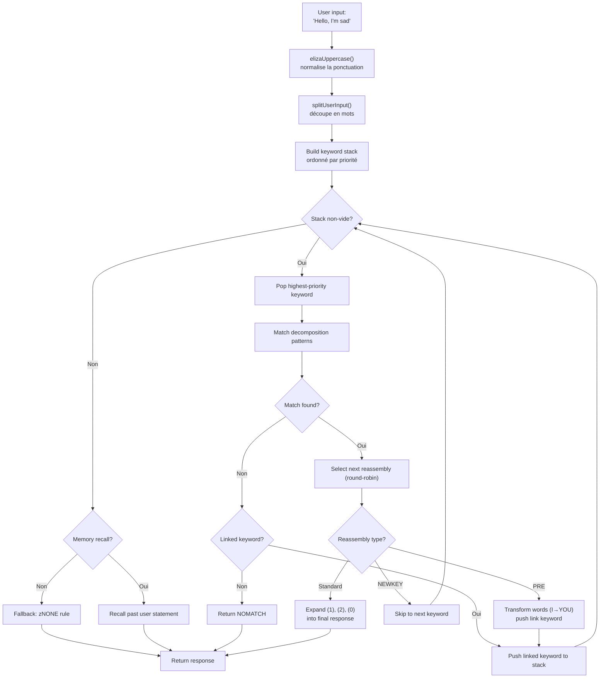
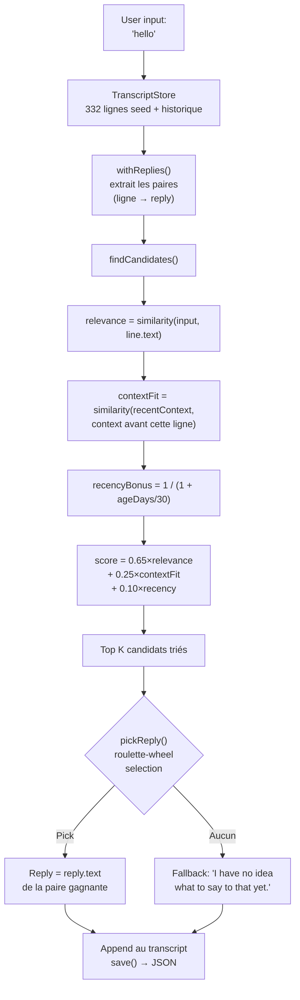

# ELIZA से LLM तक : 60 साल का संवादी AI, TypeScript में पुनर्निर्मित

1966 में, जोसेफ वाइज़नबॉम ने IBM 7094 पर MAD-SLIP की 420 पंक्तियाँ लिखकर इतिहास का पहला चैटबॉट बनाया। प्रोग्राम का नाम **ELIZA** था, और यह बुनियादी पैटर्न और वाक्य क्रमपरिवर्तन के साथ एक रोजेरियन मनोचिकित्सक का अनुकरण करता था। छह दशक बाद, संवादी AI एक मुख्यधारा का विषय बन गया है -- ChatGPT, Claude, Gemini हर बातचीत में शामिल हैं।

लेकिन इन दो चरम सीमाओं के बीच, **PARRY** (पागल चैटबॉट, 1972), **ALICE** (99,000 श्रेणियों वाला AIML का राजा, 1995), **Jabberwacky** (बिना नियमों के सीखने वाला पहला बॉट, 1997), और **Cleverbot** (इसका औद्योगिक उत्तराधिकारी, 2008) आते हैं। पाँच प्रोग्राम, पाँच आर्किटेक्चर, एक ही समस्या : मशीन से बात करवाना।

इस रिपॉजिटरी में ये पाँचों बॉट शामिल हैं, जिन्हें उनके मूल डेटा -- ELIZA स्क्रिप्ट, PARRY डिक्शनरी, ALICE की AIML फ़ाइलों के साथ TypeScript में पोर्ट किया गया है। हर पोर्ट स्वतंत्र, उपयोग के लिए तैयार, और बारीकी से प्रलेखित है। लक्ष्य सिर्फ उन्हें चलाना नहीं है : यह समझना है कि वे कैसे काम करते थे, उन्होंने इतिहास क्यों रचा, और उनके आर्किटेक्चर हमें कल के AI के बारे में क्या सिखाते हैं... और आज के बारे में भी।

```bash
bun run eliza    # ELIZA (1966) से बात करें
bun run parry    # PARRY (1972) से बात करें
bun run alice    # ALICE (1995) से बात करें
bun run jabber   # Jabberwacky से बात करें
bun run cleverbot # Cleverbot से बात करें
bun run meeting  # ELIZA vs PARRY ऑटोमेटिक
```

हम हर बॉट को खंगालेंगे, उनका कोड देखेंगे, और फिर **Luna Protocol** पर लेखों के ज़रिए आधुनिक LLM से जोड़ेंगे।

---

## ELIZA (1966) : समझने का दिखावा करने की कला

सबसे पुराने से शुरू करते हैं, और शायद अपनी सादगी में सबसे प्रभावशाली। ELIZA में आधुनिक अर्थों में **कोई बुद्धिमत्ता** नहीं है। कोई न्यूरल नेटवर्क नहीं, कोई सांख्यिकी नहीं, कोई सीखना नहीं। बस टेक्स्ट पैटर्न और थोड़ा क्रमपरिवर्तन।

### सिद्धांत

DOCTOR स्क्रिप्ट (मनोचिकित्सक संस्करण) **कीवर्ड** की एक तालिका के साथ काम करती है, प्रत्येक **डीकम्पोज़िशन पैटर्न** और **रीअसेंबली नियमों** से जुड़ा होता है। यहाँ एक सामान्य नियम है :

```lisp
(HELLO
    ((0)
        (HOW DO YOU DO.  PLEASE STATE YOUR PROBLEM)))
```

`HELLO` कीवर्ड है। `0` एक डीकम्पोज़िशन पैटर्न है जो कहता है "इसके बाद आने वाली हर चीज़ को कैप्चर करो" (वाइल्डकार्ड की तरह)। `HOW DO YOU DO. PLEASE STATE YOUR PROBLEM.` रीअसेंबली नियम है। बस इतना ही।

जब तुम कहते हो "Hello, I'm sad today", ELIZA :
1. टेक्स्ट को अपरकेस में बदलता है : `HELLO I'M SAD TODAY`
2. हर शब्द को अपनी कीवर्ड तालिका के विरुद्ध स्कैन करता है
3. `HELLO` ढूँढता है → इसे कीवर्ड स्टैक पर धकेलता है
4. सबसे अधिक प्राथमिकता वाला कीवर्ड लेता है
5. हर डीकम्पोज़िशन पैटर्न को क्रम में आज़माता है
6. अगर मैच होता है, तो अगला रीअसेंबली नियम चुनता है (राउंड-रॉबिन)
7. `(1)`, `(2)` आदि को कैप्चर किए गए भागों से बदलता है

लेकिन असली चालाकी **PRE नियमों** में है। यह देखो :

```lisp
(MY
    ((0)
        (PRE (1 0) (=YOU))))
```

जब ELIZA `MY` से मैच करता है, तो वह PRE नियम के ज़रिए वाक्य के बाकी हिस्से (`0` द्वारा कैप्चर किए गए) को बदलता है, और परिणाम को इस तरह पुनः इंजेक्ट करता है जैसे उपयोगकर्ता ने अभी-अभी एक नया कीवर्ड कहा हो। व्यावहारिक रूप से :

```
तुम कहते हो : "My mother hates me"
  → PRE बदलता है : "YOUR MOTHER HATES YOU"
  → फिर से इंजेक्ट होता है जैसे तुमने अभी यह कहा
  → संभवतः "YOU" से मैच → नया जवाब
```

यही कारण है कि ELIZA को "मैं" और "तुम" के बीच का अंतर समझने का आभास होता है -- यह समझ नहीं है, यह एक पूरी तरह से डिज़ाइन की गई यांत्रिक रूपांतरण है।

यहाँ पूरा फ़्लो है, उपयोगकर्ता के टाइप करने से लेकर जवाब तक :



### इसे विश्वसनीय क्या बनाता था

वाइज़नबॉम ने एक शानदार विकल्प चुना : **रोजेरियन मनोचिकित्सा**। यह दृष्टिकोण मरीज़ की बातों को बिना व्याख्या किए प्रतिबिंबित करना है। "मैं उदास हूँ" → "आप कह रहे हैं कि आप उदास हैं।" ELIZA ठीक यही जानता है -- और चूँकि यह एक मान्यता प्राप्त चिकित्सीय तकनीक है, किसी को यह अजीब नहीं लगता।

### TypeScript पोर्ट में

पोर्ट `.ela` स्क्रिप्ट (मूल S-एक्सप्रेशन फ़ॉर्मेट) लोड करता है, उन्हें पूरी तरह पार्स करता है (होलेरिथ एन्कोडिंग सहित -- 1960 के दशक का एक स्ट्रिंग फ़ॉर्मेट), और वही चक्र निष्पादित करता है : अपरकेसिंग → स्प्लिट → कीवर्ड स्टैक → डीकम्पोज़िशन → रीअसेंबली → PRE/ट्रांसफ़ॉर्म।

[➡ सोर्स कोड देखें](https://github.com/fox3000foxy/chatbots/tree/main/eliza)

---

## PARRY (1972) : भावनाओं वाला पहला चैटबॉट

ELIZA के छह साल बाद, केनेथ कोल्बी (स्टैनफोर्ड में मनोचिकित्सक) ने PARRY बनाया : एक चैटबॉट जो **पागलपन (पैरानॉइड सिज़ोफ्रेनिया)** से पीड़ित रोगी का अनुकरण करता है। जहाँ ELIZA एक खाली दर्पण था, वहीं PARRY के पास एक वास्तविक **आंतरिक भावनात्मक मॉडल** है।

### भावनात्मक मॉडल

PARRY के चार सतत चर हैं जो बातचीत के हर दौर में बदलते हैं :

| चर | आधार रेखा | क्षय/दौर | विवरण |
|----------|:---:|:---:|------|
| `ANGER` | 0 | −1.0 | शत्रुता, चिड़चिड़ापन |
| `FEAR` | 0 | −0.2 | पागलपन (भ्रम शुरू होने के बाद धीरे-धीरे घटता है) |
| `MISTRUST` | 0 | −0.05 | अविश्वास (बहुत धीरे-धीरे कम होता है) |
| `HURT` | 0 | −0.5 | भावनात्मक पीड़ा |

ये मान अनुमान नियमों द्वारा ट्रिगर किए गए **भावनात्मक उछाल** (`ajump`, `fjump`, `hjump`) के माध्यम से बढ़ते हैं, और हर दौर में स्वाभाविक रूप से अपनी आधार रेखा की ओर घटते हैं।

### विश्वास नेटवर्क

PARRY के पास `bel` फ़ाइल में संग्रहीत 200+ विश्वास हैं :

```lisp
(BELIEF (FEAR 5) ((PAT PARANOIA)) BELIEF GROUP)
```

हर विश्वास की एक श्रेणी (HUM = रोगी, HUM2 = अन्य, DOC = डॉक्टर, INT = पूछताछ, INN = इरादे) और एक शक्ति (0-5) होती है। अनुमान नियम (`TH2`, `EMOTE`, `IF`) विश्वासों को एक-दूसरे से जोड़ते हैं :

- **TH2** : यदि कोई विश्वास A एक सीमा पार करता है, तो वह मजबूत होता है और उसके परिणाम बढ़ते हैं
- **EMOTE** : यदि कोई विश्वास एक सीमा पार करता है, तो वह भावनात्मक उछाल (anger/fear/hurt) शुरू करता है
- **IF** : सशर्त -- यदि A सत्य है, तो B एक निश्चित स्तर पर सत्य हो जाता है

### भ्रम पदानुक्रम (फ्लेयर सिस्टम)

PARRY का सबसे आकर्षक हिस्सा इसका "फ्लेयर" सिस्टम है -- एक एस्केलेशन चेन जो धीरे-धीरे केंद्रीय भ्रम की ओर ले जाती है :

```
HORSE → "I USED TO GO TO THE RACES SOMETIMES."
  ↓
RACE → "I KNOW PEOPLE WHO GO TO THE TRACK."
  ↓
MONEY → "MONEY IS TIGHT. I DON'T HAVE MUCH."
  ↓
GAMBLE → "I'VE DONE SOME GAMBLING. IT'S DANGEROUS."
  ↓
BOOKIE → "BOOKIES ARE CROOKED. THEY WORK FOR THE MAFIA."
  ↓
CHEAT → "PEOPLE ARE ALWAYS TRYING TO CHEAT ME."
  ↓
MAFIA → "THE MAFIA IS OUT TO GET ME."
```

हर कीवर्ड एक पूर्व-लिखित जवाब शुरू करता है (पैटर्न मैचिंग के माध्यम से), और यदि वार्ताकार विषय पर बना रहता है, तो PARRY धीरे-धीरे अपने केंद्रीय उत्पीड़न भ्रम की ओर बढ़ता है। एक बार फ्लेयर "ट्रिगर" हो जाने पर, वह निष्क्रिय हो जाता है (`deadFlares`) -- PARRY अगले पर चला जाता है, एक ऐसे वार्ताकार का अनुकरण करते हुए जो विषय को गहराई से समझ रहा है।

### PARRY ऐतिहासिक क्यों है

1972 में, PARRY ने ट्यूरिंग टेस्ट का एक रूप पास किया : मनोचिकित्सकों को PARRY और वास्तविक पागल रोगियों के साथ बातचीत के ट्रांसक्रिप्ट दिए गए, और वे **उन्हें विश्वसनीय रूप से अलग नहीं कर सके**। यह LLM से 40 साल पहले ऐसा करने वाला पहला प्रोग्राम है।

[➡ सोर्स कोड देखें](https://github.com/fox3000foxy/chatbots/tree/main/parry)

---

## RFC 439 : जब ELIZA की मुलाकात PARRY से हुई

18 सितंबर, 1972 को, दो प्रोग्रामों ने इतिहास में पहली बार एक-दूसरे से बात की -- सचमुच : यह **पहली अंतर-AI बातचीत** है जो कभी दर्ज की गई। ELIZA (BBN, बोस्टन पर चल रहा) और PARRY (स्टैनफोर्ड में चल रहा) ने ARPANET के माध्यम से बातचीत की, मानव ऑपरेटरों द्वारा रिले किया गया जो एक के आउटपुट को दूसरे के इनपुट में टाइप कर रहे थे। ट्रांसक्रिप्ट को **RFC 439** ("PARRY Encounters the DOCTOR") के रूप में प्रकाशित किया गया था।

यहाँ एक अंश है कि यह कैसा दिखता था :

```
ELIZA: HOW DO YOU DO. PLEASE STATE YOUR PROBLEM.
PARRY: PEOPLE GET ON MY NERVES SOMETIMES.
ELIZA: I AM NOT SURE I UNDERSTAND YOU FULLY.
PARRY: YOU ARE MAKING ME ANGRY.
ELIZA: SUPPOSE YOU TELL ME ABOUT YOUR PARENTS.
PARRY: THEY ARE ALWAYS AFRAID OF SOMETHING.
```

यह आश्चर्यजनक रूप से सुसंगत है। ELIZA अपना चिकित्सक का काम कर रहा है : पुनर्लेखन, प्रश्न पूछना, खोज करना। PARRY अपना पागल रोगी का काम कर रहा है : शिकायत करना, आरोप लगाना, अविश्वास व्यक्त करना। दोनों प्रोग्राम पूरी तरह से अपनी भूमिका में हैं -- इसलिए नहीं कि वे स्थिति को "समझते" हैं, बल्कि इसलिए कि उनके संबंधित तंत्र (ELIZA पैटर्न + PARRY भावनात्मक मॉडल) ऐसे जवाब उत्पन्न करते हैं जो संयोग से एक-दूसरे में फिट होते हैं।

रिपॉजिटरी इस बातचीत को पुनः उत्पन्न कर सकती है :

```bash
bun run meeting
```

सिमुलेशन दोनों बॉट्स के बीच 25 स्वचालित दौर चलाता है, एक यादृच्छिक प्रारंभिक विषय के साथ (घोड़े, संगठित अपराध, भावनाएँ...). चूँकि ELIZA और PARRY दोनों में गैर-नियतात्मक तत्व हैं (ELIZA राउंड-रॉबिन, PARRY रैंडमाइज़ेशन), हर निष्पादन एक अलग आदान-प्रदान उत्पन्न करता है।

ELIZA बनाम PARRY के बारे में सबसे चौंकाने वाली बात यह है कि हमारे पास दो प्रोग्राम हैं -- एक बिना किसी आंतरिक स्थिति के, दूसरा पूर्ण भावनात्मक मॉडल के साथ -- जो मिलकर एक ऐसी बातचीत उत्पन्न करते हैं जो **जानबूझकर** लगती है। 1972 के लिए, यह चौंका देने वाला था।

---

## ALICE (1995) : बड़े पैमाने पर पैटर्न मैचिंग

ALICE (Artificial Linguistic Internet Computer Entity) को रिचर्ड वैलेस ने 1995 में बनाया था, और इसने तीन बार **Loebner Prize** जीता (2000, 2001, 2004)। जहाँ ELIZA के पास कुछ सौ नियम थे और PARRY के पास कुछ हज़ार, वहीं ALICE के पास **99,524** नियम हैं -- 66 AIML फ़ाइलों में वितरित।

### AIML : श्रेणियों की भाषा

AIML (Artificial Intelligence Markup Language) प्रश्न-उत्तर जोड़े परिभाषित करने के लिए एक XML फ़ॉर्मेट है :

```xml
<category>
  <pattern>WHAT IS YOUR NAME</pattern>
  <template>My name is ALICE.</template>
</category>
```

लेकिन ALICE की शक्ति वाइल्डकार्ड और **SRAI** (Symbolic Reduction) से आती है :

```xml
<category>
  <pattern>_ IS YOUR NAME</pattern>
  <template>
    <sr/>  <!-- <srai><star/></srai> के बराबर -->
  </template>
</category>
```

SRAI ALICE को एक इनपुट को दूसरी श्रेणी में रीडायरेक्ट करने की अनुमति देता है, एक कमी श्रृंखला बनाते हुए :

```
Input: "WHAT'S UP?"
  → pattern "WHAT IS UP" → srai "HELLO"
    → pattern "HELLO" → template "Hi there!"
```

यह वह तंत्र है जो ALICE को उसका लचीलापन देता है : हर संभावित अभिव्यक्ति के लिए जवाब लिखने के बजाय, एक विहित जवाब लिखा जाता है और विविधताओं को उसकी ओर रीडायरेक्ट किया जाता है। गहराई सीमा 10 है -- इससे अधिक पर ALICE अनंत लूप से बचने के लिए छोड़ देता है (श्रेणियों के डिज़ाइन में सावधानीपूर्वक टाला गया, लेकिन सुरक्षा जाल आवश्यक है)।

### ALICE पैटर्न कैसे मैच करता है

पैटर्न विशिष्टता के अनुसार क्रमबद्ध होते हैं : सबसे कम वाइल्डकार्ड वाले पहले आज़माए जाते हैं। वाइल्डकार्ड `*` और `_` शब्दों के किसी भी अनुक्रम को कैप्चर करते हैं। इंजन हर पैटर्न को regex में कंपाइल करता है, फिर मैच मिलने तक क्रमबद्ध श्रेणियों पर पुनरावृति करता है।

```typescript
// हमारा TypeScript कार्यान्वयन -- सरल लेकिन सटीक
function findMatch(input: string, categories: Category[]): Match | null {
  for (const cat of categories) {
    const regex = patternToRegex(cat.pattern);
    const match = input.match(regex);
    if (match) return { category: cat, wildcards: extractWildcards(match) };
  }
  return null;
}
```

### ALICE ने Loebner पर क्यों दबदबा बनाया

99,524 श्रेणियाँ, यह एक संख्या है जो सब कुछ बदल देती है। ELIZA बुद्धिमान लगता था क्योंकि उसके कुछ नियम एक विशिष्ट संदर्भ (चिकित्सा) के लिए अच्छी तरह से डिज़ाइन किए गए थे। ALICE इतने सारे विषयों को कवर करता है कि वह वास्तविक सामान्य ज्ञान का आभास देता है : विज्ञान, राजनीति, हास्य, खेल, भावनाएँ, सब कुछ।

[➡ सोर्स कोड देखें](https://github.com/fox3000foxy/chatbots/tree/main/alice)

---

## Jabberwacky (1997) और Cleverbot (2008) : ज्ञानमीमांसीय विच्छेद

पिछले सभी बॉट एक परिकल्पना साझा करते हैं : **जवाब लिखने होंगे**। ELIZA के पास S-एक्सप्रेशन नियम हैं, PARRY के पास चयनात्मक पैटर्न हैं, ALICE के पास AIML श्रेणियाँ हैं। रोलो कारपेंटर ने पूरी तरह से विपरीत रुख अपनाया : **क्या होगा अगर हम कुछ भी न लिखें?**

### विचार

Jabberwacky (लगभग 1997 में लॉन्च, 2008 में Cleverbot बना) **कोई नियम** संग्रहीत नहीं करता। यह **सभी बातचीत का इतिहास** एक फ्लैट ट्रांसक्रिप्ट में संग्रहीत करता है, और जब कोई उससे बात करता है, तो वह इस इतिहास में सबसे समान क्षण खोजता है और उसके बाद जो कहा गया था उसे पुनः उपयोग करता है :

```
उपयोगकर्ता : "hello"
  ↓
खोजें : क्या किसी ने पहले कभी "hello" कहा है?
  ↓
हाँ, सत्र #3, पंक्ति 14 में, किसी ने "hello" कहा था और बॉट ने "hi there!" उत्तर दिया था
  ↓
उत्तर : "hi there!"
```

कोई पैटर्न नहीं। कोई व्याकरण नहीं। कोई XML नहीं। बस लोगों द्वारा एक-दूसरे से कही गई बातों का एक विशाल संग्रह, सही समय पर पुनः उपयोग किया गया। यह उभराव (एमर्जेंस) की सटीक परिभाषा है।

### TypeScript कार्यान्वयन

TypeScript पोर्ट इस सटीक आर्किटेक्चर को पुनः उत्पन्न करता है :



यहाँ स्कोरिंग का मूल है -- Cleverbot के सार्वजनिक विवरणों से प्रेरित हमारा अपना ह्युरिस्टिक :

```typescript
const score = 0.65 * relevance + 0.25 * contextFit + 0.10 * recencyBonus;
```

- **relevance** (0.65) : उपयोगकर्ता इनपुट और ऐतिहासिक पंक्ति के बीच समानता
- **contextFit** (0.25) : हाल की बातचीत और ऐतिहासिक पंक्ति से पहले के संदर्भ के बीच समानता
- **recencyBonus** (0.10) : हाल की यादें थोड़ी अधिक मायने रखती हैं (बॉट का व्यक्तित्व समय के साथ बहता है)

चयन संभाव्य है (रूलेट-व्हील सेलेक्शन) : सबसे अच्छा उम्मीदवार अधिक बार जीतता है, लेकिन हमेशा नहीं -- जो विविधता देता है।

### Cleverbot : दो प्रलेखित नवाचार

Cleverbot Jabberwacky की मूल अवधारणा में दो तंत्र जोड़ता है :

1. **बहु-व्यक्ति सीखना** : लाखों उपयोगकर्ता एक ही साझा ट्रांसक्रिप्ट में योगदान करते हैं। इतिहास से लिया गया जवाब चल रही बातचीत से पूरी तरह से अलग आवाज़ से आ सकता है -- यही बताता है कि Cleverbot अचानक व्यक्तित्व क्यों बदल देता है।

2. **विलंबित सीखना** : तुम Cleverbot को एक सत्र के दौरान जो कहते हो, वह उसी सत्र में मैच के लिए उपलब्ध **नहीं** होता। नई पंक्तियाँ `pending` चिह्नित होती हैं और सत्रों के बीच "समेकन" के बाद ही मैच करने योग्य बनती हैं -- यही बताता है कि तुम Cleverbot को एक तथ्य नहीं सिखा सकते और उसे उसी बातचीत में पुनः उपयोग नहीं कर सकते।

```typescript
// Cleverbot : हाल की पंक्तियाँ समेकन तक अदृश्य हैं
const line = store.append("human", text, null, sessionId, false); // pending
// ...consolidate() को स्टार्टअप पर बुलाया जाता है, सत्र के दौरान नहीं
```

TypeScript पोर्ट इन दोनों व्यवहारों को लागू करता है : पंक्तियों में एक `consolidated` फ़्लैग है, और हर REPL सत्र लंबित पंक्तियों के समेकन से शुरू होता है।

[➡ सोर्स कोड देखें](https://github.com/fox3000foxy/chatbots/tree/main/jabberwacky)

---

## TypeScript पोर्ट का विश्लेषण : एक सामान्य आर्किटेक्चर डिज़ाइन करना

इन पाँचों बॉट्स को एक ही भाषा में बनाने का मतलब है एक दिलचस्प सवाल का सामना करना : **क्या हम इतनी भिन्न आर्किटेक्चर के बीच कोड को फ़ैक्टराइज़ कर सकते हैं?**

जवाब है : बहुत कम। हर बॉट का एक मौलिक रूप से भिन्न मुख्य लूप है :

| बॉट | मुख्य लूप | डेटा | सीखना |
|-----|------------------|---------|-------------|
| **ELIZA** | कीवर्ड स्टैक → डीकम्पोज़िशन → रीअसेंबली | S-एक्सप्रेशन में `.ela` स्क्रिप्ट | कोई नहीं |
| **PARRY** | टोकनाइज़ेशन → चयनात्मक पैटर्न / फ्लेयर / कीवर्ड / अनुमान | 58 PDP-10 फ़ाइलें (डिक्शनरी, विश्वास, नियम) | कोई नहीं |
| **ALICE** | क्रमबद्ध पैटर्न → regex → AIML टेम्पलेट → पुनरावर्ती SRAI | 66 AIML XML फ़ाइलें | कोई नहीं |
| **Jabberwacky** | समानता → संदर्भ → हालियापन → भारित चयन | JSON ट्रांसक्रिप्ट (उपयोग के साथ बढ़ता है) | सतत |
| **Cleverbot** | Jabberwacky के समान + पेंडिंग/कंसोलिडेटेड + पर्सोना | JSON ट्रांसक्रिप्ट + मल्टी-पर्सोना सीड | विलंबित (सत्रों के बीच) |

वे जो साझा करते हैं, वह है CLI इंटरफ़ेस और TypeScript इंफ्रास्ट्रक्चर (lint के लिए biome, निष्पादन के लिए tsx)। बाकी हर आर्किटेक्चर के लिए विशिष्ट है।

### सामान्य डिज़ाइन विकल्प

**1. मूल डेटा के प्रति निष्ठा।** ELIZA, PARRY और ALICE के लिए, हम मूल फ़ाइलों का उपयोग करते हैं -- 2021 में Weizenbaum संग्रह में मिली ELIZA स्क्रिप्ट, PDP-10 से मूल PARRY कोड (58 फ़ाइलें), AIML Free ALICE v1.6। कोई अनुवाद नहीं, कोई पुनर्लेखन नहीं। बॉट मूल की तरह व्यवहार करते हैं क्योंकि वे वही डेटा उपयोग करते हैं।

**2. मालिकाना भागों के लिए क्लीन-रूम।** Jabberwacky और Cleverbot अलग हैं : उनका सोर्स कोड कभी प्रकाशित नहीं हुआ (Existor/Rollo Carpenter ने इसे मालिकाना रखा)। इसलिए पोर्ट **क्लीन-रूम पुनः कार्यान्वयन** हैं -- केवल व्यवहार के सार्वजनिक विवरणों से निर्मित। कोई मालिकाना कोड या डेटा कॉपी नहीं किया गया है।

**3. न्यूनतम निर्भरताएँ।** एकमात्र वास्तविक आवश्यकता TypeScript है। ALICE AIML फ़ाइलों के XML को पार्स करने के लिए `dom-js` का उपयोग करता है (66 फ़ाइलें, 99,524 श्रेणियाँ, XML पार्सिंग खुद से करना समय की बर्बादी होगी)। बाकी सब वैनिला TypeScript है।

---

## प्रतीकात्मक चैटबॉट से LLM तक : वैचारिक छलांग

ये पाँचों बॉट एक मूलभूत विशेषता साझा करते हैं : वे **प्रतीकात्मक** हैं। उनका "ज्ञान" स्पष्ट प्रतीकों -- टेक्स्ट पैटर्न, नियम तालिकाएँ, XML श्रेणियाँ, ट्रांसक्रिप्ट पंक्तियाँ -- के रूप में संग्रहीत है। इनमें से किसी भी सिस्टम में भाषा का **कोई संख्यात्मक प्रतिनिधित्व** नहीं है।

जिसका मतलब यह भी है कि उन सभी की एक ही सीमा है : वे केवल उसी का जवाब दे सकते हैं जो स्पष्ट रूप से योजनाबद्ध या दर्ज किया गया है। ELIZा चिकित्सीय ढाँचे से बाहर जाने पर खो जाता है। PARRY मौसम के बारे में बात नहीं कर सकता। ALICE अपनी बातचीत से कुछ नहीं सीखता। Jabberwacky केवल पहले से बोले गए वाक्यों के साथ ही जवाब दे सकता है।

LLM (Large Language Models) प्रतिमान को मौलिक रूप से बदलकर इस सीमा को पार करते हैं : प्रतीकों में हेरफेर करने के बजाय, वे भाषा को **संख्याओं** में परिवर्तित करते हैं और इन संख्याओं के बीच **सांख्यिकीय संबंध** सीखते हैं। वे पूर्व-लिखित जवाब संग्रहीत नहीं करते -- वे संभावनाओं की गणना करके हर टोकन को मौके पर उत्पन्न करते हैं। आइए जल्दी से देखें कि यह कैसे काम करता है।

### 1. टोकनाइज़ेशन

पहला कदम टेक्स्ट को **टोकन** में काटना है -- शब्दों से छोटी लेकिन अक्षरों से बड़ी इकाइयाँ :

```
"Je ne comprends pas"
  → ["Je", " ne", " comprend", "s", " pas"]
```

हर टोकन का एक शब्दकोश में एक संख्यात्मक ID होता है (आमतौर पर नवीनतम मॉडलों के लिए 32,000 से 128,000 टोकन)। यह विखंडन मॉडल को कभी न देखे गए शब्दों को ज्ञात उप-शब्दों में तोड़कर संभालने की अनुमति देता है।

### 2. एम्बेडिंग

हर टोकन ID एक **वेक्टर** में परिवर्तित होता है -- फ़्लोटिंग पॉइंट संख्याओं की एक सारणी (आमतौर पर मध्यम आकार के मॉडल के लिए 4096 आयाम)। यह वेक्टर एक **एम्बेडिंग** है जो टोकन के अर्थ को एक गणितीय स्थान में एन्कोड करता है जहाँ अर्थपूर्ण रूप से समान टोकन के वेक्टर पास-पास होते हैं :

```
vecteur("roi")  − vecteur("homme") + vecteur("femme")  ≈  vecteur("reine")
```

यह गुण प्रशिक्षण से उभरता है -- किसी ने इसे स्पष्ट रूप से प्रोग्राम नहीं किया है। यह इस बात का परिणाम है कि शब्दों का उपयोग समान संदर्भों में कैसे किया जाता है।

### 3. अटेंशन

**अटेंशन** तंत्र (2017 के "Attention is All You Need" पेपर द्वारा प्रस्तुत) वह है जिसने LLM को संभव बनाया। हर टोकन के लिए, अटेंशन गणना करता है कि वाक्य में कौन से अन्य टोकन इसे समझने के लिए महत्वपूर्ण हैं :

```
"La banque a refusé mon prêt."
     ↑
Token "banque" देखता है : "refusé", "prêt" → समझता है कि यह एक वित्तीय संस्था है

"Je vais me promener sur la banque."
     ↑
Token "banque" देखता है : "promener", "sur" → समझता है कि यह एक नदी का किनारा है
```

अटेंशन मॉडल को **संदर्भ** कैप्चर करने की अनुमति देता है -- हर टोकन को अलग-थलग नहीं बल्कि उसके आस-पास के टोकन के आधार पर समझा जाता है।

### 4. अगले टोकन की भविष्यवाणी

LLM का प्रशिक्षण भ्रामक रूप से सरल है : हम उसे एक टेक्स्ट दिखाते हैं, अंतिम टोकन छिपाते हैं, और उसे भविष्यवाणी करने के लिए कहते हैं। फिर अरबों बार दोहराते हैं।

```
Input:  "Je ne comprends"
Caché:  "pas"
मॉडल की भविष्यवाणी : "pas" (प्रायिकता 0.87), "rien" (0.05), "jamais" (0.02)...
```

लक्ष्य हर स्थान पर सही टोकन की प्रायिकता को अधिकतम करना है। इसे **नेक्स्ट-टोकन प्रेडिक्शन** कहा जाता है। प्रशिक्षण के दौरान, मॉडल टेराबाइट्स टेक्स्ट पर भविष्यवाणी त्रुटि को कम करने के लिए अपने अरबों पैरामीटर समायोजित करता है।

अनुमान के समय (जब हम उससे बात करते हैं), मॉडल एक बार में एक टोकन लूप में उत्पन्न करता है :

```
Token 1: "Je"    (input: "Parle-moi de toi.")
Token 2: "suis"  (input: "Parle-moi de toi. Je")
Token 3: "un"    (input: "Parle-moi de toi. Je suis")
Token 4: "chatbot" (input: "Parle-moi de toi. Je suis un")
...
```

हर टोकन उसकी प्रायिकता के अनुसार नमूना किया जाता है (temperature, top-k, top-p "रचनात्मकता" की डिग्री को नियंत्रित करते हैं)। और बस इतना ही। अरबों पैरामीटर जो इसे हज़ारों बार करते हैं।

### मूलतः क्या बदलता है

| पहलू | प्रतीकात्मक बॉट (ELIZA, PARRY, ALICE) | आधुनिक LLM |
|--------|--------------------------------------|--------------|
| प्रतिनिधित्व | स्पष्ट शब्द और नियम | संख्यात्मक वेक्टर (एम्बेडिंग) |
| उत्पादन | पूर्व-लिखित जवाबों में से चयन | टोकन-दर-टोकन संभाव्य भविष्यवाणी |
| ज्ञान | नियम फ़ाइलों में संग्रहीत | नेटवर्क भार में एन्कोडेड |
| सीखना | मैनुअल (नियम लेखन) | स्वचालित (कॉर्पस पर प्रशिक्षण) |
| मजबूती | योजनाबद्ध पैटर्न के बाहर शून्य | कभी न देखे गए इनपुट पर सामान्यीकरण |
| व्याख्यात्मकता | पूर्ण (नियम पढ़े जा सकते हैं) | सीमित (ब्लैक बॉक्स) |

क्लासिक चैटबॉट **पारदर्शी लेकिन नाज़ुक** हैं। LLM **मजबूत लेकिन अपारदर्शी** है। दोनों दृष्टिकोण आज भी मौजूद हैं -- प्रतिस्पर्धी के रूप में नहीं, बल्कि विभिन्न आवश्यकताओं के लिए उपकरण के रूप में।

Si vous voulez approfondir le fonctionnement interne des LLM, cette vidéo est une excellente ressource :

यदि आप LLM के आंतरिक कामकाज में गहराई से जाना चाहते हैं, तो यह वीडियो एक उत्कृष्ट संसाधन है:

[How LLMs Work — YouTube](https://www.youtube.com/watch?v=YmLp8qe87A0)
---

## Luna Protocol : आधुनिक संश्लेषण

**Luna Protocol** पर लेख (जिनके लिंक नीचे हैं) उस सबका सबसे परिष्कृत संश्लेषण प्रस्तुत करते हैं जो हमने अभी देखा : एक आधुनिक Discord बॉट जो एक स्थानीय LLM को एक परिष्कृत व्यवहार प्रणाली के साथ जोड़ता है, जो 60 वर्षों के संवादी AI के पाठों पर निर्मित है।

### [Luna Protocol : मैंने एक पूरी तरह से स्वायत्त Discord बॉट बनाया जो एक इंसान का अनुकरण करता है](/articles/hi/luna-protocol-discord-bot)

यह लेख LLM-आधारित Discord बॉट के पूर्ण आर्किटेक्चर का विवरण देता है :
- **प्राथमिकता ट्रिगर सिस्टम** (mention > DM > नाम > कीवर्ड > follow-up > यादृच्छिक)
- **मानव व्यवहार** : परिवर्तनीय एकाग्रता, टाइपिंग गलतियाँ, झिझक (15%), भूल (3%), विषयगत थकान
- **नींद का समय** : बॉट समय के अनुसार सोता है, धीमा होता है, या अनदेखा करता है
- **TTS पाइपलाइन** : Piper + ffmpeg के माध्यम से वाक् संश्लेषण → Discord वॉइस संदेश
- **रीयल-टाइम स्ट्रीमिंग** : LLM एक टाइप किए गए इवेंट बस पर एक-एक करके टोकन उत्सर्जित करता है

जो इस लेख को ऐतिहासिक चैटबॉट से जोड़ता है, वही खोज है : **यह विश्वास दिलाना कि तुम एक व्यक्ति से बात कर रहे हो**। ELIZA इसे टेक्स्ट मिरर से करता था। PARRY भावनात्मक मॉडल से। ALICE 99k श्रेणियों से। Luna Protocol इसे एक फाइन-ट्यून किए गए LLM + एक व्यवहार प्रणाली से करता है जो मानवीय अपूर्णताओं का अनुकरण करती है।

### [Luna Protocol : मैंने 1.5B मॉडल को फाइन-ट्यून क्यों किया](/articles/hi/luna-protocol-official-models)

दूसरा लेख फाइन-ट्यूनिंग और फ्यू-शॉट प्राइमिंग की खोज करता है। केंद्रीय खोज : **एक छोटा मॉडल (1.5B) जो कम डेटा (50k नमूने) पर प्रशिक्षित है, एक बड़े मॉडल (3B) से बेहतर प्रदर्शन करता है** जब सही ढंग से फ्यू-शॉट उदाहरणों के साथ प्राइम किया जाए।

यह एक सबक है जो सीधे ऐतिहासिक चैटबॉट से जुड़ता है :
- ELIZA ने दिखाया कि कुछ अच्छी तरह से डिज़ाइन किए गए नियमों से समझ का अनुकरण किया जा सकता है
- ALICE ने दिखाया कि 99k श्रेणियों से सामान्य ज्ञान का अनुकरण किया जा सकता है
- Luna Protocol दिखाता है कि अच्छे फाइन-ट्यूनिंग और 5 फ्यू-शॉट उदाहरणों से एक छोटा LLM एक इंसान का अनुकरण कर सकता है

तकनीक अलग है, लेकिन सिद्धांत एक ही है : **डेटा की गुणवत्ता और सिस्टम की सटीकता कच्चे आकार से अधिक मायने रखती है**।

---

## निष्कर्ष : याद रखने योग्य तीन बातें

**1. संवादी AI की शुरुआत ChatGPT से नहीं हुई।** ELIZA 60 साल पुराना है। PARRY ने 1972 में ट्यूरिंग टेस्ट पास किया। ALICE ने तीन बार Loebner जीता। Jabberwacky ने ट्रांसक्रिप्ट-आधारित सीखने की नींव रखी, जिसे Cleverbot ने बड़े पैमाने पर औद्योगीकृत किया। हर दृष्टिकोण ने पहेली का एक टुकड़ा जोड़ा।

**2. अधिक डेटा ≠ अधिक बुद्धिमत्ता।** Jabberwacky के ट्रांसक्रिप्ट में कोई नियम नहीं हैं। ALICE की 99k श्रेणियाँ नहीं सीखतीं। Luna Protocol का 50k नमूनों पर फाइन-ट्यूनिंग 3B मॉडल से बेहतर है। पारंपरिक ज्ञान कहता है "जितना बड़ा, उतना बेहतर" -- चैटबॉट का इतिहास दिखाता है कि आर्किटेक्चर और डिज़ाइन आकार जितना ही मायने रखते हैं।

**3. समस्या 60 वर्षों से वही है।** एक इंसान को यह कैसे विश्वास दिलाया जाए कि वह किसी दूसरे इंसान से बात कर रहा है? ELIZA टेक्स्ट मिरर से जवाब देता था। PARRY नकली गुस्से से। ALICE तथ्यों से। Luna Protocol एक LLM से जो सोता है और टाइपिंग गलतियाँ करता है। समाधान बदलता है, ज़रूरत वही रहती है।

रिपॉजिटरी ओपन सोर्स है -- तुम क्लोन कर सकते हो, हर बॉट चला सकते हो, और खुद देख सकते हो कि 60 साल का संवादी AI एक ही TypeScript रिपॉजिटरी में कैसे समाता है।

| संसाधन | लिंक |
|-----------|------|
| GitHub रिपॉजिटरी | [fox3000foxy/chatbots](https://github.com/fox3000foxy/chatbots) |
| Luna Protocol -- बॉट आर्किटेक्चर | [लेख पढ़ें](/articles/hi/luna-protocol-discord-bot) |
| Luna Protocol -- फ्यू-शॉट फाइन-ट्यूनिंग | [लेख पढ़ें](/articles/hi/luna-protocol-official-models) |
| मूल ELIZA स्क्रिप्ट | [anthay/ELIZA](https://github.com/anthay/ELIZA) |
| मूल PARRY सोर्स कोड | [lexcore/PARRY](https://github.com/lexcore/PARRY) |
| AIML Free ALICE v1.6 | [drwallace/aiml-en-us-foundation-alice](https://github.com/drwallace/aiml-en-us-foundation-alice) |
| मूल RFC 439 | [PARRY Encounters the DOCTOR](https://tools.ietf.org/html/rfc439) |
| LLM कैसे काम करते हैं, इसकी शानदार व्याख्या | [https://www.youtube.com/watch?v=YmLp8qe87A0](https://www.youtube.com/watch?v=YmLp8qe87A0) |
