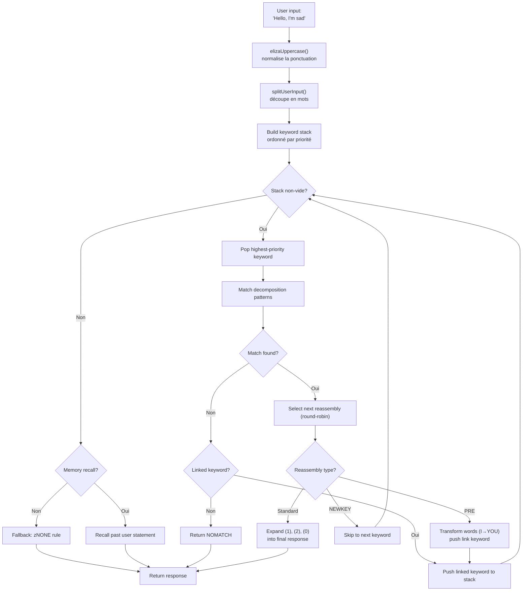
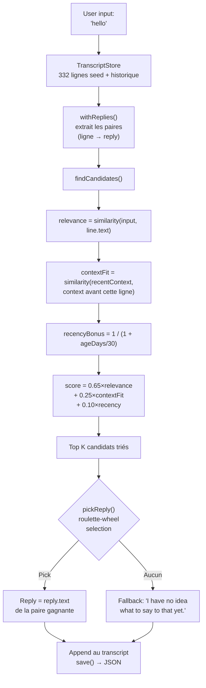

# Dari ELIZA ke LLM : 60 Tahun AI Percakapan, Dibangun Ulang dalam TypeScript

Pada tahun 1966, Joseph Weizenbaum menulis 420 baris MAD-SLIP di atas IBM 7094 untuk menciptakan chatbot pertama dalam sejarah. Program itu bernama **ELIZA**, dan ia mensimulasikan psikoterapis Rogerian dengan pola dasar dan permutasi kalimat. Enam dekade kemudian, AI percakapan telah menjadi topik arus utama -- ChatGPT, Claude, Gemini ada di setiap perbincangan.

Namun di antara dua ekstrem ini, ada **PARRY** (chatbot paranoid, 1972), **ALICE** (raja AIML dengan 99.000 kategori, 1995), **Jabberwacky** (yang pertama belajar tanpa aturan, 1997), dan **Cleverbot** (penerus industrinya, 2008). Lima program, lima arsitektur, satu masalah : membuat mesin berbicara.

Repo ini berisi kelima bot tersebut, diporting ke TypeScript dengan data asli mereka -- skrip ELIZA, kamus PARRY, file AIML ALICE. Setiap port berdiri sendiri, siap pakai, dan didokumentasikan dengan detail. Tujuannya bukan sekadar menjalankannya : tetapi memahami cara kerjanya, mengapa mereka menandai sejarah, dan apa yang diajarkan arsitektur mereka tentang AI kemarin... dan hari ini.

```bash
bun run eliza    # Bicara dengan ELIZA (1966)
bun run parry    # Bicara dengan PARRY (1972)
bun run alice    # Bicara dengan ALICE (1995)
bun run jabber   # Bicara dengan Jabberwacky
bun run cleverbot # Bicara dengan Cleverbot
bun run meeting  # ELIZA vs PARRY otomatis
```

Kita akan membedah setiap bot, melihat kodenya, lalu menghubungkannya dengan LLM modern melalui artikel tentang **Luna Protocol**.

---

## ELIZA (1966) : Seni Membuat Orang Percaya Bahwa Kamu Mengerti

Mari mulai dari yang tertua, dan mungkin yang paling mengesankan dalam kesederhanaannya. ELIZA tidak memiliki **kecerdasan** dalam arti modern. Tidak ada jaringan saraf, tidak ada statistik, tidak ada pembelajaran. Hanya pola teks dan sedikit permutasi.

### Prinsipnya

Skrip DOCTOR (versi psikoterapis) bekerja dengan sebuah tabel **kata kunci**, masing-masing terkait dengan **pola dekomposisi** dan **aturan perakitan kembali**. Berikut aturan tipikal :

```lisp
(HELLO
    ((0)
        (HOW DO YOU DO.  PLEASE STATE YOUR PROBLEM)))
```

`HELLO` adalah kata kuncinya. `0` adalah pola dekomposisi yang mengatakan "tangkap semua yang mengikuti" (seperti wildcard). `HOW DO YOU DO. PLEASE STATE YOUR PROBLEM.` adalah aturan perakitan kembali. Itu saja.

Saat kamu bilang "Hello, I'm sad today", ELIZA :
1. Mengubah teks menjadi huruf kapital : `HELLO I'M SAD TODAY`
2. Memindai setiap kata terhadap tabel kata kunci
3. Menemukan `HELLO` → mendorongnya ke tumpukan kata kunci
4. Mengambil kata kunci dengan prioritas tertinggi
5. Mencoba setiap pola dekomposisi secara berurutan
6. Jika cocok, memilih aturan perakitan berikutnya (round-robin)
7. Mengganti `(1)`, `(2)` dll. dengan bagian yang ditangkap

Tapi bagian yang benar-benar cerdas adalah **aturan PRE**. Lihat ini :

```lisp
(MY
    ((0)
        (PRE (1 0) (=YOU))))
```

Saat ELIZA mencocokkan `MY`, ia mengubah sisa kalimat (ditangkap oleh `0`) melalui aturan PRE, dan menyuntikkan hasilnya kembali seolah-olah pengguna baru saja mengatakan kata kunci baru. Secara konkret :

```
Kamu bilang : "My mother hates me"
  → PRE mengubah : "YOUR MOTHER HATES YOU"
  → disuntikkan kembali seolah kamu baru mengatakannya
  → kemungkinan cocok dengan "YOU" → respons baru
```

Inilah mengapa ELIZA terlihat memahami perbedaan antara "aku" dan "kamu" -- itu bukan pemahaman, melainkan transformasi mekanis yang dirancang dengan sempurna.

Berikut alur lengkapnya, dari ketikan pengguna hingga respons :



### Apa yang Membuatnya Masuk Akal

Weizenbaum membuat pilihan brilian : **psikoterapi Rogerian**. Pendekatan ini adalah merefleksikan ucapan pasien tanpa menafsirkan. "Saya sedih" → "Anda mengatakan Anda sedih." Itulah tepatnya yang ELIZA bisa lakukan -- dan karena ini adalah teknik terapi yang diakui, tidak ada yang menganggapnya aneh.

### Dalam Port TypeScript

Port memuat skrip `.ela` (format S-expression asli), menguraikannya sepenuhnya (termasuk encoding Hollerith -- format string dari tahun 60-an), dan menjalankan siklus yang sama : kapitalisasi → pemisahan → tumpukan kata kunci → dekomposisi → perakitan kembali → PRE/transformasi.

[➡ Lihat kode sumber](https://github.com/fox3000foxy/chatbots/tree/main/eliza)

---

## PARRY (1972) : Chatbot Pertama dengan Emosi

Enam tahun setelah ELIZA, Kenneth Colby (psikiater di Stanford) menciptakan PARRY : chatbot yang mensimulasikan pasien dengan **skizofrenia paranoid**. Jika ELIZA adalah cermin kosong, PARRY memiliki **model emosional internal** yang sesungguhnya.

### Model Emosional

PARRY memiliki empat variabel kontinu yang berubah setiap putaran percakapan :

| Variabel | Garis Dasar | Peluruhan/Putaran | Deskripsi |
|----------|:---:|:---:|------|
| `ANGER` | 0 | −1.0 | Permusuhan, iritasi |
| `FEAR` | 0 | −0.2 | Paranoia (meluruh lambat setelah delusi dimulai) |
| `MISTRUST` | 0 | −0.05 | Kecurigaan (sangat lambat turun) |
| `HURT` | 0 | −0.5 | Luka emosional |

Nilai-nilai ini meningkat melalui **lompatan emosional** (`ajump`, `fjump`, `hjump`) yang dipicu oleh aturan inferensi, dan meluruh secara alami kembali ke garis dasarnya setiap putaran.

### Jaringan Keyakinan

PARRY memiliki 200+ keyakinan yang disimpan dalam file `bel` :

```lisp
(BELIEF (FEAR 5) ((PAT PARANOIA)) BELIEF GROUP)
```

Setiap keyakinan memiliki kategori (HUM = pasien, HUM2 = orang lain, DOC = dokter, INT = interogasi, INN = niat) dan kekuatan (0-5). Aturan inferensi (`TH2`, `EMOTE`, `IF`) menghubungkan keyakinan satu sama lain :

- **TH2** : jika keyakinan A melebihi ambang batas, ia menguat dan konsekuensinya meningkat
- **EMOTE** : jika keyakinan melebihi ambang batas, ia memicu lompatan emosional (marah/takut/sakit)
- **IF** : kondisional -- jika A benar, maka B menjadi benar pada tingkat tertentu

### Hierarki Delusi (Sistem Flare)

Bagian paling menarik dari PARRY adalah sistem "flare" -- rantai eskalasi yang secara progresif mengarah ke delusi pusat :

```
HORSE → "I USED TO GO TO THE RACES SOMETIMES."
  ↓
RACE → "I KNOW PEOPLE WHO GO TO THE TRACK."
  ↓
MONEY → "MONEY IS TIGHT. I DON'T HAVE MUCH."
  ↓
GAMBLE → "I'VE DONE SOME GAMBLING. IT'S DANGEROUS."
  ↓
BOOKIE → "BOOKIES ARE CROOKED. THEY WORK FOR THE MAFIA."
  ↓
CHEAT → "PEOPLE ARE ALWAYS TRYING TO CHEAT ME."
  ↓
MAFIA → "THE MAFIA IS OUT TO GET ME."
```

Setiap kata kunci memicu respons yang sudah ditulis sebelumnya (melalui pencocokan pola), dan jika lawan bicara mengikuti topik, PARRY secara bertahap hanyut menuju delusi pusat penganiayaannya. Begitu flare "terpicu", ia menjadi tidak aktif (`deadFlares`) -- PARRY beralih ke yang berikutnya, mensimulasikan lawan bicara yang menggali topik lebih dalam.

### Mengapa PARRY Bersejarah

Pada tahun 1972, PARRY lulus varian uji Turing : psikiater diberikan transkrip percakapan dengan PARRY dan dengan pasien paranoid sungguhan, dan **tidak dapat membedakannya secara andal**. Itu adalah program pertama yang berhasil melakukannya, 40 tahun sebelum LLM.

[➡ Lihat kode sumber](https://github.com/fox3000foxy/chatbots/tree/main/parry)

---

## RFC 439 : Saat ELIZA Bertemu PARRY

Pada 18 September 1972, dua program berbicara satu sama lain untuk pertama kalinya dalam sejarah -- secara harfiah : ini adalah **percakapan antar-AI pertama** yang pernah tercatat. ELIZA (berjalan di BBN, Boston) dan PARRY (berjalan di Stanford) bercakap-cakap melalui ARPANET, disambungkan oleh operator manusia yang mengetik keluaran satu ke masukan yang lain. Transkripnya diterbitkan sebagai **RFC 439** ("PARRY Encounters the DOCTOR").

Berikut kutipan bagaimana tampilannya :

```
ELIZA: HOW DO YOU DO. PLEASE STATE YOUR PROBLEM.
PARRY: PEOPLE GET ON MY NERVES SOMETIMES.
ELIZA: I AM NOT SURE I UNDERSTAND YOU FULLY.
PARRY: YOU ARE MAKING ME ANGRY.
ELIZA: SUPPOSE YOU TELL ME ABOUT YOUR PARENTS.
PARRY: THEY ARE ALWAYS AFRAID OF SOMETHING.
```

Sangat koheren secara mengejutkan. ELIZA melakukan tugas terapisnya : merumuskan ulang, bertanya, mengeksplorasi. PARRY melakukan tugas pasien paranoidnya : mengeluh, menuduh, mengekspresikan kecurigaan. Kedua program sempurna dalam peran mereka -- bukan karena mereka "memahami" situasi, tetapi karena mekanisme masing-masing (pola ELIZA + model emosional PARRY) menghasilkan respons yang secara kebetulan saling cocok.

Repo dapat mereproduksi percakapan ini dengan :

```bash
bun run meeting
```

Simulasi menjalankan 25 putaran otomatis antara kedua bot, dengan topik awal acak (kuda, kejahatan terorganisir, emosi...). Karena ELIZA dan PARRY sama-sama memiliki elemen non-deterministik (ELIZA round-robin, PARRY randomisasi), setiap eksekusi menghasilkan pertukaran yang berbeda.

Yang mencolok tentang ELIZA vs PARRY adalah kita memiliki dua program -- satu tanpa status internal, yang lain dengan model emosional lengkap -- yang bersama-sama menghasilkan percakapan yang **terlihat** disengaja. Untuk tahun 1972, itu mencengangkan.

---

## ALICE (1995) : Pencocokan Pola Skala Besar

ALICE (Artificial Linguistic Internet Computer Entity) diciptakan oleh Richard Wallace pada tahun 1995, dan memenangkan **Loebner Prize** tiga kali (2000, 2001, 2004). Jika ELIZA memiliki beberapa ratus aturan dan PARRY beberapa ribu, ALICE memiliki **99.524** -- tersebar di 66 file AIML.

### AIML : Bahasa Kategori

AIML (Artificial Intelligence Markup Language) adalah format XML untuk mendefinisikan pasangan tanya-jawab :

```xml
<category>
  <pattern>WHAT IS YOUR NAME</pattern>
  <template>My name is ALICE.</template>
</category>
```

Tapi kekuatan ALICE berasal dari wildcard dan **SRAI** (Symbolic Reduction) :

```xml
<category>
  <pattern>_ IS YOUR NAME</pattern>
  <template>
    <sr/>  <!-- setara dengan <srai><star/></srai> -->
  </template>
</category>
```

SRAI memungkinkan ALICE mengarahkan input ke kategori lain, menciptakan rantai reduksi :

```
Input: "WHAT'S UP?"
  → pattern "WHAT IS UP" → srai "HELLO"
    → pattern "HELLO" → template "Hi there!"
```

Itulah mekanisme yang memberi ALICE fleksibilitasnya : alih-alih menulis respons untuk setiap kemungkinan formulasi, kita menulis satu respons kanonik dan mengarahkan variasi ke sana. Batas kedalaman adalah 10 -- di atas itu, ALICE menyerah untuk menghindari loop tak terbatas (dihindari dengan hati-hati dalam desain kategori, tapi jaring pengaman tetap penting).

### Bagaimana ALICE Mencocokkan Pola

Pola diurutkan berdasarkan kekhususan : yang memiliki wildcard paling sedikit dicoba terlebih dahulu. Wildcard `*` dan `_` menangkap urutan kata apa pun. Engine mengompilasi setiap pola menjadi regex, lalu mengulangi kategori yang telah diurutkan hingga menemukan kecocokan.

```typescript
// Implementasi TypeScript kami -- disederhanakan tapi setia
function findMatch(input: string, categories: Category[]): Match | null {
  for (const cat of categories) {
    const regex = patternToRegex(cat.pattern);
    const match = input.match(regex);
    if (match) return { category: cat, wildcards: extractWildcards(match) };
  }
  return null;
}
```

### Mengapa ALICE Mendominasi Loebner

99.524 kategori, itu angka yang mengubah segalanya. ELIZA terlihat pintar karena beberapa aturannya dirancang dengan baik untuk konteks spesifik (terapi). ALICE mencakup begitu banyak topik sehingga ia memberi kesan memiliki pengetahuan umum yang nyata : sains, politik, humor, olahraga, emosi, semuanya ada.

[➡ Lihat kode sumber](https://github.com/fox3000foxy/chatbots/tree/main/alice)

---

## Jabberwacky (1997) & Cleverbot (2008) : Pemutusan Epistemologis

Semua bot sebelumnya berbagi asumsi : **respons harus ditulis**. ELIZA punya aturan S-expression, PARRY punya pola selektif, ALICE punya kategori AIML. Rollo Carpenter mengambil pendekatan sebaliknya : **bagaimana jika kita tidak menulis apa pun?**

### Idenya

Jabberwacky (diluncurkan sekitar 1997, menjadi Cleverbot pada 2008) tidak menyimpan **aturan apa pun**. Ia menyimpan **seluruh riwayat percakapan** dalam transkrip datar, dan ketika seseorang berbicara dengannya, ia mencari di riwayat ini momen yang paling mirip dan menggunakan kembali apa yang dikatakan setelahnya :

```
Pengguna : "hello"
  ↓
Cari : apakah ada yang pernah mengatakan "hello" sebelumnya?
  ↓
Ya, di sesi #3, baris 14, seseorang berkata "hello" dan bot menjawab "hi there!"
  ↓
Jawab : "hi there!"
```

Tanpa pola. Tanpa tata bahasa. Tanpa XML. Hanya arsip raksasa tentang hal-hal yang dikatakan orang satu sama lain, digunakan kembali pada saat yang tepat. Itulah definisi emergence.

### Implementasi TypeScript

Port TypeScript mereproduksi arsitektur persis ini :



Inilah jantung penilaian -- heuristik kami sendiri yang terinspirasi dari deskripsi publik Cleverbot :

```typescript
const score = 0.65 * relevance + 0.25 * contextFit + 0.10 * recencyBonus;
```

- **relevance** (0.65) : kemiripan antara input pengguna dan baris historis
- **contextFit** (0.25) : kemiripan antara percakapan terkini dan konteks sebelum baris historis
- **recencyBonus** (0.10) : ingatan terbaru sedikit lebih berbobot (kepribadian bot berubah seiring waktu)

Pemilihan bersifat probabilistik (roulette-wheel selection) : kandidat terbaik menang lebih sering, tapi tidak selalu -- yang memberikan variasi.

### Cleverbot : Dua Inovasi yang Terdokumentasi

Cleverbot menambahkan dua mekanisme ke konsep dasar Jabberwacky :

1. **Pembelajaran multi-orang** : jutaan pengguna berkontribusi ke transkrip bersama yang sama. Respons yang diambil dari riwayat bisa berasal dari suara yang sama sekali berbeda dari percakapan yang sedang berlangsung -- yang menjelaskan mengapa Cleverbot tiba-tiba berubah kepribadian.

2. **Pembelajaran tertunda** : apa yang kamu katakan ke Cleverbot selama satu sesi TIDAK tersedia untuk pencocokan selama sesi yang sama. Baris baru ditandai `pending` dan baru bisa dicocokkan setelah "konsolidasi" antar sesi -- yang menjelaskan mengapa kamu tidak bisa mengajari Cleverbot suatu fakta dan menggunakannya kembali dalam percakapan yang sama.

```typescript
// Cleverbot : baris terbaru tidak terlihat sampai konsolidasi
const line = store.append("human", text, null, sessionId, false); // pending
// ...consolidate() dipanggil saat startup, bukan selama sesi
```

Port TypeScript mengimplementasikan kedua perilaku ini : baris memiliki flag `consolidated`, dan setiap sesi REPL dimulai dengan konsolidasi baris yang tertunda.

[➡ Lihat kode sumber](https://github.com/fox3000foxy/chatbots/tree/main/jabberwacky)

---

## Analisis Port TypeScript : Merancang Arsitektur Bersama

Membangun kelima bot dalam bahasa yang sama adalah menghadapi pertanyaan menarik : **dapatkah kita memfaktorkan ulang kode antar arsitektur yang berbeda seperti ini?**

Jawabannya : sangat sedikit. Setiap bot memiliki loop fundamental yang berbeda :

| Bot | Loop Utama | Data | Pembelajaran |
|-----|------------------|---------|-------------|
| **ELIZA** | Tumpukan kata kunci → dekomposisi → perakitan kembali | Skrip `.ela` dalam S-expression | Tidak ada |
| **PARRY** | Tokenisasi → pola selektif / flare / kata kunci / inferensi | 58 file PDP-10 (kamus, keyakinan, aturan) | Tidak ada |
| **ALICE** | Pola terurut → regex → template AIML → SRAI rekursif | 66 file AIML XML | Tidak ada |
| **Jabberwacky** | Kemiripan → konteks → kedekatan → pilihan berbobot | Transkrip JSON (bertambah seiring penggunaan) | Berkelanjutan |
| **Cleverbot** | Sama seperti Jabberwacky + pending/consolidated + persona | Transkrip JSON + seed multi-persona | Tertunda (antar sesi) |

Yang mereka bagi adalah antarmuka CLI dan infrastruktur TypeScript (biome untuk lint, tsx untuk eksekusi). Sisanya spesifik untuk setiap arsitektur.

### Pilihan Desain Bersama

**1. Kesetiaan pada data asli.** Untuk ELIZA, PARRY dan ALICE, kami menggunakan file asli -- skrip ELIZA yang ditemukan di arsip Weizenbaum tahun 2021, kode PARRY asli dari PDP-10 (58 file), AIML Free ALICE v1.6. Tidak ada terjemahan, tidak ada penulisan ulang. Bot berperilaku seperti aslinya karena mereka menggunakan data yang sama.

**2. Clean-room untuk bagian kepemilikan.** Jabberwacky dan Cleverbot berbeda : kode sumber mereka tidak pernah dipublikasikan (Existor/Rollo Carpenter menjaganya tetap proprietary). Oleh karena itu port adalah **clean-room reimplementation** -- dibangun hanya dari deskripsi publik tentang perilaku. Tidak ada baris kode atau data proprietary yang disalin.

**3. Ketergantungan minimal.** Satu-satunya prasyarat nyata adalah TypeScript. ALICE menggunakan `dom-js` untuk mengurai XML dari file AIML (66 file, 99.524 kategori, mengurai XML sendiri akan membuang-buang waktu). Sisanya adalah TypeScript vanilla.

---

## Dari Chatbot Simbolis ke LLM : Lompatan Konseptual

Kelima bot yang baru kita lihat semuanya berbagi karakteristik fundamental : mereka **simbolis**. "Pengetahuan" mereka disimpan sebagai simbol eksplisit -- pola teks, tabel aturan, kategori XML, baris transkrip. Tidak ada **representasi numerik bahasa** di salah satu sistem ini.

Yang berarti mereka semua memiliki batasan yang sama : mereka hanya bisa merespons apa yang telah direncanakan atau dicatat secara eksplisit. ELIZA tersesat jika kamu keluar dari kerangka terapi. PARRY tidak bisa bicara tentang cuaca. ALICE tidak belajar apa pun dari percakapannya. Jabberwacky hanya bisa merespons dengan replika yang sudah pernah diucapkan.

LLM (Large Language Models) melampaui batasan ini dengan mengubah paradigma secara radikal : alih-alih memanipulasi simbol, mereka mengubah bahasa menjadi **angka** dan mempelajari **hubungan statistik** antara angka-angka ini. Mereka tidak menyimpan respons yang sudah ditulis sebelumnya -- mereka menghasilkan setiap token saat itu juga dengan menghitung probabilitas. Mari kita lihat sekilas cara kerjanya.

### 1. Tokenisasi

Langkah pertama adalah memotong teks menjadi **token** -- unit yang lebih kecil dari kata tetapi lebih besar dari karakter :

```
"Je ne comprends pas"
  → ["Je", " ne", " comprend", "s", " pas"]
```

Setiap token memiliki ID numerik dalam kosakata (biasanya 32.000 hingga 128.000 token untuk model terbaru). Fragmentasi ini memungkinkan model menangani kata-kata yang belum pernah dilihat dengan memecahnya menjadi sub-kata yang dikenal.

### 2. Embedding

Setiap ID token diubah menjadi **vektor** -- sebuah array angka floating-point (biasanya 4096 dimensi untuk model ukuran sedang). Vektor ini adalah **embedding** yang mengkodekan makna token dalam ruang matematis di mana token yang mirip secara semantik memiliki vektor yang berdekatan :

```
vecteur("roi") − vecteur("homme") + vecteur("femme") ≈ vecteur("reine")
```

Sifat ini muncul dari pelatihan -- tidak ada yang memprogramnya secara eksplisit. Ini adalah konsekuensi dari cara kata-kata digunakan dalam konteks yang serupa.

### 3. Attention

Mekanisme **attention** (diperkenalkan oleh makalah "Attention is All You Need" tahun 2017) adalah yang membuat LLM menjadi mungkin. Untuk setiap token, attention menghitung token lain mana dalam kalimat yang penting untuk memahami token ini :

```
"La banque a refusé mon prêt."
     ↑
Token "banque" melihat : "refusé", "prêt" → paham bahwa ini adalah institusi keuangan

"Je vais me promener sur la banque."
     ↑
Token "banque" melihat : "promener", "sur" → paham bahwa ini adalah tepi sungai
```

Attention memungkinkan model menangkap **konteks** -- setiap token dipahami berdasarkan apa yang ada di sekitarnya, tidak secara terisolasi.

### 4. Prediksi Token Berikutnya

Pelatihan LLM memiliki kesederhanaan yang menipu : kita tunjukkan sebuah teks, sembunyikan token terakhir, dan minta ia memprediksinya. Lalu ulangi miliaran kali.

```
Input: "Je ne comprends"
Sembunyi: "pas"
Prediksi model : "pas" (probabilitas 0.87), "rien" (0.05), "jamais" (0.02)...
```

Tujuannya adalah memaksimalkan probabilitas token yang benar di setiap posisi. Ini disebut **next-token prediction**. Selama pelatihan, model menyesuaikan miliaran parameternya untuk meminimalkan kesalahan prediksi pada terabyte teks.

Saat inferensi (ketika kita berbicara dengannya), model menghasilkan satu token pada satu waktu dalam satu loop :

```
Token 1: "Je"    (input: "Parle-moi de toi.")
Token 2: "suis"  (input: "Parle-moi de toi. Je")
Token 3: "un"    (input: "Parle-moi de toi. Je suis")
Token 4: "chatbot" (input: "Parle-moi de toi. Je suis un")
...
```

Setiap token diambil sampelnya berdasarkan probabilitasnya (temperature, top-k, top-p mengontrol tingkat "kreativitas"). Dan hanya itu. Miliaran parameter melakukan ini ribuan kali.

### Apa yang Berubah Secara Fundamental

| Aspek | Bot Simbolis (ELIZA, PARRY, ALICE) | LLM Modern |
|--------|--------------------------------------|--------------|
| Representasi | Kata dan aturan eksplisit | Vektor numerik (embedding) |
| Generasi | Seleksi dari respons yang sudah ditulis | Prediksi probabilistik token per token |
| Pengetahuan | Disimpan dalam file aturan | Dienkode dalam bobot jaringan |
| Pembelajaran | Manual (menulis aturan) | Otomatis (pelatihan pada korpus) |
| Ketahanan | Nol di luar pola yang direncanakan | Generalisasi ke input yang belum pernah dilihat |
| Interpretabilitas | Sempurna (aturan dapat dibaca) | Terbatas (kotak hitam) |

Chatbot klasik **transparan tapi rapuh**. LLM **kuat tapi buram**. Kedua pendekatan masih ada hingga hari ini -- bukan sebagai pesaing, tetapi sebagai alat untuk kebutuhan yang berbeda.

Si vous voulez approfondir le fonctionnement interne des LLM, cette vidéo est une excellente ressource :

Jika Anda ingin mendalami cara kerja internal LLM, video ini adalah sumber yang sangat baik:

[How LLMs Work — YouTube](https://www.youtube.com/watch?v=YmLp8qe87A0)
---

## Luna Protocol : Sintesis Modern

Artikel tentang **Luna Protocol** (tautan di bawah) mewakili sintesis paling matang dari semua yang baru saja kita lihat : sebuah bot Discord modern yang menggabungkan LLM lokal dengan sistem perilaku yang canggih, dibangun di atas pelajaran dari 60 tahun AI percakapan.

### [Luna Protocol : Saya membuat bot Discord otonom yang mensimulasikan manusia](/articles/id/luna-protocol-discord-bot)

Artikel ini merinci arsitektur lengkap bot Discord berbasis LLM :
- **Sistem pemicu prioritas** (mention > DM > nama > kata kunci > follow-up > acak)
- **Perilaku manusia** : konsentrasi bervariasi, salah ketik, keraguan (15%), kelupaan (3%), kelelahan tematik
- **Jadwal tidur** : bot tidur, melambat, atau mengabaikan tergantung waktu
- **Pipeline TTS** : sintesis suara melalui Piper + ffmpeg → pesan suara Discord
- **Streaming real-time** : LLM memancarkan token satu per satu pada bus peristiwa bertipe

Yang menghubungkan artikel ini dengan chatbot historis adalah pencarian yang sama : **membuat orang percaya mereka berbicara dengan manusia**. ELIZA melakukannya dengan cermin teks. PARRY dengan model emosional. ALICE dengan 99k kategori. Luna Protocol melakukannya dengan LLM yang di-fine-tune + sistem perilaku yang mensimulasikan ketidaksempurnaan manusia.

### [Luna Protocol : mengapa saya melakukan fine-tune model 1,5B](/articles/id/luna-protocol-official-models)

Artikel kedua mengeksplorasi fine-tuning dan few-shot priming. Temuan utamanya : **model yang lebih kecil (1,5B) yang dilatih pada lebih sedikit data (50k sampel) mengungguli model yang lebih besar (3B)** ketika dipersiapkan dengan benar menggunakan contoh few-shot.

Ini adalah pelajaran yang beresonansi langsung dengan chatbot historis :
- ELIZA menunjukkan bahwa dengan beberapa aturan yang dirancang dengan baik, kita bisa mensimulasikan pemahaman
- ALICE menunjukkan bahwa dengan 99k kategori, kita bisa mensimulasikan pengetahuan umum
- Luna Protocol menunjukkan bahwa dengan fine-tuning yang baik dan 5 contoh few-shot, LLM kecil bisa mensimulasikan manusia

Tekniknya berbeda, tapi prinsipnya sama : **kualitas data dan presisi sistem lebih penting daripada ukuran mentah**.

---

## Kesimpulan : Tiga Hal yang Perlu Diingat

**1. AI percakapan tidak dimulai dengan ChatGPT.** ELIZA berusia 60 tahun. PARRY lulus uji Turing pada tahun 1972. ALICE memenangkan Loebner tiga kali. Jabberwacky meletakkan dasar pembelajaran berbasis transkrip, yang diindustrialisasikan Cleverbot dalam skala besar. Setiap pendekatan membawa satu bagian dari teka-teki.

**2. Lebih banyak data ≠ lebih pintar.** Transkrip Jabberwacky tidak memiliki aturan. 99k kategori ALICE tidak belajar. Fine-tuning Luna Protocol pada 50k sampel mengungguli model 3B. Kebijaksanaan konvensional mengatakan "semakin besar semakin baik" -- sejarah chatbot menunjukkan bahwa arsitektur dan desain sama pentingnya dengan ukuran.

**3. Masalahnya tetap sama selama 60 tahun.** Bagaimana membuat manusia percaya bahwa ia sedang berbicara dengan manusia lain? ELIZA menjawab dengan cermin teks. PARRY dengan kemarahan yang disimulasikan. ALICE dengan fakta. Luna Protocol dengan LLM yang tidur dan membuat salah ketik. Solusi berubah, kebutuhannya tetap sama.

Repo ini bersifat open source -- kamu bisa mengkloning, menjalankan setiap bot, dan melihat sendiri bagaimana 60 tahun AI percakapan muat dalam satu repo TypeScript.

| Sumber Daya | Tautan |
|-----------|------|
| GitHub Repo | [fox3000foxy/chatbots](https://github.com/fox3000foxy/chatbots) |
| Luna Protocol -- arsitektur bot | [Baca artikel](/articles/id/luna-protocol-discord-bot) |
| Luna Protocol -- fine-tuning few-shot | [Baca artikel](/articles/id/luna-protocol-official-models) |
| Skrip ELIZA asli | [anthay/ELIZA](https://github.com/anthay/ELIZA) |
| Kode sumber PARRY asli | [lexcore/PARRY](https://github.com/lexcore/PARRY) |
| AIML Free ALICE v1.6 | [drwallace/aiml-en-us-foundation-alice](https://github.com/drwallace/aiml-en-us-foundation-alice) |
| RFC 439 asli | [PARRY Encounters the DOCTOR](https://tools.ietf.org/html/rfc439) |
| Penjelasan luar biasa tentang cara kerja LLM | [https://www.youtube.com/watch?v=YmLp8qe87A0](https://www.youtube.com/watch?v=YmLp8qe87A0) |
