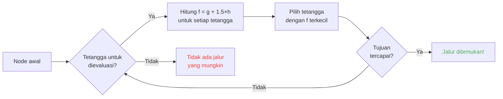

## Pendahuluan

Aku menghabiskan berjam-jam melihat domba menabrak tembok.

Dan jujur? Investasi terbaik dalam hidupku xD

Karena semakin kamu lihat mob-mob ini, semakin kamu sadar bahwa mereka tidaklah acak. Setiap gerakan dikodekan, bisa diprediksi, dan yang terpenting -- bisa dieksploitasi sepenuhnya. Aku akhirnya menyelami kode sumber Minecraft untuk benar-benar memahami cara kerja pathfinding, dan yang kutemukan adalah kamu bisa benar-benar mengontrol pikiran mob. Maksudku, memaksa mereka pergi ke mana KAMU mau, bukan ke tempat yang diputuskan secara acak.

Panduan ini adalah semua yang kupelajari saat menyelidikinya. AI, algoritma A*, malus tersembunyi, eksploitasi yang bisa kamu pakai di survival. Siapkan beliungmu.

---

## Cara kerja AI mob (spoiler: kacau)

### Goals

Setiap mob memiliki *goals*. Ini adalah daftar hal yang BISA dia lakukan dan seberapa besar dia INGIN melakukannya. Semakin kecil angkanya, semakin prioritas -- seperti daftar tugas versi chaos.

```java
protected void registerGoals() {
   this.goalSelector.addGoal(4, new Zombie.ZombieAttackTurtleEggGoal(this, 1.0, 3));
   this.goalSelector.addGoal(8, new LookAtPlayerGoal(this, Player.class, 8.0F));
   this.goalSelector.addGoal(8, new RandomLookAroundGoal(this));
   this.addBehaviourGoals();
}
```

Pernah lihat zombie mengabaikan telur penyu untuk mengejarmu? Itu alasannya: `ZombieAttackTurtleEggGoal` punya prioritas 4, sedangkan `ZombieAttackGoal` (hal yang menyuruhnya memakan mukamu) ada di prioritas 2.

Ya, zombie lebih memilih memakanmu daripada memecahkan telur. Indahnya cinta xD

Goal yang benar-benar menarik perhatian kita adalah `WaterAvoidingRandomStrollGoal`, prioritas 7. Goal "nggak ada kerjaan jadi jalan-jalan random". Di sinilah kekacauan dimulai.

### Pergerakan (atau "bagaimana random walk punya 1 dari 60 kesempatan untuk terjadi")

Setiap tick (setiap 0.05 detik), game memanggil `canUse()` untuk melihat apakah mob mau bergerak. 1 dari 60 kesempatan setiap tick. Benar-benar kacau desainnya, dan aku suka itu.

```java
public boolean canUse() {
   if (this.mob.hasControllingPassenger()) {
      return false;
   } else {
      if (!this.forceTrigger) {
         if (this.checkNoActionTime && this.mob.getNoActionTime() >= 100) {
            return false;
         }
         if (this.mob.getRandom().nextInt(reducedTickDelay(this.interval)) != 0) {
            return false;
         }
      }
      Vec3 $$0 = this.getPosition();
      if ($$0 == null) {
         return false;
      } else {
         this.wantedX = $$0.x;
         this.wantedY = $$0.y;
         this.wantedZ = $$0.z;
         this.forceTrigger = false;
         return true;
      }
   }
}
```

Jadi singkatnya: kalau kamu naik di atas mob -> tidak, kalau mob tidak melakukan apa-apa selama 5 detik -> tidak, kalau random bilang tidak -> tidak. Game ini BENAR-BENAR tidak ingin mob bergerak.

Tapi saat dia bergerak, `getPosition()` mengambil alih:

```java
protected Vec3 getPosition() {
   if (this.mob.isInWater()) {
      Vec3 $$0 = LandRandomPos.getPos(this.mob, 15, 7);
      return $$0 == null ? super.getPosition() : $$0;
   } else {
      return this.mob.getRandom().nextFloat() >= this.probability
         ? LandRandomPos.getPos(this.mob, 10, 7)
         : super.getPosition();
   }
}
```

Lihat dua angka di akhir: itu radius XZ dan radius Y. Di air, mob mencari lebih jauh (15 bukan 10). Kalau tidak menemukan daratan, dia fallback ke `super.getPosition()` yang menerima air. **Hasilnya: mob INGIN keluar dari air.** Itulah kenapa hewan-hewanmu berenang seperti gila ke tepi.

Detail kecil yang menarik: ada 0.1% kemungkinan mob mengambil `super.getPosition()` daripada `LandRandomPos`. Satu banding seribu. Mojanglah xD

### LandRandomPos: optimasi jelek yang mengubah segalanya

Ini adalah tahap FAVORITKU. Kebodohan teknis paling indah yang membuat pathfinding bisa dieksploitasi.

```java
public static Vec3 getPos(PathfinderMob $$0, int $$1, int $$2, ToDoubleFunction<BlockPos> $$3) {
   boolean $$4 = GoalUtils.mobRestricted($$0, $$1);
   return RandomPos.generateRandomPos(() -> {
      BlockPos $$4xx = RandomPos.generateRandomDirection($$0.getRandom(), $$1, $$2);
      BlockPos $$5 = generateRandomPosTowardDirection($$0, $$1, $$4, $$4xx);
      return $$5 == null ? null : movePosUpOutOfSolid($$0, $$5);
   }, $$3);
}
```

`movePosUpOutOfSolid`. Namanya sudah menjelaskan semuanya. Jika posisi yang dipilih ada di dalam blok solid, game mendorongnya ke atas sampai berada di udara.

Ini adalah optimasi: daripada membuang waktu mengabaikan posisi di bawah tanah, game mendorongnya ke permukaan. Pintar? Ya. Tapi ini menciptakan bias yang gila: **mob lebih suka tempat tinggi**.

Bayangkan. Kamu punya banyak blok di bawah permukaan, game menghasilkan 10 posisi acak. Yang ada di dalam blok didorong ke atas. Area padat (di bawah bukit) menghasilkan lebih banyak posisi valid daripada area kosong. Hasilnya: mob secara statistik lebih sering pergi ke bukit.

Percayalah, kita akan mengeksploitasi ini dalam 2 menit.

### Seleksi: kontes blok terbaik

10 posisi, satu pemenang, kontes skor:

```java
public static Vec3 generateRandomPos(Supplier<BlockPos> $$0, ToDoubleFunction<BlockPos> $$1) {
   double $$2 = Double.NEGATIVE_INFINITY;
   BlockPos $$3 = null;
   for(int $$4 = 0; $$4 < 10; ++$$4) {
      BlockPos $$5 = (BlockPos)$$0.get();
      if ($$5 != null) {
         double $$6 = $$1.applyAsDouble($$5);
         if ($$6 > $$2) {
            $$2 = $$6;
            $$3 = $$5;
         }
      }
   }
   return $$3 != null ? Vec3.atBottomCenterOf($$3) : null;
}
```

Posisi dengan skor tertinggi MENANG. Dan kalau kita tahu kriteria skornya, kita bisa membuat posisi yang kita inginkan menang. Ini seperti mengatur kecurangan pemilu.

---

## Preferensi mob (atau "kenapa sapimu menyeberang jalan")

Setiap mob punya selera berbeda. Dan itu mengubah segalanya.

| Mob | Suka ini |
| --- | --- |
| **Hewan** (sapi, domba, babi) | Rumput dan cahaya (hipsters) |
| **Monster** (zombie, skeleton) | Gelap (edgelords) |
| **Penyu** | Air, kalau tidak pasir, kalau tidak cahaya |
| **Hoglin** | `crimson_nylium`; benci `warped_fungus` |
| **Strider** | Hanya lava. Bukan yang LAIN. |
| **Silverfish** | Blok yang bisa diinfestasi (logis) |
| **Guardian** | Air + cahaya (para snob) |
| **Mooshroom** | Mycelium + cahaya (jamur) |
| **Lebah** | Udara. Ya, mereka lebih suka UDARA. |

```java
// Hewan: lihat ke bawah, kalau rumput, skor maks
public float getWalkTargetValue(BlockPos $$0, LevelReader $$1) {
   return $$1.getBlockState($$0.below()).is(Blocks.GRASS_BLOCK) ? 10.0F : $$1.getPathfindingCostFromLightLevels($$0);
}

// Monster: kebalikannya
public float getWalkTargetValue(BlockPos $$0, LevelReader $$1) {
   return -$$1.getPathfindingCostFromLightLevels($$0);
}
```

Monster tuh literally "kalau terang, skor negatif, aku pergi ke lain tempat". Mereka CEMBERUT sama cahaya xD

Jadi kamu bisa -- literally -- memandu hewanmu dengan rumput dan cahaya, dan monstermu dengan kegelapan. Ini konyol sekaligus brilian.

---

## Algoritma A* di Minecraft (rumus rahasia)

Minecraft menggunakan algoritma A* (A-star) untuk pathfinding. Tapi Mojang menambahkan sentuhannya:

```
f(n) = g(n) + 1.5 × h(n)
```

- **g(n)** = jarak yang sudah ditempuh (1 per blok, ~1.41 secara diagonal)
- **h(n)** = jarak garis lurus
- **1.5** = karena Mojang suka hal-hal yang sedikit rusak

Normalnya A* menggunakan `f(n) = g(n) + h(n)`. MOJANG MENAMBAHKAN FAKTOR 1.5. Kenapa? Agar algo lebih cepat menuju tujuan dan memangkas lebih sedikit cabang pencarian. Hasilnya: jalur yang ditemukan "cukup bagus" tapi tidak selalu yang terbaik. Ini A* yang sedikit mabuk.



Detail penting: **mob hanya bisa pathfinding dalam 16 blok** (*follow range*-nya). Jika tujuan terlalu jauh, dia memilih blok terdekat yang bisa DIA capai. Artinya kamu bisa membuat monolit di luar jangkauan, dan mob akan pathfinding menuju blok terdekat yang mendekatkannya ke monolit itu -- membuat pergerakannya sepenuhnya bisa diprediksi.

### Dua eksploitasi yang merusak game

#### 1. Block updates = recalculation paksa

```java
public boolean shouldRecomputePath(BlockPos $$0) {
   if (this.hasDelayedRecomputation) return false;
   if (this.path != null && !this.path.isDone() && this.path.getNodeCount() != 0) {
      Node $$1 = this.path.getEndNode();
      Vec3 $$2 = new Vec3(
         ((double)$$1.x + this.mob.getX()) / 2.0,
         ((double)$$1.y + this.mob.getY()) / 2.0,
         ((double)$$1.z + this.mob.getZ()) / 2.0
      );
      return $$0.closerToCenterThan($$2, (double)(this.path.getNodeCount() - this.path.getNextNodeIndex()));
   }
   return false;
}
```

Setiap update blok di dekat jalur mob memaksa recalculation A* dengan cooldown 1 detik. Kamu pasang clock 1 detik di samping mob, dan dia menghitung ulang jalurnya TERUS-MENERUS. Ini setara dengan memasang GPS yang di-reset setiap detik.

Dan kalau kamu lakukan ini dengan 50 mob sekaligus? Lag city. RIP TPS.

#### 2. Malus blok (Pathfinding Malice)

Blok tertentu menakut-nakuti mob. Secara harfiah. Setiap blok memiliki biaya terkait, yang didefinisikan oleh enum:

| Blok / Kondisi | Malus |
| --- | --- |
| **Blok madu** | +8 untuk melewati |
| **Bubuk salju** | Tidak bisa dilalui |
| **Pintu tertutup** | Tidak bisa dilalui |
| **Api** | +16 untuk melewati, +8 untuk menyusuri |
| **Hewan & Villageois** | Api = -1 (NGGAK) |
| **Kaktus / Sweet berry** | Tidak bisa dilalui; berdekatan = +8 |
| **Air** | +8 untuk melewati atau menyusuri |
| **Magma** | +8 untuk menyusuri (aduh) |

Hewan bahkan lebih ekstrem:

```java
protected Animal(EntityType<? extends Animal> $$0, Level $$1) {
   super($$0, $$1);
   this.setPathfindingMalus(PathType.DANGER_FIRE, 16.0F);
   this.setPathfindingMalus(PathType.DAMAGE_FIRE, -1.0F);
}
```

DAMAGE_FIRE di -1.0F, itu literally "terlarang". Seekor hewan lebih memilih menjatuhkan diri ke jurang daripada melewati api. Fiuh.

### Latihan: kontes jalur besar

Bayangkan seorang villageois yang harus memilih antara beberapa jalur.

- **Jalur A**: 15 blok tapi 6 blok menyusuri air (+8 setiap)
- **Jalur B**: 18 blok dengan 2 blok air (+8) dan 1 blok berdekatan air (+8)
- **Jalur C**: 14 blok lurus... tapi ada api -> TIDAK BISA DILALUI untuk villageois
- **Jalur D**: 16 blok dengan 1 blok berdekatan magma (+8) + 1 blok berdekatan madu (+8)
- **Jalur E**: 25 blok tapi kaktus di mana-mana (+8 di mana-mana) -> 90.82 total biaya LOL

Hitungan mental:

- Jalur A : 15 blok + 6×8 untuk air = 15 + 48 = **63** ... tapi ada 1.5×jarak yang harus ditambahkan. Mari kita hitung yang bener.
- Jalur B: lebih panjang tapi lebih sedikit malus. Total biaya = jarak kumulatif + malus.
- Jalur D: magma dan madu menumpuk malusnya.

Pemenangnya biasanya **Jalur B**: memutar lebih menguntungkan karena air MAHAL.

Seorang villageois pada dasarnya adalah kalkulator biaya dengan kaki xD

### Setiap mob punya seleranya

Seorang villageois: "api? NGGAK MAU DONG BYE"
Zombie: "api? OK boomer *lewat sambil terbakar*"

Kamu literally punya rute yang diambil beberapa mob dan yang lain tidak. Kamu bisa membuat jalan tol villageois di mana zombie hangus terbakar.

---

## Villageois: kekacauan tertinggi

Oke, villageois. Ini adalah hal yang PALING tidak dipahami di seluruh Minecraft. Tapi begitu kamu paham kodenya, kamu sadar bahwa mereka adalah mesin yang bisa diprediksi dengan jam kerja kantoran.

### Sensor dan memori

9 sensor, berjalan setiap 20 tick (1 detik). Masing-masing mengamati radius di sekitar villageois dan menyimpan hasilnya di memori. Villageois melihat segalanya, mengingat segalanya, dan bertindak berdasarkan itu.

Kayak: "apakah ada musuh? item di tanah? pemain untuk diajak bicara?" -- dia ngecek SEMUANYA.

### Package (fase hariannya)

Otak villageois adalah package aktivitas yang aktif tergantung waktu:

| Package | Jadwal | Villageois... |
| --- | --- | --- |
| **Core** | 24 jam | Membuka pintu, berenang (80% waktu), dan MEMPEROLEH POI |
| **Work** | 8-15 | "Aku mau kerja" -- berjalan ke tempat kerjanya |
| **Meet** | 15-17 | "Ngopi!" -- pergi ke bell, ngobrol |
| **Rest** | 18-6 | "Harus tidur" -- pergi ke tempat tidur |
| **Idle** | 6-8, 17-18 | "Santai" -- jalan-jalan, bikin bayi, lompat di tempat tidur |
| **Panic** | Terluka/hostile | "TOLONG" -- KABUR |

Package **Panic** adalah satu-satunya yang bisa menginterupsi SEMUA yang lain. Bahkan jika villageois sedang tidur atau kerja, kalau ada zombie, PANIK TOTAL.

### Acquire POI: hal yang memungkinkan redstone nirkabel

```java
Set<Pair<Holder<PoiType>, BlockPos>> $$12 = (Set)$$10xx.findAllClosestFirstWithType(
   $$0, $$11, $$8x.blockPosition(), 48, PoiManager.Occupancy.HAS_SPACE
)
```

`Acquire POI` memindai dalam radius 48 blok semua POI (points of interest). Dia menyimpan 5 yang terdekat, memeriksa apakah jalur ada, dan memperoleh yang pertama bisa dijangkau.

Setiap POI memiliki jumlah slot terbatas:
- **Workstation**: 1 slot
- **Tempat tidur**: 1 slot
- **Bell**: 32 slot

Hal yang GILA: **slot dipesan saat akuisisi, BUKAN saat tiba**. Seorang villageois bisa mengunci composter dari ujung map yang lain, tanpa pernah mencapainya.

Kamu paham potensinya?

### Redstone nirkabel. Ya, NIRKABEL.

1. Kamu taruh villageois di minecart dengan jalur menuju composter
2. Dia memperoleh composter (slot terambil, tidak ada yang bisa menggunakannya)
3. Villageois terlalu jauh untuk mengkliknya -- bone meal tetap ada
4. Kamu BAWA villageois ini ke mana saja di dunia, dia tetap memegang slot
5. Saat kamu ingin mengaktifkan barangmu, kamu B U N U H villageois itu
6. Slot terbebas, villageois lain memperoleh composter, mengambil bone meal
7. BLOCK UPDATE -> sirkuit redstone mana pun aktif

Kamu literally menciptakan sinyal redstone nirkabel, yang bisa ditransmisikan di seluruh dunia, tanpa perlu chunk load sama sekali di sepanjang jalur. Kamu bisa menghubungkannya ke ender pearl stasis chamber, membuatmu teleport dari mana saja dengan membunuh villageois.

Penggunaan favoritku? Mini-game "bounty hunter": kamu taruh beberapa villageois dengan composter, pemain harus membunuh villageois yang TEPAT untuk mengaktifkan pintu keluar. Benar-benar wtf sebagai mekanik xD

### Pathfinding Deadlock (atau "villageois yang freeze selamanya")

Ada bug yang TERLALU bagus antara `Acquire POI` (yang melihat jalur) dan navigasi nyata (yang menolak melewatinya). Ini terjadi ketika blok di atas workstation tidak bisa diinjak. Hasilnya:

- Core package: "aku ingin memperoleh POI"
- Navigation: "aku tidak bisa berjalan di sana"
- Hasil: villageois tetap BEKU, selamanya, bergumul dengan dirinya sendiri.

Villageois yang literally beku di tempat, bisa digunakan sebagai dekorasi atau "props" di build. Tank baju besi berdiri? Ya. Penjaga yang tidak bergerak? Ya. Mengerikan? Mungkin. Tapi efektif xD

---

## Kesimpulan

Pathfinding mob Minecraft bukanlah kebetulan. Ini adalah sistem deterministik, berbasis skor, bisa diprediksi DAN bisa dieksploitasi.

**Tiga hal yang perlu diingat:**

1. **Blok di bawah kaki = bias ketinggian** -- isi atau kosongkan bawah tanah untuk memandu mob
2. **Malus berbeda untuk setiap mob** -- buat rute yang diambil beberapa mob dan tidak oleh yang lain
3. **Slot POI dipesan dari jarak jauh** -- redstone nirkabel gratis, teleportasi, semuanya

Kode sumber Minecraft adalah tambang emas mekanik yang kurang dimanfaatkan. Aku menghabiskan berjam-jam membaca Java yang didekompilasi dan jujur? Setiap baris adalah Easter Egg fungsional. Hanya saja yang ini, kamu pakai di survival untuk bikin redstone nirkabel dengan villageois. Game terbaik confirmed.

xD
