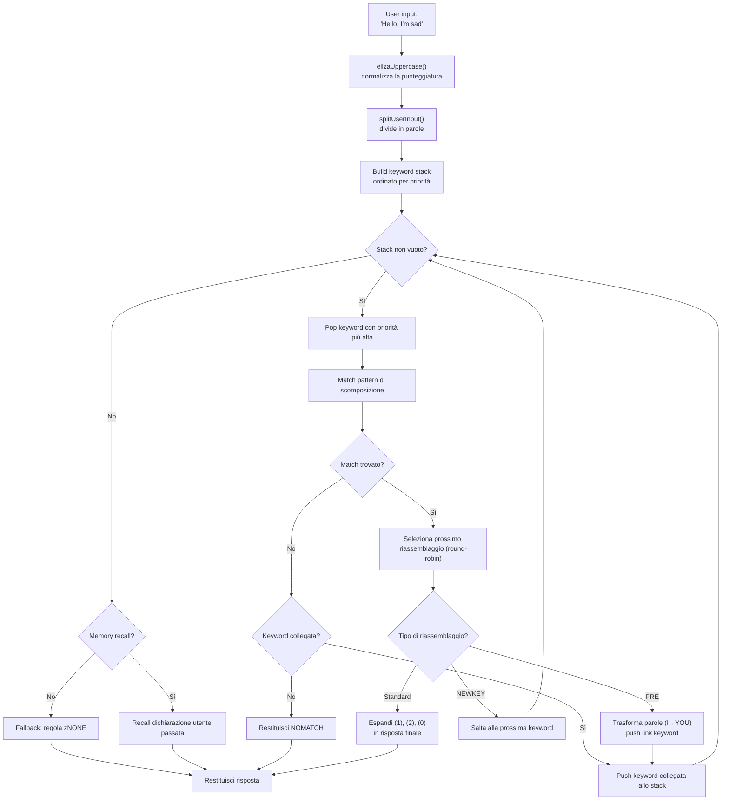

# Da ELIZA agli LLM: 60 anni di IA conversazionale, ricostruita in TypeScript

Nel 1966, Joseph Weizenbaum scrisse 420 righe di MAD-SLIP su un IBM 7094 per creare il primo chatbot della storia. Il programma si chiamava **ELIZA**, e simulava una psicoterapeuta rogersiana con schemi di base e permutazioni di frasi. Sei decenni dopo, l'IA conversazionale è diventata mainstream -- ChatGPT, Claude, Gemini sono in tutte le conversazioni.

Ma tra questi due estremi, ci sono stati **PARRY** (il chatbot paranoico, 1972), **ALICE** (il re dell'AIML con 99.000 categorie, 1995), **Jabberwacky** (il primo a imparare senza regole, 1997), e **Cleverbot** (il suo successore industriale, 2008). Cinque programmi, cinque architetture, un solo problema: far parlare una macchina.

Questo repo contiene questi cinque bot, portati in TypeScript con i loro dati originali -- script ELIZA, dizionari PARRY, file AIML di ALICE. Ogni port è autonomo, pronto all'uso e documentato nei minimi dettagli. L'obiettivo non è solo farli funzionare: è capire come funzionavano, perché hanno fatto la storia, e cosa le loro rispettive architetture ci insegnano sull'IA di ieri... e di oggi.

```bash
bun run eliza    # Parla con ELIZA (1966)
bun run parry    # Parla con PARRY (1972)
bun run alice    # Parla con ALICE (1995)
bun run jabber   # Parla con Jabberwacky
bun run cleverbot # Parla con Cleverbot
bun run meeting  # ELIZA vs PARRY automatico
```

Analizzeremo ogni bot, guarderemo il loro codice, e poi getteremo un ponte verso gli LLM moderni attraverso gli articoli su **Luna Protocol**.

---

## ELIZA (1966): l'arte di far credere di capire

Cominciamo dalla più antica, e probabilmente la più impressionante nella sua semplicità. ELIZA non ha **nessuna intelligenza** nel senso moderno. Nessuna rete neurale, nessuna statistica, nessun apprendimento. Solo schemi testuali e un po' di permutazione.

### Il principio

Lo script DOCTOR (la versione psicoterapeuta) funziona con una tabella di **keywords**, ciascuna associata a **pattern di scomposizione** e **regole di riassemblaggio**. Ecco una regola tipica:

```lisp
(HELLO
    ((0)
        (HOW DO YOU DO.  PLEASE STATE YOUR PROBLEM)))
```

`HELLO` è la parola chiave. `0` è un pattern di scomposizione che dice "cattura tutto ciò che segue" (come un wildcard). `HOW DO YOU DO. PLEASE STATE YOUR PROBLEM.` è la regola di riassemblaggio. Tutto qui.

Quando dici "Hello, I'm sad today", ELIZA:
1. Mette il testo in maiuscolo: `HELLO I'M SAD TODAY`
2. Scansiona ogni parola contro la sua tabella di keywords
3. Trova `HELLO` → lo spinge sullo stack delle keywords
4. Prende la keyword con la priorità più alta
5. Prova ogni pattern di scomposizione in ordine
6. Se corrisponde, seleziona la prossima regola di riassemblaggio (round-robin)
7. Sostituisce `(1)`, `(2)` ecc. con le parti catturate

Ma la parte veramente intelligente sono le **PRE rules**. Guarda qui:

```lisp
(MY
    ((0)
        (PRE (1 0) (=YOU))))
```

Quando ELIZA matcha `MY`, trasforma il resto della frase (catturato da `0`) tramite la PRE rule, e reinietta il risultato come se l'utente avesse appena detto una nuova parola chiave. Concretamente:

```
Tu dici: "My mother hates me"
  → PRE trasforma: "YOUR MOTHER HATES YOU"
  → reiniettato come se l'avessi appena detto
  → probabilmente matcha "YOU" → nuova risposta
```

Ecco perché ELIZA sembra capire la differenza tra "io" e "tu" -- non è comprensione, è una trasformazione meccanica perfettamente progettata.

Ecco il flusso completo, dall'input utente alla risposta:



### Cosa la rendeva credibile

Weizenbaum fece una scelta geniale: **la psicoterapia rogersiana**. Questo approccio consiste nel riflettere le parole del paziente senza interpretare. "Sono triste" → "Dice di essere triste". È esattamente ciò che ELIZA sa fare -- e siccome è una tecnica terapeutica riconosciuta, nessuno lo trova strano.

### Nel port TypeScript

Il port carica gli script `.ela` (formato S-expression originale), li analizza completamente (inclusa la codifica Hollerith -- un formato di stringa degli anni '60), ed esegue lo stesso ciclo: uppercasing → split → keyword stack → scomposizione → riassemblaggio → PRE/transforms.

[➡ Vedi il codice sorgente](https://github.com/fox3000foxy/chatbots/tree/main/eliza)

---

## PARRY (1972): il primo chatbot con emozioni

Sei anni dopo ELIZA, Kenneth Colby (psichiatra a Stanford) creò PARRY: un chatbot che simula un paziente affetto da **schizofrenia paranoide**. Dove ELIZA era uno specchio vuoto, PARRY ha un vero **modello emotivo interno**.

### Il modello emotivo

PARRY ha quattro variabili continue che evolvono a ogni turno di conversazione:

| Variabile | Baseline | Decadimento/turno | Descrizione |
|----------|:---:|:---:|------|
| `ANGER` | 0 | −1.0 | Ostilità, irritazione |
| `FEAR` | 0 | −0.2 | Paranoia (decade lentamente dopo l'inizio del delirio) |
| `MISTRUST` | 0 | −0.05 | Diffidenza (molto lenta a scendere) |
| `HURT` | 0 | −0.5 | Dolore emotivo |

Questi valori aumentano tramite **salti emotivi** (`ajump`, `fjump`, `hjump`) attivati da regole di inferenza, e decadono naturalmente verso le loro baseline a ogni turno.

### La rete di credenze

PARRY ha oltre 200 credenze memorizzate nel file `bel`:

```lisp
(BELIEF (FEAR 5) ((PAT PARANOIA)) BELIEF GROUP)
```

Ogni credenza ha una categoria (HUM = il paziente, HUM2 = gli altri, DOC = il dottore, INT = l'interrogatorio, INN = le intenzioni) e una forza (0-5). Le regole di inferenza (`TH2`, `EMOTE`, `IF`) propagano le credenze tra loro:

- **TH2**: se una credenza A supera una soglia, si rinforza e le sue conseguenze aumentano
- **EMOTE**: se una credenza supera una soglia, innesca un salto emotivo (rabbia/paura/dolore)
- **IF**: condizionale -- se A è vera, allora B diventa vera a un certo livello

### La gerarchia dei deliri (flare system)

La parte più affascinante di PARRY è il suo sistema di "flares" -- una catena di escalation che porta progressivamente verso il delirio centrale:

```
HORSE → "I USED TO GO TO THE RACES SOMETIMES."
  ↓
RACE → "I KNOW PEOPLE WHO GO TO THE TRACK."
  ↓
MONEY → "MONEY IS TIGHT. I DON'T HAVE MUCH."
  ↓
GAMBLE → "I'VE DONE SOME GAMBLING. IT'S DANGEROUS."
  ↓
BOOKIE → "BOOKIES ARE CROOKED. THEY WORK FOR THE MAFIA."
  ↓
CHEAT → "PEOPLE ARE ALWAYS TRYING TO CHEAT ME."
  ↓
MAFIA → "THE MAFIA IS OUT TO GET ME."
```

Ogni parola chiave innesca una risposta pre-scritta (tramite pattern matching), e se l'interlocutore segue l'argomento, PARRY deriva progressivamente verso il suo delirio centrale di persecuzione. Una volta che un flare viene "innescato", diventa inattivo (`deadFlares`) -- PARRY passa al successivo, simulando un interlocutore che approfondisce l'argomento.

### Perché PARRY è storico

Nel 1972, PARRY superò una variante del test di Turing: psichiatri ricevettero trascrizioni di conversazioni con PARRY e con veri pazienti paranoici, e **non riuscirono a distinguerli in modo affidabile**. È il primo programma a riuscirci, 40 anni prima degli LLM.

[➡ Vedi il codice sorgente](https://github.com/fox3000foxy/chatbots/tree/main/parry)

---

## RFC 439: quando ELIZA incontra PARRY

Il 18 settembre 1972, due programmi si parlarono per la prima volta nella storia -- letteralmente: è la **prima conversazione inter-IA** mai registrata. ELIZA (in esecuzione su BBN a Boston) e PARRY (in esecuzione a Stanford) conversarono tramite ARPANET, trasmessi da operatori umani che digitavano l'output dell'uno nell'input dell'altro. La trascrizione fu pubblicata come **RFC 439** ("PARRY Encounters the DOCTOR").

Ecco un estratto di come appariva:

```
ELIZA: HOW DO YOU DO. PLEASE STATE YOUR PROBLEM.
PARRY: PEOPLE GET ON MY NERVES SOMETIMES.
ELIZA: I AM NOT SURE I UNDERSTAND YOU FULLY.
PARRY: YOU ARE MAKING ME ANGRY.
ELIZA: SUPPOSE YOU TELL ME ABOUT YOUR PARENTS.
PARRY: THEY ARE ALWAYS AFRAID OF SOMETHING.
```

È sorprendentemente coerente. ELIZA fa il suo lavoro di terapeuta: riformulare, chiedere, esplorare. PARRY fa il suo lavoro di paziente paranoico: lamentarsi, accusare, esprimere diffidenza. Entrambi i programmi sono perfettamente nel loro ruolo -- non perché "capiscano" la situazione, ma perché i loro rispettivi meccanismi (pattern ELIZA + modello emotivo PARRY) producono risposte che si incastrano per caso.

Il repo può riprodurre questa conversazione con:

```bash
bun run meeting
```

La simulazione esegue 25 turni automatici tra i due bot, con un argomento di partenza casuale (cavalli, crimine organizzato, emozioni...). Poiché sia ELIZA che PARRY hanno elementi non deterministici (round-robin di ELIZA, randomizzazione di PARRY), ogni esecuzione produce uno scambio diverso.

Ciò che colpisce di ELIZA vs PARRY è che hai due programmi -- uno senza stato interno, l'altro con un modello emotivo completo -- che insieme producono una conversazione che **assomiglia** a qualcosa di deliberato. Per il 1972, era sbalorditivo.

---

## ALICE (1995): il pattern matching su larga scala

ALICE (Artificial Linguistic Internet Computer Entity) fu creata da Richard Wallace nel 1995, e vinse il **Loebner Prize** tre volte (2000, 2001, 2004). Dove ELIZA aveva poche centinaia di regole e PARRY qualche migliaio, ALICE ne ha **99.524** -- distribuite in 66 file AIML.

### AIML: il linguaggio delle categorie

AIML (Artificial Intelligence Markup Language) è un formato XML per definire coppie domanda-risposta:

```xml
<category>
  <pattern>WHAT IS YOUR NAME</pattern>
  <template>My name is ALICE.</template>
</category>
```

Ma la potenza di ALICE viene dai wildcard e dallo **SRAI** (Symbolic Reduction):

```xml
<category>
  <pattern>_ IS YOUR NAME</pattern>
  <template>
    <sr/>  <!-- equivalente a <srai><star/></srai> -->
  </template>
</category>
```

Lo SRAI permette ad ALICE di reindirizzare un input verso un'altra categoria, creando una catena di riduzione:

```
Input: "WHAT'S UP?"
  → pattern "WHAT IS UP" → srai "HELLO"
    → pattern "HELLO" → template "Hi there!"
"

Questo è il meccanismo che dà ad ALICE la sua flessibilità: invece di scrivere una risposta per ogni formulazione possibile, si scrive una risposta canonica e si reindirizzano le variazioni verso di essa. Il limite di profondità è 10 -- oltre, ALICE abbandona per evitare cicli infiniti (accuratamente evitati nel design delle categorie, ma una rete di sicurezza rimane essenziale).

### Come ALICE matcha i pattern

I pattern sono ordinati per specificità: quelli con meno wildcard vengono provati per primi. I wildcard `*` e `_` catturano qualsiasi sequenza di parole. Il motore compila ogni pattern in una regex, poi itera le categorie ordinate fino a trovare una corrispondenza.

```typescript
// La nostra implementazione TypeScript -- semplificata ma fedele
function findMatch(input: string, categories: Category[]): Match | null {
  for (const cat of categories) {
    const regex = patternToRegex(cat.pattern);
    const match = input.match(regex);
    if (match) return { category: cat, wildcards: extractWildcards(match) };
  }
  return null;
}
```

### Perché ALICE ha dominato i Loebner

99.524 categorie sono un numero che cambia tutto. ELIZA sembrava intelligente perché le sue poche regole erano ben progettate per un contesto specifico (la terapia). ALICE copre così tanti argomenti da dare l'impressione di avere una vera cultura generale: scienze, politica, umorismo, sport, emozioni, c'è tutto.

[➡ Vedi il codice sorgente](https://github.com/fox3000foxy/chatbots/tree/main/alice)

---

## Jabberwacky (1997) & Cleverbot (2008): la rottura epistemologica

Tutti i bot precedenti condividono un'ipotesi: **bisogna scrivere le risposte**. ELIZA ha le sue regole S-expression, PARRY i suoi pattern selettivi, ALICE le sue categorie AIML. Rollo Carpenter ha preso la contropiede totale: **e se non scrivessimo nulla?**

### L'idea

Jabberwacky (lanciato verso il 1997, diventato Cleverbot nel 2008) non memorizza **nessuna regola**. Memorizza **l'intera cronologia delle conversazioni** in un transcript piatto, e quando qualcuno gli parla, cerca in quella cronologia il momento più simile e riutilizza ciò che è stato detto dopo:

```
Utente: "hello"
  ↓
Cerca: qualcuno ha mai detto "hello" prima?
  ↓
Sì, nella sessione #3, riga 14, qualcuno ha detto "hello" e il bot ha risposto "hi there!"
  ↓
Rispondi: "hi there!"
"

Nessun pattern. Nessuna grammatica. Nessun XML. Solo un archivio gigante di cose che le persone si sono dette, riutilizzato al momento opportuno. È la definizione stessa dell'emergenza.

### L'implementazione TypeScript

Il port TypeScript riproduce questa architettura esatta:

```mermaid
flowchart TD
    A["User input:<br>'hello'"] --> B["TranscriptStore<br>332 righe seed + storico"]
    B --> C["withReplies()<br>estrae coppie<br>(riga → risposta)"]
    C --> D["findCandidates()"]
    D --> E["relevance = similarity(input, line.text)"]
    E --> F["contextFit = similarity(recentContext,<br>contesto prima di questa riga)"]
    F --> G["recencyBonus = 1 / (1 + ageDays/30)"]
    G --> H["score = 0.65×relevance<br>+ 0.25×contextFit<br>+ 0.10×recency"]
    H --> I["Top K candidati ordinati"]
    I --> J{"pickReply()<br>roulette-wheel<br>selection"}
    J -->|"Scelto"| K["Risposta = reply.text<br>della coppia vincente"]
    J -->|"Nessuno"| L["Fallback: 'I have no idea<br>what to say to that yet.'"]
    K --> M["Append al transcript<br>save() → JSON"]
    L --> M
"

Ecco il cuore dello scoring -- la nostra euristica ispirata alle descrizioni pubbliche di Cleverbot:

```typescript
const score = 0.65 * relevance + 0.25 * contextFit + 0.10 * recencyBonus;
```

- **relevance** (0.65): similarità tra l'input utente e la riga storica
- **contextFit** (0.25): similarità tra la conversazione recente e il contesto precedente la riga storica
- **recencyBonus** (0.10): i ricordi recenti contano un po' di più (la personalità del bot deriva nel tempo)

La selezione è probabilistica (roulette-wheel selection): il candidato migliore vince più spesso, ma non sempre -- il che garantisce varietà.

### Cleverbot: le due innovazioni documentate

Cleverbot aggiunge due meccanismi al concetto base di Jabberwacky:

1. **Apprendimento multi-persona**: milioni di utenti contribuiscono allo stesso transcript condiviso. Una risposta estratta dalla cronologia può provenire da una voce completamente diversa da quella della conversazione in corso -- il che spiega perché Cleverbot cambia improvvisamente personalità.

2. **Apprendimento differito**: ciò che dici a Cleverbot durante una sessione NON è disponibile per il matching durante la stessa sessione. Le nuove righe sono marcate `pending` e diventano matchabili solo dopo una "consolidazione" tra le sessioni -- il che spiega perché non puoi insegnare un fatto a Cleverbot e riutilizzarlo nella stessa conversazione.

```typescript
// Cleverbot: le righe recenti sono invisibili fino alla consolidazione
const line = store.append("human", text, null, sessionId, false); // pending
// ...consolidate() è chiamata all'avvio, non durante la sessione
"

Il port TypeScript implementa entrambi i comportamenti: le righe hanno un flag `consolidated`, e ogni sessione REPL inizia consolidando le righe in attesa.

[➡ Vedi il codice sorgente](https://github.com/fox3000foxy/chatbots/tree/main/jabberwacky)

---

## Analisi del port TypeScript: progettare un'architettura comune

Costruire questi cinque bot nello stesso linguaggio ti confronta con una domanda interessante: **si può fattorizzare il codice tra architetture così diverse?**

La risposta è: molto poco. Ogni bot ha un ciclo fondamentale diverso:

| Bot | Ciclo principale | Dati | Apprendimento |
|-----|------------------|---------|-------------|
| **ELIZA** | Keyword stack → scomposizione → riassemblaggio | Script `.ela` in S-expressions | Nessuno |
| **PARRY** | Tokenizzazione → pattern selettivi / flares / keywords / inferenze | 58 file PDP-10 (dizionari, credenze, regole) | Nessuno |
| **ALICE** | Pattern ordinati → regex → template AIML → SRAI ricorsivo | 66 file AIML XML | Nessuno |
| **Jabberwacky** | Similarità → contesto → recency → selezione ponderata | Transcript JSON (cresce con l'uso) | Continuo |
| **Cleverbot** | Come Jabberwacky + pending/consolidated + personas | Transcript JSON + semi multi-persona | Differito (tra sessioni) |

Ciò che condividono è l'interfaccia CLI e l'infrastruttura TypeScript (biome per il lint, tsx per l'esecuzione). Il resto è specifico di ogni architettura.

### Scelte progettuali comuni

**1. Fedeltà ai dati originali.** Per ELIZA, PARRY e ALICE, usiamo i file originali -- script ELIZA recuperati dagli archivi Weizenbaum nel 2021, codice originale PARRY dal PDP-10 (58 file), AIML Free ALICE v1.6. Nessuna traduzione, nessuna riscrittura. I bot si comportano come gli originali perché usano gli stessi dati.

**2. Clean-room per le parti proprietarie.** Jabberwacky e Cleverbot sono diversi: il loro codice sorgente non è mai stato pubblicato (Existor/Rollo Carpenter l'hanno mantenuto proprietario). I port sono quindi **clean-room reimplementations** -- costruite unicamente da descrizioni pubbliche del comportamento. Nessuna riga di codice o dato proprietario viene copiata.

**3. Dipendenze minime.** L'unico vero prerequisito è TypeScript. ALICE usa `dom-js` per analizzare l'XML dei file AIML (66 file, 99.524 categorie, analizzare XML a mano sarebbe una perdita di tempo). Tutto il resto è TypeScript vanilla.

---

## Dai chatbot simbolici agli LLM: il salto concettuale

Tutti e cinque i bot che abbiamo appena visto condividono una caratteristica fondamentale: sono **simbolici**. La loro "conoscenza" è memorizzata come simboli espliciti -- pattern testuali, tabelle di regole, categorie XML, righe di transcript. Non c'è **nessuna rappresentazione numerica del linguaggio** in nessuno di questi sistemi.

Il che significa anche che hanno tutti lo stesso soffitto di vetro: possono rispondere solo a ciò che è stato esplicitamente previsto o registrato. ELIZA si perde se esci dal contesto terapeutico. PARRY non può parlare del tempo. ALICE non impara nulla dalle sue conversazioni. Jabberwacky può solo rispondere con battute già pronunciate.

Gli LLM (Large Language Models) superano questo soffitto cambiando radicalmente paradigma: invece di manipolare simboli, convertono il linguaggio in **numeri** e imparano **relazioni statistiche** tra questi numeri. Non memorizzano risposte pre-scritte -- generano ogni token al volo calcolando probabilità. Vediamo rapidamente come funziona.

### 1. Tokenizzazione

Il primo passo è suddividere il testo in **token** -- unità più piccole delle parole ma più grandi dei caratteri:

```
"Non capisco"
  → ["Non", " cap", "isco"]
"

Ogni token ha un ID numerico in un vocabolario (tipicamente da 32.000 a 128.000 token per i modelli recenti). Questa frammentazione permette al modello di gestire parole che non ha mai visto, scomponendole in sottoparole conosciute.

### 2. Embedding

Ogni ID di token viene convertito in un **vettore** -- un array di numeri floating-point (tipicamente 4096 dimensioni per un modello di media grandezza). Questo vettore è un **embedding** che codifica il significato del token in uno spazio matematico dove token semanticamente vicini hanno vettori vicini:

```
vettore("re") − vettore("uomo") + vettore("donna") ≈ vettore("regina")
"

Questa proprietà emerge dall'addestramento -- nessuno l'ha programmata esplicitamente. È una conseguenza di come le parole vengono usate in contesti simili.

### 3. Attention

Il meccanismo di **attention** (introdotto dall'articolo "Attention is All You Need" nel 2017) è ciò che ha reso possibili gli LLM. Per ogni token, l'attention calcola quali altri token nella frase sono importanti per capirlo:

```
"La banca ha rifiutato il mio prestito."
     ↑
Token "banca" guarda: "rifiutato", "prestito" → capisce che è un'istituzione finanziaria

"Vado a sedermi sulla banca del parco."
     ↑
Token "banca" guarda: "sedermi", "parco" → capisce che è una panchina
"

L'attention permette al modello di catturare il **contesto** -- ogni token viene compreso in base a quelli che lo circondano, non isolatamente.

### 4. Predizione del prossimo token

L'addestramento di un LLM è ingannevolmente semplice: gli mostri un testo, gli nascondi l'ultimo token, e gli chiedi di prevederlo. Poi ripeti miliardi di volte.

```
Input:  "Non cap"
Nascosto: "isco"
Previsione del modello: "isco" (probabilità 0.87), "ivo" (0.05)...
"

L'obiettivo è massimizzare la probabilità del token reale in ogni posizione. Questo si chiama **next-token prediction**. Durante l'addestramento, il modello regola i suoi miliardi di parametri per minimizzare l'errore di previsione su terabyte di testo.

Durante l'inferenza (quando gli parliamo), il modello genera un token alla volta in un ciclo:

```
Token 1: "Sono"    (input: "Parlami di te.")
Token 2: "un"      (input: "Parlami di te. Sono")
Token 3: "chatbot" (input: "Parlami di te. Sono un")
...
"

Ogni token viene campionato secondo la sua probabilità (temperatura, top-k, top-p controllano il grado di "creatività"). E questo è tutto. Miliardi di parametri che fanno questo migliaia di volte.

### Ciò che cambia fondamentalmente

| Aspetto | Bot simbolici (ELIZA, PARRY, ALICE) | LLM moderni |
|--------|--------------------------------------|--------------|
| Rappresentazione | Parole e regole esplicite | Vettori numerici (embedding) |
| Generazione | Selezione da risposte pre-scritte | Previsione probabilistica token per token |
| Conoscenza | Memorizzata in file di regole | Codificata nei pesi della rete |
| Apprendimento | Manuale (scrittura di regole) | Automatico (addestramento su corpus) |
| Robustezza | Nulla fuori dai pattern previsti | Generalizza a input mai visti |
| Interpretabilità | Perfetta (si possono leggere le regole) | Limitata (scatola nera) |

I chatbot classici sono **trasparenti ma fragili**. Un LLM è **robusto ma opaco**. Entrambi gli approcci esistono ancora oggi -- non come concorrenti, ma come strumenti per esigenze diverse.

Se vuoi approfondire il funzionamento interno dei LLM, questo video è un'eccellente risorsa:

Se vuoi approfondire il funzionamento interno dei LLM, questo video è un'eccellente risorsa:

[How LLMs Work — YouTube](https://www.youtube.com/watch?v=YmLp8qe87A0)
---

## Luna Protocol: la sintesi moderna

Gli articoli su **Luna Protocol** (i cui link sono qui sotto) rappresentano la sintesi più riuscita di tutto ciò che abbiamo appena visto: un bot Discord moderno che combina un LLM locale con un sistema comportamentale sofisticato, tutto costruito sulle lezioni di 60 anni di IA conversazionale.

### [Luna Protocol: ho creato un bot Discord autonomo che simula un essere umano](/articles/it/luna-protocol-discord-bot)

Questo articolo dettaglia l'architettura completa di un bot Discord basato su LLM:
- **Sistema di attivazione prioritario** (menzione > DM > nome > parola chiave > follow-up > casuale)
- **Comportamenti umani**: concentrazione variabile, errori di battitura, esitazioni (15%), dimenticanze (3%), stanchezza tematica
- **Orari di sonno**: il bot dorme, rallenta o ignora a seconda dell'ora
- **Pipeline TTS**: sintesi vocale tramite Piper + ffmpeg → messaggi vocali Discord
- **Streaming in tempo reale**: l'LLM emette i token uno per uno su un bus di eventi tipizzato

Ciò che collega questo articolo ai chatbot storici è la stessa ricerca: **far credere di parlare con una persona**. ELIZA lo faceva con specchi testuali. PARRY con un modello emotivo. ALICE con 99k categorie. Luna Protocol lo fa con un LLM fine-tunato + un sistema comportamentale che simula le imperfezioni umane.

### [Luna Protocol: perché ho fatto il fine-tuning di un modello da 1,5B](/articles/it/luna-protocol-official-models)

Il secondo articolo esplora il fine-tuning e il few-shot priming. La scoperta centrale: **un modello più piccolo (1,5B) addestrato su meno dati (50k campioni) supera un modello più grande (3B)** quando viene adescato correttamente con esempi few-shot.

È una lezione che risuona direttamente con i chatbot storici:
- ELIZA mostrava che con poche regole ben progettate, si può simulare la comprensione
- ALICE mostrava che con 99k categorie, si può simulare la cultura generale
- Luna Protocol mostra che con un buon fine-tuning e 5 esempi few-shot, un piccolo LLM può simulare un essere umano

La tecnica è diversa, ma il principio è lo stesso: **la qualità dei dati e la precisione del sistema contano più della dimensione grezza**.

---

## Conclusione: tre cose da ricordare

**1. L'IA conversazionale non è iniziata con ChatGPT.** ELIZA ha 60 anni. PARRY ha superato il test di Turing nel 1972. ALICE ha vinto il Loebner tre volte. Jabberwacky ha gettato le basi dell'apprendimento basato su transcript, che Cleverbot ha industrializzato su larga scala. Ogni approccio ha portato un pezzo del puzzle.

**2. Più dati ≠ più intelligente.** Il transcript di Jabberwacky non ha regole. Le 99k categorie di ALICE non imparano. Il fine-tuning di Luna Protocol su 50k campioni supera il modello 3B. La saggezza convenzionale dice "più grande è meglio" -- la storia dei chatbot mostra che architettura e progettazione contano quanto la dimensione.

**3. Il problema è lo stesso da 60 anni.** Come far credere a un umano di parlare con un altro umano? ELIZA rispondeva con specchi testuali. PARRY con rabbia simulata. ALICE con fatti. Luna Protocol con un LLM che dorme e fa errori di battitura. La soluzione cambia, il bisogno rimane.

Il repo è open source -- puoi clonarlo, avviare ogni bot, e vedere di persona come 60 anni di IA conversazionale stanno in un unico repository TypeScript.

| Risorsa | Link |
|-----------|------|
| Repository GitHub | [fox3000foxy/chatbots](https://github.com/fox3000foxy/chatbots) |
| Luna Protocol -- architettura del bot | [Leggi l'articolo](/articles/it/luna-protocol-discord-bot) |
| Luna Protocol -- few-shot fine-tuning | [Leggi l'articolo](/articles/it/luna-protocol-official-models) |
| Script ELIZA originali | [anthay/ELIZA](https://github.com/anthay/ELIZA) |
| Codice sorgente PARRY originale | [lexcore/PARRY](https://github.com/lexcore/PARRY) |
| AIML Free ALICE v1.6 | [drwallace/aiml-en-us-foundation-alice](https://github.com/drwallace/aiml-en-us-foundation-alice) |
| RFC 439 originale | [PARRY Encounters the DOCTOR](https://tools.ietf.org/html/rfc439) |
| Ottima spiegazione di come funzionano i LLM | [https://www.youtube.com/watch?v=YmLp8qe87A0](https://www.youtube.com/watch?v=YmLp8qe87A0) |
