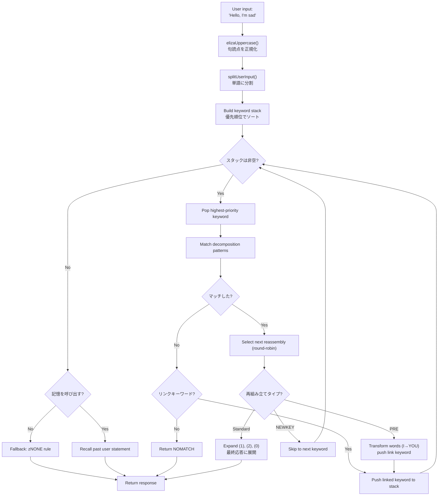
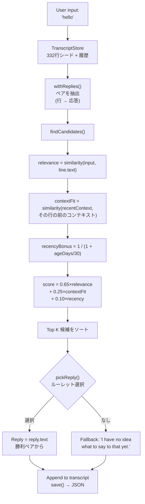

# ELIZAからLLMへ：60年の会話AIをTypeScriptで再構築

1966年、ジョセフ・ワイゼンバウムはIBM 7094上でMAD-SLIPで420行のコードを書き、歴史上初のチャットボットを作成した。プログラム名は**ELIZA**。基本パターンと文の置き換えでロジャーズ派心理療法士をシミュレートしていた。60年後、会話AIは一般大衆の話題となった -- ChatGPT、Claude、Geminiがあらゆる会話に登場している。

しかしこの両極端の間には、**PARRY**（偏執的なチャットボット、1972年）、**ALICE**（99,000カテゴリを誇るAIMLの王者、1995年）、**Jabberwacky**（ルールなしで学習した最初のボット、1997年）、そして**Cleverbot**（その産業的な後継者、2008年）があった。5つのプログラム、5つのアーキテクチャ、たった一つの課題：機械に話させること。

このリポジトリには、これらの5つのボットがTypeScriptで移植され、オリジナルのデータ -- ELIZAスクリプト、PARRY辞書、ALICEのAIMLファイル -- とともに含まれている。各移植は独立しており、すぐに使えて、細部まで文書化されている。目的は単に動かすことではない：それらがどのように動作したか、なぜ歴史に名を残したか、そしてそれぞれのアーキテクチャが過去のAI...そして現在のAIについて何を教えてくれるかを理解することだ。

```bash
bun run eliza    # ELIZA (1966) と話す
bun run parry    # PARRY (1972) と話す
bun run alice    # ALICE (1995) と話す
bun run jabber   # Jabberwacky と話す
bun run cleverbot # Cleverbot と話す
bun run meeting  # ELIZA vs PARRY 自動対話
```

各ボットを詳しく見ていき、コードを確認し、その後**Luna Protocol**に関する記事を通して現代のLLMとの橋渡しをする。

---

## ELIZA (1966)：理解しているふりをする技術

最も古く、おそらくそのシンプルさにおいて最も印象的なものから始めよう。ELIZAには現代的な意味での**知性は一切ない**。ニューラルネットワークも統計も学習もない。ただのテキストパターンといくつかの置き換えだけだ。

### 原理

DOCTORスクリプト（心理療法バージョン）は**キーワード**のテーブルで動作し、各キーワードには**分解パターン**と**再組み立てルール**が関連づけられている。典型的なルールはこうだ：

```lisp
(HELLO
    ((0)
        (HOW DO YOU DO.  PLEASE STATE YOUR PROBLEM)))
```

`HELLO`がキーワード。`0`は「後続のすべてをキャプチャする」という分解パターン（ワイルドカードのようなもの）。`HOW DO YOU DO. PLEASE STATE YOUR PROBLEM.`が再組み立てルール。それだけだ。

「Hello, I'm sad today」と言うと、ELIZAは：
1. テキストを大文字に変換：`HELLO I'M SAD TODAY`
2. 各単語をキーワードテーブルと照合
3. `HELLO`を発見 → キーワードスタックにプッシュ
4. 最優先のキーワードを取得
5. 各分解パターンを順に試行
6. マッチした場合、次の再組み立てルールを選択（ラウンドロビン）
7. `(1)`、`(2)`などをキャプチャした部分で置換

しかし本当に賢い部分は**PREルール**だ。これを見てほしい：

```lisp
(MY
    ((0)
        (PRE (1 0) (=YOU))))
```

ELIZAが`MY`にマッチすると、`0`でキャプチャされた文の残りをPREルールで変換し、その結果をユーザーが新しいキーワードを言ったかのように再注入する。具体的には：

```
あなた: "My mother hates me"
  → PREが変換: "YOUR MOTHER HATES YOU"
  → あなたが今言ったかのように再注入
  → おそらく"YOU"にマッチ → 新しい応答
```

ELIZAが「私」と「あなた」の違いを理解しているように見えるのはこのためだ -- 理解ではなく、完璧に設計された機械的な変換なのだ。

ユーザー入力から応答までの完全なフローは次の通り：



### なぜ信憑性があったのか

ワイゼンバウムは天才的な選択をした：**ロジャーズ派心理療法**だ。このアプローチは、患者の言葉を解釈せずに反映することから成る。「悲しいです」→「悲しいとおっしゃるんですね」。これはまさにELIZAができること -- そしてそれが認められた治療技法であるため、誰も奇妙に思わない。

### TypeScript移植について

この移植は`.ela`スクリプト（オリジナルのS-expression形式）をロードし、完全にパースし（ホレリス符号化も含む -- 60年代の文字列形式）、同じサイクルを実行する：uppercasing → split → keyword stack → 分解 → 再組み立て → PRE/transforms。

[➡ ソースコードを見る](https://github.com/fox3000foxy/chatbots/tree/main/eliza)

---

## PARRY (1972)：感情を持った最初のチャットボット

ELIZAから6年後、ケネス・コルビー（スタンフォードの精神科医）はPARRYを作成した：**パラノイド統合失調症**の患者をシミュレートするチャットボットだ。ELIZAが空の鏡だったのに対し、PARRYには真の**内部感情モデル**がある。

### 感情モデル

PARRYには会話の各ターンで変化する4つの連続変数がある：

| 変数 | ベースライン | 減衰/ターン | 説明 |
|----------|:---:|:---:|------|
| `ANGER` | 0 | −1.0 | 敵意、いらだち |
| `FEAR` | 0 | −0.2 | パラノイア（妄想開始後はゆっくり減衰） |
| `MISTRUST` | 0 | −0.05 | 不信感（非常にゆっくり戻る） |
| `HURT` | 0 | −0.5 | 精神的苦痛 |

これらの値は、推論ルールによってトリガーされる**感情ジャンプ**（`ajump`、`fjump`、`hjump`）を通じて増加し、各ターンで自然にベースラインに向かって減衰する。

### 信念ネットワーク

PARRYには200以上の信念があり、`bel`ファイルに保存されている：

```lisp
(BELIEF (FEAR 5) ((PAT PARANOIA)) BELIEF GROUP)
```

各信念にはカテゴリー（HUM = 患者、HUM2 = 他人、DOC = 医者、INT = 尋問、INN = 意図）と強度（0-5）がある。推論ルール（`TH2`、`EMOTE`、`IF`）が信念間で伝播する：

- **TH2**：信念Aがしきい値を超えると、自己強化され、その結果が増加する
- **EMOTE**：信念がしきい値を超えると、感情ジャンプ（anger/fear/hurt）をトリガーする
- **IF**：条件付き -- Aが真なら、Bが特定のレベルで真になる

### 妄想の階層（フレアシステム）

PARRYの最も魅力的な部分は「フレア」システムだ -- 徐々に中心的妄想へとエスカレートする連鎖：

```
HORSE → "I USED TO GO TO THE RACES SOMETIMES."
  ↓
RACE → "I KNOW PEOPLE WHO GO TO THE TRACK."
  ↓
MONEY → "MONEY IS TIGHT. I DON'T HAVE MUCH."
  ↓
GAMBLE → "I'VE DONE SOME GAMBLING. IT'S DANGEROUS."
  ↓
BOOKIE → "BOOKIES ARE CROOKED. THEY WORK FOR THE MAFIA."
  ↓
CHEAT → "PEOPLE ARE ALWAYS TRYING TO CHEAT ME."
  ↓
MAFIA → "THE MAFIA IS OUT TO GET ME."
```

各キーワードは事前に書かれた応答をトリガーし（パターンマッチングによる）、相手が話題を追うと、PARRYは徐々に迫害の中心的妄想へと滑り込む。フレアが「発動」すると、それは非アクティブ（`deadFlares`）になる -- PARRYは次へ進み、話題を掘り下げる相手をシミュレートする。

### PARRYが歴史的な理由

1972年、PARRYはチューリングテストの変種に合格した：精神科医はPARRYとの会話と実際のパラノイア患者との会話の文字起こしを受け取り、**信頼できる区別ができなかった**。LLMより40年早く、これを達成した最初のプログラムだ。

[➡ ソースコードを見る](https://github.com/fox3000foxy/chatbots/tree/main/parry)

---

## RFC 439：ELIZAがPARRYと出会うとき

1972年9月18日、二つのプログラムが歴史上初めて互いに話した -- 文字通り：これは記録された**初のAI間会話**だ。ELIZA（ボストンのBBNで稼働）とPARRY（スタンフォードで稼働）は、ARPANETを介して会話し、一方の出力をもう一方の入力にタイプする人間のオペレーターによって中継された。その書き起こしは**RFC 439**（"PARRY Encounters the DOCTOR"）として公開された。

以下がその会話の抜粋だ：

```
ELIZA: HOW DO YOU DO. PLEASE STATE YOUR PROBLEM.
PARRY: PEOPLE GET ON MY NERVES SOMETIMES.
ELIZA: I AM NOT SURE I UNDERSTAND YOU FULLY.
PARRY: YOU ARE MAKING ME ANGRY.
ELIZA: SUPPOSE YOU TELL ME ABOUT YOUR PARENTS.
PARRY: THEY ARE ALWAYS AFRAID OF SOMETHING.
```

驚くほど一貫している。ELIZAはセラピストの仕事をしている：言い換え、質問、探求。PARRYはパラノイア患者の仕事をしている：不平、非難、不信の表明。両方のプログラムが完璧に役割を果たしている -- 状況を「理解」しているからではなく、それぞれのメカニズム（ELIZAパターン + PARRY感情モデル）が偶然噛み合う応答を生成するからだ。

リポジトリでこの会話を再現できる：

```bash
bun run meeting
```

シミュレーションは2つのボット間で自動的に25ラウンドを実行し、ランダムな開始トピック（馬、組織犯罪、感情...）で始まる。ELIZAとPARRYはどちらも非決定論的要素（ELIZAのラウンドロビン、PARRYのランダム化）を持つため、実行ごとに異なるやりとりが生成される。

ELIZA vs PARRYで印象的なのは、内部状態を持たないプログラムと完全な感情モデルを持つプログラムという2つが、一緒に**意図的なものに見える**会話を生み出すことだ。1972年当時、これは驚異的だった。

---

## ALICE (1995)：大規模パターンマッチング

ALICE（Artificial Linguistic Internet Computer Entity）は1995年にリチャード・ウォレスによって作成され、**Loebner Prize**を3回（2000、2001、2004）受賞した。ELIZAが数百のルール、PARRYが数千のルールを持っていたのに対し、ALICEは**99,524**ものルールを持っている -- 66のAIMLファイルに分散している。

### AIML：カテゴリの言語

AIML（Artificial Intelligence Markup Language）は、質問応答ペアを定義するためのXML形式だ：

```xml
<category>
  <pattern>WHAT IS YOUR NAME</pattern>
  <template>My name is ALICE.</template>
</category>
```

しかしALICEの真の力はワイルドカードと**SRAI**（Symbolic Reduction）にある：

```xml
<category>
  <pattern>_ IS YOUR NAME</pattern>
  <template>
    <sr/>  <!-- <srai><star/></srai> と同等 -->
  </template>
</category>
```

SRAIにより、ALICEは入力を別のカテゴリにリダイレクトでき、リダクションのチェーンを作成する：

```
Input: "WHAT'S UP?"
  → pattern "WHAT IS UP" → srai "HELLO"
    → pattern "HELLO" → template "Hi there!"
```

これがALICEに柔軟性を与えるメカニズムだ：考えられるすべての表現に対して応答を書く代わりに、標準の応答を書き、バリエーションをそこにリダイレクトする。深さの上限は10 -- それを超えるとALICEは諦め、無限ループを避ける（カテゴリ設計では注意深く回避されているが、安全策は依然として重要だ）。

### ALICEがパターンをマッチする方法

パターンは特異性でソートされる：ワイルドカードが少ないものが最初に試行される。ワイルドカード`*`と`_`は任意の単語シーケンスをキャプチャする。エンジンは各パターンを正規表現にコンパイルし、ソートされたカテゴリを反復してマッチを見つける。

```typescript
// 私たちのTypeScript実装 -- 簡略化されているが忠実
function findMatch(input: string, categories: Category[]): Match | null {
  for (const cat of categories) {
    const regex = patternToRegex(cat.pattern);
    const match = input.match(regex);
    if (match) return { category: cat, wildcards: extractWildcards(match) };
  }
  return null;
}
```

### ALICEがLoebnerを支配した理由

99,524のカテゴリ -- この数がすべてを変える。ELIZAは、いくつかのルールが特定のコンテキスト（セラピー）向けにうまく設計されていたため、賢く見えた。ALICEは非常に多くのトピックをカバーしているため、本当の一般知識を持っているように見える：科学、政治、ユーモア、スポーツ、感情、すべてが揃っている。

[➡ ソースコードを見る](https://github.com/fox3000foxy/chatbots/tree/main/alice)

---

## Jabberwacky (1997) & Cleverbot (2008)：認識論的断絶

これまでのすべてのボットは一つの仮説を共有している：**応答は書かれなければならない**。ELIZAにはS-expressionルール、PARRYには選択的パターン、ALICEにはAIMLカテゴリ。ロロ・カーペンターは完全に逆を行った：**何も書かなかったらどうなる？**

### アイデア

Jabberwacky（1997年頃にローンチ、2008年にCleverbotとなる）は**いかなるルールも**保存しない。すべての会話履歴をフラットなトランスクリプトに保存し、誰かが話しかけると、その履歴の中で最も類似した瞬間を探し、その後で言われたことを再利用する：

```
ユーザー: "hello"
  ↓
検索：以前誰かが"hello"と言ったか？
  ↓
はい、セッション#3の14行目で、誰かが"hello"と言い、ボットが"hi there!"と答えた
  ↓
応答: "hi there!"
```

パターンなし。文法なし。XMLなし。ただ人々が互いに言ったことの巨大なアーカイブを、適切なタイミングで再利用するだけだ。これこそ創発の定義そのものだ。

### TypeScript実装

TypeScript移植はこの正確なアーキテクチャを再現している：



以下がスコアリングの核心 -- Cleverbotの公開記述に触発された独自のヒューリスティック：

```typescript
const score = 0.65 * relevance + 0.25 * contextFit + 0.10 * recencyBonus;
```

- **relevance** (0.65)：ユーザー入力と履歴行の類似度
- **contextFit** (0.25)：最近の会話と履歴行の前のコンテキストの類似度
- **recencyBonus** (0.10)：最近の記憶は少し重みが高い（ボットの性格は時間とともに変化する）

選択は確率的（ルーレット選択）：最良の候補がより頻繁に勝つが、常にではない -- これが多様性をもたらす。

### Cleverbot：文書化された2つの革新

CleverbotはJabberwackyの基本コンセプトに2つのメカニズムを追加する：

1. **マルチパーソン学習**：何百万ものユーザーが同じ共有トランスクリプトに貢献する。履歴から引き出された応答は、現在の会話とは完全に異なる声から来る可能性がある -- これがCleverbotが突然性格を変える理由を説明している。

2. **遅延学習**：セッション中にCleverbotに言ったことは、その同じセッション中はマッチングに**利用できない**。新しい行は`pending`とマークされ、セッション間の「統合」後でのみマッチ可能になる -- これがCleverbotに事実を教えても同じ会話で再利用できない理由を説明している。

```typescript
// Cleverbot：新しい行は統合まで不可視
const line = store.append("human", text, null, sessionId, false); // pending
// ...consolidate()は起動時に呼ばれ、セッション中は呼ばれない
```

TypeScript移植はこれらの両方の振る舞いを実装している：行には`consolidated`フラグがあり、各REPLセッションは保留中の行の統合から始まる。

[➡ ソースコードを見る](https://github.com/fox3000foxy/chatbots/tree/main/jabberwacky)

---

## TypeScript移植の分析：共通アーキテクチャの設計

これら5つのボットを同じ言語で構築することは、興味深い問題に直面することを意味する：**これほど異なるアーキテクチャ間でコードを共通化できるか？**

答えは：ごくわずかだ。各ボットは根本的に異なるメインループを持つ：

| ボット | メインループ | データ | 学習 |
|-----|------------------|---------|-------------|
| **ELIZA** | Keyword stack → 分解 → 再組み立て | S-expressionの`.ela`スクリプト | なし |
| **PARRY** | トークン化 → 選択的パターン / フレア / キーワード / 推論 | 58のPDP-10ファイル（辞書、信念、ルール） | なし |
| **ALICE** | ソート済みパターン → 正規表現 → AIMLテンプレート → 再帰的SRAI | 66のAIML XMLファイル | なし |
| **Jabberwacky** | 類似度 → コンテキスト → 新しさ → 重み付き選択 | JSONトランスクリプト（使用とともに成長） | 継続的 |
| **Cleverbot** | Jabberwacky + pending/consolidated + personas | JSONトランスクリプト + マルチパーソンシード | 遅延（セッション間） |

共通しているのは、CLIインターフェースとTypeScriptインフラ（lint用biome、実行用tsx）だ。残りは各アーキテクチャに固有である。

### 共通設計の選択

**1. オリジナルデータへの忠実さ。** ELIZA、PARRY、ALICEについては、オリジナルファイルを使用している -- 2021年にワイゼンバウムのアーカイブで発見されたELIZAスクリプト、PDP-10からのオリジナルPARRYコード（58ファイル）、AIML Free ALICE v1.6。翻訳も書き換えもない。ボットは同じデータを使用しているため、オリジナルと同じように振る舞う。

**2. プロプライエタリ部分のクリーンルーム。** JabberwackyとCleverbotは異なる：それらのソースコードは公開されたことがない（Existor/ロロ・カーペンターがプロプライエタリに保っている）。したがって、移植は**クリーンルーム再実装**である -- 動作の公開記述のみから構築されている。プロプライエタリなコードやデータの一行もコピーされていない。

**3. 最小限の依存関係。** 唯一の本当の前提条件はTypeScriptだ。ALICEはAIMLファイルのXMLパースに`dom-js`を使用している（66ファイル、99,524カテゴリ -- 自前のXMLパーサーを書くのは時間の無駄だ）。残りはすべてバニラTypeScriptだ。

---

## シンボリックチャットボットからLLMへ：概念的な飛躍

今見てきた5つのボットはすべて、基本的な特徴を共有している：それらは**シンボリック**である。それらの「知識」は明示的なシンボル -- テキストパターン、ルールテーブル、XMLカテゴリ、トランスクリプト行 -- として保存されている。これらのシステムのいずれにも、言語の**数値表現はまったく存在しない**。

つまり、それらはすべて同じガラスの天井を持っている：明示的に計画されたり記録されたりしたことだけに応答できる。ELIZAは治療の枠組みから外れると迷子になる。PARRYは天気の話ができない。ALICEは会話から何も学ばない。Jabberwackyはすでに発せられたセリフでしか応答できない。

LLM（Large Language Models）は、パラダイムを根本的に変えることでこの天井を打ち破る：シンボルを操作する代わりに、言語を**数値**に変換し、これらの数値間の**統計的関係**を学習する。事前に書かれた応答を保存するのではなく -- 確率を計算しながら各トークンをその場で生成する。どのように機能するか簡単に見てみよう。

### 1. トークン化

最初のステップはテキストを**トークン**に分割することだ -- 単語より小さく、文字より大きい単位：

```
"私は理解できない"
  → ["私", "は", "理解", "でき", "ない"]
```

各トークンは語彙内で数値IDを持つ（最近のモデルでは通常32,000〜128,000トークン）。この断片化により、モデルは未知の単語を知られたサブワードに分解して処理できる。

### 2. 埋め込み（Embeddings）

各トークンIDは**ベクトル**に変換される -- 浮動小数点数の配列（中規模モデルでは通常4096次元）。このベクトルは、意味的に近いトークンが近いベクトルを持つ数学的空間にトークンの意味をエンコードする**埋め込み**である：

```
ベクトル("王") − ベクトル("男") + ベクトル("女")  ≈  ベクトル("女王")
```

この特性は学習から生じる -- 誰も明示的にプログラムしていない。これは、単語が類似したコンテキストで使用される方法の結果である。

### 3. 注意（Attention）

**注意**メカニズム（2017年の論文「Attention is All You Need」で導入）は、LLMを可能にしたものだ。各トークンについて、注意は文中の他のどのトークンがそれを理解するのに重要かを計算する：

```
「銀行が私のローンを拒否した。」
     ↑
トークン「銀行」が見ている：「拒否」、「ローン」→ 金融機関だと理解

「銀行の土手を散歩する。」
     ↑
トークン「銀行」が見ている：「散歩」、「の」→ 川岸だと理解
```

注意により、モデルは**コンテキスト**を捉えることができる -- 各トークンは周囲のトークンに基づいて理解され、孤立して理解されるのではない。

### 4. 次のトークンの予測

LLMのトレーニングは欺くほどシンプルだ：テキストを見せ、最後のトークンを隠し、それを予測させる。そしてそれを何十億回も繰り返す。

```
Input:  "私は理解でき"
隠された: "ない"
モデルの予測: "ない" (確率 0.87), "ません" (0.05), "なかった" (0.02)...
```

目標は各位置での正しいトークンの確率を最大化することだ。これを**次トークン予測**と呼ぶ。トレーニング中、モデルはテラバイト単位のテキストで予測誤差を最小化するように数十億のパラメータを調整する。

推論時（話しかけるとき）、モデルはループで一度に1トークンを生成する：

```
Token 1: "私"    (input: "自分のことを話して。")
Token 2: "は"  (input: "自分のことを話して。私")
Token 3: "チャットボット"    (input: "自分のことを話して。私は")
Token 4: "です" (input: "自分のことを話して。私はチャットボット")
...
```

各トークンはその確率に従ってサンプリングされる（temperature、top-k、top-pが「創造性」の度合いを制御する）。それだけだ。数十億のパラメータがこれを何千回も行う。

### 根本的に変わること

| 側面 | シンボリックボット（ELIZA、PARRY、ALICE） | 現代のLLM |
|--------|--------------------------------------|--------------|
| 表現 | 明示的な単語とルール | 数値ベクトル（埋め込み） |
| 生成 | 事前に書かれた応答からの選択 | トークンごとの確率的予測 |
| 知識 | ルールファイルに保存 | ネットワークの重みにエンコード |
| 学習 | 手動（ルールの作成） | 自動（コーパスでのトレーニング） |
| ロバスト性 | 想定外のパターンには無力 | 未知の入力にも一般化 |
| 解釈可能性 | 完璧（ルールを読める） | 限定的（ブラックボックス） |

古典的なチャットボットは**透明だが脆弱**だ。LLMは**ロバストだが不透明**だ。両方のアプローチは今日も存在している -- 競合としてではなく、異なるニーズのためのツールとして。

Si vous voulez approfondir le fonctionnement interne des LLM, cette vidéo est une excellente ressource :

LLMの内部動作についてもっと深く知りたい方には、この動画が最適です:

[How LLMs Work — YouTube](https://www.youtube.com/watch?v=YmLp8qe87A0)
---

## Luna Protocol：現代の統合

**Luna Protocol**に関する記事（以下リンク）は、今見てきたすべての最も完成された統合を表している：ローカルLLMと洗練された行動システムを組み合わせた、60年の会話AIの教訓に基づいて構築されたモダンなDiscordボットだ。

### [Luna Protocol：自律型Discordボットが人間らしい会話を実現](/articles/ja/luna-protocol-discord-bot)

この記事はLLMベースのDiscordボットの完全なアーキテクチャを詳述している：
- **優先度トリガーシステム**（メンション > DM > 名前 > キーワード > フォローアップ > ランダム）
- **人間的振る舞い**：変動する集中力、タイプミス、ためらい（15%）、忘れっぽさ（3%）、話題疲れ
- **睡眠スケジュール**：ボットは時間に応じて睡眠、減速、または無視する
- **TTSパイプライン**：Piper + ffmpegによる音声合成 → Discord音声メッセージ
- **リアルタイムストリーミング**：LLMが型付きイベントバスにトークンを一つずつ発行する

この記事を歴史的なチャットボットに結びつけるのは、同じ探求だ：**人と話していると思わせること**。ELIZAはテキストの鏡でそれをやった。PARRYは感情モデルで。ALICEは99kのカテゴリで。Luna ProtocolはファインチューンされたLLM + 人間の不完全さをシミュレートする行動システムでそれをやる。

### [Luna Protocol：なぜ1.5Bモデルをファインチューニングしたのか](/articles/ja/luna-protocol-official-models)

2番目の記事はファインチューニングとfew-shotプライミングを探求する。中心的な発見：**より小さいモデル（1.5B）をより少ないデータ（50kサンプル）でトレーニングすると、より大きなモデル（3B）を上回る**、適切なfew-shot例でプロンプトすれば。

これは歴史的なチャットボットと直接共鳴する教訓だ：
- ELIZAは、いくつかのうまく設計されたルールで理解をシミュレートできることを示した
- ALICEは、99kのカテゴリで一般知識をシミュレートできることを示した
- Luna Protocolは、良いファインチューニングと5つのfew-shot例で、小さなLLMが人間をシミュレートできることを示している

技術は異なるが、原理は同じだ：**データの品質とシステムの精度は、生のサイズよりも重要である**。

---

## 結論：覚えておくべき3つのこと

**1. 会話AIはChatGPTから始まったわけではない。** ELIZAは60年前だ。PARRYは1972年にチューリングテストに合格した。ALICEはLoebnerを3回受賞した。Jabberwackyはトランスクリプト学習の基礎を築き、Cleverbotがそれを大規模に工業化した。各アプローチがパズルの一片をもたらした。

**2. データが多い ≠ より賢い。** Jabberwackyのトランスクリプトにはルールがない。ALICEの99kカテゴリは学習しない。Luna Protocolの50kサンプルでのファインチューニングは3Bモデルを上回る。従来の知恵は「大きければ大きいほど良い」と言う -- チャットボットの歴史は、アーキテクチャと設計がサイズと同じくらい重要であることを示している。

**3. 問題は60年変わっていない。** どうやって人間に、自分が人間と話していると思わせるか？ELIZAはテキストの鏡で答えた。PARRYはシミュレートされた怒りで。ALICEは事実で。Luna Protocolは眠り、タイプミスをするLLMで。解決策は変わるが、ニーズは変わらない。

リポジトリはオープンソースだ -- クローンして、各ボットを起動し、60年の会話AIがどのように一つのTypeScriptリポジトリに収まるかを自分の目で確かめてほしい。

| リソース | リンク |
|-----------|------|
| GitHubリポジトリ | [fox3000foxy/chatbots](https://github.com/fox3000foxy/chatbots) |
| Luna Protocol -- ボットアーキテクチャ | [記事を読む](/articles/ja/luna-protocol-discord-bot) |
| Luna Protocol -- few-shotファインチューニング | [記事を読む](/articles/ja/luna-protocol-official-models) |
| ELIZAオリジナルスクリプト | [anthay/ELIZA](https://github.com/anthay/ELIZA) |
| PARRYオリジナルソースコード | [lexcore/PARRY](https://github.com/lexcore/PARRY) |
| AIML Free ALICE v1.6 | [drwallace/aiml-en-us-foundation-alice](https://github.com/drwallace/aiml-en-us-foundation-alice) |
| オリジナルRFC 439 | [PARRY Encounters the DOCTOR](https://tools.ietf.org/html/rfc439) |
| LLMの仕組みを優れた解説 | [https://www.youtube.com/watch?v=YmLp8qe87A0](https://www.youtube.com/watch?v=YmLp8qe87A0) |
