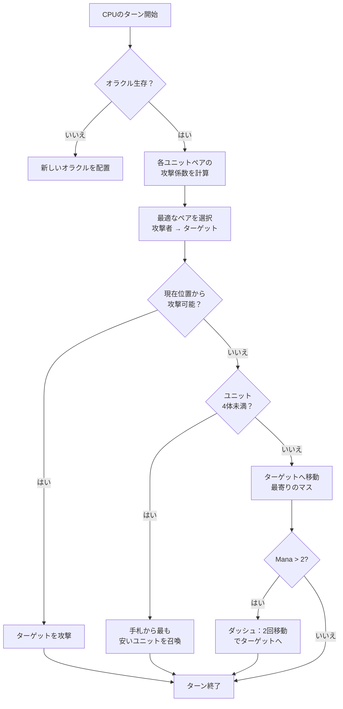

## 俺のクソAI for Nausicaa

「神话テーマのチェス作ってみるか〜」って軽い気持ちで始めたら、5ターンごとにハイパーパラメータを自分で変えるAIが出来上がった。

Nausicaaはそんなゲーム。ターン制のボードゲームで、神话のクリーチャーをデッキ构建、マナを管理しながら10x8の盤面にユニットを展開する。んで、AIが人格変わるっていう xD

このAIにかなり时间かけたけど、结果はめちゃくちゃ手に负えない感じになった xD

## ゲームの基本

脳みその话をする前に、まずはゲーム自体を理解しないとな：

- 10x8の盤面、プレイヤーごとに2列の配置ゾーン
- マナは1からスタート、毎ターン+1、上限6。召唤・攻撃・アビリティに使う
- 目的：相手のOracleを杀す

12体のユニット、それぞれコストと移动パターンが违う：

| Unit | コスト | 移动 | HP |
| --- | --- | --- | --- |
| Oracle | 0 | キング（8方向） | 1 |
| Gobelin | 1 | 前に3マス | 1 |
| Harpie | 1 | キング（8方向） | 1 |
| Naïade | 1 | 斜め | 1 |
| Griffin | 2 | 2マスジャンプ | 2 |
| Sirène | 2 | 横 | 1 |
| Centaure | 2 | 骑士（L字） | 2 |
| Archer | 3 | 横 | 1 |
| Phénix | 3 | 斜め（暗いマスのみ） | 1 |
| Métamorphe | 4 | 位置交换 | 1 |
| Voyant | 4 | なし（マナ生成） | 1 |
| Titan | 6 | 制限あり（範囲攻撃） | 3 |

ユニットごとに攻撃パターンも违う。Sirèneは斜め4方向、Archerは3マス先まで远距离、Titanは召唤时周囲を壊灭させる。つまり神话xデッキ构建チェスって感じ xD

## CPUに考えさせる方法

基本アイデアはシンプルにバカみたい：**敌ユニットそれぞれに魅力度（アトラクティブネス）系数をつける**。危険なヤツほどAIが狙う。

```javascript
const UNITS_ATTRACTIVENESS = {
    "oracle": 100,
    "titan": 95,
    "shapeshifter": 90,
    "phoenix": 80,
    "siren": 70,
    "archer": 70,
    "seer": 70,
    "griffin": 60,
    "centaur": 60,
    "harpy": 50,
    "naiad": 30,
    "gobelin": 20
};
```

Oracleが100なのは当然、胜ち条件だからな。Titanが95なのは召唤时に周囲をOSするから。Gobelinは20、ただの步兵だからどうでもいい。

で、味方と敌のユニットのペアごとにこれを计算する：

```
interet = attractivite × coeff_attract / (distance × coeff_dist)
```

つまり：危険で近いほど、AIがぶっ飞ばしたがる。

```javascript
calculateAttackCoefficient(x1, y1, x2, y2) {
    const distance = this.calculateEuclideanDistance(x1, y1, x2, y2);
    if (distance === 0) return Infinity;
    return (UNITS_ATTRACTIVENESS[unit.type] * COEFFICIENTS_IMPORTANCE["attractiveness"]) / distance;
}
```

### 系数がコロコロ変わるやつ

ここが面白いとこなんだけど、重要度系数が**5ターンごとにランダムで変わる**。

```javascript
if (this.turnCount % 5 === 0) {
    const distanceCoefficient = parseInt(Math.random() * 100);
    const attractivenessCoefficient = parseInt(Math.random() * 100);
    this.regulateImportanceCoefficients({
        distance: distanceCoefficient,
        attractiveness: attractivenessCoefficient
    });
}
```

ある时は超アグレッシブ（魅力95、距离5）で、Oracleをぶっ杀しに一直线。次のターンは距离优先で再配置する。

これ、パックマンの幽霊からパクってるんだよね。Blinkyは追跡、Pinkyは待ち伏せ。ここではAIがフェーズごとに「性格」を変える。

**结果：1试合全体を通してAIの行动を予测するのは不可能。** CPUが同じ试合を2度とやらない。

### Oracleは弱虫

敌のOracleは逃げる。文字通り。

```javascript
const awayFromTarget = {
    row: Math.max(0, Math.min(7, botUnitElement.row + (botUnitElement.row - targetUnitElement.row))),
    col: Math.max(0, Math.min(9, botUnitElement.col + (botUnitElement.col - targetUnitElement.col)))
};
```

威胁の逆方向を计算して逃げまくる。壁があったらその方向で一番近い空きマスを探す。

3ターンかけてOracleに近づいて、そしたらもうチビっ子みたいに逃げてるんだぜ xD

### 决定ループ

AIの判断フローはこんな感じ：

1. Oracleがもういなかったら（死んだら）、新しいのを配置
2. 味方ユニット→敌ユニットのペアごとに系数を计算
3. ベストなペアを选択
4. 今の位置からターゲットを攻撃できるなら → 攻撃
5. ユニットが4体未満なら → 手札から一番安いのを召唤
6. それ以外なら → ターゲットに移动（敌に一番近い移动マスへ）
7. マナが余ってたら（> 2）、ダッシュ（2回移动）でさらに接近
8. ユニットがOracleなら → 逃げる



```javascript
async makeAction(dash=false) {
    // 全部顺番に处理
    // マナが余ってたらCPUはダッシュする
    if(botPlayer.mana > 2) {
        this.makeAction(true);
    }
}
```

### なんでユークリッド距离なの

ユークリッド距离を使ってる：

```javascript
calculateEuclideanDistance(x1, y1, x2, y2) {
    const deltaX = Math.pow(x1 - x2, 2);
    const deltaY = Math.pow(y1 - y2, 2);
    return Math.sqrt(deltaX + deltaY) * COEFFICIENTS_IMPORTANCE["distance"];
}
```

マンハッタン距离じゃない理由？ユニットの移动パターンがバラバラだから（L字とか骑士移动、斜め移动とか）。鸟瞰距离の方が危険度の近似としてマシなんだよね。

## なんでミニマックスじゃないの

普通にミニマックス组むこともできた。でも12种类のユニット、违う移动パターン、特殊アビリティ…ゲーム木が爆発的に増えてやってられなくなる。ヒューリスティックなアプローチなら、1000万の状态を探索しなくてもスマートな判断ができる。

## イケてるとこ

魅力度システムが面白いジレンマを生む：

- Voyant（70）はマナを生成する。生かしておくと相手のリソースが増える。でもTitan（95）の方がまだ危険。
- Métamorphe（90）はどのユニットとも位置を交换できる。Oracleを盗むことも可能。
- Harpie（50）は自分も死ぬ爆発攻撃を持つ。优先度低い…でも自分のユニット3体の隣にいたら话は别。

AIは単なる生のステータスじゃなくて、位置に応じた全体的な危険度を评価してる。

あと`activateSimulation()`って関数があって、フルで试合しなくてもシナリオテストできる：

```javascript
activateSimulation() {
    // 特定のユニットを盘面に配置
    // AIデバッグに便利
    this.game.board = simulation.board;
    this.game.players = simulation.players;
}
```

## 足りないとこ

もっと时间があったらやりたいこと：

- AIは今の状态にしか反应してない。プレイヤーの行动予测はしない
- 手札を复数ターンにわたって计画してない
- MétamorpheとCentaureの能力を活かしきれてない
- 强化学习：自分自身と対戦させて系数を调整する

でもブラウザゲームとしては十分。知り合いがこれに负けてるから、まあ及第点だな xD

## 试してみて

[nausicaa-game.github.io](https://nausicaa-game.github.io/) で公开中。「JOUER」をクリックしてCPUモードON、AIの动きを见てみて。

アドバイス：AI同士で戦わせてみるといい。超アグレッシブなフェーズのあと、いきなり全员下がったりするから。

コードは[GitHub](https://github.com/nausicaa-game/nausicaa-game.github.io)の`js/cpu.js`にある。

**3つのポイント：**

1. **ヒューリスティック系数** -- ミニマックスなし、ユニットごとに魅力度がある
2. **5ターンごとに系数が変わる** -- AIが攻势と管理を交互に、パックマン方式
3. **Oracleは逃げる** -- 威胁の逆方向を计算して速攻离脱

AIをもっと凶悪にするアイデアがあったらIssueを开いてくれ。败北から学ぶバージョンの计画もあるけど、それはまた次の記事でな xD
