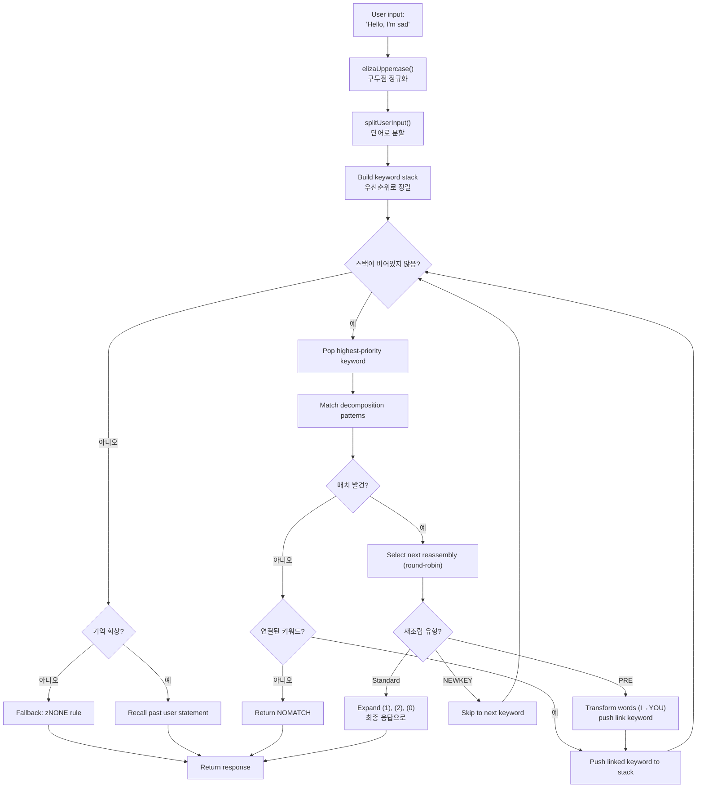
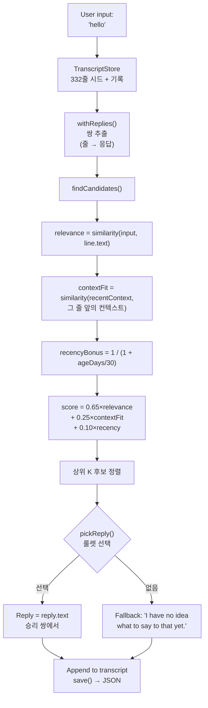

# ELIZA에서 LLM까지: 60년의 대화형 AI를 TypeScript로 재구성하다

1966년, 조셉 와이젠바움이 IBM 7094에서 MAD-SLIP으로 420줄의 코드를 작성해 역사상 최초의 챗봇을 만들었습니다. 프로그램 이름은 **ELIZA**였고, 기본 패턴과 문장 변환을 사용해 로저스식 심리치료사를 시뮬레이션했습니다. 60년 후, 대화형 AI는 대중의 화두가 되었습니다 -- ChatGPT, Claude, Gemini가 모든 대화에 등장하고 있습니다.

하지만 이 두 극단 사이에는 **PARRY**(편집증적 챗봇, 1972년), **ALICE**(99,000개 카테고리의 AIML 왕, 1995년), **Jabberwacky**(규칙 없이 학습한 최초의 봇, 1997년), 그리고 **Cleverbot**(그 산업적 후계자, 2008년)이 있었습니다. 다섯 프로그램, 다섯 아키텍처, 하나의 문제: 기계가 말하게 하기.

이 리포지토리에는 이 다섯 봇이 TypeScript로 포팅되어 있으며, 원본 데이터 -- ELIZA 스크립트, PARRY 사전, ALICE의 AIML 파일 -- 도 함께 포함되어 있습니다. 각 포팅은 독립적이고, 즉시 사용 가능하며, 세부 사항까지 문서화되어 있습니다. 목표는 단순히 실행하는 것이 아닙니다: 그것들이 어떻게 작동했는지, 왜 역사에 남았는지, 그리고 각 아키텍처가 과거의 AI... 그리고 오늘날의 AI에 대해 무엇을 가르쳐 주는지 이해하는 것입니다.

```bash
bun run eliza    # ELIZA (1966)와 대화
bun run parry    # PARRY (1972)와 대화
bun run alice    # ALICE (1995)와 대화
bun run jabber   # Jabberwacky와 대화
bun run cleverbot # Cleverbot과 대화
bun run meeting  # ELIZA vs PARRY 자동 대화
```

각 봇을 분석하고, 코드를 살펴본 다음, **Luna Protocol**에 관한 기사를 통해 현대 LLM과의 연결점을 만들어 보겠습니다.

---

## ELIZA (1966): 이해하는 척하는 기술

가장 오래된 것부터, 아마도 그 단순함에서 가장 인상적인 것부터 시작합시다. ELIZA에는 현대적 의미의 **지능이 전혀 없습니다**. 신경망도, 통계도, 학습도 없습니다. 그저 텍스트 패턴과 약간의 변환만 있을 뿐입니다.

### 원리

DOCTOR(심리치료사 버전) 스크립트는 **키워드** 테이블로 작동하며, 각 키워드에는 **분해 패턴**과 **재조립 규칙**이 연결되어 있습니다. 전형적인 규칙은 이렇습니다:

```lisp
(HELLO
    ((0)
        (HOW DO YOU DO.  PLEASE STATE YOUR PROBLEM)))
```

`HELLO`가 키워드입니다. `0`은 "뒤에 오는 모든 것을 캡처하라"는 분해 패턴(와일드카드 같은)입니다. `HOW DO YOU DO. PLEASE STATE YOUR PROBLEM.`은 재조립 규칙입니다. 그게 전부입니다.

"Hello, I'm sad today"라고 말하면, ELIZA는:
1. 텍스트를 대문자로 변환: `HELLO I'M SAD TODAY`
2. 각 단어를 키워드 테이블과 대조
3. `HELLO` 발견 → 키워드 스택에 푸시
4. 최우선순위 키워드를 가져옴
5. 각 분해 패턴을 순서대로 시도
6. 매치되면 다음 재조립 규칙 선택(라운드 로빈)
7. `(1)`, `(2)` 등을 캡처된 부분으로 대체

하지만 진짜 영리한 부분은 **PRE 규칙**입니다. 이걸 보세요:

```lisp
(MY
    ((0)
        (PRE (1 0) (=YOU))))
```

ELIZA가 `MY`를 매치하면, `0`으로 캡처된 문장의 나머지를 PRE 규칙을 통해 변환하고, 그 결과를 사용자가 방금 새 키워드를 말한 것처럼 재주입합니다. 구체적으로는:

```
당신: "My mother hates me"
  → PRE가 변환: "YOUR MOTHER HATES YOU"
  → 당신이 방금 말한 것처럼 재주입
  → 아마 "YOU"에 매치 → 새 응답
```

ELIZA가 "나"와 "당신"의 차이를 이해하는 것처럼 보이는 이유입니다 -- 이해가 아니라 완벽하게 설계된 기계적 변환입니다.

사용자 입력부터 응답까지의 전체 흐름은 다음과 같습니다:



### 왜 신뢰할 수 있었는가

와이젠바움은 천재적인 선택을 했습니다: **로저스식 심리치료**입니다. 이 접근법은 해석 없이 환자의 말을 반영하는 것으로 구성됩니다. "슬퍼요" → "슬프다고 말씀하시는군요". 이것이 바로 ELIZA가 할 수 있는 일이고 -- 인정된 치료 기법이기 때문에 아무도 이상하게 생각하지 않습니다.

### TypeScript 포팅에서

이 포팅은 `.ela` 스크립트(원본 S-expression 형식)를 로드하고, 완전히 파싱하며(홀러리스 인코딩 포함 -- 60년대의 문자열 형식), 동일한 사이클을 실행합니다: uppercasing → split → keyword stack → 분해 → 재조립 → PRE/transforms.

[➡ 소스 코드 보기](https://github.com/fox3000foxy/chatbots/tree/main/eliza)

---

## PARRY (1972): 감정을 가진 최초의 챗봇

ELIZA로부터 6년 후, 케네스 콜비(스탠포드 정신과 의사)는 PARRY를 만들었습니다: **편집성 정신분열증** 환자를 시뮬레이션하는 챗봇입니다. ELIZA가 빈 거울이었다면, PARRY는 진정한 **내부 감정 모델**을 가지고 있습니다.

### 감정 모델

PARRY에는 대화의 각 턴마다 변화하는 4개의 연속 변수가 있습니다:

| 변수 | 기준선 | 감쇠/턴 | 설명 |
|----------|:---:|:---:|------|
| `ANGER` | 0 | −1.0 | 적대감, 짜증 |
| `FEAR` | 0 | −0.2 | 편집증(망상 시작 후 천천히 감쇠) |
| `MISTRUST` | 0 | −0.05 | 불신(매우 천천히 내려감) |
| `HURT` | 0 | −0.5 | 정서적 고통 |

이 값들은 추론 규칙에 의해 트리거되는 **감정 점프**(`ajump`, `fjump`, `hjump`)를 통해 증가하고, 각 턴마다 자연스럽게 기준선으로 감쇠합니다.

### 신념 네트워크

PARRY에는 200개 이상의 신념이 있으며, `bel` 파일에 저장되어 있습니다:

```lisp
(BELIEF (FEAR 5) ((PAT PARANOIA)) BELIEF GROUP)
```

각 신념에는 카테고리(HUM = 환자, HUM2 = 타인, DOC = 의사, INT = 심문, INN = 의도)와 강도(0-5)가 있습니다. 추론 규칙(`TH2`, `EMOTE`, `IF`)이 신념 간에 전파됩니다:

- **TH2**: 신념 A가 임계값을 초과하면, 자체 강화되고 그 결과가 증가합니다
- **EMOTE**: 신념이 임계값을 초과하면, 감정 점프(anger/fear/hurt)를 트리거합니다
- **IF**: 조건부 -- A가 참이면, B가 특정 수준에서 참이 됩니다

### 망상의 계층 구조(플레어 시스템)

PARRY의 가장 매혹적인 부분은 "플레어" 시스템입니다 -- 점진적으로 중심 망상으로 이끄는 에스컬레이션 체인:

```
HORSE → "I USED TO GO TO THE RACES SOMETIMES."
  ↓
RACE → "I KNOW PEOPLE WHO GO TO THE TRACK."
  ↓
MONEY → "MONEY IS TIGHT. I DON'T HAVE MUCH."
  ↓
GAMBLE → "I'VE DONE SOME GAMBLING. IT'S DANGEROUS."
  ↓
BOOKIE → "BOOKIES ARE CROOKED. THEY WORK FOR THE MAFIA."
  ↓
CHEAT → "PEOPLE ARE ALWAYS TRYING TO CHEAT ME."
  ↓
MAFIA → "THE MAFIA IS OUT TO GET ME."
```

각 키워드는 미리 작성된 응답을 트리거하고(패턴 매칭을 통해), 상대가 주제를 따라가면 PARRY는 점차 박해의 중심 망상으로 빠져듭니다. 플레어가 "발동"되면 비활성화(`deadFlares`)됩니다 -- PARRY는 다음으로 넘어가며, 주제를 파고드는 대화 상대를 시뮬레이션합니다.

### PARRY가 역사적인 이유

1972년, PARRY는 튜링 테스트의 변형을 통과했습니다: 정신과 의사들은 PARRY와의 대화와 실제 편집증 환자와의 대화 기록을 받았고, **신뢰할 수 있게 구분하지 못했습니다**. LLM보다 40년 앞서 이를 달성한 최초의 프로그램입니다.

[➡ 소스 코드 보기](https://github.com/fox3000foxy/chatbots/tree/main/parry)

---

## RFC 439: ELIZA가 PARRY를 만날 때

1972년 9월 18일, 두 프로그램이 역사상 처음으로 서로 대화했습니다 -- 말 그대로: 기록된 **최초의 AI 간 대화**입니다. ELIZA(보스턴의 BBN에서 실행)와 PARRY(스탠포드에서 실행)는 ARPANET을 통해 대화했으며, 한쪽의 출력을 다른 쪽의 입력으로 입력하는 인간 운영자에 의해 중계되었습니다. 대화록은 **RFC 439**("PARRY Encounters the DOCTOR")로 발표되었습니다.

대화의 일부는 이렇게 생겼습니다:

```
ELIZA: HOW DO YOU DO. PLEASE STATE YOUR PROBLEM.
PARRY: PEOPLE GET ON MY NERVES SOMETIMES.
ELIZA: I AM NOT SURE I UNDERSTAND YOU FULLY.
PARRY: YOU ARE MAKING ME ANGRY.
ELIZA: SUPPOSE YOU TELL ME ABOUT YOUR PARENTS.
PARRY: THEY ARE ALWAYS AFRAID OF SOMETHING.
```

놀랍도록 일관됩니다. ELIZA는 치료사의 일을 합니다: 바꿔 말하기, 질문하기, 탐구하기. PARRY는 편집증 환자의 일을 합니다: 불평하기, 비난하기, 불신 표현하기. 두 프로그램 모두 완벽하게 제 역할을 합니다 -- 상황을 "이해"하기 때문이 아니라, 각각의 메커니즘(ELIZA 패턴 + PARRY 감정 모델)이 우연히 맞물리는 응답을 생성하기 때문입니다.

리포지토리에서 이 대화를 재현할 수 있습니다:

```bash
bun run meeting
```

시뮬레이션은 두 봇 간에 자동으로 25라운드를 실행하며, 무작위 시작 주제(말, 조직 범죄, 감정...)로 시작합니다. ELIZA와 PARRY 모두 비결정적 요소(ELIZA의 라운드 로빈, PARRY의 무작위화)를 가지고 있기 때문에, 실행할 때마다 다른 대화가 생성됩니다.

ELIZA vs PARRY에서 인상적인 점은, 하나는 내부 상태가 없고 다른 하나는 완전한 감정 모델을 가진 두 프로그램이 함께 **의도적인 것처럼 보이는** 대화를 만들어낸다는 것입니다. 1972년에는 이것이 경악스러운 일이었습니다.

---

## ALICE (1995): 대규모 패턴 매칭

ALICE(Artificial Linguistic Internet Computer Entity)는 1995년 리처드 월리스에 의해 만들어졌고, **Loebner Prize**를 세 번(2000, 2001, 2004) 수상했습니다. ELIZA가 수백 개의 규칙을, PARRY가 수천 개의 규칙을 가진 반면, ALICE는 **99,524개**를 가지고 있습니다 -- 66개의 AIML 파일에 분산되어 있습니다.

### AIML: 카테고리의 언어

AIML(Artificial Intelligence Markup Language)은 질문-응답 쌍을 정의하기 위한 XML 형식입니다:

```xml
<category>
  <pattern>WHAT IS YOUR NAME</pattern>
  <template>My name is ALICE.</template>
</category>
```

하지만 ALICE의 진정한 힘은 와일드카드와 **SRAI**(Symbolic Reduction)에 있습니다:

```xml
<category>
  <pattern>_ IS YOUR NAME</pattern>
  <template>
    <sr/>  <!-- <srai><star/></srai> 와 동일 -->
  </template>
</category>
```

SRAI를 통해 ALICE는 입력을 다른 카테고리로 리디렉션하여 리덕션 체인을 만들 수 있습니다:

```
Input: "WHAT'S UP?"
  → pattern "WHAT IS UP" → srai "HELLO"
    → pattern "HELLO" → template "Hi there!"
```

이것이 ALICE에 유연성을 주는 메커니즘입니다: 가능한 모든 표현에 대해 응답을 작성하는 대신, 표준 응답을 작성하고 변형을 그쪽으로 리디렉션합니다. 깊이 제한은 10입니다 -- 그 이상은 ALICE가 포기하여 무한 루프를 방지합니다(카테고리 설계에서 주의 깊게 회피되지만, 안전장치는 여전히 필수적입니다).

### ALICE가 패턴을 매치하는 방법

패턴은 특이성으로 정렬됩니다: 와일드카드가 적은 것이 먼저 시도됩니다. 와일드카드 `*`와 `_`는 모든 단어 시퀀스를 캡처합니다. 엔진은 각 패턴을 정규식으로 컴파일하고, 정렬된 카테고리를 반복하여 매치를 찾습니다.

```typescript
// 우리의 TypeScript 구현 -- 단순화되었지만 충실함
function findMatch(input: string, categories: Category[]): Match | null {
  for (const cat of categories) {
    const regex = patternToRegex(cat.pattern);
    const match = input.match(regex);
    if (match) return { category: cat, wildcards: extractWildcards(match) };
  }
  return null;
}
```

### ALICE가 Loebner를 지배한 이유

99,524개의 카테고리 -- 이 숫자가 모든 것을 바꿉니다. ELIZA는 몇 가지 규칙이 특정 맥락(치료)에 잘 설계되었기 때문에 똑똑해 보였습니다. ALICE는 너무 많은 주제를 다루기 때문에 진정한 교양을 가진 것처럼 보입니다: 과학, 정치, 유머, 스포츠, 감정, 모든 것이 있습니다.

[➡ 소스 코드 보기](https://github.com/fox3000foxy/chatbots/tree/main/alice)

---

## Jabberwacky (1997) & Cleverbot (2008): 인식론적 단절

이전의 모든 봇은 하나의 가설을 공유합니다: **응답은 작성되어야 한다**. ELIZA에는 S-expression 규칙, PARRY에는 선택적 패턴, ALICE에는 AIML 카테고리가 있습니다. 롤로 카펜터는 완전히 반대로 갔습니다: **아무것도 작성하지 않으면 어떨까?**

### 아이디어

Jabberwacky(1997년경 출시, 2008년에 Cleverbot이 됨)는 **어떤 규칙도** 저장하지 않습니다. 모든 대화 기록을 플랫한 트랜스크립트에 저장하고, 누군가 말을 걸면 그 기록에서 가장 유사한 순간을 찾아 그 후에 말해진 것을 재사용합니다:

```
사용자: "hello"
  ↓
검색: 예전에 누군가 "hello"라고 말한 적이 있나?
  ↓
네, 세션 #3, 14번째 줄에서 누군가 "hello"라고 말하고 봇이 "hi there!"라고 답했습니다.
  ↓
응답: "hi there!"
```

패턴 없음. 문법 없음. XML 없음. 그저 사람들이 서로에게 말한 것의 거대한 아카이브를 적절한 순간에 재사용하는 것뿐입니다. 이것이야말로 창발의 정의입니다.

### TypeScript 구현

TypeScript 포팅은 이 정확한 아키텍처를 재현합니다:



다음은 점수 계산의 핵심입니다 -- Cleverbot의 공개된 설명에서 영감을 받은 우리만의 휴리스틱:

```typescript
const score = 0.65 * relevance + 0.25 * contextFit + 0.10 * recencyBonus;
```

- **relevance** (0.65): 사용자 입력과 기록 줄 사이의 유사도
- **contextFit** (0.25): 최근 대화와 기록 줄 앞의 컨텍스트 사이의 유사도
- **recencyBonus** (0.10): 최근 기억이 약간 더 가중됨(봇의 성격은 시간에 따라 변화함)

선택은 확률적(룰렛 선택): 최고 후보가 더 자주 이기지만, 항상 그렇지는 않습니다 -- 다양성을 제공합니다.

### Cleverbot: 문서화된 두 가지 혁신

Cleverbot은 Jabberwacky의 기본 개념에 두 가지 메커니즘을 추가합니다:

1. **다중 사용자 학습**: 수백만 명의 사용자가 동일한 공유 트랜스크립트에 기여합니다. 기록에서 가져온 응답은 현재 대화와 완전히 다른 목소리에서 올 수 있습니다 -- 이것이 Cleverbot이 갑자기 성격을 바꾸는 이유를 설명합니다.

2. **지연 학습**: 세션 중에 Cleverbot에게 말한 내용은 동일한 세션 중에는 매칭에 **사용할 수 없습니다**. 새 줄은 `pending`으로 표시되고, 세션 간 "통합" 후에만 매칭 가능해집니다 -- 이것이 Cleverbot에게 사실을 가르쳐도 같은 대화에서 재사용할 수 없는 이유를 설명합니다.

```typescript
// Cleverbot: 새 줄은 통합까지 보이지 않음
const line = store.append("human", text, null, sessionId, false); // pending
// ...consolidate()는 시작 시 호출되며, 세션 중에는 호출되지 않음
```

TypeScript 포팅은 이 두 가지 동작을 모두 구현합니다: 줄에는 `consolidated` 플래그가 있고, 각 REPL 세션은 보류 중인 줄의 통합으로 시작됩니다.

[➡ 소스 코드 보기](https://github.com/fox3000foxy/chatbots/tree/main/jabberwacky)

---

## TypeScript 포팅 분석: 공통 아키텍처 설계

이 다섯 봇을 같은 언어로 구축하는 것은 흥미로운 질문에 직면한다는 것을 의미합니다: **이렇게 다른 아키텍처 간에 코드를 공통화할 수 있을까?**

정답은: 거의 불가능합니다. 각 봇은 근본적으로 다른 메인 루프를 가지고 있습니다:

| 봇 | 메인 루프 | 데이터 | 학습 |
|-----|------------------|---------|-------------|
| **ELIZA** | Keyword stack → 분해 → 재조립 | S-expression `.ela` 스크립트 | 없음 |
| **PARRY** | 토큰화 → 선택적 패턴 / 플레어 / 키워드 / 추론 | 58개 PDP-10 파일(사전, 신념, 규칙) | 없음 |
| **ALICE** | 정렬된 패턴 → 정규식 → AIML 템플릿 → 재귀적 SRAI | 66개 AIML XML 파일 | 없음 |
| **Jabberwacky** | 유사도 → 컨텍스트 → 최신성 → 가중치 선택 | JSON 트랜스크립트(사용에 따라 성장) | 지속적 |
| **Cleverbot** | Jabberwacky + pending/consolidated + personas | JSON 트랜스크립트 + 다중 사용자 시드 | 지연(세션 간) |

공통점은 CLI 인터페이스와 TypeScript 인프라(lint용 biome, 실행용 tsx)입니다. 나머지는 각 아키텍처에 특화되어 있습니다.

### 공통 설계 선택

**1. 원본 데이터에 대한 충실함.** ELIZA, PARRY, ALICE의 경우, 원본 파일을 사용합니다 -- 2021년 와이젠바움 아카이브에서 발견된 ELIZA 스크립트, PDP-10의 원본 PARRY 코드(58개 파일), AIML Free ALICE v1.6. 번역도, 재작성도 없습니다. 봇은 동일한 데이터를 사용하기 때문에 원본처럼 동작합니다.

**2. 독점 부분에 대한 클린룸.** Jabberwacky와 Cleverbot은 다릅니다: 그 소스 코드는 공개된 적이 없습니다(Existor/롤로 카펜터가 독점으로 유지했습니다). 따라서 포팅은 **클린룸 재구현**입니다 -- 동작에 대한 공개된 설명만을 기반으로 구축되었습니다. 독점 코드나 데이터의 한 줄도 복사되지 않았습니다.

**3. 최소한의 의존성.** 유일한 진정한 전제 조건은 TypeScript입니다. ALICE는 AIML 파일의 XML 파싱에 `dom-js`를 사용합니다(66개 파일, 99,524개 카테고리 -- 자체 XML 파서를 작성하는 것은 시간 낭비일 것입니다). 나머지는 모두 바닐라 TypeScript입니다.

---

## 기호적 챗봇에서 LLM으로: 개념적 도약

방금 본 다섯 봇은 모두 근본적인 특성을 공유합니다: 그것들은 **기호적**입니다. 그들의 "지식"은 명시적 기호 -- 텍스트 패턴, 규칙 테이블, XML 카테고리, 트랜스크립트 줄 -- 로 저장됩니다. 이 시스템들 중 어느 것에도 언어의 **수치적 표현이 전혀 없습니다**.

또한 이것은 모두 같은 유리 천장을 가지고 있음을 의미합니다: 명시적으로 계획되거나 기록된 것에만 응답할 수 있습니다. ELIZA는 치료 프레임워크를 벗어나면 길을 잃습니다. PARRY는 날씨에 대해 말할 수 없습니다. ALICE는 대화에서 아무것도 배우지 않습니다. Jabberwacky는 이미 발화된 대사로만 응답할 수 있습니다.

LLM(Large Language Models)은 패러다임을 근본적으로 변경함으로써 이 천장을 돌파합니다: 기호를 조작하는 대신 언어를 **숫자**로 변환하고 이 숫자 간의 **통계적 관계**를 학습합니다. 미리 작성된 응답을 저장하지 않고 -- 각 토큰을 확률을 계산하며 즉석에서 생성합니다. 어떻게 작동하는지 간단히 살펴보겠습니다.

### 1. 토큰화

첫 번째 단계는 텍스트를 **토큰**으로 분할하는 것입니다 -- 단어보다 작지만 문자보다 큰 단위:

```
"나는 이해하지 못한다"
  → ["나", "는", "이해", "하지", "못한다"]
```

각 토큰은 어휘 내에서 숫자 ID를 가집니다(최신 모델의 경우 일반적으로 32,000~128,000 토큰). 이 분할을 통해 모델은 본 적 없는 단어를 알려진 하위 단어로 분해하여 처리할 수 있습니다.

### 2. 임베딩(Embeddings)

각 토큰 ID는 **벡터**로 변환됩니다 -- 부동소수점 배열(중간 크기 모델의 경우 일반적으로 4096 차원). 이 벡터는 의미적으로 가까운 토큰이 가까운 벡터를 갖는 수학적 공간에 토큰의 의미를 인코딩하는 **임베딩**입니다:

```
벡터("왕") − 벡터("남자") + 벡터("여자")  ≈  벡터("여왕")
```

이 특성은 훈련에서 발생합니다 -- 누구도 명시적으로 프로그래밍하지 않았습니다. 이는 단어가 유사한 맥락에서 사용되는 방식의 결과입니다.

### 3. 어텐션(Attention)

**어텐션** 메커니즘(2017년 논문 "Attention is All You Need"에서 도입)은 LLM을 가능하게 만든 것입니다. 각 토큰에 대해, 어텐션은 문장에서 다른 어떤 토큰이 그 토큰을 이해하는 데 중요한지 계산합니다:

```
"은행이 내 대출을 거절했다."
     ↑
토큰 "은행"이 보는 것: "거절", "대출" → 금융 기관이라고 이해

"강둑(은행)을 따라 산책하자."
     ↑
토큰 "은행"이 보는 것: "산책", "따라" → 강둑이라고 이해
```

어텐션을 통해 모델은 **맥락**을 포착할 수 있습니다 -- 각 토큰은 주변 토큰에 기반하여 이해되며, 고립되어 이해되지 않습니다.

### 4. 다음 토큰 예측

LLM의 훈련은 속일 정도로 간단합니다: 텍스트를 보여주고, 마지막 토큰을 숨기고, 예측하도록 합니다. 그리고 수십억 번 반복합니다.

```
Input:  "나는 이해하지 못"
숨김:  "한다"
모델 예측: "한다" (확률 0.87), "하겠다" (0.05), "할 것이다" (0.02)...
```

목표는 각 위치에서 올바른 토큰의 확률을 최대화하는 것입니다. 이것이 **다음 토큰 예측**입니다. 훈련 중에 모델은 테라바이트 단위의 텍스트에서 예측 오류를 최소화하도록 수십억 개의 매개변수를 조정합니다.

추론 시(말을 걸 때), 모델은 루프에서 한 번에 하나의 토큰을 생성합니다:

```
Token 1: "저"    (input: "자신에 대해 말해봐.")
Token 2: "는"  (input: "자신에 대해 말해봐. 저")
Token 3: "챗봇"    (input: "자신에 대해 말해봐. 저는")
Token 4: "입니다" (input: "자신에 대해 말해봐. 저는 챗봇")
...
```

각 토큰은 확률에 따라 샘플링됩니다(temperature, top-k, top-p가 "창의성"의 정도를 제어). 그리고 그게 전부입니다. 수십억 개의 매개변수가 이것을 수천 번 수행합니다.

### 근본적으로 변화하는 것

| 측면 | 기호적 봇(ELIZA, PARRY, ALICE) | 현대 LLM |
|--------|--------------------------------------|--------------|
| 표현 | 명시적 단어와 규칙 | 수치적 벡터(임베딩) |
| 생성 | 미리 작성된 응답에서 선택 | 토큰별 확률적 예측 |
| 지식 | 규칙 파일에 저장 | 네트워크 가중치에 인코딩 |
| 학습 | 수동(규칙 작성) | 자동(코퍼스 훈련) |
| 강건성 | 예상된 패턴 외에는 무력 | 본 적 없는 입력에도 일반화 |
| 해석 가능성 | 완벽(규칙을 읽을 수 있음) | 제한적(블랙박스) |

고전적 챗봇은 **투명하지만 취약**합니다. LLM은 **강건하지만 불투명**합니다. 두 접근법 모두 오늘날에도 존재합니다 -- 경쟁자가 아니라 다른 필요를 위한 도구로서.

Si vous voulez approfondir le fonctionnement interne des LLM, cette vidéo est une excellente ressource :

LLM의 내부 작동 방식에 대해 더 깊이 알고 싶다면, 이 비디오가 훌륭한 자료입니다:

[How LLMs Work — YouTube](https://www.youtube.com/watch?v=YmLp8qe87A0)
---

## Luna Protocol: 현대적 종합

**Luna Protocol**에 관한 기사(아래 링크)는 방금 본 모든 것의 가장 완성된 종합을 나타냅니다: 로컬 LLM과 정교한 행동 시스템을 결합한, 60년 대화형 AI의 교훈 위에 구축된 현대적인 Discord 봇입니다.

### [Luna Protocol: 완전 자율적으로 인간을 시뮬레이션하는 Discord 봇을 만들었습니다](/articles/ko/luna-protocol-discord-bot)

이 기사는 LLM 기반 Discord 봇의 완전한 아키텍처를 상세히 설명합니다:
- **우선순위 트리거 시스템**(멘션 > DM > 이름 > 키워드 > 후속 > 랜덤)
- **인간적 행동**: 가변 집중력, 오타, 망설임(15%), 건망증(3%), 주제 피로
- **수면 스케줄**: 봇은 시간에 따라 잠, 감속, 또는 무시
- **TTS 파이프라인**: Piper + ffmpeg를 통한 음성 합성 → Discord 음성 메시지
- **실시간 스트리밍**: LLM이 타입이 지정된 이벤트 버스에 토큰을 하나씩 발행

이 기사를 역사적 챗봇과 연결하는 것은 동일한 추구입니다: **사람과 대화하고 있다고 믿게 하기**. ELIZA는 텍스트 거울로 그것을 했습니다. PARRY는 감정 모델로. ALICE는 99k 카테고리로. Luna Protocol은 파인튜닝된 LLM + 인간의 불완전함을 시뮬레이션하는 행동 시스템으로 그것을 합니다.

### [Luna Protocol: 왜 1.5B 모델을 파인튜닝했는가](/articles/ko/luna-protocol-official-models)

두 번째 기사는 파인튜닝과 few-shot 프라이밍을 탐구합니다. 중심 발견: **더 작은 모델(1.5B)을 더 적은 데이터(50k 샘플)로 훈련하면 더 큰 모델(3B)을 능가한다**, 올바른 few-shot 예제로 프라이밍할 때.

이것은 역사적 챗봇과 직접적으로 공명하는 교훈입니다:
- ELIZA는 잘 설계된 몇 가지 규칙으로 이해를 시뮬레이션할 수 있음을 보여주었습니다
- ALICE는 99k 카테고리로 교양을 시뮬레이션할 수 있음을 보여주었습니다
- Luna Protocol은 좋은 파인튜닝과 5개의 few-shot 예제로 작은 LLM이 인간을 시뮬레이션할 수 있음을 보여줍니다

기술은 다르지만, 원칙은 동일합니다: **데이터 품질과 시스템 정밀도가 원시 크기보다 더 중요하다**.

---

## 결론: 기억해야 할 세 가지

**1. 대화형 AI는 ChatGPT에서 시작되지 않았다.** ELIZA는 60년 전이다. PARRY는 1972년에 튜링 테스트를 통과했다. ALICE는 Loebner를 세 번 수상했다. Jabberwacky는 트랜스크립트 학습의 기초를 놓았고, Cleverbot이 그것을 대규모로 산업화했다. 각 접근법이 퍼즐의 한 조각을 제공했다.

**2. 더 많은 데이터 ≠ 더 똑똑함.** Jabberwacky의 트랜스크립트에는 규칙이 없다. ALICE의 99k 카테고리는 학습하지 않는다. Luna Protocol의 50k 샘플 파인튜닝은 3B 모델을 능가한다. 통념은 "클수록 좋다"고 말한다 -- 챗봇의 역사는 아키텍처와 설계가 크기만큼 중요하다는 것을 보여준다.

**3. 문제는 60년 동안 변하지 않았다.** 어떻게 인간이 다른 인간과 대화하고 있다고 믿게 할까? ELIZA는 텍스트 거울로 답했다. PARRY는 시뮬레이션된 분노로. ALICE는 사실로. Luna Protocol은 자고 오타를 내는 LLM으로. 해결책은 변하지만, 필요는 변하지 않는다.

리포지토리는 오픈 소스입니다 -- 클론하고, 각 봇을 실행하고, 60년의 대화형 AI가 어떻게 하나의 TypeScript 리포지토리에 담기는지 직접 확인해 보세요.

| 리소스 | 링크 |
|-----------|------|
| GitHub 리포지토리 | [fox3000foxy/chatbots](https://github.com/fox3000foxy/chatbots) |
| Luna Protocol -- 봇 아키텍처 | [기사 읽기](/articles/ko/luna-protocol-discord-bot) |
| Luna Protocol -- few-shot 파인튜닝 | [기사 읽기](/articles/ko/luna-protocol-official-models) |
| ELIZA 원본 스크립트 | [anthay/ELIZA](https://github.com/anthay/ELIZA) |
| PARRY 원본 소스 코드 | [lexcore/PARRY](https://github.com/lexcore/PARRY) |
| AIML Free ALICE v1.6 | [drwallace/aiml-en-us-foundation-alice](https://github.com/drwallace/aiml-en-us-foundation-alice) |
| 원본 RFC 439 | [PARRY Encounters the DOCTOR](https://tools.ietf.org/html/rfc439) |
| LLM 작동 방식에 대한 훌륭한 설명 | [https://www.youtube.com/watch?v=YmLp8qe87A0](https://www.youtube.com/watch?v=YmLp8qe87A0) |
