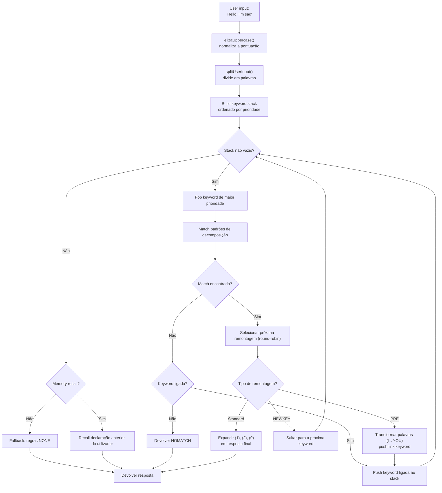
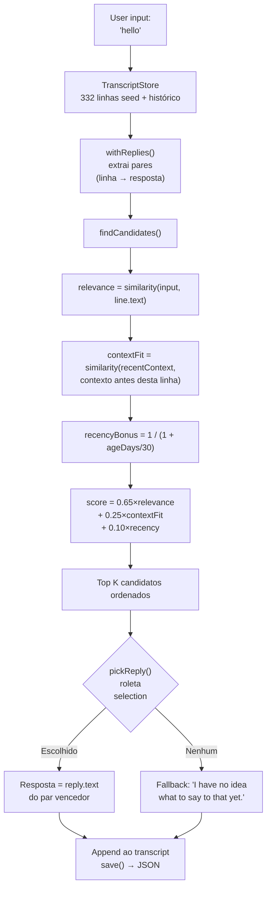

# De ELIZA aos LLM: 60 anos de IA conversacional, reconstruída em TypeScript

Em 1966, Joseph Weizenbaum escreveu 420 linhas de MAD-SLIP num IBM 7094 para criar o primeiro chatbot da história. O programa chamava-se **ELIZA**, e simulava uma psicoterapeuta rogeriana com padrões básicos e permutações de frases. Seis décadas depois, a IA conversacional tornou-se um assunto mainstream -- ChatGPT, Claude, Gemini estão em todas as conversas.

Mas entre estes dois extremos, houve **PARRY** (o chatbot paranoico, 1972), **ALICE** (o rei do AIML com 99 000 categorias, 1995), **Jabberwacky** (o primeiro a aprender sem regras, 1997), e **Cleverbot** (o seu sucessor industrial, 2008). Cinco programas, cinco arquiteturas, um só problema: fazer uma máquina falar.

Este repo contém estes cinco bots, portados para TypeScript com os seus dados originais -- scripts ELIZA, dicionários PARRY, ficheiros AIML da ALICE. Cada port é autónomo, pronto a usar e documentado ao pormenor. O objetivo não é apenas fazê-los funcionar: é compreender como funcionavam, porque marcaram a história, e o que as suas respetivas arquiteturas nos ensinam sobre a IA de ontem... e de hoje.

```bash
bun run eliza    # Fala com ELIZA (1966)
bun run parry    # Fala com PARRY (1972)
bun run alice    # Fala com ALICE (1995)
bun run jabber   # Fala com Jabberwacky
bun run cleverbot # Fala com Cleverbot
bun run meeting  # ELIZA vs PARRY automático
```

Vamos dissecar cada bot, olhar para o seu código, e depois fazer a ponte com os LLM modernos através dos artigos sobre **Luna Protocol**.

---

## ELIZA (1966): a arte de fazer crer que se compreende

Comecemos pela mais antiga, e provavelmente a mais impressionante na sua simplicidade. A ELIZA não tem **nenhuma inteligência** no sentido moderno. Sem rede neuronal, sem estatísticas, sem aprendizagem. Apenas padrões de texto e um pouco de permutação.

### O princípio

O script DOCTOR (a versão psicoterapeuta) funciona com uma tabela de **keywords**, cada uma associada a **padrões de decomposição** e **regras de remontagem**. Eis uma regra típica:

```lisp
(HELLO
    ((0)
        (HOW DO YOU DO.  PLEASE STATE YOUR PROBLEM)))
```

`HELLO` é a palavra-chave. `0` é um padrão de decomposição que diz "captura tudo o que se segue" (como um wildcard). `HOW DO YOU DO. PLEASE STATE YOUR PROBLEM.` é a regra de remontagem. É tudo.

Quando dizes "Hello, I'm sad today", a ELIZA:
1. Coloca o texto em maiúsculas: `HELLO I'M SAD TODAY`
2. Percorre cada palavra contra a sua tabela de keywords
3. Encontra `HELLO` → coloca-a na pilha de keywords
4. Pega na keyword com a prioridade mais alta
5. Tenta cada padrão de decomposição por ordem
6. Se houver correspondência, seleciona a próxima regra de remontagem (round-robin)
7. Substitui `(1)`, `(2)` etc. pelas partes capturadas

Mas a parte verdadeiramente inteligente são as **PRE rules**. Vê isto:

```lisp
(MY
    ((0)
        (PRE (1 0) (=YOU))))
```

Quando a ELIZA corresponde a `MY`, transforma o resto da frase (capturado por `0`) através da PRE rule, e re-injeta o resultado como se o utilizador tivesse acabado de dizer uma nova palavra-chave. Concretamente:

```
Tu dizes: "My mother hates me"
  → PRE transforma: "YOUR MOTHER HATES YOU"
  → re-injetado como se o tivesses acabado de dizer
  → provavelmente corresponde a "YOU" → nova resposta
```

É por isso que a ELIZA parece compreender a diferença entre "eu" e "tu" -- não é compreensão, é uma transformação mecânica perfeitamente concebida.

Aqui está o fluxo completo, desde o input do utilizador até à resposta:



### O que a tornava credível

Weizenbaum fez uma escolha genial: **a psicoterapia rogeriana**. Esta abordagem consiste em refletir as palavras do paciente sem interpretar. "Estou triste" → "Dizes que estás triste". É exatamente o que a ELIZA sabe fazer -- e como é uma técnica terapêutica reconhecida, ninguém acha estranho.

### No port TypeScript

O port carrega os scripts `.ela` (formato S-expression original), analisa-os completamente (incluindo a codificação Hollerith -- um formato de string dos anos 60), e executa o mesmo ciclo: uppercasing → split → keyword stack → decomposição → remontagem → PRE/transforms.

[➡ Ver código fonte](https://github.com/fox3000foxy/chatbots/tree/main/eliza)

---

## PARRY (1972): o primeiro chatbot com emoções

Seis anos após a ELIZA, Kenneth Colby (psiquiatra em Stanford) criou o PARRY: um chatbot que simula um paciente com **esquizofrenia paranoide**. Onde a ELIZA era um espelho vazio, o PARRY tem um verdadeiro **modelo emocional interno**.

### O modelo emocional

O PARRY tem quatro variáveis contínuas que evoluem a cada turno de conversa:

| Variável | Linha de base | Decaimento/turno | Descrição |
|----------|:---:|:---:|------|
| `ANGER` | 0 | −1.0 | Hostilidade, irritação |
| `FEAR` | 0 | −0.2 | Paranoia (decai lentamente após o início do delírio) |
| `MISTRUST` | 0 | −0.05 | Desconfiança (muito lenta a diminuir) |
| `HURT` | 0 | −0.5 | Dor emocional |

Estes valores aumentam através de **saltos emocionais** (`ajump`, `fjump`, `hjump`) desencadeados por regras de inferência, e decaem naturalmente para as suas linhas de base a cada turno.

### A rede de crenças

O PARRY tem mais de 200 crenças armazenadas no ficheiro `bel`:

```lisp
(BELIEF (FEAR 5) ((PAT PARANOIA)) BELIEF GROUP)
```

Cada crença tem uma categoria (HUM = o paciente, HUM2 = os outros, DOC = o médico, INT = o interrogatório, INN = as intenções) e uma força (0-5). As regras de inferência (`TH2`, `EMOTE`, `IF`) propagam as crenças entre si:

- **TH2**: se uma crença A ultrapassa um limiar, reforça-se e as suas consequências aumentam
- **EMOTE**: se uma crença ultrapassa um limiar, desencadeia um salto emocional (raiva/medo/dor)
- **IF**: condicional -- se A é verdadeira, então B torna-se verdadeira a um certo nível

### A hierarquia dos delírios (flare system)

A parte mais fascinante do PARRY é o seu sistema de "flares" -- uma cadeia de escalada que leva progressivamente ao delírio central:

```
HORSE → "I USED TO GO TO THE RACES SOMETIMES."
  ↓
RACE → "I KNOW PEOPLE WHO GO TO THE TRACK."
  ↓
MONEY → "MONEY IS TIGHT. I DON'T HAVE MUCH."
  ↓
GAMBLE → "I'VE DONE SOME GAMBLING. IT'S DANGEROUS."
  ↓
BOOKIE → "BOOKIES ARE CROOKED. THEY WORK FOR THE MAFIA."
  ↓
CHEAT → "PEOPLE ARE ALWAYS TRYING TO CHEAT ME."
  ↓
MAFIA → "THE MAFIA IS OUT TO GET ME."
```

Cada palavra-chave desencadeia uma resposta pré-escrita (via pattern matching), e se o interlocutor seguir o tema, o PARRY deriva progressivamente para o seu delírio central de perseguição. Assim que um flare é "desencadeado", torna-se inativo (`deadFlares`) -- o PARRY passa ao seguinte, simulando um interlocutor que aprofunda o assunto.

### Porque o PARRY é histórico

Em 1972, o PARRY passou numa variante do teste de Turing: psiquiatras receberam transcrições de conversas com o PARRY e com verdadeiros pacientes paranoicos, e **não conseguiram distingui-los de forma fiável**. É o primeiro programa a consegui-lo, 40 anos antes dos LLM.

[➡ Ver código fonte](https://github.com/fox3000foxy/chatbots/tree/main/parry)

---

## RFC 439: quando a ELIZA encontra o PARRY

A 18 de setembro de 1972, dois programas falaram um com o outro pela primeira vez na história -- literalmente: é a **primeira conversa inter-IA** jamais registada. A ELIZA (a correr na BBN em Boston) e o PARRY (a correr em Stanford) conversaram através da ARPANET, retransmitidos por operadores humanos que digitavam a saída de um na entrada do outro. A transcrição foi publicada como **RFC 439** ("PARRY Encounters the DOCTOR").

Aqui está um excerto do aspeto que tinha:

```
ELIZA: HOW DO YOU DO. PLEASE STATE YOUR PROBLEM.
PARRY: PEOPLE GET ON MY NERVES SOMETIMES.
ELIZA: I AM NOT SURE I UNDERSTAND YOU FULLY.
PARRY: YOU ARE MAKING ME ANGRY.
ELIZA: SUPPOSE YOU TELL ME ABOUT YOUR PARENTS.
PARRY: THEY ARE ALWAYS AFRAID OF SOMETHING.
```

É surpreendentemente coerente. A ELIZA faz o seu trabalho de terapeuta: reformular, perguntar, explorar. O PARRY faz o seu trabalho de paciente paranoico: queixar-se, acusar, expressar desconfiança. Ambos os programas estão perfeitamente no seu papel -- não porque "compreendem" a situação, mas porque os seus respetivos mecanismos (padrões ELIZA + modelo emocional PARRY) produzem respostas que se encaixam por acaso.

O repo pode reproduzir esta conversa com:

```bash
bun run meeting
```

A simulação executa 25 turnos automáticos entre os dois bots, com um tema de partida aleatório (cavalos, crime organizado, emoções...). Como tanto a ELIZA como o PARRY têm elementos não-determinísticos (round-robin da ELIZA, randomização do PARRY), cada execução produz um intercâmbio diferente.

O que é impressionante na ELIZA vs PARRY é que temos dois programas -- um sem estado interno, o outro com um modelo emocional completo -- que juntos produzem uma conversa que **se parece** com algo deliberado. Para 1972, era de ficar boquiaberto.

---

## ALICE (1995): o pattern matching em grande escala

A ALICE (Artificial Linguistic Internet Computer Entity) foi criada por Richard Wallace em 1995, e ganhou o **Loebner Prize** três vezes (2000, 2001, 2004). Onde a ELIZA tinha umas centenas de regras e o PARRY uns milhares, a ALICE tem **99 524** -- distribuídas por 66 ficheiros AIML.

### AIML: a linguagem das categorias

AIML (Artificial Intelligence Markup Language) é um formato XML para definir pares pergunta-resposta:

```xml
<category>
  <pattern>WHAT IS YOUR NAME</pattern>
  <template>My name is ALICE.</template>
</category>
```

Mas o poder da ALICE vem dos wildcards e do **SRAI** (Symbolic Reduction):

```xml
<category>
  <pattern>_ IS YOUR NAME</pattern>
  <template>
    <sr/>  <!-- equivalente a <srai><star/></srai> -->
  </template>
</category>
```

O SRAI permite à ALICE redirecionar um input para outra categoria, criando uma cadeia de redução:

```
Input: "WHAT'S UP?"
  → pattern "WHAT IS UP" → srai "HELLO"
    → pattern "HELLO" → template "Hi there!"
```

Este é o mecanismo que dá à ALICE a sua flexibilidade: em vez de escrever uma resposta para cada formulação possível, escreve-se uma resposta canónica e redirecionam-se as variações para ela. O limite de profundidade é 10 -- para além disso, a ALICE desiste para evitar ciclos infinitos (cuidadosamente evitados na conceção das categorias, mas uma rede de segurança continua a ser essencial).

### Como a ALICE corresponde aos padrões

Os padrões são ordenados por especificidade: os com menos wildcards são tentados primeiro. Os wildcards `*` e `_` capturam qualquer sequência de palavras. O motor compila cada padrão numa regex, depois itera as categorias ordenadas até encontrar uma correspondência.

```typescript
// A nossa implementação TypeScript -- simplificada mas fiel
function findMatch(input: string, categories: Category[]): Match | null {
  for (const cat of categories) {
    const regex = patternToRegex(cat.pattern);
    const match = input.match(regex);
    if (match) return { category: cat, wildcards: extractWildcards(match) };
  }
  return null;
}
```

### Porque a ALICE dominou os Loebner

99 524 categorias é um número que muda tudo. A ELIZA parecia inteligente porque as suas poucas regras estavam bem concebidas para um contexto específico (a terapia). A ALICE cobre tantos temas que dá a impressão de ter uma verdadeira cultura geral: ciências, política, humor, desporto, emoções, está tudo lá.

[➡ Ver código fonte](https://github.com/fox3000foxy/chatbots/tree/main/alice)

---

## Jabberwacky (1997) & Cleverbot (2008): a rutura epistemológica

Todos os bots anteriores partilham um pressuposto: **é preciso escrever as respostas**. A ELIZA tem as suas regras S-expression, o PARRY os seus padrões seletivos, a ALICE as suas categorias AIML. Rollo Carpenter tomou a posição completamente oposta: **e se não escrevêssemos nada?**

### A ideia

O Jabberwacky (lançado por volta de 1997, tornado Cleverbot em 2008) não armazena **nenhuma regra**. Armazena **todo o histórico de conversas** num transcript simples, e quando alguém lhe fala, procura nesse histórico o momento mais semelhante e reutiliza o que foi dito a seguir:

```
Utilizador: "hello"
  ↓
Procurar: alguém já disse "hello" antes?
  ↓
Sim, na sessão #3, linha 14, alguém disse "hello" e o bot respondeu "hi there!"
  ↓
Responder: "hi there!"
```

Sem padrão. Sem gramática. Sem XML. Apenas um arquivo gigante de coisas que pessoas disseram umas às outras, reutilizado no momento certo. É a própria definição de emergência.

### A implementação TypeScript

O port TypeScript reproduz esta arquitetura exata:



Aqui está o núcleo da pontuação -- a nossa própria heurística inspirada em descrições públicas do Cleverbot:

```typescript
const score = 0.65 * relevance + 0.25 * contextFit + 0.10 * recencyBonus;
```

- **relevance** (0.65): semelhança entre o input do utilizador e a linha histórica
- **contextFit** (0.25): semelhança entre a conversa recente e o contexto antes da linha histórica
- **recencyBonus** (0.10): as memórias recentes contam um pouco mais (a personalidade do bot deriva com o tempo)

A seleção é probabilística (seleção por roleta): o melhor candidato ganha mais vezes, mas nem sempre -- o que dá variedade.

### Cleverbot: as duas inovações documentadas

O Cleverbot acrescenta dois mecanismos ao conceito base do Jabberwacky:

1. **Aprendizagem multi-pessoa**: milhões de utilizadores contribuem para o mesmo transcript partilhado. Uma resposta retirada do histórico pode vir de uma voz completamente diferente da da conversa atual -- o que explica porque é que o Cleverbot muda subitamente de personalidade.

2. **Aprendizagem diferida**: o que dizes ao Cleverbot durante uma sessão NÃO está disponível para correspondência durante essa mesma sessão. As novas linhas são marcadas como `pending` e só se tornam correspondíveis após uma "consolidação" entre sessões -- o que explica porque não podes ensinar um facto ao Cleverbot e reutilizá-lo na mesma conversa.

```typescript
// Cleverbot: as linhas recentes são invisíveis até à consolidação
const line = store.append("human", text, null, sessionId, false); // pending
// ...consolidate() é chamada no arranque, não durante a sessão
```

O port TypeScript implementa ambos os comportamentos: as linhas têm um flag `consolidated`, e cada sessão REPL começa por consolidar as linhas pendentes.

[➡ Ver código fonte](https://github.com/fox3000foxy/chatbots/tree/main/jabberwacky)

---

## Análise do port TypeScript: conceber uma arquitetura comum

Construir estes cinco bots na mesma linguagem confronta-nos com uma questão interessante: **é possível fatorizar código entre arquiteturas tão diferentes?**

A resposta é: muito pouco. Cada bot tem um ciclo fundamental diferente:

| Bot | Ciclo principal | Dados | Aprendizagem |
|-----|------------------|---------|-------------|
| **ELIZA** | Keyword stack → decomposição → remontagem | Scripts `.ela` em S-expressions | Nenhuma |
| **PARRY** | Tokenização → padrões seletivos / flares / keywords / inferências | 58 ficheiros PDP-10 (dicionários, crenças, regras) | Nenhuma |
| **ALICE** | Padrões ordenados → regex → template AIML → SRAI recursivo | 66 ficheiros AIML XML | Nenhuma |
| **Jabberwacky** | Similaridade → contexto → recência → seleção ponderada | Transcript JSON (cresce com o uso) | Contínua |
| **Cleverbot** | Igual ao Jabberwacky + pending/consolidated + personas | Transcript JSON + sementes multi-persona | Diferida (entre sessões) |

O que partilham é a interface CLI e a infraestrutura TypeScript (biome para lint, tsx para execução). O resto é específico de cada arquitetura.

### Escolhas de conceção comuns

**1. Fidelidade aos dados originais.** Para a ELIZA, o PARRY e a ALICE, usamos os ficheiros originais -- scripts ELIZA recuperados dos arquivos Weizenbaum em 2021, código original PARRY do PDP-10 (58 ficheiros), AIML Free ALICE v1.6. Sem tradução, sem reescrita. Os bots comportam-se como os originais porque usam os mesmos dados.

**2. Clean-room para as partes proprietárias.** O Jabberwacky e o Cleverbot são diferentes: o seu código fonte nunca foi publicado (a Existor/Rollo Carpenter mantiveram-no proprietário). Os ports são portanto **clean-room reimplementations** -- construídas apenas a partir de descrições públicas do comportamento. Nenhuma linha de código ou dado proprietário é copiada.

**3. Dependências mínimas.** O único verdadeiro pré-requisito é TypeScript. A ALICE usa `dom-js` para analisar o XML dos ficheiros AIML (66 ficheiros, 99 524 categorias, analisar XML manualmente seria uma perda de tempo). Todo o resto é TypeScript vanilla.

---

## Dos chatbots simbólicos aos LLM: o salto conceptual

Os cinco bots que acabámos de ver partilham todos uma característica fundamental: são **simbólicos**. O seu "conhecimento" é armazenado como símbolos explícitos -- padrões de texto, tabelas de regras, categorias XML, linhas de transcript. Não há **nenhuma representação numérica da linguagem** em nenhum destes sistemas.

O que também significa que todos têm o mesmo teto de vidro: só podem responder ao que foi explicitamente previsto ou registado. A ELIZA perde-se se saíres do contexto terapêutico. O PARRY não pode falar do tempo. A ALICE não aprende nada das suas conversas. O Jabberwacky só pode responder com réplicas já pronunciadas.

Os LLM (Large Language Models) ultrapassam este teto mudando radicalmente de paradigma: em vez de manipular símbolos, convertem a linguagem em **números** e aprendem **relações estatísticas** entre esses números. Não armazenam respostas pré-escritas -- geram cada token em tempo real calculando probabilidades. Vejamos rapidamente como funciona.

### 1. Tokenização

O primeiro passo é dividir o texto em **tokens** -- unidades mais pequenas que palavras mas maiores que caracteres:

```
"Não compreendo"
  → ["Não", " com", "pre", "endo"]
```

Cada token tem um ID numérico num vocabulário (tipicamente 32 000 a 128 000 tokens para modelos recentes). Esta fragmentação permite ao modelo lidar com palavras que nunca viu, decompondo-as em subpalavras conhecidas.

### 2. Embeddings

Cada ID de token é convertido num **vetor** -- um array de números de vírgula flutuante (tipicamente 4096 dimensões para um modelo de tamanho médio). Este vetor é um **embedding** que codifica o significado do token num espaço matemático onde tokens semanticamente próximos têm vetores próximos:

```
vetor("rei") − vetor("homem") + vetor("mulher") ≈ vetor("rainha")
```

Esta propriedade emerge do treino -- ninguém a programou explicitamente. É uma consequência da forma como as palavras são usadas em contextos semelhantes.

### 3. Attention

O mecanismo de **attention** (introduzido pelo artigo "Attention is All You Need" em 2017) é o que tornou os LLM possíveis. Para cada token, a attention calcula que outros tokens na frase são importantes para o compreender:

```
"O banco recusou o meu empréstimo."
     ↑
Token "banco" olha para: "recusou", "empréstimo" → compreende que é uma instituição financeira

"Vou sentar-me no banco do jardim."
     ↑
Token "banco" olha para: "sentar", "jardim" → compreende que é um assento
```

A attention permite ao modelo capturar o **contexto** -- cada token é compreendido com base nos que o rodeiam, não isoladamente.

### 4. Predição do próximo token

O treino de um LLM é enganadoramente simples: mostra-se-lhe texto, esconde-se o último token, e pede-se-lhe que o prediga. Depois repete-se milhares de milhões de vezes.

```
Input:  "Não compr"
Escondido: "eendo"
Predição do modelo: "eendo" (probabilidade 0,87), "reendo" (0,05)...
```

O objetivo é maximizar a probabilidade do token real em cada posição. Isto chama-se **next-token prediction**. Durante o treino, o modelo ajusta os seus milhares de milhões de parâmetros para minimizar o erro de predição em terabytes de texto.

Durante a inferência (quando lhe falamos), o modelo gera um token de cada vez num ciclo:

```
Token 1: "Sou"     (input: "Fala-me de ti.")
Token 2: "um"      (input: "Fala-me de ti. Sou")
Token 3: "chatbot" (input: "Fala-me de ti. Sou um")
...
```

Cada token é amostrado de acordo com a sua probabilidade (temperatura, top-k, top-p controlam o grau de "criatividade"). E é tudo. Milhares de milhões de parâmetros a fazer isto milhares de vezes.

### O que muda fundamentalmente

| Aspeto | Bots simbólicos (ELIZA, PARRY, ALICE) | LLM modernos |
|--------|--------------------------------------|--------------|
| Representação | Palavras e regras explícitas | Vetores numéricos (embeddings) |
| Geração | Seleção em respostas pré-escritas | Predição probabilística token a token |
| Conhecimento | Armazenado em ficheiros de regras | Codificado nos pesos da rede |
| Aprendizagem | Manual (redação de regras) | Automática (treino em corpus) |
| Robustez | Nula fora dos padrões previstos | Generaliza a inputs nunca vistos |
| Interpretabilidade | Perfeita (podem ler-se as regras) | Limitada (caixa negra) |

Os chatbots clássicos são **transparentes mas frágeis**. Um LLM é **robusto mas opaco**. Ambas as abordagens existem ainda hoje -- não como concorrentes, mas como ferramentas para necessidades diferentes.

Se quiser aprofundar o funcionamento interno dos LLMs, este vídeo é um excelente recurso:

Se quiser aprofundar o funcionamento interno dos LLMs, este vídeo é um excelente recurso:

[How LLMs Work — YouTube](https://www.youtube.com/watch?v=YmLp8qe87A0)
---

## Luna Protocol: a síntese moderna

Os artigos sobre **Luna Protocol** (cujos links estão abaixo) representam a síntese mais conseguida de tudo o que acabámos de ver: um bot Discord moderno que combina um LLM local com um sistema comportamental sofisticado, tudo construído sobre as lições de 60 anos de IA conversacional.

### [Luna Protocol: criei um bot Discord autónomo que simula um ser humano](/articles/pt/luna-protocol-discord-bot)

Este artigo detalha a arquitetura completa de um bot Discord baseado em LLM:
- **Sistema de acionamento prioritário** (menção > MD > nome > palavra-chave > follow-up > aleatório)
- **Comportamentos humanos**: concentração variável, erros de digitação, hesitações (15%), esquecimentos (3%), fadiga temática
- **Horários de sono**: o bot dorme, abranda ou ignora consoante a hora
- **Pipeline TTS**: síntese de voz via Piper + ffmpeg → mensagens de voz Discord
- **Streaming em tempo real**: o LLM emite os tokens um a um num bus de eventos tipado

O que liga este artigo aos chatbots históricos é a mesma busca: **fazer crer que se fala com uma pessoa**. A ELIZA fazia-o com espelhos textuais. O PARRY com um modelo emocional. A ALICE com 99k categorias. O Luna Protocol fá-lo com um LLM fine-tunado + um sistema comportamental que simula as imperfeições humanas.

### [Luna Protocol: porque é que fiz fine-tuning de um modelo de 1,5B](/articles/pt/luna-protocol-official-models)

O segundo artigo explora o fine-tuning e o few-shot priming. A descoberta central: **um modelo mais pequeno (1,5B) treinado em menos dados (50k amostras) supera um modelo maior (3B)** quando é devidamente preparado com exemplos few-shot.

É uma lição que ressoa diretamente com os chatbots históricos:
- A ELIZA mostrava que com poucas regras bem concebidas, se pode simular compreensão
- A ALICE mostrava que com 99k categorias, se pode simular cultura geral
- O Luna Protocol mostra que com um bom fine-tuning e 5 exemplos few-shot, um LLM pequeno pode simular um ser humano

A técnica é diferente, mas o princípio é o mesmo: **a qualidade dos dados e a precisão do sistema importam mais do que o tamanho bruto**.

---

## Conclusão: três coisas para reter

**1. A IA conversacional não começou com o ChatGPT.** A ELIZA tem 60 anos. O PARRY passou o teste de Turing em 1972. A ALICE ganhou o Loebner três vezes. O Jabberwacky lançou as bases da aprendizagem por transcript, que o Cleverbot industrializou em grande escala. Cada abordagem trouxe uma peça do puzzle.

**2. Mais dados ≠ mais inteligente.** O transcript do Jabberwacky não tem regras. As 99k categorias da ALICE não aprendem. O fine-tuning do Luna Protocol em 50k amostras supera o modelo 3B. A sabedoria convencional diz "quanto maior, melhor" -- a história dos chatbots mostra que a arquitetura e o design contam tanto como o tamanho.

**3. O problema é o mesmo há 60 anos.** Como fazer um humano acreditar que está a falar com outro humano? A ELIZA respondia com espelhos textuais. O PARRY com raiva simulada. A ALICE com factos. O Luna Protocol com um LLM que dorme e comete erros de digitação. A solução muda, a necessidade permanece.

O repo é open source -- podes cloná-lo, executar cada bot, e ver por ti mesmo como 60 anos de IA conversacional cabem num único repositório TypeScript.

| Recurso | Link |
|-----------|------|
| Repositório GitHub | [fox3000foxy/chatbots](https://github.com/fox3000foxy/chatbots) |
| Luna Protocol -- arquitetura do bot | [Ler o artigo](/articles/pt/luna-protocol-discord-bot) |
| Luna Protocol -- few-shot fine-tuning | [Ler o artigo](/articles/pt/luna-protocol-official-models) |
| Scripts ELIZA originais | [anthay/ELIZA](https://github.com/anthay/ELIZA) |
| Código fonte PARRY original | [lexcore/PARRY](https://github.com/lexcore/PARRY) |
| AIML Free ALICE v1.6 | [drwallace/aiml-en-us-foundation-alice](https://github.com/drwallace/aiml-en-us-foundation-alice) |
| RFC 439 original | [PARRY Encounters the DOCTOR](https://tools.ietf.org/html/rfc439) |
| Excelente explicação de como LLMs funcionam | [https://www.youtube.com/watch?v=YmLp8qe87A0](https://www.youtube.com/watch?v=YmLp8qe87A0) |
