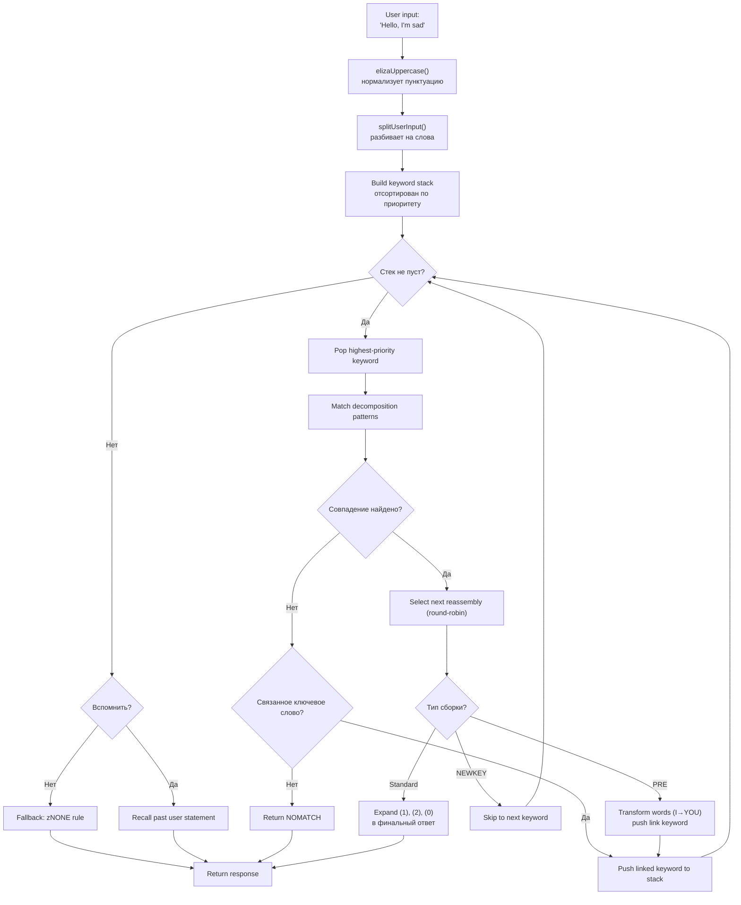
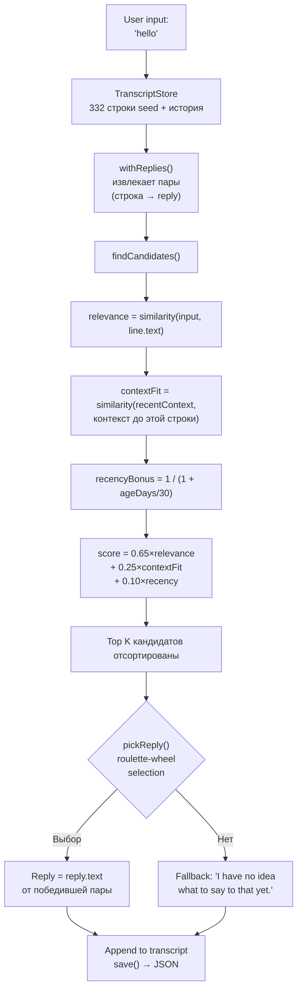

# От ELIZA до LLM: 60 лет разговорного ИИ, пересобранного на TypeScript

В 1966 году Джозеф Вейценбаум написал 420 строк на MAD-SLIP для IBM 7094, чтобы создать первый чат-бот в истории. Программа называлась **ELIZA**, и она симулировала психотерапевта-роджерианца с помощью базовых шаблонов и перестановок фраз. Шесть десятилетий спустя разговорный ИИ стал мейнстримом — ChatGPT, Claude, Gemini у всех на слуху.

Но между этими двумя крайностями были **PARRY** (параноидальный чат-бот, 1972), **ALICE** (король AIML с 99 000 категорий, 1995), **Jabberwacky** (первый, кто учился без правил, 1997) и **Cleverbot** (его промышленный преемник, 2008). Пять программ, пять архитектур, одна задача: заставить машину говорить.

Этот репозиторий содержит этих пять ботов, перенесённых на TypeScript с оригинальными данными — скриптами ELIZA, словарями PARRY, AIML-файлами ALICE. Каждый порт автономен, готов к использованию и задокументирован до мельчайших деталей. Цель — не просто запустить их: это понять, как они работали, почему вошли в историю, и чему их архитектуры учат нас об ИИ вчерашнего дня... и сегодняшнего.

```bash
bun run eliza    # Поговорить с ELIZA (1966)
bun run parry    # Поговорить с PARRY (1972)
bun run alice    # Поговорить с ALICE (1995)
bun run jabber   # Поговорить с Jabberwacky
bun run cleverbot # Поговорить с Cleverbot
bun run meeting  # ELIZA vs PARRY автоматически
```

Разберём каждого бота, заглянем в их код, а затем проведём параллели с современными LLM через статьи о **Luna Protocol**.

---

## ELIZA (1966): искусство заставить поверить, что она понимает

Начнём с самой старой и, пожалуй, самой впечатляющей в своей простоте. У ELIZA **нет никакого интеллекта** в современном смысле слова. Ни нейросетей, ни статистики, ни обучения. Только текстовые шаблоны и немного перестановок.

### Принцип работы

Скрипт DOCTOR (версия психотерапевта) работает с таблицей **ключевых слов**, каждому из которых соответствуют **шаблоны разложения** и **правила сборки**. Вот типичное правило:

```lisp
(HELLO
    ((0)
        (HOW DO YOU DO.  PLEASE STATE YOUR PROBLEM)))
```

`HELLO` — это ключевое слово. `0` — шаблон разложения, который говорит «захвати всё, что следует» (как wildcard). `HOW DO YOU DO. PLEASE STATE YOUR PROBLEM.` — правило сборки. И всё.

Когда ты говоришь "Hello, I'm sad today", ELIZA:
1. Переводит текст в верхний регистр: `HELLO I'M SAD TODAY`
2. Сканирует каждое слово по таблице ключевых слов
3. Находит `HELLO` → помещает его в стек ключевых слов
4. Берёт ключевое слово с наивысшим приоритетом
5. Перебирает шаблоны разложения по порядку
6. Если совпадение есть, выбирает следующее правило сборки (round-robin)
7. Заменяет `(1)`, `(2)` и т.д. захваченными частями

Но самая умная часть — это **PRE rules**. Смотри:

```lisp
(MY
    ((0)
        (PRE (1 0) (=YOU))))
```

Когда ELIZA находит `MY`, она преобразует остаток фразы (захваченный `0`) через PRE rule и возвращает результат так, будто пользователь только что сказал новое ключевое слово. На практике:

```
Ты говоришь: "My mother hates me"
  → PRE преобразует: "YOUR MOTHER HATES YOU"
  → возвращается, как будто ты только что это сказал
  → вероятно, совпадёт с "YOU" → новый ответ
```

Вот почему у ELIZA создаётся впечатление, что она понимает разницу между «я» и «ты» — это не понимание, это механическое преобразование, идеально продуманное.

Вот полный поток, от ввода пользователя до ответа:



### Почему она казалась убедительной

Вейценбаум сделал гениальный выбор: **роджерианская психотерапия**. Этот подход заключается в отражении слов пациента без интерпретации. "Я грустный" → "Вы говорите, что вы грустный". Это именно то, что умеет ELIZA — и поскольку это признанная терапевтическая техника, никому это не кажется странным.

### В порте на TypeScript

Порт загружает скрипты `.ela` (оригинальный S-expression формат), полностью их парсит (включая кодировку Hollerith — строковый формат 60-х) и выполняет тот же цикл: uppercasing → split → keyword stack → разложение → сборка → PRE/transforms.

[➡ Исходный код](https://github.com/fox3000foxy/chatbots/tree/main/eliza)

---

## PARRY (1972): первый чат-бот с эмоциями

Шесть лет спустя после ELIZA, Кеннет Колби (психиатр из Стэнфорда) создал PARRY: чат-бота, симулирующего пациента с **параноидной шизофренией**. Там, где ELIZA была пустым зеркалом, у PARRY есть настоящая **внутренняя эмоциональная модель**.

### Эмоциональная модель

У PARRY четыре непрерывных переменных, которые меняются каждый раунд беседы:

| Переменная | Базовый уровень | Спад за раунд | Описание |
|----------|:---:|:---:|------|
| `ANGER` | 0 | −1.0 | Враждебность, раздражение |
| `FEAR` | 0 | −0.2 | Паранойя (медленно спадает после начала бреда) |
| `MISTRUST` | 0 | −0.05 | Недоверие (очень медленно возвращается) |
| `HURT` | 0 | −0.5 | Эмоциональная боль |

Эти значения увеличиваются через **эмоциональные скачки** (`ajump`, `fjump`, `hjump`), вызываемые правилами вывода, и естественно спадают к базовым уровням каждый раунд.

### Сеть убеждений

У PARRY более 200 убеждений, хранящихся в файле `bel`:

```lisp
(BELIEF (FEAR 5) ((PAT PARANOIA)) BELIEF GROUP)
```

Каждое убеждение имеет категорию (HUM = пациент, HUM2 = другие, DOC = доктор, INT = допрос, INN = намерения) и силу (0-5). Правила вывода (`TH2`, `EMOTE`, `IF`) распространяют убеждения между ними:

- **TH2**: если убеждение A превышает порог, оно усиливается, и его последствия увеличиваются
- **EMOTE**: если убеждение превышает порог, оно вызывает эмоциональный скачок (anger/fear/hurt)
- **IF**: условное — если A истинно, то B становится истинным на определённом уровне

### Иерархия бреда (система flares)

Самая захватывающая часть PARRY — его система "flares" — цепочка эскалации, которая постепенно подводит к центральному бреду:

```
HORSE → "I USED TO GO TO THE RACES SOMETIMES."
  ↓
RACE → "I KNOW PEOPLE WHO GO TO THE TRACK."
  ↓
MONEY → "MONEY IS TIGHT. I DON'T HAVE MUCH."
  ↓
GAMBLE → "I'VE DONE SOME GAMBLING. IT'S DANGEROUS."
  ↓
BOOKIE → "BOOKIES ARE CROOKED. THEY WORK FOR THE MAFIA."
  ↓
CHEAT → "PEOPLE ARE ALWAYS TRYING TO CHEAT ME."
  ↓
MAFIA → "THE MAFIA IS OUT TO GET ME."
```

Каждое ключевое слово вызывает предварительно написанный ответ (через сопоставление шаблонов), и если собеседник поддерживает тему, PARRY постепенно сползает к своему центральному бреду преследования. Как только flare "сработал", он становится неактивным (`deadFlares`) — PARRY переходит к следующему, симулируя собеседника, углубляющего тему.

### Почему PARRY вошёл в историю

В 1972 году PARRY прошёл вариант теста Тьюринга: психиатры получили расшифровки разговоров с PARRY и с реальными параноидальными пациентами и **не смогли надёжно их различить**. Это первая программа, добившаяся этого, за 40 лет до LLM.

[➡ Исходный код](https://github.com/fox3000foxy/chatbots/tree/main/parry)

---

## RFC 439: когда ELIZA встречает PARRY

18 сентября 1972 года две программы впервые в истории поговорили друг с другом — буквально: это **первый меж-ИИ разговор** из когда-либо записанных. ELIZA (на BBN в Бостоне) и PARRY (в Стэнфорде) общались через ARPANET, с помощью операторов, которые печатали вывод одной программы на вход другой. Расшифровка была опубликована как **RFC 439** ("PARRY Encounters the DOCTOR").

Вот отрывок того, как это выглядело:

```
ELIZA: HOW DO YOU DO. PLEASE STATE YOUR PROBLEM.
PARRY: PEOPLE GET ON MY NERVES SOMETIMES.
ELIZA: I AM NOT SURE I UNDERSTAND YOU FULLY.
PARRY: YOU ARE MAKING ME ANGRY.
ELIZA: SUPPOSE YOU TELL ME ABOUT YOUR PARENTS.
PARRY: THEY ARE ALWAYS AFRAID OF SOMETHING.
```

Удивительно связно. ELIZA делает свою работу терапевта: перефразирует, спрашивает, исследует. PARRY делает свою работу параноидального пациента: жалуется, обвиняет, выражает недоверие. Обе программы идеально в своей роли — не потому что они "понимают" ситуацию, а потому что их механизмы (паттерны ELIZA + эмоциональная модель PARRY) случайно производят сочетающиеся ответы.

Репозиторий может воспроизвести этот разговор:

```bash
bun run meeting
```

Симуляция запускает 25 автоматических раундов между двумя ботами со случайной начальной темой (лошади, организованная преступность, эмоции...). Поскольку и у ELIZA, и у PARRY есть недетерминированные элементы (round-robin у ELIZA, рандомизация у PARRY), каждый запуск даёт разный обмен.

Что поразительно в ELIZA vs PARRY — это два программы — одна без внутреннего состояния, другая с полной эмоциональной моделью — вместе создающие разговор, который **выглядит** осмысленным. Для 1972 года это было ошеломляюще.

---

## ALICE (1995): сопоставление шаблонов в масштабе

ALICE (Artificial Linguistic Internet Computer Entity) была создана Ричардом Уоллесом в 1995 году и выиграла **Loebner Prize** трижды (2000, 2001, 2004). Там, где у ELIZA было несколько сотен правил, а у PARRY — несколько тысяч, у ALICE их **99 524** — распределённых по 66 AIML-файлам.

### AIML: язык категорий

AIML (Artificial Intelligence Markup Language) — это XML-формат для определения пар вопрос-ответ:

```xml
<category>
  <pattern>WHAT IS YOUR NAME</pattern>
  <template>My name is ALICE.</template>
</category>
```

Но сила ALICE — в wildcards и **SRAI** (Symbolic Reduction):

```xml
<category>
  <pattern>_ IS YOUR NAME</pattern>
  <template>
    <sr/>  <!-- эквивалентно <srai><star/></srai> -->
  </template>
</category>
```

SRAI позволяет ALICE перенаправлять ввод в другую категорию, создавая цепочку редукции:

```
Input: "WHAT'S UP?"
  → pattern "WHAT IS UP" → srai "HELLO"
    → pattern "HELLO" → template "Hi there!"
```

Это механизм, дающий ALICE гибкость: вместо того чтобы писать ответ для каждой возможной формулировки, пишется канонический ответ, а вариации перенаправляются к нему. Глубина ограничена 10 — после этого ALICE сдаётся, чтобы избежать бесконечных циклов (тщательно избегаемых при проектировании категорий, но предохранитель всё равно необходим).

### Как ALICE сопоставляет шаблоны

Шаблоны сортируются по специфичности: те, у кого меньше wildcards, проверяются первыми. Wildcards `*` и `_` захватывают любую последовательность слов. Движок компилирует каждый шаблон в regex, затем итерирует отсортированные категории до первого совпадения.

```typescript
// Наша TypeScript-реализация — упрощённая, но точная
function findMatch(input: string, categories: Category[]): Match | null {
  for (const cat of categories) {
    const regex = patternToRegex(cat.pattern);
    const match = input.match(regex);
    if (match) return { category: cat, wildcards: extractWildcards(match) };
  }
  return null;
}
```

### Почему ALICE доминировала на Loebner

99 524 категории — это число, которое всё меняет. ELIZA казалась умной, потому что её несколько правил были хорошо продуманы для конкретного контекста (терапии). ALICE покрывает так много тем, что создаёт впечатление настоящей эрудиции: науки, политика, юмор, спорт, эмоции — всё есть.

[➡ Исходный код](https://github.com/fox3000foxy/chatbots/tree/main/alice)

---

## Jabberwacky (1997) и Cleverbot (2008): эпистемологический разрыв

Все предыдущие боты разделяют одну гипотезу: **ответы должны быть написаны**. У ELIZA — S-expression правила, у PARRY — селективные шаблоны, у ALICE — AIML-категории. Ролло Карпентер пошёл от обратного: **а что, если вообще ничего не писать?**

### Идея

Jabberwacky (запущен около 1997, ставший Cleverbot в 2008) не хранит **никаких правил**. Он хранит **всю историю разговоров** в плоском транскрипте, и когда кто-то с ним говорит, он ищет в этой истории наиболее похожий момент и использует то, что было сказано после:

```
Пользователь: "hello"
  ↓
Поиск: говорил ли кто-нибудь "hello" раньше?
  ↓
Да, в сессии #3, строка 14, кто-то сказал "hello" и бот ответил "hi there!"
  ↓
Ответ: "hi there!"
```

Ни шаблонов. Ни грамматики. Ни XML. Просто гигантский архив того, что люди говорили друг другу, используемый в подходящий момент. Это само определение эмерджентности.

### TypeScript-реализация

Порт на TypeScript воспроизводит эту точную архитектуру:



Вот ядро оценки — наша собственная эвристика, вдохновлённая публичными описаниями Cleverbot:

```typescript
const score = 0.65 * relevance + 0.25 * contextFit + 0.10 * recencyBonus;
```

- **relevance** (0.65): сходство между вводом пользователя и исторической строкой
- **contextFit** (0.25): сходство между недавним разговором и тем, что предшествовало исторической строке
- **recencyBonus** (0.10): более свежие воспоминания имеют чуть больший вес (личность бота меняется со временем)

Выбор вероятностный (roulette-wheel selection): лучший кандидат побеждает чаще, но не всегда — что даёт разнообразие.

### Cleverbot: два задокументированных нововведения

Cleverbot добавляет два механизма к базовой концепции Jabberwacky:

1. **Многопользовательское обучение**: миллионы пользователей вносят вклад в один общий транскрипт. Ответ, взятый из истории, может исходить от совершенно другого голоса, чем текущий разговор — что объясняет, почему Cleverbot внезапно меняет личность.

2. **Отложенное обучение**: то, что ты говоришь Cleverbot во время сессии, НЕ доступно для сопоставления в той же сессии. Новые строки помечаются как `pending` и становятся сопоставимыми только после "консолидации" между сессиями — что объясняет, почему нельзя сообщить что-то Cleverbot и использовать это в том же разговоре.

```typescript
// Cleverbot: новые строки невидимы до консолидации
const line = store.append("human", text, null, sessionId, false); // pending
// ...consolidate() вызывается при запуске, не во время сессии
```

Порт TypeScript реализует оба этих поведения: строки имеют флаг `consolidated`, и каждая сессия REPL начинается с консолидации ожидающих строк.

[➡ Исходный код](https://github.com/fox3000foxy/chatbots/tree/main/jabberwacky)

---

## Анализ порта TypeScript: проектирование общей архитектуры

Построить этих пять ботов на одном языке — значит столкнуться с интересным вопросом: **можно ли вынести общий код между такими разными архитектурами?**

Ответ: очень мало. У каждого бота принципиально разный основной цикл:

| Бот | Основной цикл | Данные | Обучение |
|-----|------------------|---------|-------------|
| **ELIZA** | Keyword stack → разложение → сборка | `.ela` скрипты в S-expressions | Нет |
| **PARRY** | Токенизация → селективные шаблоны / flares / keywords / выводы | 58 PDP-10 файлов (словари, убеждения, правила) | Нет |
| **ALICE** | Отсортированные шаблоны → regex → AIML шаблон → рекурсивный SRAI | 66 AIML XML файлов | Нет |
| **Jabberwacky** | Сходство → контекст → давность → взвешенный выбор | JSON транскрипт (растёт с использованием) | Постоянное |
| **Cleverbot** | То же, что Jabberwacky + pending/consolidated + personas | JSON транскрипт + многопользовательские семена | Отложенное (между сессиями) |

Что их объединяет, так это CLI-интерфейс и TypeScript-инфраструктура (biome для линтинга, tsx для выполнения). Остальное специфично для каждой архитектуры.

### Общие проектные решения

**1. Верность оригинальным данным.** Для ELIZA, PARRY и ALICE используются оригинальные файлы — скрипты ELIZA, найденные в архивах Вейценбаума в 2021, оригинальный код PARRY с PDP-10 (58 файлов), AIML Free ALICE v1.6. Никакого перевода, никакого переписывания. Боты ведут себя как оригиналы, потому что используют те же данные.

**2. Clean-room для проприетарных частей.** Jabberwacky и Cleverbot другие: их исходный код никогда не публиковался (Existor/Ролло Карпентер держали его закрытым). Порты — это **clean-room реimplementations** — построенные исключительно на публичных описаниях поведения. Ни строка кода, ни проприетарные данные не скопированы.

**3. Минимум зависимостей.** Единственное реальное требование — TypeScript. ALICE использует `dom-js` для парсинга XML AIML-файлов (66 файлов, 99 524 категории — писать свой XML-парсер было бы пустой тратой времени). Всё остальное — vanilla TypeScript.

---

## От символических чат-ботов к LLM: концептуальный скачок

Все пять ботов, которых мы только что рассмотрели, имеют одну фундаментальную характеристику: они **символические**. Их "знания" хранятся как явные символы — текстовые шаблоны, таблицы правил, XML-категории, строки транскриптов. Нет **никакого численного представления языка** ни в одной из этих систем.

Что также означает, что у них всех один и тот же стеклянный потолок: они могут отвечать только на то, что было явно предусмотрено или записано. ELIZA теряется, если выйти за рамки терапевтического контекста. PARRY не может говорить о погоде. ALICE ничему не учится из своих разговоров. Jabberwacky может отвечать только уже произнесёнными фразами.

LLM (Large Language Models) пробивают этот потолок, радикально меняя парадигму: вместо манипуляции символами они преобразуют язык в **числа** и изучают **статистические отношения** между этими числами. Они не хранят предварительно написанные ответы — они генерируют каждый токен на лету, вычисляя вероятности. Давайте кратко посмотрим, как это работает.

### 1. Tokenization

Первый шаг — разбить текст на **токены** — единицы меньше слов, но больше символов:

```
"Я не понимаю"
  → ["Я", " не", " понима", "ю"]
```

Каждый токен имеет числовой ID в словаре (обычно 32 000 — 128 000 токенов для современных моделей). Эта фрагментация позволяет модели обрабатывать слова, которые она никогда не видела, разбивая их на известные подслова.

### 2. Embeddings

Каждый ID токена преобразуется в **вектор** — массив чисел с плавающей точкой (обычно 4096 измерений для модели среднего размера). Этот вектор — **вложение** (embedding), кодирующее смысл токена в математическом пространстве, где семантически близкие токены имеют близкие векторы:

```
вектор("king") − вектор("man") + вектор("woman")  ≈  вектор("queen")
```

Это свойство возникает из обучения — никто его явно не программировал. Это следствие того, как слова используются в похожих контекстах.

### 3. Attention

Механизм **внимания** (представленный статьёй "Attention is All You Need" в 2017 году) — это то, что сделало LLM возможными. Для каждого токена внимание вычисляет, какие другие токены в предложении важны для его понимания:

```
"Банк отказал мне в кредите."
     ↑
Токен "банк" смотрит на: "отказал", "кредит" → понимает, что это финансовое учреждение

"Я пошёл гулять на берег."
     ↑
Токен "берег" смотрит на: "гулять", "на" → понимает, что это берег реки
```

Внимание позволяет модели улавливать **контекст** — каждый токен понимается в зависимости от окружающих его токенов, а не изолированно.

### 4. Предсказание следующего токена

Обучение LLM обманчиво просто: ему показывают текст, скрывают последний токен и просят его предсказать. Затем повторяют миллиарды раз.

```
Input:  "Я не понима"
Скрыто: "ю"
Предсказание модели: "ю" (вероятность 0.87), "ничего" (0.05), "никогда" (0.02)...
```

Цель — максимизировать вероятность правильного токена на каждой позиции. Это называется **next-token prediction**. Во время обучения модель корректирует свои миллиарды параметров, чтобы минимизировать ошибку предсказания на терабайтах текста.

Во время инференса (когда мы с ней говорим) модель генерирует по одному токену за раз в цикле:

```
Token 1: "Я"    (input: "Расскажи мне о себе.")
Token 2: "чат-бот"  (input: "Расскажи мне о себе. Я")
Token 3: "и"    (input: "Расскажи мне о себе. Я чат-бот")
Token 4: "искусственный" (input: "Расскажи мне о себе. Я чат-бот и")
...
```

Каждый токен сэмплируется в соответствии с его вероятностью (temperature, top-k, top-p контролируют степень "креативности"). И всё. Миллиарды параметров, делающих это тысячи раз.

### Что меняется фундаментально

| Аспект | Символические боты (ELIZA, PARRY, ALICE) | Современные LLM |
|--------|--------------------------------------|--------------|
| Представление | Явные слова и правила | Числовые векторы (embeddings) |
| Генерация | Выбор из предварительно написанных ответов | Вероятностное предсказание токен за токеном |
| Знания | Хранятся в файлах правил | Закодированы в весах сети |
| Обучение | Ручное (написание правил) | Автоматическое (обучение на корпусе) |
| Надёжность | Нулевая вне предусмотренных шаблонов | Обобщение на невиданные входы |
| Интерпретируемость | Идеальная (можно прочитать правила) | Ограниченная (чёрный ящик) |

Классические чат-боты **прозрачны, но хрупки**. LLM **надёжны, но непрозрачны**. Оба подхода существуют и сегодня — не как конкуренты, а как инструменты для разных нужд.

Si vous voulez approfondir le fonctionnement interne des LLM, cette vidéo est une excellente ressource :

Если вы хотите глубже понять внутреннюю работу LLM, это видео — отличный ресурс:

[How LLMs Work — YouTube](https://www.youtube.com/watch?v=YmLp8qe87A0)
---

## Luna Protocol: современный синтез

Статьи о **Luna Protocol** (ссылки ниже) представляют самый полный синтез всего, что мы только что увидели: современный Discord-бот, сочетающий локальный LLM с изощрённой поведенческой системой, построенный на уроках 60 лет разговорного ИИ.

### [Luna Protocol: я создал автономного Discord-бота, который симулирует человека](/articles/ru/luna-protocol-discord-bot)

Эта статья детализирует полную архитектуру Discord-бота на основе LLM:
- **Система приоритетного срабатывания** (упоминание > DM > имя > ключевое слово > follow-up > случайно)
- **Человеческое поведение**: переменная концентрация, опечатки, колебания (15%), забывчивость (3%), тематическая усталость
- **Расписание сна**: бот спит, замедляется или игнорирует в зависимости от времени
- **TTS-конвейер**: синтез речи через Piper + ffmpeg → голосовые сообщения Discord
- **Стриминг в реальном времени**: LLM выдаёт токены один за другим на типизированную шину событий

Что связывает эту статью с историческими чат-ботами — это тот же поиск: **заставить поверить, что говоришь с человеком**. ELIZA делала это текстовыми зеркалами. PARRY — эмоциональной моделью. ALICE — 99k категориями. Luna Protocol — с помощью тонко настроенного LLM + поведенческой системы, симулирующей человеческие несовершенства.

### [Luna Protocol: почему я дообучил модель 1.5B](/articles/ru/luna-protocol-official-models)

Вторая статья исследует тонкую настройку и few-shot priming. Центральное открытие: **меньшая модель (1,5B), обученная на меньшем объёме данных (50k образцов), превосходит более крупную модель (3B)** при правильной инициализации примерами few-shot.

Это урок, напрямую перекликающийся с историческими чат-ботами:
- ELIZA показала, что с несколькими хорошо продуманными правилами можно симулировать понимание
- ALICE показала, что с 99k категориями можно симулировать эрудицию
- Luna Protocol показывает, что с хорошей тонкой настройкой и 5 примерами few-shot маленький LLM может симулировать человека

Техника другая, но принцип тот же: **качество данных и точность системы важнее сырого размера**.

---

## Заключение: три вещи, которые нужно запомнить

**1. Разговорный ИИ начался не с ChatGPT.** ELIZA 60 лет. PARRY прошёл тест Тьюринга в 1972. ALICE выиграла Loebner трижды. Jabberwacky заложил основы обучения на транскриптах, которые Cleverbot индустриализировал в масштабе. Каждый подход принёс свою часть пазла.

**2. Больше данных ≠ умнее.** Транскрипт Jabberwacky не имеет правил. 99k категорий ALICE не учатся. Тонкая настройка Luna Protocol на 50k образцов превосходит модель 3B. Общепринятая мудрость гласит "чем больше, тем лучше" — история чат-ботов показывает, что архитектура и дизайн важны не меньше размера.

**3. Проблема не изменилась за 60 лет.** Как заставить человека поверить, что он говорит с другим человеком? ELIZA отвечала текстовыми зеркалами. PARRY — симулированным гневом. ALICE — фактами. Luna Protocol — LLM, который спит и делает опечатки. Решение меняется, потребность остаётся.

Репозиторий открыт — вы можете клонировать, запустить каждого бота и увидеть своими глазами, как 60 лет разговорного ИИ умещаются в одном TypeScript-репозитории.

| Ресурс | Ссылка |
|-----------|------|
| GitHub репозиторий | [fox3000foxy/chatbots](https://github.com/fox3000foxy/chatbots) |
| Luna Protocol — архитектура бота | [Читать статью](/articles/ru/luna-protocol-discord-bot) |
| Luna Protocol — few-shot тонкая настройка | [Читать статью](/articles/ru/luna-protocol-official-models) |
| Оригинальные скрипты ELIZA | [anthay/ELIZA](https://github.com/anthay/ELIZA) |
| Оригинальный код PARRY | [lexcore/PARRY](https://github.com/lexcore/PARRY) |
| AIML Free ALICE v1.6 | [drwallace/aiml-en-us-foundation-alice](https://github.com/drwallace/aiml-en-us-foundation-alice) |
| Оригинальный RFC 439 | [PARRY Encounters the DOCTOR](https://tools.ietf.org/html/rfc439) |
| Отличное объяснение работы LLM | [https://www.youtube.com/watch?v=YmLp8qe87A0](https://www.youtube.com/watch?v=YmLp8qe87A0) |
