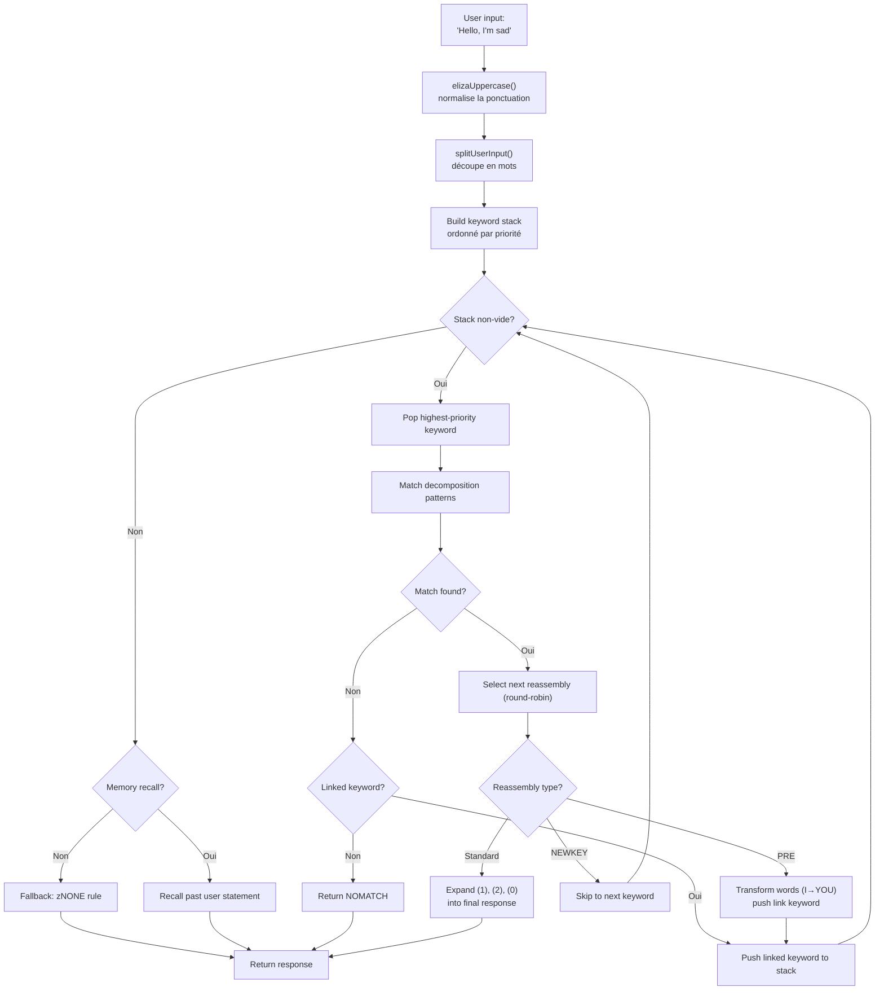
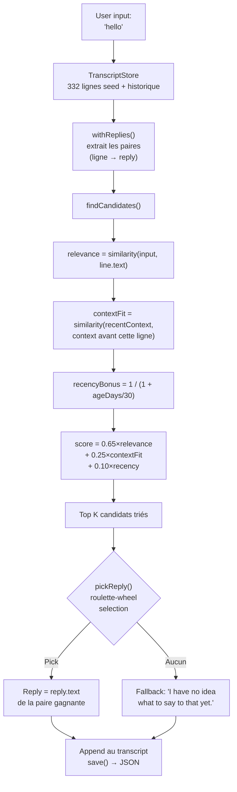

# จาก ELIZA สู่ LLM : 60 ปีของ AI เชิงสนทนา สร้างใหม่ใน TypeScript

ปี 1966 Joseph Weizenbaum เขียนโค้ด MAD-SLIP 420 บรรทัดบน IBM 7094 เพื่อสร้างแชทบอทตัวแรกในประวัติศาสตร์ โปรแกรมชื่อ **ELIZA** มันจำลองนักจิตบำบัดแนวโรเจอเรียนด้วยแพทเทิร์นพื้นฐานและการสลับประโยค หกทศวรรษต่อมา AI เชิงสนทนากลายเป็นหัวข้อหลัก -- ChatGPT, Claude, Gemini อยู่ในการสนทนาทุกครั้ง

แต่ระหว่างสองขั้วนี้ มี **PARRY** (แชทบอทโรคหวาดระแวง, 1972), **ALICE** (ราชาแห่ง AIML 99,000 หมวดหมู่, 1995), **Jabberwacky** (ตัวแรกที่เรียนรู้โดยไม่มีกฎ, 1997), และ **Cleverbot** (ผู้สืบทอดเชิงอุตสาหกรรม, 2008) ห้าโปรแกรม ห้าสถาปัตยกรรม หนึ่งปัญหาเดียว : ทำให้เครื่องจักรพูดได้

Repo นี้ประกอบด้วยบอททั้งห้าตัว พอร์ตมาเป็น TypeScript พร้อมข้อมูลต้นฉบับ -- สคริปต์ ELIZA, พจนานุกรม PARRY, ไฟล์ AIML ของ ALICE แต่ละพอร์ตทำงานอิสระ พร้อมใช้งาน และมีเอกสารครบถ้วน เป้าหมายไม่ใช่แค่ทำให้มันทำงานได้ : คือการเข้าใจว่ามันทำงานอย่างไร ทำไมมันถึงสร้างประวัติศาสตร์ และสถาปัตยกรรมของมันสอนอะไรเราเกี่ยวกับ AI เมื่อวาน... และวันนี้

```bash
bun run eliza    # คุยกับ ELIZA (1966)
bun run parry    # คุยกับ PARRY (1972)
bun run alice    # คุยกับ ALICE (1995)
bun run jabber   # คุยกับ Jabberwacky
bun run cleverbot # คุยกับ Cleverbot
bun run meeting  # ELIZA vs PARRY อัตโนมัติ
```

เราจะเจาะลึกแต่ละบอท ดูโค้ดของมัน แล้วเชื่อมโยงกับ LLM สมัยใหม่ผ่านบทความเกี่ยวกับ **Luna Protocol**

---

## ELIZA (1966) : ศิลปะแห่งการทำให้เชื่อว่าคุณเข้าใจ

เริ่มจากตัวที่เก่าที่สุด และอาจจะน่าประทับใจที่สุดในความเรียบง่าย ELIZA **ไม่มีปัญญา** ในความหมายสมัยใหม่ ไม่มีโครงข่ายประสาทเทียม ไม่มีสถิติ ไม่มีการเรียนรู้ แค่แพทเทิร์นข้อความและการสลับเล็กน้อย

### หลักการ

สคริปต์ DOCTOR (เวอร์ชันนักจิตบำบัด) ทำงานด้วยตาราง **คีย์เวิร์ด** แต่ละตัวเชื่อมโยงกับ **แพทเทิร์นการแยกส่วน** และ **กฎการประกอบใหม่** นี่คือกฎทั่วไป :

```lisp
(HELLO
    ((0)
        (HOW DO YOU DO.  PLEASE STATE YOUR PROBLEM)))
```

`HELLO` คือคีย์เวิร์ด `0` คือแพทเทิร์นการแยกส่วนที่บอกว่า "จับทุกอย่างที่ตามมา" (เหมือน wildcard) `HOW DO YOU DO. PLEASE STATE YOUR PROBLEM.` คือกฎการประกอบใหม่ เท่านั้นเอง

เมื่อคุณพูด "Hello, I'm sad today" ELIZA :
1. แปลงข้อความเป็นตัวพิมพ์ใหญ่ : `HELLO I'M SAD TODAY`
2. สแกนแต่ละคำเทียบกับตารางคีย์เวิร์ด
3. เจอ `HELLO` → ดันลงกองซ้อนคีย์เวิร์ด
4. เอาคีย์เวิร์ดที่มีลำดับความสำคัญสูงสุด
5. ลองแต่ละแพทเทิร์นการแยกส่วนตามลำดับ
6. ถ้าตรงกัน เลือกกฎการประกอบใหม่ถัดไป (round-robin)
7. แทนที่ `(1)`, `(2)` ฯลฯ ด้วยส่วนที่ถูกจับ

แต่ส่วนที่ฉลาดจริงๆ คือ **กฎ PRE** ดูนี่ :

```lisp
(MY
    ((0)
        (PRE (1 0) (=YOU))))
```

เมื่อ ELIZA ตรงกับ `MY` มันแปลงส่วนที่เหลือของประโยค (ที่ถูกจับโดย `0`) ผ่านกฎ PRE แล้วส่งผลลัพธ์กลับเข้าไปใหม่ราวกับว่าผู้ใช้เพิ่งพูดคีย์เวิร์ดใหม่ อย่างเป็นรูปธรรม :

```
คุณพูด : "My mother hates me"
  → PRE แปลง : "YOUR MOTHER HATES YOU"
  → ส่งกลับราวกับคุณเพิ่งพูดมัน
  → อาจตรงกับ "YOU" → คำตอบใหม่
```

นี่คือสาเหตุที่ ELIZA ดูเหมือนเข้าใจความแตกต่างระหว่าง "ฉัน" และ "คุณ" -- มันไม่ใช่ความเข้าใจ มันคือการแปลงเชิงกลที่ออกแบบมาอย่างสมบูรณ์แบบ

นี่คือโฟลว์ทั้งหมด จากการพิมพ์ของผู้ใช้ถึงคำตอบ :



### สิ่งที่ทำให้มันน่าเชื่อถือ

Weizenbaum เลือกอย่างชาญฉลาด : **จิตบำบัดแนวโรเจอเรียน** วิธีนี้คือการสะท้อนคำพูดของผู้ป่วยโดยไม่ตีความ "ผมเศร้า" → "คุณบอกว่าคุณเศร้า" นี่คือสิ่งที่ ELIZA ทำได้ -- และเนื่องจากเป็นเทคนิคการบำบัดที่ได้รับการยอมรับ ไม่มีใครคิดว่ามันแปลก

### ในพอร์ต TypeScript

พอร์ตโหลดสคริปต์ `.ela` (รูปแบบ S-expression ดั้งเดิม), แยกส่วนทั้งหมด (รวมถึงการเข้ารหัส Hollerith -- รูปแบบสตริงจากยุค 60s), และดำเนินวงจรเดียวกัน : พิมพ์ใหญ่ → แยก → กองซ้อนคีย์เวิร์ด → การแยกส่วน → การประกอบใหม่ → PRE/transforms

[➡ ดูซอร์สโค้ด](https://github.com/fox3000foxy/chatbots/tree/main/eliza)

---

## PARRY (1972) : แชทบอทตัวแรกที่มีอารมณ์

หกปีหลังจาก ELIZA, Kenneth Colby (จิตแพทย์ที่ Stanford) สร้าง PARRY : แชทบอทที่จำลองผู้ป่วยโรค **จิตเภทแบบหวาดระแวง** ในขณะที่ ELIZA เป็นกระจกเปล่า PARRY มี **แบบจำลองอารมณ์ภายใน** ที่แท้จริง

### แบบจำลองอารมณ์

PARRY มีตัวแปรต่อเนื่องสี่ตัวที่เปลี่ยนแปลงในแต่ละรอบสนทนา :

| ตัวแปร | เส้นฐาน | การลดลง/รอบ | คำอธิบาย |
|----------|:---:|:---:|------|
| `ANGER` | 0 | −1.0 | ความเป็นศัตรู, ความหงุดหงิด |
| `FEAR` | 0 | −0.2 | ความหวาดระแวง (ลดลงช้าหลังจากเริ่มมีอาการหลอน) |
| `MISTRUST` | 0 | −0.05 | ความไม่ไว้วางใจ (ลดลงช้ามาก) |
| `HURT` | 0 | −0.5 | ความเจ็บปวดทางอารมณ์ |

ค่าเหล่านี้เพิ่มขึ้นผ่าน **การกระโดดทางอารมณ์** (`ajump`, `fjump`, `hjump`) ที่ถูกกระตุ้นโดยกฎการอนุมาน และลดลงตามธรรมชาติกลับสู่เส้นฐานในแต่ละรอบ

### เครือข่ายความเชื่อ

PARRY มีความเชื่อ 200+ รายการเก็บในไฟล์ `bel` :

```lisp
(BELIEF (FEAR 5) ((PAT PARANOIA)) BELIEF GROUP)
```

แต่ละความเชื่อมีหมวดหมู่ (HUM = ผู้ป่วย, HUM2 = ผู้อื่น, DOC = หมอ, INT = การสอบสวน, INN = เจตนา) และความแข็งแกร่ง (0-5) กฎการอนุมาน (`TH2`, `EMOTE`, `IF`) เชื่อมโยงความเชื่อถึงกัน :

- **TH2** : ถ้าความเชื่อ A เกินเกณฑ์ มันจะแข็งแกร่งขึ้นและผลลัพธ์ของมันเพิ่มขึ้น
- **EMOTE** : ถ้าความเชื่อเกินเกณฑ์ มันจะกระตุ้นการกระโดดทางอารมณ์ (anger/fear/hurt)
- **IF** : เงื่อนไข -- ถ้า A เป็นจริง แล้ว B จะเป็นจริงในระดับหนึ่ง

### ลำดับชั้นของอาการหลอน (ระบบ Flare)

ส่วนที่น่าทึ่งที่สุดของ PARRY คือระบบ "flares" -- ห่วงโซ่การเพิ่มระดับที่ค่อยๆ นำไปสู่อาการหลอนหลัก :

```
HORSE → "I USED TO GO TO THE RACES SOMETIMES."
  ↓
RACE → "I KNOW PEOPLE WHO GO TO THE TRACK."
  ↓
MONEY → "MONEY IS TIGHT. I DON'T HAVE MUCH."
  ↓
GAMBLE → "I'VE DONE SOME GAMBLING. IT'S DANGEROUS."
  ↓
BOOKIE → "BOOKIES ARE CROOKED. THEY WORK FOR THE MAFIA."
  ↓
CHEAT → "PEOPLE ARE ALWAYS TRYING TO CHEAT ME."
  ↓
MAFIA → "THE MAFIA IS OUT TO GET ME."
```

แต่ละคีย์เวิร์ดกระตุ้นคำตอบที่เขียนไว้ล่วงหน้า (ผ่านการจับคู่แพทเทิร์น) และถ้าคู่สนทนาตามหัวข้อ PARRY จะค่อยๆ เลื่อนไปสู่อาการหลอนกลางเรื่องการถูกข่มเหง เมื่อ flare ถูก "กระตุ้น" มันจะกลายเป็นไม่ทำงาน (`deadFlares`) -- PARRY ไปยังอันถัดไป จำลองคู่สนทนาที่กำลังเจาะลึกหัวข้อ

### ทำไม PARRY ถึงเป็นประวัติศาสตร์

ปี 1972 PARRY ผ่านการทดสอบทัวริงรูปแบบหนึ่ง : จิตแพทย์ได้รับบทถอดความสนทนากับ PARRY และกับผู้ป่วยหวาดระแวงจริง และ **ไม่สามารถแยกแยะได้อย่างน่าเชื่อถือ** มันเป็นโปรแกรมแรกที่ทำได้ 40 ปีก่อน LLM

[➡ ดูซอร์สโค้ด](https://github.com/fox3000foxy/chatbots/tree/main/parry)

---

## RFC 439 : เมื่อ ELIZA พบ PARRY

วันที่ 18 กันยายน 1972 โปรแกรมสองตัวพูดคุยกันเป็นครั้งแรกในประวัติศาสตร์ -- ตามตัวอักษร : นี่คือ **การสนทนาระหว่าง AI ครั้งแรก** ที่เคยบันทึกไว้ ELIZA (รันบน BBN ที่บอสตัน) และ PARRY (รันที่สแตนฟอร์ด) สนทนากันผ่าน ARPANET โดยมีผู้ปฏิบัติการมนุษย์คอยพิมพ์เอาต์พุตของตัวหนึ่งเป็นอินพุตของอีกตัว บทสนทนาถูกตีพิมพ์เป็น **RFC 439** ("PARRY Encounters the DOCTOR")

นี่คือตัวอย่างว่ามันเป็นอย่างไร :

```
ELIZA: HOW DO YOU DO. PLEASE STATE YOUR PROBLEM.
PARRY: PEOPLE GET ON MY NERVES SOMETIMES.
ELIZA: I AM NOT SURE I UNDERSTAND YOU FULLY.
PARRY: YOU ARE MAKING ME ANGRY.
ELIZA: SUPPOSE YOU TELL ME ABOUT YOUR PARENTS.
PARRY: THEY ARE ALWAYS AFRAID OF SOMETHING.
```

มันสอดคล้องกันอย่างน่าประหลาดใจ ELIZA ทำงานนักบำบัดของมัน : ถอดความ, ถาม, สำรวจ PARRY ทำงานผู้ป่วยหวาดระแวงของมัน : บ่น, กล่าวหา, แสดงความไม่ไว้วางใจ โปรแกรมทั้งสองอยู่ในบทบาทของตนอย่างสมบูรณ์ -- ไม่ใช่เพราะพวกมัน "เข้าใจ" สถานการณ์ แต่เพราะกลไกของมัน (แพทเทิร์น ELIZA + แบบจำลองอารมณ์ PARRY) สร้างคำตอบที่บังเอิญเข้ากัน

Repo สามารถจำลองการสนทนานี้ได้ด้วย :

```bash
bun run meeting
```

การจำลองจะรัน 25 รอบอัตโนมัติระหว่างบอททั้งสอง ด้วยหัวข้อเริ่มต้นสุ่ม (ม้า, อาชญากรรมองค์กร, อารมณ์...) เนื่องจากทั้ง ELIZA และ PARRY มีองค์ประกอบที่ไม่ตายตัว (ELIZA round-robin, PARRY การสุ่ม) แต่ละครั้งที่รันจะให้ผลลัพธ์ต่างกัน

สิ่งที่โดดเด่นเกี่ยวกับ ELIZA vs PARRY คือเรามีสองโปรแกรม -- หนึ่งไม่มีสถานะภายใน, อีกหนึ่งมีแบบจำลองอารมณ์สมบูรณ์ -- ที่ร่วมกันสร้างบทสนทนาที่ **ดูเหมือน** ตั้งใจ สำหรับปี 1972 มันน่าทึ่งมาก

---

## ALICE (1995) : การจับคู่แพทเทิร์นขนาดใหญ่

ALICE (Artificial Linguistic Internet Computer Entity) ถูกสร้างโดย Richard Wallace ในปี 1995 และชนะ **รางวัล Loebner** สามครั้ง (2000, 2001, 2004) ในขณะที่ ELIZA มีกฎไม่กี่ร้อยข้อและ PARRY ไม่กี่พัน ALICE มี **99,524** กฎ -- กระจายอยู่ใน 66 ไฟล์ AIML

### AIML : ภาษาของหมวดหมู่

AIML (Artificial Intelligence Markup Language) คือรูปแบบ XML สำหรับกำหนดคู่คำถาม-คำตอบ :

```xml
<category>
  <pattern>WHAT IS YOUR NAME</pattern>
  <template>My name is ALICE.</template>
</category>
```

แต่พลังของ ALICE มาจาก wildcards และ **SRAI** (Symbolic Reduction) :

```xml
<category>
  <pattern>_ IS YOUR NAME</pattern>
  <template>
    <sr/>  <!-- เท่ากับ <srai><star/></srai> -->
  </template>
</category>
```

SRAI ทำให้ ALICE สามารถเปลี่ยนเส้นทางอินพุตไปยังหมวดหมู่อื่น สร้างห่วงโซ่การลดรูป :

```
Input: "WHAT'S UP?"
  → pattern "WHAT IS UP" → srai "HELLO"
    → pattern "HELLO" → template "Hi there!"
```

นี่คือกลไกที่ทำให้ ALICE มีความยืดหยุ่น : แทนที่จะเขียนคำตอบสำหรับทุกรูปแบบ เขียนคำตอบหลักแล้วเปลี่ยนเส้นทางรูปแบบต่างๆ ไปหามัน ข้อจำกัดความลึกคือ 10 -- เกินกว่านั้น ALICE จะยอมแพ้เพื่อหลีกเลี่ยงลูปอนันต์ (หลีกเลี่ยงอย่างระมัดระวังในการออกแบบหมวดหมู่ แต่ตาข่ายนิรภัยยังจำเป็น)

### ALICE จับคู่แพทเทิร์นอย่างไร

แพทเทิร์นถูกเรียงตามความจำเพาะ : พวกที่มี wildcard น้อยที่สุดจะถูกลองก่อน Wildcard `*` และ `_` จับลำดับคำใดก็ได้ เอ็นจินคอมไพล์แต่ละแพทเทิร์นเป็น regex แล้ววนซ้ำหมวดหมู่ที่เรียงแล้วจนกว่าจะเจอที่ตรงกัน

```typescript
// การใช้งาน TypeScript ของเรา -- เรียบง่ายแต่เที่ยงตรง
function findMatch(input: string, categories: Category[]): Match | null {
  for (const cat of categories) {
    const regex = patternToRegex(cat.pattern);
    const match = input.match(regex);
    if (match) return { category: cat, wildcards: extractWildcards(match) };
  }
  return null;
}
```

### ทำไม ALICE ถึงครอง Loebner

99,524 หมวดหมู่ คือตัวเลขที่เปลี่ยนแปลงทุกอย่าง ELIZA ดูฉลาดเพราะกฎไม่กี่ข้อของมันถูกออกแบบมาอย่างดีสำหรับบริบทเฉพาะ (การบำบัด) ALICE ครอบคลุมหลายหัวข้อจนให้ความรู้สึกว่ามีความรู้ทั่วไปจริง : วิทยาศาสตร์, การเมือง, อารมณ์ขัน, กีฬา, อารมณ์, ทุกอย่าง

[➡ ดูซอร์สโค้ด](https://github.com/fox3000foxy/chatbots/tree/main/alice)

---

## Jabberwacky (1997) และ Cleverbot (2008) : การแตกหักทางญาณวิทยา

บอทก่อนหน้านี้ทั้งหมดมีสมมติฐานร่วมกัน : **ต้องเขียนคำตอบ** ELIZA มีกฎ S-expression, PARRY มีแพทเทิร์นแบบเลือกเฉพาะ, ALICE มีหมวดหมู่ AIML Rollo Carpenter กลับด้านโดยสิ้นเชิง : **แล้วถ้าเราไม่เขียนอะไรเลยล่ะ?**

### แนวคิด

Jabberwacky (เปิดตัวประมาณ 1997, กลายเป็น Cleverbot ใน 2008) ไม่ได้เก็บ **กฎใดๆ** มันเก็บ **ประวัติการสนทนาทั้งหมด** ใน transcript แบบ flat และเมื่อมีคนคุยกับมัน มันจะค้นหาในประวัติศาสตร์นี้หาช่วงเวลาที่คล้ายที่สุดและใช้สิ่งที่ถูกพูดหลังจากนั้น :

```
ผู้ใช้ : "hello"
  ↓
ค้นหา : มีใครเคยพูด "hello" มาก่อนไหม?
  ↓
ใช่ ในเซสชัน #3, บรรทัดที่ 14, มีคนพูด "hello" และบอทตอบ "hi there!"
  ↓
ตอบ : "hi there!"
```

ไม่มีแพทเทิร์น ไม่มีไวยากรณ์ ไม่มี XML แค่คลังข้อมูลขนาดใหญ่ของสิ่งที่คนพูดกัน ถูกนำมาใช้ใหม่ในเวลาที่เหมาะสม นี่คือนิยามของการเกิด emergent

### การใช้งาน TypeScript

พอร์ต TypeScript สร้างสถาปัตยกรรมนี้ขึ้นมาใหม่ :



นี่คือแกนหลักของการให้คะแนน -- ฮิวริสติกของเราเองที่ได้แรงบันดาลใจจากคำอธิบายสาธารณะของ Cleverbot :

```typescript
const score = 0.65 * relevance + 0.25 * contextFit + 0.10 * recencyBonus;
```

- **relevance** (0.65) : ความคล้ายคลึงระหว่างอินพุตผู้ใช้กับบรรทัดประวัติ
- **contextFit** (0.25) : ความคล้ายคลึงระหว่างการสนทนาล่าสุดกับบริบทย้อนหลังจากบรรทัดประวัติ
- **recencyBonus** (0.10) : ความทรงจำล่าสุดมีน้ำหนักมากกว่าเล็กน้อย (บุคลิกบอทเปลี่ยนแปลงตามเวลา)

การเลือกเป็นแบบความน่าจะเป็น (roulette-wheel selection) : ผู้สมัครที่ดีที่สุดชนะบ่อยกว่า แต่ไม่เสมอไป -- ซึ่งให้ความหลากหลาย

### Cleverbot : สองนวัตกรรมที่มีเอกสาร

Cleverbot เพิ่มกลไกสองอย่างให้แนวคิดพื้นฐานของ Jabberwacky :

1. **การเรียนรู้หลายคน** : ผู้ใช้หลายล้านคนมีส่วนร่วมใน transcript ร่วมกัน คำตอบที่ดึงมาจากประวัติอาจมาจากเสียงที่แตกต่างอย่างสิ้นเชิงจากการสนทนาปัจจุบัน -- ซึ่งอธิบายว่าทำไม Cleverbot เปลี่ยนบุคลิกกะทันหัน

2. **การเรียนรู้แบบหน่วงเวลา** : สิ่งที่คุณพูดกับ Cleverbot ระหว่างเซสชันจะ **ไม่** พร้อมใช้งานสำหรับการจับคู่ระหว่างเซสชันนั้น บรรทัดใหม่ถูกทำเครื่องหมาย `pending` และจะจับคู่ได้หลังจากการ "รวม consolidated" ระหว่างเซสชันเท่านั้น -- ซึ่งอธิบายว่าทำไมคุณไม่สามารถสอนข้อเท็จจริงให้ Cleverbot และใช้มันซ้ำในการสนทนาเดียวกันได้

```typescript
// Cleverbot : บรรทัดล่าสุดมองไม่เห็นจนกว่าจะรวม consolidated
const line = store.append("human", text, null, sessionId, false); // pending
// ...consolidate() ถูกเรียกเมื่อเริ่มต้น ไม่ใช่ระหว่างเซสชัน
```

พอร์ต TypeScript ใช้ทั้งสองพฤติกรรมนี้ : บรรทัดมีแฟล็ก `consolidated` และแต่ละเซสชัน REPL เริ่มด้วยการรวมบรรทัดที่รออยู่

[➡ ดูซอร์สโค้ด](https://github.com/fox3000foxy/chatbots/tree/main/jabberwacky)

---

## วิเคราะห์พอร์ต TypeScript : การออกแบบสถาปัตยกรรมร่วม

การสร้างบอททั้งห้าตัวด้วยภาษาเดียวกัน คือการเผชิญหน้ากับคำถามที่น่าสนใจ : **เราสามารถแยกส่วนโค้ดระหว่างสถาปัตยกรรมที่แตกต่างกันเช่นนี้ได้ไหม?**

คำตอบคือ : น้อยมาก แต่ละบอทมีลูปพื้นฐานที่แตกต่างกัน :

| บอท | ลูปหลัก | ข้อมูล | การเรียนรู้ |
|-----|------------------|---------|-------------|
| **ELIZA** | กองซ้อนคีย์เวิร์ด → การแยกส่วน → การประกอบใหม่ | สคริปต์ `.ela` ในรูปแบบ S-expression | ไม่มี |
| **PARRY** | การทำ token → แพทเทิร์นเลือก / flare / คีย์เวิร์ด / การอนุมาน | 58 ไฟล์ PDP-10 (พจนานุกรม, ความเชื่อ, กฎ) | ไม่มี |
| **ALICE** | แพทเทิร์นเรียง → regex → เทมเพลต AIML → SRAI แบบเรียกซ้ำ | 66 ไฟล์ AIML XML | ไม่มี |
| **Jabberwacky** | ความคล้ายคลึง → บริบท → ความเร็วล่าสุด → เลือกแบบถ่วงน้ำหนัก | JSON transcript (โตตามการใช้งาน) | ต่อเนื่อง |
| **Cleverbot** | เหมือน Jabberwacky + รอ/รวม consolidated + personas | JSON transcript + เมล็ดหลาย persona | หน่วงเวลา (ระหว่างเซสชัน) |

สิ่งที่พวกเขาใช้ร่วมกันคืออินเทอร์เฟซ CLI และโครงสร้างพื้นฐาน TypeScript (biome สำหรับ lint, tsx สำหรับการทำงาน) ที่เหลือเฉพาะแต่ละสถาปัตยกรรม

### ตัวเลือกการออกแบบร่วม

**1. ความเที่ยงตรงต่อข้อมูลต้นฉบับ** สำหรับ ELIZA, PARRY และ ALICE เราใช้ไฟล์ต้นฉบับ -- สคริปต์ ELIZA ที่พบในคลังเอกสาร Weizenbaum ปี 2021, โค้ด PARRY ดั้งเดิมจาก PDP-10 (58 ไฟล์), AIML Free ALICE v1.6 ไม่มีการแปล ไม่มีการเขียนใหม่ บอททำงานเหมือนต้นฉบับเพราะใช้ข้อมูลเดียวกัน

**2. Clean-room สำหรับส่วนที่เป็นกรรมสิทธิ์** Jabberwacky และ Cleverbot ต่างกัน : โค้ดต้นฉบับไม่เคยถูกเผยแพร่ (Existor/Rollo Carpenter เก็บไว้เป็นกรรมสิทธิ์) พอร์ตจึงเป็น **clean-room reimplementation** -- สร้างจากคำอธิบายสาธารณะของพฤติกรรมเท่านั้น ไม่มีการคัดลอกโค้ดหรือข้อมูลที่เป็นกรรมสิทธิ์

**3. การพึ่งพาน้อยที่สุด** ข้อกำหนดจริงเพียงอย่างเดียวคือ TypeScript ALICE ใช้ `dom-js` เพื่อแยก XML ของไฟล์ AIML (66 ไฟล์, 99,524 หมวดหมู่, การแยก XML ด้วยตัวเองคงเสียเวลา) ที่เหลือคือ TypeScript ล้วน

---

---

## จากแชทบอทเชิงสัญลักษณ์สู่ LLM : การก้าวกระโดดทางแนวคิด

บอททั้งห้าตัวที่เราเพิ่งดูมีลักษณะพื้นฐานร่วมกัน : พวกมันเป็น **เชิงสัญลักษณ์** "ความรู้" ของมันถูกเก็บเป็นสัญลักษณ์ชัดเจน -- แพทเทิร์นข้อความ, ตารางกฎ, หมวดหมู่ XML, บรรทัด transcript ไม่มี **การแสดงตัวเลขของภาษา** ในระบบใดๆ เหล่านี้

ซึ่งหมายถึงพวกมันทั้งหมดมีเพดานกระจกเดียวกัน : พวกมันตอบได้เฉพาะสิ่งที่ได้รับการวางแผนหรือบันทึกไว้อย่างชัดเจน ELIZA หลงทางถ้าคุณออกจากกรอบการบำบัด PARRY พูดเรื่องอากาศไม่ได้ ALICE ไม่เรียนรู้อะไรจากการสนทนา Jabberwacky ตอบได้เฉพาะกับคำพูดที่เคยพูดมาก่อน

LLM (Large Language Models) ก้าวผ่านเพดานนี้ด้วยการเปลี่ยนกระบวนทัศน์อย่างสิ้นเชิง : แทนที่จะจัดการสัญลักษณ์ พวกมันแปลงภาษาเป็น **ตัวเลข** และเรียนรู้ **ความสัมพันธ์ทางสถิติ** ระหว่างตัวเลขเหล่านี้ พวกมันไม่เก็บคำตอบที่เขียนไว้ล่วงหน้า -- พวกมันสร้างแต่ละ token ทันทีโดยการคำนวณความน่าจะเป็น มาดูกันสั้นๆ ว่ามันทำงานอย่างไร

### 1. Tokenization

ขั้นแรกคือการตัดข้อความเป็น **tokens** -- หน่วยที่เล็กกว่าคำแต่ใหญ่กว่าตัวอักษร :

```
"Je ne comprends pas"
  → ["Je", " ne", " comprend", "s", " pas"]
```

แต่ละ token มี ID ตัวเลขในคำศัพท์ (ปกติ 32,000 ถึง 128,000 tokens สำหรับโมเดลล่าสุด) การแยกส่วนนี้ช่วยให้โมเดลจัดการคำที่ไม่เคยเห็นโดยการแบ่งเป็นคำย่อยที่รู้จัก

### 2. Embeddings

แต่ละ token ID ถูกแปลงเป็น **เวกเตอร์** -- อาร์เรย์ของตัวเลขทศนิยม (ปกติ 4096 มิติสำหรับโมเดลขนาดกลาง) เวกเตอร์นี้คือ **embedding** ที่เข้ารหัสความหมายของ token ในพื้นที่ทางคณิตศาสตร์ที่ token ที่มีความหมายใกล้เคียงมีเวกเตอร์ใกล้กัน :

```
vector("roi") − vector("homme") + vector("femme") ≈ vector("reine")
```

คุณสมบัตินี้เกิดจากการฝึก -- ไม่มีใครเขียนมันไว้อย่างชัดเจน มันเป็นผลจากการที่คำถูกใช้ในบริบทที่คล้ายคลึงกัน

### 3. Attention

กลไก **attention** (นำเสนอโดยบทความ "Attention is All You Need" ในปี 2017) คือสิ่งที่ทำให้ LLM เป็นไปได้ สำหรับแต่ละ token attention จะคำนวณว่า token อื่นใดในประโยคที่สำคัญต่อการเข้าใจมัน :

```
"La banque a refusé mon prêt."
     ↑
Token "banque" มอง : "refusé", "prêt" → เข้าใจว่ามันคือสถาบันการเงิน

"Je vais me promener sur la banque."
     ↑
Token "banque" มอง : "promener", "sur" → เข้าใจว่ามันคือริมฝั่ง
```

Attention ช่วยให้โมเดลจับ **บริบท** -- แต่ละ token ถูกเข้าใจโดยสัมพันธ์กับสิ่งที่ล้อมรอบ ไม่ใช่แยกเดี่ยว

### 4. การทำนาย token ถัดไป

การฝึก LLM นั้นง่ายอย่างหลอกลวง : เราแสดงข้อความ ซ่อน token สุดท้าย และให้มันทำนาย แล้วทำซ้ำเป็นพันล้านครั้ง

```
Input: "Je ne comprends"
ซ่อน: "pas"
การทำนายของโมเดล : "pas" (ความน่าจะเป็น 0.87), "rien" (0.05), "jamais" (0.02)...
```

เป้าหมายคือการเพิ่มความน่าจะเป็นของ token ที่ถูกต้องในแต่ละตำแหน่ง เรียกว่า **next-token prediction** ระหว่างการฝึก โมเดลปรับพารามิเตอร์หลายพันล้านตัวเพื่อลดข้อผิดพลาดในการทำนายบนข้อความเทราไบต์

ในตอนอนุมาน (เมื่อเราคุยกับมัน) โมเดลสร้างทีละ token ในลูป :

```
Token 1: "Je"    (input: "Parle-moi de toi.")
Token 2: "suis"  (input: "Parle-moi de toi. Je")
Token 3: "un"    (input: "Parle-moi de toi. Je suis")
Token 4: "chatbot" (input: "Parle-moi de toi. Je suis un")
...
```

แต่ละ token ถูกสุ่มตามความน่าจะเป็น (temperature, top-k, top-p ควบคุมระดับ "ความคิดสร้างสรรค์") เท่านั้นเอง พารามิเตอร์หลายพันล้านตัวที่ทำแบบนี้หลายพันครั้ง

### สิ่งที่เปลี่ยนแปลงโดยพื้นฐาน

| แง่มุม | บอทเชิงสัญลักษณ์ (ELIZA, PARRY, ALICE) | LLM สมัยใหม่ |
|--------|--------------------------------------|--------------|
| การแสดงผล | คำและกฎชัดเจน | เวกเตอร์ตัวเลข (embeddings) |
| การสร้าง | เลือกจากคำตอบที่เขียนไว้ล่วงหน้า | ทำนายความน่าจะเป็น token ต่อ token |
| ความรู้ | เก็บในไฟล์กฎ | เข้ารหัสในน้ำหนักของเครือข่าย |
| การเรียนรู้ | ด้วยมือ (เขียนกฎ) | อัตโนมัติ (ฝึกบนคลังข้อมูล) |
| ความทนทาน | ศูนย์นอกแพทเทิร์นที่วางแผนไว้ | ทำให้ทั่วไปกับอินพุตที่ไม่เคยเห็น |
| การตีความ | สมบูรณ์ (อ่านกฎได้) | จำกัด (กล่องดำ) |

แชทบอทคลาสสิก **โปร่งใสแต่เปราะบาง** LLM **ทนทานแต่ทึบแสง** ทั้งสองวิธีมีอยู่จนถึงทุกวันนี้ -- ไม่ใช่ในฐานะคู่แข่ง แต่เป็นเครื่องมือสำหรับความต้องการที่ต่างกัน

Si vous voulez approfondir le fonctionnement interne des LLM, cette vidéo est une excellente ressource :

หากคุณต้องการเจาะลึกการทำงานภายในของ LLM วิดีโอนี้เป็นแหล่งข้อมูลที่ยอดเยี่ยม:

[How LLMs Work — YouTube](https://www.youtube.com/watch?v=YmLp8qe87A0)
---

## Luna Protocol : การสังเคราะห์สมัยใหม่

บทความเกี่ยวกับ **Luna Protocol** (ลิงก์ด้านล่าง) แสดงถึงการสังเคราะห์ที่สมบูรณ์ที่สุดของทุกสิ่งที่เราเพิ่งเห็น : บอท Discord สมัยใหม่ที่รวม LLM ในเครื่องกับระบบพฤติกรรมที่ซับซ้อน สร้างจากบทเรียน 60 ปีของ AI เชิงสนทนา

### [Luna Protocol : ฉันสร้างบอท Discord อัตโนมัติที่จำลองมนุษย์](/articles/th/luna-protocol-discord-bot)

บทความนี้ลงรายละเอียดสถาปัตยกรรมสมบูรณ์ของบอท Discord ที่ใช้ LLM :
- **ระบบทริกเกอร์แบบลำดับความสำคัญ** (mention > DM > ชื่อ > คีย์เวิร์ด > follow-up > สุ่ม)
- **พฤติกรรมมนุษย์** : สมาธิที่แปรผัน, การพิมพ์ผิด, การลังเล (15%), การลืม (3%), ความเหนื่อยล้าตามหัวข้อ
- **ตารางการนอน** : บอทนอน, ช้าลง, หรือไม่สนใจตามเวลา
- **ไปป์ไลน์ TTS** : การสังเคราะห์เสียงผ่าน Piper + ffmpeg → ข้อความเสียง Discord
- **การสตรีมแบบเรียลไทม์** : LLM ปล่อย token ทีละตัวบนบัสอีเวนต์ที่มี type

สิ่งที่เชื่อมโยงบทความนี้กับแชทบอทในประวัติศาสตร์คือการแสวงหาเดียวกัน : **ทำให้เชื่อว่าคุณกำลังคุยกับคนจริง** ELIZA ทำด้วยกระจกข้อความ PARRY ด้วยแบบจำลองอารมณ์ ALICE ด้วย 99k หมวดหมู่ Luna Protocol ทำด้วย LLM ที่ fine-tune + ระบบพฤติกรรมที่จำลองความไม่สมบูรณ์แบบของมนุษย์

### [Luna Protocol : ทำไมฉันถึง fine-tune โมเดล 1.5B](/articles/th/luna-protocol-official-models)

บทความที่สองสำรวจการ fine-tune และการ few-shot priming การค้นพบหลัก : **โมเดลที่เล็กกว่า (1.5B) ที่ฝึกบนข้อมูลน้อยกว่า (50k ตัวอย่าง) มีประสิทธิภาพเหนือกว่าโมเดลที่ใหญ่กว่า (3B)** เมื่อเตรียมพร้อมอย่างถูกต้องด้วยตัวอย่าง few-shot

นี่คือบทเรียนที่สะท้อนโดยตรงกับแชทบอทในประวัติศาสตร์ :
- ELIZA แสดงว่าด้วยกฎไม่กี่ข้อที่ออกแบบมาอย่างดี สามารถจำลองความเข้าใจได้
- ALICE แสดงว่าด้วย 99k หมวดหมู่ สามารถจำลองความรู้ทั่วไปได้
- Luna Protocol แสดงว่าด้วย fine-tuning ที่ดีและตัวอย่าง few-shot 5 ตัวอย่าง LLM เล็กสามารถจำลองมนุษย์ได้

เทคนิคต่างกัน แต่หลักการเหมือนกัน : **คุณภาพของข้อมูลและความแม่นยำของระบบสำคัญกว่าขนาดดิบ**

---

## บทสรุป : สามสิ่งที่ควรจำ

**1. AI เชิงสนทนาไม่ได้เริ่มที่ ChatGPT** ELIZA อายุ 60 ปี PARRY ผ่านการทดสอบทัวริงในปี 1972 ALICE ชนะ Loebner สามครั้ง Jabberwacky วางรากฐานการเรียนรู้แบบ transcript ที่ Cleverbot ทำให้เป็นอุตสาหกรรมขนาดใหญ่ แต่ละวิธีนำชิ้นส่วนของปริศนามา

**2. ข้อมูลมาก ≠ ฉลาดกว่า** Transcript ของ Jabberwacky ไม่มีกฎ 99k หมวดหมู่ของ ALICE ไม่ได้เรียนรู้ การ fine-tune ของ Luna Protocol บน 50k ตัวอย่างมีประสิทธิภาพเหนือกว่าโมเดล 3B ภูมิปัญญาทั่วไปบอก "ยิ่งใหญ่ยิ่งดี" -- ประวัติศาสตร์แชทบอทแสดงว่าสถาปัตยกรรมและการออกแบบมีความสำคัญเท่าขนาด

**3. ปัญหาเหมือนเดิมมา 60 ปี** จะทำให้มนุษย์เชื่อว่ากำลังคุยกับมนุษย์อีกคนได้อย่างไร? ELIZA ตอบด้วยกระจกข้อความ PARRY ด้วยความโกรธจำลอง ALICE ด้วยข้อเท็จจริง Luna Protocol ด้วย LLM ที่นอนและพิมพ์ผิด วิธีการเปลี่ยน ความต้องการยังคงเดิม

Repo เป็นโอเพนซอร์ส -- คุณสามารถโคลน รันแต่ละบอท และเห็นด้วยตัวเองว่า 60 ปีของ AI เชิงสนทนาอยู่ใน repo TypeScript เดียวได้อย่างไร

| แหล่งข้อมูล | ลิงก์ |
|-----------|------|
| GitHub Repo | [fox3000foxy/chatbots](https://github.com/fox3000foxy/chatbots) |
| Luna Protocol -- สถาปัตยกรรมบอท | [อ่านบทความ](/articles/th/luna-protocol-discord-bot) |
| Luna Protocol -- few-shot fine-tuning | [อ่านบทความ](/articles/th/luna-protocol-official-models) |
| สคริปต์ ELIZA ต้นฉบับ | [anthay/ELIZA](https://github.com/anthay/ELIZA) |
| โค้ดต้นฉบับ PARRY | [lexcore/PARRY](https://github.com/lexcore/PARRY) |
| AIML Free ALICE v1.6 | [drwallace/aiml-en-us-foundation-alice](https://github.com/drwallace/aiml-en-us-foundation-alice) |
| RFC 439 ต้นฉบับ | [PARRY Encounters the DOCTOR](https://tools.ietf.org/html/rfc439) |
| คำอธิบายวิธีการทำงานของ LLM ที่ยอดเยี่ยม | [https://www.youtube.com/watch?v=YmLp8qe87A0](https://www.youtube.com/watch?v=YmLp8qe87A0) |
