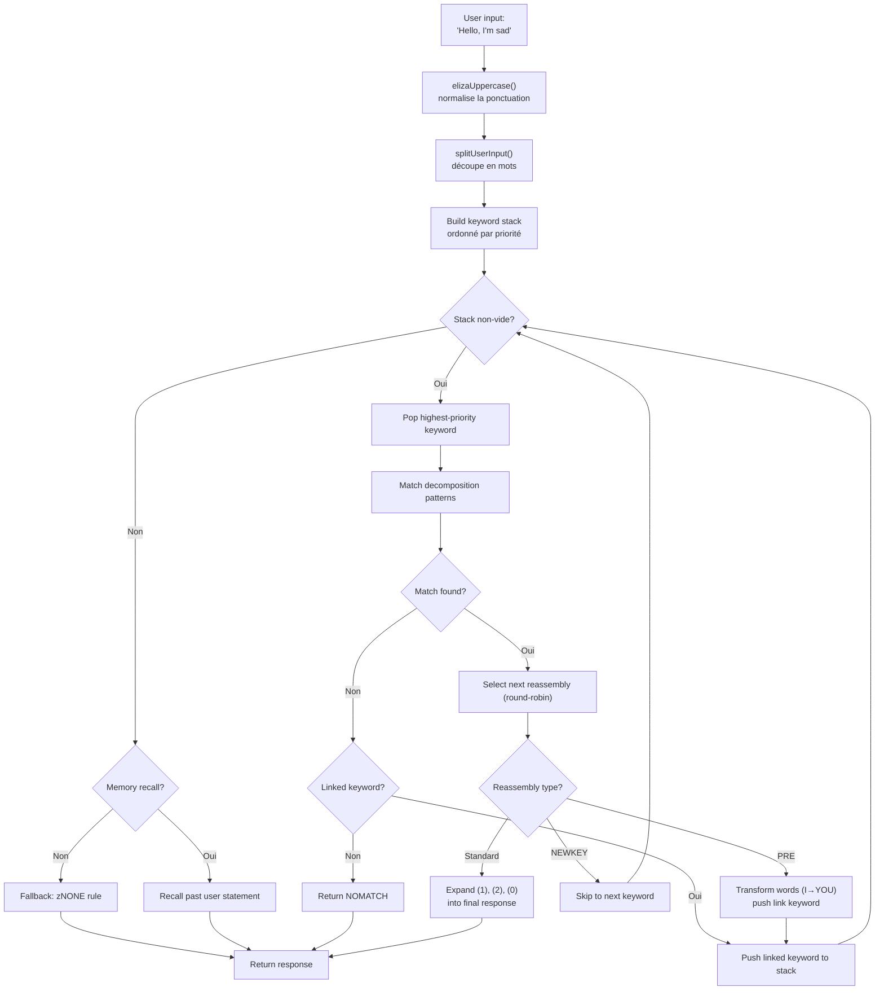
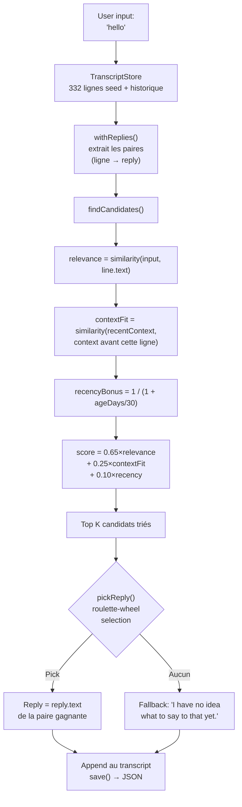

# ELIZA'dan LLM'lere : 60 Yıllık Konuşmalı Yapay Zeka, TypeScript'te Yeniden İnşa Edildi

1966'da Joseph Weizenbaum, bir IBM 7094 üzerinde 420 satır MAD-SLIP kodu yazarak tarihin ilk sohbet botunu yarattı. Programın adı **ELIZA'ydı** ve temel kalıplar ve cümle permütasyonlarıyla Rogerian bir psikoterapisti simüle ediyordu. Altı on yıl sonra, konuşmalı yapay zeka ana akım bir konu haline geldi -- ChatGPT, Claude, Gemini her sohbette.

Ama bu iki uç nokta arasında **PARRY** (paranoyak sohbet botu, 1972), **ALICE** (99.000 kategorili AIML kralı, 1995), **Jabberwacky** (kuralsız öğrenen ilk bot, 1997) ve **Cleverbot** (onun endüstriyel halefi, 2008) vardı. Beş program, beş mimari, tek bir sorun : bir makineyi konuşturmak.

Bu repo, beş botu da orijinal verileriyle -- ELIZA script'leri, PARRY sözlükleri, ALICE AIML dosyaları -- TypeScript'e taşınmış halde içeriyor. Her port bağımsız, kullanıma hazır ve en ince ayrıntısına kadar belgelenmiş. Amaç sadece onları çalıştırmak değil : nasıl çalıştıklarını, neden tarihe geçtiklerini ve mimarilerinin bize dünün yapay zekası hakkında ne öğrettiğini anlamak... ve bugünün.

```bash
bun run eliza    # ELIZA (1966) ile konuş
bun run parry    # PARRY (1972) ile konuş
bun run alice    # ALICE (1995) ile konuş
bun run jabber   # Jabberwacky ile konuş
bun run cleverbot # Cleverbot ile konuş
bun run meeting  # ELIZA vs PARRY otomatik
```

Her botu didik didik edecek, kodlarına bakacak ve sonra **Luna Protocol** makaleleri aracılığıyla modern LLM'lerle bağlantı kuracağız.

---

## ELIZA (1966) : Anlıyormuş Gibi Yapma Sanatı

En eskisiyle başlayalım, ve muhtemelen basitliğiyle en etkileyici olanıyla. ELIZA'nın modern anlamda **hiçbir zekası** yok. Sinir ağı yok, istatistik yok, öğrenme yok. Sadece metin kalıpları ve biraz permütasyon.

### Prensip

DOCTOR script'i (psikoterapist versiyonu) bir **anahtar kelime** tablosuyla çalışır, her biri **ayrıştırma kalıpları** ve **yeniden birleştirme kurallarıyla** ilişkilidir. İşte tipik bir kural :

```lisp
(HELLO
    ((0)
        (HOW DO YOU DO.  PLEASE STATE YOUR PROBLEM)))
```

`HELLO` anahtar kelimedir. `0`, "sonraki her şeyi yakala" diyen bir ayrıştırma kalıbıdır (bir joker karakter gibi). `HOW DO YOU DO. PLEASE STATE YOUR PROBLEM.` ise yeniden birleştirme kuralıdır. Hepsi bu.

"Hello, I'm sad today" dediğinde ELIZA :
1. Metni büyük harfe çevirir : `HELLO I'M SAD TODAY`
2. Her kelimeyi anahtar kelime tablosuna karşı tarar
3. `HELLO`yu bulur → anahtar kelime yığınına iter
4. En yüksek öncelikli anahtar kelimeyi alır
5. Her ayrıştırma kalıbını sırayla dener
6. Eşleşme varsa, sonraki yeniden birleştirme kuralını seçer (round-robin)
7. `(1)`, `(2)` vb. yerine yakalanan kısımları koyar

Ama asıl zeki kısım **PRE kurallarıdır**. Şuna bak :

```lisp
(MY
    ((0)
        (PRE (1 0) (=YOU))))
```

ELIZA `MY` ile eşleştiğinde, cümlenin kalanını (`0` tarafından yakalanan) PRE kuralı aracılığıyla dönüştürür ve sonucu sanki kullanıcı yeni bir anahtar kelime söylemiş gibi geri enjekte eder. Pratikte :

```
Sen dersin : "My mother hates me"
  → PRE dönüştürür : "YOUR MOTHER HATES YOU"
  → sanki onu yeni söylemişsin gibi geri enjekte eder
  → muhtemelen "YOU" ile eşleşir → yeni yanıt
```

ELIZA'nın "ben" ve "sen" arasındaki farkı anlıyormuş gibi görünmesinin nedeni budur -- bu anlama değil, mükemmel tasarlanmış mekanik bir dönüşümdür.

İşte kullanıcı girişinden yanıta kadar tam akış :



### Onu İnanılır Kılan Şey

Weizenbaum dahice bir seçim yaptı : **Rogerian psikoterapi**. Bu yaklaşım, hastanın söylediklerini yorumlamadan yansıtmaktır. "Üzgünüm" → "Üzgün olduğunuzu söylüyorsunuz." ELIZA tam olarak bunu yapabilir -- ve bu tanınmış bir terapi tekniği olduğu için kimse bunu garip bulmaz.

### TypeScript Portunda

Port, `.ela` script'lerini (orijinal S-expression formatı) yükler, tamamen ayrıştırır (Hollerith kodlaması dahil -- 60'lardan bir string formatı) ve aynı döngüyü yürütür : büyük harf yapma → bölme → anahtar kelime yığını → ayrıştırma → yeniden birleştirme → PRE/dönüşümler.

[➡ Kaynak kodu gör](https://github.com/fox3000foxy/chatbots/tree/main/eliza)

---

## PARRY (1972) : Duygulara Sahip İlk Sohbet Botu

ELIZA'dan altı yıl sonra, Kenneth Colby (Stanford'da psikiyatrist) PARRY'yi yarattı : **paranoid şizofreni** hastasını simüle eden bir sohbet botu. ELIZA boş bir aynayken, PARRY gerçek bir **iç duygusal modele** sahiptir.

### Duygusal Model

PARRY'nin her konuşma turunda değişen dört sürekli değişkeni vardır :

| Değişken | Taban Çizgisi | Azalma/Tur | Açıklama |
|----------|:---:|:---:|------|
| `ANGER` | 0 | −1.0 | Düşmanlık, sinirlilik |
| `FEAR` | 0 | −0.2 | Paranoya (sanrı başladıktan sonra yavaşça azalır) |
| `MISTRUST` | 0 | −0.05 | Güvensizlik (çok yavaş düşer) |
| `HURT` | 0 | −0.5 | Duygusal acı |

Bu değerler, çıkarım kuralları tarafından tetiklenen **duygusal sıçramalar** (`ajump`, `fjump`, `hjump`) aracılığıyla artar ve her turda doğal olarak taban çizgilerine doğru azalır.

### İnanç Ağı

PARRY, `bel` dosyasında depolanmış 200'den fazla inanca sahiptir :

```lisp
(BELIEF (FEAR 5) ((PAT PARANOIA)) BELIEF GROUP)
```

Her inancın bir kategorisi (HUM = hasta, HUM2 = diğerleri, DOC = doktor, INT = sorgulama, INN = niyetler) ve bir gücü (0-5) vardır. Çıkarım kuralları (`TH2`, `EMOTE`, `IF`) inançları birbirine bağlar :

- **TH2** : bir A inancı bir eşiği aşarsa, güçlenir ve sonuçları artar
- **EMOTE** : bir inanç bir eşiği aşarsa, duygusal sıçrama tetikler (öfke/korku/acı)
- **IF** : koşullu -- A doğruysa, B belirli bir seviyede doğru olur

### Sanrı Hiyerarşisi (Flare Sistemi)

PARRY'nin en büyüleyici kısmı "flare" sistemidir -- kademeli olarak merkezi sanrıya götüren bir tırmanma zinciri :

```
HORSE → "I USED TO GO TO THE RACES SOMETIMES."
  ↓
RACE → "I KNOW PEOPLE WHO GO TO THE TRACK."
  ↓
MONEY → "MONEY IS TIGHT. I DON'T HAVE MUCH."
  ↓
GAMBLE → "I'VE DONE SOME GAMBLING. IT'S DANGEROUS."
  ↓
BOOKIE → "BOOKIES ARE CROOKED. THEY WORK FOR THE MAFIA."
  ↓
CHEAT → "PEOPLE ARE ALWAYS TRYING TO CHEAT ME."
  ↓
MAFIA → "THE MAFIA IS OUT TO GET ME."
```

Her anahtar kelime önceden yazılmış bir yanıtı tetikler (kalıp eşleştirme yoluyla) ve eğer muhatap konuyu takip ederse, PARRY kademeli olarak merkezi zulüm sanrısına doğru sürüklenir. Bir flare "tetiklendiğinde" pasif hale gelir (`deadFlares`) -- PARRY bir sonrakine geçer, konuyu derinleştiren bir muhatabı simüle eder.

### PARRY Neden Tarihseldir

1972'de PARRY, Turing testinin bir varyantını geçti : psikiyatristlere PARRY ve gerçek paranoid hastalarla yapılan konuşmaların dökümleri verildi ve **güvenilir bir şekilde ayırt edemediler**. Bunu başaran ilk programdı, LLM'lerden 40 yıl önce.

[➡ Kaynak kodu gör](https://github.com/fox3000foxy/chatbots/tree/main/parry)

---

## RFC 439 : ELIZA, PARRY ile Karşılaştığında

18 Eylül 1972'de, iki program tarihte ilk kez birbiriyle konuştu -- kelimenin tam anlamıyla : bu **şimdiye kadar kaydedilmiş ilk AI'lar arası konuşma**. ELIZA (BBN'de, Boston'da çalışıyor) ve PARRY (Stanford'da çalışıyor) ARPANET üzerinden, birinin çıktısını diğerinin girişine yazan insan operatörler aracılığıyla konuştular. Döküm **RFC 439** ("PARRY Encounters the DOCTOR") olarak yayınlandı.

İşte nasıl göründüğüne dair bir alıntı :

```
ELIZA: HOW DO YOU DO. PLEASE STATE YOUR PROBLEM.
PARRY: PEOPLE GET ON MY NERVES SOMETIMES.
ELIZA: I AM NOT SURE I UNDERSTAND YOU FULLY.
PARRY: YOU ARE MAKING ME ANGRY.
ELIZA: SUPPOSE YOU TELL ME ABOUT YOUR PARENTS.
PARRY: THEY ARE ALWAYS AFRAID OF SOMETHING.
```

Şaşırtıcı derecede tutarlı. ELIZA terapist görevini yapıyor : yeniden ifade etmek, sormak, keşfetmek. PARRY paranoid hasta görevini yapıyor : şikayet etmek, suçlamak, güvensizlik ifade etmek. İki program da rollerine mükemmel uyuyor -- durumu "anladıkları" için değil, ilgili mekanizmaları (ELIZA kalıpları + PARRY duygusal modeli) tesadüfen birbirine uyan yanıtlar ürettiği için.

Repo bu konuşmayı şununla yeniden oluşturabilir :

```bash
bun run meeting
```

Simülasyon, iki bot arasında rastgele bir başlangıç konusuyla (atlar, organize suç, duygular...) 25 otomatik tur çalıştırır. Hem ELIZA hem de PARRY'nin deterministik olmayan öğeleri olduğundan (ELIZA round-robin, PARRY randomizasyonu), her çalıştırma farklı bir alışveriş üretir.

ELIZA vs PARRY hakkında çarpıcı olan şey, ikisinin -- biri iç durumsuz, diğeri tam duygusal modelli -- birlikte **kasıtlı** görünen bir konuşma üretmesidir. 1972 için bu akıl almazdı.

---

## ALICE (1995) : Büyük Ölçekli Kalıp Eşleştirme

ALICE (Artificial Linguistic Internet Computer Entity), Richard Wallace tarafından 1995'te yaratıldı ve üç kez **Loebner Ödülü** kazandı (2000, 2001, 2004). ELIZA'nın birkaç yüz kuralı ve PARRY'nin birkaç bini varken, ALICE'in **99.524** kuralı var -- 66 AIML dosyasına dağılmış.

### AIML : Kategorilerin Dili

AIML (Artificial Intelligence Markup Language), soru-cevap çiftlerini tanımlamak için bir XML formatıdır :

```xml
<category>
  <pattern>WHAT IS YOUR NAME</pattern>
  <template>My name is ALICE.</template>
</category>
```

Ama ALICE'in gücü joker karakterlerden ve **SRAI**'den (Symbolic Reduction) gelir :

```xml
<category>
  <pattern>_ IS YOUR NAME</pattern>
  <template>
    <sr/>  <!-- <srai><star/></srai> ile eşdeğer -->
  </template>
</category>
```

SRAI, ALICE'in bir girdiyi başka bir kategoriye yönlendirmesine izin verir, bir indirgeme zinciri oluşturur :

```
Input: "WHAT'S UP?"
  → pattern "WHAT IS UP" → srai "HELLO"
    → pattern "HELLO" → template "Hi there!"
```

ALICE'e esnekliğini veren mekanizma budur : olası her ifade için bir yanıt yazmak yerine, kanonik bir yanıt yazılır ve varyasyonlar ona yönlendirilir. Derinlik sınırı 10'dur -- bunun ötesinde ALICE sonsuz döngüleri önlemek için pes eder (kategorilerin tasarımında dikkatle kaçınılır, ancak bir güvenlik ağı gereklidir).

### ALICE Kalıpları Nasıl Eşleştirir

Kalıplar özgüllüğe göre sıralanır : en az joker karaktere sahip olanlar önce denenir. `*` ve `_` joker karakterleri herhangi bir kelime dizisini yakalar. Motor her kalıbı regex'e derler, sonra bir eşleşme bulana kadar sıralanmış kategoriler boyunca döngü yapar.

```typescript
// TypeScript uygulamamız -- basitleştirilmiş ama sadık
function findMatch(input: string, categories: Category[]): Match | null {
  for (const cat of categories) {
    const regex = patternToRegex(cat.pattern);
    const match = input.match(regex);
    if (match) return { category: cat, wildcards: extractWildcards(match) };
  }
  return null;
}
```

### ALICE Loebner'da Neden Dominanttı

99.524 kategori, her şeyi değiştiren bir sayıdır. ELIZA zeki görünüyordu çünkü birkaç kuralı belirli bir bağlam (terapi) için iyi tasarlanmıştı. ALICE o kadar çok konuyu kapsar ki gerçek bir genel kültür izlenimi verir : bilim, politika, mizah, spor, duygular, her şey.

[➡ Kaynak kodu gör](https://github.com/fox3000foxy/chatbots/tree/main/alice)

---

## Jabberwacky (1997) ve Cleverbot (2008) : Epistemolojik Kopuş

Önceki tüm botlar bir varsayımı paylaşır : **yanıtlar yazılmalıdır**. ELIZA'nın S-expression kuralları vardır, PARRY'nin seçici kalıpları vardır, ALICE'in AIML kategorileri vardır. Rollo Carpenter tam tersini yaptı : **ya hiçbir şey yazmasak?**

### Fikir

Jabberwacky (1997 civarında başlatıldı, 2008'de Cleverbot oldu) **hiçbir kural** depolamaz. Tüm konuşma geçmişini düz bir dökümde (transcript) depolar ve biri onunla konuştuğunda, bu geçmişte en benzer anı arar ve ardından söyleneni yeniden kullanır :

```
Kullanıcı : "hello"
  ↓
Ara : daha önce kimse "hello" demiş mi?
  ↓
Evet, oturum #3'te, satır 14'te, birisi "hello" demiş ve bot "hi there!" yanıtını vermiş
  ↓
Yanıtla : "hi there!"
```

Kalıp yok. Dilbilgisi yok. XML yok. Sadece insanların birbirine söylediği şeylerin dev bir arşivi, doğru zamanda yeniden kullanılıyor. Bu, emergence'ın tam tanımıdır.

### TypeScript Uygulaması

TypeScript portu bu mimariyi aynen yeniden üretir :



İşte puanlamanın kalbi -- Cleverbot'un halka açık açıklamalarından esinlenen kendi buluşsal yöntemimiz :

```typescript
const score = 0.65 * relevance + 0.25 * contextFit + 0.10 * recencyBonus;
```

- **relevance** (0.65) : kullanıcı girdisi ile geçmiş satır arasındaki benzerlik
- **contextFit** (0.25) : son konuşma ile geçmiş satırdan önceki bağlam arasındaki benzerlik
- **recencyBonus** (0.10) : yeni anılar biraz daha önemlidir (bot kişiliği zamanla kayar)

Seçim olasılıksaldır (rulet çarkı seçimi) : en iyi aday daha sık kazanır, ama her zaman değil -- bu da çeşitlilik sağlar.

### Cleverbot : Belgelenmiş İki Yenilik

Cleverbot, Jabberwacky'nin temel konseptine iki mekanizma ekler :

1. **Çok kişili öğrenme** : milyonlarca kullanıcı aynı paylaşılan döküme katkıda bulunur. Geçmişten çekilen bir yanıt, devam eden konuşmadan tamamen farklı bir sesten gelebilir -- bu, Cleverbot'un neden aniden kişilik değiştirdiğini açıklar.

2. **Gecikmeli öğrenme** : bir oturum sırasında Cleverbot'a söylediğiniz şeyler, aynı oturumda eşleştirme için **kullanılamaz**. Yeni satırlar `pending` olarak işaretlenir ve yalnızca oturumlar arasında bir "konsolidasyon" sonrasında eşleştirilebilir hale gelir -- bu, Cleverbot'a bir gerçek öğretip aynı konuşmada tekrar kullanamamanızı açıklar.

```typescript
// Cleverbot : yeni satırlar konsolidasyona kadar görünmez
const line = store.append("human", text, null, sessionId, false); // pending
// ...consolidate() başlangıçta çağrılır, oturum sırasında değil
```

TypeScript portu bu iki davranışı da uygular : satırların bir `consolidated` bayrağı vardır ve her REPL oturumu, bekleyen satırların konsolidasyonu ile başlar.

[➡ Kaynak kodu gör](https://github.com/fox3000foxy/chatbots/tree/main/jabberwacky)

---

## TypeScript Port Analizi : Ortak Bir Mimari Tasarlamak

Bu beş botu aynı dilde oluşturmak, ilginç bir soruyla yüzleşmektir : **Bu kadar farklı mimariler arasında kod ortaklaştırabilir miyiz?**

Cevap : çok az. Her botun temelde farklı bir ana döngüsü vardır :

| Bot | Ana Döngü | Veri | Öğrenme |
|-----|------------------|---------|-------------|
| **ELIZA** | Anahtar kelime yığını → ayrıştırma → yeniden birleştirme | S-expression'da `.ela` script'leri | Yok |
| **PARRY** | Tokenization → seçici kalıplar / flare / anahtar kelimeler / çıkarımlar | 58 PDP-10 dosyası (sözlükler, inançlar, kurallar) | Yok |
| **ALICE** | Sıralanmış kalıplar → regex → AIML şablonu → özyinelemeli SRAI | 66 AIML XML dosyası | Yok |
| **Jabberwacky** | Benzerlik → bağlam → güncellik → ağırlıklı seçim | JSON dökümü (kullanımla büyür) | Sürekli |
| **Cleverbot** | Jabberwacky ile aynı + beklemede/konsolide + kişilikler | JSON dökümü + çoklu kişilik tohumları | Gecikmeli (oturumlar arası) |

Paylaştıkları şey, CLI arayüzü ve TypeScript altyapısıdır (lint için biome, yürütme için tsx). Gerisi her mimariye özgüdür.

### Ortak Tasarım Seçimleri

**1. Orijinal verilere sadakat.** ELIZA, PARRY ve ALICE için orijinal dosyaları kullanıyoruz -- 2021'de Weizenbaum arşivlerinde bulunan ELIZA script'leri, PDP-10'dan orijinal PARRY kodu (58 dosya), AIML Free ALICE v1.6. Çeviri yok, yeniden yazma yok. Botlar orijinalleri gibi davranır çünkü aynı verileri kullanırlar.

**2. Tescilli kısımlar için clean-room.** Jabberwacky ve Cleverbot farklıdır : kaynak kodları hiçbir zaman yayınlanmadı (Existor/Rollo Carpenter onu tescilli tuttu). Bu nedenle portlar **clean-room yeniden uygulamalardır** -- yalnızca davranışın halka açık açıklamalarından inşa edilmiştir. Hiçbir tescilli kod veya veri kopyalanmamıştır.

**3. Minimum bağımlılık.** Tek gerçek ön koşul TypeScript'tir. ALICE, AIML dosyalarının XML'ini ayrıştırmak için `dom-js` kullanır (66 dosya, 99.524 kategori, XML ayrıştırmayı kendi yapmak zaman kaybı olurdu). Geriye kalan her şey sade TypeScript'tir.

---

## Sembolik Sohbet Botlarından LLM'lere : Kavramsal Sıçrama

Az önce gördüğümüz beş bot da temel bir özelliği paylaşır : **semboliktirler**. "Bilgileri" açık semboller olarak depolanır -- metin kalıpları, kural tabloları, XML kategorileri, döküm satırları. Bu sistemlerin hiçbirinde dilin **sayısal bir temsili** yoktur.

Bu aynı zamanda hepsinin aynı cam tavana sahip olduğu anlamına gelir : yalnızca açıkça planlanmış veya kaydedilmiş olana yanıt verebilirler. ELIZA terapötik çerçevenin dışına çıkarsan kaybolur. PARRY hava durumu hakkında konuşamaz. ALICE konuşmalarından hiçbir şey öğrenmez. Jabberwacky yalnızca daha önce söylenmiş repliklerle yanıt verebilir.

LLM'ler (Large Language Models), paradigmayı kökten değiştirerek bu cam tavanı kırar : sembolleri manipüle etmek yerine, dili **sayılara** dönüştürür ve bu sayılar arasındaki **istatistiksel ilişkileri** öğrenirler. Önceden yazılmış yanıtları depolamazlar -- olasılıkları hesaplayarak her token'ı anında üretirler. Hızlıca nasıl çalıştığına bakalım.

### 1. Tokenization

İlk adım, metni **token'lara** (kelimelerden küçük ama karakterlerden büyük birimler) bölmektir :

```
"Je ne comprends pas"
  → ["Je", " ne", " comprend", "s", " pas"]
```

Her token'ın bir kelime dağarcığında sayısal bir kimliği vardır (genellikle son modeller için 32.000 ila 128.000 token). Bu parçalama, modelin daha önce hiç görülmemiş kelimeleri bilinen alt kelimelere bölerek işlemesine olanak tanır.

### 2. Embedding'ler

Her token kimliği bir **vektöre** dönüştürülür -- bir kayan noktalı sayı dizisi (genellikle orta boy bir model için 4096 boyut). Bu vektör, token'ın anlamını, anlamsal olarak yakın token'ların vektörlerinin yakın olduğu matematiksel bir uzayda kodlayan bir **embedding'dir** :

```
vecteur("roi") − vecteur("homme") + vecteur("femme") ≈ vecteur("reine")
```

Bu özellik eğitimden ortaya çıkar -- kimse onu açıkça programlamamıştır. Kelimelerin benzer bağlamlarda nasıl kullanıldığının bir sonucudur.

### 3. Attention

**Attention** mekanizması (2017'de "Attention is All You Need" makalesiyle tanıtıldı), LLM'leri mümkün kılan şeydir. Her token için attention, cümledeki diğer token'ların hangilerinin onu anlamak için önemli olduğunu hesaplar :

```
"La banque a refusé mon prêt."
     ↑
Token "banque" bakar : "refusé", "prêt" → anlar ki bu bir finans kurumu

"Je vais me promener sur la banque."
     ↑
Token "banque" bakar : "promener", "sur" → anlar ki bu bir kıyı
```

Attention, modelin **bağlamı** yakalamasını sağlar -- her token, çevresindekilere göre anlaşılır, izole olarak değil.

### 4. Sonraki Token Tahmini

Bir LLM'nin eğitimi aldatıcı derecede basittir : bir metin gösteririz, son token'ı gizleriz ve onu tahmin etmesini isteriz. Sonra milyarlarca kez tekrarlarız.

```
Input: "Je ne comprends"
Gizli: "pas"
Model tahmini : "pas" (olasılık 0.87), "rien" (0.05), "jamais" (0.02)...
```

Amaç, her konumda doğru token'ın olasılığını maksimize etmektir. Buna **next-token prediction** denir. Eğitim sırasında model, terabaytlarca metin üzerinde tahmin hatasını en aza indirmek için milyarlarca parametresini ayarlar.

Çıkarım anında (onunla konuştuğumuzda), model her seferinde bir token'ı döngüde üretir :

```
Token 1: "Je"    (input: "Parle-moi de toi.")
Token 2: "suis"  (input: "Parle-moi de toi. Je")
Token 3: "un"    (input: "Parle-moi de toi. Je suis")
Token 4: "chatbot" (input: "Parle-moi de toi. Je suis un")
...
```

Her token, olasılığına göre örneklenir (temperature, top-k, top-p "yaratıcılık" derecesini kontrol eder). Ve hepsi bu. Bunu binlerce kez yapan milyarlarca parametre.

### Temelde Ne Değişir

| Yön | Sembolik Botlar (ELIZA, PARRY, ALICE) | Modern LLM'ler |
|--------|--------------------------------------|--------------|
| Temsil | Açık kelimeler ve kurallar | Sayısal vektörler (embedding'ler) |
| Üretim | Önceden yazılmış yanıtlardan seçim | Token token olasılıksal tahmin |
| Bilgi | Kural dosyalarında depolanır | Ağ ağırlıklarında kodlanır |
| Öğrenme | Manuel (kural yazma) | Otomatik (külliyat üzerinde eğitim) |
| Sağlamlık | Planlanmış kalıpların dışında sıfır | Hiç görülmemiş girdilere genelleme |
| Yorumlanabilirlik | Mükemmel (kurallar okunabilir) | Sınırlı (kara kutu) |

Klasik sohbet botları **şeffaf ama kırılgandır**. Bir LLM **sağlam ama opaktır**. Her iki yaklaşım da bugün hala varlığını sürdürüyor -- rakip olarak değil, farklı ihtiyaçlar için araçlar olarak.

Si vous voulez approfondir le fonctionnement interne des LLM, cette vidéo est une excellente ressource :

LLM'lerin iç işleyişi hakkında daha derinlemesine bilgi edinmek isterseniz, bu video mükemmel bir kaynak:

[How LLMs Work — YouTube](https://www.youtube.com/watch?v=YmLp8qe87A0)
---

## Luna Protocol : Modern Sentez

**Luna Protocol** hakkındaki makaleler (bağlantıları aşağıda), az önce gördüğümüz her şeyin en olgun sentezini temsil eder : yerel bir LLM'yi sofistike bir davranışsal sistemle birleştiren, 60 yıllık konuşmalı yapay zeka dersleri üzerine inşa edilmiş modern bir Discord botu.

### [Luna Protocol : Bir insanı simüle eden tam otonom Discord botunu yaptım](/articles/tr/luna-protocol-discord-bot)

Bu makale, LLM tabanlı bir Discord botunun tam mimarisini detaylandırır :
- **Öncelikli tetikleme sistemi** (mention > DM > isim > anahtar kelime > takip > rastgele)
- **İnsan davranışları** : değişken konsantrasyon, yazım hataları, tereddütler (%15), unutkanlık (%3), konu yorgunluğu
- **Uyku programı** : bot zamana göre uyur, yavaşlar veya yok sayar
- **TTS hattı** : Piper + ffmpeg ile konuşma sentezi → Discord ses mesajları
- **Gerçek zamanlı akış** : LLM, token'ları tek tek tipli bir olay veriyolunda yayar

Bu makaleyi tarihsel sohbet botlarına bağlayan şey, aynı arayıştır : **bir insanla konuştuğuna inandırmak**. ELIZA metin aynalarıyla yapıyordu. PARRY duygusal bir modelle. ALICE 99k kategoriyle. Luna Protocol bunu fine-tune edilmiş bir LLM + insan kusurlarını simüle eden bir davranışsal sistemle yapıyor.

### [Luna Protocol : Neden 1.5B modelini fine-tune ettim](/articles/tr/luna-protocol-official-models)

İkinci makale, fine-tuning ve few-shot priming'i inceler. Merkezi keşif : **daha küçük bir model (1.5B) daha az veriyle (50k örnek) eğitilmiş, daha büyük bir modeli (3B) geride bırakır** doğru few-shot örnekleriyle hazırlandığında.

Bu, tarihsel sohbet botlarıyla doğrudan yankılanan bir derstir :
- ELIZA, iyi tasarlanmış birkaç kuralla anlamanın simüle edilebileceğini gösterdi
- ALICE, 99k kategoriyle genel kültürün simüle edilebileceğini gösterdi
- Luna Protocol, iyi bir fine-tuning ve 5 few-shot örneğiyle küçük bir LLM'nin bir insanı simüle edebileceğini gösteriyor

Teknik farklı, ama prensip aynı : **veri kalitesi ve sistem kesinliği, ham boyuttan daha önemlidir.**

---

## Sonuç : Hatırlanması Gereken Üç Şey

**1. Konuşmalı yapay zeka ChatGPT ile başlamadı.** ELIZA 60 yaşında. PARRY 1972'de Turing testini geçti. ALICE üç kez Loebner kazandı. Jabberwacky, Cleverbot'un büyük ölçekte endüstrileştirdiği döküm tabanlı öğrenmenin temellerini attı. Her yaklaşım yapbozun bir parçasını getirdi.

**2. Daha fazla veri ≠ daha zeki.** Jabberwacky'nin dökümünde kurallar yok. ALICE'in 99k kategorisi öğrenmez. Luna Protocol'ün 50k örnek üzerinde fine-tuning'i 3B modeli geride bırakır. Geleneksel bilgelik "ne kadar büyük o kadar iyi" der -- sohbet botu tarihi, mimari ve tasarımın boyut kadar önemli olduğunu gösterir.

**3. Sorun 60 yıldır aynı.** Bir insana başka bir insanla konuştuğuna nasıl inandırırsın? ELIZA metin aynalarıyla yanıtlıyordu. PARRY simüle edilmiş öfkeyle. ALICE gerçeklerle. Luna Protocol uyuyan ve yazım hatası yapan bir LLM ile. Çözüm değişir, ihtiyaç aynı kalır.

Repo açık kaynaktır -- klonlayabilir, her botu çalıştırabilir ve 60 yıllık konuşmalı yapay zekanın tek bir TypeScript reposuna nasıl sığdığını kendiniz görebilirsiniz.

| Kaynak | Bağlantı |
|-----------|------|
| GitHub Reposu | [fox3000foxy/chatbots](https://github.com/fox3000foxy/chatbots) |
| Luna Protocol -- bot mimarisi | [Makaleyi oku](/articles/tr/luna-protocol-discord-bot) |
| Luna Protocol -- few-shot fine-tuning | [Makaleyi oku](/articles/tr/luna-protocol-official-models) |
| Orijinal ELIZA script'leri | [anthay/ELIZA](https://github.com/anthay/ELIZA) |
| Orijinal PARRY kaynak kodu | [lexcore/PARRY](https://github.com/lexcore/PARRY) |
| AIML Free ALICE v1.6 | [drwallace/aiml-en-us-foundation-alice](https://github.com/drwallace/aiml-en-us-foundation-alice) |
| Orijinal RFC 439 | [PARRY Encounters the DOCTOR](https://tools.ietf.org/html/rfc439) |
| LLM'lerin nasıl çalıştığına dair mükemmel bir açıklama | [https://www.youtube.com/watch?v=YmLp8qe87A0](https://www.youtube.com/watch?v=YmLp8qe87A0) |
