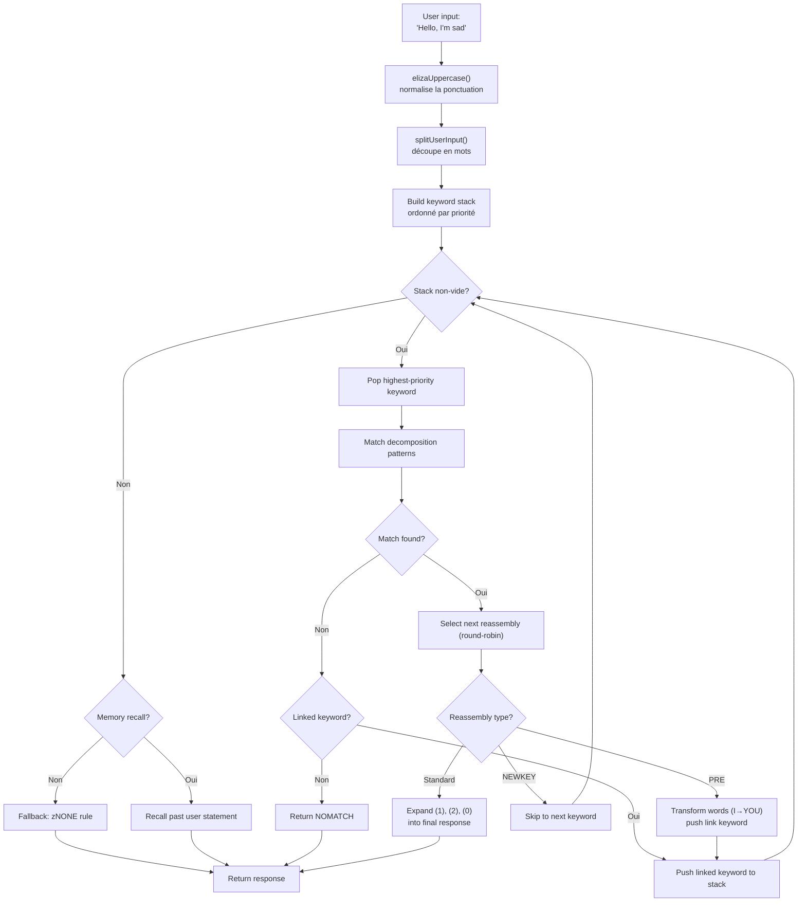
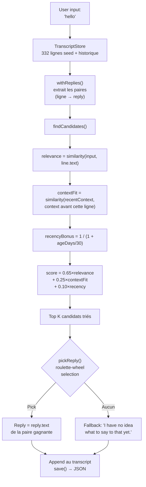

# Từ ELIZA đến LLM : 60 năm AI hội thoại, được tái dựng bằng TypeScript

Năm 1966, Joseph Weizenbaum viết 420 dòng MAD-SLIP trên một chiếc IBM 7094 để tạo ra chatbot đầu tiên trong lịch sử. Chương trình có tên **ELIZA**, và nó mô phỏng một nhà trị liệu tâm lý Rogerian với các mẫu cơ bản và hoán vị câu. Sáu thập kỷ sau, AI hội thoại đã trở thành chủ đề chính thống -- ChatGPT, Claude, Gemini có mặt trong mọi cuộc trò chuyện.

Nhưng giữa hai thái cực này, có **PARRY** (chatbot hoang tưởng, 1972), **ALICE** (vua của AIML với 99.000 danh mục, 1995), **Jabberwacky** (bot đầu tiên học mà không cần luật, 1997), và **Cleverbot** (người kế thừa công nghiệp, 2008). Năm chương trình, năm kiến trúc, một vấn đề duy nhất : khiến máy móc biết nói.

Repo này chứa cả năm bot, được chuyển sang TypeScript với dữ liệu gốc -- script ELIZA, từ điển PARRY, tệp AIML của ALICE. Mỗi bản port độc lập, sẵn sàng sử dụng và được tài liệu hóa chi tiết. Mục tiêu không chỉ là chạy được chúng : mà là hiểu cách chúng hoạt động, tại sao chúng đánh dấu lịch sử, và kiến trúc của chúng dạy chúng ta điều gì về AI ngày hôm qua... và hôm nay.

```bash
bun run eliza    # Nói chuyện với ELIZA (1966)
bun run parry    # Nói chuyện với PARRY (1972)
bun run alice    # Nói chuyện với ALICE (1995)
bun run jabber   # Nói chuyện với Jabberwacky
bun run cleverbot # Nói chuyện với Cleverbot
bun run meeting  # Tự động ELIZA vs PARRY
```

Chúng ta sẽ mổ xẻ từng bot, xem code của chúng, sau đó kết nối với LLM hiện đại qua các bài viết về **Luna Protocol**.

---

## ELIZA (1966) : Nghệ thuật khiến người ta tin rằng bạn hiểu

Hãy bắt đầu với bot lâu đời nhất, và có lẽ ấn tượng nhất trong sự đơn giản của nó. ELIZA **không có trí thông minh** nào theo nghĩa hiện đại. Không mạng nơ-ron, không thống kê, không học tập. Chỉ là các mẫu văn bản và một chút hoán vị.

### Nguyên lý

Script DOCTOR (phiên bản nhà trị liệu) hoạt động với một bảng **từ khóa**, mỗi từ được liên kết với **mẫu phân tách** và **quy tắc tái hợp**. Đây là một quy tắc điển hình :

```lisp
(HELLO
    ((0)
        (HOW DO YOU DO.  PLEASE STATE YOUR PROBLEM)))
```

`HELLO` là từ khóa. `0` là mẫu phân tách có nghĩa là "bắt mọi thứ theo sau" (như wildcard). `HOW DO YOU DO. PLEASE STATE YOUR PROBLEM.` là quy tắc tái hợp. Chỉ vậy thôi.

Khi bạn nói "Hello, I'm sad today", ELIZA :
1. Chuyển văn bản thành chữ hoa : `HELLO I'M SAD TODAY`
2. Quét từng từ so với bảng từ khóa
3. Tìm thấy `HELLO` → push lên stack từ khóa
4. Lấy từ khóa có ưu tiên cao nhất
5. Thử từng mẫu phân tách theo thứ tự
6. Nếu khớp, chọn quy tắc tái hợp tiếp theo (round-robin)
7. Thay thế `(1)`, `(2)` v.v. bằng các phần đã bắt

Nhưng phần thực sự thông minh là các **quy tắc PRE**. Hãy xem :

```lisp
(MY
    ((0)
        (PRE (1 0) (=YOU))))
```

Khi ELIZA khớp `MY`, nó biến đổi phần còn lại của câu (bị bắt bởi `0`) qua quy tắc PRE, và đưa kết quả trở lại như thể người dùng vừa nói một từ khóa mới. Cụ thể :

```
Bạn nói : "My mother hates me"
  → PRE biến đổi : "YOUR MOTHER HATES YOU"
  → đưa lại như thể bạn vừa nói nó
  → có thể khớp "YOU" → phản hồi mới
```

Đó là lý do ELIZA có vẻ hiểu sự khác biệt giữa "tôi" và "bạn" -- đó không phải hiểu biết, mà là một phép biến đổi cơ học được thiết kế hoàn hảo.

Đây là luồng hoàn chỉnh, từ người dùng gõ đến phản hồi :



### Điều khiến nó đáng tin

Weizenbaum đã chọn một hướng đi thiên tài : **liệu pháp tâm lý Rogerian**. Cách tiếp cận này là phản ánh lời nói của bệnh nhân mà không diễn giải. "Tôi buồn" → "Ông nói rằng ông buồn." Đó chính xác là những gì ELIZA biết làm -- và vì đây là một kỹ thuật trị liệu được công nhận, không ai thấy nó kỳ lạ.

### Trong bản port TypeScript

Port tải các script `.ela` (định dạng S-expression gốc), phân tích cú pháp hoàn chỉnh (bao gồm mã hóa Hollerith -- một định dạng chuỗi từ những năm 60), và thực thi cùng chu trình : viết hoa → tách → stack từ khóa → phân tách → tái hợp → PRE/biến đổi.

[➡ Xem mã nguồn](https://github.com/fox3000foxy/chatbots/tree/main/eliza)

---

## PARRY (1972) : Chatbot đầu tiên có cảm xúc

Sáu năm sau ELIZA, Kenneth Colby (bác sĩ tâm thần tại Stanford) đã tạo ra PARRY : một chatbot mô phỏng bệnh nhân mắc **tâm thần phân liệt hoang tưởng**. Trong khi ELIZA là một tấm gương rỗng, PARRY có một **mô hình cảm xúc nội tại** thực sự.

### Mô hình cảm xúc

PARRY có bốn biến liên tục thay đổi sau mỗi lượt trò chuyện :

| Biến | Đường cơ sở | Suy giảm/lượt | Mô tả |
|----------|:---:|:---:|------|
| `ANGER` | 0 | −1.0 | Thù địch, cáu kỉnh |
| `FEAR` | 0 | −0.2 | Hoang tưởng (giảm chậm sau khi bắt đầu ảo tưởng) |
| `MISTRUST` | 0 | −0.05 | Ngờ vực (giảm rất chậm) |
| `HURT` | 0 | −0.5 | Tổn thương cảm xúc |

Các giá trị này tăng lên qua các **bước nhảy cảm xúc** (`ajump`, `fjump`, `hjump`) được kích hoạt bởi các quy tắc suy luận, và giảm dần tự nhiên về đường cơ sở qua mỗi lượt.

### Mạng lưới niềm tin

PARRY có hơn 200 niềm tin được lưu trong tệp `bel` :

```lisp
(BELIEF (FEAR 5) ((PAT PARANOIA)) BELIEF GROUP)
```

Mỗi niềm tin có một danh mục (HUM = bệnh nhân, HUM2 = người khác, DOC = bác sĩ, INT = thẩm vấn, INN = ý định) và một độ mạnh (0-5). Các quy tắc suy luận (`TH2`, `EMOTE`, `IF`) kết nối các niềm tin với nhau :

- **TH2** : nếu niềm tin A vượt ngưỡng, nó mạnh lên và hệ quả tăng lên
- **EMOTE** : nếu niềm tin vượt ngưỡng, nó kích hoạt bước nhảy cảm xúc (giận/sợ/tổn thương)
- **IF** : điều kiện -- nếu A đúng, thì B trở nên đúng ở một mức độ nào đó

### Hệ thống phân cấp ảo tưởng (flare system)

Phần hấp dẫn nhất của PARRY là hệ thống "flare" -- một chuỗi leo thang dần dần dẫn đến ảo tưởng trung tâm :

```
HORSE → "I USED TO GO TO THE RACES SOMETIMES."
  ↓
RACE → "I KNOW PEOPLE WHO GO TO THE TRACK."
  ↓
MONEY → "MONEY IS TIGHT. I DON'T HAVE MUCH."
  ↓
GAMBLE → "I'VE DONE SOME GAMBLING. IT'S DANGEROUS."
  ↓
BOOKIE → "BOOKIES ARE CROOKED. THEY WORK FOR THE MAFIA."
  ↓
CHEAT → "PEOPLE ARE ALWAYS TRYING TO CHEAT ME."
  ↓
MAFIA → "THE MAFIA IS OUT TO GET ME."
```

Mỗi từ khóa kích hoạt một phản hồi được viết sẵn (qua so khớp mẫu), và nếu người đối thoại theo chủ đề, PARRY dần dần trôi dạt về ảo tưởng trung tâm bị ngược đãi. Khi một flare bị "kích hoạt", nó trở nên không hoạt động (`deadFlares`) -- PARRY chuyển sang cái tiếp theo, mô phỏng một người đối thoại đang đào sâu chủ đề.

### Tại sao PARRY là lịch sử

Năm 1972, PARRY đã vượt qua một biến thể của bài kiểm tra Turing : các bác sĩ tâm thần nhận được bản ghi chép các cuộc trò chuyện với PARRY và với bệnh nhân hoang tưởng thực, và **không thể phân biệt được một cách đáng tin cậy**. Đó là chương trình đầu tiên làm được điều này, 40 năm trước LLM.

[➡ Xem mã nguồn](https://github.com/fox3000foxy/chatbots/tree/main/parry)

---

## RFC 439 : Khi ELIZA gặp PARRY

Ngày 18 tháng 9 năm 1972, hai chương trình đã nói chuyện với nhau lần đầu tiên trong lịch sử -- theo nghĩa đen : đây là **cuộc trò chuyện liên AI đầu tiên** từng được ghi lại. ELIZA (chạy trên BBN ở Boston) và PARRY (chạy ở Stanford) đã trò chuyện qua ARPANET, được chuyển tiếp bởi các nhà vận hành con người gõ đầu ra của cái này thành đầu vào của cái kia. Bản ghi đã được công bố là **RFC 439** ("PARRY Encounters the DOCTOR").

Đây là một đoạn trích cho thấy nó trông như thế nào :

```
ELIZA: HOW DO YOU DO. PLEASE STATE YOUR PROBLEM.
PARRY: PEOPLE GET ON MY NERVES SOMETIMES.
ELIZA: I AM NOT SURE I UNDERSTAND YOU FULLY.
PARRY: YOU ARE MAKING ME ANGRY.
ELIZA: SUPPOSE YOU TELL ME ABOUT YOUR PARENTS.
PARRY: THEY ARE ALWAYS AFRAID OF SOMETHING.
```

Nó mạch lạc một cách đáng ngạc nhiên. ELIZA làm công việc của nhà trị liệu : diễn giải lại, hỏi han, khám phá. PARRY làm công việc của bệnh nhân hoang tưởng : phàn nàn, buộc tội, thể hiện sự ngờ vực. Cả hai chương trình đều hoàn toàn trong vai trò của mình -- không phải vì chúng "hiểu" tình huống, mà vì cơ chế tương ứng của chúng (mẫu ELIZA + mô hình cảm xúc PARRY) tạo ra các phản hồi tình cờ khớp với nhau.

Repo có thể tái tạo cuộc trò chuyện này với :

```bash
bun run meeting
```

Mô phỏng chạy 25 lượt tự động giữa hai bot, với một chủ đề khởi đầu ngẫu nhiên (ngựa, tội phạm có tổ chức, cảm xúc...). Vì cả ELIZA và PARRY đều có các yếu tố phi tất định (round-robin của ELIZA, ngẫu nhiên hóa của PARRY), mỗi lần chạy tạo ra một cuộc trao đổi khác nhau.

Điều nổi bật về ELIZA vs PARRY là chúng ta có hai chương trình -- một không có trạng thái nội tại, một có mô hình cảm xúc hoàn chỉnh -- cùng nhau tạo ra một cuộc trò chuyện **trông như** có chủ đích. Đối với năm 1972, điều đó thật kinh ngạc.

---

## ALICE (1995) : So khớp mẫu quy mô lớn

ALICE (Artificial Linguistic Internet Computer Entity) được tạo bởi Richard Wallace vào năm 1995, và đã giành **Giải Loebner** ba lần (2000, 2001, 2004). Trong khi ELIZA có vài trăm quy tắc và PARRY có vài nghìn, ALICE có **99.524** -- phân bố trong 66 tệp AIML.

### AIML : Ngôn ngữ của các danh mục

AIML (Artificial Intelligence Markup Language) là một định dạng XML để định nghĩa các cặp câu hỏi-trả lời :

```xml
<category>
  <pattern>WHAT IS YOUR NAME</pattern>
  <template>My name is ALICE.</template>
</category>
```

Nhưng sức mạnh của ALICE đến từ các wildcard và **SRAI** (Symbolic Reduction) :

```xml
<category>
  <pattern>_ IS YOUR NAME</pattern>
  <template>
    <sr/>  <!-- tương đương <srai><star/></srai> -->
  </template>
</category>
```

SRAI cho phép ALICE chuyển hướng đầu vào sang một danh mục khác, tạo ra một chuỗi rút gọn :

```
Input: "WHAT'S UP?"
  → pattern "WHAT IS UP" → srai "HELLO"
    → pattern "HELLO" → template "Hi there!"
```

Đó là cơ chế mang lại cho ALICE sự linh hoạt : thay vì viết một phản hồi cho mọi cách diễn đạt có thể, ta viết một phản hồi chuẩn và chuyển hướng các biến thể tới nó. Giới hạn độ sâu là 10 -- quá giới hạn, ALICE bỏ cuộc để tránh vòng lặp vô hạn (được tránh cẩn thận trong thiết kế danh mục, nhưng lưới an toàn vẫn cần thiết).

### Cách ALICE so khớp mẫu

Các mẫu được sắp xếp theo độ đặc hiệu : những mẫu có ít wildcard nhất được thử trước. Wildcard `*` và `_` bắt bất kỳ chuỗi từ nào. Engine biên dịch mỗi mẫu thành regex, sau đó lặp qua các danh mục đã sắp xếp cho đến khi tìm thấy kết quả khớp.

```typescript
// Triển khai TypeScript của chúng tôi -- đơn giản nhưng trung thành
function findMatch(input: string, categories: Category[]): Match | null {
  for (const cat of categories) {
    const regex = patternToRegex(cat.pattern);
    const match = input.match(regex);
    if (match) return { category: cat, wildcards: extractWildcards(match) };
  }
  return null;
}
```

### Tại sao ALICE thống trị Loebner

99.524 danh mục, đó là một con số thay đổi mọi thứ. ELIZA có vẻ thông minh vì vài quy tắc của nó được thiết kế tốt cho một bối cảnh cụ thể (trị liệu). ALICE bao phủ quá nhiều chủ đề đến nỗi nó tạo ấn tượng về một nền tảng văn hóa thực sự : khoa học, chính trị, hài hước, thể thao, cảm xúc, tất cả đều có.

[➡ Xem mã nguồn](https://github.com/fox3000foxy/chatbots/tree/main/alice)

---

## Jabberwacky (1997) và Cleverbot (2008) : Sự đứt gãy nhận thức luận

Tất cả các bot trước đều chia sẻ một giả định : **phải viết các câu trả lời**. ELIZA có quy tắc S-expression, PARRY có mẫu chọn lọc, ALICE có danh mục AIML. Rollo Carpenter đã đi theo hướng hoàn toàn ngược lại : **nếu chúng ta không viết gì cả thì sao?**

### Ý tưởng

Jabberwacky (ra mắt khoảng năm 1997, trở thành Cleverbot năm 2008) không lưu trữ **bất kỳ quy tắc nào**. Nó lưu trữ **toàn bộ lịch sử hội thoại** trong một bản ghi phẳng, và khi ai đó nói chuyện với nó, nó tìm trong lịch sử này thời điểm tương tự nhất và sử dụng lại những gì đã được nói sau đó :

```
Người dùng : "hello"
  ↓
Tìm : đã có ai từng nói "hello" trước đây chưa?
  ↓
Có, trong phiên #3, dòng 14, ai đó đã nói "hello" và bot trả lời "hi there!"
  ↓
Trả lời : "hi there!"
```

Không có mẫu. Không có ngữ pháp. Không có XML. Chỉ là một kho lưu trữ khổng lồ về những điều mọi người đã nói với nhau, được tái sử dụng vào đúng thời điểm. Đó là định nghĩa của sự nổi trội (emergence).

### Triển khai TypeScript

Port TypeScript tái tạo kiến trúc chính xác này :



Đây là trái tim của việc chấm điểm -- heuristic của riêng chúng tôi lấy cảm hứng từ các mô tả công khai của Cleverbot :

```typescript
const score = 0.65 * relevance + 0.25 * contextFit + 0.10 * recencyBonus;
```

- **relevance** (0.65) : độ tương tự giữa đầu vào người dùng và dòng lịch sử
- **contextFit** (0.25) : độ tương tự giữa hội thoại gần đây và bối cảnh trước dòng lịch sử
- **recencyBonus** (0.10) : ký ức gần đây có trọng số cao hơn một chút (tính cách bot thay đổi theo thời gian)

Việc chọn mang tính xác suất (roulette-wheel selection) : ứng viên tốt nhất thắng thường xuyên hơn, nhưng không phải lúc nào -- điều này tạo ra sự đa dạng.

### Cleverbot : Hai cải tiến được ghi nhận

Cleverbot thêm hai cơ chế vào khái niệm cơ bản của Jabberwacky :

1. **Học tập đa người** : hàng triệu người dùng đóng góp vào cùng một bản ghi chung. Một phản hồi rút từ lịch sử có thể đến từ một giọng điệu hoàn toàn khác với cuộc hội thoại hiện tại -- điều này giải thích tại sao Cleverbot đột nhiên thay đổi tính cách.

2. **Học tập trì hoãn** : những gì bạn nói với Cleverbot trong một phiên **KHÔNG** có sẵn để so khớp trong cùng phiên đó. Các dòng mới được đánh dấu `pending` và chỉ có thể so khớp sau khi "hợp nhất" giữa các phiên -- điều này giải thích tại sao bạn không thể dạy Cleverbot một sự thật và sử dụng lại nó trong cùng cuộc trò chuyện.

```typescript
// Cleverbot : các dòng gần đây vô hình cho đến khi hợp nhất
const line = store.append("human", text, null, sessionId, false); // pending
// ...consolidate() được gọi khi khởi động, không phải trong phiên
```

Port TypeScript triển khai cả hai hành vi này : các dòng có cờ `consolidated`, và mỗi phiên REPL bắt đầu bằng việc hợp nhất các dòng đang chờ.

[➡ Xem mã nguồn](https://github.com/fox3000foxy/chatbots/tree/main/jabberwacky)

---

## Phân tích port TypeScript : Thiết kế một kiến trúc chung

Xây dựng năm bot này trong cùng một ngôn ngữ là đối mặt với một câu hỏi thú vị : **liệu chúng ta có thể tái sử dụng code giữa các kiến trúc khác nhau như vậy không?**

Câu trả lời là : rất ít. Mỗi bot có một vòng lặp chính khác nhau về cơ bản :

| Bot | Vòng lặp chính | Dữ liệu | Học tập |
|-----|------------------|---------|-------------|
| **ELIZA** | Stack từ khóa → phân tách → tái hợp | Script `.ela` dạng S-expression | Không |
| **PARRY** | Tokenization → mẫu chọn lọc / flare / từ khóa / suy luận | 58 tệp PDP-10 (từ điển, niềm tin, quy tắc) | Không |
| **ALICE** | Mẫu đã sắp xếp → regex → template AIML → SRAI đệ quy | 66 tệp AIML XML | Không |
| **Jabberwacky** | Tương tự → bối cảnh → độ mới → chọn có trọng số | Bản ghi JSON (lớn dần khi dùng) | Liên tục |
| **Cleverbot** | Giống Jabberwacky + pending/consolidated + personas | Bản ghi JSON + hạt giống đa người | Trì hoãn (giữa phiên) |

Điều chúng chia sẻ là giao diện CLI và cơ sở hạ tầng TypeScript (biome cho lint, tsx cho thực thi). Phần còn lại cụ thể cho từng kiến trúc.

### Các lựa chọn thiết kế chung

**1. Trung thành với dữ liệu gốc.** Đối với ELIZA, PARRY và ALICE, chúng tôi sử dụng các tệp gốc -- script ELIZA được tìm thấy trong kho lưu trữ Weizenbaum năm 2021, mã PARRY gốc từ PDP-10 (58 tệp), AIML Free ALICE v1.6. Không dịch thuật, không viết lại. Các bot hoạt động như bản gốc vì chúng sử dụng cùng dữ liệu.

**2. Clean-room cho các phần độc quyền.** Jabberwacky và Cleverbot khác : mã nguồn của chúng chưa bao giờ được công bố (Existor/Rollo Carpenter giữ nó làm độc quyền). Do đó các port là **clean-room reimplementation** -- được xây dựng hoàn toàn từ các mô tả công khai về hành vi. Không có dòng code hay dữ liệu độc quyền nào bị sao chép.

**3. Phụ thuộc tối thiểu.** Yêu cầu thực sự duy nhất là TypeScript. ALICE sử dụng `dom-js` để phân tích cú pháp XML của các tệp AIML (66 tệp, 99.524 danh mục, tự phân tích XML sẽ lãng phí thời gian). Mọi thứ khác là TypeScript thuần.

---

## Từ chatbot tượng trưng đến LLM : Bước nhảy vọt về khái niệm

Năm bot chúng ta vừa xem đều có một đặc điểm cơ bản : chúng **mang tính tượng trưng** (symbolic). "Kiến thức" của chúng được lưu trữ dưới dạng các biểu tượng rõ ràng -- mẫu văn bản, bảng quy tắc, danh mục XML, dòng ghi chép. Không có **biểu diễn số nào của ngôn ngữ** trong bất kỳ hệ thống nào trong số này.

Điều đó cũng có nghĩa là chúng đều có cùng một trần kính : chúng chỉ có thể trả lời những gì đã được lên kế hoạch hoặc ghi lại rõ ràng. ELIZA lạc đường nếu bạn ra khỏi khuôn khổ trị liệu. PARRY không thể nói về thời tiết. ALICE không học gì từ các cuộc trò chuyện. Jabberwacky chỉ có thể trả lời bằng những câu đã từng được nói.

LLM (Large Language Models) vượt qua trần kính này bằng cách thay đổi hoàn toàn mô hình : thay vì thao tác các biểu tượng, chúng chuyển đổi ngôn ngữ thành **các con số** và học các **mối quan hệ thống kê** giữa các con số này. Chúng không lưu trữ các câu trả lời được viết sẵn -- chúng tạo ra từng token ngay lập tức bằng cách tính toán xác suất. Hãy nhanh chóng xem cách nó hoạt động.

### 1. Tokenization

Bước đầu tiên là cắt văn bản thành các **token** -- các đơn vị nhỏ hơn từ nhưng lớn hơn ký tự :

```
"Je ne comprends pas"
  → ["Je", " ne", " comprend", "s", " pas"]
```

Mỗi token có một ID số trong một từ vựng (thường 32.000 đến 128.000 token cho các mô hình gần đây). Sự phân mảnh này cho phép mô hình xử lý các từ chưa từng thấy bằng cách chia chúng thành các từ con đã biết.

### 2. Embedding

Mỗi token ID được chuyển đổi thành một **vector** -- một mảng các số thực dấu phẩy động (thường 4096 chiều cho mô hình kích thước trung bình). Vector này là một **embedding** mã hóa ý nghĩa của token trong một không gian toán học nơi các token có ngữ nghĩa gần nhau có vector gần nhau :

```
vecteur("roi") − vecteur("homme") + vecteur("femme") ≈ vecteur("reine")
```

Thuộc tính này nảy sinh từ quá trình huấn luyện -- không ai lập trình nó một cách rõ ràng. Nó là hệ quả của cách các từ được sử dụng trong các bối cảnh tương tự.

### 3. Attention

Cơ chế **attention** (được giới thiệu bởi bài báo "Attention is All You Need" năm 2017) là thứ đã làm cho LLM khả thi. Đối với mỗi token, attention tính toán token nào khác trong câu là quan trọng để hiểu token này :

```
"La banque a refusé mon prêt."
     ↑
Token "banque" nhìn : "refusé", "prêt" → hiểu rằng nó là một tổ chức tài chính

"Je vais me promener sur la banque."
     ↑
Token "banque" nhìn : "promener", "sur" → hiểu rằng nó là một bờ sông
```

Attention cho phép mô hình nắm bắt **ngữ cảnh** -- mỗi token được hiểu dựa trên những gì xung quanh nó, không phải riêng lẻ.

### 4. Dự đoán token tiếp theo

Việc huấn luyện một LLM có vẻ đơn giản một cách lừa dối : chúng ta cho nó xem một văn bản, giấu token cuối cùng, và yêu cầu nó dự đoán. Sau đó lặp lại hàng tỷ lần.

```
Input: "Je ne comprends"
Ẩn: "pas"
Dự đoán của mô hình : "pas" (xác suất 0.87), "rien" (0.05), "jamais" (0.02)...
```

Mục tiêu là tối đa hóa xác suất của token đúng tại mỗi vị trí. Đây được gọi là **next-token prediction**. Trong quá trình huấn luyện, mô hình điều chỉnh hàng tỷ tham số của nó để giảm thiểu lỗi dự đoán trên hàng terabyte văn bản.

Tại thời điểm suy luận (khi chúng ta nói chuyện với nó), mô hình tạo ra từng token một trong vòng lặp :

```
Token 1: "Je"    (input: "Parle-moi de toi.")
Token 2: "suis"  (input: "Parle-moi de toi. Je")
Token 3: "un"    (input: "Parle-moi de toi. Je suis")
Token 4: "chatbot" (input: "Parle-moi de toi. Je suis un")
...
```

Mỗi token được lấy mẫu theo xác suất của nó (temperature, top-k, top-p kiểm soát mức độ "sáng tạo"). Và chỉ vậy thôi. Hàng tỷ tham số làm điều này hàng nghìn lần.

### Điều gì thay đổi về cơ bản

| Khía cạnh | Bot tượng trưng (ELIZA, PARRY, ALICE) | LLM hiện đại |
|--------|--------------------------------------|--------------|
| Biểu diễn | Từ và quy tắc rõ ràng | Vector số (embedding) |
| Tạo sinh | Chọn từ phản hồi được viết sẵn | Dự đoán xác suất từng token |
| Kiến thức | Lưu trong tệp quy tắc | Mã hóa trong trọng số mạng |
| Học tập | Thủ công (viết quy tắc) | Tự động (huấn luyện trên kho ngữ liệu) |
| Độ bền vững | Không có ngoài mẫu đã định | Tổng quát hóa với đầu vào chưa thấy |
| Khả năng diễn giải | Hoàn hảo (có thể đọc quy tắc) | Hạn chế (hộp đen) |

Chatbot cổ điển **minh bạch nhưng mong manh**. LLM **bền bỉ nhưng tối nghĩa**. Cả hai cách tiếp cận vẫn tồn tại đến ngày nay -- không phải là đối thủ cạnh tranh, mà là công cụ cho các nhu cầu khác nhau.

Nếu bạn muốn tìm hiểu sâu hơn về cách LLM hoạt động bên trong, video này là một tài nguyên tuyệt vời:

Nếu bạn muốn tìm hiểu sâu hơn về cách LLM hoạt động bên trong, video này là một tài nguyên tuyệt vời:

[How LLMs Work — YouTube](https://www.youtube.com/watch?v=YmLp8qe87A0)
---

## Luna Protocol : Sự tổng hợp hiện đại

Các bài viết về **Luna Protocol** (liên kết bên dưới) đại diện cho sự tổng hợp tinh tế nhất của mọi thứ chúng ta vừa thấy : một bot Discord hiện đại kết hợp LLM cục bộ với hệ thống hành vi tinh vi, được xây dựng trên những bài học của 60 năm AI hội thoại.

### [Luna Protocol : tôi đã tạo bot Discord tự động mô phỏng con người](/articles/vi/luna-protocol-discord-bot)

Bài viết này trình bày chi tiết kiến trúc hoàn chỉnh của một bot Discord dựa trên LLM :
- **Hệ thống kích hoạt ưu tiên** (mention > DM > tên > từ khóa > follow-up > ngẫu nhiên)
- **Hành vi con người** : tập trung thay đổi, lỗi gõ, ngập ngừng (15%), quên (3%), mệt mỏi chủ đề
- **Lịch ngủ** : bot ngủ, chậm lại, hoặc phớt lờ tùy theo giờ
- **Pipeline TTS** : tổng hợp giọng nói qua Piper + ffmpeg → tin nhắn thoại Discord
- **Streaming thời gian thực** : LLM phát ra từng token trên một bus sự kiện có kiểu

Điều kết nối bài viết này với các chatbot lịch sử là cùng một cuộc tìm kiếm : **khiến người ta tin rằng họ đang nói chuyện với một con người**. ELIZA làm điều đó với gương văn bản. PARRY với mô hình cảm xúc. ALICE với 99k danh mục. Luna Protocol làm điều đó với một LLM fine-tune + hệ thống hành vi mô phỏng các khuyết điểm của con người.

### [Luna Protocol : tại sao tôi fine-tune mô hình 1.5B](/articles/vi/luna-protocol-official-models)

Bài viết thứ hai khám phá fine-tuning và few-shot priming. Khám phá trung tâm : **một mô hình nhỏ hơn (1.5B) được huấn luyện trên ít dữ liệu hơn (50k mẫu) vượt trội hơn mô hình lớn hơn (3B)** khi được mồi đúng cách với các ví dụ few-shot.

Đó là một bài học cộng hưởng trực tiếp với các chatbot lịch sử :
- ELIZA cho thấy với vài quy tắc được thiết kế tốt, ta có thể mô phỏng sự hiểu biết
- ALICE cho thấy với 99k danh mục, ta có thể mô phỏng kiến thức tổng quát
- Luna Protocol cho thấy với fine-tuning tốt và 5 ví dụ few-shot, một LLM nhỏ có thể mô phỏng con người

Kỹ thuật khác nhau, nhưng nguyên tắc giống nhau : **chất lượng dữ liệu và độ chính xác của hệ thống quan trọng hơn kích thước thô**.

---

## Kết luận : Ba điều cần nhớ

**1. AI hội thoại không bắt đầu với ChatGPT.** ELIZA đã 60 tuổi. PARRY đã vượt qua bài kiểm tra Turing vào năm 1972. ALICE đã thắng Loebner ba lần. Jabberwacky đã đặt nền móng cho học tập dựa trên bản ghi, mà Cleverbot đã công nghiệp hóa trên quy mô lớn. Mỗi cách tiếp cận đều mang một mảnh ghép.

**2. Nhiều dữ liệu hơn ≠ thông minh hơn.** Bản ghi của Jabberwacky không có quy tắc. 99k danh mục của ALICE không học hỏi. Fine-tuning của Luna Protocol trên 50k mẫu vượt trội hơn mô hình 3B. Sự thông thường nói "càng to càng tốt" -- lịch sử chatbot cho thấy kiến trúc và thiết kế quan trọng không kém kích thước.

**3. Vấn đề vẫn như cũ suốt 60 năm.** Làm thế nào để khiến một con người tin rằng họ đang nói chuyện với một con người khác? ELIZA trả lời bằng gương văn bản. PARRY bằng sự tức giận giả định. ALICE bằng sự thật. Luna Protocol bằng một LLM biết ngủ và gõ sai. Giải pháp thay đổi, nhu cầu vẫn còn.

Repo là mã nguồn mở -- bạn có thể clone, chạy từng bot, và tự thấy 60 năm AI hội thoại nằm gọn trong một repo TypeScript duy nhất.

| Tài nguyên | Liên kết |
|-----------|------|
| GitHub Repo | [fox3000foxy/chatbots](https://github.com/fox3000foxy/chatbots) |
| Luna Protocol -- kiến trúc bot | [Đọc bài viết](/articles/vi/luna-protocol-discord-bot) |
| Luna Protocol -- fine-tuning few-shot | [Đọc bài viết](/articles/vi/luna-protocol-official-models) |
| Script ELIZA gốc | [anthay/ELIZA](https://github.com/anthay/ELIZA) |
| Mã nguồn PARRY gốc | [lexcore/PARRY](https://github.com/lexcore/PARRY) |
| AIML Free ALICE v1.6 | [drwallace/aiml-en-us-foundation-alice](https://github.com/drwallace/aiml-en-us-foundation-alice) |
| RFC 439 gốc | [PARRY Encounters the DOCTOR](https://tools.ietf.org/html/rfc439) |
| Giải thích tuyệt vời về cách LLM hoạt động | [https://www.youtube.com/watch?v=YmLp8qe87A0](https://www.youtube.com/watch?v=YmLp8qe87A0) |
