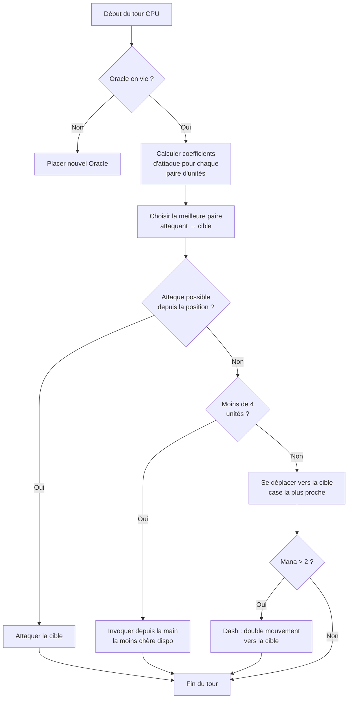

## AI Nhảm Nhí Của Tôi Cho Nausicaa

Có những dự án bắt đầu bằng "ơ hay mình làm game cờ với thần thoại nhỉ?" và kết thúc bằng một thứ có AI tự quyết định siêu tham số của chính nó mỗi 5 lượt.

Nausicaa là thế đấy. Một game chiến thuật theo lượt nơi bạn xây dựng bộ bài sinh vật thần thoại, quản lý mana, triển khai quân lên bàn cờ 10x8. Và có một AI bị rối loạn đa nhân cách.

Tôi đã dành kha khá thời gian cho cái AI này, và kết quả thì khá là mất kiểm soát xD

## Game thực sự ra sao

Trước khi nói về bộ não, cần hiểu cơ thể đã:

- Bàn cờ 10x8, vùng triển khai 2 hàng mỗi người chơi
- Mana bắt đầu ở 1, +1 mỗi lượt, tối đa 6. Bạn tiêu để triệu hồi, tấn công, dùng kỹ năng
- Mục tiêu: hạ Oracle của đối thủ

12 đơn vị, chi phí và pattern di chuyển khác nhau:

| Unit | Cost | Movement | HP |
| --- | --- | --- | --- |
| Oracle | 0 | Vua (8 hướng) | 1 |
| Gobelin | 1 | Tiến 3 ô | 1 |
| Harpie | 1 | Vua (8 hướng) | 1 |
| Naïade | 1 | Chéo | 1 |
| Griffin | 2 | Nhảy 2 ô | 2 |
| Sirène | 2 | Ngang | 1 |
| Centaure | 2 | Mã (hình chữ L) | 2 |
| Archer | 3 | Ngang | 1 |
| Phénix | 3 | Chéo (ô tối) | 1 |
| Métamorphe | 4 | Đổi chỗ | 1 |
| Voyant | 4 | Không (sinh mana) | 1 |
| Titan | 6 | Hạn chế (tấn công vùng) | 3 |

Mỗi đơn vị có pattern tấn công riêng. Sirène đánh 4 đường chéo, Archer đánh xa 3 ô, Titan phá hủy mọi thứ xung quanh khi triệu hồi. Nói chung là cờ với thần thoại và xây bài xD

## Cách tôi làm cho CPU suy nghĩ

Ý tưởng cơ bản thì ngu một cách đơn giản: **mỗi đơn vị địch có một hệ số hấp dẫn**. Càng nguy hiểm, AI càng muốn xử lý nó.

```javascript
const UNITS_ATTRACTIVENESS = {
    "oracle": 100,
    "titan": 95,
    "shapeshifter": 90,
    "phoenix": 80,
    "siren": 70,
    "archer": 70,
    "seer": 70,
    "griffin": 60,
    "centaur": 60,
    "harpy": 50,
    "naiad": 30,
    "gobelin": 20
};
```

Oracle 100 -- hợp lý, đấy là điều kiện thắng. Titan 95 vì nó one-shot mọi thứ bên cạnh khi triệu hồi. Gobelin 20, chỉ là lính quèn, kệ mẹ nó.

Sau đó với mỗi cặp đơn vị (một đồng minh, một địch), tôi tính:

```
interet = attractivite × coeff_attract / (distance × coeff_dist)
```

Nói chung: mày càng nguy hiểm và càng gần, AI càng muốn đập mày.

```javascript
calculateAttackCoefficient(x1, y1, x2, y2) {
    const distance = this.calculateEuclideanDistance(x1, y1, x2, y2);
    if (distance === 0) return Infinity;
    return (UNITS_ATTRACTIVENESS[unit.type] * COEFFICIENTS_IMPORTANCE["attractiveness"]) / distance;
}
```

### Chiêu trò đổi hệ số

Cái hay là các hệ số quan trọng **thay đổi ngẫu nhiên mỗi 5 lượt**.

```javascript
if (this.turnCount % 5 === 0) {
    const distanceCoefficient = parseInt(Math.random() * 100);
    const attractivenessCoefficient = parseInt(Math.random() * 100);
    this.regulateImportanceCoefficients({
        distance: distanceCoefficient,
        attractiveness: attractivenessCoefficient
    });
}
```

Lúc thì AI cực kỳ hung hãn (attract 95, distance 5), nó xông qua mọi thứ để hạ Oracle của mày. Lúc sau nó ưu tiên khoảng cách và tự reposition.

Cái này lấy cảm hứng từ bóng ma Pac-Man -- Blinky rượt đuổi, Pinky phục kích. Ở đây AI đổi "tính cách" mỗi pha.

**Kết quả: không thể đoán được AI trong cả ván đấu.** CPU không bao giờ chơi hai trận giống nhau.

### Oracle là đồ nhát

Oracle địch chạy trốn. Theo nghĩa đen.

```javascript
const awayFromTarget = {
    row: Math.max(0, Math.min(7, botUnitElement.row + (botUnitElement.row - targetUnitElement.row))),
    col: Math.max(0, Math.min(9, botUnitElement.col + (botUnitElement.col - targetUnitElement.col)))
};
```

Nó tính hướng ngược lại với mối đe dọa và chuồn. Nếu gặp tường, nó tìm ô trống gần nhất theo hướng đó.

Mày mất 3 lượt tiếp cận Oracle, và thế là nó chạy mất dép xD

### Vòng lặp quyết định

Đây là cách AI quyết định:

1. Nếu mất Oracle (chết), đặt một Oracle mới
2. Tính hệ số cho mỗi cặp đơn vị đồng minh → đơn vị địch
3. Chọn cặp tốt nhất
4. Nếu đơn vị có thể tấn công mục tiêu từ vị trí hiện tại → tấn công
5. Nếu có ít hơn 4 đơn vị → triệu hồi đơn vị rẻ nhất có sẵn từ tay bài
6. Nếu không, di chuyển về phía mục tiêu (ô di chuyển gần địch nhất)
7. Nếu đủ mana (> 2), dash (di chuyển đôi) để tiến gần hơn
8. Nếu đơn vị là Oracle → chạy trốn



```javascript
async makeAction(dash=false) {
    // tout ça en séquence
    // le CPU dash si il a assez de mana
    if(botPlayer.mana > 2) {
        this.makeAction(true);
    }
}
```

### Tại sao lại là khoảng cách Euclid

Tôi dùng khoảng cách Euclid:

```javascript
calculateEuclideanDistance(x1, y1, x2, y2) {
    const deltaX = Math.pow(x1 - x2, 2);
    const deltaY = Math.pow(y1 - y2, 2);
    return Math.sqrt(deltaX + deltaY) * COEFFICIENTS_IMPORTANCE["distance"];
}
```

Sao không dùng Manhattan? Vì các đơn vị có pattern di chuyển đa dạng (chữ L như mã, chéo, v.v.). Khoảng cách đường chim bay là xấp xỉ nguy hiểm tốt hơn.

## Sao không dùng minimax

Tôi có thể code minimax cổ điển. Nhưng với 12 loại đơn vị, pattern di chuyển khác nhau, kỹ năng đặc biệt... cây trò chơi nổ tung nhanh đến mức không chơi được. Cách tiếp cận heuristic đưa ra lựa chọn thông minh mà không cần thám hiểm 10 triệu trạng thái.

## Cái hay

Hệ thống hấp dẫn tạo ra những tình huống khó xử hài hước:

- Voyant (70) sinh mana. Nếu để nó sống, đối thủ có thêm tài nguyên. Nhưng Titan (95) thì nguy hiểm hơn nhiều.
- Métamorphe (90) có thể đổi chỗ với bất kỳ đơn vị nào. Nó có thể cướp Oracle của mày.
- Harpie (50) có đòn tấn công nổ giết luôn chính nó. Không ưu tiên... cho đến khi nó đứng cạnh 3 đơn vị của mày.

AI đánh giá nguy hiểm tổng thể dựa trên vị trí, không chỉ stats thô.

Cũng có hàm `activateSimulation()` để test kịch bản mà không cần chơi lại cả ván:

```javascript
activateSimulation() {
    // Place des unités spécifiques sur le plateau
    // Utile pour debugger l'IA
    this.game.board = simulation.board;
    this.game.players = simulation.players;
}
```

## Còn thiếu

Nếu có thêm thời gian:

- AI chỉ phản ứng với trạng thái hiện tại, không dự đoán người chơi sẽ làm gì
- Nó không lên kế hoạch cho tay bài nhiều lượt
- Métamorphe và Centaure có kỹ năng mà AI khai thác chưa hết
- Học tăng cường: cho nó tự đấu với chính mình để tinh chỉnh hệ số

Nhưng với game trên trình duyệt thì thế là đủ. Bạn bè tôi vẫn thua được, thế là ổn xD

## Thử nghiệm

Có sẵn tại [nausicaa-game.github.io](https://nausicaa-game.github.io/). Bấm "JOUER", bật CPU mode ON, và xem AI làm việc.

Lời khuyên: để AI tự đấu với nhau. Mày sẽ thấy những pha hung hãn, rồi phút sau nó lùi hết.

Code trên [GitHub](https://github.com/nausicaa-game/nausicaa-game.github.io) trong `js/cpu.js`.

**3 điều chính:**

1. **Hệ số heuristic** -- không minimax, mỗi đơn vị có độ hấp dẫn
2. **Hệ số thay đổi mỗi 5 lượt** -- AI chuyển giữa hung hãn và kiểm soát, kiểu Pac-Man
3. **Oracle chạy trốn** -- nó tính hướng ngược lại với mối đe dọa và chuồn

Nếu có ý tưởng làm AI đểu hơn nữa, hãy mở issue. Tôi có kế hoạch cho một phiên bản tự học từ thất bại, nhưng để bài sau nhé xD
