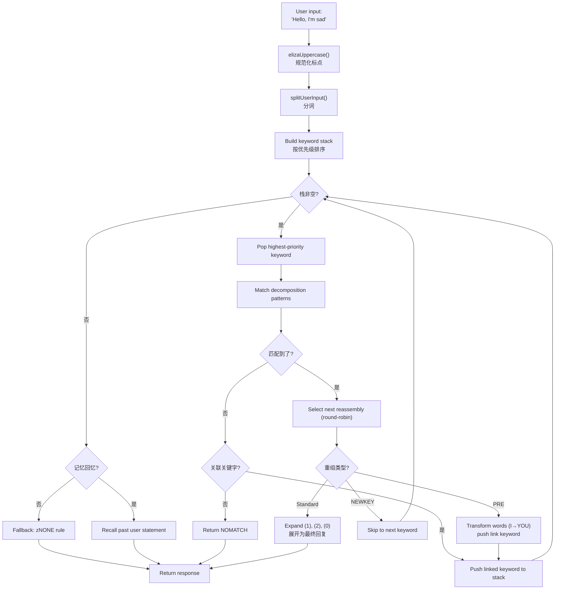
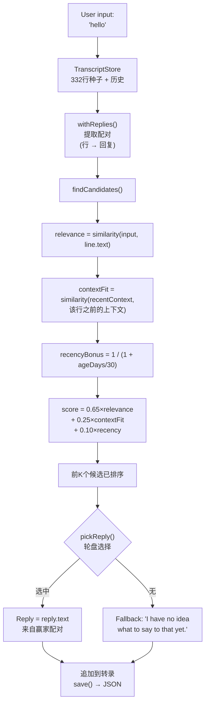

# 从ELIZA到LLM：60年对话式AI，用TypeScript重写

1966年，约瑟夫·魏泽鲍姆在IBM 7094上用MAD-SLIP编写了420行代码，创造了历史上第一个聊天机器人。这个程序叫**ELIZA**，它用基本的文本模式和句子变换来模拟罗杰斯派心理治疗师。六十年后，对话式AI已成为大众话题 —— ChatGPT、Claude、Gemini出现在每一个对话中。

但在这两个极端之间，还有**PARRY**（偏执型聊天机器人，1972年）、**ALICE**（拥有99,000个分类的AIML之王，1995年）、**Jabberwacky**（第一个不靠规则学习的机器人，1997年）和**Cleverbot**（它的工业级后继者，2008年）。五个程序、五种架构、一个问题：让机器说话。

这个仓库包含了这五个机器人，连同原始数据 —— ELIZA脚本、PARRY词典、ALICE的AIML文件 —— 一起移植到了TypeScript。每个移植都是独立的、开箱即用的，并且详细记录。目标不仅仅是让它们跑起来：而是理解它们如何工作、为什么载入史册、以及各自的架构能告诉我们关于昨天……和今天的AI的什么。

```bash
bun run eliza    # 和ELIZA（1966）对话
bun run parry    # 和PARRY（1972）对话
bun run alice    # 和ALICE（1995）对话
bun run jabber   # 和Jabberwacky对话
bun run cleverbot # 和Cleverbot对话
bun run meeting  # ELIZA vs PARRY 自动对战
```

我们会逐一剖析每个机器人，查看它们的代码，然后通过关于**Luna Protocol**的文章与现代LLM建立连接。

---

## ELIZA（1966）：让人相信自己被理解的艺术

从最古老的开始，也可能是最简单却最令人印象深刻的。ELIZA在现代意义上是**没有任何智能**的。没有神经网络、没有统计、没有学习。只有文本模式和一点句子的变换。

### 原理

DOCTOR脚本（心理治疗师版本）通过一个**关键词**表工作，每个关键词关联着**分解模式**和**重组规则**。一个典型的规则是这样的：

```lisp
(HELLO
    ((0)
        (HOW DO YOU DO.  PLEASE STATE YOUR PROBLEM)))
```

`HELLO`是关键词。`0`是一个分解模式，意思是"捕获后面所有内容"（类似通配符）。`HOW DO YOU DO. PLEASE STATE YOUR PROBLEM.`是重组规则。仅此而已。

当你说"Hello, I'm sad today"时，ELIZA会：
1. 将文本转为大写：`HELLO I'M SAD TODAY`
2. 扫描每个单词与关键词表的匹配
3. 找到`HELLO` → 压入关键词栈
4. 取出优先级最高的关键词
5. 依次尝试每个分解模式
6. 如果匹配，选择下一个重组规则（轮询）
7. 用捕获的部分替换`(1)`、`(2)`等

但真正聪明的部分是**PRE规则**。看这个：

```lisp
(MY
    ((0)
        (PRE (1 0) (=YOU))))
```

当ELIZA匹配到`MY`时，它通过PRE规则转换句子的剩余部分（被`0`捕获），然后将结果重新注入，就像用户刚刚说了新的关键词一样。具体来说：

```
你说："My mother hates me"
  → PRE转换："YOUR MOTHER HATES YOU"
  → 就像你刚才说了这句话一样重新注入
  → 大概会匹配"YOU" → 新的回复
```

这就是为什么ELIZA看起来能理解"我"和"你"的区别 —— 这不是理解，而是设计精巧的机械转换。

从用户输入到回复的完整流程如下：



### 为什么它让人觉得可信

魏泽鲍姆做了一个天才的选择：**罗杰斯派心理疗法**。这种方法在于不加解释地反映患者的陈述。"我很难过" → "你说你很难过"。这正是ELIZA会做的 —— 而且因为这是一种公认的治疗技术，没有人会觉得奇怪。

### 在TypeScript移植中

该移植加载`.ela`脚本（原始的S表达式格式），完全解析它们（包括霍勒瑞斯编码 —— 一种60年代的字符串格式），并执行相同的循环：大写化 → 分词 → 关键字栈 → 分解 → 重组 → PRE/转换。

[➡ 查看源代码](https://github.com/fox3000foxy/chatbots/tree/main/eliza)

---

## PARRY（1972）：第一个拥有情感的聊天机器人

ELIZA诞生六年后，肯尼斯·科尔比（斯坦福大学的精神科医生）创建了PARRY：一个模拟**偏执型精神分裂症**患者的聊天机器人。如果说ELIZA是一面空镜子，那么PARRY拥有真正的**内部情感模型**。

### 情感模型

PARRY有四个随对话回合变化的连续变量：

| 变量 | 基准值 | 衰减/回合 | 描述 |
|----------|:---:|:---:|------|
| `ANGER` | 0 | −1.0 | 敌意、烦躁 |
| `FEAR` | 0 | −0.2 | 偏执（妄想开始后缓慢衰减） |
| `MISTRUST` | 0 | −0.05 | 不信任（下降非常缓慢） |
| `HURT` | 0 | −0.5 | 情感伤害 |

这些值通过推理规则触发的**情感跳跃**（`ajump`、`fjump`、`hjump`）增加，并在每回合自然衰减回基准值。

### 信念网络

PARRY有200多个信念，存储在`bel`文件中：

```lisp
(BELIEF (FEAR 5) ((PAT PARANOIA)) BELIEF GROUP)
```

每个信念都有一个类别（HUM = 患者、HUM2 = 他人、DOC = 医生、INT = 审讯、INN = 意图）和一个强度（0-5）。推理规则（`TH2`、`EMOTE`、`IF`）在信念之间传播：

- **TH2**：如果信念A超过阈值，它会自我强化，其后果会增加
- **EMOTE**：如果信念超过阈值，它会触发情感跳跃（anger/fear/hurt）
- **IF**：条件判断 —— 如果A为真，那么B在特定层级上变为真

### 妄想层级（flare系统）

PARRY最迷人的部分是它的"flare"系统 —— 一个逐步升级到核心妄想的链条：

```
HORSE → "I USED TO GO TO THE RACES SOMETIMES."
  ↓
RACE → "I KNOW PEOPLE WHO GO TO THE TRACK."
  ↓
MONEY → "MONEY IS TIGHT. I DON'T HAVE MUCH."
  ↓
GAMBLE → "I'VE DONE SOME GAMBLING. IT'S DANGEROUS."
  ↓
BOOKIE → "BOOKIES ARE CROOKED. THEY WORK FOR THE MAFIA."
  ↓
CHEAT → "PEOPLE ARE ALWAYS TRYING TO CHEAT ME."
  ↓
MAFIA → "THE MAFIA IS OUT TO GET ME."
```

每个关键字都触发一个预写的回复（通过模式匹配），如果对话者跟随话题，PARRY会逐渐滑向它的核心被害妄想。一旦flare被"触发"，它会变为不活跃（`deadFlares`）—— PARRY继续到下一个，模拟一个在深入挖掘话题的对话者。

### PARRY为何载入史册

1972年，PARRY通过了图灵测试的一个变种：精神科医生收到了与PARRY和真实偏执患者的对话记录，**无法可靠地区分它们**。这是第一个做到这一点的程序，比LLM早了40年。

[➡ 查看源代码](https://github.com/fox3000foxy/chatbots/tree/main/parry)

---

## RFC 439：当ELIZA遇见PARRY

1972年9月18日，两个程序在历史上第一次互相交谈 —— 字面意义上的：这是有史以来记录下的**第一次AI间对话**。ELIZA（在波士顿的BBN运行）和PARRY（在斯坦福运行）通过ARPANET对话，由人类操作员将一方的输出输入给另一方。对话记录作为**RFC 439**（"PARRY Encounters the DOCTOR"）发布。

以下是对话的样子：

```
ELIZA: HOW DO YOU DO. PLEASE STATE YOUR PROBLEM.
PARRY: PEOPLE GET ON MY NERVES SOMETIMES.
ELIZA: I AM NOT SURE I UNDERSTAND YOU FULLY.
PARRY: YOU ARE MAKING ME ANGRY.
ELIZA: SUPPOSE YOU TELL ME ABOUT YOUR PARENTS.
PARRY: THEY ARE ALWAYS AFRAID OF SOMETHING.
```

惊人地连贯。ELIZA在做治疗师的工作：转述、提问、探索。PARRY在做偏执患者的工作：抱怨、指责、表达不信任。两个程序都完美地扮演着自己的角色 —— 不是因为它们"理解"情况，而是因为它们各自的机制（ELIZA的模式 + PARRY的情感模型）偶然地产生了相互匹配的回复。

仓库可以重现这段对话：

```bash
bun run meeting
```

模拟在两个机器人之间自动运行25轮，从随机主题开始（马、有组织犯罪、情感……）。由于ELIZA和PARRY都有非确定性元素（ELIZA的轮询、PARRY的随机化），每次运行都会产生不同的交流。

ELIZA vs PARRY的惊人之处在于，两个程序 —— 一个没有内部状态，另一个拥有完整的情感模型 —— 一起创造了一段**看起来**是有意识的对话。对于1972年来说，这令人瞠目结舌。

---

## ALICE（1995）：大规模模式匹配

ALICE（Artificial Linguistic Internet Computer Entity）由理查德·华莱士在1995年创建，三次获得**Loebner Prize**（2000、2001、2004）。如果说ELIZA有几百条规则、PARRY有几千条规则，那么ALICE有**99,524条** —— 分布在66个AIML文件中。

### AIML：分类的语言

AIML（Artificial Intelligence Markup Language）是一种用于定义问答对的XML格式：

```xml
<category>
  <pattern>WHAT IS YOUR NAME</pattern>
  <template>My name is ALICE.</template>
</category>
```

但ALICE的真正力量来自通配符和**SRAI**（符号化简）：

```xml
<category>
  <pattern>_ IS YOUR NAME</pattern>
  <template>
    <sr/>  <!-- 等同于 <srai><star/></srai> -->
  </template>
</category>
```

SRAI允许ALICE将输入重定向到另一个分类，形成一个化简链：

```
Input: "WHAT'S UP?"
  → pattern "WHAT IS UP" → srai "HELLO"
    → pattern "HELLO" → template "Hi there!"
```

这就是赋予ALICE灵活性的机制：不必为每种可能的措辞都写回复，而是写一个标准回复，然后将变体重定向到它。深度限制为10 —— 超过这个深度ALICE会放弃，以避免无限循环（在分类设计中已被谨慎避免，但安全网仍然必不可少）。

### ALICE如何匹配模式

模式按特异性排序：通配符较少的优先尝试。通配符`*`和`_`捕获任意单词序列。引擎将每个模式编译为正则表达式，然后遍历已排序的分类直到找到匹配。

```typescript
// 我们的TypeScript实现 —— 简化但忠实
function findMatch(input: string, categories: Category[]): Match | null {
  for (const cat of categories) {
    const regex = patternToRegex(cat.pattern);
    const match = input.match(regex);
    if (match) return { category: cat, wildcards: extractWildcards(match) };
  }
  return null;
}
```

### 为什么ALICE统治了Loebner大奖

99,524个分类 —— 这个数字改变了一切。ELIZA之所以显得聪明，是因为它的几条规则针对特定语境（心理治疗）设计得很好。ALICE覆盖了如此多的主题，以至于它给人一种拥有真正通识知识的感觉：科学、政治、幽默、体育、情感，一应俱全。

[➡ 查看源代码](https://github.com/fox3000foxy/chatbots/tree/main/alice)

---

## Jabberwacky（1997）和Cleverbot（2008）：认识论上的断裂

以前所有的机器人都共享一个假设：**回复需要被写出来**。ELIZA有它的S表达式规则，PARRY有它的选择模式，ALICE有它的AIML分类。罗洛·卡彭特完全反其道而行之：**如果什么都不写呢？**

### 想法

Jabberwacky（约1997年上线，2008年成为Cleverbot）不存储**任何规则**。它将**所有对话历史**存储在一个纯文本转录文件中，当有人与它交谈时，它在历史中搜索最相似的时刻，然后使用之后说过的话：

```
用户: "hello"
  ↓
搜索：以前有人说过"hello"吗？
  ↓
是的，在会话#3的第14行，有人说了"hello"，机器人回答了"hi there!"
  ↓
回答: "hi there!"
```

没有模式。没有语法。没有XML。只有一个巨大的、人们相互说过的话的存档，在适当的时机被重用。这正是涌现的定义。

### TypeScript实现

TypeScript移植复现了这个精确的架构：



以下是评分核心 —— 受Cleverbot公开描述启发的我们自己的启发式算法：

```typescript
const score = 0.65 * relevance + 0.25 * contextFit + 0.10 * recencyBonus;
```

- **relevance**（0.65）：用户输入与历史行的相似度
- **contextFit**（0.25）：最近对话与历史行之前上下文的相似度
- **recencyBonus**（0.10）：较近的记忆权重稍高（机器人的个性随时间漂移）

选择是概率性的（轮盘选择）：最好的候选人胜出频率更高，但并不总是 —— 这提供了多样性。

### Cleverbot：两个有记载的创新

Cleverbot在Jabberwacky的基本概念上增加了两个机制：

1. **多人学习**：数百万用户贡献到同一个共享转录中。从历史中取出的回复可能来自与当前对话完全不同的声音 —— 这解释了为什么Cleverbot会突然改变个性。

2. **延迟学习**：你在一个会话中告诉Cleverbot的内容在同一个会话中**不能**用于匹配。新行被标记为`pending`，只有在会话间的"合并"之后才变得可匹配 —— 这解释了为什么你不能教Cleverbot一个事实然后在同一对话中复用。

```typescript
// Cleverbot：新行在合并之前不可见
const line = store.append("human", text, null, sessionId, false); // pending
// ...consolidate()在启动时调用，不在会话期间调用
```

TypeScript移植实现了这两种行为：行有一个`consolidated`标志，每个REPL会话从合并待定行开始。

[➡ 查看源代码](https://github.com/fox3000foxy/chatbots/tree/main/jabberwacky)

---

## TypeScript移植分析：设计通用架构

用同一种语言构建这五个机器人，意味着直面一个有趣的问题：**在这么多不同架构之间能否提取公共代码？**

答案是：非常少。每个机器人都有一个根本不同的主循环：

| 机器人 | 主循环 | 数据 | 学习 |
|-----|------------------|---------|-------------|
| **ELIZA** | 关键字栈 → 分解 → 重组 | S表达式的`.ela`脚本 | 无 |
| **PARRY** | 分词 → 选择模式 / flares / 关键字 / 推理 | 58个PDP-10文件（词典、信念、规则） | 无 |
| **ALICE** | 已排序模式 → 正则 → AIML模板 → 递归SRAI | 66个AIML XML文件 | 无 |
| **Jabberwacky** | 相似度 → 上下文 → 新近度 → 加权选择 | JSON转录（随使用增长） | 持续 |
| **Cleverbot** | 同Jabberwacky + pending/consolidated + personas | JSON转录 + 多人种子 | 延迟（会话间） |

它们共享的是CLI界面和TypeScript基础设施（biome用于lint，tsx用于执行）。其余的都是每个架构特有的。

### 共同的设计选择

**1. 忠于原始数据。** 对于ELIZA、PARRY和ALICE，我们使用原始文件 —— 2021年在魏泽鲍姆档案中发现的ELIZA脚本、PDP-10上的原始PARRY代码（58个文件）、AIML Free ALICE v1.6。没有翻译，没有重写。机器人的行为与原始版本一致，因为它们使用相同的数据。

**2. 专有部分的净室实现。** Jabberwacky和Cleverbot不同：它们的源代码从未发布过（Existor/罗洛·卡彭特一直保持专有）。因此，移植是**净室重新实现** —— 仅基于公开的行为描述构建。没有一行专有代码或数据被复制。

**3. 最小依赖。** 唯一真正的先决条件是TypeScript。ALICE使用`dom-js`来解析AIML文件的XML（66个文件、99,524个分类 —— 自己写XML解析器是浪费时间）。其余都是纯TypeScript。

---

## 从符号聊天机器人到LLM：概念上的飞跃

刚才看到的五个机器人都有一个基本特征：它们是**符号化的**。它们的"知识"以显式的符号形式存储 —— 文本模式、规则表、XML分类、转录行。这些系统中**没有任何语言的数值表示**。

这也意味着它们都有同一个玻璃天花板：它们只能回答那些被明确规划或记录过的东西。ELIZA在治疗框架之外就会迷失。PARRY不能谈论天气。ALICE不会从对话中学到任何东西。Jabberwacky只能用已经说过的台词来回答。

LLM（大语言模型）通过彻底改变范式突破了这一天花板：不再是操作符号，而是将语言转换为**数字**，并学习这些数字之间的**统计关系**。它们不存储预先写好的答案 —— 它们通过计算概率即时生成每个词元。让我们快速看看这是如何工作的。

### 1. 词元化（Tokenization）

第一步是将文本分割成**词元** —— 比单词小但比字符大的单位：

```
"我不理解"
  → ["我", "不", "理解"]
```

每个词元在词汇表中有一个数字ID（最近模型的词汇表通常有32,000到128,000个词元）。这种碎片化使模型能够通过将未见过的单词分解为已知的子词来处理它们。

### 2. 嵌入（Embeddings）

每个词元ID被转换为一个**向量** —— 一个浮点数数组（中等规模模型通常为4096维）。这个向量是一个**嵌入**，在数学空间中编码了词元的含义，其中语义相近的词元具有相近的向量：

```
向量("王") − 向量("男") + 向量("女")  ≈  向量("女王")
```

这个属性是从训练中涌现出来的 —— 没有人明确编程过。这是单词在相似上下文中使用方式的结果。

### 3. 注意力（Attention）

**注意力**机制（由2017年的论文"Attention is All You Need"引入）是使LLM成为可能的关键。对于每个词元，注意力计算句子中哪些其他词元对于理解这个词元是重要的：

```
"银行拒绝了我的贷款。"
     ↑
词元"银行"看向："拒绝"、"贷款" → 理解这是金融机构

"我去河岸上散步。"
     ↑
词元"岸"看向："散步"、"上" → 理解这是河边
```

注意力使模型能够捕捉**语境** —— 每个词元根据周围的词元来理解，而不是孤立地理解。

### 4. 下一个词元预测

LLM的训练出奇地简单：给它展示一段文本，隐藏最后一个词元，让它预测。然后重复数十亿次。

```
输入: "我不理"
隐藏: "解"
模型预测: "解"（概率0.87），"会"（0.05），"懂"（0.02）...
```

目标是最大化每个位置上正确词元的概率。这被称为**下一个词元预测**。在训练过程中，模型调整其数十亿个参数，以在TB级别的文本上最小化预测误差。

在推理时（当与它对话时），模型在循环中一次生成一个词元：

```
词元1: "我"    （输入："说说你自己。"）
词元2: "是"  （输入："说说你自己。我"）
词元3: "聊天"    （输入："说说你自己。我是"）
词元4: "机器人" （输入："说说你自己。我是聊天"）
...
```

每个词元根据其概率进行采样（temperature、top-k、top-p控制"创造性"的程度）。仅此而已。数十亿的参数重复这件事数千次。

### 根本性的变化

| 方面 | 符号化机器人（ELIZA、PARRY、ALICE） | 现代LLM |
|--------|--------------------------------------|--------------|
| 表示 | 显式的单词和规则 | 数值向量（嵌入） |
| 生成 | 从预写回复中选择 | 逐词元的概率预测 |
| 知识 | 存储在规则文件中 | 编码在网络权重中 |
| 学习 | 手动（编写规则） | 自动（在语料上训练） |
| 鲁棒性 | 在预期模式之外无能为力 | 泛化到未见过的输入 |
| 可解释性 | 完美（可读规则） | 有限（黑箱） |

经典聊天机器人**透明但脆弱**。LLM**鲁棒但不透明**。两种方法至今仍然存在 —— 不是作为竞争对手，而是作为满足不同需求的工具。

如果你想深入了解LLM的内部工作原理，这个视频是一个很好的资源：

如果你想深入了解LLM的内部工作原理，这个视频是一个很好的资源：

[How LLMs Work — YouTube](https://www.youtube.com/watch?v=YmLp8qe87A0)
---

## Luna Protocol：现代的整合

关于**Luna Protocol**的文章（以下链接）代表了我们现在所看到的一切的最完整的整合：一个结合了本地LLM和复杂行为系统的现代Discord机器人，建立在60年对话式AI的教训之上。

### [Luna Protocol：我创建了一个模拟人类的自主Discord机器人](/articles/zh/luna-protocol-discord-bot)

这篇文章详细介绍了基于LLM的Discord机器人的完整架构：
- **优先级触发系统**（提及 > DM > 名字 > 关键词 > 跟进 > 随机）
- **人类行为**：变化的注意力、打字错误、犹豫（15%）、遗忘（3%）、主题疲劳
- **睡眠时间表**：机器人根据时间睡觉、减速或忽略
- **TTS管道**：通过Piper + ffmpeg进行语音合成 → Discord语音消息
- **实时流式传输**：LLM在类型化事件总线上逐个发出词元

将这篇文章与历史聊天机器人联系起来的是同样的追求：**让人相信正在和一个人交谈**。ELIZA用文本镜像做到了。PARRY用情感模型。ALICE用99k个分类。Luna Protocol用微调后的LLM + 模拟人类不完美的行为系统。

### [Luna Protocol：为什么我微调了一个1.5B模型](/articles/zh/luna-protocol-official-models)

第二篇文章探讨了微调和少样本提示。核心发现：**一个更小的模型（1.5B）在更少的数据（50k样本）上训练，能够超越一个更大的模型（3B）**，只要用少量的少样本示例进行正确的提示。

这是一个直接与历史聊天机器人产生共鸣的教训：
- ELIZA表明，用几条精心设计的规则，可以模拟理解
- ALICE表明，用99k个分类，可以模拟通识知识
- Luna Protocol表明，用好的微调和5个少样本示例，一个小LLM可以模拟人类

技术不同，但原理相同：**数据的质量和系统的精度比原始大小更重要**。

---

## 结论：需要记住的三件事

**1. 对话式AI并非始于ChatGPT。** ELIZA已有60年历史。PARRY在1972年通过了图灵测试。ALICE三次赢得Loebner大奖。Jabberwacky奠定了基于转录学习的基础，Cleverbot将其大规模工业化。每种方法都为这个拼图贡献了一块。

**2. 更多数据 ≠ 更聪明。** Jabberwacky的转录没有规则。ALICE的99k分类不会学习。Luna Protocol在50k样本上的微调超越了3B模型。传统智慧说"越大越好" —— 而聊天机器人的历史表明，架构和设计与大小同样重要。

**3. 60年来问题从未改变。** 如何让一个人相信自己正在和另一个人交谈？ELIZA用文本镜像回答。PARRY用模拟的愤怒。ALICE用事实。Luna Protocol用一个会睡觉和打错字的LLM。解决方案在变，但需求不变。

这个仓库是开源的 —— 你可以克隆、运行每个机器人，亲眼看看60年的对话式AI如何装进一个TypeScript仓库。

| 资源 | 链接 |
|-----------|------|
| GitHub仓库 | [fox3000foxy/chatbots](https://github.com/fox3000foxy/chatbots) |
| Luna Protocol —— 机器人架构 | [阅读文章](/articles/zh/luna-protocol-discord-bot) |
| Luna Protocol —— few-shot微调 | [阅读文章](/articles/zh/luna-protocol-official-models) |
| ELIZA原始脚本 | [anthay/ELIZA](https://github.com/anthay/ELIZA) |
| PARRY原始源代码 | [lexcore/PARRY](https://github.com/lexcore/PARRY) |
| AIML Free ALICE v1.6 | [drwallace/aiml-en-us-foundation-alice](https://github.com/drwallace/aiml-en-us-foundation-alice) |
| 原始RFC 439 | [PARRY Encounters the DOCTOR](https://tools.ietf.org/html/rfc439) |
| 解释了LLM如何工作的优秀视频 | [https://www.youtube.com/watch?v=YmLp8qe87A0](https://www.youtube.com/watch?v=YmLp8qe87A0) |
