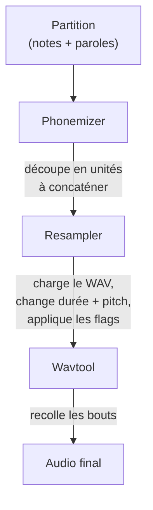

## UTAU：一个VB6软件如何让人人都能玩合成音声

我在主页提过一嘴：我喜欢UTAU。这会儿来展开说说。

2008年，你想让合成声音唱歌，只有一个选择：VOCALOID。Yamaha家的。贵，闭源，官方声库你没法自己造。

然后有个日本老哥，Ameya/Ayame，自己捣鼓了个东西出来。用 **Visual Basic 6** 写的。免费。让你拿自己录的 WAV 文件就能做自己的声库。

这玩意儿叫 **UTAU**（歌う，日语"唱歌"的意思）。在那个年代，这就是魔法。

我一直觉得这软件特屌。不是因为技术多优雅（剧透：其实一点都不优雅，你能想象这玩意的屎山代码吗……我对着这只鸡哭），而是因为它做到了一件没人做到的事：把语音合成交给了大众。就是你，我，随便谁有个麦克风就行。

让我给你讲讲为什么这玩意儿那么牛逼。

---

## 先说为啥唱歌合成这么难

人声唱歌不是单纯音符。有辅音起头，元音保持，气息，还有两者之间的过渡。"sa"这个音，是嘶嘶的"s"滑向张开的"a"，这个滑动过程才是听起来像人的关键。

现在用深度学习搞定：训一个模型在几小时的歌声上，它就能生成声音（Synthesizer V、DiffSinger）。但那都是2020年以后的事了。2008年？想都别想。

UTAU用的是一种更老、更聪明的方法：**拼接合成**。

---

## 拼接合成：把声音碎片拼起来

思路简单到爆：录一堆声音小片段，然后像拼图一样拼起来组成单词。"salut" = 拼上"sa" + "lu" + "to" 三段样本。一个由乐谱操控的声音拼图。

就跟YouTube Poop里剪角色台词让他乱说话的原理一样----只不过这里是规整的、自动化的。

UTAU的来历其实就是这个。之前有 **"人力VOCALOID"**（人力ボーカロイド）：人们手动剪音频轨，提取音素，调音高，再在音频编辑器里重新组装，模仿VOCALOID的声音。全手动。你想想这工作量。

Ameya看不下去了，写了工具来自动化这过程。UTAU最初也就是个辅助人力VOCALOID的工具。

---

## 为啥这革命性：**你**来创造声音

这才是关键。

VOCALOID，你买的是别人的声音。Miku、Luka什么的。专业团队做、Yamaha卖。自己造不了。UTAU呢，**谁都能录自己的声音，做成会唱歌的乐器**。

最简单的CV模式就是：录日语的基本音节（"a"、"ka"、"sa"、"ta"……大概100个），设好切割点，搞定你的声库。几个小时的事。

结果：生态爆炸。社区做了成千上万个声库----粉丝的声音、朋友的声音、原创角色的声音。一整个虚拟歌手宇宙，免费。而且软件自带 **Defoko**（Utane Uta），一个通过AquesTalk TTS引擎生成的默认音源，没麦克风也能直接开搞。

---

## oto.ini：系统的核心

UTAU怎么知道在哪切、在哪拼？靠每个声库的配置文件：**`oto.ini`**。每个WAV文件定义切割点（毫秒级）：

- **Offset** → 去掉开头静音
- **Preutterance** → 辅音过渡到元音的点（"sa"里"s"→"a"的分界）
- **Overlap** → 前一个音符在多长时间内与当前重叠
- **Fixed region** → 长音时不能拉伸的部分（通常就是辅音）
- **Cutoff** → 末尾切掉的地方

**Preutterance** 是最聪明的参数。每个音节在元音前总有一段辅音。要让音符卡对拍子，应该是*元音*落在拍子上，不是辅音。所以UTAU把样本往前推："sa"的"a"落在拍上，"s"在前面溢出。就像鼓手提前挥棒让声音正好落在点上----只不过这里写在 `.ini` 里。

视觉上，以"ka"样本为例，`oto.ini` 的区域是这样的：

```mermaid
flowchart LR
    A["🔇 silence<br/>(offset)"] --> B["🅺 consonne<br/>(fixed region,<br/>pas étirée)"]
    B --> C["🅰 voyelle<br/>(zone étirable)"]
    C --> D["🔇 fin coupée<br/>(cutoff)"]
    style B fill:#3b4a6b
    style C fill:#5b3b6b
```



辅音和元音之间的分界就是preutterance。元音部分用来拉伸（长音时延长）；辅音保持原样，不然你的"k"拖两秒会难听得要命。

```ini
# oto.ini (simplifié)
# fichier=alias,offset,consonant,cutoff,preutterance,overlap
_ka.wav=ka,120,80,-200,90,40
```

每个音设五个值，所有样本配好，UTAU就能把任何单词拼得漂漂亮亮。

---

## CV、VCV、CVVC：追求更真实

基础模式 **CV**（辅音-元音）一个音节一个音。简单但有点机械感：音节之间的拼接生硬。

2010年社区发明了 **VCV**（元音-辅音-元音）。不录单独的"ka"，而是录"a ka"----带上前面元音的尾巴。过渡自然而然，因为过渡*就在录音里*，不是事后算出来的。

细思极恐：**VOCALOID到VOCALOID3（2011年）才有VCV。** 一个老哥用VB6写的免费软件在过渡自然度上领先了Yamaha一年。粉丝社区跑到了跨国公司前面。

后来还有 **CVVC**、**ARPAsing**（英语）、**VCCV**……每种方法都推动合成更真实一步，全由社区发明和记录。

---

## 完整流程：一个词如何变成声音

你放个音符输段歌词，幕后是这样的：



**Resampler** 是核心：它把你录的"ka"样本（原始音高）重新拉伸/调音以匹配想要的音符----只拉伸可拉伸的区域，辅音保持原样（这就是 `oto.ini` 的用处）。

而且它是**模块化**的。UTAU自带一个基础resampler，但社区搞出了一堆别的（moresampler、TIPS……），每个音色不同。你像换插件一样换合成引擎。2008年。一个免费软件。

---

## 引擎盖下的屎山（以及为什么反而可爱）

得说实话，这软件的技术状况：

- **用Visual Basic 6写的。** 2008年这语言就已经死了。需要VB6运行时才能跑。
- **最初只有Windows版**（Mac移植版UTAU-Synth 2011年才出）。
- **必须Shift-JIS编码。** 如果文件不是日文Shift-JIS编码，UTAU什么都读不懂。到现在还经常要切系统区域到日文或者用AppLocale才能启动。
- **界面简陋**，文档当时几乎全是日文。

然而。然而这玩意儿搞出了一个全球性运动。几万个声库。数百万播放量的歌。

最好的例子：**Kasane Teto**。2008年作为愚人节玩笑被推出来，假装是VOCALOID。就是个梗。结果大家爱上了这个角色，之后做了真正的UTAU声库，Teto成了全世界最有名的虚拟歌手之一。2023年她甚至出了官方Synthesizer V声库。一个诞生于免费软件愚人节玩笑的角色。

---

## 为什么现在还有意义

UTAU是"简陋"技术靠开放性取胜的完美例子。

VOCALOID技术更好，资金更足，更专业。但封闭。UTAU是个粗制滥造的破烂VB6玩意儿----但它允许所有人参与。创造声音、创造resampler、创造插件、创造录音方法。社区承担了剩下的一切。

这个理念到今天还活得很好。**OpenUtau**，一个现代开源接棒者，继承了UTAU的理念并做了现代化改造（跨平台、UTF-8、支持现代resampler和AI）。拼接合成在深度学习的时代依然站得住脚，因为它有一个深度学习没有的东西：你完全知道背后发生了什么，你能控制每一毫秒。

这就是我一直喜欢UTAU的原因。你清楚看到一切。不是AI给你吐个你不懂的魔法结果：你有你的WAV，你的切割点，你决定一切。听上去不对，你知道为什么并能修正。我喜欢这种掌控感。

---

**记住3点：**

1. **拼接合成 = 声音拼图** ---- UTAU把WAV小片段拼在一起组成单词。`oto.ini` 定义每个音的切和拼的位置。你控制一切，精确到毫秒，没有黑盒。
2. **开放性打败技术** ---- VOCALOID更好但封闭。UTAU很糙但让所有人能创造自己的声音。社区引爆了生态，甚至比Yamaha还先做出了VCV。
3. **好想法比烂代码活得久** ---- VB6、Shift-JIS、Windows only……但理念通过OpenUtau依然在跑。一个牛逼的技术可以用稀烂的代码写出来。

说真的，就冲Kasane Teto诞生于一个愚人节玩笑，这软件就值得尊敬 xD
