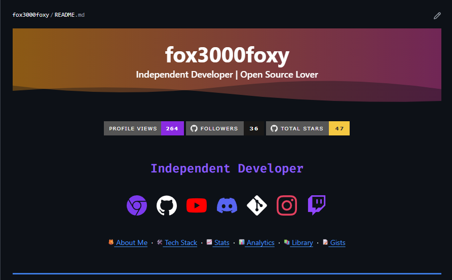
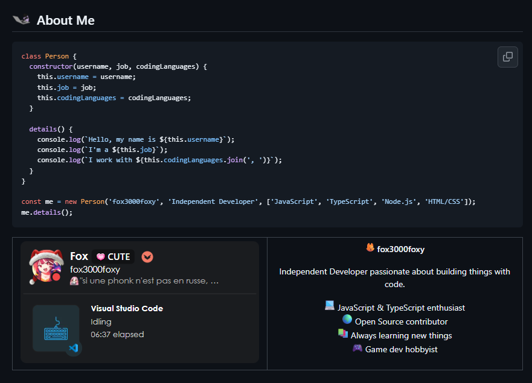
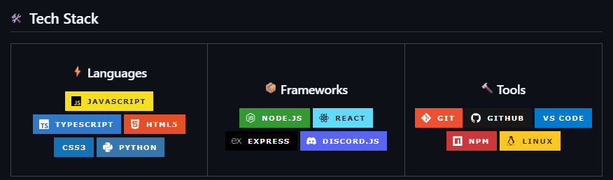
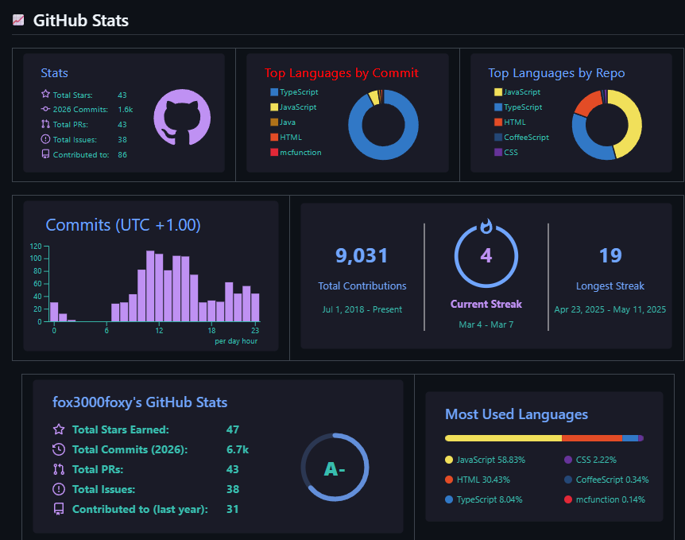
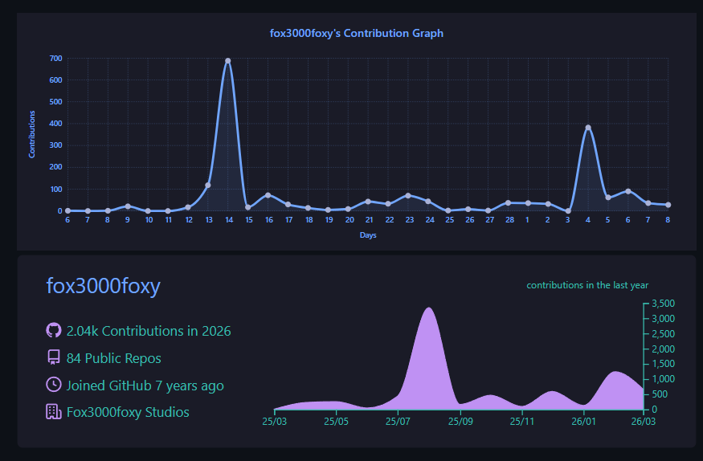
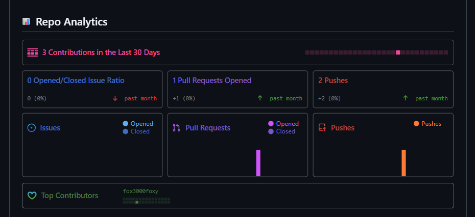
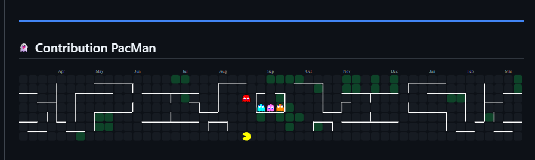
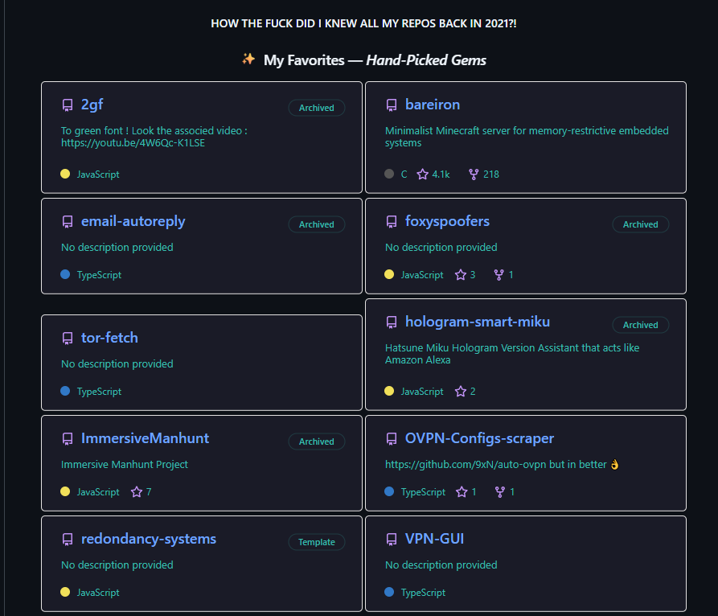

# My GitHub Profile

## Header & Links

Welcome to my GitHub profile—organized like a well-curated library.
In the first section there’s a header with links, pretty standard I’d say:

So as you can see, there are links, well that’s cool I guess, I don’t know what else to say.
## About Me

There’s also an “About me” section:

In this section you can see what I’m doing live! If you see me listening to music, that’s what it is.
I’m going to put the indicator here too:

### Live Status

## Tech Stack

This is my tech stack, which brings together the languages and tools I master:

## GitHub Statistics
Below are my GitHub statistics, which are divided into many small graphs:

### Activity & Metrics

### Contribution Heatmap
Then there are my commits playing PacMan casually xD

## Projects
Below I have all my repositories organized by category. Feel free to visit them if you're interested—just know that almost each one will have a dedicated blog post:

## To sum up

So that’s my GitHub profile, I hope you enjoyed the tour! I will probably write a blog post for each of my projects, so stay tuned for that. If you have any questions or want to collaborate on something, feel free to reach out to me on Discord or through GitHub. Thanks for visiting!