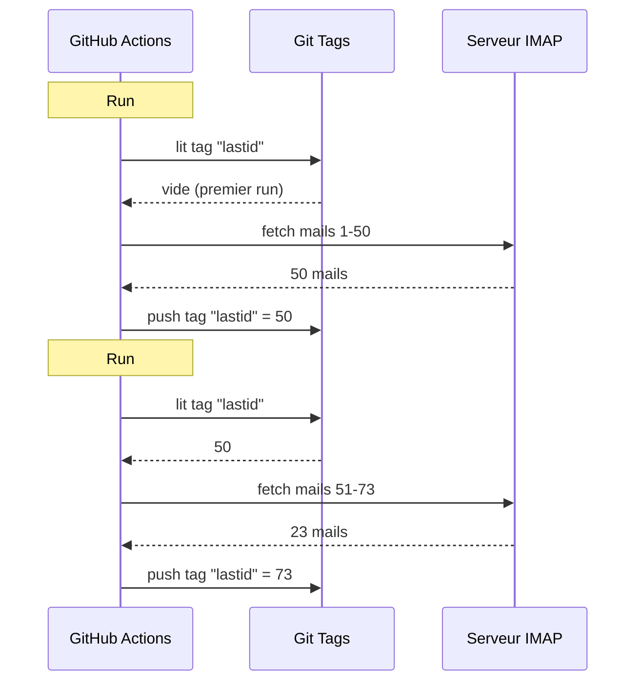

# استخدمت git كقاعدة بيانات لتشغيل بوت مجاني على GitHub Actions

عندي ردّاد بريد إلكتروني آلي يعمل 24/7.

يقرأ إيميلاتي، يفهم موضوعها، ويرد تلقائيًا بالذكاء الاصطناعي. يتذكر المحادثات السابقة. يتجاهل النشرات الإخبارية و `noreply@`. يُحيل إلى إنسان عندما يكون الموضوع ساخنًا جدًا.

التكلفة الشهرية: **0€**.

لا سيرفر. لا VPS. لا قاعدة بيانات. فقط GitHub Actions واختراق مجنون: **استخدام git كقاعدة بيانات**.

أتتوقع الفكرة؟ لا؟ حسنًا، تمسّك، إنها سخيفة وعبقرية في نفس الوقت.

---

## المشكلة: GitHub Actions بلا حالة

GitHub Actions مجاني. يمكنك تشغيل cron كل 5 دقائق، تشغيل كودك، مجانًا.

لكن فيه مشكلة: إنه **بلا حالة**.

كل تشغيلة تبدأ في آلة فارغة. لا شيء يُحفظ بين تشغيلتين. التشغيلة السابقة؟ منسية. ممسوحة. وكأنها لم تكن موجودة أبدًا.

بالنسبة لردّاد البريد الإلكتروني، هذه مشكلة ضخمة. مثل:

> "ما هو آخر إيميل قمت بمعالجته؟"

إذا نسي البوت هذا في كل تشغيلة، فإما سيعيد الرد على نفس الإيميلات مرارًا (كارثة)، أو سيفوّت بعض الإيميلات.

نحتاج إلى حالة دائمة. وعادةً، الحالة الدائمة = قاعدة بيانات. لكن قاعدة البيانات تعني سيرفر، والسيرفر لم يعد مجانيًا.

وهنا يصبح الأمر مثيرًا للاهتمام.

---

## الحل: وسم git كقاعدة بيانات

مستودع GitHub الخاص بك هو بالفعل تخزين دائم. مجاني. مُرقّم. موجود دائمًا.

إذًا لماذا لا نخزّن الحالة فيه؟

الفكرة: في كل تشغيلة، يقرأ البوت آخر UID إيميل تمت معالجته من **وسم git**. يعالج الإيميلات الجديدة. ثم يعيد دفع الوسم بالـ UID الجديد.



وسم git هو قاعدة البيانات. قيمة واحدة، لكن هذا كل ما نحتاجه.

### قراءة الحالة

في بداية المهمة، نجلب القيمة من الوسم:

```bash
git fetch origin --tags lastid || true
git show refs/tags/lastid:data/lastId > data/lastId || true
```

`git show refs/tags/lastid:data/lastId` تعني: "أعطني محتوى الملف `data/lastId` كما كان في الوسم `lastid`".

بوم. حصلت على القيمة، دون قاعدة بيانات.

### كتابة الحالة

في النهاية، نعيد إنشاء الوسم بالقيمة الجديدة:

```bash
git switch --orphan lastid-tmp   # فرع يتيم بلا تاريخ
git rm -rf .                      # نفرّغ كل شيء
mkdir -p data
printf "%s\n" "${LAST_ID_CONTENT}" > data/lastId

git add data/lastId
git commit -m "lastId snapshot"
git tag -f lastid                 # فرض الوسم على هذا الالتزام
git push --force ...origin lastid # دفع الوسم
```

ننشئ فرعًا **يتيمًا** (بلا تاريخ)، نضع فقط ملف `lastId`، نلتزم، نوسم، ندفع بقوة.

لماذا يتيم؟ لكي لا نتراكم 10,000 التزام حالة في تاريخ المستودع. كل تحديث يمسح السابق. الوسم يشير دائمًا إلى التزام واحد فقط يحتوي على قيمة واحدة فقط.

هذا نظيف. هذا مجاني. هذا مكسور تمامًا xD

---

## الاختراق الثاني: لقطة وقت التشغيل

هناك مشكلة أخرى مع GitHub Actions: `npm install`.

إذا في كل تشغيلة (كل 5 دقائق) قمت بـ `npm install` + `npm run build`، فأنت تهدر 60-90 ثانية في كل مرة. على cron متكرر، هذا دقائق من الحوسبة المُهدرة مقابل لا شيء.

الحل: تجميع الكود مسبقًا مرة واحدة، وتخزينه في وسم git أيضًا.

سير عمل البناء (الذي يعمل عندما تدفع على `master`) يفعل هذا:

```bash
# compile le code
bun install
bun run build

# stocke dist/ + node_modules/ dans un tag "runtime"
git checkout --orphan temp-runtime
git rm -rf .
cp -r "$TMPDIR"/* .
git add dist node_modules package.json bun.lock data
git commit -m "runtime build"
git tag -f runtime
git push --force ...origin runtime
```

وسم `runtime` يحتوي على الكود المترجم و `node_modules`. كل شيء جاهز للتشغيل.

أما cron فهو يسحب هذا الوسم مباشرة:

```yaml
- name: Checkout runtime snapshot
  uses: actions/checkout@v4
  with:
    ref: refs/tags/runtime    # الكود المجمّع مسبقًا، لا المصدر
    fetch-depth: 1

# pas de npm install, pas de build !
- name: Process emails
  run: node dist/index.js --action
```

لا تثبيت. لا بناء. cron يبدأ فورًا وينفذ فقط `node dist/index.js`.

يعني، لديك وسمان يقومان بمهمتين:
- `runtime` = الكود الجاهز للتشغيل (يُحدّث عندما تدفع كودًا)
- `lastid` = الحالة الدائمة (تُحدّث في كل تشغيلة)

أنيق بشكل مقرف.

---

## البوت نفسه: ردّاد آلي بالذكاء الاصطناعي

حسنًا، اختراق git رائع، لكن ماذا يفعل البوت بالضبط؟

يقرأ إيميلاتك عبر IMAP، يفهمها بالذكاء الاصطناعي (Groq + Llama 3.3 70B)، ويرد تلقائيًا.

بنية معمارية بخدمات نظيفة وحقن تبعيات (InversifyJS):

```
App
├── ImapService      → lit les mails (IMAP)
├── SmtpService      → envoie les réponses (SMTP)
├── ParserService    → parse le contenu des mails
├── ReplyService     → génère la réponse IA
├── SummaryService   → mémoire de conversation
├── AccountsService  → gère plusieurs comptes email
└── ConfigService    → config / env vars
```

### وضعيّ تشغيل

يمكن للبوت العمل بطريقتين:

**وضع المستمع (الوقت الفعلي)**: اتصال IMAP دائم مع إعادة اتصال أُسّي. لـ VPS.

```typescript
this.imapService.on("exists", async (data) => {
  console.log(`[MAIL] Nouveau mail ! Total: ${data.count}`);
  // traite le nouveau mail immédiatement
});
```

**وضع الدفعة (batch)**: يعالج الإيميلات الجديدة من `lastId`، ثم يُغلق. لـ cron GitHub Actions.

```bash
node dist/index.js --action
```

وضع `--action` هو الذي يستخدم اختراق git. يقرأ `lastId`، يعالج الجديد، يكتب `lastId` الجديد، انتهى.

### عدم الرد على البوتات

إذا رد بوتك على كل الإيميلات، فسيرد على النشرات الإخبارية والإشعارات و `noreply@`. كارثة. أسوأ: إذا رد بوتان على بعضهما البعض، يكون لديك حلقة لا نهائية من الإيميلات. الكابوس.

لذا فلترة عدوانية:

```typescript
export function isAutomatedSender(address) {
  const automatedPatterns = [
    "noreply", "no-reply", "donotreply",
    "mailer-daemon", "postmaster", "bounce",
    "newsletter", "notification", "marketing",
    "billing", "receipt", "promo", ...
  ];
  const local = address.split("@")[0].toLowerCase();
  return automatedPatterns.some(p => local.includes(p));
}
```

وكذلك كشف عبر ترويسات الإيميل:

```typescript
export function isAutomatedByHeaders(headers) {
  return (
    ["bulk", "list", "junk"].includes(headers.precedence) ||
    headers["auto-submitted"] !== "no" ||
    headers["list-unsubscribe"] !== "" ||   // newsletters ont ça
    /mailchimp|sendgrid|mailgun|brevo/i.test(headers["x-mailer"])
  );
}
```

`List-Unsubscribe` في الترويسات؟ هذه نشرة إخبارية. `Precedence: bulk`؟ بريد جماعي. `X-Mailer: Mailchimp`؟ فهمت الفكرة. نتجاهل.

إنه مثل حارس النادي الليلي: البوتات لا تدخل xD

### المشغّلات السحرية

يمكن للذكاء الاصطناعي أن يقرر عدم الرد أصلًا، أو تحويل الأمر لإنسان. كيف؟ بمشغّلات خاصة في رده.

موجه النظام يقول له:

> إذا كان إيميلًا تلقائيًا/نشرة إخبارية → رد بـ `<no_reply>`
> إذا كان مهمًا/حساسًا جدًا (قانوني، مالي...) → رد بـ `<manual_reply_required>`
> وإلا → اكتب ردًا حقيقيًا

والكود يقرأ ذلك:

```typescript
const aiReply = completion.choices[0].message.content.trim();
const manualTrigger = aiReply.includes(MANUAL_REPLY_TRIGGER);
const noReply = aiReply.includes(NO_REPLY_TRIGGER);

if (noReply) {
  console.log("[MAIL] L'IA a décidé d'ignorer. Skip.");
  return;
}

if (manualTrigger) {
  console.log("[MAIL] Trop chaud, je forward à un humain.");
  await this.smtpService.sendManualForward(...);
  return;
}

// sinon on envoie la réponse IA
await this.smtpService.sendReply(...);
```

يعني الذكاء الاصطناعي لديه الحق في قول "لا، أنا لا ألمس هذا، اتصل بإنسان حقيقي". هذه حكمة.

---

## ذاكرة المحادثة

تفصيل يغير كل شيء: البوت **يتذكر** المحادثات.

عندما يرد على شخص ما، يحفظ ملخصًا للتبادل. في المرة القادمة التي يكتب فيها هذا الشخص، يُعاد حقن الملخص في الموجه.

التخزين: ملف JSON لكل جهة اتصال.

```
data/customers/
├── moi%40gmail.com/
│   ├── alice%40example.com.json
│   └── bob%40client.fr.json
```

والملخص نفسه يُولّد بواسطة الذكاء الاصطناعي، الذي يدمج الملخص القديم مع الرسالة الجديدة:

```typescript
const completion = await groq.chat.completions.create({
  model: "llama-3.3-70b-versatile",
  messages: [
    { role: "system", content: "Tu es un assistant de mémoire. Merge l'ancien résumé avec le nouveau message sans perdre d'info." },
    { role: "user", content: `Résumé existant:\n${existing}\n\nNouveau message:\n${incomingContent}` }
  ],
  temperature: 0.0,  // déterministe, pas de créativité
  max_tokens: 800,
});
```

إذًا البوت يبني ذاكرة مضغوطة مع مرور الوقت. لا حاجة لتخزين كل الإيميلات، فقط ملخص يكبر بذكاء.

وهذه الملفات JSON؟ حسنًا... هي مخزنة في git أيضًا، في وسم runtime. Git في كل مكان xD

---

## الأمر الذكي بطول الموجه

تفصيل تقني صغير جعلني أبتسم.

النماذج لها حد للرموز. إذا تجاوز إيميلك + الملخص + موجه الشخصية الحد، ترجع API خطأ.

الكود يتعامل مع هذا بـ **اقتطاع متسلسل** + إعادة محاولة:

```typescript
try {
  // premier essai avec les limites normales
  completion = await groq.chat.completions.create({...});
} catch (error) {
  if (!this.isLengthError(error)) throw error;

  // c'était une erreur de longueur : on re-tente avec des limites plus serrées
  ({ systemContent, userContent } = this.buildPromptPayload({
    ...,
    limits: {
      systemPromptChars: 2200,  // au lieu de 3000
      summaryChars: 1800,       // au lieu de 4000
      personaChars: 900,        // au lieu de 1500
      userContentChars: 2200,   // au lieu de 8000
    },
  }));
  completion = await groq.chat.completions.create({...});  // retry
}
```

إذا لم تنجح، نقطّع أقصر ونعيد المحاولة. بسيط، فعال، لا تعطل.

---

## حسنًا، وكيف يعمل عمليًا؟

التدفق الكامل لتشغيلة cron:

```
1. GitHub Actions تُفعّل (cron كل 5 دقائق)
2. سحب وسم "runtime" (الكود المجمّع مسبقًا)
3. git show refs/tags/lastid → جلب آخر UID تمت معالجته
4. node dist/index.js --action
   ├── اتصال IMAP
   ├── جلب الإيميلات من lastId+1
   ├── لكل إيميل :
   │   ├── تحليل المحتوى
   │   ├── فلترة البوتات (تخطي إذا تلقائي)
   │   ├── مطابقة حساب المستلم
   │   ├── جلب ذاكرة المحادثة
   │   ├── توليد رد الذكاء الاصطناعي (Groq)
   │   ├── <no_reply> ؟ تخطي
   │   ├── <manual_reply_required> ؟ تحويل لإنسان
   │   ├── وإلا : إرسال الرد (SMTP)
   │   └── تحديث ذاكرة المحادثة
   └── كتابة lastId الجديد
5. git push --force tag "lastid" بالقيمة الجديدة
```

ثم يعاد الكرّة بعد 5 دقائق. إلى الأبد. مجانًا.

---

**الـ 3 أشياء يجب تذكرها:**

1. **Git = قاعدة بيانات مجانية** -- وسم يتيم يمكنه تخزين حالتك الدائمة بين تشغيلتين بلا حالة. `git show refs/tags/X:fichier` للقراءة، force-push للكتابة. لا حاجة لـ DB.

2. **التجميع المسبق في وسم runtime** -- بدل `npm install` في كل تشغيلة cron، خزّن الكود المُجمّع + node_modules في وسم git. cron يبدأ فوريًا.

3. **بوت الذكاء الاصطناعي يجب أن يعرف متى يصمت** -- المشغّلات `<no_reply>` و `<manual_reply_required>` تترك للذكاء الاصطناعي قرار عدم الرد أو تحويل الأمر. بالإضافة إلى فلترة البوتات. وإلا ستخلق حلقة إيميلات لا نهائية.

Serverless cron مع حالة دائمة، ذكاء اصطناعي، ذاكرة، كل ذلك بـ 0€/شهر. إنه مكسور تمامًا وأنا أحبه xD
