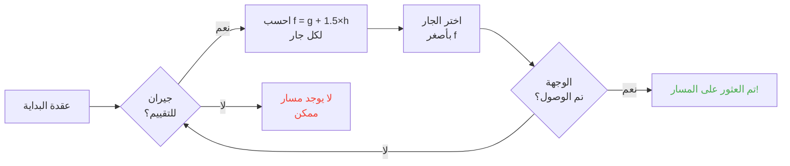

## مقدمة

قضيت ساعات وأنا أشاهد الخرفان ترتطم بالجدران.

وبصراحة؟ أفضل استثمار في حياتي xD

لأنه كلما زادت مشاهدتك لهذه الموبات، أدركت أنها ليست عشوائية أبداً. كل حركة مبرمجة، متوقعة، والأهم -- قابلة للكسر تماماً. في النهاية غصت في الكود المصدري لماينكرافت لأفهم بالضبط كيف يعمل تحديد المسار، وما اكتشفته هو أنك تستطيع حرفياً التحكم بعقول الموبات. يعني، إجبارها على الذهاب حيث تريد أنت، وليس حيث يقرر العشوائي.

هذا الدليل هو كل ما تعلمته أثناء البحث. الذكاء الاصطناعي، خوارزمية A*، العقوبات المخفية، الاستغلالات التي يمكنك تطبيقها في البقاء. جهز معولك.

---

## كيف يعمل ذكاء الموبات (المفسد: إنه سخيف)

### الأهداف (Goals)

كل موب لديه *أهداف*. إنها قائمة بأشياء يمكنه فعلها ومدى رغبته في فعلها. كلما كان الرقم أصغر، زادت الأولوية -- مثل قائمة مهام بنسخة فوضوية.

```java
protected void registerGoals() {
   this.goalSelector.addGoal(4, new Zombie.ZombieAttackTurtleEggGoal(this, 1.0, 3));
   this.goalSelector.addGoal(8, new LookAtPlayerGoal(this, Player.class, 8.0F));
   this.goalSelector.addGoal(8, new RandomLookAroundGoal(this));
   this.addBehaviourGoals();
}
```

سبق ورأيت زومبي يتجاهل بيضة سلحفاة ليلاحقك؟ هذا هو السبب: `ZombieAttackTurtleEggGoal` له أولوية 4، بينما `ZombieAttackGoal` (الشيء الذي يخبره بأكل وجهك) له أولوية 2.

نعم، الزومبي يفضّل أكلک على كسر بيضة. هذا جميل xD

الهدف الذي يهمنا حقاً هو `WaterAvoidingRandomStrollGoal`، أولوية 7. هدف "ليس لدي ما أفعله لذا أمشي عشوائياً". هنا تبدأ الفوضى.

### الحركة (أو "كيف أن random march لديه فرصة 1 من 60 للحدوث")

كل تيك (كل 0.05 ثانية)، يستدعي اللعبة `canUse()` لترى إذا كان الموب يتفضل بالتحرك. فرصة 1 من 60 في كل تيك. تصميم سخيف تماماً، وأنا أحبه.

```java
public boolean canUse() {
   if (this.mob.hasControllingPassenger()) {
      return false;
   } else {
      if (!this.forceTrigger) {
         if (this.checkNoActionTime && this.mob.getNoActionTime() >= 100) {
            return false;
         }
         if (this.mob.getRandom().nextInt(reducedTickDelay(this.interval)) != 0) {
            return false;
         }
      }
      Vec3 $$0 = this.getPosition();
      if ($$0 == null) {
         return false;
      } else {
         this.wantedX = $$0.x;
         this.wantedY = $$0.y;
         this.wantedZ = $$0.z;
         this.forceTrigger = false;
         return true;
      }
   }
}
```

إذاً للتبسيط: إن كنت راكباً على الموب -> لا، إذا لم يفعل الموب شيئاً منذ 5 ثوانٍ -> لا، إذا قال العشوائي لا -> لا. اللعبة حقاً لا تريد أن يتحرك الموب.

لكن عندما يتحرك، `getPosition()` تتولى الأمر:

```java
protected Vec3 getPosition() {
   if (this.mob.isInWater()) {
      Vec3 $$0 = LandRandomPos.getPos(this.mob, 15, 7);
      return $$0 == null ? super.getPosition() : $$0;
   } else {
      return this.mob.getRandom().nextFloat() >= this.probability
         ? LandRandomPos.getPos(this.mob, 10, 7)
         : super.getPosition();
   }
}
```

انظر إلى هذين الرقمين في النهاية: هما نصف القطر XZ ونصف القطر Y. في الماء، يبحث الموب أبعد (15 بدلاً من 10). إذا لم يجد أرضاً، يتراجع إلى `super.getPosition()` التي تقبل الماء. **النتيجة: الموبات تريد الخروج من الماء.** لهذا تسبح حيواناتك كالمجانين نحو الحافة.

تفصيل صغير مثير: هناك حرفياً 0.1% فرصة أن يأخذ الموب `super.getPosition()` بدلاً من `LandRandomPos`. واحد في الألف. موجانغ يعني xD

### LandRandomPos: التحسين التافه الذي يغير كل شيء

هذه مرحلتي المفضلة. أغبى خدعة تقنية تجعل تحديد المسار قابلاً للاستغلال.

```java
public static Vec3 getPos(PathfinderMob $$0, int $$1, int $$2, ToDoubleFunction<BlockPos> $$3) {
   boolean $$4 = GoalUtils.mobRestricted($$0, $$1);
   return RandomPos.generateRandomPos(() -> {
      BlockPos $$4xx = RandomPos.generateRandomDirection($$0.getRandom(), $$1, $$2);
      BlockPos $$5 = generateRandomPosTowardDirection($$0, $$1, $$4, $$4xx);
      return $$5 == null ? null : movePosUpOutOfSolid($$0, $$5);
   }, $$3);
}
```

`movePosUpOutOfSolid`. الاسم يقول كل شيء. إذا كان الموضع المختار داخل كتلة صلبة، تدفعه اللعبة للأعلى حتى يصبح في الهواء.

هذا تحسين: بدلاً من إضاعة الوقت بتجاهل المواضع تحت الأرض، ترفعها اللعبة إلى السطح. ذكي؟ نعم. لكنه يخلق انحيازاً جنونياً: **الموبات تفضل المرتفعات**.

تخيل. لديك الكثير من الكتل تحت السطح، تولد اللعبة 10 مواضع عشوائية. تلك الموجودة في الكتل تُدفع للأعلى. المناطق الكثيفة (تحت تل) تنتج مواضع صالحة أكثر من المناطق الفارغة. النتيجة: الموب سيذهب إحصائياً نحو التل أكثر.

ثق بي، سنكسر هذا في دقيقتين.

### الاختيار: مسابقة أفضل كتلة

10 مواضع، فائز واحد، مسابقة نقاط:

```java
public static Vec3 generateRandomPos(Supplier<BlockPos> $$0, ToDoubleFunction<BlockPos> $$1) {
   double $$2 = Double.NEGATIVE_INFINITY;
   BlockPos $$3 = null;
   for(int $$4 = 0; $$4 < 10; ++$$4) {
      BlockPos $$5 = (BlockPos)$$0.get();
      if ($$5 != null) {
         double $$6 = $$1.applyAsDouble($$5);
         if ($$6 > $$2) {
            $$2 = $$6;
            $$3 = $$5;
         }
      }
   }
   return $$3 != null ? Vec3.atBottomCenterOf($$3) : null;
}
```

الموضع ذو أعلى نقاط يَفوز. وإذا عرفنا معايير النقاط، يمكننا جعل الموضع الذي نريده يفوز. إنه مثل تزوير انتخابات.

---

## تفضيلات الموبات (أو "لماذا تعبر بقرتك الطريق")

كل موب لديه أذواق مختلفة. وهذا يغير كل شيء.

| موب | يحب هذا |
| --- | --- |
| **الحيوانات** (بقر، خرفان، خنازير) | العشب والضوء (الهيبيون) |
| **الوحوش** (زومبي، هياكل عظمية) | الظلام (محبو الظل) |
| **السلاحف** | الماء، وإلا الرمل، وإلا الضوء |
| **Hoglins** | `crimson_nylium`؛ يكرهون `warped_fungus` |
| **Striders** | الحمم فقط. لا شيء غيرها. |
| **Silverfish** | الكتل القابلة للإصابة (منطقي) |
| **Guardians** | ماء + ضوء (المتكبرون) |
| **Mooshrooms** | mycelium + ضوء (فطر) |
| **النحل** | الهواء. نعم، يفضلون الهواء. |

```java
// حيوان: ينظر للأسفل، إذا كان عشباً، أعلى نقاط
public float getWalkTargetValue(BlockPos $$0, LevelReader $$1) {
   return $$1.getBlockState($$0.below()).is(Blocks.GRASS_BLOCK) ? 10.0F : $$1.getPathfindingCostFromLightLevels($$0);
}

// وحش: العكس تماماً
public float getWalkTargetValue(BlockPos $$0, LevelReader $$1) {
   return -$$1.getPathfindingCostFromLightLevels($$0);
}
```

الوحوش حرفياً "إذا كان مضاءً، نقاط سلبية، سأذهب لمكان آخر". إنهم يتجهمون من الضوء xD

لذا يمكنك -- حرفياً -- توجيه حيواناتك بالعشب والضوء، ووحوشك بالظلام. هذا سخيف ورائع في آن واحد.

---

## خوارزمية A* في ماينكرافت (الصيغة السرية)

تستخدم ماينكرافت خوارزمية A* (A-star) لتحديد المسار. لكن موجانغ وضعت بصمتها:

```
f(n) = g(n) + 1.5 × h(n)
```

- **g(n)** = المسار المقطوع بالفعل (1 لكل كتلة، ~1.41 قطرياً)
- **h(n)** = المسافة الجوية
- **1.5** = لأن موجانغ تحب الأشياء المكسورة قليلاً

عادة A* تستخدم `f(n) = g(n) + h(n)`. موجانغ أضافت عامل 1.5. لماذا؟ لتجعل الخوارزمية تذهب أسرع نحو الوجهة وتقطع فروع بحث أقل. النتيجة: المسار الموجود "جيد" لكنه ليس الأفضل دائماً. إنها A* ثملة بعض الشيء.



تفصيل مهم: **الموب لا يمكنه تحديد مسار لأكثر من 16 كتلة** (مدى متابعته). إذا كانت الوجهة بعيدة جداً، يختار أقرب كتلة يمكنه الوصول إليها. هذا يعني أنه يمكنك إنشاء نصب تذكاري خارج متناوله، وسيحدد الموب مساره نحو أقرب كتلة تقربه منه -- مما يجعل حركاته متوقعة تماماً.

### الاستغلالان اللذان يكسّران اللعبة

#### 1. تحديثات الكتلة = إعادة حساب إجبارية

```java
public boolean shouldRecomputePath(BlockPos $$0) {
   if (this.hasDelayedRecomputation) return false;
   if (this.path != null && !this.path.isDone() && this.path.getNodeCount() != 0) {
      Node $$1 = this.path.getEndNode();
      Vec3 $$2 = new Vec3(
         ((double)$$1.x + this.mob.getX()) / 2.0,
         ((double)$$1.y + this.mob.getY()) / 2.0,
         ((double)$$1.z + this.mob.getZ()) / 2.0
      );
      return $$0.closerToCenterThan($$2, (double)(this.path.getNodeCount() - this.path.getNextNodeIndex()));
   }
   return false;
}
```

كل تحديث كتلة قرب مسار الموب يجبر إعادة حساب A* مع تبريد لمدة ثانية واحدة. تضع ساعة بثانية واحدة بجانب موب، فيعيد حساب مساره باستمرار. هذا يعادل وضع GPS يُعاد ضبطه كل ثانية.

وإذا فعلت هذا مع 50 موباً في نفس الوقت؟ مدينة التأخير. وداعاً TPS.

#### 2. عقوبات الكتل (Pathfinding Malice)

بعض الكتل تخيف الموبات. حرفياً. كل كتلة لها تكلفة مرتبطة، معرفة بتعداد:

| كتلة / حالة | عقوبة |
| --- | --- |
| **كتلة العسل** | +8 لعبورها |
| **الثلج المسحوق** | غير قابل للعبور |
| **الأبواب المغلقة** | غير قابل للعبور |
| **النار** | +16 لعبورها، +8 للمحاذاة |
| **الحيوانات والقرويون** | نار = -1 (كلا) |
| **صبار / توت حلو** | غير قابل للعبور؛ المجاور = +8 |
| **الماء** | +8 لعبوره أو محاذاته |
| **السبج** | +8 للمحاذاة (أوتش) |

الحيوانات أكثر تطرفاً:

```java
protected Animal(EntityType<? extends Animal> $$0, Level $$1) {
   super($$0, $$1);
   this.setPathfindingMalus(PathType.DANGER_FIRE, 16.0F);
   this.setPathfindingMalus(PathType.DAMAGE_FIRE, -1.0F);
}
```

DAMAGE_FIRE بقيمة -1.0F، هذا حرفياً "ممنوع". الحيوان يفضل رمي نفسه في الهاوية على عبور النار. فيوو.

### تمرين: مسابقة المسارات الكبرى

تخيل قروياً يجب أن يختار بين عدة مسارات.

- **المسار A**: 15 كتلة لكن 6 كتل تحاذي الماء (+8 لكل منها)
- **المسار B**: 18 كتلة مع كتلتين من الماء (+8) وكتلة واحدة مجاورة للماء (+8)
- **المسار C**: 14 كتلة بشكل مستقيم... لكن مع نار -> غير قابل للعبور للقروي
- **المسار D**: 16 كتلة مع كتلة واحدة مجاورة للسبج (+8) + كتلة واحدة مجاورة للعسل (+8)
- **المسار E**: 25 كتلة لكن مع صبار في كل مكان (+8 في كل مكان) -> 90.82 تكلفة إجمالية LOL

حساب ذهني:

- المسار A: 15 كتلة + 6×8 للماء = 15 + 48 = **63** ... لكن يجب إضافة 1.5× المسافة. دعنا نجري الحسابات الحقيقية.
- المسار B: أطول لكن عقوبات أقل. التكلفة الإجمالية = المسافة المقطوعة + العقوبات.
- المسار D: السبج والعسل يكدسان عقوباتهما.

الفائز غالباً هو **المسار B**: الالتفاف مربح لأن الماء غالي الثمن.

القروي هو أساساً آلة حساب تكاليف بأرجل xD

### كل موب له أذواقه

قروي: "نار؟ لا شكراً باي"
زومبي: "نار؟ تمام يا كبير *يعبرها وهو يحترق*"

لديك حرفياً طرق يمر بها بعض الموبات وآخرون لا. يمكنك عمل طرق سريعة للقرويين حيث يحترق الزومبي.

---

## القرويون: الفوضى العظمى

حسناً، القرويون. هذا أكثر شيء غير مفهوم في ماينكرافت. لكن بمجرد أن تفهم الكود، تدرك أنهم آلات متوقعة بساعات مكتبية.

### المستشعرات والذكريات

9 مستشعرات، تعمل كل 20 تيك (ثانية واحدة). كل منها يمسح نصف قطر حول القروي ويخزن النتيجة في الذاكرة. القروي يرى كل شيء، يتذكر كل شيء، ويتصرف بناءً عليه.

مثل: "هل هناك عدو؟ شيء على الأرض؟ لاعب للتحدث معه؟" -- يتحقق من كل شيء.

### الحزم (مراحل يومه)

دماغ القروي عبارة عن حزم نشاط تنشط حسب الوقت:

| حزمة | الوقت | القروي... |
| --- | --- | --- |
| **Core** | 24 ساعة | يفتح الأبواب، يسبح (80% من الوقت)، ويَكْتَسِب POIs |
| **Work** | 8ص-3م | "سأذهب للعمل" -- يمشي نحو محطة عمله |
| **Meet** | 3م-5م | "أبريه!" -- يذهب للجرس، يثرثر |
| **Rest** | 6م-6ص | "يجب النوم" -- يذهب للسرير |
| **Idle** | 6ص-8ص، 5م-6م | "أتسكع" -- يتجول، ينجب أطفالاً، يقفز على الأسرة |
| **Panic** | إصابة/عداء | "النجدة" -- هروب |

حزمة **Panic** هي الوحيدة التي يمكنها مقاطعة كل الحزم الأخرى. حتى لو كان القروي نائماً أو يعمل، إذا كان هناك زومبي، ذعر عام.

### Acquire POI: الشيء الذي يتيح الريدستون اللاسلكية

```java
Set<Pair<Holder<PoiType>, BlockPos>> $$12 = (Set)$$10xx.findAllClosestFirstWithType(
   $$0, $$11, $$8x.blockPosition(), 48, PoiManager.Occupancy.HAS_SPACE
)
```

`Acquire POI` يمسح في نصف قطر 48 كتلة كل نقاط الاهتمام (POIs). يحتفظ بأقرب 5، ويتحقق من وجود مسار، ويكتسب أول مسار يمكن الوصول إليه.

كل POI له عدد محدود من الفتحات:
- **محطات العمل**: فتحة واحدة
- **أسرة**: فتحة واحدة
- **أجراس**: 32 فتحة

الشيء المذهل: **الفتحة تُحجز في وقت الاكتساب، وليس عند الوصول**. يمكن لقروي أن يقفل كومبوستر من الطرف الآخر للخريطة، دون أن يصل إليه أبداً.

هل تستوعب القوة؟

### ريدستون لاسلكية. نعم، لاسلكية.

1. تضع قروياً في عربة منجم مع مسار نحو كومبوستر
2. يكتسب الكومبوستر (فتحة محجوزة، لا يمكن لأحد استخدامها)
3. القروي بعيد جداً ليضغط عليه -- تبقى الـ bone meal
4. تَجُر هذا القروي في أي مكان في العالم، يحتفظ بالفتحة
5. عندما تريد تفعيل جهازك، تَقْتُل القروي
6. تتحرر الفتحة، يكتسب قروي آخر الكومبوستر، يزيل الـ bone meal
7. BLOCK UPDATE -> أي دائرة ريدستون تُفعل

لقد أنشأت حرفياً إشارة ريدستون لاسلكية، قابلة للنقل في أي مكان في العالم، بدون حاجة لتحميل أي chunks في الطريق. يمكنك وصل هذا بحجرة stasis pearl، وتجعلك تنتقل من أي مكان بقتل قروي.

استخدامي المفضل؟ لعبة صغيرة "صائد جوائز": تضع عدة قرويين مع كومبوسترات، على اللاعب قتل القروي الصحيح لتفعيل المخرج. إنها آلية wtf تماماً xD

### طريق مسدود لتحديد المسار (أو "القروي الذي يتجمد للأبد")

هناك خطأ رائع بين `Acquire POI` (الذي يرى مساراً) والملاحة الفعلية (التي ترفض استخدامه). يحدث عندما تكون الكتلة فوق محطة العمل غير قابلة للسير. النتيجة:

- حزمة Core: "أريد اكتساب POI"
- الملاحة: "لا أستطيع المشي هناك"
- النتيجة: يبقى القروي مُجمّداً، للأبد، في صراع مع نفسه.

حرفياً قرويون متجمدون في مكانهم، يمكن استخدامهم كديكور أو كـ"دعائم" في المباني. دبابة واقف؟ نعم. حارس لا يتحرك؟ نعم. مروع؟ ربما. لكن فعال xD

---

## الخاتمة

تحديد مسار الموبات في ماينكرافت ليس عشوائياً. إنه نظام حتمي، قائم على النقاط، متوقع وقابل للكسر.

**الأشياء الثلاثة التي يجب تذكرها:**

1. **كتل تحت الأقدام = انحياز ارتفاعي** -- املأ أو أفرغ تحت الأرض لتوجيه الموبات
2. **العقوبات مختلفة لكل موب** -- أنشئ طرقاً يسلكها البعض دون الآخرين
3. **فتحات POI تُحجز عن بعد** -- ريدستون لاسلكية مجانية، انتقال فوري، كل ذلك

الكود المصدري لماينكرافت هو منجم ذهب من الآليات غير المستغلة. قضيت ساعات أقرأ Java مفككة وبصراحة؟ كل سطر هو بيضة عيد الفصح وظيفية. إلا أن هذه، تستخدمها في البقاء لعمل ريدستون لاسلكية بالقرويين. أفضل لعبة مؤكدة.

xD
