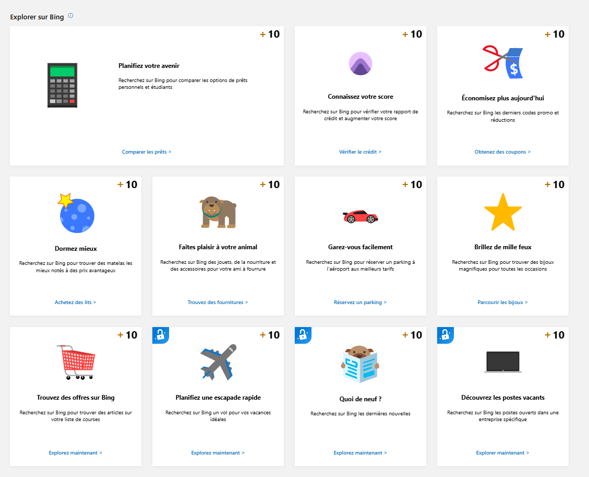
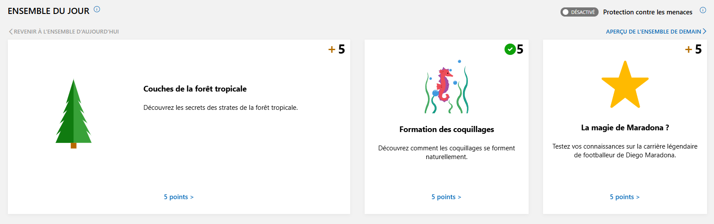
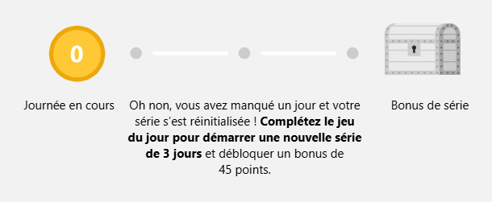
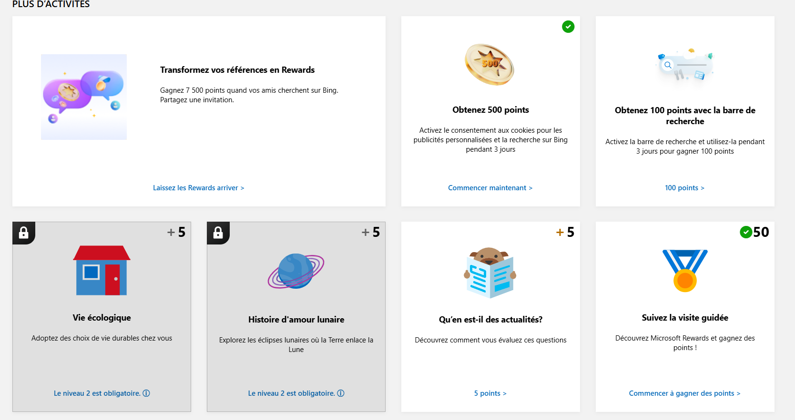
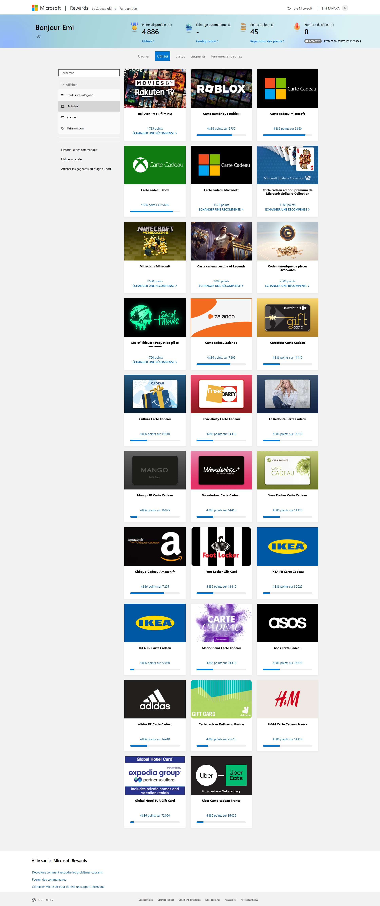
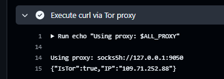
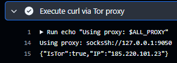

## 🇬🇧 English Translation of the Article

### Introduction

A few years ago I discovered Microsoft Rewards. Back then it was during lockdown, but that doesn’t change the fact that I was forced to use Microsoft Family Safety parental controls and thus had to use Edge. That’s when I discovered Rewards.

At the time I was only 14 and nothing in the catalogue interested me. Now I figure that with the skills I’ve acquired, I can farm points with bots and then give the codes away or even resell them cheaper if I really want to (knowing myself, I probably won’t). Anyway, I’ll tell you how I coded a bot that farms accounts at scale.

---

## What is Microsoft Rewards?

Long story short: it’s a program that rewards Edge users with points for activities like searches, small quizzes, games, and an extension (that’s a whole other story).

Here you can see “Explore” stuff:  


Here for example is what they call the “set of the day”.  


They even created a streak system, it’s pretty wild.  


There’s also a level system and it’s just completely fun:  


So you have tons of ways to earn points, and most of them are daily.  
The idea here is going to be to make a bot that does the activities for you, so you can farm points at scale and complete your farming routine.

As you can see below, most rewards are gift cards, but there are also fun things like games or service subscriptions.  


| Reward | Category | Cost in points |
| --- | --- | --- |
| **Rakuten TV – 1 HD movie** | Digital content | 1 785 |
| **Roblox (digital card)** | Game / digital content | 6 750 |
| **Microsoft gift card** | Store / service | 5 660 |
| **Xbox gift card** | Store / service | 5 660 |
| **Microsoft Solitaire Collection gift card** | Game / digital content | 1 500 |
| **Minecraft Minecoins** | Game / digital content | 2 500 |
| **League of Legends gift card** | Game / digital content | 2 000 |
| **Overwatch coin code (digital)** | Game / digital content | 2 000 |
| **Sea of Thieves – Old Coins pack** | Game / digital content | 1 700 |
| **Zalando – Gift card** | Store / service | 7 205 |
| **Carrefour – Gift card** | Store / service | 14 410 |
| **Cultura – Gift card** | Store / service | 14 410 |
| **Fnac‑Darty – Gift card** | Store / service | 14 410 |
| **La Redoute – Gift card** | Store / service | 14 410 |
| **Mango – Gift card** | Store / service | 36 025 |
| **Wonderbox – Gift card** | Store / service | 14 410 |
| **Yves Rocher – Gift card** | Store / service | 14 410 |
| **Amazon.fr – Gift voucher** | Store / service | 7 205 |
| **Foot Locker – Gift card** | Store / service | 14 410 |
| **IKEA FR – Gift card** | Store / service | 36 025 |
| **IKEA FR – Gift card (other design)** | Store / service | 7 200 |
| **Marionnaud – Gift card** | Store / service | 14 410 |
| **Asos – Gift card** | Store / service | 14 410 |
| **Adidas FR – Gift card** | Store / service | 14 410 |
| **Deliveroo France – Gift card** | Store / service | 21 615 |
| **H&M France – Gift card** | Store / service | 14 410 |
| **Global Hotel Card (Expedia Group)** | Store / service | 7 205 |
| **Uber Eats France – Gift card** | Store / service | 36 025 |

Now that you understand the point of this program, let’s look into botting.

---

## First tests

Before building my bot, I wanted to make sure I wouldn’t get IP flagged for using hundreds of accounts from the same address. You know me, I’m going to use Tor with a rotating proxy. And I don’t want to host my bot on a VPS—I want it to run in a GitHub Action.

So I wrote a simple workflow:

```yaml
name: Tor Proxy Curl

on:
  workflow_dispatch:

jobs:
  tor-proxy-curl:
    runs-on: ubuntu-latest

    steps:
      - name: Install Tor and curl
        run: |
          sudo apt-get update
          sudo apt-get install -y tor curl

      - name: Start Tor service
        run: |
          sudo systemctl enable tor
          sudo systemctl start tor
          for i in {1..30}; do
            if ss -lnt | grep -q ':9050'; then
              echo "Tor SOCKS proxy is listening on 127.0.0.1:9050"
              exit 0
            fi
            sleep 1
          done
          echo "Tor SOCKS proxy did not start in time"
          sudo journalctl -u tor --no-pager | tail -n 50
          exit 1

      - name: Set proxy environment variables
        run: |
          echo "ALL_PROXY=socks5h://127.0.0.1:9050" >> "$GITHUB_ENV"
          echo "all_proxy=socks5h://127.0.0.1:9050" >> "$GITHUB_ENV"
          echo "HTTP_PROXY=socks5h://127.0.0.1:9050" >> "$GITHUB_ENV"
          echo "http_proxy=socks5h://127.0.0.1:9050" >> "$GITHUB_ENV"
          echo "HTTPS_PROXY=socks5h://127.0.0.1:9050" >> "$GITHUB_ENV"
          echo "https_proxy=socks5h://127.0.0.1:9050" >> "$GITHUB_ENV"
          echo "NO_PROXY=localhost,127.0.0.1" >> "$GITHUB_ENV"
          echo "no_proxy=localhost,127.0.0.1" >> "$GITHUB_ENV"

      - name: Execute curl via Tor proxy
        run: |
          echo "Using proxy: $ALL_PROXY"
          curl --fail --silent --show-error --proxy "$ALL_PROXY" https://check.torproject.org/api/ip
```

This workflow just installs Tor, starts it, and makes a curl request through it.

The first run gave this result:  


The time stats were:  
!Timings

A second run gave this result:  


As you can see, the IPs are different, so we won’t get flagged for abusive usage from the same IP. That’s good news—we can keep developing the farming bot.

---

## First test with Selenium

To automate the UI, I’m going to use **Selenium**: a tool that controls a real browser (Chrome/Edge/Firefox) instead of a user. In the context of a GitHub Action, this means installing a browser + its driver, then running a script that logs into Microsoft Rewards and clicks where needed.

### Example JavaScript script (Node.js + selenium-webdriver)

```js
import { Builder, By, Capabilities, until, WebDriver } from 'selenium-webdriver';

const chromeOptions = {
  args: [
    '--no-sandbox',
    '--disable-dev-shm-usage',
    '--disable-blink-features=AutomationControlled',
    // '--proxy-server=socks5://127.0.0.1:9050'
  ],
  excludeSwitches: ['enable-automation'],
  useAutomationExtension: false,
};

async function applyStealth(driver: WebDriver) {
  // Inject script before any page JS runs to reduce automation fingerprinting.
  await (driver as any).sendDevToolsCommand('Page.addScriptToEvaluateOnNewDocument', {
    source: `
      Object.defineProperty(navigator, 'webdriver', {
        get: () => undefined
      });

      // Some sites check for chrome runtime and plugins
      window.chrome = { runtime: {} };
      Object.defineProperty(navigator, 'plugins', {
        get: () => [1, 2, 3, 4, 5],
      });
      Object.defineProperty(navigator, 'languages', {
        get: () => ['en-US', 'en'],
      });
    `,
  });
}

(async () => {
  const caps = Capabilities.chrome().set('goog:chromeOptions', chromeOptions);
  const driver = await new Builder().withCapabilities(caps).build();

  await applyStealth(driver);

  try {
    const targetUrl = 'https://rewards.bing.com/';
    await driver.get(targetUrl);

    console.log('After navigation: url=', await driver.getCurrentUrl());
    console.log('After navigation: title=', await driver.getTitle());

    const signInButton = await driver.wait(
      until.elementLocated(By.css('#rewards-header-sign-in')),
      20000,
      'Timed out waiting for sign-in button (may indicate 400/blocked page)'
    );

    console.log('Page loaded, sign in button found:', await signInButton.getText());
  } finally {
    await driver.quit();
  }
})();
```

Result of the script:

```
DevTools listening on ws://127.0.0.1:50274/devtools/browser/37b9ea79-0e5d-4673-9e91-7ffeaf0d37f8
After navigation: url= https://rewards.bing.com/welcome?idru=%2F
After navigation: title= Bienvenue dans Microsoft Rewards!
Page loaded, sign in button found: Se connecter
```

Okay, that means we’re not logged in yet, so now we’ll build the login request and see if we can sign in to our Microsoft Rewards account to do the activities.

## THIS ARTICLE IS STILL A WORK IN PROGRESS, I’LL UPDATE IT WITH THE LOGIN STEPS AND ACTIVITY BOTTING STEPS SOON! STAY TUNED.