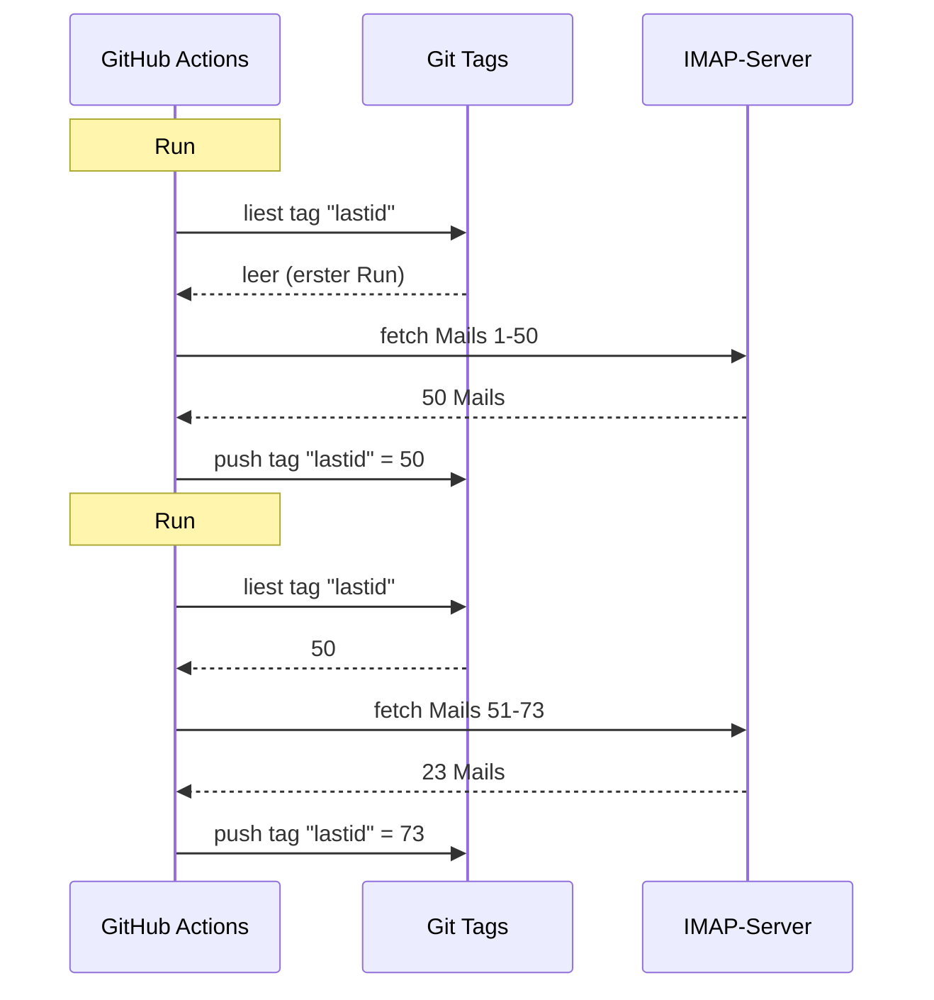

# Ich hab git als Datenbank benutzt, um einen kostenlosen Bot auf GitHub Actions laufen zu lassen

Ich hab einen automatischen E-Mail-Beantworter, der 24/7 läuft.

Er liest meine Mails, checkt worum es geht, und antwortet selbstständig mit KI. Er erinnert sich an frühere Unterhaltungen. Er ignoriert Newsletter und `noreply@`. Er leitet weiter an einen Menschen, wenn's zu heiß wird.

Monatliche Kosten: **0€**.

Kein Server. Kein VPS. Keine Datenbank. Nur GitHub Actions und ein kranker Hack: **git als Datenbank benutzen**.

Du siehst, worauf das hinausläuft? Nein? Gut, halt dich fest, das ist bescheuert und genial zugleich.

---

## Das Problem: GitHub Actions ist stateless

GitHub Actions ist kostenlos. Du kannst einen Cron alle 5 Minuten starten, deinen Code laufen lassen, umsonst.

Aber es gibt ein Problem: es ist **stateless**.

Jeder Run startet in einer leeren Maschine. Nichts bleibt zwischen zwei Ausführungen erhalten. Der vorherige Run? Vergessen. Gelöscht. Als hätte es ihn nie gegeben.

Für einen E-Mail-Beantworter ist das ein riesiges Problem. So wie:

> "Was ist die letzte E-Mail, die ich schon verarbeitet habe?"

Wenn der Bot das bei jedem Run vergisst, antwortet er entweder immer wieder auf dieselben Mails (Katastrophe) oder verpasst welche.

Man braucht einen persistenten Zustand. Und normalerweise bedeutet persistenter Zustand = Datenbank. Aber eine Datenbank braucht einen Server, und ein Server ist nicht mehr kostenlos.

Hier wird's interessant.

---

## Die Lösung: git tags als Datenbank

Dein GitHub-Repo ist schon persistenter Speicher. Kostenlos. Versioniert. Immer da.

Warum also nicht den Zustand da speichern?

Die Idee: bei jedem Run liest der Bot die letzte verarbeitete E-Mail-UID aus einem **git tag**. Er verarbeitet die neuen Mails. Dann pusht er den Tag mit der neuen UID.



Der git tag IST die Datenbank. Ein einziger Wert, aber mehr brauchen wir nicht.

### State lesen

Am Anfang des Jobs holt man den Wert aus dem Tag:

```bash
git fetch origin --tags lastid || true
git show refs/tags/lastid:data/lastId > data/lastId || true
```

`git show refs/tags/lastid:data/lastId` heißt: "gib mir den Inhalt der Datei `data/lastId` so wie er im Tag `lastid` war".

Boom. Du hast deinen Wert, ohne Datenbank.

### State schreiben

Am Ende erstellt man den Tag mit dem neuen Wert neu:

```bash
git switch --orphan lastid-tmp   # leere Branche ohne Verlauf
git rm -rf .                      # alles leeren
mkdir -p data
printf "%s\n" "${LAST_ID_CONTENT}" > data/lastId

git add data/lastId
git commit -m "lastId snapshot"
git tag -f lastid                 # Tag forcieren auf diesen Commit
git push --force ...origin lastid # Tag pushen
```

Man erstellt eine **orphane** Branche (ohne Verlauf), legt nur die Datei `lastId` rein, committed, taggt, force-pusht.

Warum orphant? Damit nicht 10.000 State-Commits im Repo-Verlauf landen. Jedes Update überschreibt das vorherige. Der Tag zeigt immer auf EXACT EINEN Commit, der EXACT EINEN Wert enthält.

Das ist sauber. Das ist kostenlos. Das ist komplett kaputt xD

---

## Der zweite Hack: der Runtime-Snapshot

Es gibt noch ein Problem mit GitHub Actions: das `npm install`.

Wenn du bei jedem Run (alle 5 Minuten) `npm install` + `npm run build` machst, verschwendest du 60-90 Sekunden jedes Mal. Bei einem häufigen Cron sind das Minuten an Compute, die für nichts draufgehen.

Lösung: Den Code EIN MAL vorkompilieren und auch in einem git tag speichern.

Der Build-Workflow (der läuft, wenn du auf `master` pushst) macht das:

```bash
# kompiliert den Code
bun install
bun run build

# speichert dist/ + node_modules/ in einem tag "runtime"
git checkout --orphan temp-runtime
git rm -rf .
cp -r "$TMPDIR"/* .
git add dist node_modules package.json bun.lock data
git commit -m "runtime build"
git tag -f runtime
git push --force ...origin runtime
```

Der Tag `runtime` enthält den kompilierten Code UND die `node_modules`. Fertig zum Laufen.

Und der Cron checkt direkt diesen Tag aus:

```yaml
- name: Checkout runtime snapshot
  uses: actions/checkout@v4
  with:
    ref: refs/tags/runtime    # der vorgebaute Code, nicht der Source
    fetch-depth: 1

# kein npm install, kein build !
- name: Process emails
  run: node dist/index.js --action
```

Kein Install. Kein Build. Der Cron startet sofort und führt nur `node dist/index.js` aus.

Du hast also zwei Tags mit zwei Jobs:
- `runtime` = der fertige Code (aktualisiert, wenn du Code pushst)
- `lastid` = der persistente Zustand (aktualisiert bei jedem Run)

Das ist elegant wie Sau.

---

## Der Bot selbst: KI-Auto-Antworter

Okay, der git-Hack ist cool, aber was macht der Bot genau?

Er liest deine Mails per IMAP, versteht sie mit einer KI (Groq + Llama 3.3 70B), und antwortet automatisch.

Architektur in sauberen Services mit Dependency Injection (InversifyJS):

```
App
├── ImapService      → liest Mails (IMAP)
├── SmtpService      → sendet Antworten (SMTP)
├── ParserService    → parsed Mail-Inhalte
├── ReplyService     → generiert KI-Antwort
├── SummaryService   → Gesprächsgedächtnis
├── AccountsService  → verwaltet mehrere E-Mail-Konten
└── ConfigService    → Config / Umgebungsvariablen
```

### Zwei Betriebsmodi

Der Bot kann auf zwei Arten laufen:

**Listener-Modus** (Echtzeit): Permanente IMAP-Verbindung mit exponentiellem Reconnect. Für einen VPS.

```typescript
this.imapService.on("exists", async (data) => {
  console.log(`[MAIL] Neue Mail! Total: ${data.count}`);
  // verarbeitet die neue Mail sofort
});
```

**Action-Modus** (Batch): Verarbeitet neue Mails ab `lastId` und beendet sich dann. Für den GitHub Actions Cron.

```bash
node dist/index.js --action
```

Der `--action`-Modus ist der, der den git-Hack verwendet. Er liest `lastId`, verarbeitet Neues, schreibt das neue `lastId`, Ende.

### Nicht auf Bots antworten

Wenn dein Bot auf ALLE Mails antwortet, antwortet er auch auf Newsletter, Benachrichtigungen, `noreply@`. Katastrophe. Schlimmer: wenn zwei Bots sich gegenseitig antworten, hast du eine Endlosschleife von Mails. Der Albtraum.

Also aggressives Filtern:

```typescript
export function isAutomatedSender(address) {
  const automatedPatterns = [
    "noreply", "no-reply", "donotreply",
    "mailer-daemon", "postmaster", "bounce",
    "newsletter", "notification", "marketing",
    "billing", "receipt", "promo", ...
  ];
  const local = address.split("@")[0].toLowerCase();
  return automatedPatterns.some(p => local.includes(p));
}
```

Und auch Erkennung über E-Mail-Header:

```typescript
export function isAutomatedByHeaders(headers) {
  return (
    ["bulk", "list", "junk"].includes(headers.precedence) ||
    headers["auto-submitted"] !== "no" ||
    headers["list-unsubscribe"] !== "" ||   // Newsletter haben das
    /mailchimp|sendgrid|mailgun|brevo/i.test(headers["x-mailer"])
  );
}
```

`List-Unsubscribe` in den Headern? Das ist ein Newsletter. `Precedence: bulk`? Massenmailing. `X-Mailer: Mailchimp`? Du checkst. Wird ignoriert.

Wie ein Türsteher im Club: Bots kommen nicht rein xD

### Die magischen Trigger

Die KI kann entscheiden, gar nicht zu antworten, oder an einen Menschen weiterzuleiten. Wie? Mit speziellen Triggern in ihrer Antwort.

Das System-Prompt sagt ihr:

> Wenn es eine automatisierte Mail/Newsletter ist → antworte `<no_reply>`
> Wenn es zu wichtig/sensibel ist (rechtlich, finanziell...) → antworte `<manual_reply_required>`
> Sonst → schreib eine richtige Antwort

Und der Code checkt das:

```typescript
const aiReply = completion.choices[0].message.content.trim();
const manualTrigger = aiReply.includes(MANUAL_REPLY_TRIGGER);
const noReply = aiReply.includes(NO_REPLY_TRIGGER);

if (noReply) {
  console.log("[MAIL] Die KI hat beschlossen zu ignorieren. Skip.");
  return;
}

if (manualTrigger) {
  console.log("[MAIL] Zu heiß, ich leite an einen Menschen weiter.");
  await this.smtpService.sendManualForward(...);
  return;
}

// sonst wird die KI-Antwort gesendet
await this.smtpService.sendReply(...);
```

Die KI darf also sagen "nee, da fass ich nix an, hol einen echten Menschen". Das nenn ich Weisheit.

---

## Das Gesprächsgedächtnis

Ein Detail, das alles verändert: der Bot **erinnert** sich an Unterhaltungen.

Wenn er jemandem antwortet, speichert er eine Zusammenfassung des Austauschs. Wenn diese Person das nächste Mal schreibt, wird die Zusammenfassung wieder ins Prompt injiziert.

Speicherung: eine JSON-Datei pro Kontakt.

```
data/customers/
├── moi%40gmail.com/
│   ├── alice%40example.com.json
│   └── bob%40client.fr.json
```

Und die Zusammenfassung wird selbst von der KI generiert, die alte Zusammenfassung mit der neuen Nachricht merged:

```typescript
const completion = await groq.chat.completions.create({
  model: "llama-3.3-70b-versatile",
  messages: [
    { role: "system", content: "Du bist ein Gedächtnis-Assistent. Merge die alte Zusammenfassung mit der neuen Nachricht, ohne Info zu verlieren." },
    { role: "user", content: `Bestehende Zusammenfassung:\n${existing}\n\nNeue Nachricht:\n${incomingContent}` }
  ],
  temperature: 0.0,  // deterministisch, keine Kreativität
  max_tokens: 800,
});
```

Der Bot baut sich also mit der Zeit ein komprimiertes Gedächtnis auf. Kein Grund, alle Mails zu speichern, nur eine Zusammenfassung, die intelligent wächst.

Und diese JSON-Dateien? Tja... die werden auch in git gespeichert, im runtime-tag. Git überall xD

---

## Der clevere Trick mit der Prompt-Länge

Kleines technisches Detail, das mich zum Grinsen gebracht hat.

Die Modelle haben ein Token-Limit. Wenn deine Mail + die Zusammenfassung + das Persona-Prompt zu lang sind, gibt die API einen Fehler zurück.

Der Code handhabt das mit einer **Kaskadentrunkierung** + Retry:

```typescript
try {
  // erster Versuch mit normalen Limits
  completion = await groq.chat.completions.create({...});
} catch (error) {
  if (!this.isLengthError(error)) throw error;

  // war ein Längenfehler: nochmal mit engeren Limits
  ({ systemContent, userContent } = this.buildPromptPayload({
    ...,
    limits: {
      systemPromptChars: 2200,  // statt 3000
      summaryChars: 1800,       // statt 4000
      personaChars: 900,        // statt 1500
      userContentChars: 2200,   // statt 8000
    },
  }));
  completion = await groq.chat.completions.create({...});  // retry
}
```

Wenn's nicht klappt, wird kürzer getrunkiert und nochmal versucht. Einfach, effektiv, kein Crash.

---

## Okay, und konkret, wie läuft das?

Der komplette Flow eines Cron-Runs:

```
1. GitHub Actions wird getriggert (Cron alle 5 Min)
2. Checkout des Tags "runtime" (vorgebauter Code)
3. git show refs/tags/lastid → holt die letzte verarbeitete UID
4. node dist/index.js --action
   ├── IMAP-Verbindung
   ├── Holt Mails ab lastId+1
   ├── Für jede Mail:
   │   ├── Parse Inhalt
   │   ├── Filter Bots (skip wenn automated)
   │   ├── Match Empfängerkonto
   │   ├── Hole Gesprächsgedächtnis
   │   ├── Generiere KI-Antwort (Groq)
   │   ├── <no_reply> ? skip
   │   ├── <manual_reply_required> ? an Menschen weiterleiten
   │   ├── sonst: sende Antwort (SMTP)
   │   └── Update Gesprächsgedächtnis
   └── Schreibe neue lastId
5. git push --force tag "lastid" mit dem neuen Wert
```

Und das wiederholt sich in 5 Minuten. Für immer. Umsonst.

---

**Die 3 Dinge zum Merken:**

1. **Git = kostenlose Datenbank** -- Ein orphaner Tag kann deinen persistenten Zustand zwischen zwei stateless Runs speichern. `git show refs/tags/X:datei` zum Lesen, force-push zum Schreiben. Keine DB nötig.

2. **Pre-compile in einen runtime-Tag** -- Statt `npm install` bei jedem Cron-Run, speicher den kompilierten Code + node_modules in einem git-Tag. Der Cron startet sofort.

3. **Ein KI-Bot muss schweigen können** -- Die Trigger `<no_reply>` und `<manual_reply_required>` lassen die KI entscheiden, nicht zu antworten oder weiterzuleiten. Dazu das Anti-Bot-Filtering. Sonst erzeugst du eine Endlos-Mail-Schleife.

Serverless Cron mit persistentem Zustand, KI, Gedächtnis, das Ganze für 0€/Monat. Das ist komplett kaputt und ich liebe es xD
