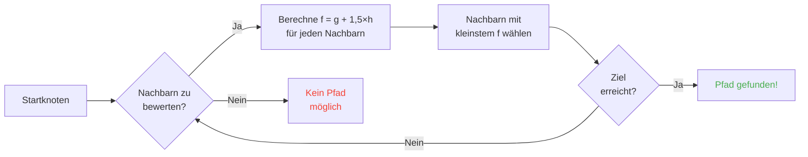

## Einleitung

Ich hab Stunden damit verbracht, Schafen beim Rennen gegen Wände zuzuschauen.

Beste Investition meines Lebens xD

Je mehr du dir diese Mobs anschaust, desto mehr merkst du: Nichts an ihrer Bewegung ist zufällig. Jeder Schritt ist programmiert, vorhersagbar, und vor allem -- ausnutzbar. Ich hab den Minecraft-Sourcecode durchgewühlt um genau zu verstehen, wie Pathfinding funktioniert, und was ich gefunden hab ist, dass du Mobs buchstäblich mit Gedanken kontrollieren kannst. So à la zwing sie dahin zu gehen, wo DU willst, nicht wo der Zufall entscheidet.

Dieser Guide ist alles, was ich beim Graben gefunden hab. Das KI-System, der A*-Algorithmus, die versteckten Malice-Werte, die Exploits die du im Überlebensmodus ziehen kannst. Hol deine Spitzhacke.

---

## Wie Mob-KI funktioniert (Spoiler: sie ist irgendwie dumm)

### Goals

Jeder Mob hat eine Liste von *Goals*. Dinge, die er TUN KANN, und wie sehr er sie TUN WILL. Niedrigere Zahl = höhere Priorität. Wie eine TODO-Liste aus der Hölle.

```java
protected void registerGoals() {
    this.goalSelector.addGoal(4, new Zombie.ZombieAttackTurtleEggGoal(this, 1.0, 3));
    this.goalSelector.addGoal(8, new LookAtPlayerGoal(this, Player.class, 8.0F));
    this.goalSelector.addGoal(8, new RandomLookAroundGoal(this));
    this.addBehaviourGoals();
}
```

Schon mal gesehen, wie ein Zombie ein Schildkröten-Ei ignoriert um dich zu jagen? Daher: `ZombieAttackTurtleEggGoal` hat Priorität 4, während `ZombieAttackGoal` (das "fress-dein-Gesicht"-Goal) Priorität 2 hat. Zombies bevorzugen Snacks mit Puls.

Das Goal, das uns eigentlich interessiert, ist `WaterAvoidingRandomStrollGoal`, Priorität 7. Das "ich hab nix Besseres zu tun, also lauf ich rum"-Goal. Hier fängt der Spaß an.

### Bewegung (oder "wie ein Random Walk eine 1-zu-60-Chance pro Tick hat")

Jeden Tick (alle 0,05 Sekunden) ruft das Spiel `canUse()` auf, um zu checken ob der Mob überhaupt Bock hat, sich zu bewegen. 1 zu 60 Chance pro Tick. Unfassbar ineffizientes Design -- und ich liebe es.

```java
public boolean canUse() {
    if (this.mob.hasControllingPassenger()) {
        return false;
    } else {
        if (!this.forceTrigger) {
            if (this.checkNoActionTime && this.mob.getNoActionTime() >= 100) {
                return false;
            }
            if (this.mob.getRandom().nextInt(reducedTickDelay(this.interval)) != 0) {
                return false;
            }
        }
        Vec3 $$0 = this.getPosition();
        if ($$0 == null) {
            return false;
        } else {
            this.wantedX = $$0.x;
            this.wantedY = $$0.y;
            this.wantedZ = $$0.z;
            this.forceTrigger = false;
            return true;
        }
    }
}
```

Also zusammengefasst: wenn du auf dem Mob reitest -> nein, wenn der Mob 5 Sekunden nix getan hat -> nein, wenn RNG nein sagt -> nein. Das Spiel will REALLY nicht, dass Mobs sich bewegen.

Aber wenn er sich doch bewegt, übernimmt `getPosition()`:

```java
protected Vec3 getPosition() {
    if (this.mob.isInWater()) {
        Vec3 $$0 = LandRandomPos.getPos(this.mob, 15, 7);
        return $$0 == null ? super.getPosition() : $$0;
    } else {
        return this.mob.getRandom().nextFloat() >= this.probability
            ? LandRandomPos.getPos(this.mob, 10, 7)
            : super.getPosition();
    }
}
```

Die zwei Zahlen am Ende? XZ-Radius und Y-Radius. Im Wasser sucht der Mob weiter (15 vs 10). Wenn er kein Land findet, fallbackt er auf `super.getPosition()` -- das Wasser akzeptiert. **Ergebnis: Mobs WOLLEN aus dem Wasser raus.** Deshalb schwimmen deine Tiere wie Verrückte Richtung Ufer.

Lustiges Detail: es gibt buchstäblich eine 0,1%-Chance, dass der Mob `super.getPosition()` statt `LandRandomPos` nimmt. Eins zu tausend. Mojang halt xD

### LandRandomPos: die Optimierung, die alles zerstört

Das ist MEIN Lieblingsschritt. Das schönste technische Chaos, das Pathfinding ausnutzbar macht.

```java
public static Vec3 getPos(PathfinderMob $$0, int $$1, int $$2, ToDoubleFunction<BlockPos> $$3) {
    boolean $$4 = GoalUtils.mobRestricted($$0, $$1);
    return RandomPos.generateRandomPos(() -> {
        BlockPos $$4xx = RandomPos.generateRandomDirection($$0.getRandom(), $$1, $$2);
        BlockPos $$5 = generateRandomPosTowardDirection($$0, $$1, $$4, $$4xx);
        return $$5 == null ? null : movePosUpOutOfSolid($$0, $$5);
    }, $$3);
}
```

`movePosUpOutOfSolid`. Der Name sagt alles. Wenn die gewählte Position in einem soliden Block ist, schiebt das Spiel sie nach oben, bis sie in der Luft ist.

Das ist eine Optimierung: anstatt Zeit damit zu verschwenden, unterirdische Positionen zu überspringen, werden sie einfach an die Oberfläche geschoben. Klug? Ja. Aber es erzeugt einen MASSIVEN Bias: **Mobs bevorzugen Höhenlagen**.

Denk mal drüber nach. Viele Blöcke unter der Erde, das Spiel generiert 10 zufällige Positionen. Die in Blöcken werden nach oben geschoben. Dichte Gebiete (unter einem Hügel) erzeugen mehr gültige Positionen als hohle Gebiete. Ergebnis: der Mob läuft statistisch gesehen öfter zum Hügel.

Vertrau mir, wir werden das gleich komplett ausnutzen.

### Die Auswahl: bester Block gewinnt

10 Positionen, ein Gewinner, ein Score-Contest:

```java
public static Vec3 generateRandomPos(Supplier<BlockPos> $$0, ToDoubleFunction<BlockPos> $$1) {
    double $$2 = Double.NEGATIVE_INFINITY;
    BlockPos $$3 = null;
    for(int $$4 = 0; $$4 < 10; ++$$4) {
        BlockPos $$5 = (BlockPos)$$0.get();
        if ($$5 != null) {
            double $$6 = $$1.applyAsDouble($$5);
            if ($$6 > $$2) {
                $$2 = $$6;
                $$3 = $$5;
            }
        }
    }
    return $$3 != null ? Vec3.atBottomCenterOf($$3) : null;
}
```

Die Position mit dem höchsten Score GEWINNT. Und wenn du die Bewertungskriterien kennst, kannst du DEINE Position gewinnen lassen. Das ist wie eine Wahl manipulieren.

---

## Mob-Präferenzen (oder "warum deine Kuh über die Straße ging")

Jeder Mob hat andere Vorlieben. Und das ändert alles.

| Mob | Liebt |
| --- | --- |
| **Tiere** (Kühe, Schafe, Schweine) | Grasblöcke, Licht |
| **Monster** (Zombies, Skelette) | Dunkelheit (Hipster) |
| **Schildkröten** | Wasser > Sand > Licht |
| **Hoglin** | `crimson_nylium`; hasst `warped_fungus` |
| **Lohen** | Lava und NICHTS ANDERES |
| **Silberfischchen** | Infizierbare Blöcke |
| **Wächter** | Wasser + Licht (Snobs) |
| **Mooshrooms** | Myzel + Licht |
| **Bienen** | Luft. Ja, die bevorzugen LUFT. |

```java
// Animal: runtergucken, wenn Gras -> max Score
public float getWalkTargetValue(BlockPos $$0, LevelReader $$1) {
    return $$1.getBlockState($$0.below()).is(Blocks.GRASS_BLOCK) ? 10.0F : $$1.getPathfindingCostFromLightLevels($$0);
}

// Monster: buchstäblich das Gegenteil
public float getWalkTargetValue(BlockPos $$0, LevelReader $$1) {
    return -$$1.getPathfindingCostFromLightLevels($$0);
}
```

Monster sind praktisch "wenn's hell ist, negativ-Score, ich bin raus." Die kriegen einen KRAMPF bei Licht xD

Du kannst also -- buchstäblich -- Tiere mit Gras und Licht lenken, und Monster mit Dunkelheit. Es ist dumm und genial zugleich.

---

## A* in Minecraft (die geheime Formel)

Minecraft benutzt A* (A-Star) fürs Pathfinding. Aber Mojang hat ihren eigenen Dreh eingebaut:

```
f(n) = g(n) + 1,5 × h(n)
```

- **g(n)** = bereits zurückgelegte Distanz (1 pro Block, ~1,41 diagonal)
- **h(n)** = Luftlinien-Distanz zum Ziel
- **1,5** = weil Mojang gern Dinge leicht kaputt macht

Normales A* benutzt `f(n) = g(n) + h(n)`. MOJANG HAT EINEN 1,5-MULTIPLIKATOR EINGEBAUT. Warum? Damit der Algorithmus schneller aufs Ziel zusteuert und weniger Such-Äste beschneidet. Ergebnis: der Pfad ist "gut genug" aber nicht immer optimal. Es ist ein betrunkenes A*.



Wichtige Einschränkung: **ein Mob kann nur 16 Blöcke weit pathen** (seine *Follow Range*). Wenn das Ziel zu weit weg ist, nimmt es den nächstgelegenen erreichbaren Block. Das heißt, du kannst einen Monolithen außerhalb der Reichweite bauen und der Mob patht zum nächstgelegenen Block, der ihn näher bringt -- was seine Bewegung komplett vorhersagbar macht.

### Die zwei Exploits die das Spiel zerstören

#### 1. Block-Updates erzwingen Neuberechnung

```java
public boolean shouldRecomputePath(BlockPos $$0) {
    if (this.hasDelayedRecomputation) return false;
    if (this.path != null && !this.path.isDone() && this.path.getNodeCount() != 0) {
        Node $$1 = this.path.getEndNode();
        Vec3 $$2 = new Vec3(
            ((double)$$1.x + this.mob.getX()) / 2.0,
            ((double)$$1.y + this.mob.getY()) / 2.0,
            ((double)$$1.z + this.mob.getZ()) / 2.0
        );
        return $$0.closerToCenterThan($$2, (double)(this.path.getNodeCount() - this.path.getNextNodeIndex()));
    }
    return false;
}
```

Jedes Block-Update in der Nähe des Mob-Pfads erzwingt eine A*-Neuberechnung mit 1-Sekunden-Cooldown. Bau einen 1-Sekunden-Taktgeber neben einen Mob und er rechnet STÄNDIG neu. Das ist wie ein GPS das sich jede Sekunde zurücksetzt.

Und wenn du das mit 50 Mobs machst? Lag-City. RIP TPS.

#### 2. Pathfinding Malice (Block-Kosten-Strafen)

Manche Blöcke machen Mobs Angst. Buchstäblich. Jeder Block hat zugehörige Kosten, definiert durch ein Enum:

| Block / Bedingung | Malice |
| --- | --- |
| **Honigblock** | +8 zum Durchlaufen |
| **Pulverschnee** | Unpassierbar |
| **Geschlossene Türen** | Unpassierbar |
| **Feuer** | +16 durch, +8 angrenzend |
| **Tiere & Dorfbewohner** | Feuer = -1 (HARTES NEIN) |
| **Kaktus / Süßbeeren** | Unpassierbar; angrenzend = +8 |
| **Wasser** | +8 durch oder angrenzend |
| **Magma** | +8 angrenzend |

Tiere gehen noch weiter:

```java
protected Animal(EntityType<? extends Animal> $$0, Level $$1) {
    super($$0, $$1);
    this.setPathfindingMalus(PathType.DANGER_FIRE, 16.0F);
    this.setPathfindingMalus(PathType.DAMAGE_FIRE, -1.0F);
}
```

DAMAGE_FIRE bei -1.0F ist buchstäblich "verboten." Ein Tier würde lieber in die Leere springen als durch Feuer zu laufen.

### Übung: der große Pfad-Wettbewerb

Ein Dorfbewohner wählt zwischen mehreren Pfaden:

- **Pfad A**: 15 Blöcke aber 6 an Wasser angrenzend (+8 jeder)
- **Pfad B**: 18 Blöcke mit 2 Wasserblöcken (+8) + 1 wasserangrenzend (+8)
- **Pfad C**: 14 Blöcke geradeaus... aber Feuer -> UNPASSIERBAR für Dorfbewohner
- **Pfad D**: 16 Blöcke mit 1 magma-angrenzend (+8) + 1 honig-angrenzend (+8)
- **Pfad E**: 25 Blöcke mit Kakteen überall (+8 überall) -> 90,82 Gesamt LOL

Der Gewinner ist normalerweise **Pfad B**: der Umweg lohnt sich weil Wasser TEUER ist.

Ein Dorfbewohner ist quasi ein Taschenrechner mit Beinen xD

### Jeder Mob wählt andere Pfade

Ein Dorfbewohner: "Feuer? NOPE TSCHÜSS"
Ein Zombie: "Feuer? OK Boomer *läuft brennend durch*"

Du kannst buchstäblich Highways bauen, die Dorfbewohner nehmen und Zombies nicht -- oder umgekehrt.

---

## Dorfbewohner: das ultimative Chaos

Dorfbewohner sind das am meisten missverstandene Ding in Minecraft. Aber wenn du den Code einmal gelesen hast, merkst du: sie sind nur vorhersagbare Maschinen mit Bürozeiten.

### Sensoren und Erinnerungen

9 Sensoren laufen alle 20 Ticks (1 Sekunde). Jeder scannt einen Radius um den Dorfbewohner und speichert das Ergebnis im Gedächtnis. Der Dorfbewohner sieht alles, erinnert sich an alles, und handelt entsprechend.

### Aktivitätspakete

Das Gehirn eines Dorfbewohners ist in Aktivitätspakete unterteilt, die je nach Uhrzeit aktiv werden:

| Paket | Zeit | Der Dorfbewohner... |
| --- | --- | --- |
| **Core** | 24/7 | Macht Türen auf, schwimmt (80% der Zeit), SAMMELT POIs |
| **Work** | 8-15 Uhr | "Muss arbeiten" -- läuft zur Arbeitsstation |
| **Meet** | 15-17 Uhr | "Happy Hour!" -- geht zur Glocke, sozialisiert |
| **Rest** | 18-6 Uhr | "Schlafenszeit" -- geht ins Bett |
| **Idle** | 6-8 Uhr, 17-18 Uhr | "Gelangweilt" -- läuft rum, vermehrt sich, springt auf Betten |
| **Panic** | Verletzt / Feind | "RENN" -- FLIEHT |

**Panic** ist das einzige Paket, das ALLE anderen unterbrechen kann. Selbst wenn der Dorfbewohner schläft oder arbeitet -- wenn ein Zombie da ist, PANIK-MODUS.

### POI akquirieren: der Mechanismus der drahtloses Redstone ermöglicht

```java
Set<Pair<Holder<PoiType>, BlockPos>> $$12 = (Set)$$10xx.findAllClosestFirstWithType(
    $$0, $$11, $$8x.blockPosition(), 48, PoiManager.Occupancy.HAS_SPACE
)
```

`Acquire POI` scannt einen 48-Block-Radius nach allen gültigen Points of Interest. Es behält die 5 nächsten, checkt ob ein Pfad existiert, und akquiriert den nächstgelegenen erreichbaren. Jeder POI hat begrenzte Slots:
- **Arbeitsstationen**: 1 Slot
- **Betten**: 1 Slot
- **Glocken**: 32 Slots

Das VERRÜCKTE: **der Slot wird beim AKQUIRIEREN reserviert, nicht bei Ankunft**. Ein Dorfbewohner kann einen Komposter von der anderen Seite der Karte blocken, ohne ihn jemals zu erreichen.

Du siehst, worauf das hinausläuft?

### Drahtloses Redstone. Ja, DRAHTLOS.

1. Setz einen Dorfbewohner in eine Lore mit Pfad zu einem Komposter
2. Er akquiriert den Komposter (Slot belegt, niemand sonst kann ihn nutzen)
3. Der Dorfbewohner ist zu weit weg um zu klicken -- Knochenmehl bleibt
4. BEWEGE diesen Dorfbewohner IRGENDWOHIN in der Welt, er behält den Slot
5. Wenn du dein Ding aktivieren willst, TÖTE den Dorfbewohner
6. Slot wird frei, ein anderer Dorfbewohner akquiriert den Komposter, entfernt Knochenmehl
7. BLOCK-UPDATE -> jeder Redstone-Kreis wird aktiviert

Du hast drahtloses Redstone erschaffen, übertragbar über die gesamte Welt, ohne dass ein Chunk auf dem Weg geladen werden muss. Koppel das mit einer Enderperlen-Stasis-Kammer und teleportiere dich von überall her, indem du einen Dorfbewohner tötest.

Meine Lieblingsanwendung? Ein Kopfgeldjäger-Minispiel: mehrere Dorfbewohner mit Kompostern, der Spieler muss DEN RICHTIGEN Dorfbewohner töten um den Ausgang zu aktivieren. Komplett wtf Mechanik xD

### Der Pathfinding-Deadlock (oder "der Dorfbewohner der für immer einfriert")

Es gibt einen Bug zwischen `Acquire POI` (das einen Pfad sieht) und der eigentlichen Navigation (die sich weigert, ihn zu folgen). Passiert wenn der Block über einer Arbeitsstation nicht begehbar ist. Ergebnis:

- Core-Paket: "Ich will den POI akquirieren"
- Navigation: "Ich kann da nicht hingehen"
- Ergebnis: der Dorfbewohner bleibt EINGEFROREN, für immer, im Kampf mit sich selbst.

Buchstäblich eingefrorene Dorfbewohner, nutzbar als Dekoration oder Requisiten. Ein Rüstungsständer-Panzer? Ja. Eine Wache die sich nicht bewegt? Ja. Makaber? Vielleicht. Effektiv? Absolut xD

---

## Fazit

Mob-Pathfinding in Minecraft ist nicht zufällig. Es ist ein deterministisches, Score-basiertes System, vorhersagbar UND ausnutzbar.

**Drei Dinge zum Merken:**

1. **Solide Blöcke drunter = Höhen-Bias** -- füll oder leere den Untergrund um Mobs zu lenken
2. **Malice ist unterschiedlich pro Mob** -- erstelle Routen, die manche nehmen und andere nicht
3. **POI-Slots werden auf Distanz reserviert** -- kostenloses drahtloses Redstone, Teleportation, alles dabei

Minecrafts Sourcecode ist eine Goldgrube an unterausgenutzten Mechaniken. Ich hab Stunden damit verbracht, dekompiliertes Java zu lesen und ehrlich? Jede Zeile ist ein funktionales Easter Egg. Nur dass diese im Überlebensmodus für drahtloses Redstone mit Dorfbewohnern funktionieren. Bestes Game bestätigt xD
