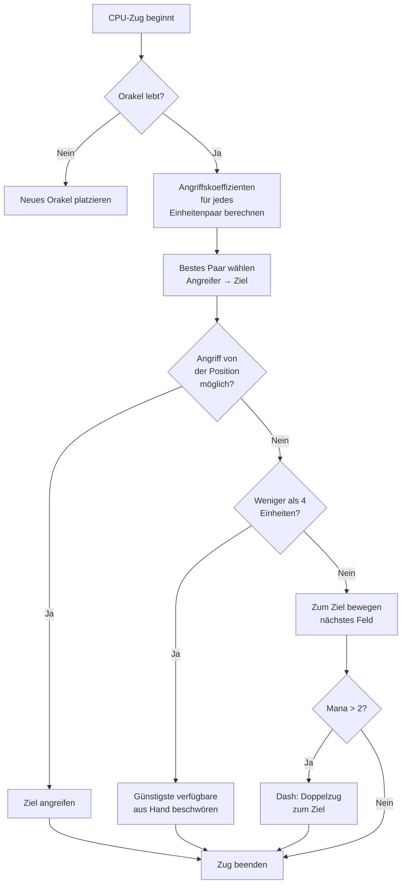

## Meine bekloppte KI für Nausicaa

Es gibt Projekte, die fangen an mit "hey, was wenn ich ein Schachspiel mit Mythologien mach?" und enden mit einem Ding, bei dem eine KI alle 5 Runden ihre eigenen Hyperparameter neu würfelt.

Nausicaa ist genau das. Ein rundenbasiertes Brettspiel, wo du dein Deck aus mythischen Kreaturen baust, dein Mana managst und Einheiten auf einem 10x8-Brett platzierst. Und dann ist da eine KI mit Persönlichkeitsstörungen.

Ich hab ziemlich viel Zeit in diese KI gesteckt, und das Ergebnis ist ziemlich unberechenbar xD

## Das Spiel in echt

Bevor ich über das Gehirn rede, musst du den Körper verstehen:

- 10x8-Brett, 2 Reihen Einsatzzone pro Spieler
- Mana startet bei 1, +1 pro Runde, max 6. Du bezahlst damit für Beschwörungen, Angriffe und Fähigkeiten
- Ziel : den gegnerischen Oracle weghauen

12 Einheiten, unterschiedliche Kosten und Bewegungsmuster:

| Unit | Kosten | Bewegung | HP |
| --- | --- | --- | --- |
| Oracle | 0 | König (8 Richtungen) | 1 |
| Goblin | 1 | 3 Felder vorwärts | 1 |
| Harpyie | 1 | König (8 Richtungen) | 1 |
| Najade | 1 | Diagonale | 1 |
| Greif | 2 | 2 Felder hüpfen | 2 |
| Sirene | 2 | Seitwärts | 1 |
| Zentaur | 2 | Springer (L-Form) | 2 |
| Bogenschütze | 3 | Seitwärts | 1 |
| Phönix | 3 | Diagonale (dunkle Felder) | 1 |
| Gestaltwandler | 4 | Platz tauschen | 1 |
| Seher | 4 | Keine (generiert Mana) | 1 |
| Titan | 6 | Eingeschränkt (Flächenangriff) | 3 |

Jede Einheit hat ihr eigenes Angriffsmuster. Die Sirene haut in alle 4 Diagonalen, der Bogenschütze feuert aus 3 Feldern Entfernung, der Titan zerlegt bei Beschwörung alles um sich rum. Kurz gesagt: Schach mit Mytogedöns und Deckbau xD

## Wie ich der CPU das Denken beigebracht hab

Die Grundidee ist lächerlich einfach: **Jede gegnerische Einheit hat einen Attraktivitätsfaktor**. Je gefährlicher sie ist, desto mehr will die KI sich um sie kümmern.

```javascript
const UNITS_ATTRACTIVENESS = {
    "oracle": 100,
    "titan": 95,
    "shapeshifter": 90,
    "phoenix": 80,
    "siren": 70,
    "archer": 70,
    "seer": 70,
    "griffin": 60,
    "centaur": 60,
    "harpy": 50,
    "naiad": 30,
    "gobelin": 20
};
```

Oracle auf 100 -- logisch, ist die Win-Bedingung. Titan auf 95, weil er bei Beschwörung alles in der Nähe oneshotted. Goblin auf 20, ist ein Fußsoldat, wen juckt's.

Dann für jedes Paar (eine eigene, eine feindliche Einheit) berechne ich:

```
interesse = attraktivitaet × coeff_attraktiv / (distanz × coeff_distanz)
```

Im Klartext: Je gefährlicher und näher du bist, desto mehr will die KI dich weghämmern.

```javascript
calculateAttackCoefficient(x1, y1, x2, y2) {
    const distance = this.calculateEuclideanDistance(x1, y1, x2, y2);
    if (distance === 0) return Infinity;
    return (UNITS_ATTRACTIVENESS[unit.type] * COEFFICIENTS_IMPORTANCE["attractiveness"]) / distance;
}
```

### Der Trick mit den wechselnden Koeffizienten

Das Lustige ist: die Gewichtung **ändert sich alle 5 Runden zufällig**.

```javascript
if (this.turnCount % 5 === 0) {
    const distanceCoefficient = parseInt(Math.random() * 100);
    const attractivenessCoefficient = parseInt(Math.random() * 100);
    this.regulateImportanceCoefficients({
        distance: distanceCoefficient,
        attractiveness: attractivenessCoefficient
    });
}
```

Einmal ist die KI hyperaggressiv (Attraktivität 95, Distanz 5), ballert durch alles durch um deinen Oracle zu killen. Nächstes Mal priorisiert sie Distanz und positioniert sich neu.

Das ist von Pac-Mans Geistern geklaut -- Blinky jagt, Pinky lauert auf. Hier wechselt die KI ihre "Persönlichkeit" jede Phase.

**Ergebnis: unmöglich, die KI über eine ganze Runde vorherzusagen.** Der CPU spielt nie zweimal dasselbe Match.

### Der Oracle ist eine Lusche

Der gegnerische Oracle haut ab. Buchstäblich.

```javascript
const awayFromTarget = {
    row: Math.max(0, Math.min(7, botUnitElement.row + (botUnitElement.row - targetUnitElement.row))),
    col: Math.max(0, Math.min(9, botUnitElement.col + (botUnitElement.col - targetUnitElement.col)))
};
```

Er berechnet die Gegenrichtung zur Bedrohung und macht sich vom Acker. Wenn ne Wand da ist, sucht er das nächste freie Feld in die Richtung.

Du brauchst 3 Runden um an den Oracle ranzukommen, und zack -- er ist abgehauen wie ne kleine Bitch xD

### Die Entscheidungsschleife

So entscheidet die KI:

1. Wenn ich keinen Oracle mehr hab (tot), neuen setzen
2. Koeffizient für jedes Paar eigene Einheit → feindliche Einheit berechnen
3. Bestes Paar auswählen
4. Wenn die Einheit das Ziel von ihrer Position aus angreifen kann → angreifen
5. Wenn ich weniger als 4 Einheiten hab → günstigste verfügbare aus der Hand beschwören
6. Sonst: zum Ziel bewegen (Feld, das der Einheit am nächsten ist)
7. Wenn genug Mana (> 2), Dash (Doppelzug) um noch näher ranzukommen
8. Wenn die Einheit der Oracle ist → fliehen



```javascript
async makeAction(dash=false) {
    // das Ganze in Sequence
    // der CPU dasht wenn er genug Mana hat
    if(botPlayer.mana > 2) {
        this.makeAction(true);
    }
}
```

### Warum euklidische Distanz

Ich nutze die euklidische Distanz:

```javascript
calculateEuclideanDistance(x1, y1, x2, y2) {
    const deltaX = Math.pow(x1 - x2, 2);
    const deltaY = Math.pow(y1 - y2, 2);
    return Math.sqrt(deltaX + deltaY) * COEFFICIENTS_IMPORTANCE["distance"];
}
```

Warum nicht Manhattan? Weil die Einheiten verschiedene Bewegungsmuster haben (L-Form wie der Springer, Diagonale, etc). Die Luftlinie ist ne bessere Annäherung an die Gefahr.

## Warum kein Minimax

Ich hätte auch nen klassischen Minimax bauen können. Aber mit 12 Einheitentypen, verschiedenen Bewegungsmustern, Spezialfähigkeiten... der Spielbaum explodiert so dermaßen, dass es unspielbar wird. Der heuristische Ansatz trifft intelligente Entscheidungen ohne 10 Millionen Zustände zu durchforsten.

## Was cool ist

Das Attraktivitätssystem erzeugt lustige Dilemmas:

- Der Seher (70) generiert Mana. Wenn du ihn leben lässt, hat der Gegner mehr Ressourcen. Aber der Titan (95) ist noch gefährlicher.
- Der Gestaltwandler (90) kann mit jeder Einheit den Platz tauschen. Er kann deinen Oracle klauen.
- Die Harpyie (50) hat einen explosiven Angriff, der sie selbst tötet. Nicht prio... bis sie neben 3 deiner Einheiten steht.

Die KI bewertet die globale Gefahr anhand der Positionen, nicht nur der Roh-Statuswerte.

Es gibt auch `activateSimulation()` um Szenarien zu testen, ohne ne ganze Runde zu spielen:

```javascript
activateSimulation() {
    // Platziert bestimmte Einheiten auf dem Brett
    // Nützlich zum Debuggen der KI
    this.game.board = simulation.board;
    this.game.players = simulation.players;
}
```

## Was fehlt

Wenn ich mehr Zeit gehabt hätte:

- Die KI reagiert nur auf den aktuellen Zustand, sie sagt nicht voraus, was der Spieler macht
- Sie plant ihre Hand nicht über mehrere Runden
- Der Gestaltwandler und der Zentaur haben Fähigkeiten, die sie unternutzt
- Reinforcement Learning: sie gegen sich selbst spielen lassen um die Koeffizienten zu optimieren

Aber für ein Browserspiel reicht's. Kumpels schaffen es dagegen zu verlieren, also ist gut xD

## Test es selbst

Verfügbar auf [nausicaa-game.github.io](https://nausicaa-game.github.io/). Klick auf "JOUER", CPU mode ON, und schau der KI zu.

Tipp: lass die KI gegen sich selbst spielen. Du siehst aggressive Phasen, und dann -- puff -- zieht sie sich komplett zurück.

Der Code liegt auf [GitHub](https://github.com/nausicaa-game/nausicaa-game.github.io) in `js/cpu.js`.

**3 Takeaways:**

1. **Heuristische Koeffizienten** -- kein Minimax, jede Einheit hat eine Attraktivität
2. **Koeffizienten wechseln alle 5 Runden** -- die KI wechselt zwischen Aggression und Kontrolle, Pac-Man-Style
3. **Der Oracle flieht** -- er berechnet die Gegenrichtung zur Bedrohung und macht sich vom Acker

Wenn du Ideen hast, um die KI noch fieser zu machen, mach ein Issue auf. Ich hab Pläne für ne Version, die aus ihren Niederlagen lernt, aber das kommt in nem anderen Artikel xD
