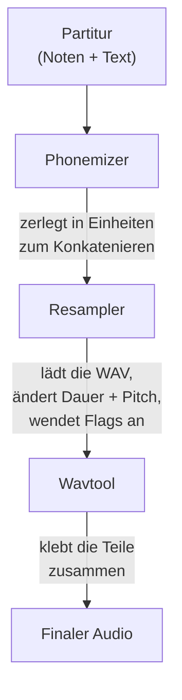

## UTAU : wie ein Visual-Basic-6-Programm die synthetische Stimme demokratisiert hat

Ich hab's auf meiner Hauptseite schon kurz angesprochen: ich liebe UTAU. Hier ist der Grund.

2008 hattest du, wenn du eine synthetische Stimme zum Singen bringen wolltest, genau eine Option: VOCALOID. Das Yamaha-Programm. Teuer, proprietär, mit offiziellen Stimmen, die du nicht selbst erstellen konntest.

Und dann kam irgendein japanischer Typ, Ameya/Ayame, der in seiner Freizeit ein Ding rausgehauen hat. Ein Programm, codiert in **Visual Basic 6**. Kostenlos. Mit dem du deine eigene Stimme erstellen konntest – mit... WAV-Dateien, die du selbst aufgenommen hast.

Das Ding heißt **UTAU** (歌う, "singen" auf Japanisch). Und für seine Zeit war das reine Magie.

Ich fand dieses Programm schon immer faszinierend. Nicht weil es technisch sauber war (Spoiler: also eigentlich doch, man musste schon echt drauf kommen, das Ding zu bauen... es ist ein einziges Chaos, ich heul mich weg), sondern weil es was gemacht hat, was sonst niemand gemacht hat: es hat Sprachsynthese an die breite Masse gebracht. Also echt, du, ich, jeder mit nem Mikrofon.

Lass mich dir erklären, warum das genial war.

---

## Warum Gesangssynthese erstmal richtig ätzend ist

Eine gesungene Stimme ist nicht einfach nur Noten. Du hast den Konsonanten am Anfang, den Vokal der gehalten wird, den Atem, die Übergänge zwischen den beiden. Das "sa" von "sagen" ist ein zischendes "s", das in ein offenes "a" übergeht – und genau dieser Übergang macht den menschlichen Klang aus.

Heute regelt man das mit Deep Learning: du trainierst ein Modell auf Stunden von Gesang und es generiert die Stimme (Synthesizer V, DiffSinger). Aber das ist 2020+. 2008? Fehlanzeige.

UTAU nutzt die ältere, klügere Methode von früher: **konkatenative Synthese**.

---

## Konkatenative Synthese: Copy-Paste von Stimm-Schnipseln

Die Idee ist simpel wie nix: du nimmst kleine Stimm-Schnipsel auf und klebst sie zusammen, um Wörter zu formen. "sagen" = Sample "sa" + "gen", aneinandergereiht. Ein Sound-Puzzle, gesteuert von einer Partitur.

Das ist das gleiche Prinzip wie bei YouTube Poops, wo man die Wörter einer Figur neu zusammenschneidet, damit sie irgendwelchen Blödsinn erzählt – nur dass es hier sauber und automatisiert ist.

Und UTAU kommt genau da her. Davor gab es den **"Jinriki Vocaloid"** (人力ボーカロイド, "manuel Vocaloid"): Leute haben händisch Sprachspuren geschnitten, Phoneme extrahiert, neu eingepitcht und in einem Audio-Editor wieder zusammengesetzt, um eine VOCALOID-Stimme zu imitieren. Von Hand. Was für ein Aufwand.

Ameya hat diesen Frust gesehen und das Tool zur Automatisierung programmiert. Ursprünglich war UTAU nur das: ein Assistent für manuellen Vocaloid.

---

## Warum das revolutionär war: DU erschaffst die Stimme

Hier ist der Game-Changer.

Bei VOCALOID hast du eine Stimme gekauft. Miku, Luka, etc. Von Profis erstellt, von Yamaha verkauft. Kein Weg, selbst eine zu machen. UTAU? **Jeder kann seine Stimme aufnehmen und daraus ein singendes Instrument machen.**

Der CV-Modus (der einfachste) funktioniert so: du nimmst die ~100 Grundsilben des Japanischen auf ("a", "ka", "sa", "ta"...), konfigurierst die Schnittpunkte, und fertig ist deine Voicebank. Ein paar Stunden Arbeit.

Ergebnis: Das Ökosystem ist explodiert. Tausende von Voicebanks, erstellt von der Community – Stimmen von Fans, Freunden, erfundenen Charakteren. Ein ganzes Universum virtueller Sänger, kostenlos. Und das Programm kam mit **Defoko** (Utane Uta), einer Standardstimme, die über die AquesTalk-TTS-Engine generiert wurde, also konntest du sofort loslegen, nicht mal ein Mikro nötig.

---

## Die oto.ini: das Herz des Systems

Woher weiß UTAU, wo es die Sounds schneiden und kleben muss? Über eine Konfigurationsdatei pro Voicebank: die **`oto.ini`**. Für jede WAV-Datei definiert sie die Schnittpunkte (in Millisekunden):

- **Offset** → Stille am Anfang, die weg muss
- **Preutterance** → der Punkt, an dem der Konsonant in den Vokal übergeht (die Grenze "s"→"a" in "sa")
- **Overlap** → wie sehr die vorherige Note in diese überlappt
- **Fixed Region** → der Teil, der NICHT gedehnt werden darf (typischerweise der Konsonant)
- **Cutoff** → wo das Ende abgeschnitten wird

Die **Preutterance** ist der cleverste Parameter. Eine Silbe hat immer ein Stück Konsonant vor dem Vokal. Damit deine Note genau auf den Takt fällt, muss der *Vokal* exakt treffen, nicht der Konsonant. Also verschiebt UTAU das Sample nach hinten: das "a" von "ka" landet auf dem Takt, das "k" läuft kurz davor. Wie ein Schlagzeuger, der seinen Schlag vorzieht, damit der Sound genau trifft – nur dass das in einer `.ini` passiert.

Visuell sehen die Zonen der `oto.ini` bei einem "ka"-Sample so aus:

```mermaid
flowchart LR
    A["🔇 Stille<br/>(offset)"] --> B["🅺 Konsonant<br/>(fixed region,<br/>nicht gedehnt)"]
    B --> C["🅰 Vokal<br/>(dehnbare Zone)"]
    C --> D["🔇 Ende abgeschnitten<br/>(cutoff)"]
    style B fill:#3b4a6b
    style C fill:#5b3b6b
```



Die Grenze zwischen Konsonant und Vokal ist die Preutterance. Der Vokal ist die Zone, die bei langen Noten gedehnt wird; der Konsonant bleibt intakt, sonst würde dein "k" zwei Sekunden dauern und furchtbar klingen.

```ini
# oto.ini (vereinfacht)
# datei=alias,offset,konsonant,cutoff,preutterance,overlap
_ka.wav=ka,120,80,-200,90,40
```

Fünf Werte pro Sound, für alle deine Samples, und UTAU setzt jedes Wort sauber zusammen.

---

## CV, VCV, CVVC: der Wettlauf um Realismus

Der Basismodus, **CV** (Konsonant-Vokal), ist ein Sound pro Silbe. Einfach, aber etwas roboterhaft: die Übergänge zwischen Silben sind roh.

2010 hat die Community dann **VCV** (Vokal-Konsonant-Vokal) erfunden. Statt "ka" allein nimmst du "a ka" auf – mit dem Ende des vorherigen Vokals. Der Übergang wird natürlich, weil er *im* Recording steckt, nicht nachträglich berechnet.

Das fiese Detail: **VOCALOID hatte VCV erst mit VOCALOID3, 2011.** Der Freeware-Tool in VB6, von einem einzelnen Typen programmiert, hat Yamaha um ein Jahr überholt – bei realistischen Übergängen. Eine Fan-Community war schneller als der Multinationale.

Danach kamen **CVVC**, **ARPAsing** (Englisch), **VCCV**... jede Methode hat den Realismus weiter getrieben, alle von der Community erfunden und dokumentiert.

---

## Die komplette Pipeline: wie ein Wort zu Sound wird

Wenn du eine Note setzt und einen Text eingibst, passiert hinter den Kulissen das hier:



Der **Resampler** ist das Herzstück: er nimmt dein "ka"-Sample, das in einer bestimmten Tonhöhe aufgenommen wurde, und streckt/pitcht es neu, damit es der gewünschten Note entspricht – und zwar nur im dehnbaren Bereich, während der Konsonant intakt bleibt (daher die `oto.ini`).

Und er ist **modular**. UTAU kam mit einem Basis-Resampler, aber die Community hat andere gebaut (moresampler, TIPS...), jeder mit eigener Klangfarbe. Du hast die Synthese-Engine ausgetauscht wie ein Plugin. 2008. In einem Freeware.

---

## Das Chaos unter der Haube (und warum es liebenswert ist)

Seien wir ehrlich zum technischen Zustand des Dings:

- **In Visual Basic 6 programmiert.** Eine Sprache, die 2008 schon tot war. Du brauchst die VB6-Runtime zum Laufen.
- **Ursprünglich Windows only** (der Mac-Port, UTAU-Synth, kam 2011).
- **Shift-JIS-Kodierung obligatorisch.** Wenn deine Dateien nicht in japanischem Shift-JIS kodiert sind, checkt UTAU gar nix. Bis heute musst du oft deinen PC auf japanische Locale stellen oder AppLocale benutzen, um es zu starten.
- **Schlichtes Interface**, Doku damals quasi 100% auf Japanisch.

Und trotzdem. Trotzdem hat dieses Ding eine weltweite Bewegung ausgelöst. Zehntausende Voicebanks. Songs mit Millionen Aufrufen.

Das beste Beispiel: **Kasane Teto**. Ein Charakter, 2008 als Aprilscherz erschaffen, der sich als VOCALOID ausgegeben hat. Ein Witz. Aber die Leute haben den Charakter geliebt, eine echte UTAU-Voicebank wurde draus gemacht, und Teto wurde eine der berühmtesten virtuellen Sängerinnen der Welt. 2023 hat sie sogar eine offizielle Synthesizer-V-Stimme bekommen. Ein Charakter, geboren aus einem Aprilscherz auf einer kostenlosen Software.

---

## Warum es heute noch zählt

UTAU ist das perfekte Beispiel dafür, wie eine "arme" Technologie durch Offenheit gewinnt.

VOCALOID war technisch überlegen, besser finanziert, professioneller. Aber geschlossen. UTAU war zusammengebaut, hässlich, in VB6 – aber es ließ alle mitmachen. Stimmen erstellen, Resampler bauen, Plugins schreiben, Aufnahmemethoden entwickeln. Die Community hat den Rest erledigt.

Und das Konzept lebt heute absolut weiter. **OpenUtau**, ein moderner Open-Source-Nachfolger, nimmt die Idee auf und entstaubt sie (plattformunabhängig, UTF-8, Support für moderne Resampler UND KI). Die konkatenative Synthese hält sich immer noch neben den Deep-Learning-Modellen, weil sie was hat, was die nicht haben: du verstehst genau, was passiert, und kontrollierst jede Millisekunde.

Das ist es, was mir an UTAU immer gefallen hat. Du siehst genau, was passiert. Es ist keine KI, die dir irgendein magisches Zeug ausspuckt, das du nicht checkst: du hast deine WAVs, deine Schnittpunkte, und du entscheidest über alles. Wenn es scheiße klingt, weißt du warum und kannst es fixen. Ich liebe diese Art von Kontrolle.

---

**Die 3 Dinge, die du dir merken solltest:**

1. **Konkatenative Synthese = Stimm-Puzzle** – UTAU klebt kleine WAV-Samples zusammen, um Wörter zu formen. Die `oto.ini` definiert, wo jeder Sound geschnitten und geklebt wird. Du kontrollierst alles auf die Millisekunde, ohne Blackbox.

2. **Offenheit schlägt Technik** – VOCALOID war besser aber geschlossen. UTAU war zusammengebastelt, aber ließ jeden seine Stimmen erstellen. Die Community hat das Ökosystem explodieren lassen und Yamaha sogar beim VCV überholt.

3. **Eine gute Idee überlebt ihren Code** – VB6, Shift-JIS, Windows only... und trotzdem läuft das Konzept heute noch via OpenUtau. Eine geniale Technologie kann mit Scheiße programmiert sein.

Ehrlich, allein für Kasane Teto, geboren aus einem Aprilscherz, hat dieses Programm Respekt verdient xD
