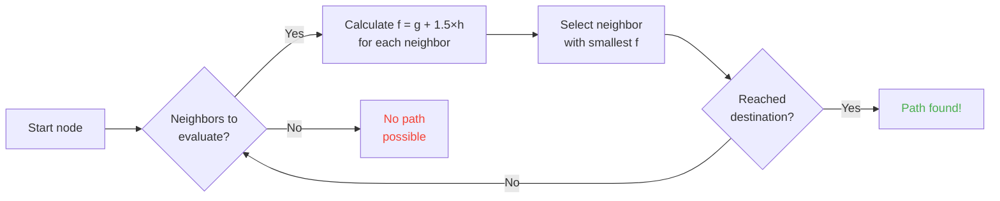

## Introduction

I've spent hours watching sheep bump into walls.

Best investment of my life xD

The more you watch these mobs, the more you realize nothing about their movement is random. Every step is coded, predictable, and most importantly -- breakable. I ended up digging through Minecraft's source code to understand exactly how pathfinding works, and what I found is that you can literally mind-control mobs. Like, force them to go where YOU want, not where randomness decides.

This guide is everything I found while digging. The AI system, the A* algorithm, the hidden malice values, the exploits you can pull in survival. Grab your pickaxe.

---

## How Mob AI Works (spoiler: it's kinda dumb)

### Goals

Every mob has a list of *goals*. Things it CAN do, and how badly it WANTS to do them. Lower number = higher priority. Like a todo list from hell.

```java
protected void registerGoals() {
   this.goalSelector.addGoal(4, new Zombie.ZombieAttackTurtleEggGoal(this, 1.0, 3));
   this.goalSelector.addGoal(8, new LookAtPlayerGoal(this, Player.class, 8.0F));
   this.goalSelector.addGoal(8, new RandomLookAroundGoal(this));
   this.addBehaviourGoals();
}
```

Ever seen a zombie ignore a turtle egg to chase you instead? That's why: `ZombieAttackTurtleEggGoal` has priority 4, while `ZombieAttackGoal` (the "eat your face" goal) is priority 2. Zombies prefer snacks with a pulse.

The goal we actually care about is `WaterAvoidingRandomStrollGoal`, priority 7. The "I got nothing better to do so I wander around" goal. This is where the fun begins.

### Movement (or "how a random walk has a 1 in 60 chance per tick")

Every tick (every 0.05 seconds), the game calls `canUse()` to check if the mob can be bothered to move. 1 in 60 chance per tick. Horrifically inefficient design, and I love it.

```java
public boolean canUse() {
   if (this.mob.hasControllingPassenger()) {
      return false;
   } else {
      if (!this.forceTrigger) {
         if (this.checkNoActionTime && this.mob.getNoActionTime() >= 100) {
            return false;
         }
         if (this.mob.getRandom().nextInt(reducedTickDelay(this.interval)) != 0) {
            return false;
         }
      }
      Vec3 $$0 = this.getPosition();
      if ($$0 == null) {
         return false;
      } else {
         this.wantedX = $$0.x;
         this.wantedY = $$0.y;
         this.wantedZ = $$0.z;
         this.forceTrigger = false;
         return true;
      }
   }
}
```

So to sum up: if you're riding the mob -> no, if the mob hasn't done anything in 5 seconds -> no, if RNG says no -> no. The game REALLY doesn't want mobs to move.

But when it does move, `getPosition()` takes over:

```java
protected Vec3 getPosition() {
   if (this.mob.isInWater()) {
      Vec3 $$0 = LandRandomPos.getPos(this.mob, 15, 7);
      return $$0 == null ? super.getPosition() : $$0;
   } else {
      return this.mob.getRandom().nextFloat() >= this.probability
         ? LandRandomPos.getPos(this.mob, 10, 7)
         : super.getPosition();
   }
}
```

Those two numbers at the end? XZ radius and Y radius. In water, the mob searches wider (15 vs 10). If it can't find land, it falls back to `super.getPosition()` which accepts water. **Result: mobs WANT to get out of water.** That's why your animals swim like maniacs toward the shore.

Fun detail: there's literally a 0.1% chance the mob picks `super.getPosition()` over `LandRandomPos`. One in a thousand. Mojang I guess xD

### LandRandomPos: the optimization that breaks everything

This is MY favorite step. The most beautiful technical mess that makes pathfinding exploitable.

```java
public static Vec3 getPos(PathfinderMob $$0, int $$1, int $$2, ToDoubleFunction<BlockPos> $$3) {
   boolean $$4 = GoalUtils.mobRestricted($$0, $$1);
   return RandomPos.generateRandomPos(() -> {
      BlockPos $$4xx = RandomPos.generateRandomDirection($$0.getRandom(), $$1, $$2);
      BlockPos $$5 = generateRandomPosTowardDirection($$0, $$1, $$4, $$4xx);
      return $$5 == null ? null : movePosUpOutOfSolid($$0, $$5);
   }, $$3);
}
```

`movePosUpOutOfSolid`. The name says it all. If the chosen position is inside a solid block, the game pushes it upward until it's in the air.

It's an optimization: instead of wasting time skipping underground positions, the game just shoves them to the surface. Smart? Yes. But it creates a MASSIVE bias: **mobs prefer high ground**.

Think about it. Lots of blocks underground, the game generates 10 random positions. The ones inside blocks get pushed up. Dense areas (under a hill) produce more valid positions than hollow areas. Result: the mob statistically goes toward the hill more often.

Trust me, we're about to break this wide open.

### The selection: best block wins

10 positions, one winner, a score contest:

```java
public static Vec3 generateRandomPos(Supplier<BlockPos> $$0, ToDoubleFunction<BlockPos> $$1) {
   double $$2 = Double.NEGATIVE_INFINITY;
   BlockPos $$3 = null;
   for(int $$4 = 0; $$4 < 10; ++$$4) {
      BlockPos $$5 = (BlockPos)$$0.get();
      if ($$5 != null) {
         double $$6 = $$1.applyAsDouble($$5);
         if ($$6 > $$2) {
            $$2 = $$6;
            $$3 = $$5;
         }
      }
   }
   return $$3 != null ? Vec3.atBottomCenterOf($$3) : null;
}
```

The position with the highest score WINS. And if you know the scoring criteria, you can make YOUR position win. It's like rigging an election.

---

## Mob Preferences (or "why your cow crossed the road")

Every mob has different tastes. And it changes everything.

| Mob | Loves |
| --- | --- |
| **Animals** (cows, sheep, pigs) | Grass blocks, light |
| **Monsters** (zombies, skeletons) | Darkness (hipsters) |
| **Turtles** | Water > sand > light |
| **Hoglins** | `crimson_nylium`; hate `warped_fungus` |
| **Striders** | Lava and NOTHING ELSE |
| **Silverfish** | Infestable blocks |
| **Guardians** | Water + light (snobs) |
| **Mooshrooms** | Mycelium + light |
| **Bees** | Air. Yes, they prefer AIR. |

```java
// Animal: look down, if grass -> max score
public float getWalkTargetValue(BlockPos $$0, LevelReader $$1) {
   return $$1.getBlockState($$0.below()).is(Blocks.GRASS_BLOCK) ? 10.0F : $$1.getPathfindingCostFromLightLevels($$0);
}

// Monster: literally the opposite
public float getWalkTargetValue(BlockPos $$0, LevelReader $$1) {
   return -$$1.getPathfindingCostFromLightLevels($$0);
}
```

Monsters are basically "if it's lit, negative score, I'm out." They throw a FIT at light levels xD

So you can -- literally -- guide animals with grass and light, and monsters with darkness. It's dumb and brilliant at the same time.

---

## A* in Minecraft (the secret formula)

Minecraft uses A* (A-star) for pathfinding. But Mojang added their own twist:

```
f(n) = g(n) + 1.5 × h(n)
```

- **g(n)** = distance already traveled (1 per block, ~1.41 diagonal)
- **h(n)** = straight-line distance to target
- **1.5** = because Mojang likes things slightly busted

Normal A* uses `f(n) = g(n) + h(n)`. MOJANG ADDED A 1.5 MULTIPLIER. Why? So the algorithm homes in on the destination faster and prunes fewer search branches. Result: the path is "good enough" but not always optimal. It's a drunk A*.



Key limitation: **a mob can only pathfind 16 blocks** (its *follow range*). If the destination is too far, it picks the closest reachable block. This means you can build a monolith out of range and the mob will path toward the closest block that gets it closer -- making its movement completely predictable.

### The two exploits that break the game

#### 1. Block updates force recalculation

```java
public boolean shouldRecomputePath(BlockPos $$0) {
   if (this.hasDelayedRecomputation) return false;
   if (this.path != null && !this.path.isDone() && this.path.getNodeCount() != 0) {
      Node $$1 = this.path.getEndNode();
      Vec3 $$2 = new Vec3(
         ((double)$$1.x + this.mob.getX()) / 2.0,
         ((double)$$1.y + this.mob.getY()) / 2.0,
         ((double)$$1.z + this.mob.getZ()) / 2.0
      );
      return $$0.closerToCenterThan($$2, (double)(this.path.getNodeCount() - this.path.getNextNodeIndex()));
   }
   return false;
}
```

Every block update near the mob's path forces an A* recomputation with a 1-second cooldown. Put a 1-second clock next to a mob and it recalculates CONSTANTLY. It's like a GPS that resets every second.

And if you do this with 50 mobs? Lag city. RIP TPS.

#### 2. Pathfinding Malice (block cost penalties)

Some blocks scare mobs. Literally. Every block has an associated cost defined by an enum:

| Block / Condition | Malice |
| --- | --- |
| **Honey block** | +8 to walk through |
| **Powder snow** | Impassable |
| **Closed doors** | Impassable |
| **Fire** | +16 through, +8 adjacent |
| **Animals & Villagers** | Fire = -1 (HARD NO) |
| **Cactus / Sweet berry** | Impassable; adjacent = +8 |
| **Water** | +8 through or adjacent |
| **Magma** | +8 adjacent |

Animals go even further:

```java
protected Animal(EntityType<? extends Animal> $$0, Level $$1) {
   super($$0, $$1);
   this.setPathfindingMalus(PathType.DANGER_FIRE, 16.0F);
   this.setPathfindingMalus(PathType.DAMAGE_FIRE, -1.0F);
}
```

DAMAGE_FIRE at -1.0F is literally "forbidden." An animal would rather jump into the void than walk through fire.

### Exercise: the great path contest

A villager choosing between multiple paths:

- **Path A**: 15 blocks but 6 border water (+8 each)
- **Path B**: 18 blocks with 2 water blocks (+8) + 1 water-adjacent (+8)
- **Path C**: 14 blocks straight... but fire -> IMPASSABLE for villagers
- **Path D**: 16 blocks with 1 magma-adjacent (+8) + 1 honey-adjacent (+8)
- **Path E**: 25 blocks with cacti everywhere (+8 everywhere) -> 90.82 total LOL

The winner is usually **Path B**: the detour pays off because water is EXPENSIVE.

A villager is basically a cost calculator with legs xD

### Every mob picks different paths

A villager: "fire? NOPE BYE"
A zombie: "fire? OK boomer *walks through on fire*"

You can literally build highways that villagers take and zombies won't -- or vice versa.

---

## Villagers: the ultimate mess

Villagers are the most misunderstood thing in Minecraft. But once you've read the code, you realize they're just predictable machines with office hours.

### Sensors and memories

9 sensors running every 20 ticks (1 second). Each scans a radius around the villager and stores the result in memory. The villager sees everything, remembers everything, and acts accordingly.

### Activity packages

A villager's brain is divided into activity packages that activate based on the time:

| Package | Time | The villager... |
| --- | --- | --- |
| **Core** | 24/7 | Opens doors, swims (80% of the time), ACQUIRES POIs |
| **Work** | 8am-3pm | "Gotta work" -- walks to workstation |
| **Meet** | 3pm-5pm | "Happy hour!" -- goes to the bell, socializes |
| **Rest** | 6pm-6am | "Bed time" -- goes to bed |
| **Idle** | 6am-8am, 5pm-6pm | "Bored" -- wanders, breeds, jumps on beds |
| **Panic** | Hurt / hostile | "RUN" -- FLEES |

**Panic** is the only package that can interrupt ALL others. Even if the villager is sleeping or working, if there's a zombie, PANIC MODE.

### Acquire POI: the mechanic that enables wireless redstone

```java
Set<Pair<Holder<PoiType>, BlockPos>> $$12 = (Set)$$10xx.findAllClosestFirstWithType(
   $$0, $$11, $$8x.blockPosition(), 48, PoiManager.Occupancy.HAS_SPACE
)
```

`Acquire POI` scans a 48-block radius for all valid points of interest. It keeps the 5 closest, checks if a path exists, and acquires the closest reachable one. Each POI has limited slots:
- **Workstations**: 1 slot
- **Beds**: 1 slot
- **Bells**: 32 slots

The INSANE thing: **the slot is reserved at ACQUISITION time, not on arrival**. A villager can lock a composter from across the map without ever reaching it.

You see where this is going?

### Wireless redstone. Yes, WIRELESS.

1. Put a villager in a minecart with a path to a composter
2. It acquires the composter (slot taken, nobody else can use it)
3. The villager is too far to click it -- bonemeal stays
4. MOVE this villager ANYWHERE in the world, it keeps the slot
5. When you want to activate your thing, KILL the villager
6. Slot releases, another villager acquires the composter, removes bonemeal
7. BLOCK UPDATE -> any redstone circuit activated

You've created wireless redstone, transmittable across the entire world, with zero chunk loading needed on the path. Hook this to an ender pearl stasis chamber and teleport yourself from anywhere by killing a villager.

My favorite use? A bounty hunter minigame: multiple villagers with composters, the player has to kill THE RIGHT villager to activate the exit. Completely wtf mechanic xD

### The Pathfinding Deadlock (or "the villager that freezes forever")

There's a bug between `Acquire POI` (which sees a path) and the actual navigation (which refuses to follow it). Happens when the block above a workstation isn't walkable. Result:

- Core package: "I want to acquire the POI"
- Navigation: "I can't walk there"
- Result: the villager stays FROZEN, forever, fighting itself.

Literally frozen villagers, usable as decoration or props. An armor stand tank? Yes. A guard that doesn't move? Yes. Macabre? Maybe. Effective? Totally xD

---

## Conclusion

Mob pathfinding in Minecraft isn't random. It's a deterministic, score-based system, predictable AND breakable.

**Three things to remember:**

1. **Solid blocks underneath = height bias** -- fill or empty the subfloor to guide mobs
2. **Malice is different per mob** -- create routes that some take and others don't
3. **POI slots reserved at distance** -- free wireless redstone, teleportation, all of it

Minecraft's source code is a goldmine of under-exploited mechanics. I spent hours reading decompiled Java and honestly? Every line is a functional Easter Egg. Except these ones work in survival for wireless redstone with villagers. Best game confirmed xD
