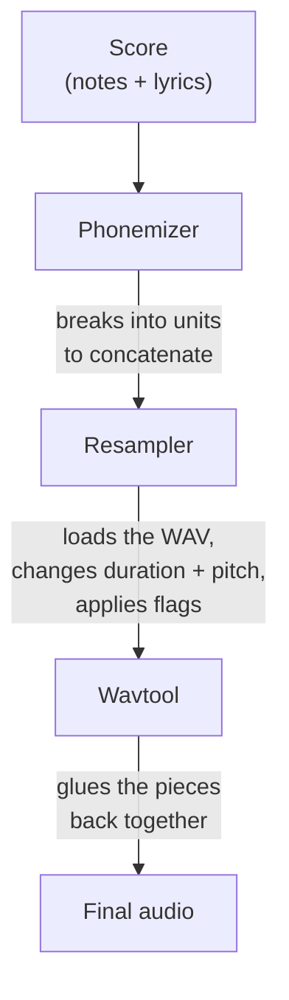

## UTAU: how a Visual Basic 6 app democratized synthetic singing

I mentioned it on my main page: I love UTAU. Here's why.

Back in 2008, if you wanted to make a synthetic voice sing, you had one option: VOCALOID. Yamaha's software. Expensive, proprietary, with official voicebanks you couldn't create yourself.

Then some Japanese guy, Ameya/Ayame, dropped a thing he'd made in his corner. A piece of software coded in **Visual Basic 6**. Free. That let you create your own voice using... WAV files you recorded yourself.

This thing is called **UTAU** (歌う, "to sing" in Japanese). And for its time, it was magic.

I've always found this software fascinating. Not because it was technically clean (spoiler: actually yeah, you really had to be something else to make this thing -- it's a beautiful mess, I'm crying over this chicken), but because it did something nobody else did: it put voice synthesis in the hands of the public. Like you, me, anyone with a mic.

Let me explain why this was awesome.

---

## First, why singing synthesis is a pain

A singing voice isn't just notes. You've got the consonant attack, the vowel sustain, the breath, the transitions between them. The "sa" in "salut" is an "s" that hisses then slides into an open "a", and it's that slide that makes it sound human or not.

These days you fix that with deep learning: train a model on hours of singing and it generates the voice (Synthesizer V, DiffSinger). But that's 2020+. In 2008, nothing.

UTAU uses the older, smarter method: **concatenative synthesis**.

---

## Concatenative synthesis: copy-pasting voice bits together

The idea is dead simple: you record little chunks of voice and glue them together to form words. "hello" = sample "heh" + "low", chained together. A sound puzzle driven by a score.

It's the same principle as YouTube Poop where you cut up a character's words to make them say random stuff -- except here it's clean and automated.

And UTAU literally comes from that. Before it, there was **"Jinriki Vocaloid"** (人力ボーカロイド, "Manual Vocaloid"): people manually cut up vocal tracks, extracted phonemes, repitched them, and reassembled everything in an audio editor to mimic a VOCALOID voice. By hand. Imagine the work.

Ameya looked at that pain and coded the tool to automate it. Originally UTAU was just that: an assistant for Manual Vocaloid.

---

## Why it was revolutionary: YOU create the voice

Here's the game-changer.

With VOCALOID, you bought a voice. Miku, Luka, etc. Made by pros, sold by Yamaha. No way to make one yourself. UTAU, **anyone records their voice and turns it into a singing instrument**.

CV mode (the simplest) is: you record the ~100 basic Japanese syllables ("a", "ka", "sa", "ta"...), configure the cut points, and there's your voicebank. A few hours of work.

Result: the ecosystem exploded. Thousands of community-created voicebanks -- fan voices, friends' voices, made-up characters. A whole universe of virtual singers, free. And the software came with **Defoko** (Utane Uta), a default voice generated via the AquesTalk TTS engine, so you could start even without a mic.

---

## The oto.ini: the heart of the system

How does UTAU know where to cut and glue sounds? Through a config file per voicebank: **`oto.ini`**. For each WAV, it defines cut points (in milliseconds):

- **Offset** → silence to remove at the start
- **Preutterance** → the point where the consonant transitions to the vowel (the "s"→"a" boundary in "sa")
- **Overlap** → how much the previous note overlaps with this one
- **Fixed region** → the part that should NOT be stretched on a long note (typically the consonant)
- **Cutoff** → where to cut the end

The **preutterance** is the smartest parameter. A syllable always has a bit of consonant before the vowel. For your note to land on the beat, the *vowel* needs to hit exactly, not the consonant. So UTAU shifts the sample backward: the "a" of "sa" lands on the beat, the "s" spills just before. Like a drummer who anticipates their hit so the sound lands on time -- except it's in a `.ini`.

Visually, on a "ka" sample, the `oto.ini` zones break down like this:

```mermaid
flowchart LR
    A["🔇 silence<br/>(offset)"] --> B["🅺 consonant<br/>(fixed region,<br/>not stretched)"]
    B --> C["🅰 vowel<br/>(stretchable zone)"]
    C --> D["🔇 end cut<br/>(cutoff)"]
    style B fill:#3b4a6b
    style C fill:#5b3b6b
```



The boundary between consonant and vowel is the preutterance. The vowel is the zone you stretch for long notes; the consonant stays intact, otherwise your "k" would last two seconds and sound horrible.

```ini
# oto.ini (simplified)
# file=alias,offset,consonant,cutoff,preutterance,overlap
_ka.wav=ka,120,80,-200,90,40
```

Five values per sound across all your samples, and UTAU assembles any word cleanly.

---

## CV, VCV, CVVC: the realism race

The base mode, **CV** (Consonant-Vowel), is one sound per syllable. Simple but a bit robotic: syllable joints are crude.

In 2010 the community invented **VCV** (Vowel-Consonant-Vowel). Instead of recording "ka" alone, you record "a ka" -- with the tail of the previous vowel. The transition becomes natural because it's *in* the recording, not calculated afterward.

The spicy detail: **VOCALOID didn't get VCV until VOCALOID3 in 2011.** The VB6 freeware coded by one guy on his own beat Yamaha by a year on realistic transitions. A fan community faster than the multinational.

Then came **CVVC**, **ARPAsing** (English), **VCCV**... each method pushing realism further, all invented and documented by the community.

---

## The full pipeline: how a word becomes sound

When you place a note and type lyrics, here's what happens behind the scenes:



The **resampler** is the centerpiece: it takes your "ka" sample recorded at a given pitch and stretches/repitches it to match the target note -- only stretching the stretchable zone while keeping the consonant intact (hence `oto.ini`).

And it's **modular**. UTAU came with a basic resampler, but the community made others (moresampler, TIPS...), each with its own sound signature. You swapped synthesis engines like a plugin. In 2008. On a freeware.

---

## The mess under the hood (and why it's endearing)

Gotta be honest about the technical state of this thing:

- **Coded in Visual Basic 6.** A language already dead in 2008. You need the VB6 runtime to run it.
- **Windows only originally** (the Mac port, UTAU-Synth, came in 2011).
- **Shift-JIS encoding required.** If your files aren't encoded in Japanese Shift-JIS, UTAU understands nothing. Even today you often need to set your PC to Japanese locale or use AppLocale to launch it.
- **Austere interface**, documentation was almost 100% in Japanese back then.

And yet. Yet this thing created a worldwide movement. Tens of thousands of voicebanks. Songs listened to millions of times.

The best example: **Kasane Teto**. A character created in 2008 and dropped as an April Fools' prank, pretending to be a VOCALOID. It was a joke. Except people loved the character, a real UTAU voicebank was made for her, and Teto became one of the most famous virtual singers in the world. In 2023 she even got an official Synthesizer V voice. A character born from an April Fools' joke on free software.

---

## Why it still matters

UTAU is the perfect example of a "poor" tech that wins through openness.

VOCALOID was technically superior, better funded, more pro. But closed. UTAU was janky, ugly, in VB6 -- but it let everyone participate. Create voices, create resamplers, create plugins, create recording methods. The community did the rest.

And the concept fully survives today. **OpenUtau**, a modern open-source successor, takes the idea and dusts it off (cross-platform, UTF-8, support for both modern resamplers AND AI). Concatenative synthesis still holds its own next to deep learning models, because it has something they don't: you understand exactly what's happening, and you control every millisecond.

That's what I've always loved about UTAU. You see exactly what's going on. It's not an AI spitting out some magical thing you don't understand: you've got your WAVs, your cut points, and you're the one who decides everything. When it sounds bad, you know why and you can fix it. I love that kind of control.

---

**3 things to remember:**

1. **Concatenative synthesis = voice puzzle** -- UTAU glues little WAV samples together to form words. The `oto.ini` defines where to cut and glue each sound. You control everything, down to the millisecond, no black box.

2. **Openness beats technology** -- VOCALOID was better but closed. UTAU was janky but let everyone create their own voices. The community blew up the ecosystem, and even beat Yamaha to VCV.

3. **A good idea outlives its code** -- VB6, Shift-JIS, Windows only... and yet the concept still runs through OpenUtau. A great technology can be coded like absolute garbage.

Honestly, just for Kasane Teto born from an April Fools' joke, this software deserves respect xD
