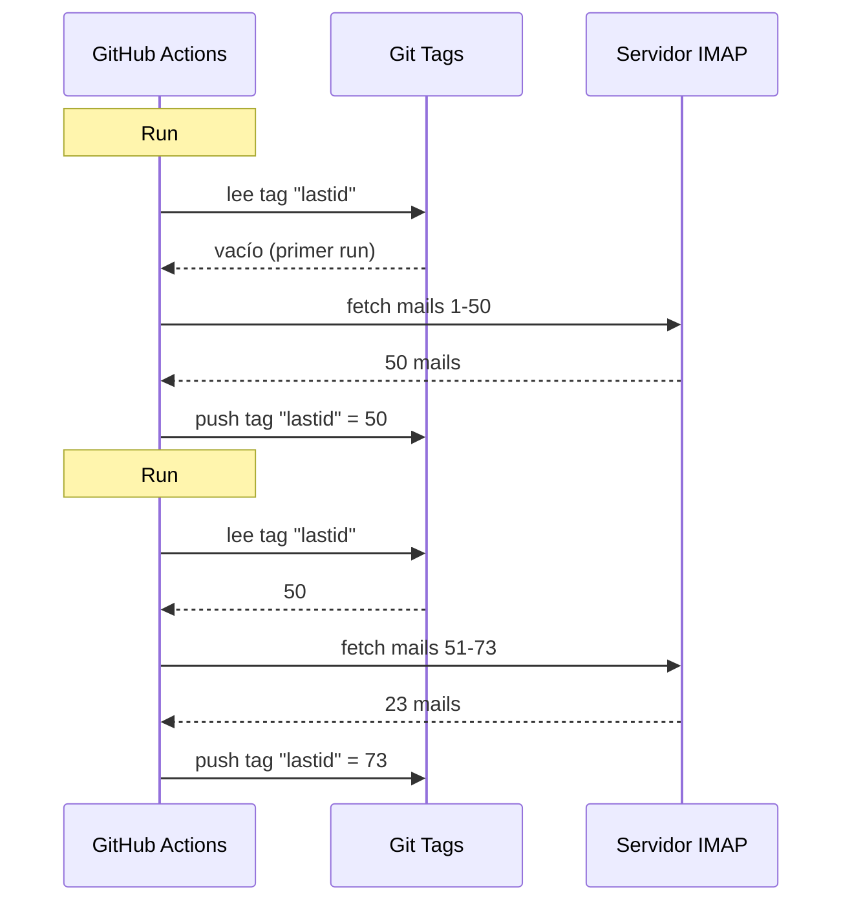

# Usé git como base de datos para hacer funcionar un bot gratis en GitHub Actions

Tengo un respondedor de email automático que funciona 24/7.

Lee mis mails, entiende de qué hablan, y responde solo con una IA. Recuerda conversaciones anteriores. Ignora newsletters y `noreply@`. Reenvía a un humano cuando es demasiado heavy.

Coste mensual: **0€**.

Sin servidor. Sin VPS. Sin base de datos. Solo GitHub Actions y un hack de locos: **usar git como base de datos**.

¿Ves por dónde voy? ¿No? Bueno, agárrate, que es estúpido y genial a la vez.

---

## El problema: GitHub Actions es stateless

GitHub Actions es gratis. Puedes lanzar un cron cada 5 minutos, hacer funcionar tu código, gratis.

Pero hay un problema: es **stateless**.

Cada ejecución arranca en una máquina virgen. Nada se guarda entre ejecuciones. ¿La ejecución anterior? Olvidada. Borrada. Como si nunca hubiera existido.

Para un respondedor de email, eso es un problema enorme. O sea:

> "¿Cuál es el último mail que ya procesé?"

Si el bot olvida eso en cada ejecución, va a re-responder los mismos mails en bucle (catástrofe) o va a saltarse mails.

Hace falta un estado persistente. Y normalmente, estado persistente = base de datos. Pero una base de datos es un servidor, y un servidor ya no es gratis.

Ahí es donde se pone interesante.

---

## La solución: git tags como base de datos

Tu repo de GitHub ya es almacenamiento persistente. Gratis. Versionado. Siempre ahí.

Entonces, ¿por qué no guardar el estado ahí?

La idea: en cada ejecución, el bot lee el último UID de email procesado desde un **git tag**. Procesa los mails nuevos. Luego vuelve a hacer push del tag con el nuevo UID.



El tag git ES la base de datos. Un solo valor, pero es todo lo que necesitas.

### Leer el estado

Al inicio del job, recuperas el valor desde el tag:

```bash
git fetch origin --tags lastid || true
git show refs/tags/lastid:data/lastId > data/lastId || true
```

`git show refs/tags/lastid:data/lastId` significa: "dame el contenido del archivo `data/lastId` tal como estaba en el tag `lastid`".

Boom. Ya tienes el valor, sin base de datos.

### Escribir el estado

Al final, recreas el tag con el nuevo valor:

```bash
git switch --orphan lastid-tmp   # rama virgen sin historial
git rm -rf .                      # vaciamos todo
mkdir -p data
printf "%s\n" "${LAST_ID_CONTENT}" > data/lastId

git add data/lastId
git commit -m "lastId snapshot"
git tag -f lastid                 # forzamos el tag en este commit
git push --force ...origin lastid # hacemos push del tag
```

Creas una rama **huérfana** (sin historial), pones solo el archivo `lastId`, commiteas, taggeas, haces force push.

¿Por qué huérfana? Para no acumular 10 000 commits de estado en el historial del repo. Cada actualización sobreescribe la anterior. El tag siempre apunta a UN solo commit que contiene UN solo valor.

Es limpio. Es gratis. Es completamente roto xD

---

## El segundo hack: el runtime snapshot

Hay otro problema con GitHub Actions: el `npm install`.

Si en cada ejecución (cada 5 minutos) haces `npm install` + `npm run build`, pierdes 60-90 segundos cada vez. En un cron frecuente, son minutos de compute desperdiciados para nada.

Solución: pre-compilar el código UNA vez, y almacenarlo en un git tag también.

El workflow de build (que se ejecuta cuando haces push a `master`) hace esto:

```bash
# compila el código
bun install
bun run build

# guarda dist/ + node_modules/ en un tag "runtime"
git checkout --orphan temp-runtime
git rm -rf .
cp -r "$TMPDIR"/* .
git add dist node_modules package.json bun.lock data
git commit -m "runtime build"
git tag -f runtime
git push --force ...origin runtime
```

El tag `runtime` contiene el código compilado Y los `node_modules`. Listo para ejecutar.

Y el cron, directamente hace checkout de ese tag:

```yaml
- name: Checkout runtime snapshot
  uses: actions/checkout@v4
  with:
    ref: refs/tags/runtime    # el código pre-compilado, no el fuente
    fetch-depth: 1

# sin npm install, sin build
- name: Process emails
  run: node dist/index.js --action
```

Sin install. Sin build. El cron arranca al instante y ejecuta solo `node dist/index.js`.

O sea, tienes dos tags que hacen dos trabajos:
- `runtime` = el código listo para ejecutar (actualizado cuando haces push de código)
- `lastid` = el estado persistente (actualizado en cada ejecución)

Es elegante como él solo.

---

## El bot en sí: auto-respondedor IA

Bueno, el hack de git está guay, pero ¿qué hace el bot exactamente?

Lee tus mails via IMAP, los entiende con una IA (Groq + Llama 3.3 70B), y responde automáticamente.

Arquitectura en servicios limpios con inyección de dependencias (InversifyJS):

```
App
├── ImapService      → lee los mails (IMAP)
├── SmtpService      → envía las respuestas (SMTP)
├── ParserService    → parsea el contenido de los mails
├── ReplyService     → genera la respuesta IA
├── SummaryService   → memoria de conversación
├── AccountsService  → gestiona varias cuentas email
└── ConfigService    → config / env vars
```

### Dos modos de funcionamiento

El bot puede funcionar de dos formas:

**Modo listener** (tiempo real): conexión IMAP permanente con reconexión exponencial. Para un VPS.

```typescript
this.imapService.on("exists", async (data) => {
  console.log(`[MAIL] Nuevo mail recibido! Total: ${data.count}`);
  // procesa el nuevo mail inmediatamente
});
```

**Modo action** (batch): procesa los mails nuevos desde el `lastId`, luego se cierra. Para el cron de GitHub Actions.

```bash
node dist/index.js --action
```

El modo `--action` es el que usa el hack de git. Lee `lastId`, procesa lo nuevo, escribe el nuevo `lastId`, fin.

### NO responder a robots

Si tu bot responde a TODOS los mails, va a responder a newsletters, notificaciones, `noreply@`. Catástrofe. Peor: si dos bots se responden el uno al otro, tienes un bucle infinito de mails. La pesadilla.

Así que filtrado agresivo:

```typescript
export function isAutomatedSender(address) {
  const automatedPatterns = [
    "noreply", "no-reply", "donotreply",
    "mailer-daemon", "postmaster", "bounce",
    "newsletter", "notification", "marketing",
    "billing", "receipt", "promo", ...
  ];
  const local = address.split("@")[0].toLowerCase();
  return automatedPatterns.some(p => local.includes(p));
}
```

Y también detección via headers de email:

```typescript
export function isAutomatedByHeaders(headers) {
  return (
    ["bulk", "list", "junk"].includes(headers.precedence) ||
    headers["auto-submitted"] !== "no" ||
    headers["list-unsubscribe"] !== "" ||   // las newsletters tienen esto
    /mailchimp|sendgrid|mailgun|brevo/i.test(headers["x-mailer"])
  );
}
```

¿`List-Unsubscribe` en los headers? Es una newsletter. ¿`Precedence: bulk`? Es mass-mailing. ¿`X-Mailer: Mailchimp`? Ya te haces una idea. Lo ignoramos.

Es como un portero de discoteca: los robots no pasan xD

### Los triggers mágicos

La IA puede decidir no responder, o pasar el tema a un humano. ¿Cómo? Con triggers especiales en su respuesta.

El prompt del sistema le dice:

> Si es un mail automático/newsletter → responde `<no_reply>`
> Si es demasiado importante/sensible (legal, financiero...) → responde `<manual_reply_required>`
> Si no → escribe una respuesta de verdad

Y el código lee eso:

```typescript
const aiReply = completion.choices[0].message.content.trim();
const manualTrigger = aiReply.includes(MANUAL_REPLY_TRIGGER);
const noReply = aiReply.includes(NO_REPLY_TRIGGER);

if (noReply) {
  console.log("[MAIL] La IA decidió ignorar. Skip.");
  return;
}

if (manualTrigger) {
  console.log("[MAIL] Demasiado heavy, reenvío a un humano.");
  await this.smtpService.sendManualForward(...);
  return;
}

// si no, enviamos la respuesta IA
await this.smtpService.sendReply(...);
```

O sea, la IA tiene derecho a decir "no, aquí no meto las manos, llama a un humano de verdad". Eso es sabiduría.

---

## La memoria de conversación

Un detalle que lo cambia todo: el bot **recuerda** las conversaciones.

Cuando responde a alguien, guarda un resumen del intercambio. La próxima vez que esa persona escriba, el resumen se reinyecta en el prompt.

Almacenamiento: un archivo JSON por contacto.

```
data/customers/
├── moi%40gmail.com/
│   ├── alice%40example.com.json
│   └── bob%40client.fr.json
```

Y el resumen lo genera la propia IA, que fusiona el resumen antiguo con el mensaje nuevo:

```typescript
const completion = await groq.chat.completions.create({
  model: "llama-3.3-70b-versatile",
  messages: [
    { role: "system", content: "Eres un asistente de memoria. Fusiona el resumen antiguo con el mensaje nuevo sin perder información." },
    { role: "user", content: `Resumen existente:\n${existing}\n\nNuevo mensaje:\n${incomingContent}` }
  ],
  temperature: 0.0,  // determinista, sin creatividad
  max_tokens: 800,
});
```

Así que el bot construye una memoria comprimida con el tiempo. Sin necesidad de guardar todos los mails, solo un resumen que crece inteligentemente.

¿Y esos archivos JSON? Pues... también están guardados en git, en el runtime tag. Git por todas partes xD

---

## El truco listo con la longitud del prompt

Pequeño detalle técnico que me hizo sonreír.

Los modelos tienen un límite de tokens. Si tu mail + el resumen + el persona prompt se pasan, la API devuelve un error.

El código lo maneja con un **truncado en cascada** + retry:

```typescript
try {
  // primer intento con los límites normales
  completion = await groq.chat.completions.create({...});
} catch (error) {
  if (!this.isLengthError(error)) throw error;

  // fue un error de longitud: reintentamos con límites más ajustados
  ({ systemContent, userContent } = this.buildPromptPayload({
    ...,
    limits: {
      systemPromptChars: 2200,  // en vez de 3000
      summaryChars: 1800,       // en vez de 4000
      personaChars: 900,        // en vez de 1500
      userContentChars: 2200,   // en vez de 8000
    },
  }));
  completion = await groq.chat.completions.create({...});  // retry
}
```

Si no funciona, recortamos más y reintentamos. Simple, eficaz, sin crash.

---

## Bueno, y concretamente, ¿cómo funciona?

El flujo completo de una ejecución de cron:

```
1. GitHub Actions se dispara (cron cada 5 min)
2. Checkout del tag "runtime" (código pre-compilado)
3. git show refs/tags/lastid → obtiene el último UID procesado
4. node dist/index.js --action
   ├── conexión IMAP
   ├── fetch de los mails desde lastId+1
   ├── para cada mail:
   │   ├── parsea el contenido
   │   ├── filtra robots (skip si automated)
   │   ├── coincide con la cuenta destinataria
   │   ├── recupera la memoria de conversación
   │   ├── genera la respuesta IA (Groq)
   │   ├── <no_reply> ? skip
   │   ├── <manual_reply_required> ? reenvío a humano
   │   ├── si no: envía la respuesta (SMTP)
   │   └── actualiza la memoria de conversación
   └── escribe el nuevo lastId
5. git push --force tag "lastid" con el nuevo valor
```

Y vuelve a empezar en 5 minutos. Para siempre. Gratis.

---

**Las 3 cosas que recordar:**

1. **Git = base de datos gratis** -- Un tag huérfano puede guardar tu estado persistente entre ejecuciones stateless. `git show refs/tags/X:archivo` para leer, force-push para escribir. Sin necesidad de DB.

2. **Pre-compila en un tag runtime** -- En vez de `npm install` en cada ejecución del cron, guarda el código compilado + node_modules en un tag git. El cron arranca al instante.

3. **Un bot IA debe saber callarse** -- Los triggers `<no_reply>` y `<manual_reply_required>` dejan que la IA decida no responder o pasar la pelota. Más el filtrado anti-robot. Si no, creas un bucle infinito de mails.

Serverless cron con estado persistente, IA, memoria, todo a 0€/mes. Está completamente roto y me encanta xD
