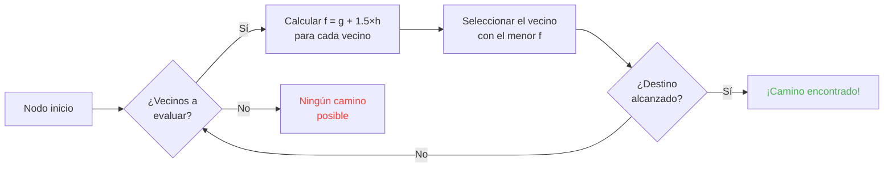

## Introducción

Pasé horas viendo ovejas chocarse contra paredes.

La mejor inversión de mi vida xD

Cuanto más miras a estos mobs, más te das cuenta de que nada en su movimiento es aleatorio. Cada paso está codificado, es predecible y, lo más importante, se puede romper. Terminé escarbando en el código fuente de Minecraft para entender exactamente cómo funciona el pathfinding, y lo que encontré es que literalmente puedes controlar mentalmente a los mobs. Como, forzarlos a ir a donde TÚ quieres, no donde la random decide.

Esta guía es todo lo que encontré mientras investigaba. El sistema de IA, el algoritmo A*, los valores ocultos de malicia, los exploits que puedes usar en survival. Agarra tu pico.

---

## Cómo funciona la IA de los Mobs (spoiler: es medio tonta)

### Goals

Cada mob tiene una lista de *goals* (objetivos). Cosas que PUEDE hacer y qué tanto QUIERE hacerlas. Número más bajo = mayor prioridad. Como una lista de tareas del infierno.

```java
protected void registerGoals() {
   this.goalSelector.addGoal(4, new Zombie.ZombieAttackTurtleEggGoal(this, 1.0, 3));
   this.goalSelector.addGoal(8, new LookAtPlayerGoal(this, Player.class, 8.0F));
   this.goalSelector.addGoal(8, new RandomLookAroundGoal(this));
   this.addBehaviourGoals();
}
```

¿Alguna vez viste a un zombie ignorar un huevo de tortuga para perseguirte a ti? Por eso: `ZombieAttackTurtleEggGoal` tiene prioridad 4, mientras que `ZombieAttackGoal` (el objetivo "cómete la cara") es prioridad 2. Los zombies prefieren bocadillos con pulso.

El goal que realmente nos importa es `WaterAvoidingRandomStrollGoal`, prioridad 7. El objetivo de "no tengo nada mejor que hacer, así que deambulo". Aquí empieza la diversión.

### Movimiento (o "cómo un paseo aleatorio tiene 1 de 60 probabilidades por tick")

Cada tick (cada 0.05 segundos), el juego llama a `canUse()` para ver si el mob se molesta en moverse. 1 de 60 probabilidades por tick. Diseño horriblemente ineficiente, y me encanta.

```java
public boolean canUse() {
   if (this.mob.hasControllingPassenger()) {
      return false;
   } else {
      if (!this.forceTrigger) {
         if (this.checkNoActionTime && this.mob.getNoActionTime() >= 100) {
            return false;
         }
         if (this.mob.getRandom().nextInt(reducedTickDelay(this.interval)) != 0) {
            return false;
         }
      }
      Vec3 $$0 = this.getPosition();
      if ($$0 == null) {
         return false;
      } else {
         this.wantedX = $$0.x;
         this.wantedY = $$0.y;
         this.wantedZ = $$0.z;
         this.forceTrigger = false;
         return true;
      }
   }
}
```

En resumen: si estás montando al mob -> no, si el mob no ha hecho nada en 5 segundos -> no, si RNG dice no -> no. El juego DE VERDAD no quiere que los mobs se muevan.

Pero cuando se mueve, `getPosition()` toma el control:

```java
protected Vec3 getPosition() {
   if (this.mob.isInWater()) {
      Vec3 $$0 = LandRandomPos.getPos(this.mob, 15, 7);
      return $$0 == null ? super.getPosition() : $$0;
   } else {
      return this.mob.getRandom().nextFloat() >= this.probability
         ? LandRandomPos.getPos(this.mob, 10, 7)
         : super.getPosition();
   }
}
```

¿Esos dos números al final? Radio XZ y radio Y. En el agua, el mob busca más lejos (15 vs 10). Si no encuentra tierra, usa `super.getPosition()` que acepta agua. **Resultado: los mobs QUIEREN salir del agua.** Por eso tus animales nadan como locos hacia la orilla.

Dato curioso: hay literalmente 0.1% de probabilidad de que el mob elija `super.getPosition()` en vez de `LandRandomPos`. Uno en mil. Mojang supongo xD

### LandRandomPos: la optimización que rompe todo

Este es MI paso favorito. El desastre técnico más hermoso que hace que el pathfinding sea explotable.

```java
public static Vec3 getPos(PathfinderMob $$0, int $$1, int $$2, ToDoubleFunction<BlockPos> $$3) {
   boolean $$4 = GoalUtils.mobRestricted($$0, $$1);
   return RandomPos.generateRandomPos(() -> {
      BlockPos $$4xx = RandomPos.generateRandomDirection($$0.getRandom(), $$1, $$2);
      BlockPos $$5 = generateRandomPosTowardDirection($$0, $$1, $$4, $$4xx);
      return $$5 == null ? null : movePosUpOutOfSolid($$0, $$5);
   }, $$3);
}
```

`movePosUpOutOfSolid`. El nombre lo dice todo. Si la posición elegida está dentro de un bloque sólido, el juego la empuja hacia arriba hasta que esté en el aire.

Es una optimización: en lugar de perder tiempo saltándose posiciones subterráneas, el juego las empuja a la superficie. ¿Inteligente? Sí. Pero crea un SESGO MASIVO: **los mobs prefieren terreno alto**.

Piénsalo. Muchos bloques subterráneos, el juego genera 10 posiciones aleatorias. Las que están dentro de bloques se empujan hacia arriba. Las áreas densas (debajo de una colina) producen más posiciones válidas que las áreas huecas. Resultado: el mob estadísticamente va hacia la colina más seguido.

Confía en mí, estamos a punto de romper esto por completo.

### La selección: el mejor bloque gana

10 posiciones, un ganador, un concurso de puntuación:

```java
public static Vec3 generateRandomPos(Supplier<BlockPos> $$0, ToDoubleFunction<BlockPos> $$1) {
   double $$2 = Double.NEGATIVE_INFINITY;
   BlockPos $$3 = null;
   for(int $$4 = 0; $$4 < 10; ++$$4) {
      BlockPos $$5 = (BlockPos)$$0.get();
      if ($$5 != null) {
         double $$6 = $$1.applyAsDouble($$5);
         if ($$6 > $$2) {
            $$2 = $$6;
            $$3 = $$5;
         }
      }
   }
   return $$3 != null ? Vec3.atBottomCenterOf($$3) : null;
}
```

La posición con la puntuación más alta GANA. Y si conoces los criterios de puntuación, puedes hacer que TU posición gane. Es como amañar una elección.

---

## Preferencias de los Mobs (o "por qué tu vaca cruzó la carretera")

Cada mob tiene gustos diferentes. Y eso lo cambia todo.

| Mob | Le encanta |
| --- | --- |
| **Animales** (vacas, ovejas, cerdos) | Bloques de pasto, luz |
| **Monstruos** (zombies, esqueletos) | Oscuridad (hipsters) |
| **Tortugas** | Agua > arena > luz |
| **Hoglins** | `crimson_nylium`; odian `warped_fungus` |
| **Striders** | Lava y NADA MÁS |
| **Silverfish** | Bloques infestables |
| **Guardianes** | Agua + luz (snobs) |
| **Mooshrooms** | Micelio + luz |
| **Abejas** | Aire. Sí, prefieren el AIRE. |

```java
// Animal: mira abajo, si es pasto -> puntuación máxima
public float getWalkTargetValue(BlockPos $$0, LevelReader $$1) {
   return $$1.getBlockState($$0.below()).is(Blocks.GRASS_BLOCK) ? 10.0F : $$1.getPathfindingCostFromLightLevels($$0);
}

// Monster: literalmente lo opuesto
public float getWalkTargetValue(BlockPos $$0, LevelReader $$1) {
   return -$$1.getPathfindingCostFromLightLevels($$0);
}
```

Los monstruos son básicamente "si está iluminado, puntuación negativa, me voy". Les da un ATAQUE con los niveles de luz xD

Así que puedes -- literalmente -- guiar animales con pasto y luz, y monstruos con oscuridad. Es tonto y brillante al mismo tiempo.

---

## A* en Minecraft (la fórmula secreta)

Minecraft usa A* (A-star) para el pathfinding. Pero Mojang le agregó su propio toque:

```
f(n) = g(n) + 1.5 × h(n)
```

- **g(n)** = distancia ya recorrida (1 por bloque, ~1.41 diagonal)
- **h(n)** = distancia en línea recta al objetivo
- **1.5** = porque a Mojang le gustan las cosas ligeramente rotas

El A* normal usa `f(n) = g(n) + h(n)`. MOJANG LE AGREGÓ UN MULTIPLICADOR DE 1.5. ¿Por qué? Para que el algoritmo se dirija al destino más rápido y pode menos ramas de búsqueda. Resultado: el camino es "suficientemente bueno" pero no siempre óptimo. Es un A* borracho.



Limitación clave: **un mob solo puede pathfindear 16 bloques** (su *follow range*). Si el destino está muy lejos, elige el bloque alcanzable más cercano. Esto significa que puedes construir un monolito fuera de alcance y el mob pathfindeará hacia el bloque más cercano que lo acerque -- haciendo su movimiento completamente predecible.

### Los dos exploits que rompen el juego

#### 1. Las actualizaciones de bloque fuerzan recálculo

```java
public boolean shouldRecomputePath(BlockPos $$0) {
   if (this.hasDelayedRecomputation) return false;
   if (this.path != null && !this.path.isDone() && this.path.getNodeCount() != 0) {
      Node $$1 = this.path.getEndNode();
      Vec3 $$2 = new Vec3(
         ((double)$$1.x + this.mob.getX()) / 2.0,
         ((double)$$1.y + this.mob.getY()) / 2.0,
         ((double)$$1.z + this.mob.getZ()) / 2.0
      );
      return $$0.closerToCenterThan($$2, (double)(this.path.getNodeCount() - this.path.getNextNodeIndex()));
   }
   return false;
}
```

Cada actualización de bloque cerca del camino del mob fuerza una recomputación de A* con un cooldown de 1 segundo. Pon un reloj de 1 segundo junto a un mob y recalcula CONSTANTEMENTE. Es como un GPS que se reinicia cada segundo.

Y si haces esto con 50 mobs? Ciudad lag. RIP TPS.

#### 2. Malicia de Pathfinding (penalizaciones de costo de bloques)

Algunos bloques asustan a los mobs. Literalmente. Cada bloque tiene un costo asociado definido por un enum:

| Bloque / Condición | Malicia |
| --- | --- |
| **Bloque de miel** | +8 al atravesar |
| **Nieve polvo** | Imposible de atravesar |
| **Puertas cerradas** | Imposible de atravesar |
| **Fuego** | +16 al atravesar, +8 adyacente |
| **Animales y Aldeanos** | Fuego = -1 (NO ROTUNDO) |
| **Cactus / Bayas dulces** | Imposible; adyacente = +8 |
| **Agua** | +8 al atravesar o adyacente |
| **Magma** | +8 adyacente |

Los animales van aún más lejos:

```java
protected Animal(EntityType<? extends Animal> $$0, Level $$1) {
   super($$0, $$1);
   this.setPathfindingMalus(PathType.DANGER_FIRE, 16.0F);
   this.setPathfindingMalus(PathType.DAMAGE_FIRE, -1.0F);
}
```

DAMAGE_FIRE en -1.0F es literalmente "prohibido". Un animal preferiría saltar al vacío antes que caminar a través del fuego.

### Ejercicio: el gran concurso de caminos

Un aldeano eligiendo entre múltiples caminos:

- **Camino A**: 15 bloques pero 6 bordean agua (+8 cada uno)
- **Camino B**: 18 bloques con 2 bloques de agua (+8) + 1 adyacente a agua (+8)
- **Camino C**: 14 bloques directos... pero fuego -> IMPASABLE para aldeanos
- **Camino D**: 16 bloques con 1 adyacente a magma (+8) + 1 adyacente a miel (+8)
- **Camino E**: 25 bloques con cactus por todos lados (+8 en todas partes) -> 90.82 total LOL

El ganador es usualmente el **Camino B**: el desvío vale la pena porque el agua es CARA.

Un aldeano es básicamente una calculadora de costos con patas xD

### Cada mob elige caminos diferentes

Un aldeano: "¿fuego? NOPE BYE"
Un zombie: "¿fuego? OK boomer *camina a través en llamas*"

Puedes literalmente construir autopistas que los aldeanos usen y los zombies no -- o viceversa.

---

## Aldeanos: el desastre definitivo

Los aldeanos son lo más incomprendido de Minecraft. Pero una vez que lees el código, te das cuenta de que son solo máquinas predecibles con horario de oficina.

### Sensores y memorias

9 sensores ejecutándose cada 20 ticks (1 segundo). Cada uno escanea un radio alrededor del aldeano y almacena el resultado en la memoria. El aldeano lo ve todo, lo recuerda todo, y actúa en consecuencia.

### Paquetes de actividad

El cerebro de un aldeano está dividido en paquetes de actividad que se activan según la hora:

| Paquete | Hora | El aldeano... |
| --- | --- | --- |
| **Core** | 24/7 | Abre puertas, nada (80% del tiempo), ADQUIERE POIs |
| **Work** | 8am-3pm | "A trabajar" -- camina a la estación de trabajo |
| **Meet** | 3pm-5pm | "¡Hora feliz!" -- va a la campana, socializa |
| **Rest** | 6pm-6am | "Hora de dormir" -- va a la cama |
| **Idle** | 6am-8am, 5pm-6pm | "Aburrido" -- deambula, se reproduce, salta en camas |
| **Panic** | Herido / hostil | "CORRE" -- HUYE |

**Panic** es el único paquete que puede interrumpir a TODOS los demás. Incluso si el aldeano está durmiendo o trabajando, si hay un zombie, MODO PÁNICO.

### Acquire POI: la mecánica que habilita la redstone inalámbrica

```java
Set<Pair<Holder<PoiType>, BlockPos>> $$12 = (Set)$$10xx.findAllClosestFirstWithType(
   $$0, $$11, $$8x.blockPosition(), 48, PoiManager.Occupancy.HAS_SPACE
)
```

`Acquire POI` escanea un radio de 48 bloques buscando todos los puntos de interés válidos. Guarda los 5 más cercanos, verifica si existe un camino, y adquiere el más cercano al que se pueda llegar. Cada POI tiene espacios limitados:
- **Estaciones de trabajo**: 1 espacio
- **Camas**: 1 espacio
- **Campanas**: 32 espacios

Lo INCREÍBLE: **el espacio se reserva en el momento de ADQUISICIÓN, no al llegar**. Un aldeano puede bloquear un composter desde el otro lado del mapa sin siquiera alcanzarlo.

¿Ves por dónde va esto?

### Redstone inalámbrica. Sí, INALÁMBRICA.

1. Pon a un aldeano en un minecart con un camino hacia un composter
2. Lo adquiere (espacio ocupado, nadie más puede usarlo)
3. El aldeano está demasiado lejos para hacer clic -- el bonemeal se queda
4. MUEVE a este aldeano a CUALQUIER LUGAR del mundo, mantiene el espacio
5. Cuando quieras activar tu cosa, MATA al aldeano
6. El espacio se libera, otro aldeano adquiere el composter, saca el bonemeal
7. BLOCK UPDATE -> cualquier circuito de redstone se activa

Has creado redstone inalámbrica, transmisible a través del mundo entero, sin necesidad de cargar chunks en el camino. Conecta esto a una cámara de estasis de ender pearl y teletranspórtate desde cualquier lugar matando a un aldeano.

¿Mi uso favorito? Un minijuego de cazarrecompensas: múltiples aldeanos con composters, el jugador tiene que matar AL ALDEANO CORRECTO para activar la salida. Mecánica completamente wtf xD

### El Deadlock de Pathfinding (o "el aldeano que se congela para siempre")

Hay un bug entre `Acquire POI` (que ve un camino) y la navegación real (que se niega a seguirlo). Pasa cuando el bloque encima de una estación de trabajo no es caminable. Resultado:

- Paquete Core: "Quiero adquirir el POI"
- Navegación: "No puedo caminar ahí"
- Resultado: el aldeano se queda CONGELADO, para siempre, peleándose consigo mismo.

Aldeanos literalmente congelados, utilizables como decoración o props. ¿Un soporte de armadura con tanque? Sí. ¿Un guardia que no se mueve? Sí. ¿Macabro? Quizás. ¿Efectivo? Totalmente xD

---

## Conclusión

El pathfinding de los mobs en Minecraft no es aleatorio. Es un sistema determinista, basado en puntuaciones, predecible Y rompible.

**Tres cosas para recordar:**

1. **Bloques sólidos debajo = sesgo de altura** -- llena o vacía el subsuelo para guiar mobs
2. **La malicia es diferente por cada mob** -- crea rutas que unos tomen y otros no
3. **Los espacios de POI se reservan a distancia** -- redstone inalámbrica gratis, teletransportación, todo eso

El código fuente de Minecraft es una mina de mecánicas poco explotadas. Pasé horas leyendo Java decompilado y ¿sabes qué? Cada línea es un Easter Egg funcional. Excepto que estos funcionan en survival para hacer redstone inalámbrica con aldeanos. Mejor juego confirmado xD
