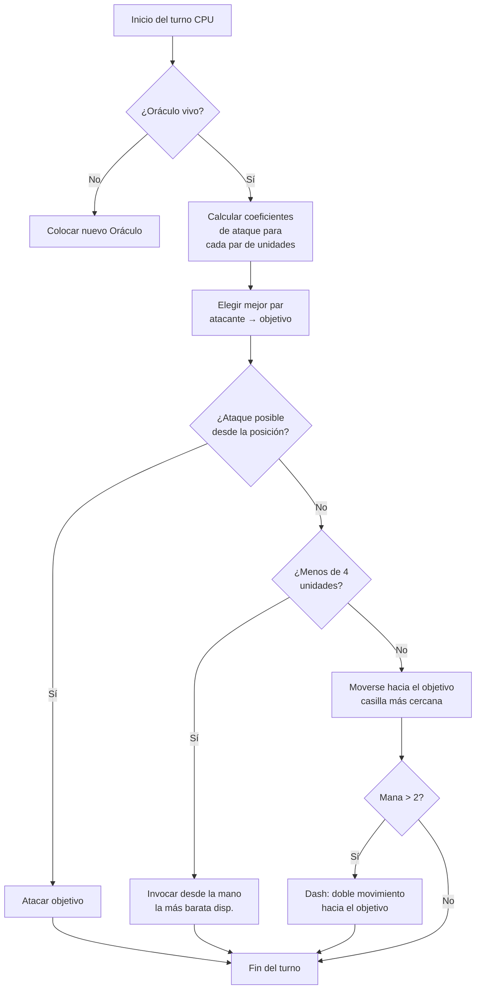

## Mi puta IA para Nausicaä

Hay proyectos que empiezan con "oye, ¿y si hiciera un juego de ajedrez con mitologías?" y terminan con una IA que se cambia sus propios hiperparámetros cada 5 turnos.

Nausicaä es eso. Un juego de mesa por turnos donde armas tu mazo de criaturas mitológicas, gestionas tu maná, desplegás unidades en un tablero 10x8. Y hay una IA que tiene crisis de personalidad.

Le metí bastante tiempo a esta IA, y el resultado es bastante ingobernable xD

## El juego en sí

Antes de hablar del cerebro, hay que entender el cuerpo:

- Tablero 10x8, zona de despliegue de 2 filas por jugador
- Maná empieza en 1, +1 por turno, máximo 6. Lo gastás para invocar, atacar, usar habilidades
- Objetivo: reventar al Oraculo enemigo

12 unidades, costes y patrones de movimiento distintos:

| Unidad | Coste | Movimiento | PV |
| --- | --- | --- | --- |
| Oráculo | 0 | Rey (8 direcciones) | 1 |
| Goblin | 1 | Adelante 3 casillas | 1 |
| Arpía | 1 | Rey (8 direcciones) | 1 |
| Náyade | 1 | Diagonal | 1 |
| Grifo | 2 | Salta 2 casillas | 2 |
| Sirena | 2 | Lateral | 1 |
| Centauro | 2 | Caballo (en L) | 2 |
| Arquero | 3 | Lateral | 1 |
| Fénix | 3 | Diagonal (casillas oscuras) | 1 |
| Metamorfo | 4 | Intercambio de lugar | 1 |
| Vidente | 4 | Ninguno (genera maná) | 1 |
| Titán | 6 | Limitado (ataque en área) | 3 |

Cada unidad tiene su propio patrón de ataque. La Sirena golpea en las 4 diagonales, el Arquero a distancia 3 casillas, el Titán destruye todo alrededor al invocarse. En resumen, un ajedrez con mitología y deckbuilding xD

## Cómo hice pensar a la CPU

La idea base es ridículamente simple: **cada unidad enemiga tiene un coeficiente de atractividad**. Cuanto más peligrosa es, más quiere la IA ocuparse de ella.

```javascript
const UNITS_ATTRACTIVENESS = {
    "oracle": 100,
    "titan": 95,
    "shapeshifter": 90,
    "phoenix": 80,
    "siren": 70,
    "archer": 70,
    "seer": 70,
    "griffin": 60,
    "centaur": 60,
    "harpy": 50,
    "naiad": 30,
    "gobelin": 20
};
```

Oráculo en 100 -- lógico, es la win condition. Titán en 95 porque revienta todo lo que tenga al lado al invocarse. Goblin en 20, es un soldado raso, nos la suda.

Después, para cada par de unidades (una aliada, una enemiga), calculo:

```
interes = atractividad × coeff_atract / (distancia × coeff_dist)
```

Básicamente: mientras más peligroso y cerca estés, más te quiere partir la cara la IA.

```javascript
calculateAttackCoefficient(x1, y1, x2, y2) {
    const distance = this.calculateEuclideanDistance(x1, y1, x2, y2);
    if (distance === 0) return Infinity;
    return (UNITS_ATTRACTIVENESS[unit.type] * COEFFICIENTS_IMPORTANCE["attractiveness"]) / distance;
}
```

### El truco de los coeficientes que cambian

Lo divertido es que los coeficientes de importancia **cambian aleatoriamente cada 5 turnos**.

```javascript
if (this.turnCount % 5 === 0) {
    const distanceCoefficient = parseInt(Math.random() * 100);
    const attractivenessCoefficient = parseInt(Math.random() * 100);
    this.regulateImportanceCoefficients({
        distance: distanceCoefficient,
        attractiveness: attractivenessCoefficient
    });
}
```

Un turno la IA va hiper agresiva (atract 95, distancia 5), atraviesa todo para reventar a tu Oráculo. Al siguiente prioriza la distancia y se recoloca.

Está sacado de los fantasmas de Pac-Man -- Blinky caza, Pinky embosca. Acá la IA cambia de "personalidad" cada fase.

**Resultado: imposible predecir a la IA en una partida entera.** La CPU nunca hace dos veces la misma partida.

### El Oráculo es un cagón

El Oráculo enemigo huye. Literalmente.

```javascript
const awayFromTarget = {
    row: Math.max(0, Math.min(7, botUnitElement.row + (botUnitElement.row - targetUnitElement.row))),
    col: Math.max(0, Math.min(9, botUnitElement.col + (botUnitElement.col - targetUnitElement.col)))
};
```

Calcula la dirección opuesta a la amenaza y se piira. Si hay pared, busca la casilla libre más cercana en esa dirección.

Pasás 3 turnos acercándote al Oráculo, y puf se fue como una nenita xD

### El loop de decisión

Así decide la IA:

1. Si ya no tengo Oráculo (muerto), colocar uno nuevo
2. Calcular el coeficiente para cada par unidad aliada → unidad enemiga
3. Elegir el mejor par
4. Si la unidad puede atacar al objetivo desde su posición → ataca
5. Si tengo menos de 4 unidades → invocar la más barata disponible desde la mano
6. Sino, moverse hacia el objetivo (casilla de movimiento más cercana al enemigo)
7. Si tengo suficiente maná (> 2), dash (doble movimiento) para acercarse más
8. Si la unidad es el Oráculo → huir



```javascript
async makeAction(dash=false) {
    // todo eso en secuencia
    // la CPU hace dash si tiene suficiente maná
    if(botPlayer.mana > 2) {
        this.makeAction(true);
    }
}
```

### Por qué distancia euclidiana

Uso distancia euclidiana:

```javascript
calculateEuclideanDistance(x1, y1, x2, y2) {
    const deltaX = Math.pow(x1 - x2, 2);
    const deltaY = Math.pow(y1 - y2, 2);
    return Math.sqrt(deltaX + deltaY) * COEFFICIENTS_IMPORTANCE["distance"];
}
```

¿Por qué no Manhattan? Porque las unidades tienen patrones de movimiento variados (en L como el caballo, diagonal, etc). La distancia en línea recta es una mejor aproximación del peligro.

## Por qué no minimax

Podría haber hecho un minimax clásico. Pero con 12 tipos de unidades, patrones de movimiento distintos, habilidades especiales... el árbol de juego explota tan rápido que se vuelve injugable. El enfoque heurístico toma decisiones inteligentes sin explorar 10 millones de estados.

## Lo que mola

El sistema de atractividad crea dilemas divertidos:

- El Vidente (70) genera maná. Si lo dejás vivir, el rival tiene más recursos. Pero el Titán (95) es más peligroso aún.
- El Metamorfo (90) puede intercambiar su lugar con cualquier unidad. Puede robarte el Oráculo.
- La Arpía (50) tiene un ataque explosivo que también la mata a ella. No es prioritaria... hasta que está al lado de 3 de tus unidades.

La IA evalúa el peligro global según las posiciones, no solo las stats brutas.

También hay una función `activateSimulation()` para probar escenarios sin rehacer una partida:

```javascript
activateSimulation() {
    // Coloca unidades específicas en el tablero
    // Útil para debuguear la IA
    this.game.board = simulation.board;
    this.game.players = simulation.players;
}
```

## Lo que falta

Si tuviera más tiempo:

- La IA reacciona al estado actual, no predice lo que hará el jugador
- No planifica su mano a varios turnos
- El Metamorfo y el Centauro tienen habilidades que infrautiliza
- Aprendizaje por refuerzo: hacer que juegue contra sí misma para ajustar los coeficientes

Pero para un juego de navegador cumple. Colegas llegan a perder contra ella, así que está bien xD

## Pruébalo

Disponible en [nausicaa-game.github.io](https://nausicaa-game.github.io/). Le das a "JOUER", CPU mode ON, y ves a la IA en acción.

Consejo: deja que la IA juegue contra sí misma. Vas a ver fases agresivas, y de repente puf, se retira todo.

El código está en [GitHub](https://github.com/nausicaa-game/nausicaa-game.github.io) en `js/cpu.js`.

**3 claves:**

1. **Coeficientes heurísticos** -- nada de minimax, cada unidad tiene una atractividad
2. **Coeficientes que cambian cada 5 turnos** -- la IA alterna agresividad y control, estilo Pac-Man
3. **El Oráculo huye** -- calcula la dirección opuesta a la amenaza y se larga

Si tenés ideas para hacer la IA más viciosa, abrí un issue. Tengo planes para una versión que aprende de sus derrotas, pero eso será para otro artículo xD
