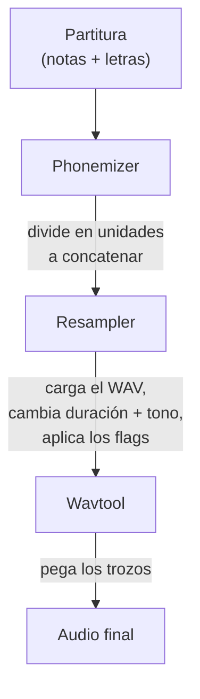

## UTAU : cómo un software en Visual Basic 6 democratizó la voz sintética

Ya lo mencioné en mi página principal : me encanta UTAU. Aquí te cuento por qué.

En 2008, si querías hacer cantar una voz sintética, tenías una opción : VOCALOID. El software de Yamaha. Caro, privativo, con voces oficiales que no podías crear tú mismo.

Y entonces llega un tipo japonés, Ameya/Ayame, que sacó un proyecto en su rincón. Un software programado en **Visual Basic 6**. Gratuito. Que te dejaba crear tu propia voz con... archivos WAV que grababas tú mismo.

Ese proyecto se llama **UTAU** (歌う, "cantar" en japonés). Y para su época, era magia.

Siempre me pareció fascinante este software. No porque fuera técnicamente limpio (spoiler : en realidad sí, había que tener cabeza para crear esto... es un caos bonito, lloro por este pollo), sino porque hizo algo que nadie más hacía : le dio la síntesis de voz al público general. O sea tú, yo, cualquiera con un micro.

Déjame explicarte por qué era tan genial.

---

## Primero, por qué la síntesis de canto es un rollo

Una voz cantada no son solo notas. Tienes la consonante que ataca, la vocal que se mantiene, el aire, las transiciones entre ambas. La "sa" de "saludo" es una "s" que silba y se desliza hacia una "a" abierta, y es ese deslizamiento lo que suena humano o no.

Hoy en día se arregla con deep learning : entrenas un modelo con horas de canto y genera la voz (Synthesizer V, DiffSinger). Pero eso es 2020+. En 2008, ni de coña.

UTAU usa el método de antes, más viejo y más ingenioso : la **síntesis concatenativa**.

---

## La síntesis concatenativa : copiar y pegar trocitos de voz

La idea es tonta de simple : grabas pequeños fragmentos de voz y los pegas juntos para formar palabras. "hola" = muestra "ho" + "la", encadenadas. Un puzle sonoro guiado por una partitura.

Es el mismo principio que los YouTube Poop donde recortan palabras de un personaje para hacerle decir cualquier cosa -- solo que aquí es ordenado y automatizado.

Y UTAU viene literalmente de ahí. Antes existía el **"Jinriki Vocaloid"** (人力ボーカロイド, "Vocaloid manual") : gente que recortaba a mano pistas de voz, extraía los fonemas, reajustaba el tono, y reensamblaba todo en un editor de audio para imitar una voz VOCALOID. A mano. Te imaginas la currada.

Ameya vio este drama y programó la herramienta para automatizarlo. Al principio UTAU era solo eso : un asistente para Vocaloid manual.

---

## Por qué fue revolucionario : TÚ creas la voz

Aquí está lo que cambió todo.

VOCALOID, comprabas una voz. Miku, Luka, etc. Creadas por profesionales, vendidas por Yamaha. Ni modo de hacer una tú mismo. UTAU, **cualquiera graba su voz y la convierte en un instrumento cantante**.

El modo CV (el más simple) es : grabas las ~100 sílabas básicas del japonés ("a", "ka", "sa", "ta"...), configuras los puntos de corte, y ya tienes tu voicebank. Un par de horas de trabajo.

Resultado : el ecosistema explotó. Miles de voicebanks creadas por la comunidad -- voces de fans, de amigos, de personajes inventados. Un universo entero de cantantes virtuales, gratuito. Y el software venía con **Defoko** (Utane Uta), una voz por defecto generada mediante el motor TTS AquesTalk, así que podías empezar incluso sin micro.

---

## El oto.ini : el corazón del sistema

¿Cómo sabe UTAU dónde cortar y pegar los sonidos? Mediante un archivo de configuración por voicebank : el **`oto.ini`**. Para cada WAV, define los puntos de corte (en milisegundos) :

- **Offset** → silencio a quitar al inicio
- **Preutterance** → el punto donde la consonante pasa a la vocal (la frontera "s"→"a" en "sa")
- **Overlap** → cuánto la nota anterior se solapa con esta
- **Fixed region** → la parte que NO debe estirarse en una nota larga (típicamente la consonante)
- **Cutoff** → dónde cortar el final

La **preutterance** es el parámetro más ingenioso. Una sílaba siempre tiene un trozo de consonante antes de la vocal. Para que tu nota caiga en el tiempo, es la *vocal* la que debe caer justo, no la consonante. Así que UTAU desplaza la muestra hacia atrás : la "a" de "sa" aterriza en el tiempo, la "s" sobresale justo antes. Como un baterista que anticipa su golpe para que el sonido caiga justo -- solo que aquí está en un `.ini`.

Visualmente, en una muestra "ka", las zonas del `oto.ini` se dividen así :

```mermaid
flowchart LR
    A["🔇 silencio<br/>(offset)"] --> B["🅺 consonante<br/>(fixed region,<br/>no se estira)"]
    B --> C["🅰 vocal<br/>(zona estirable)"]
    C --> D["🔇 final cortado<br/>(cutoff)"]
    style B fill:#3b4a6b
    style C fill:#5b3b6b
```



La frontera entre la consonante y la vocal es la preutterance. La vocal es la zona que se estira para las notas largas ; la consonante se queda intacta, si no tu "k" duraría dos segundos y sonaría horrible.

```ini
# oto.ini (simplificado)
# archivo=alias,offset,consonant,cutoff,preutterance,overlap
_ka.wav=ka,120,80,-200,90,40
```

Cinco valores por sonido, en todas tus muestras, y UTAU monta cualquier palabra correctamente.

---

## CV, VCV, CVVC : la carrera hacia el realismo

El modo básico, **CV** (Consonante-Vocal), es un sonido por sílaba. Simple pero un poco robótico : las uniones entre sílabas son bruscas.

En 2010 la comunidad inventa el **VCV** (Vocal-Consonante-Vocal). En lugar de grabar "ka" solo, grabas "a ka" -- con la cola de la vocal anterior. La transición se vuelve natural porque está *dentro* de la grabación, no calculada después.

El detalle que duele : **VOCALOID no tuvo VCV hasta VOCALOID3, en 2011.** El freeware en VB6 programado por un tipo solo se adelantó a Yamaha por un año en el realismo de las transiciones. Una comunidad de fans más rápida que la multinacional.

Después llegaron el **CVVC**, el **ARPAsing** (inglés), el **VCCV**... cada método llevando el realismo más lejos, todos inventados y documentados por la comunidad.

---

## El pipeline completo : cómo una palabra se convierte en sonido

Cuando pones una nota y escribes una letra, esto es lo que pasa entre bastidores :



El **resampler** es la pieza clave : toma tu muestra "ka" grabada a una altura dada y la reestira/reajusta para que coincida con la nota deseada -- estirando solo la zona estirable y manteniendo la consonante intacta (de ahí el `oto.ini`).

Y es **modular**. UTAU venía con un resampler básico, pero la comunidad creó otros (moresampler, TIPS...), cada uno con su grano sonoro. Cambiabas de motor de síntesis como un plugin. En 2008. En un freeware.

---

## El caos bajo el capó (y por qué es entrañable)

Hay que ser honesto sobre el estado técnico del invento :

- **Programado en Visual Basic 6.** Un lenguaje ya muerto en 2008. Necesitas el runtime VB6 para que funcione.
- **Windows only originalmente** (el port a Mac, UTAU-Synth, llegó en 2011).
- **Codificación Shift-JIS obligatoria.** Si tus archivos no están codificados en Shift-JIS japonés, UTAU no entiende nada. Todavía hoy hay que poner a menudo el PC en locale japonés o usar AppLocale para ejecutarlo.
- **Interfaz austera**, documentación casi 100% en japonés en su época.

Y sin embargo. Sin embargo esto creó un movimiento mundial. Decenas de miles de voicebanks. Canciones escuchadas millones de veces.

El mejor ejemplo : **Kasane Teto**. Un personaje creado en 2008 y lanzado como una broma del 1 de abril, haciéndose pasar por una VOCALOID. Era una broma. Pero la gente amó al personaje, se creó una voicebank UTAU real detrás, y Teto se convirtió en una de las cantantes virtuales más famosas del mundo. En 2023 incluso recibió una voz Synthesizer V oficial. Un personaje nacido de una broma de abril en un software gratuito.

---

## Por qué sigue importando

UTAU es el ejemplo perfecto de una tecnología "pobre" que gana por ser abierta.

VOCALOID era técnicamente superior, mejor financiado, más profesional. Pero cerrado. UTAU era chapucero, feo, en VB6 -- pero dejaba que todo el mundo participara. Crear voces, crear resamplers, crear plugins, crear métodos de grabación. La comunidad hizo el resto.

Y el concepto sobrevive completamente hoy. **OpenUtau**, un sucesor open-source moderno, retoma la idea y la desempolva (multi-plataforma, UTF-8, soporte de resamplers modernos Y de IA). La síntesis concatenativa sigue en pie al lado de los modelos de deep learning, porque tiene algo que ellos no tienen : entiendes exactamente lo que pasa, y controlas cada milisegundo.

Eso es lo que siempre me gustó de UTAU. Ves exactamente lo que pasa. No es una IA que te escupe algo mágico que no entiendes : tienes tus WAV, tus puntos de corte, y eres tú quien decide todo. Cuando suena mal, sabes por qué y puedes corregirlo. Me encanta ese tipo de control.

---

**Las 3 cosas para recordar :**

1. **Síntesis concatenativa = puzle de voz** -- UTAU pega pequeños fragmentos WAV para formar palabras. El `oto.ini` define dónde cortar y pegar cada sonido. Controlas todo, al milisegundo, sin caja negra.

2. **La apertura vence a la técnica** -- VOCALOID era mejor pero cerrado. UTAU era chapucero pero dejaba a todo el mundo crear sus voces. La comunidad hizo explotar el ecosistema, e incluso se adelantó a Yamaha en el VCV.

3. **Una buena idea sobrevive a su código** -- VB6, Shift-JIS, Windows only... y sin embargo el concepto sigue funcionando mediante OpenUtau. Una tecnología genial puede estar programada con los pies.

Sinceramente, solo por Kasane Teto nacida de una broma de abril, este software merece respeto xD
