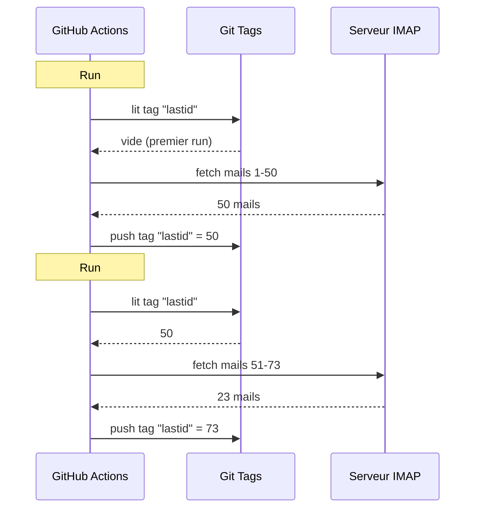

# J'ai utilisé git comme base de données pour faire tourner un bot gratos sur GitHub Actions

J'ai un répondeur email automatique qui tourne 24/7.

Il lit mes mails, comprend de quoi ça parle, et répond tout seul avec une IA. Il se souvient des conversations précédentes. Il ignore les newsletters et les `noreply@`. Il forward à un humain quand c'est trop chaud.

Coût mensuel : **0€**.

Pas de serveur. Pas de VPS. Pas de base de données. Juste GitHub Actions et un hack de malade : **utiliser git comme base de données**.

Tu vois le truc venir ? Non ? Bon, accroche-toi, c'est débile et génial à la fois.

---

## Le problème : GitHub Actions est stateless

GitHub Actions c'est gratuit. Tu peux lancer un cron toutes les 5 minutes, faire tourner ton code, gratos.

Mais y'a un souci : c'est **stateless**. 

Chaque run démarre dans une machine vierge. Rien n'est sauvegardé entre deux exécutions. Le run d'avant ? Oublié. Effacé. Comme s'il avait jamais existé.

Pour un répondeur email, c'est un problème énorme. Genre :

> "Quel est le dernier mail que j'ai déjà traité ?"

Si le bot oublie ça à chaque run, il va soit re-répondre aux mêmes mails en boucle (catastrophe), soit rater des mails. 

Il faut un état persistant. Et normalement, état persistant = base de données. Mais une base de données c'est un serveur, et un serveur c'est plus gratuit.

C'est là que ça devient intéressant.

---

## La solution : git tags comme base de données

Ton repo GitHub, c'est déjà du stockage persistant. Gratuit. Versionné. Toujours là.

Alors pourquoi pas y stocker l'état ?

L'idée : à chaque run, le bot lit le dernier UID email traité depuis un **git tag**. Il traite les nouveaux mails. Puis il re-push le tag avec le nouvel UID.



Le tag git EST la base de données. Une seule valeur, mais c'est tout ce dont on a besoin.

### Lire le state

Au début du job, on récupère la valeur depuis le tag :

```bash
git fetch origin --tags lastid || true
git show refs/tags/lastid:data/lastId > data/lastId || true
```

`git show refs/tags/lastid:data/lastId` ça veut dire : "donne-moi le contenu du fichier `data/lastId` tel qu'il était dans le tag `lastid`".

Boom. Tu as ta valeur, sans base de données.

### Écrire le state

À la fin, on re-crée le tag avec la nouvelle valeur :

```bash
git switch --orphan lastid-tmp   # branche vierge sans historique
git rm -rf .                      # on vide tout
mkdir -p data
printf "%s\n" "${LAST_ID_CONTENT}" > data/lastId

git add data/lastId
git commit -m "lastId snapshot"
git tag -f lastid                 # force le tag sur ce commit
git push --force ...origin lastid # push le tag
```

On crée une branche **orpheline** (sans historique), on met juste le fichier `lastId`, on commit, on tag, on force push.

Pourquoi orpheline ? Pour pas accumuler 10 000 commits de state dans l'historique du repo. Chaque update écrase le précédent. Le tag pointe toujours vers UN seul commit qui contient UNE seule valeur.

C'est propre. C'est gratuit. C'est complètement pété xD

---

## Le deuxième hack : le runtime snapshot

Y'a un autre problème avec GitHub Actions : le `npm install`.

Si à chaque run (toutes les 5 minutes) tu fais `npm install` + `npm run build`, tu gaspilles 60-90 secondes à chaque fois. Sur un cron fréquent, c'est des minutes de compute gaspillées pour rien.

Solution : pré-compiler le code UNE fois, et le stocker dans un tag git aussi.

Le workflow de build (qui tourne quand tu push sur `master`) fait ça :

```bash
# compile le code
bun install
bun run build

# stocke dist/ + node_modules/ dans un tag "runtime"
git checkout --orphan temp-runtime
git rm -rf .
cp -r "$TMPDIR"/* .
git add dist node_modules package.json bun.lock data
git commit -m "runtime build"
git tag -f runtime
git push --force ...origin runtime
```

Le tag `runtime` contient le code compilé ET les `node_modules`. Tout prêt à tourner.

Et le cron, lui, checkout directement ce tag :

```yaml
- name: Checkout runtime snapshot
  uses: actions/checkout@v4
  with:
    ref: refs/tags/runtime    # le code pré-build, pas le source
    fetch-depth: 1

# pas de npm install, pas de build !
- name: Process emails
  run: node dist/index.js --action
```

Pas d'install. Pas de build. Le cron démarre instantanément et exécute juste `node dist/index.js`.

Genre, tu as deux tags qui font deux boulots :
- `runtime` = le code prêt à tourner (mis à jour quand tu push du code)
- `lastid` = l'état persistant (mis à jour à chaque run)

C'est élégant comme un sale.

---

## Le bot lui-même : auto-répondeur IA

Bon, le hack git c'est cool, mais le bot fait quoi exactement ?

Il lit tes mails via IMAP, les comprend avec une IA (Groq + Llama 3.3 70B), et répond automatiquement.

Architecture en services propres avec injection de dépendances (InversifyJS) :

```
App
├── ImapService      → lit les mails (IMAP)
├── SmtpService      → envoie les réponses (SMTP)
├── ParserService    → parse le contenu des mails
├── ReplyService     → génère la réponse IA
├── SummaryService   → mémoire de conversation
├── AccountsService  → gère plusieurs comptes email
└── ConfigService    → config / env vars
```

### Deux modes de fonctionnement

Le bot peut tourner de deux façons :

**Mode listener** (temps réel) : connexion IMAP permanente avec reconnect exponentiel. Pour un VPS.

```typescript
this.imapService.on("exists", async (data) => {
  console.log(`[MAIL] Nouveau mail ! Total: ${data.count}`);
  // traite le nouveau mail immédiatement
});
```

**Mode action** (batch) : traite les nouveaux mails depuis le `lastId`, puis se ferme. Pour le cron GitHub Actions.

```bash
node dist/index.js --action
```

Le mode `--action` c'est celui qui utilise le hack git. Il lit `lastId`, traite ce qui est nouveau, écrit le nouveau `lastId`, fin.

### Ne PAS répondre aux robots

Si ton bot répond à TOUS les mails, il va répondre aux newsletters, aux notifications, aux `noreply@`. Catastrophe. Pire : si deux bots se répondent l'un à l'autre, t'as une boucle infinie de mails. Le cauchemar.

Donc filtrage agressif :

```typescript
export function isAutomatedSender(address) {
  const automatedPatterns = [
    "noreply", "no-reply", "donotreply",
    "mailer-daemon", "postmaster", "bounce",
    "newsletter", "notification", "marketing",
    "billing", "receipt", "promo", ...
  ];
  const local = address.split("@")[0].toLowerCase();
  return automatedPatterns.some(p => local.includes(p));
}
```

Et aussi détection via les headers email :

```typescript
export function isAutomatedByHeaders(headers) {
  return (
    ["bulk", "list", "junk"].includes(headers.precedence) ||
    headers["auto-submitted"] !== "no" ||
    headers["list-unsubscribe"] !== "" ||   // newsletters ont ça
    /mailchimp|sendgrid|mailgun|brevo/i.test(headers["x-mailer"])
  );
}
```

`List-Unsubscribe` dans les headers ? C'est une newsletter. `Precedence: bulk` ? Du mass-mailing. `X-Mailer: Mailchimp` ? Tu vois le genre. On ignore.

C'est comme un videur de boîte de nuit : les robots passent pas xD

### Les triggers magiques

L'IA peut décider de pas répondre du tout, ou de passer la main à un humain. Comment ? Avec des triggers spéciaux dans sa réponse.

Le prompt système lui dit :

> Si c'est un mail automatique/newsletter → réponds `<no_reply>`
> Si c'est trop important/sensible (légal, financier...) → réponds `<manual_reply_required>`
> Sinon → écris une vraie réponse

Et le code lit ça :

```typescript
const aiReply = completion.choices[0].message.content.trim();
const manualTrigger = aiReply.includes(MANUAL_REPLY_TRIGGER);
const noReply = aiReply.includes(NO_REPLY_TRIGGER);

if (noReply) {
  console.log("[MAIL] L'IA a décidé d'ignorer. Skip.");
  return;
}

if (manualTrigger) {
  console.log("[MAIL] Trop chaud, je forward à un humain.");
  await this.smtpService.sendManualForward(...);
  return;
}

// sinon on envoie la réponse IA
await this.smtpService.sendReply(...);
```

Genre l'IA a le droit de dire "non là je touche pas, appelle un vrai humain". C'est de la sagesse.

---

## La mémoire de conversation

Un détail qui change tout : le bot **se souvient** des conversations.

Quand il répond à quelqu'un, il sauvegarde un résumé de l'échange. La prochaine fois que cette personne écrit, le résumé est réinjecté dans le prompt.

Stockage : un fichier JSON par contact.

```
data/customers/
├── moi%40gmail.com/
│   ├── alice%40example.com.json
│   └── bob%40client.fr.json
```

Et le résumé est lui-même généré par l'IA, qui merge l'ancien résumé avec le nouveau message :

```typescript
const completion = await groq.chat.completions.create({
  model: "llama-3.3-70b-versatile",
  messages: [
    { role: "system", content: "Tu es un assistant de mémoire. Merge l'ancien résumé avec le nouveau message sans perdre d'info." },
    { role: "user", content: `Résumé existant:\n${existing}\n\nNouveau message:\n${incomingContent}` }
  ],
  temperature: 0.0,  // déterministe, pas de créativité
  max_tokens: 800,
});
```

Donc le bot construit une mémoire compressée au fil du temps. Pas besoin de stocker tous les mails, juste un résumé qui grossit intelligemment.

Et ces fichiers JSON ? Ben... ils sont stockés dans git aussi, dans le runtime tag. Git partout xD

---

## Le truc malin avec la longueur du prompt

Petit détail technique qui m'a fait sourire. 

Les modèles ont une limite de tokens. Si ton mail + le résumé + le persona prompt dépassent, l'API renvoie une erreur.

Le code gère ça avec une **troncature en cascade** + retry :

```typescript
try {
  // premier essai avec les limites normales
  completion = await groq.chat.completions.create({...});
} catch (error) {
  if (!this.isLengthError(error)) throw error;

  // c'était une erreur de longueur : on re-tente avec des limites plus serrées
  ({ systemContent, userContent } = this.buildPromptPayload({
    ...,
    limits: {
      systemPromptChars: 2200,  // au lieu de 3000
      summaryChars: 1800,       // au lieu de 4000
      personaChars: 900,        // au lieu de 1500
      userContentChars: 2200,   // au lieu de 8000
    },
  }));
  completion = await groq.chat.completions.create({...});  // retry
}
```

Si ça passe pas, on coupe plus court et on retente. Simple, efficace, pas de crash.

---

## Bon, et concrètement, comment ça tourne ?

Le flow complet d'un run de cron :

```
1. GitHub Actions se déclenche (cron toutes les 5 min)
2. Checkout du tag "runtime" (code pré-build)
3. git show refs/tags/lastid → récupère le dernier UID traité
4. node dist/index.js --action
   ├── connexion IMAP
   ├── fetch des mails depuis lastId+1
   ├── pour chaque mail :
   │   ├── parse le contenu
   │   ├── filtre les robots (skip si automated)
   │   ├── match le compte destinataire
   │   ├── récupère la mémoire de conversation
   │   ├── génère la réponse IA (Groq)
   │   ├── <no_reply> ? skip
   │   ├── <manual_reply_required> ? forward humain
   │   ├── sinon : envoie la réponse (SMTP)
   │   └── update la mémoire de conversation
   └── écrit le nouveau lastId
5. git push --force tag "lastid" avec la nouvelle valeur
```

Et ça recommence dans 5 minutes. Pour toujours. Gratos.

---

**Les 3 trucs à retenir :**

1. **Git = base de données gratuite** -- Un tag orphelin peut stocker ton état persistant entre deux runs stateless. `git show refs/tags/X:fichier` pour lire, force-push pour écrire. Pas besoin de DB.

2. **Pré-compile dans un tag runtime** -- Au lieu de `npm install` à chaque run du cron, stocke le code compilé + node_modules dans un tag git. Le cron démarre instantanément.

3. **Un bot IA doit savoir se taire** -- Les triggers `<no_reply>` et `<manual_reply_required>` laissent l'IA décider de pas répondre ou de passer la main. Plus le filtrage anti-robot. Sinon tu crées une boucle de mails infinie.

Serverless cron avec état persistant, IA, mémoire, le tout à 0€/mois. C'est complètement pété et j'adore xD