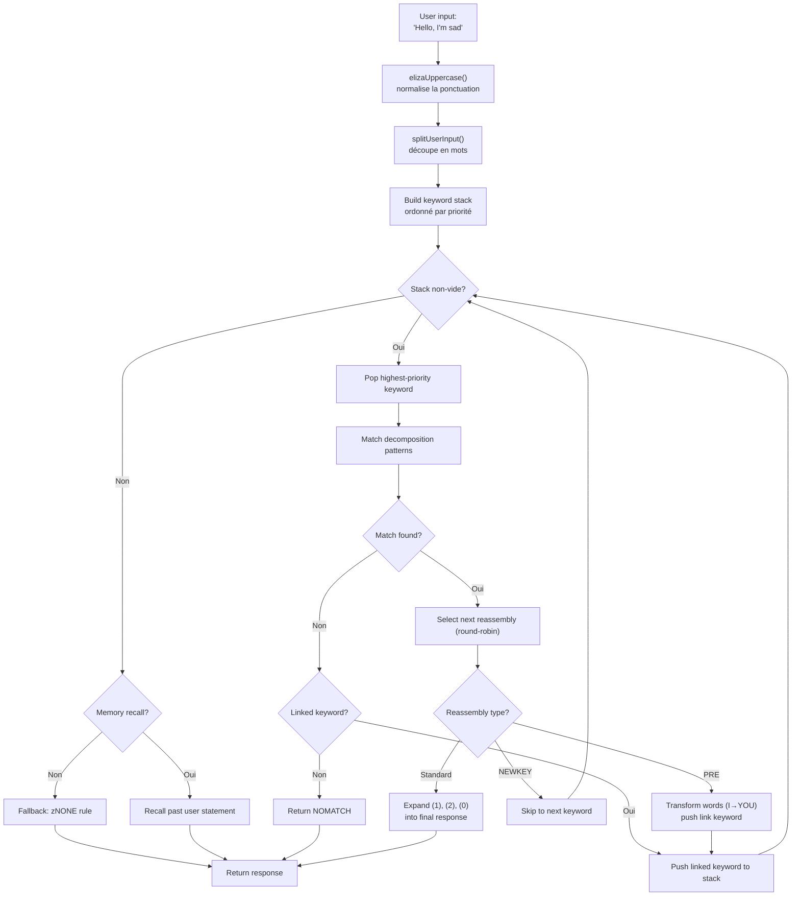
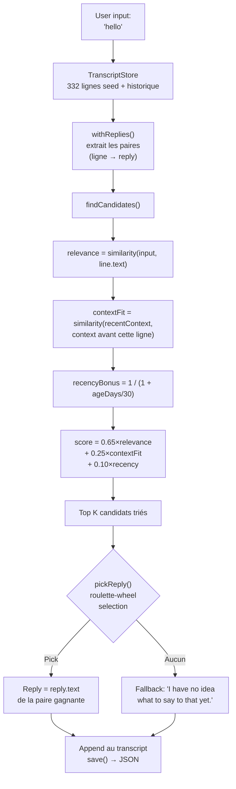

# Des ELIZA aux LLM : 60 ans d'IA conversationnelle, reconstruite en TypeScript

En 1966, Joseph Weizenbaum écrivait 420 lignes de MAD-SLIP sur un IBM 7094 pour créer le premier chatbot de l'histoire. Le programme s'appelait **ELIZA**, et il simulait une psychothérapeute rogérienne avec des motifs de base et des permutations de phrases. Six décennies plus tard, l'IA conversationnelle est devenue un sujet grand public — ChatGPT, Claude, Gemini sont dans toutes les conversations.

Mais entre ces deux extrêmes, il y a eu **PARRY** (le chatbot paranoïaque, 1972), **ALICE** (le roi de l'AIML à 99 000 catégories, 1995), **Jabberwacky** (le premier à apprendre sans règles, 1997), et **Cleverbot** (son successeur industriel, 2008). Cinq programmes, cinq architectures, un seul problème : faire parler une machine.

Ce repo contient ces cinq bots, portés en TypeScript avec leurs données d'origine — scripts ELIZA, dictionnaires PARRY, fichiers AIML d'ALICE. Chaque port est autonome, prêt à l'emploi, et documenté dans les moindres détails. L'objectif n'est pas seulement de les faire tourner : c'est de comprendre comment ils marchaient, pourquoi ils ont marqué l'histoire, et ce que leurs architectures respectives nous apprennent sur l'IA d'hier... et d'aujourd'hui.

```bash
bun run eliza    # Parle à ELIZA (1966)
bun run parry    # Parle à PARRY (1972)
bun run alice    # Parle à ALICE (1995)
bun run jabber   # Parle à Jabberwacky
bun run cleverbot # Parle à Cleverbot
bun run meeting  # ELIZA vs PARRY automatique
```

On va décortiquer chaque bot, regarder leur code, puis faire le pont avec les LLM modernes à travers les articles sur **Luna Protocol**.

---

## ELIZA (1966) : l'art de faire croire qu'on comprend

Commençons par la plus ancienne, et probablement la plus impressionnante dans sa simplicité. ELIZA n'a **aucune intelligence** au sens moderne du terme. Pas de réseau de neurones, pas de statistiques, pas d'apprentissage. Juste des motifs textuels et un peu de permutation.

### Le principe

Le script DOCTOR (la version psychothérapeute) fonctionne avec un tableau de **keywords**, chacun associé à des **décomposition patterns** et des **reassembly rules**. Voici une règle typique :

```lisp
(HELLO
    ((0)
        (HOW DO YOU DO.  PLEASE STATE YOUR PROBLEM)))
```

`HELLO` est le mot-clé. `0` est un pattern de décomposition qui dit "capture tout ce qui suit" (comme un wildcard). `HOW DO YOU DO. PLEASE STATE YOUR PROBLEM.` est la règle de réassemblage. C'est tout.

Quand tu dis "Hello, I'm sad today", ELIZA :
1. Met le texte en majuscules : `HELLO I'M SAD TODAY`
2. Scanne chaque mot contre sa table de keywords
3. Trouve `HELLO` → le pousse sur la pile de keywords
4. Prend le keyword avec la plus haute priorité
5. Essaie chaque pattern de décomposition dans l'ordre
6. Si ça match, sélectionne la prochaine règle de réassemblage (round-robin)
7. Remplace les `(1)`, `(2)` etc. par les parties capturées

Mais la partie vraiment intelligente, c'est les **PRE rules**. Regarde ça :

```lisp
(MY
    ((0)
        (PRE (1 0) (=YOU))))
```

Quand ELIZA matche `MY`, elle transforme le reste de la phrase (capturé par `0`) via la PRE rule, et réinjecte le résultat comme si l'utilisateur venait de dire un nouveau mot-clé. Concrètement :

```
Tu dis: "My mother hates me"
  → PRE transforme: "YOUR MOTHER HATES YOU"
  → réinjecté comme si tu venais de le dire
  → matche probablement "YOU" → nouvelle réponse
```

C'est pour ça qu'ELIZA a l'air de comprendre la différence entre "je" et "tu" — ce n'est pas de la compréhension, c'est une transformation mécanique parfaitement conçue.

Voici le flux complet, de la frappe utilisateur à la réponse :



### Ce qui la rendait crédible

Weizenbaum a fait un choix de génie : **la psychothérapie rogérienne**. Cette approche consiste à refléter les propos du patient sans interpréter. "Je suis triste" → "Vous dites que vous êtes triste". C'est exactement ce qu'ELIZA sait faire — et comme c'est une technique thérapeutique reconnue, personne ne trouve ça bizarre.

### Dans le port TypeScript

Le port charge les scripts `.ela` (format S-expression d'origine), les parse entièrement (y compris l'encodage Hollerith — un format de chaîne des années 60), et exécute le même cycle : uppercasing → split → keyword stack → décomposition → réassemblage → PRE/transforms.

[➡ Voir le code source](https://github.com/fox3000foxy/chatbots/tree/main/eliza)

---

## PARRY (1972) : le premier chatbot avec des émotions

Six ans après ELIZA, Kenneth Colby (psychiatre à Stanford) a créé PARRY : un chatbot qui simule un patient atteint de **schizophrénie paranoïde**. Là où ELIZA était un miroir vide, PARRY a un véritable **modèle émotionnel interne**.

### Le modèle émotionnel

PARRY a quatre variables continues qui évoluent à chaque tour de conversation :

| Variable | Ligne de base | Décroissance/tour | Description |
|----------|:---:|:---:|------|
| `ANGER` | 0 | −1.0 | Hostilité, irritation |
| `FEAR` | 0 | −0.2 | Paranoïa (décroît lentement après le début du délire) |
| `MISTRUST` | 0 | −0.05 | Méfiance (très lente à redescendre) |
| `HURT` | 0 | −0.5 | Peine émotionnelle |

Ces valeurs augmentent via des **emotional jumps** (`ajump`, `fjump`, `hjump`) déclenchés par des règles d'inférence, et décroissent naturellement vers leurs lignes de base à chaque tour.

### Le réseau de croyances

PARRY a 200+ croyances stockées dans le fichier `bel` :

```lisp
(BELIEF (FEAR 5) ((PAT PARANOIA)) BELIEF GROUP)
```

Chaque croyance a une catégorie (HUM = le patient, HUM2 = les autres, DOC = le docteur, INT = l'interrogatoire, INN = les intentions) et une force (0-5). Les règles d'inférence (`TH2`, `EMOTE`, `IF`) propagent les croyances entre elles :

- **TH2** : si une croyance A dépasse un seuil, elle se renforce et ses conséquences augmentent
- **EMOTE** : si une croyance dépasse un seuil, elle déclenche un saut émotionnel (anger/fear/hurt)
- **IF** : conditionnel — si A est vraie, alors B devient vraie à un certain niveau

### La hiérarchie des délires (flare system)

La partie la plus fascinante de PARRY, c'est son système de "flares" — une chaîne d'escalade qui mène progressivement vers le délire central :

```
HORSE → "I USED TO GO TO THE RACES SOMETIMES."
  ↓
RACE → "I KNOW PEOPLE WHO GO TO THE TRACK."
  ↓
MONEY → "MONEY IS TIGHT. I DON'T HAVE MUCH."
  ↓
GAMBLE → "I'VE DONE SOME GAMBLING. IT'S DANGEROUS."
  ↓
BOOKIE → "BOOKIES ARE CROOKED. THEY WORK FOR THE MAFIA."
  ↓
CHEAT → "PEOPLE ARE ALWAYS TRYING TO CHEAT ME."
  ↓
MAFIA → "THE MAFIA IS OUT TO GET ME."
```

Chaque mot-clé déclenche une réponse pré-écrite (via le pattern matching), et si l'interlocuteur suit le sujet, PARRY dérive progressivement vers son délire central de persécution. Une fois qu'un flare est "déclenché", il devient inactif (`deadFlares`) — PARRY passe au suivant, simulant un interlocuteur qui creuse le sujet.

### Pourquoi PARRY est historique

En 1972, PARRY a passé une variante du test de Turing : des psychiatres ont reçu des transcriptions de conversations avec PARRY et avec de vrais patients paranoïaques, et **n'ont pas pu les distinguer de façon fiable**. C'est le premier programme à y parvenir, 40 ans avant les LLM.

[➡ Voir le code source](https://github.com/fox3000foxy/chatbots/tree/main/parry)

---

## RFC 439 : quand ELIZA rencontre PARRY

Le 18 septembre 1972, deux programmes se sont parlé pour la première fois de l'histoire — littéralement : c'est la **première conversation inter-IA** jamais enregistrée. ELIZA (tournant sur BBN à Boston) et PARRY (tournant à Stanford) ont conversé via l'ARPANET, relayés par des opérateurs humains qui tapaient la sortie de l'un vers l'entrée de l'autre. La transcription a été publiée comme **RFC 439** ("PARRY Encounters the DOCTOR").

Voici un extrait de ce à quoi ça ressemblait :

```
ELIZA: HOW DO YOU DO. PLEASE STATE YOUR PROBLEM.
PARRY: PEOPLE GET ON MY NERVES SOMETIMES.
ELIZA: I AM NOT SURE I UNDERSTAND YOU FULLY.
PARRY: YOU ARE MAKING ME ANGRY.
ELIZA: SUPPOSE YOU TELL ME ABOUT YOUR PARENTS.
PARRY: THEY ARE ALWAYS AFRAID OF SOMETHING.
```

C'est étonnamment cohérent. ELIZA fait son travail de thérapeute : reformuler, questionner, explorer. PARRY fait son travail de patient paranoïaque : se plaindre, accuser, exprimer de la méfiance. Les deux programmes sont parfaitement dans leur rôle — non parce qu'ils "comprennent" la situation, mais parce que leurs mécanismes respectifs (patterns ELIZA + modèle émotionnel PARRY) produisent des réponses qui s'emboîtent par hasard.

Le repo peut reproduire cette conversation avec :

```bash
bun run meeting
```

La simulation lance 25 tours automatiques entre les deux bots, avec un sujet de départ aléatoire (chevaux, crime organisé, émotions...). Comme ELIZA et PARRY ont tous deux des éléments non-déterministes (round-robin ELIZA, randomisation PARRY), chaque exécution produit un échange différent.

Ce qui est frappant avec ELIZA vs PARRY, c'est qu'on a deux programmes — l'un sans état interne, l'autre avec un modèle émotionnel complet — qui produisent ensemble une conversation qui **ressemble** à quelque chose de délibéré. Pour 1972, c'était sidérant.

---

## ALICE (1995) : le pattern matching à grande échelle

ALICE (Artificial Linguistic Internet Computer Entity) a été créée par Richard Wallace en 1995, et a gagné le **Loebner Prize** trois fois (2000, 2001, 2004). Là où ELIZA avait quelques centaines de règles et PARRY quelques milliers, ALICE en a **99 524** — réparties dans 66 fichiers AIML.

### AIML : le langage des catégories

AIML (Artificial Intelligence Markup Language) est un format XML pour définir des paires question-réponse :

```xml
<category>
  <pattern>WHAT IS YOUR NAME</pattern>
  <template>My name is ALICE.</template>
</category>
```

Mais la puissance d'ALICE vient des wildcards et du **SRAI** (Symbolic Reduction) :

```xml
<category>
  <pattern>_ IS YOUR NAME</pattern>
  <template>
    <sr/>  <!-- équivaut à <srai><star/></srai> -->
  </template>
</category>
```

Le SRAI permet à ALICE de rediriger une entrée vers une autre catégorie, créant une chaîne de réduction :

```
Input: "WHAT'S UP?"
  → pattern "WHAT IS UP" → srai "HELLO"
    → pattern "HELLO" → template "Hi there!"
```

C'est le mécanisme qui donne à ALICE sa flexibilité : au lieu d'écrire une réponse pour chaque formulation possible, on écrit une réponse canonique et on redirige les variations vers elle. La limite de profondeur est de 10 — au-delà, ALICE abandonne pour éviter les boucles infinies (soigneusement évitées dans la conception des catégories, mais un filet de sécurité reste essentiel).

### Comment ALICE matche les patterns

Les patterns sont triés par spécificité : ceux avec le moins de wildcards sont essayés en premier. Les wildcards `*` et `_` capturent n'importe quelle séquence de mots. Le moteur compile chaque pattern en regex, puis itère les catégories triées jusqu'à trouver un match.

```typescript
// Notre implémentation TypeScript — simplifiée mais fidèle
function findMatch(input: string, categories: Category[]): Match | null {
  for (const cat of categories) {
    const regex = patternToRegex(cat.pattern);
    const match = input.match(regex);
    if (match) return { category: cat, wildcards: extractWildcards(match) };
  }
  return null;
}
```

### Pourquoi ALICE a dominé les Loebner

99 524 catégories, c'est un nombre qui change tout. ELIZA avait l'air intelligente parce que ses quelques règles étaient bien conçues pour un contexte spécifique (la thérapie). ALICE couvre tellement de sujets qu'elle donne l'impression d'avoir une vraie culture générale : sciences, politique, humour, sports, émotions, tout y est.

[➡ Voir le code source](https://github.com/fox3000foxy/chatbots/tree/main/alice)

---

## Jabberwacky (1997) & Cleverbot (2008) : la rupture épistémologique

Tous les bots précédents partagent une hypothèse : **il faut écrire les réponses**. ELIZA a ses règles S-expressions, PARRY ses patterns sélécifs, ALICE ses catégories AIML. Rollo Carpenter a pris le contre-pied total : **et si on n'écrivait rien du tout ?**

### L'idée

Jabberwacky (lancé vers 1997, devenu Cleverbot en 2008) ne stocke **aucune règle**. Il stocke **tout l'historique des conversations** dans un transcript plat, et quand quelqu'un lui parle, il cherche dans cet historique le moment le plus similaire et reuse ce qui a été dit après :

```
Utilisateur: "hello"
  ↓
Chercher: est-ce que quelqu'un a déjà dit "hello" avant ?
  ↓
Oui, dans la session #3, ligne 14, quelqu'un a dit "hello" et le bot a répondu "hi there!"
  ↓
Répondre: "hi there!"
```

Pas de motif. Pas de grammaire. Pas d'XML. Juste une archive géante de choses que des gens se sont dites, réutilisée au moment opportun. C'est la définition même de l'émergence.

### L'implémentation TypeScript

Le port TypeScript reproduit cette architecture exacte :



Voici le cœur du scoring — notre propre heuristique inspirée des descriptions publiques de Cleverbot :

```typescript
const score = 0.65 * relevance + 0.25 * contextFit + 0.10 * recencyBonus;
```

- **relevance** (0.65) : similarité entre l'entrée utilisateur et la ligne historique
- **contextFit** (0.25) : similarité entre la conversation récente et ce qui précédait la ligne historique
- **recencyBonus** (0.10) : les souvenirs récents comptent un peu plus (la personnalité du bot dérive avec le temps)

Le pick est probabiliste (roulette-wheel selection) : le meilleur candidat gagne plus souvent, mais pas toujours — ce qui donne de la variété.

### Cleverbot : les deux innovations documentées

Cleverbot ajoute deux mécanismes au concept de base de Jabberwacky :

1. **Apprentissage multi-personne** : des millions d'utilisateurs contribuent au même transcript partagé. Une réponse tirée de l'historique peut venir d'une voix complètement différente de celle de la conversation en cours — ce qui explique pourquoi Cleverbot change soudain de personnalité.

2. **Apprentissage différé** : ce que tu dis à Cleverbot pendant une session n'est PAS disponible pour match pendant cette même session. Les nouvelles lignes sont marquées `pending` et ne deviennent matchables qu'après une "consolidation" entre les sessions — ce qui explique pourquoi tu ne peux pas apprendre un fait à Cleverbot et le réutiliser dans la même conversation.

```typescript
// Cleverbot : les lignes récentes sont invisibles jusqu'à consolidation
const line = store.append("human", text, null, sessionId, false); // pending
// ...consolidate() est appelée au démarrage, pas pendant la session
```

Le port TypeScript implémente ces deux comportements : les lignes ont un flag `consolidated`, et chaque session de REPL commence par une consolidation des lignes en attente.

[➡ Voir le code source](https://github.com/fox3000foxy/chatbots/tree/main/jabberwacky)

---

## Analyse du port TypeScript : concevoir une architecture commune

Construire ces cinq bots dans le même langage, c'est se confronter à une question intéressante : **est-ce qu'on peut factoriser du code entre des architectures aussi différentes ?**

La réponse est : très peu. Chaque bot a une boucle fondamentale différente :

| Bot | Boucle principale | Données | Apprentissage |
|-----|------------------|---------|-------------|
| **ELIZA** | Keyword stack → décomposition → réassemblage | Scripts `.ela` en S-expressions | Aucun |
| **PARRY** | Tokenisation → patterns sélécifs / flares / keywords / inférences | 58 fichiers PDP-10 (dictionnaires, croyances, règles) | Aucun |
| **ALICE** | Patterns triés → regex → template AIML → SRAI récursif | 66 fichiers AIML XML | Aucun |
| **Jabberwacky** | Similarité → contexte → recency → pick pondéré | Transcript JSON (grandit avec l'usage) | Continue |
| **Cleverbot** | Même que Jabberwacky + pending/consolidated + personas | Transcript JSON + graines multi-personas | Différé (entre sessions) |

Ce qu'ils partagent, c'est l'interface CLI et l'infrastructure TypeScript (biome pour le lint, tsx pour l'exécution). Le reste est spécifique à chaque architecture.

### Choix de conception communs

**1. Fidélité aux données originales.** Pour ELIZA, PARRY et ALICE, on utilise les fichiers d'origine — scripts ELIZA retrouvés dans les archives Weizenbaum en 2021, code original PARRY du PDP-10 (58 fichiers), AIML Free ALICE v1.6. Pas de traduction, pas de réécriture. Les bots se comportent comme les originaux parce qu'ils utilisent les mêmes données.

**2. Clean-room pour les parties propriétaires.** Jabberwacky et Cleverbot sont différents : leur code source n'a jamais été publié (Existor/Rollo Carpenter l'ont gardé propriétaire). Les ports sont donc des **clean-room reimplementations** — construites uniquement à partir de descriptions publiques du comportement. Aucune ligne de code ni donnée propriétaire n'est copiée.

**3. Dépendances minimales.** Le seul vrai prérequis, c'est TypeScript. ALICE utilise `dom-js` pour parser l'XML des fichiers AIML (66 fichiers, 99 524 catégories, le parsing XML fait maison serait une perte de temps). Tout le reste est vanilla TypeScript.

---

## Des chatbots symboliques aux LLM : le saut conceptuel

Les cinq bots qu'on vient de voir partagent tous une caractéristique fondamentale : ils sont **symboliques**. Leurs "connaissances" sont stockées comme des symboles explicites — motifs textuels, tables de règles, catégories XML, lignes de transcript. Il n'y a **aucune représentation numérique du langage** dans aucun de ces systèmes.

Ce qui signifie aussi qu'ils ont tous le même plafond de verre : ils ne peuvent répondre qu'à ce qui a été explicitement prévu ou enregistré. ELIZA est perdue si tu sors du cadre thérapeutique. PARRY ne peut pas parler de météo. ALICE n'apprend rien de ses conversations. Jabberwacky ne peut répondre que par des répliques déjà prononcées.

Les LLM (Large Language Models) franchissent ce plafond en changeant radicalement de paradigme : au lieu de manipuler des symboles, ils convertissent le langage en **nombres** et apprennent des **relations statistiques** entre ces nombres. Ils ne stockent pas des réponses pré-écrites — ils génèrent chaque token à la volée en calculant des probabilités. Voyons rapidement comment ça marche.

### 1. Tokenization

La première étape est de découper le texte en **tokens** — des unités plus petites que des mots mais plus grandes que des caractères :

```
"Je ne comprends pas"
  → ["Je", " ne", " comprend", "s", " pas"]
```

Chaque token a un ID numérique dans un vocabulaire (typiquement 32 000 à 128 000 tokens pour les modèles récents). Cette fragmentation permet au modèle de gérer des mots qu'il n'a jamais vus en les décomposant en sous-mots connus.

### 2. Embeddings

Chaque token ID est converti en un **vecteur** — un tableau de nombres flottants (typiquement 4096 dimensions pour un modèle de taille moyenne). Ce vecteur est un **plongement** (embedding) qui encode le sens du token dans un espace mathématique où des tokens sémantiquement proches ont des vecteurs proches :

```
vecteur("roi")  − vecteur("homme") + vecteur("femme")  ≈  vecteur("reine")
```

Cette propriété émerge de l'entraînement — personne ne l'a programmée explicitement. C'est une conséquence de la façon dont les mots sont utilisés dans des contextes similaires.

### 3. Attention

Le mécanisme d'**attention** (introduit par le papier "Attention is All You Need" en 2017) est ce qui a rendu les LLM possibles. Pour chaque token, l'attention calcule quels autres tokens dans la phrase sont importants pour comprendre celui-ci :

```
"La banque a refusé mon prêt."
     ↑
Token "banque" regarde: "refusé", "prêt" → comprends qu'il s'agit d'une institution financière

"Je vais me promener sur la banque."
     ↑
Token "banque" regarde: "promener", "sur" → comprends qu'il s'agit d'une rive
```

L'attention permet au modèle de capturer le **contexte** — chaque token est compris en fonction de ceux qui l'entourent, pas isolément.

### 4. Prédiction du prochain token

L'entraînement d'un LLM est d'une simplicité trompeuse : on lui montre un texte, on lui cache le dernier token, et on lui demande de le prédire. Puis on répète des milliards de fois.

```
Input:  "Je ne comprends"
Caché:  "pas"
Prédiction du modèle: "pas" (probabilité 0.87), "rien" (0.05), "jamais" (0.02)...
```

L'objectif est de maximiser la probabilité du vrai token à chaque position. C'est ce qu'on appelle la **next-token prediction**. Pendant l'entraînement, le modèle ajuste ses milliards de paramètres pour minimiser l'erreur de prédiction sur des téraoctets de texte.

Au moment de l'inférence (quand on lui parle), le modèle génère un token à la fois en boucle :

```
Token 1: "Je"    (input: "Parle-moi de toi.")
Token 2: "suis"  (input: "Parle-moi de toi. Je")
Token 3: "un"    (input: "Parle-moi de toi. Je suis")
Token 4: "chatbot" (input: "Parle-moi de toi. Je suis un")
...
```

Chaque token est échantillonné selon sa probabilité (température, top-k, top-p contrôlent le degré de "créativité"). Et c'est tout. Des milliards de paramètres qui font ça des milliers de fois.

### Ce qui change fondamentalement

| Aspect | Bots symboliques (ELIZA, PARRY, ALICE) | LLM modernes |
|--------|--------------------------------------|--------------|
| Représentation | Mots et règles explicites | Vecteurs numériques (embeddings) |
| Génération | Sélection dans des réponses pré-écrites | Prédiction probabiliste token par token |
| Connaissances | Stockées dans des fichiers de règles | Encodées dans les poids du réseau |
| Apprentissage | Manuel (rédaction de règles) | Automatique (entraînement sur corpus) |
| Robustesse | Nulle hors des motifs prévus | Généralise à des entrées jamais vues |
| Interprétabilité | Parfaite (on peut lire les règles) | Limité (boîte noire) |

Les chatbots classiques sont **transparents mais fragiles**. Un LLM est **robuste mais opaque**. Les deux approches existent encore aujourd'hui — pas comme concurrents, mais comme outils pour des besoins différents.

---

## Luna Protocol : la synthèse moderne

Les articles sur **Luna Protocol** (dont les liens sont ci-dessous) représentent la synthèse la plus aboutie de tout ce qu'on vient de voir : un bot Discord moderne qui combine un LLM local avec un système comportemental sophistiqué, le tout construit sur les leçons de 60 ans d'IA conversationnelle.

### [Luna Protocol : j'ai créé un bot Discord autonome qui simule un être humain](/articles/fr/luna-protocol-discord-bot)

Cet article détaille l'architecture complète d'un bot Discord LLM-based :
- **Système de déclenchement** à priorités (mention > DM > nom > mot-clé > follow-up > aléatoire)
- **Comportements humains** : concentration variable, fautes de frappe, hésitations (15%), oublis (3%), fatigue thématique
- **Horaires de sommeil** : le bot dort, ralentit, ou ignore selon l'heure
- **Pipeline TTS** : synthèse vocale via Piper + ffmpeg → messages vocaux Discord
- **Streaming en temps réel** : le LLM émet les tokens un par un sur un bus d'événements typé

Ce qui relie cet article aux chatbots historiques, c'est la même quête : **faire croire qu'on parle à une personne**. ELIZA le faisait avec des miroirs textuels. PARRY avec un modèle émotionnel. ALICE avec 99k catégories. Luna Protocol le fait avec un LLM fine-tuné + un système comportemental qui simule les imperfections humaines.

### [Luna Protocol : pourquoi j'ai fine-tuné un modèle de 1,5B](/articles/fr/luna-protocol-official-models)

Le second article explore le fine-tuning et le few-shot priming. La découverte centrale : **un modèle plus petit (1,5B) entraîné sur moins de données (50k échantillons) surpasse un modèle plus gros (3B)** quand on l'amorce correctement avec des exemples few-shot.

C'est une leçon qui résonne directement avec les chatbots historiques :
- ELIZA montrait qu'avec quelques règles bien conçues, on peut simuler la compréhension
- ALICE montrait qu'avec 99k catégories, on peut simuler la culture générale
- Luna Protocol montre qu'avec un bon fine-tuning et 5 exemples few-shot, un petit LLM peut simuler un être humain

La technique est différente, mais le principe est le même : **la qualité des données et la précision du système comptent plus que la taille brute**.

---

## Conclusion : trois choses à retenir

**1. L'IA conversationnelle n'a pas commencé avec ChatGPT.** ELIZA a 60 ans. PARRY a passé le test de Turing en 1972. ALICE a gagné le Loebner trois fois. Jabberwacky a posé les bases de l'apprentissage par transcript, que Cleverbot a industrialisé à grande échelle. Chaque approche a apporté une pièce du puzzle.

**2. Plus de données ≠ plus intelligente.** Le transcript de Jabberwacky n'a pas de règles. Les 99k catégories d'ALICE n'apprennent pas. Le fine-tuning de Luna Protocol sur 50k échantillons surpasse le modèle 3B. La sagesse conventionnelle dit "plus c'est gros, mieux c'est" — l'histoire des chatbots montre que l'architecture et la conception comptent autant que la taille.

**3. Le problème est le même depuis 60 ans.** Comment faire croire à un humain qu'il parle à un autre humain ? ELIZA répondait avec des miroirs textuels. PARRY avec de la colère simulée. ALICE avec des faits. Luna Protocol avec un LLM qui dort et fait des fautes de frappe. La solution change, le besoin reste.

Le repo est open source — vous pouvez cloner, lancer chaque bot, et voir par vous-même comment 60 ans d'IA conversationnelle tiennent dans un seul dépôt TypeScript.

| Ressource | Lien |
|-----------|------|
| Dépôt GitHub | [fox3000foxy/chatbots](https://github.com/fox3000foxy/chatbots) |
| Luna Protocol — architecture bot | [Lire l'article](/articles/fr/luna-protocol-discord-bot) |
| Luna Protocol — fine-tuning few-shot | [Lire l'article](/articles/fr/luna-protocol-official-models) |
| ELIZA scripts originaux | [anthay/ELIZA](https://github.com/anthay/ELIZA) |
| Code source PARRY original | [lexcore/PARRY](https://github.com/lexcore/PARRY) |
| AIML Free ALICE v1.6 | [drwallace/aiml-en-us-foundation-alice](https://github.com/drwallace/aiml-en-us-foundation-alice) |
| RFC 439 originale | [PARRY Encounters the DOCTOR](https://tools.ietf.org/html/rfc439) |
