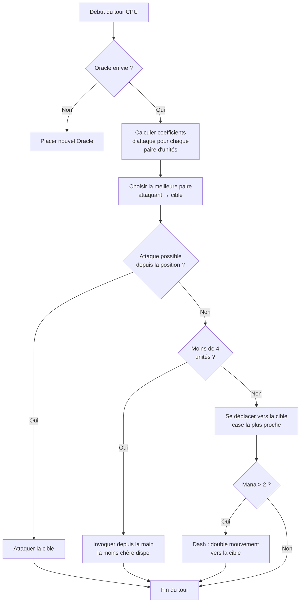

## Mon IA à la con pour Nausicaa

Y'a des projets qui commencent par "tiens si je faisais un jeu d'échecs avec des mythologies ?" et qui finissent par un truc avec une IA qui décide de ses propres hyper-paramètres tous les 5 tours.

Nausicaa c'est ça. Un jeu de plateau au tour par tour où tu construis ton deck de créatures mythologiques, tu gères ton mana, tu déploies des unités sur un plateau 10x8. Et y'a une IA qui a des crises de personnalité.

J'ai passé pas mal de temps sur cette IA, et le résultat est assez ingérable xD

## Le jeu en vrai

Avant de parler du cerveau, faut comprendre le corps :

- Plateau 10x8, zone de déploiement de 2 rangées par joueur
- Mana commence à 1, +1 par tour, max 6. Tu dépenses pour invoquer, attaquer, utiliser des capacités
- But : buter l'Oracle adverse

12 unités, des coûts et des patterns de mouvement différents :

| Unit | Coût | Mouvement | PV |
| --- | --- | --- | --- |
| Oracle | 0 | Roi (8 directions) | 1 |
| Gobelin | 1 | Avant 3 cases | 1 |
| Harpie | 1 | Roi (8 directions) | 1 |
| Naïade | 1 | Diagonale | 1 |
| Griffin | 2 | Hop 2 cases | 2 |
| Sirène | 2 | Latéral | 1 |
| Centaure | 2 | Cavalier (en L) | 2 |
| Archer | 3 | Latéral | 1 |
| Phénix | 3 | Diagonale (cases sombres) | 1 |
| Métamorphe | 4 | Échange de place | 1 |
| Voyant | 4 | Aucun (genère du mana) | 1 |
| Titan | 6 | Limité (attaque zone) | 3 |

Chaque unité a son propre pattern d'attaque. La Sirène tape dans les 4 diagonales, l'Archer à distance sur 3 cases, le Titan détruit tout autour à l'invocation. Bref un jeu d'échecs avec du mytoches et du deckbuilding xD

## Comment j'ai fait réfléchir le CPU

L'idée de base est débilement simple : **chaque unité ennemie a un coefficient d'attractivité**. Plus elle est dangereuse, plus l'IA veut s'en occuper.

```javascript
const UNITS_ATTRACTIVENESS = {
    "oracle": 100,
    "titan": 95,
    "shapeshifter": 90,
    "phoenix": 80,
    "siren": 70,
    "archer": 70,
    "seer": 70,
    "griffin": 60,
    "centaur": 60,
    "harpy": 50,
    "naiad": 30,
    "gobelin": 20
};
```

Oracle à 100 -- logique, c'est la win condition. Titan à 95 parce qu'il OS tout à côté à l'invocation. Gobelin à 20, c'est un fantassin, on s'en branle.

Ensuite pour chaque paire d'unités (une alliée, une ennemie), je calcule :

```
interet = attractivite × coeff_attract / (distance × coeff_dist)
```

En gros : plus t'es dangereux et proche, plus l'IA veut te défoncer.

```javascript
calculateAttackCoefficient(x1, y1, x2, y2) {
    const distance = this.calculateEuclideanDistance(x1, y1, x2, y2);
    if (distance === 0) return Infinity;
    return (UNITS_ATTRACTIVENESS[unit.type] * COEFFICIENTS_IMPORTANCE["attractiveness"]) / distance;
}
```

### Le coup des coefficients qui changent

Là où c'est marrant c'est que les coefficients d'importance **changent aléatoirement tous les 5 tours**.

```javascript
if (this.turnCount % 5 === 0) {
    const distanceCoefficient = parseInt(Math.random() * 100);
    const attractivenessCoefficient = parseInt(Math.random() * 100);
    this.regulateImportanceCoefficients({
        distance: distanceCoefficient,
        attractiveness: attractivenessCoefficient
    });
}
```

Un coup l'IA va hyper agressive (attract à 95, distance à 5), elle traverse tout pour buter ton Oracle. Le coup d'après elle priorise la distance et se repositionne.

C'est piqué aux fantômes de Pac-Man -- Blinky chasse, Pinky embusque. Ici l'IA change de "personnalité" toutes les phases.

**Résultat : impossible de prédire l'IA sur une partie entière.** Le CPU fait jamais deux fois le même match.

### L'Oracle est une lopette

L'Oracle ennemi fuit. Littéralement.

```javascript
const awayFromTarget = {
    row: Math.max(0, Math.min(7, botUnitElement.row + (botUnitElement.row - targetUnitElement.row))),
    col: Math.max(0, Math.min(9, botUnitElement.col + (botUnitElement.col - targetUnitElement.col)))
};
```

Il calcule la direction opposée à la menace et se barre. Si y'a un mur, il cherche la case libre la plus proche dans cette direction.

Tu passes 3 tours à t'approcher de l'Oracle, et paf il s'est cassé comme une fillette xD

### La boucle de décision

Voilà comment l'IA décide :

1. Si j'ai plus d'Oracle (mort), en placer un nouveau
2. Calculer le coefficient pour chaque couple unité alliée → unité ennemie
3. Choisir la meilleure paire
4. Si l'unité peut attaquer la cible depuis sa position → attaque
5. Si j'ai moins de 4 unités → invoquer la moins chère disponible depuis la main
6. Sinon, se déplacer vers la cible (case de mouvement la plus proche de l'ennemi)
7. Si assez de mana (> 2), dash (double mouvement) pour se rapprocher encore
8. Si l'unité est l'Oracle → fuir



```javascript
async makeAction(dash=false) {
    // tout ça en séquence
    // le CPU dash si il a assez de mana
    if(botPlayer.mana > 2) {
        this.makeAction(true);
    }
}
```

### Pourquoi la distance euclidienne

J'utilise la distance euclidienne :

```javascript
calculateEuclideanDistance(x1, y1, x2, y2) {
    const deltaX = Math.pow(x1 - x2, 2);
    const deltaY = Math.pow(y1 - y2, 2);
    return Math.sqrt(deltaX + deltaY) * COEFFICIENTS_IMPORTANCE["distance"];
}
```

Pourquoi pas Manhattan ? Parce que les unités ont des patterns de mouvement variés (L comme le cavalier, diagonale, etc). La distance à vol d'oiseau est une meilleure approximation du danger.

## Pourquoi pas du minimax

J'aurais pu coder un minimax classique. Mais avec 12 types d'unités, des patterns de mouvement différents, des capacités spéciales... l'arbre de jeu explose tellement vite que ça devient injouable. L'approche heuristique fait des choix intelligents sans explorer 10 millions d'états.

## Ce qui est cool

Le système d'attractivité crée des dilemmes rigolos :

- Le Voyant (70) génère du mana. Si tu le laisses vivre, l'adversaire a plus de ressources. Mais le Titan (95) est encore plus dangereux.
- Le Métamorphe (90) peut échanger sa place avec n'importe quelle unité. Il peut voler ton Oracle.
- L'Harpie (50) a une attaque explosive qui la tue aussi. Pas prioritaire... jusqu'à ce qu'elle soit à côté de 3 de tes unités.

L'IA évalue le danger global selon les positions, pas juste les stats brutes.

Y'a aussi une fonction `activateSimulation()` pour tester des scénarios sans refaire une partie :

```javascript
activateSimulation() {
    // Place des unités spécifiques sur le plateau
    // Utile pour debugger l'IA
    this.game.board = simulation.board;
    this.game.players = simulation.players;
}
```

## Ce qui manque

Si j'avais plus de temps :

- L'IA réagit à l'état actuel, elle prédit pas ce que le joueur va faire
- Elle planifie pas sa main sur plusieurs tours
- Le Métamorphe et le Centaure ont des capacités qu'elle sous-exploit
- Apprentissage par renforcement : la faire jouer contre elle-même pour ajuster les coeffs

Mais pour un jeu de navigateur ça fait le taf. Des potes arrivent à perdre contre, donc c'est bon xD

## Teste

Dispo sur [nausicaa-game.github.io](https://nausicaa-game.github.io/). Tu cliques sur "JOUER", CPU mode ON, et tu regardes l'IA faire.

Conseil : laisse l'IA jouer contre elle-même. Tu vas voir des phases agressives, puis pfft elle recule tout.

Le code est sur [GitHub](https://github.com/nausicaa-game/nausicaa-game.github.io) dans `js/cpu.js`.

**3 trucs :**

1. **Coefficients heuristiques** -- pas de minimax, chaque unité a une attractivité
2. **Coeffs qui changent tous les 5 tours** -- l'IA alterne agressivité et contrôle, façon Pac-Man
3. **L'Oracle fuit** -- il calcule la direction opposée à la menace et se casse

Si t'as des idées pour rendre l'IA encore plus vicieuse, ouvre une issue. J'ai des plans pour une version qui apprend de ses défaites, mais ça sera pour un prochain article xD
