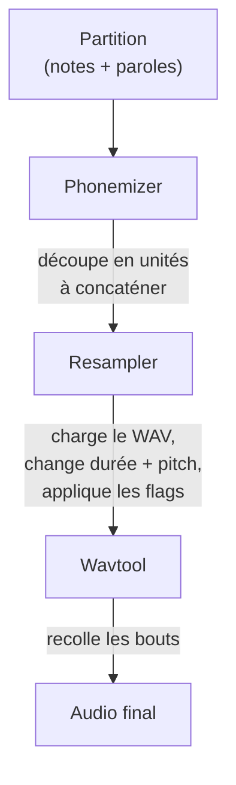

## UTAU : comment un logiciel en Visual Basic 6 a démocratisé la voix synthétique

J'en avais touché un mot sur ma page principale : j'aime UTAU. Voici pourquoi.

En 2008, si tu voulais faire chanter une voix synthétique, t'avais une option : VOCALOID. Le logiciel de Yamaha. Cher, propriétaire, avec des voix officielles que tu pouvais pas créer toi-même.

Et puis y'a un mec japonais, Ameya/Ayame, qui a sorti un truc dans son coin. Un logiciel codé en **Visual Basic 6**. Gratuit. Qui te laissait créer ta propre voix avec... des fichiers WAV que t'enregistrais toi-même.

Ce truc s'appelle **UTAU** (歌う, "chanter" en japonais). Et pour son époque, c'était de la magie.

J'ai toujours trouvé ce logiciel fascinant. Pas parce qu'il était propre techniquement (spoiler : en fait si, fallait vraiment y penser à créer ce truc d'encu... c'est un beau bordel, je pleure sur ce poulet), mais parce qu'il a fait un truc que personne d'autre faisait : il a donné la synthèse vocale au grand public. Genre toi, moi, n'importe qui avec un micro.

Laisse-moi t'expliquer pourquoi c'était génial.

---

## D'abord, pourquoi la synthèse de chant c'est galère

Une voix chantée, c'est pas des notes. T'as la consonne qui attaque, la voyelle qui tient, le souffle, les transitions entre les deux. Le "sa" de "salut" c'est un "s" qui siffle qui glisse vers un "a" ouvert, et c'est ce glissement qui sonne humain ou pas.

Aujourd'hui on règle ça au deep learning : t'entraînes un modèle sur des heures de chant et il génère la voix (Synthesizer V, DiffSinger). Mais ça c'est 2020+. En 2008, que dalle.

UTAU utilise la méthode d'avant, plus vieille et plus maligne : la **synthèse concaténative**.

---

## La synthèse concaténative : du copier-coller de bouts de voix

L'idée est bête comme chou : t'enregistres des petits bouts de voix et tu les colles ensemble pour former des mots. "salut" = échantillon "sa" + "lu" + "to", enchaînés. Un puzzle sonore piloté par une partition.

C'est le principe des YouTube Poop où on recoupe les mots d'un perso pour lui faire dire n'importe quoi -- sauf qu'ici c'est carré et automatisé.

Et UTAU vient littéralement de là. Avant lui existait le **"Jinriki Vocaloid"** (人力ボーカロイド, "Vocaloid manuel") : des gens découpaient à la main des pistes vocales, extrayaient les phonèmes, repitchaient, et réassemblaient le tout dans un éditeur audio pour imiter une voix VOCALOID. À la main. Tu imagines le taf.

Ameya a regardé cette galère et a codé l'outil pour l'automatiser. À la base UTAU était juste ça : un assistant pour Vocaloid manuel.

---

## Pourquoi c'était révolutionnaire : TU crées la voix

Voilà le truc qui change tout.

VOCALOID, tu achetais une voix. Miku, Luka, etc. Créées par des pros, vendues par Yamaha. Pas moyen d'en faire une toi-même. UTAU, **n'importe qui enregistre sa voix et en fait un instrument chantant**.

Le mode CV (le plus simple) c'est : t'enregistres les ~100 syllabes de base du japonais ("a", "ka", "sa", "ta"...), tu configures les points de découpe, et voilà ta voicebank. Quelques heures de boulot.

Résultat : l'écosystème a explosé. Des milliers de voicebanks créées par la communauté -- voix de fans, de potes, de persos inventés. Un univers entier de chanteurs virtuels, gratuit. Et le logiciel venait avec **Defoko** (Utane Uta), une voix par défaut générée via le moteur TTS AquesTalk, donc tu pouvais commencer même sans micro.

---

## Le oto.ini : le cœur du système

Comment UTAU sait où couper et coller les sons ? Via un fichier de config par voicebank : le **`oto.ini`**. Pour chaque WAV, il définit les points de découpe (en millisecondes) :

- **Offset** → silence à virer au début
- **Preutterance** → le point où la consonne passe à la voyelle (la frontière "s"→"a" dans "sa")
- **Overlap** → combien la note précédente déborde sur celle-ci
- **Fixed region** → la partie qui doit PAS être étirée sur une note longue (typiquement la consonne)
- **Cutoff** → où couper la fin

La **preutterance** est le param le plus malin. Une syllabe a toujours un bout de consonne avant la voyelle. Pour que ta note tombe sur le temps, c'est la *voyelle* qui doit tomber pile, pas la consonne. Donc UTAU décale l'échantillon en arrière : le "a" de "sa" atterrit sur le temps, le "s" déborde juste avant. Comme un batteur qui anticipe sa frappe pour que le son tombe juste -- sauf que là c'est dans un `.ini`.

Visuellement, sur un échantillon "ka", les zones du `oto.ini` se découpent comme ça :

```mermaid
flowchart LR
    A["🔇 silence<br/>(offset)"] --> B["🅺 consonne<br/>(fixed region,<br/>pas étirée)"]
    B --> C["🅰 voyelle<br/>(zone étirable)"]
    C --> D["🔇 fin coupée<br/>(cutoff)"]
    style B fill:#3b4a6b
    style C fill:#5b3b6b
```



La frontière entre la consonne et la voyelle, c'est la preutterance. La voyelle est la zone qu'on étire pour les notes longues ; la consonne reste intacte, sinon ton "k" durerait deux secondes et sonnerait horrible.

```ini
# oto.ini (simplifié)
# fichier=alias,offset,consonant,cutoff,preutterance,overlap
_ka.wav=ka,120,80,-200,90,40
```

Cinq valeurs par son, sur tous tes échantillons, et UTAU assemble n'importe quel mot proprement.

---

## CV, VCV, CVVC : la course au réalisme

Le mode de base, **CV** (Consonne-Voyelle), c'est un son par syllabe. Simple mais un peu robotique : les jointures entre syllabes sont brutes.

En 2010 la communauté invente le **VCV** (Voyelle-Consonne-Voyelle). Au lieu d'enregistrer "ka" seul, tu enregistres "a ka" -- avec la queue de la voyelle précédente. La transition devient naturelle parce qu'elle est *dans* l'enregistrement, pas calculée après coup.

Le détail qui pique : **VOCALOID a pas eu le VCV avant VOCALOID3, en 2011.** Le freeware en VB6 codé par un type tout seul a devancé Yamaha d'un an sur le réalisme des transitions. Une communauté de fans plus rapide que la multinationale.

Ensuite sont venus le **CVVC**, l'**ARPAsing** (anglais), le **VCCV**... chaque méthode poussant le réalisme plus loin, toutes inventées et documentées par la communauté.

---

## Le pipeline complet : comment un mot devient du son

Quand tu places une note et que tu tape une parole, voilà ce qui se passe en coulisses :



Le **resampler** est la pièce maîtresse : il prend ton échantillon "ka" enregistré à une hauteur donnée et le réétire/repitche pour matcher la note voulue -- en n'étirant que la zone étirable et en gardant la consonne intacte (d'où le `oto.ini`).

Et il est **modulaire**. UTAU venait avec un resampler de base, mais la communauté en a pondu d'autres (moresampler, TIPS...), chacun avec son grain sonore. Tu changeais de moteur de synthèse comme un plugin. En 2008. Sur un freeware.

---

## Le bordel sous le capot (et pourquoi c'est attachant)

Faut être honnête sur l'état technique du bouzin :

- **Codé en Visual Basic 6.** Un langage déjà mort en 2008. Faut le runtime VB6 pour le faire tourner.
- **Windows only à la base** (le portage Mac, UTAU-Synth, est venu en 2011).
- **Encodage Shift-JIS obligatoire.** Si tes fichiers sont pas encodés en Shift-JIS japonais, UTAU comprend rien. Encore aujourd'hui faut souvent mettre son PC en locale japonaise ou utiliser AppLocale pour le lancer.
- **Interface austère**, documentation quasi 100% en japonais à l'époque.

Et pourtant. Pourtant ce truc a créé un mouvement mondial. Des dizaines de milliers de voicebanks. Des chansons écoutées des millions de fois.

Le meilleur exemple : **Kasane Teto**. Un personnage créé en 2008 et balancé comme un canular du 1er avril, en se faisant passer pour une VOCALOID. C'était une blague. Sauf que les gens ont adoré le personnage, une vraie voicebank UTAU a été créée derrière, et Teto est devenue une des chanteuses virtuelles les plus célèbres au monde. En 2023 elle a même eu droit à une voix Synthesizer V officielle. Un personnage né d'un poisson d'avril sur un logiciel gratuit.

---

## Pourquoi ça compte encore

UTAU c'est l'exemple parfait d'une techno "pauvre" qui gagne par l'ouverture.

VOCALOID était techniquement supérieur, mieux financé, plus pro. Mais fermé. UTAU était bricolé, moche, en VB6 -- mais il laissait tout le monde participer. Créer des voix, créer des resamplers, créer des plugins, créer des méthodes d'enregistrement. La communauté a fait le reste.

Et le concept survit complètement aujourd'hui. **OpenUtau**, un successeur open-source moderne, reprend l'idée et la dépoussière (multi-plateforme, UTF-8, support des resamplers modernes ET de l'IA). La synthèse concaténative tient encore debout à côté des modèles deep learning, parce qu'elle a un truc qu'ils ont pas : tu comprends exactement ce qui se passe, et tu contrôles chaque milliseconde.

C'est ça qui m'a toujours plu dans UTAU. Tu vois exactement ce qui se passe. C'est pas une IA qui te crache un truc magique que tu comprends pas : t'as tes WAV, tes points de découpe, et c'est toi qui décides de tout. Quand ça sonne mal, tu sais pourquoi et tu peux corriger. J'aime ce genre de contrôle.

---

**Les 3 trucs à retenir :**

1. **Synthèse concaténative = puzzle de voix** -- UTAU colle des petits échantillons WAV ensemble pour former des mots. Le `oto.ini` définit où couper et coller chaque son. Tu contrôles tout, à la milliseconde, sans boîte noire.

2. **L'ouverture bat la technique** -- VOCALOID était meilleur mais fermé. UTAU était bricolé mais laissait tout le monde créer ses voix. La communauté a fait exploser l'écosystème, et a même devancé Yamaha sur le VCV.

3. **Une bonne idée survit à son code** -- VB6, Shift-JIS, Windows only... et pourtant le concept tourne encore via OpenUtau. Une techno géniale peut être codée avec les pieds.

Honnêtement, rien que pour Kasane Teto née d'un poisson d'avril, ce logiciel mérite le respect xD
