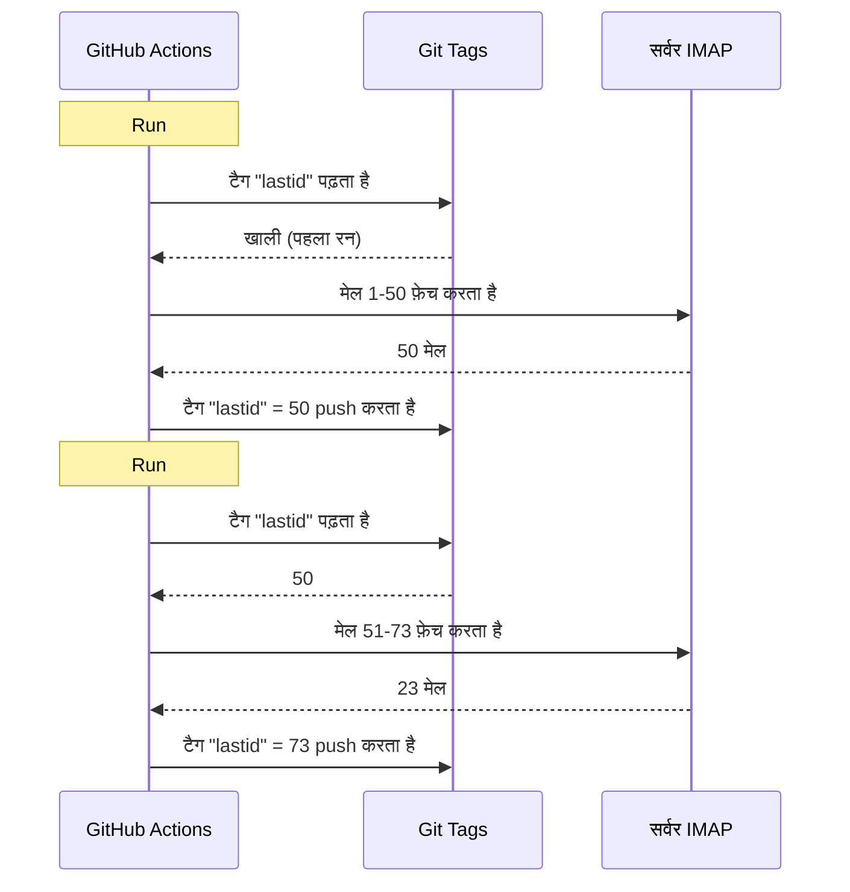

# मैंने git को डेटाबेस की तरह इस्तेमाल करके GitHub Actions पर मुफ्त बॉट बनाया

मेरे पास एक ऑटोमैटिक ईमेल रिप्लायर है जो 24/7 चलता है।

यह मेरे मेल पढ़ता है, समझता है कि किस बारे में बात है, और AI से अपने आप जवाब देता है। यह पिछली बातचीत को याद रखता है। यह न्यूज़लेटर और `noreply@` को इग्नोर करता है। जब बहुत संवेदनशील हो तो इंसान को फॉरवर्ड करता है।

मासिक खर्च : **0€**.

कोई सर्वर नहीं। कोई VPS नहीं। कोई डेटाबेस नहीं। बस GitHub Actions और एक दिमागी हैक : **git को डेटाबेस की तरह इस्तेमाल करना**।

समझे क्या हो रहा है? नहीं? अच्छा, पकड़ो, यह बेवकूफी भी है और शानदार भी।

---

## समस्या : GitHub Actions स्टेटलेस है

GitHub Actions मुफ्त है। तुम हर 5 मिनट में cron चला सकते हो, अपना कोड चला सकते हो, मुफ्त।

लेकिन एक समस्या है : यह **स्टेटलेस** है।

हर रन एक खाली मशीन पर शुरू होता है। दो रनों के बीच कुछ सेव नहीं होता। पिछला रन? भूल गया। मिटा दिया। जैसे कभी था ही नहीं।

एक ईमेल रिप्लायर के लिए, यह एक बड़ी समस्या है। जैसे :

> "आखिरी मेल जो मैंने प्रोसेस किया वह कौन सा था?"

अगर बॉट हर रन पर यह भूल जाए, तो वह या तो उन्हीं मेलों का बार-बार जवाब देगा (आपदा), या मेल छोड़ देगा।

एक पर्सिस्टेंट स्टेट चाहिए। और आमतौर पर, पर्सिस्टेंट स्टेट = डेटाबेस। लेकिन डेटाबेस का मतलब सर्वर, और सर्वर का मतलब मुफ्त नहीं।

यहाँ यह दिलचस्प हो जाता है।

---

## समाधान : git टैग को डेटाबेस की तरह

तुम्हारा GitHub रिपॉजिटरी पहले से ही पर्सिस्टेंट स्टोरेज है। मुफ्त। वर्शन्ड। हमेशा मौजूद।

तो क्यों न वहाँ स्टेट स्टोर किया जाए?

आइडिया : हर रन पर, बॉट एक **git टैग** से आखिरी प्रोसेस किया गया UID पढ़ता है। वह नए मेल प्रोसेस करता है। फिर नए UID के साथ टैग को फिर से push करता है।



git टैग ही डेटाबेस है। एक ही वैल्यू, लेकिन हमें बस इतना चाहिए।

### स्टेट पढ़ना

जॉब की शुरुआत में, टैग से वैल्यू ली जाती है :

```bash
git fetch origin --tags lastid || true
git show refs/tags/lastid:data/lastId > data/lastId || true
```

`git show refs/tags/lastid:data/lastId` का मतलब : "मुझे `data/lastId` फ़ाइल की सामग्री दे जैसी वह `lastid` टैग में थी"।

बूम। तुम्हें अपनी वैल्यू मिल गई, बिना डेटाबेस के।

### स्टेट लिखना

अंत में, नई वैल्यू के साथ टैग फिर से बनाया जाता है :

```bash
git switch --orphan lastid-tmp   # बिना हिस्ट्री वाली नई ब्रांच
git rm -rf .                      # सब खाली करो
mkdir -p data
printf "%s\n" "${LAST_ID_CONTENT}" > data/lastId

git add data/lastId
git commit -m "lastId snapshot"
git tag -f lastid                 # इस कमिट पर टैग फ़ोर्स करो
git push --force ...origin lastid # टैग push करो
```

हम एक **ऑर्फ़न** ब्रांच बनाते हैं (बिना हिस्ट्री), बस `lastId` फ़ाइल डालते हैं, कमिट करते हैं, टैग करते हैं, फ़ोर्स push करते हैं।

ऑर्फ़न क्यों? ताकि रिपॉजिटरी हिस्ट्री में 10,000 स्टेट कमिट जमा न हों। हर अपडेट पिछले को मिटा देता है। टैग हमेशा एक ही कमिट की ओर इशारा करता है जिसमें एक ही वैल्यू है।

यह साफ है। यह मुफ्त है। यह पूरी तरह पागलपन है xD

---

## दूसरा हैक : runtime स्नैपशॉट

GitHub Actions की एक और समस्या है : `npm install`।

अगर हर रन (हर 5 मिनट) पर तुम `npm install` + `npm run build` करते हो, तो तुम हर बार 60-90 सेकंड बर्बाद करते हो। बार-बार cron पर, यह कंप्यूट समय की बर्बादी है।

समाधान : कोड को एक बार प्री-कंपाइल करो, और उसे भी git टैग में स्टोर करो।

Build वर्कफ़्लो (जो `master` पर push करने पर चलता है) यह करता है :

```bash
# कोड कंपाइल करो
bun install
bun run build

# dist/ + node_modules/ को "runtime" टैग में स्टोर करो
git checkout --orphan temp-runtime
git rm -rf .
cp -r "$TMPDIR"/* .
git add dist node_modules package.json bun.lock data
git commit -m "runtime build"
git tag -f runtime
git push --force ...origin runtime
```

`runtime` टैग में कंपाइल किया हुआ कोड और `node_modules` दोनों हैं। चलने के लिए पूरी तरह तैयार।

और cron सीधे इस टैग को checkout करता है :

```yaml
- name: Checkout runtime snapshot
  uses: actions/checkout@v4
  with:
    ref: refs/tags/runtime    # प्री-बिल्ट कोड, सोर्स नहीं
    fetch-depth: 1

# कोई npm install नहीं, कोई build नहीं !
- name: Process emails
  run: node dist/index.js --action
```

कोई install नहीं। कोई build नहीं। cron तुरंत शुरू होता है और बस `node dist/index.js` चलाता है।

जैसे, तुम्हारे पास दो टैग हैं जो दो काम करते हैं :
- `runtime` = चलने के लिए तैयार कोड (जब तुम कोड push करते हो तो अपडेट होता है)
- `lastid` = पर्सिस्टेंट स्टेट (हर रन पर अपडेट होता है)

बड़ी बदमाशी से सुंदर है।

---

## बॉट खुद : AI ऑटो-रिप्लायर

अच्छा, git हैक तो मस्त है, लेकिन बॉट असल में क्या करता है?

यह IMAP के ज़रिए तुम्हारे मेल पढ़ता है, उन्हें AI (Groq + Llama 3.3 70B) से समझता है, और ऑटोमैटिक जवाब देता है।

डिपेंडेंसी इंजेक्शन (InversifyJS) के साथ साफ सर्विस आर्किटेक्चर :

```
App
├── ImapService      → मेल पढ़ता है (IMAP)
├── SmtpService      → जवाब भेजता है (SMTP)
├── ParserService    → मेल की सामग्री पार्स करता है
├── ReplyService     → AI जवाब जनरेट करता है
├── SummaryService   → बातचीत की मेमोरी
├── AccountsService  → कई ईमेल अकाउंट प्रबंधित करता है
└── ConfigService    → कॉन्फ़िग / env वेरिएबल
```

### दो मोड में काम करना

बॉट दो तरह से चल सकता है :

**Listener मोड** (रियल-टाइम) : एक्सपोनेंशियल रीकनेक्ट के साथ स्थायी IMAP कनेक्शन। VPS के लिए।

```typescript
this.imapService.on("exists", async (data) => {
  console.log(`[MAIL] नया मेल! कुल: ${data.count}`);
  // नए मेल को तुरंत प्रोसेस करो
});
```

**Action मोड** (batch) : `lastId` से नए मेल प्रोसेस करता है, फिर बंद हो जाता है। GitHub Actions cron के लिए।

```bash
node dist/index.js --action
```

`--action` मोड वह है जो git हैक का इस्तेमाल करता है। वह `lastId` पढ़ता है, जो नया है उसे प्रोसेस करता है, नया `lastId` लिखता है, खत्म।

### रोबोट को जवाब न दें

अगर तुम्हारा बॉट सभी मेलों का जवाब देता है, तो वह न्यूज़लेटर, नोटिफिकेशन, `noreply@` का जवाब देगा। आपदा। बुरा : अगर दो बॉट एक-दूसरे को जवाब देते हैं, तो मेल का अंतहीन लूप बन जाता है। बुरा सपना।

इसलिए आक्रामक फ़िल्टरिंग :

```typescript
export function isAutomatedSender(address) {
  const automatedPatterns = [
    "noreply", "no-reply", "donotreply",
    "mailer-daemon", "postmaster", "bounce",
    "newsletter", "notification", "marketing",
    "billing", "receipt", "promo", ...
  ];
  const local = address.split("@")[0].toLowerCase();
  return automatedPatterns.some(p => local.includes(p));
}
```

और ईमेल हेडर के ज़रिए डिटेक्शन भी :

```typescript
export function isAutomatedByHeaders(headers) {
  return (
    ["bulk", "list", "junk"].includes(headers.precedence) ||
    headers["auto-submitted"] !== "no" ||
    headers["list-unsubscribe"] !== "" ||   // न्यूज़लेटर में यह होता है
    /mailchimp|sendgrid|mailgun|brevo/i.test(headers["x-mailer"])
  );
}
```

हेडर में `List-Unsubscribe`? यह न्यूज़लेटर है। `Precedence: bulk`? मास-मेलिंग है। `X-Mailer: Mailchimp`? समझ गए। हम इग्नोर करते हैं।

यह नाइट क्लब के बाउंसर जैसा है : रोबोट अंदर नहीं आ सकते xD

### जादुई ट्रिगर

AI तय कर सकता है कि बिल्कुल जवाब न दें, या इंसान को सौंप दें। कैसे? अपने जवाब में खास ट्रिगर के साथ।

सिस्टम प्रॉम्प्ट उसे बताता है :

> अगर यह ऑटोमैटिक मेल/न्यूज़लेटर है → `<no_reply>` जवाब दो
> अगर यह बहुत महत्वपूर्ण/संवेदनशील है (कानूनी, वित्तीय...) → `<manual_reply_required>` जवाब दो
> नहीं तो → एक सच्चा जवाब लिखो

और कोड यह पढ़ता है :

```typescript
const aiReply = completion.choices[0].message.content.trim();
const manualTrigger = aiReply.includes(MANUAL_REPLY_TRIGGER);
const noReply = aiReply.includes(NO_REPLY_TRIGGER);

if (noReply) {
  console.log("[MAIL] AI ने इग्नोर करने का फैसला किया। Skip.");
  return;
}

if (manualTrigger) {
  console.log("[MAIL] बहुत संवेदनशील, इंसान को फॉरवर्ड कर रहा हूँ।");
  await this.smtpService.sendManualForward(...);
  return;
}

// नहीं तो AI जवाब भेजो
await this.smtpService.sendReply(...);
```

जैसे AI को यह कहने का अधिकार है कि "नहीं, यह मैं नहीं छूऊँगा, असली इंसान को बुलाओ"। यह समझदारी है।

---

## बातचीत की मेमोरी

एक छोटी सी डिटेल जो सब कुछ बदल देती है : बॉट **बातचीत को याद** रखता है।

जब वह किसी को जवाब देता है, तो बातचीत का सारांश सेव करता है। अगली बार जब वही व्यक्ति लिखता है, तो सारांश फिर से प्रॉम्प्ट में डाला जाता है।

स्टोरेज : हर संपर्क के लिए एक JSON फ़ाइल।

```
data/customers/
├── moi%40gmail.com/
│   ├── alice%40example.com.json
│   └── bob%40client.fr.json
```

और सारांश खुद AI द्वारा जनरेट किया जाता है, जो पुराने सारांश को नए संदेश के साथ मर्ज करता है :

```typescript
const completion = await groq.chat.completions.create({
  model: "llama-3.3-70b-versatile",
  messages: [
    { role: "system", content: "तुम एक मेमोरी असिस्टेंट हो। पुराने सारांश को नए संदेश के साथ बिना जानकारी खोए मर्ज करो।" },
    { role: "user", content: `मौजूदा सारांश:\n${existing}\n\nनया संदेश:\n${incomingContent}` }
  ],
  temperature: 0.0,  // डिटरमिनिस्टिक, कोई क्रिएटिविटी नहीं
  max_tokens: 800,
});
```

तो बॉट समय के साथ एक कंप्रेस्ड मेमोरी बनाता है। सभी मेल स्टोर करने की ज़रूरत नहीं, बस एक सारांश जो समझदारी से बढ़ता है।

और ये JSON फ़ाइलें? वे भी git में स्टोर होती हैं, runtime टैग में। हर जगह git xD

---

## प्रॉम्प्ट लंबाई का चालाक तरीका

छोटी तकनीकी डिटेल जिसने मुझे मुस्कुराने पर मजबूर कर दिया।

मॉडल की एक टोकन सीमा होती है। अगर तुम्हारा मेल + सारांश + persona प्रॉम्प्ट उससे ज़्यादा हो, तो API एरर लौटाता है।

कोड इसे **कैस्केडिंग ट्रंकेशन** + retry से हैंडल करता है :

```typescript
try {
  // पहली कोशिश सामान्य सीमाओं के साथ
  completion = await groq.chat.completions.create({...});
} catch (error) {
  if (!this.isLengthError(error)) throw error;

  // लंबाई की एरर थी : छोटी सीमाओं के साथ फिर से कोशिश करो
  ({ systemContent, userContent } = this.buildPromptPayload({
    ...,
    limits: {
      systemPromptChars: 2200,  // 3000 की जगह
      summaryChars: 1800,       // 4000 की जगह
      personaChars: 900,        // 1500 की जगह
      userContentChars: 2200,   // 8000 की जगह
    },
  }));
  completion = await groq.chat.completions.create({...});  // retry
}
```

अगर फिर भी नहीं हुआ, तो और छोटा काटो और फिर से कोशिश करो। सरल, प्रभावी, कोई क्रैश नहीं।

---

## अच्छा, और असल में यह कैसे चलता है?

एक cron रन का पूरा फ्लो :

```
1. GitHub Actions ट्रिगर होता है (हर 5 मिनट में cron)
2. "runtime" टैग checkout करता है (प्री-बिल्ट कोड)
3. git show refs/tags/lastid → आखिरी प्रोसेस किया गया UID लेता है
4. node dist/index.js --action
   ├── IMAP कनेक्शन
   ├── lastId+1 से मेल फ़ेच करता है
   ├── हर मेल के लिए :
   │   ├── सामग्री पार्स करता है
   │   ├── रोबोट फ़िल्टर करता है (automated हो तो skip)
   │   ├── प्राप्तकर्ता अकाउंट मैच करता है
   │   ├── बातचीत की मेमोरी लेता है
   │   ├── AI जवाब जनरेट करता है (Groq)
   │   ├── <no_reply> ? skip
   │   ├── <manual_reply_required> ? इंसान को फॉरवर्ड
   │   ├── नहीं तो : जवाब भेजता है (SMTP)
   │   └── बातचीत की मेमोरी अपडेट करता है
   └── नया lastId लिखता है
5. नई वैल्यू के साथ git push --force टैग "lastid"
```

और यह 5 मिनट में फिर से शुरू हो जाता है। हमेशा के लिए। मुफ्त।

---

**याद रखने वाली 3 बातें :**

1. **Git = मुफ्त डेटाबेस** -- एक ऑर्फ़न टैग तुम्हारा पर्सिस्टेंट स्टेट दो स्टेटलेस रनों के बीच स्टोर कर सकता है। `git show refs/tags/X:fichier` पढ़ने के लिए, force-push लिखने के लिए। DB की ज़रूरत नहीं।

2. **runtime टैग में प्री-कंपाइल करो** -- हर cron रन पर `npm install` करने की बजाय, कंपाइल कोड + node_modules को git टैग में स्टोर करो। cron तुरंत शुरू होता है।

3. **AI बॉट को चुप रहना आना चाहिए** -- `<no_reply>` और `<manual_reply_required>` ट्रिगर AI को जवाब न देने या इंसान को सौंपने का फैसला करने देते हैं। साथ में एंटी-रोबोट फ़िल्टरिंग। नहीं तो तुम एक अंतहीन मेल लूप बनाओगे।

Serverless cron पर्सिस्टेंट स्टेट, AI, मेमोरी के साथ, पूरी चीज़ 0€/महीने। यह पूरी तरह पागलपन है और मुझे यह पसंद है xD
