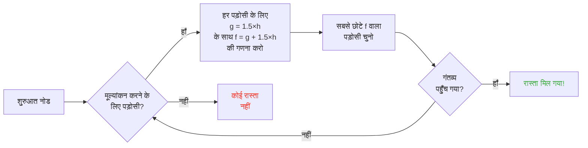

## परिचय

मैंने घंटों भेड़ों को दीवारों से टकराते देखा है।

और सच कहूँ? ज़िंदगी का सबसे अच्छा निवेश xD

क्योंकि जितना तुम इन मॉब्स को देखोगे, उतना ही एहसास होगा कि इनमें कुछ भी रैंडम नहीं है। हर हरकत कोडेड है, पूर्वानुमेय है, और सबसे ज़रूरी -- पूरी तरह तोड़ने योग्य। मैंने Minecraft के सोर्स कोड में गोता लगाया ताकि समझ सकूँ कि पाथफ़ाइंडिंग असल में कैसे काम करता है, और मैंने पाया कि तुम सचमुच मॉब्स को माइंड-कंट्रोल कर सकते हो। मतलब, उन्हें वहाँ जाने के लिए मजबूर करना जहाँ तुम चाहो, न कि जहाँ संयोग तय करे।

यह गाइड वह सब कुछ है जो मैंने छानबीन करके सीखा। AI, A* एल्गोरिदम, छिपे हुए मैलस, वो एक्सप्लॉइट जो तुम सर्वाइवल में इस्तेमाल कर सकते हो। अपनी कुदाल तैयार रखो।

---

## मॉब्स का AI कैसे काम करता है (स्पॉइलर: यह बेवकूफी भरा है)

### Goals (लक्ष्य)

हर मॉब के *goals* होते हैं। यह उन चीज़ों की एक सूची है जो वह कर सकता है और वह उन्हें कितना करना चाहता है। संख्या जितनी छोटी, उतनी ज़्यादा प्राथमिकता -- बिल्कुल अराजकता वर्जन की टू-डू लिस्ट जैसा।

```java
protected void registerGoals() {
   this.goalSelector.addGoal(4, new Zombie.ZombieAttackTurtleEggGoal(this, 1.0, 3));
   this.goalSelector.addGoal(8, new LookAtPlayerGoal(this, Player.class, 8.0F));
   this.goalSelector.addGoal(8, new RandomLookAroundGoal(this));
   this.addBehaviourGoals();
}
```

तुमने कभी ज़ॉम्बी को कछुए के अंडे को नज़रअंदाज़ करके तुम्हारे पीछे भागते देखा है? यही वजह है: `ZombieAttackTurtleEggGoal` की प्राथमिकता 4 है, जबकि `ZombieAttackGoal` (जो उसे तुम्हारा मुँह खाने को कहता है) की प्राथमिकता 2 है।

हाँ, एक ज़ॉम्बी तुम्हें खाना पसंद करेगा बजाय अंडा तोड़ने के। कितना प्यार है न xD

जो goal हमारे लिए सचमुच मायने रखता है वह है `WaterAvoidingRandomStrollGoal`, प्राथमिकता 7। "मेरे पास करने को कुछ नहीं तो बेतरतीब घूमता हूँ" वाला goal। यहीं से गड़बड़ शुरू होती है।

### गति (या "एक रैंडम वॉक के होने की 1/60 संभावना कैसे है")

हर tick (हर 0.05 सेकंड) पर, गेम `canUse()` को कॉल करता है यह देखने के लिए कि मॉब हिलने की कृपा करेगा या नहीं। हर tick पर 1 मौका 60 में। डिज़ाइन पूरी तरह बेवकूफी भरा है, और मुझे यह पसंद है।

```java
public boolean canUse() {
   if (this.mob.hasControllingPassenger()) {
      return false;
   } else {
      if (!this.forceTrigger) {
         if (this.checkNoActionTime && this.mob.getNoActionTime() >= 100) {
            return false;
         }
         if (this.mob.getRandom().nextInt(reducedTickDelay(this.interval)) != 0) {
            return false;
         }
      }
      Vec3 $$0 = this.getPosition();
      if ($$0 == null) {
         return false;
      } else {
         this.wantedX = $$0.x;
         this.wantedY = $$0.y;
         this.wantedZ = $$0.z;
         this.forceTrigger = false;
         return true;
      }
   }
}
```

तो संक्षेप में: अगर तुम मॉब पर सवार हो -> नहीं, अगर मॉब ने 5 सेकंड से कुछ नहीं किया -> नहीं, अगर रैंडम ने ना कहा -> नहीं। गेम सचमुच नहीं चाहता कि मॉब हिले।

लेकिन जब वह हिलता है, `getPosition()` कमान संभालता है:

```java
protected Vec3 getPosition() {
   if (this.mob.isInWater()) {
      Vec3 $$0 = LandRandomPos.getPos(this.mob, 15, 7);
      return $$0 == null ? super.getPosition() : $$0;
   } else {
      return this.mob.getRandom().nextFloat() >= this.probability
         ? LandRandomPos.getPos(this.mob, 10, 7)
         : super.getPosition();
   }
}
```

अंत में उन दो नंबरों को देखो: यह XZ त्रिज्या और Y त्रिज्या है। पानी में, मॉब आगे तलाशता है (10 की बजाय 15)। अगर ज़मीन नहीं मिलती, तो वह `super.getPosition()` पर चला जाता है जो पानी को स्वीकार करता है। **परिणाम: मॉब पानी से बाहर निकलना चाहते हैं।** यही कारण है कि तुम्हारे जानवर पागलों की तरह किनारे की ओर तैरते हैं।

एक रसदार छोटी डिटेल: सचमुच 0.1% मौका है कि मॉब `LandRandomPos` के बजाय `super.getPosition()` ले। एक हजार में एक। Mojang है न xD

### LandRandomPos: घटिया ऑप्टिमाइज़ेशन जो सब कुछ बदल देता है

यह मेरा सबसे पसंदीदा चरण है। सबसे खूबसूरत तकनीकी बेवकूफी जो पाथफ़ाइंडिंग को दोहन योग्य बनाती है।

```java
public static Vec3 getPos(PathfinderMob $$0, int $$1, int $$2, ToDoubleFunction<BlockPos> $$3) {
   boolean $$4 = GoalUtils.mobRestricted($$0, $$1);
   return RandomPos.generateRandomPos(() -> {
      BlockPos $$4xx = RandomPos.generateRandomDirection($$0.getRandom(), $$1, $$2);
      BlockPos $$5 = generateRandomPosTowardDirection($$0, $$1, $$4, $$4xx);
      return $$5 == null ? null : movePosUpOutOfSolid($$0, $$5);
   }, $$3);
}
```

`movePosUpOutOfSolid`. नाम ही सब कह देता है। अगर चुनी गई पोज़ीशन किसी ठोस ब्लॉक के अंदर है, तो गेम उसे ऊपर धकेलता है जब तक वह हवा में न हो।

यह एक ऑप्टिमाइज़ेशन है: भूमिगत पोज़ीशनों को नज़रअंदाज़ करने में समय बर्बाद करने के बजाय, गेम उन्हें सतह पर ले आता है। चतुर? हाँ। लेकिन यह एक जबरदस्त बायस पैदा करता है: **मॉब ऊँचाइयों को पसंद करते हैं**।

सोचो। सतह के नीचे ढेर सारे ब्लॉक हैं, गेम 10 रैंडम पोज़ीशन जनरेट करता है। जो ब्लॉकों के अंदर हैं उन्हें ऊपर धकेल दिया जाता है। घने क्षेत्र (किसी पहाड़ी के नीचे) खोखले क्षेत्रों की तुलना में अधिक मान्य पोज़ीशन पैदा करते हैं। नतीजा: मॉब सांख्यिकीय रूप से अधिक बार पहाड़ी की ओर जाता है।

मुझ पर भरोसा करो, हम इसे 2 मिनट में तोड़ देंगे।

### चयन: सबसे अच्छे ब्लॉक की प्रतियोगिता

10 पोज़ीशन, एक विजेता, एक स्कोर प्रतियोगिता:

```java
public static Vec3 generateRandomPos(Supplier<BlockPos> $$0, ToDoubleFunction<BlockPos> $$1) {
   double $$2 = Double.NEGATIVE_INFINITY;
   BlockPos $$3 = null;
   for(int $$4 = 0; $$4 < 10; ++$$4) {
      BlockPos $$5 = (BlockPos)$$0.get();
      if ($$5 != null) {
         double $$6 = $$1.applyAsDouble($$5);
         if ($$6 > $$2) {
            $$2 = $$6;
            $$3 = $$5;
         }
      }
   }
   return $$3 != null ? Vec3.atBottomCenterOf($$3) : null;
}
```

सबसे अच्छा स्कोर वाली पोज़ीशन जीतती है। और अगर हम स्कोर के मापदंड जानते हैं, तो हम अपनी मनचाही पोज़ीशन जितवा सकते हैं। यह चुनावों में धांधली करने जैसा है।

---

## मॉब्स की पसंद (या "क्यों तुम्हारी गाय सड़क पार करती है")

हर मॉब की अलग पसंद होती है। और यह सब कुछ बदल देता है।

| मॉब | यह पसंद है |
| --- | --- |
| **जानवर** (गाय, भेड़, सूअर) | घास और रोशनी (हिप्स्टर) |
| **मॉन्स्टर** (ज़ॉम्बी, स्केलेटन) | अंधेरा (एजलॉर्ड) |
| **कछुए** | पानी, नहीं तो रेत, नहीं तो रोशनी |
| **हॉगलिन** | `crimson_nylium`; `warped_fungus` से नफरत |
| **स्ट्राइडर** | सिर्फ लावा। और कुछ नहीं। |
| **सिल्वरफ़िश** | संक्रमित होने योग्य ब्लॉक (लॉजिकल) |
| **गार्डियन** | पानी + रोशनी (स्नॉब) |
| **मशरूम** | माइसीलियम + रोशनी (मशरूम) |
| **मधुमक्खियाँ** | हवा। हाँ, उन्हें हवा पसंद है। |

```java
// Animal: नीचे देखो, अगर घास है तो अधिकतम स्कोर
public float getWalkTargetValue(BlockPos $$0, LevelReader $$1) {
   return $$1.getBlockState($$0.below()).is(Blocks.GRASS_BLOCK) ? 10.0F : $$1.getPathfindingCostFromLightLevels($$0);
}

// Monster: बिल्कुल उल्टा
public float getWalkTargetValue(BlockPos $$0, LevelReader $$1) {
   return -$$1.getPathfindingCostFromLightLevels($$0);
}
```

जैसे मॉन्स्टर सचमुच में "अगर रोशनी है तो स्कोर नेगेटिव, मैं कहीं और जाऊँगा" होते हैं। वे रोशनी से मुँह फेर लेते हैं xD

तो तुम सचमुच -- अपने जानवरों को घास और रोशनी से, और अपने मॉन्स्टरों को अंधेरे से गाइड कर सकते हो। यह एक ही समय में बेवकूफी भरा और प्रतिभाशाली है।

---

## Minecraft में A* एल्गोरिदम (गुप्त फॉर्मूला)

Minecraft पाथफ़ाइंडिंग के लिए A* (A-star) एल्गोरिदम का उपयोग करता है। लेकिन Mojang ने अपनी छाप छोड़ी है:

```
f(n) = g(n) + 1.5 × h(n)
```

- **g(n)** = अब तक तय किया गया पथ (1 प्रति ब्लॉक, विकर्ण में ~1.41)
- **h(n)** = सीधी दूरी (जैसे उड़ता हुआ कौआ)
- **1.5** = क्योंकि Mojang को थोड़ी टूटी-फूटी चीज़ें पसंद हैं

सामान्यतः A* `f(n) = g(n) + h(n)` का उपयोग करता है। MOJANG ने 1.5 का फैक्टर जोड़ा है। क्यों? ताकि एल्गोरिदम गंतव्य की ओर तेज़ी से जाए और कम सर्च ब्रांच काटे। परिणाम: मिला रास्ता "अच्छा" है लेकिन हमेशा सबसे अच्छा नहीं। यह थोड़ा नशे में A* है।



महत्वपूर्ण विवरण: **एक मॉब केवल 16 ब्लॉक तक पाथफ़ाइंड कर सकता है** (उसकी *follow range*)। अगर गंतव्य बहुत दूर है, तो वह सबसे नज़दीकी ब्लॉक चुनता है जिस तक वह पहुँच सकता है। इसका मतलब है कि तुम एक ऐसा मोनोलिथ बना सकते हो जो पहुँच से बाहर हो, और मॉब उसके सबसे नज़दीकी ब्लॉक तक पाथफ़ाइंड करेगा जो उसे मोनोलिथ के करीब ले जाए -- जिससे उसकी हरकतें पूरी तरह पूर्वानुमेय हो जाती हैं।

### दो एक्सप्लॉइट जो गेम तोड़ देते हैं

#### 1. Block updates = जबरन पुनर्गणना

```java
public boolean shouldRecomputePath(BlockPos $$0) {
   if (this.hasDelayedRecomputation) return false;
   if (this.path != null && !this.path.isDone() && this.path.getNodeCount() != 0) {
      Node $$1 = this.path.getEndNode();
      Vec3 $$2 = new Vec3(
         ((double)$$1.x + this.mob.getX()) / 2.0,
         ((double)$$1.y + this.mob.getY()) / 2.0,
         ((double)$$1.z + this.mob.getZ()) / 2.0
      );
      return $$0.closerToCenterThan($$2, (double)(this.path.getNodeCount() - this.path.getNextNodeIndex()));
   }
   return false;
}
```

मॉब के रास्ते के पास हर ब्लॉक अपडेट 1 सेकंड के कूलडाउन के साथ A* की पुनर्गणना को मजबूर करता है। तुम मॉब के पास 1 सेकंड की घड़ी रख दो, और वह लगातार अपने रास्ते की पुनर्गणना करेगा। यह वैसे ही है जैसे GPS हर सेकंड रीसेट हो जाए।

और अगर तुम यह एक साथ 50 मॉब्स पर करो? Lag city. TPS को विदाई।

#### 2. ब्लॉक मैलस (Pathfinding Malice)

कुछ ब्लॉक मॉब्स को डराते हैं। सचमुच। हर ब्लॉक की एक जुड़ी हुई लागत होती है, जो एक एनुम द्वारा परिभाषित होती है:

| ब्लॉक / शर्त | मैलस |
| --- | --- |
| **हनी ब्लॉक** | पार करने में +8 |
| **पाउडर स्नो** | अगम्य |
| **बंद दरवाजे** | अगम्य |
| **आग** | पार करने में +16, बगल में चलने में +8 |
| **जानवर और ग्रामीण** | आग = -1 (नहीं) |
| **कैक्टस / स्वीट बेरी** | अगम्य; बगल में = +8 |
| **पानी** | पार करने या बगल में चलने में +8 |
| **मैग्मा** | बगल में चलने में +8 (आउच) |

जानवर और भी ज़्यादा चरम हैं:

```java
protected Animal(EntityType<? extends Animal> $$0, Level $$1) {
   super($$0, $$1);
   this.setPathfindingMalus(PathType.DANGER_FIRE, 16.0F);
   this.setPathfindingMalus(PathType.DAMAGE_FIRE, -1.0F);
}
```

DAMAGE_FIRE को -1.0F, यह सचमुच "निषिद्ध" है। एक जानवर आग पार करने के बजाय खुद को खाई में फेंकना पसंद करेगा। वाह।

### अभ्यास: रास्तों की महान प्रतियोगिता

एक ग्रामीण की कल्पना करो जिसे कई रास्तों में से चुनना है।

- **रास्ता A**: 15 ब्लॉक लेकिन 6 ब्लॉक पानी के बगल में (+8 प्रत्येक)
- **रास्ता B**: 18 ब्लॉक जिसमें 2 ब्लॉक पानी (+8) और 1 ब्लॉक पानी के बगल में (+8)
- **रास्ता C**: 14 ब्लॉक सीधे... लेकिन आग के साथ -> ग्रामीण के लिए अगम्य
- **रास्ता D**: 16 ब्लॉक जिसमें 1 मैग्मा (+8) + 1 हनी (+8)
- **रास्ता E**: 25 ब्लॉक लेकिन हर जगह कैक्टस (+8 हर जगह) -> कुल 90.82 की लागत LOL

मानसिक गणना:

- रास्ता A: 15 ब्लॉक + 6×8 पानी के लिए = 15 + 48 = **63** ... लेकिन 1.5×दूरी जोड़नी है। चलो असली गणना करते हैं।
- रास्ता B: लंबा लेकिन कम मैलस। कुल लागत = संचित दूरी + मैलस।
- रास्ता D: मैग्मा और हनी अपने मैलस स्टैक करते हैं।

विजेता अक्सर **रास्ता B** होता है: चक्कर लगाना फ़ायदेमंद है क्योंकि पानी महँगा है।

एक ग्रामीण मूलतः पैरों वाला लागत कैलकुलेटर है xD

### हर मॉब की अपनी पसंद

एक ग्रामीण: "आग? नहीं धन्यवाद अलविदा"
एक ज़ॉम्बी: "आग? ठीक है बूमर *जलता हुआ पार करता है*"

तुम्हारे पास सचमुच ऐसे रास्ते हैं जो कुछ मॉब लेते हैं और कुछ नहीं। तुम ग्रामीणों के लिए हाइवे बना सकते हो जहाँ ज़ॉम्बी जलकर खत्म हो जाएँ।

---

## ग्रामीण: अंतिम गड़बड़ी

ठीक है, ग्रामीण। यह वह चीज़ है जो पूरे Minecraft में सबसे कम समझी जाती है। लेकिन एक बार जब तुमने कोड पकड़ लिया, तो तुम्हें एहसास होता है कि ये ऑफिस शेड्यूल वाली पूर्वानुमेय मशीनें हैं।

### सेंसर और मेमोरी

9 सेंसर, जो हर 20 टिक (1 सेकंड) पर चलते हैं। प्रत्येक ग्रामीण के चारों ओर एक त्रिज्या में स्कैन करता है और परिणाम मेमोरी में स्टोर करता है। ग्रामीण सब कुछ देखता है, सब कुछ याद रखता है, और उसके अनुसार कार्य करता है।

जैसे: "क्या कोई दुश्मन है? ज़मीन पर कोई आइटम? बात करने के लिए कोई खिलाड़ी?" -- वह सब कुछ चेक करता है।

### पैकेज (दिन के उसके चरण)

ग्रामीण का दिमाग एक्टिविटी पैकेज होते हैं जो समय के अनुसार सक्रिय होते हैं:

| पैकेज | समय | ग्रामीण... |
| --- | --- | --- |
| **Core** | 24/7 | दरवाजे खोलता है, तैरता है (80% समय), और POI अधिग्रहित करता है |
| **Work** | 8am-3pm | "काम पर जाऊँ" -- अपने स्टेशन की ओर चलता है |
| **Meet** | 3pm-5pm | "चाय-चर्चा!" -- घंटी के पास जाता है, गपशप करता है |
| **Rest** | 6pm-6am | "सोना है" -- बिस्तर पर जाता है |
| **Idle** | 6am-8am, 5pm-6pm | "समय बर्बाद कर रहा हूँ" -- घूमता है, बच्चे पैदा करता है, बिस्तरों पर कूदता है |
| **Panic** | चोट/शत्रु | "बचाओ" -- भागना |

**Panic** पैकेज एकमात्र ऐसा है जो बाकी सभी को बीच में रोक सकता है। भले ही ग्रामीण सो रहा हो या काम कर रहा हो, अगर कोई ज़ॉम्बी है, तो सर्वत्र घबराहट।

### Acquire POI: वह चीज़ जो वायरलेस रेडस्टोन संभव बनाती है

```java
Set<Pair<Holder<PoiType>, BlockPos>> $$12 = (Set)$$10xx.findAllClosestFirstWithType(
   $$0, $$11, $$8x.blockPosition(), 48, PoiManager.Occupancy.HAS_SPACE
)
```

`Acquire POI` 48 ब्लॉक की त्रिज्या में सभी POI (रुचि के बिंदु) को स्कैन करता है। वह 5 सबसे नज़दीकी रखता है, जाँचता है कि कोई रास्ता मौजूद है, और पहले सुलभ को अधिग्रहित करता है।

हर POI के पास सीमित संख्या में स्लॉट होते हैं:
- **वर्कस्टेशन**: 1 स्लॉट
- **बिस्तर**: 1 स्लॉट
- **घंटियाँ**: 32 स्लॉट

पागलपन वाली बात: **स्लॉट अधिग्रहण के समय रिज़र्व होता है, पहुँचने पर नहीं**। एक ग्रामीण मानचित्र के दूसरे छोर से कम्पोस्टर को लॉक कर सकता है, बिना कभी उस तक पहुँचे।

समझ में आ रही है पावर?

### वायरलेस रेडस्टोन। हाँ, वायरलेस।

1. एक ग्रामीण को कम्पोस्टर की ओर रास्ते वाले माइनकार्ट में रखो
2. वह कम्पोस्टर अधिग्रहित करता है (स्लॉट ले लिया, कोई और उपयोग नहीं कर सकता)
3. ग्रामीण क्लिक करने के लिए बहुत दूर है -- बोन मील बनी रहती है
4. तुम इस ग्रामीण को दुनिया में कहीं भी ले जाओ, वह स्लॉट रखता है
5. जब तुम अपनी चीज़ सक्रिय करना चाहो, तुम ग्रामीण को मार देते हो
6. स्लॉट खाली होता है, दूसरा ग्रामीण कम्पोस्टर अधिग्रहित करता है, बोन मील निकालता है
7. BLOCK UPDATE -> कोई भी रेडस्टोन सर्किट सक्रिय

तुमने सचमुच एक वायरलेस रेडस्टोन सिग्नल बनाया है, जो पूरी दुनिया में संचारणीय है, जिसके रास्ते में शून्य चंक लोड की आवश्यकता है। तुम इसे एंडर पर्ल स्टेसिस चैंबर से जोड़ सकते हो, एक ग्रामीण को मारकर कहीं से भी टेलीपोर्ट करवा सकते हो।

मेरा पसंदीदा उपयोग? एक मिनी-गेम "bounty hunter": तुम कई ग्रामीणों को कम्पोस्टर के साथ रखो, खिलाड़ी को आउटपुट सक्रिय करने के लिए सही ग्रामीण को मारना होगा। यह पूरी तरह wtf मैकेनिक है xD

### Pathfinding Deadlock (या "वह ग्रामीण जो हमेशा के लिए फ़्रीज़ हो जाता है")

एक बहुत अच्छा बग है `Acquire POI` (जो रास्ता देखता है) और वास्तविक नेविगेशन (जो उसका उपयोग करने से मना करता है) के बीच। यह तब होता है जब वर्कस्टेशन के ऊपर का ब्लॉक चलने योग्य नहीं है। परिणाम:

- Core package: "मैं POI अधिग्रहित करना चाहता हूँ"
- Navigation: "मैं वहाँ चल नहीं सकता"
- नतीजा: ग्रामीण स्थिर रहता है, हमेशा के लिए, खुद से लड़ता हुआ।

सचमुच जगह-जगह जमे हुए ग्रामीण, बिल्ड में सजावट या "प्रॉप्स" के रूप में उपयोग करने लायक। एक स्टैंडिंग आर्मर रैक? हाँ। एक गार्ड जो हिलता नहीं? हाँ। भयानक? शायद। लेकिन प्रभावी xD

---

## निष्कर्ष

Minecraft मॉब्स की पाथफ़ाइंडिंग कोई संयोग नहीं है। यह एक नियतिवादी प्रणाली है, जो स्कोर पर आधारित, पूर्वानुमेय और तोड़ने योग्य है।

**याद रखने वाली तीन बातें:**

1. **पैरों के नीचे ब्लॉक = ऊँचाई बायस** -- मॉब्स को गाइड करने के लिए तहखाना भरो या खाली करो
2. **मैलस हर मॉब के लिए अलग होते हैं** -- ऐसे रास्ते बनाओ जो कुछ लें और कुछ न लें
3. **POI स्लॉट दूर से रिज़र्व होते हैं** -- मुफ्त वायरलेस रेडस्टोन, टेलीपोर्टेशन, सब कुछ

Minecraft का सोर्स कोड कम उपयोग की गई मैकेनिकों की सोने की खान है। मैंने डीकंपाइल्ड Java पढ़ने में घंटों बिताए और सच कहूँ? हर लाइन एक फंक्शनल ईस्टर एग है। सिवाय इसके कि इनका उपयोग तुम सर्वाइवल में ग्रामीणों के साथ वायरलेस रेडस्टोन बनाने के लिए कर सकते हो। सबसे अच्छा गेम कन्फर्म।

xD
