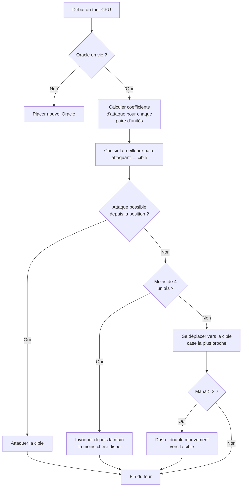

## Nausicaa के लिए मेरा बेवकूफी भरा AI

कुछ प्रोजेक्ट "चलो पौराणिक कथाओं के साथ शतरंज बनाते हैं" से शुरू होते हैं और एक ऐसे AI पर खत्म होते हैं जो हर 5 बारी पर अपने खुद के हाइपर-पैरामीटर तय करता है।

Nausicaa ऐसा ही है। एक टर्न-बेस्ड बोर्ड गेम जहाँ तुम पौराणिक प्राणियों का डेक बनाते हो, मैना मैनेज करते हो, और 10x8 बोर्ड पर यूनिट्स तैनात करते हो। और इसमें एक AI है जिसे पर्सनालिटी डिसऑर्डर है।

मैंने इस AI पर काफी समय बिताया, और नतीजा काफी बेकाबू है xD

## असली गेम

दिमाग की बात करने से पहले, शरीर को समझना होगा:

- 10x8 बोर्ड, प्रति खिलाड़ी 2 पंक्तियों का डिप्लॉयमेंट ज़ोन
- मैना 1 से शुरू, +1 प्रति बारी, अधिकतम 6। इसे बुलाने, हमला करने, क्षमताओं के उपयोग में खर्च करते हो
- लक्ष्य: दुश्मन के Oracle को मारना

12 यूनिट्स, अलग-अलग लागत और मूवमेंट पैटर्न:

| Unit | लागत | चाल | HP |
| --- | --- | --- | --- |
| Oracle | 0 | राजा (8 दिशाएँ) | 1 |
| गॉब्लिन | 1 | 3 कोशिकाएँ आगे | 1 |
| हार्पी | 1 | राजा (8 दिशाएँ) | 1 |
| नायड | 1 | विकर्ण | 1 |
| ग्रिफिन | 2 | 2 कोशिकाएँ उछल | 2 |
| सायरन | 2 | पार्श्व | 1 |
| सेंटॉर | 2 | घोड़ा (L आकार) | 2 |
| आर्चर | 3 | पार्श्व | 1 |
| फीनिक्स | 3 | विकर्ण (गहरे कोशिकाएँ) | 1 |
| आकार बदलने वाला | 4 | स्थान बदलना | 1 |
| सीर | 4 | कोई नहीं (मैना उत्पन्न करता है) | 1 |
| टाइटन | 6 | सीमित (क्षेत्र आक्रमण) | 3 |

हर यूनिट का अपना अटैक पैटर्न है। सायरन 4 विकर्णों पर हमला करता है, आर्चर दूर से 3 कोशिकाओं पर, टाइटन बुलाए जाने पर आसपास सब नष्ट कर देता है। संक्षेप में पौराणिक कथाओं और डेकबिल्डिंग वाला शतरंज xD

## मैंने CPU को कैसे सोचना सिखाया

मूल विचार बेवकूफी भरा सरल है: **हर दुश्मन यूनिट का एक आकर्षण गुणांक होता है**। जितनी खतरनाक, उतना ही AI उससे निपटना चाहता है।

```javascript
const UNITS_ATTRACTIVENESS = {
    "oracle": 100,
    "titan": 95,
    "shapeshifter": 90,
    "phoenix": 80,
    "siren": 70,
    "archer": 70,
    "seer": 70,
    "griffin": 60,
    "centaur": 60,
    "harpy": 50,
    "naiad": 30,
    "gobelin": 20
};
```

Oracle 100 -- समझ में आता है, यही जीत की शर्त है। टाइटन 95 क्योंकि यह बुलाए जाने पर आसपास सब OS (एक हिट में मार) देता है। गॉब्लिन 20, यह पैदल सैनिक है, कोई फर्क नहीं पड़ता।

फिर हर यूनिट जोड़ी (एक सहयोगी, एक दुश्मन) के लिए, मैं गणना करता हूँ:

```
interet = attractivite × coeff_attract / (distance × coeff_dist)
```

मोटे तौर पर: जितना खतरनाक और करीब, उतना ही AI तुम्हें मारना चाहता है।

```javascript
calculateAttackCoefficient(x1, y1, x2, y2) {
    const distance = this.calculateEuclideanDistance(x1, y1, x2, y2);
    if (distance === 0) return Infinity;
    return (UNITS_ATTRACTIVENESS[unit.type] * COEFFICIENTS_IMPORTANCE["attractiveness"]) / distance;
}
```

### गुणांक बदलने का मज़ा

मज़ेदार बात यह है कि महत्व गुणांक **हर 5 बारी पर बेतरतीब ढंग से बदलते हैं**।

```javascript
if (this.turnCount % 5 === 0) {
    const distanceCoefficient = parseInt(Math.random() * 100);
    const attractivenessCoefficient = parseInt(Math.random() * 100);
    this.regulateImportanceCoefficients({
        distance: distanceCoefficient,
        attractiveness: attractivenessCoefficient
    });
}
```

एक बार AI बहुत आक्रामक होगा (attract 95, distance 5), वह तुम्हारे Oracle को मारने के लिए सब पार कर जाएगा। अगली बार यह दूरी को प्राथमिकता देगा और फिर से स्थिति लेगा।

यह Pac-Man के भूतों से लिया गया है -- Blinky पीछा करता है, Pinky घात लगाता है। यहाँ AI हर चरण में "व्यक्तित्व" बदलता है।

**नतीजा: पूरे गेम में AI का अनुमान लगाना असंभव है।** CPU कभी एक जैसा मैच नहीं खेलता।

### Oracle एक कायर है

दुश्मन का Oracle भागता है। सचमुच।

```javascript
const awayFromTarget = {
    row: Math.max(0, Math.min(7, botUnitElement.row + (botUnitElement.row - targetUnitElement.row))),
    col: Math.max(0, Math.min(9, botUnitElement.col + (botUnitElement.col - targetUnitElement.col)))
};
```

यह खतरे की विपरीत दिशा निकालता है और भाग जाता है। अगर दीवार है, तो यह उस दिशा में सबसे करीबी खाली कोशिका ढूँढता है।

तुम 3 बारियाँ Oracle के पास जाने में बिताते हो, और धम, वह बिल्ली की तरह भाग गया xD

### निर्णय लूप

यहाँ बताया गया है कि AI कैसे निर्णय लेता है:

1. अगर मेरे पास Oracle नहीं है (मर गया), नया रखो
2. हर सहयोगी → दुश्मन यूनिट जोड़ी के लिए गुणांक गणना करो
3. सबसे अच्छी जोड़ी चुनो
4. अगर यूनिट अपनी स्थिति से लक्ष्य पर हमला कर सकती है → हमला करो
5. अगर मेरे पास 4 से कम यूनिट्स हैं → हाथ में से सबसे सस्ती उपलब्ध बुलाओ
6. नहीं तो, लक्ष्य की ओर बढ़ो (दुश्मन के सबसे करीबी चाल कोशिका)
7. अगर पर्याप्त मैना है (> 2), डैश (दोहरी चाल) और करीब जाओ
8. अगर यूनिट Oracle है → भागो



```javascript
async makeAction(dash=false) {
    // tout ça en séquence
    // le CPU dash si il a assez de mana
    if(botPlayer.mana > 2) {
        this.makeAction(true);
    }
}
```

### यूक्लिडियन दूरी क्यों

मैं यूक्लिडियन दूरी का उपयोग करता हूँ:

```javascript
calculateEuclideanDistance(x1, y1, x2, y2) {
    const deltaX = Math.pow(x1 - x2, 2);
    const deltaY = Math.pow(y1 - y2, 2);
    return Math.sqrt(deltaX + deltaY) * COEFFICIENTS_IMPORTANCE["distance"];
}
```

मैनहट्टन क्यों नहीं? क्योंकि यूनिट्स के चाल पैटर्न विविध हैं (घोड़े की तरह L, विकर्ण, आदि)। सीधी दूरी खतरे का बेहतर अनुमान है।

## मिनीमैक्स क्यों नहीं

मैं क्लासिक मिनीमैक्स कोड कर सकता था। लेकिन 12 प्रकार की यूनिट्स, अलग-अलग चाल पैटर्न, विशेष क्षमताओं के साथ... गेम ट्री इतना तेज़ी से फैलता है कि यह अव्यावहारिक हो जाता है। ह्युरिस्टिक दृष्टिकोण 10 मिलियन स्थितियों की खोज किए बिना बुद्धिमान विकल्प चुनता है।

## क्या अच्छा है

आकर्षण प्रणाली मज़ेदार दुविधाएँ पैदा करती है:

- सीर (70) मैना उत्पन्न करता है। अगर तुम इसे जीने दोगे, प्रतिद्वंद्वी के पास अधिक संसाधन होंगे। लेकिन टाइटन (95) और भी खतरनाक है।
- आकार बदलने वाला (90) किसी भी यूनिट के साथ अपनी जगह बदल सकता है। यह तुम्हारा Oracle चुरा सकता है।
- हार्पी (50) का विस्फोटक हमला है जो इसे भी मार देता है। प्राथमिकता नहीं... जब तक यह तुम्हारी 3 यूनिट्स के बगल में न हो।

AI सिर्फ कच्चे आँकड़ों के अनुसार नहीं, बल्कि स्थितियों के अनुसार वैश्विक खतरे का मूल्यांकन करता है।

पूरा गेम दोबारा खेले बिना परिदृश्य परीक्षण के लिए एक `activateSimulation()` फ़ंक्शन भी है:

```javascript
activateSimulation() {
    // Place des unités spécifiques sur le plateau
    // Utile pour debugger l'IA
    this.game.board = simulation.board;
    this.game.players = simulation.players;
}
```

## क्या कमी है

अगर मेरे पास और समय होता:

- AI वर्तमान स्थिति पर प्रतिक्रिया करता है, यह भविष्यवाणी नहीं करता कि खिलाड़ी क्या करेगा
- यह कई बारियों के लिए अपने हाथ की योजना नहीं बनाता
- आकार बदलने वाला और सेंटॉर ऐसी क्षमताएँ रखते हैं जिनका यह कम उपयोग करता है
- सुदृढ़ीकरण सीखना: गुणांक समायोजित करने के लिए इसे खुद के खिलाफ खेलने देना

लेकिन ब्राउज़र गेम के लिए यह काम करता है। दोस्त इसके खिलाफ हारने में कामयाब हो जाते हैं, तो ठीक है xD

## परीक्षण करो

उपलब्ध है [nausicaa-game.github.io](https://nausicaa-game.github.io/). "JOUER" पर क्लिक करो, CPU mode ON, और AI को करते देखो।

सलाह: AI को खुद के खिलाफ खेलने दो। तुम आक्रामक चरण देखोगे, फिर पूफ वह पीछे हट जाता है।

कोड [GitHub](https://github.com/nausicaa-game/nausicaa-game.github.io) पर `js/cpu.js` में है।

**3 मुख्य बातें:**

1. **ह्युरिस्टिक गुणांक** -- कोई मिनीमैक्स नहीं, हर यूनिट का आकर्षण है
2. **हर 5 बारी पर बदलने वाले गुणांक** -- AI Pac-Man शैली में आक्रामकता और नियंत्रण के बीच बदलता है
3. **Oracle भागता है** -- यह खतरे की विपरीत दिशा निकालता है और भाग जाता है

अगर तुम्हारे पास AI को और खतरनाक बनाने के विचार हैं, तो एक issue खोलो। मेरे पास एक ऐसे संस्करण की योजना है जो अपनी हार से सीखता है, लेकिन वह अगले लेख के लिए होगा xD
