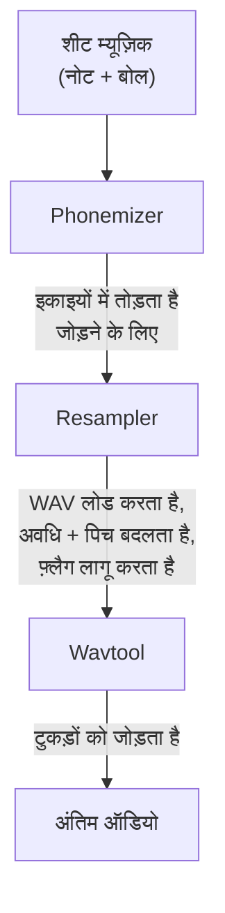

## UTAU : कैसे Visual Basic 6 के एक सॉफ़्टवेयर ने सिंथेटिक आवाज़ को लोकतांत्रिक बनाया

इसका जिक्र मैंने अपने मुख्य पेज पर किया था : मुझे UTAU पसंद है। चलिए बताता हूँ क्यों।

2008 में, अगर तुम किसी सिंथेटिक आवाज़ को गवाना चाहते थे, तो एक ही विकल्प था : VOCALOID। Yamaha का सॉफ़्टवेयर। महँगा, बंद, सरकारी आवाज़ों के साथ जो तुम खुद नहीं बना सकते थे।

और फिर एक जापानी लड़का, Ameya/Ayame, ने अपने कोने में कुछ बनाकर छोड़ दिया। **Visual Basic 6** में कोड किया गया एक सॉफ़्टवेयर। मुफ़्त। जो तुम्हें अपनी खुद की आवाज़ बनाने देता था... उन WAV फ़ाइलों से जो तुम खुद रिकॉर्ड करते थे।

इस चीज़ का नाम है **UTAU** (歌う, जापानी में "गाना")। और अपने ज़माने के लिए, यह जादू था।

मुझे हमेशा यह सॉफ़्टवेयर आकर्षक लगा। इसलिए नहीं कि यह तकनीकी रूप से साफ-सुथरा था (स्पॉयलर : असल में सोचना पड़ता था कि यह चीज़ कैसे बनाई... यह एक गड़बड़ है, मैं इस मुर्गे पर रोता हूँ), बल्कि इसलिए कि इसने वो किया जो कोई और नहीं कर रहा था : इसने वॉइस सिंथेसिस को आम जनता को दे दिया। मतलब तुम, मैं, कोई भी जिसके पास माइक हो।

मुझे समझाने दो कि यह शानदार क्यों था।

---

## पहले, गायन संश्लेषण मुश्किल क्यों है

गायी हुई आवाज़ सिर्फ नोट नहीं है। इसमें व्यंजन जो हमला करता है, स्वर जो टिकता है, साँस, दोनों के बीच के संक्रमण होते हैं। "सलाम" का "स" एक फुसफुसाता "स" है जो खुले "आ" की ओर खिसकता है, और यह खिसकाव ही है जो इंसानी या नहीं लगता है।

आज यह डीप लर्निंग से हल हो जाता है : तुम गायन के घंटों पर एक मॉडल train करते हो और वह आवाज़ जनरेट करता है (Synthesizer V, DiffSinger)। लेकिन यह 2020+ की बात है। 2008 में कुछ नहीं था।

UTAU पुराने, ज़्यादा चालाक तरीके का उपयोग करता है : **कॉन्केटेनेटिव सिंथेसिस**।

---

## कॉन्केटेनेटिव सिंथेसिस : आवाज़ के टुकड़ों की कॉपी-पेस्ट

यह विचार बेहद सरल है : तुम आवाज़ के छोटे-छोटे टुकड़े रिकॉर्ड करते हो और उन्हें शब्द बनाने के लिए जोड़ते हो। "सलाम" = नमूना "स" + "ला" + "म", जोड़े गए। एक शीट म्यूज़िक द्वारा संचालित ध्वनि पहेली।

यह YouTube Poop के सिद्धांत जैसा है जहाँ किसी किरदार के शब्दों को काट-काटकर उससे कुछ भी बुलवाया जाता है -- सिवाय इसके कि यहाँ यह व्यवस्थित और स्वचालित है।

और UTAU सचमुच यहीं से आया है। इससे पहले **"Jinriki Vocaloid"** (人力ボーカロイド, "मैनुअल Vocaloid") मौजूद था : लोग हाथ से वोकल ट्रैक काटते थे, फोनीम निकालते थे, उन्हें रीपिच करते थे, और VOCALOID आवाज़ की नकल करने के लिए सब कुछ ऑडियो एडिटर में फिर से जोड़ते थे। हाथ से। सोचो कितना काम।

Ameya ने इस परेशानी को देखा और इसे स्वचालित करने का टूल कोड किया। मूल रूप से UTAU सिर्फ यही था : मैनुअल Vocaloid के लिए एक सहायक।

---

## यह क्रांतिकारी क्यों था : तुम आवाज़ बनाते हो

यह वो चीज़ है जो सब कुछ बदल देती है।

VOCALOID में, तुम एक आवाज़ खरीदते थे। Miku, Luka, वगैरह। प्रोफ़ेशनल्स द्वारा बनाई गई, Yamaha द्वारा बेची गई। खुद बनाने का कोई तरीका नहीं। UTAU, **कोई भी अपनी आवाज़ रिकॉर्ड कर सकता है और उसे एक गाने वाला वाद्य बना सकता है**।

CV मोड (सबसे सरल) है : तुम जापानी के ~100 बुनियादी सिलेबल ("a", "ka", "sa", "ta"...), रिकॉर्ड करते हो, कटिंग पॉइंट कॉन्फ़िगर करते हो, और तुम्हारी voicebank तैयार। कुछ घंटों का काम।

नतीजा : इकोसिस्टम फट गया। हजारों voicebanks समुदाय द्वारा बनाई गई -- प्रशंसकों की आवाज़ें, दोस्तों की, काल्पनिक किरदारों की। वर्चुअल गायकों का एक पूरा ब्रह्मांड, मुफ़्त। और सॉफ़्टवेयर **Defoko** (Utane Uta) के साथ आता था, AquesTalk TTS इंजन द्वारा जनरेट की गई एक डिफ़ॉल्ट आवाज़, ताकि तुम बिना माइक के भी शुरू कर सकते थे।

---

## oto.ini : सिस्टम का दिल

UTAU कैसे जानता है कि आवाज़ों को कहाँ काटना और जोड़ना है ? एक कॉन्फ़िग फ़ाइल के ज़रिए प्रति voicebank : **`oto.ini`**। हर WAV के लिए, यह कटिंग पॉइंट (मिलीसेकंड में) परिभाषित करता है :

- **Offset** → शुरू में हटाने के लिए साइलेंस
- **Preutterance** → वह बिंदु जहाँ व्यंजन स्वर में बदलता है (सीमा "s"→"a" "sa" में)
- **Overlap** → पिछला नोट इस पर कितना ओवरलैप करता है
- **Fixed region** → वह हिस्सा जो लंबे नोट पर खिंचना नहीं चाहिए (आमतौर पर व्यंजन)
- **Cutoff** → अंत कहाँ काटना है

**Preutterance** सबसे चालाक पैरामीटर है। एक सिलेबल में हमेशा स्वर से पहले कुछ व्यंजन होता है। ताकि तुम्हारा नोट समय पर गिरे, *स्वर* को सही समय पर गिरना चाहिए, व्यंजन नहीं। इसलिए UTAU नमूने को पीछे खिसका देता है : "sa" का "a" समय पर गिरता है, "s" ठीक पहले फैलता है। जैसे कोई ड्रमर अपनी स्ट्राइक का अनुमान लगाता है ताकि आवाज़ सही समय पर गिरे -- सिवाय इसके कि यहाँ यह एक `.ini` में है।

दृश्य रूप से, नमूना "ka" पर, `oto.ini` के ज़ोन इस तरह कटते हैं :

```mermaid
flowchart LR
    A["🔇 साइलेंस<br/>(offset)"] --> B["🅺 व्यंजन<br/>(fixed region,<br/>खिंचता नहीं)"]
    B --> C["🅰 स्वर<br/>(खिंचने योग्य ज़ोन)"]
    C --> D["🔇 कटा हुआ अंत<br/>(cutoff)"]
    style B fill:#3b4a6b
    style C fill:#5b3b6b
```



व्यंजन और स्वर के बीच की सीमा, यही preutterance है। स्वर वह ज़ोन है जिसे लंबे नोटों के लिए खींचा जाता है ; व्यंजन बरकरार रहता है, नहीं तो तुम्हारा "k" दो सेकंड चलेगा और भयानक लगेगा।

```ini
# oto.ini (सरलीकृत)
# फ़ाइल=alias,offset,consonant,cutoff,preutterance,overlap
_ka.wav=ka,120,80,-200,90,40
```

पाँच मान प्रति ध्वनि, सभी नमूनों पर, और UTAU किसी भी शब्द को सही ढंग से जोड़ता है।

---

## CV, VCV, CVVC : यथार्थवाद की दौड़

बेसिक मोड, **CV** (Consonne-Voyelle / व्यंजन-स्वर), एक ध्वनि प्रति सिलेबल है। सरल लेकिन थोड़ा रोबोटिक : सिलेबल्स के बीच के जोड़ कच्चे हैं।

2010 में समुदाय ने **VCV** (Voyelle-Consonne-Voyelle / स्वर-व्यंजन-स्वर) का आविष्कार किया। अकेला "ka" रिकॉर्ड करने के बजाय, तुम "a ka" रिकॉर्ड करते हो -- पिछले स्वर की पूँछ के साथ। संक्रमण प्राकृतिक हो जाता है क्योंकि यह रिकॉर्डिंग के *अंदर* है, बाद में गणना नहीं की गई।

दिलचस्प बात : **VOCALOID के पास VOCALOID3 (2011) से पहले VCV नहीं था।** VB6 में एक अकेले आदमी द्वारा कोड किया गया फ्रीवेयर Yamaha को संक्रमण के यथार्थवाद में एक साल से पिछाड़ गया। बहुराष्ट्रीय कंपनी से तेज़ प्रशंसकों का समुदाय।

फिर आए **CVVC**, **ARPAsing** (अंग्रेज़ी), **VCCV**... हर तरीका यथार्थवाद को और आगे ले गया, सभी समुदाय द्वारा आविष्कृत और प्रलेखित।

---

## पूरी पाइपलाइन : एक शब्द कैसे ध्वनि बनता है

जब तुम एक नोट रखते हो और बोल टाइप करते हो, तो पर्दे के पीछे यह होता है :



**Resampler** मुख्य घटक है : वह तुम्हारा "ka" नमूना लेता है जो एक निश्चित पिच पर रिकॉर्ड किया गया है और उसे वांछित नोट से मिलाने के लिए फिर से खींचता/रीपिच करता है -- केवल खिंचने योग्य ज़ोन को खींचता है और व्यंजन को बरकरार रखता है (इसलिए `oto.ini`)।

और यह **मॉड्युलर** है। UTAU एक बेसिक resampler के साथ आता था, लेकिन समुदाय ने और बनाए (moresampler, TIPS...), हर एक की अपनी ध्वनि विशेषता। तुम सिंथेसिस इंजन को प्लगइन की तरह बदल सकते थे। 2008 में। एक फ्रीवेयर पर।

---

## हुड के नीचे की गड़बड़ (और यह प्यारा क्यों है)

चीज़ की तकनीकी स्थिति के बारे में ईमानदार होना होगा :

- **Visual Basic 6 में कोडित।** 2008 में पहले से मरा हुआ भाषा। इसे चलाने के लिए VB6 रनटाइम चाहिए।
- **मूल रूप से केवल Windows** (Mac पोर्ट, UTAU-Synth, 2011 में आया)।
- **Shift-JIS एन्कोडिंग अनिवार्य।** अगर तुम्हारी फ़ाइलें जापानी Shift-JIS में एन्कोडेड नहीं हैं, UTAU कुछ नहीं समझता। आज भी अक्सर अपना PC जापानी लोकल में डालना या AppLocale का उपयोग करना पड़ता है।
- **बेहद सादा इंटरफ़ेस**, उस समय लगभग 100% जापानी में डॉक्यूमेंटेशन।

और फिर भी। फिर भी इस चीज़ ने एक वैश्विक आंदोलन बनाया। हज़ारों voicebanks। लाखों बार सुने गए गाने।

सबसे अच्छा उदाहरण : **Kasane Teto**। 2008 में बनाया गया एक किरदार और 1 अप्रैल के मज़ाक के रूप में डाला गया, VOCALOID होने का नाटक करते हुए। यह एक मज़ाक था। सिवाय इसके कि लोगों को किरदार पसंद आया, एक असली UTAU voicebank पीछे बनाई गई, और Teto दुनिया की सबसे मशहूर वर्चुअल गायिकाओं में से एक बन गई। 2023 में उसे एक सरकारी Synthesizer V आवाज़ भी मिली। एक किरदार जो एक फ्रीवेयर पर अप्रैल फूल के मज़ाक से पैदा हुआ।

---

## यह आज भी क्यों मायने रखता है

UTAU एक "गरीब" तकनीक का सही उदाहरण है जो खुलेपन से जीतती है।

VOCALOID तकनीकी रूप से बेहतर था, बेहतर वित्तपोषित, ज़्यादा प्रोफ़ेशनल। लेकिन बंद। UTAU अस्थायी था, बदसूरत, VB6 में -- लेकिन इसमें हर कोई भाग ले सकता था। आवाज़ें बनाओ, resamplers बनाओ, प्लगइन्स बनाओ, रिकॉर्डिंग के तरीके बनाओ। समुदाय ने बाकी किया।

और यह अवधारणा आज भी पूरी तरह से जीवित है। **OpenUtau**, एक आधुनिक ओपन-सोर्स उत्तराधिकारी, विचार को लेता है और उसे धूल झाड़ता है (मल्टी-प्लेटफ़ॉर्म, UTF-8, आधुनिक resamplers और AI का समर्थन)। कॉन्केटेनेटिव सिंथेसिस आज भी डीप लर्निंग मॉडल के बगल में खड़ा है, क्योंकि इसमें वह चीज़ है जो उनमें नहीं : तुम ठीक-ठीक समझते हो क्या हो रहा है, और तुम हर मिलीसेकंड को नियंत्रित करते हो।

यही वो चीज़ है जो मुझे UTAU में हमेशा पसंद आई है। तुम ठीक-ठीक देखते हो क्या हो रहा है। यह कोई AI नहीं जो तुम्हें कोई जादुई चीज़ उगल दे जो तुम समझते नहीं : तुम्हारे पास तुम्हारे WAV, तुम्हारे कटिंग पॉइंट हैं, और तुम ही सब कुछ तय करते हो। जब यह बुरा लगता है, तुम जानते हो क्यों और तुम सुधार सकते हो। मुझे इस तरह का नियंत्रण पसंद है।

---

**याद रखने लायक 3 बातें :**

1. **कॉन्केटेनेटिव सिंथेसिस = आवाज़ की पहेली** -- UTAU शब्द बनाने के लिए छोटे WAV नमूनों को जोड़ता है। `oto.ini` परिभाषित करता है कि हर ध्वनि को कहाँ काटना और जोड़ना है। तुम सब कुछ मिलीसेकंड में नियंत्रित करते हो, बिना किसी ब्लैक बॉक्स के।

2. **खुलापन तकनीक को हराता है** -- VOCALOID बेहतर था लेकिन बंद था। UTAU अस्थायी था लेकिन हर किसी को अपनी आवाज़ें बनाने देता था। समुदाय ने इकोसिस्टम को विस्फोटित कर दिया, और VCV पर Yamaha को भी पिछाड़ दिया।

3. **एक अच्छा विचार अपने कोड से बच जाता है** -- VB6, Shift-JIS, केवल Windows... और फिर भी अवधारणा OpenUtau के ज़रिए आज भी चलती है। एक शानदार तकनीक पैरों से कोड की जा सकती है।

ईमानदारी से, सिर्फ Kasane Teto के लिए जो अप्रैल फूल से पैदा हुई, यह सॉफ़्टवेयर सम्मान का हकदार है xD
