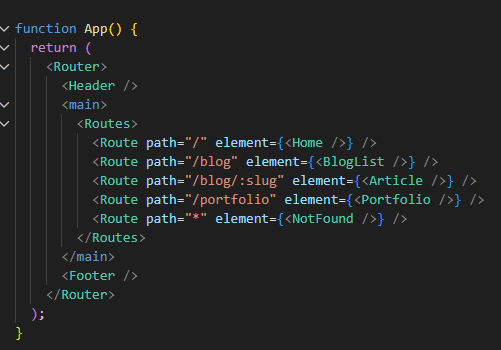
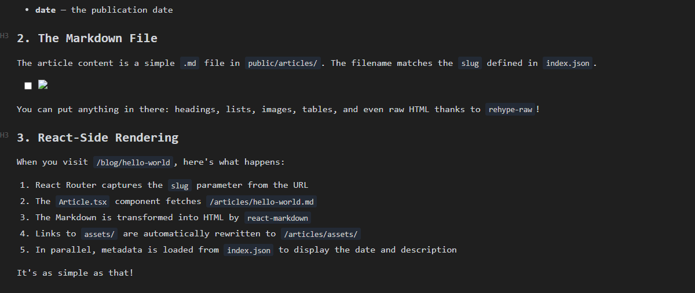
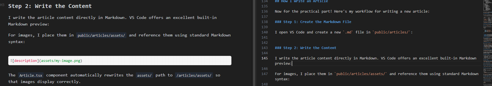
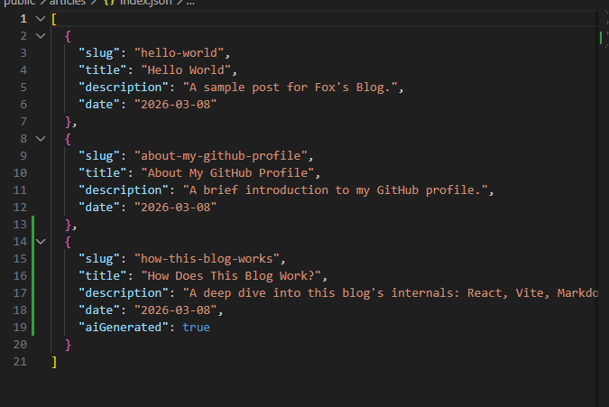
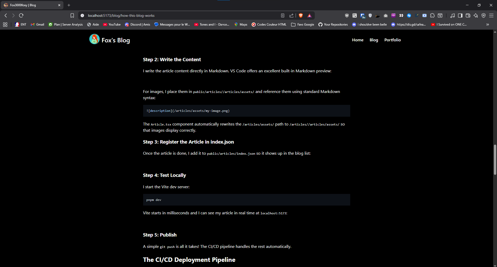

# How Does This Blog Work?

Ever wondered how this blog works under the hood? In this article, I'll walk you through the entire architecture of the application, from the tech stack all the way to the process of writing an article. And yes, I'll even show you how I write my articles from VS Code!

## The Tech Stack

This blog is built with modern web technologies:

- **React 19** — for the user interface
- **TypeScript** — for typed and more reliable code
- **Vite** — as an ultra-fast build tool
- **React Router v7** — for navigation between pages
- **react-markdown** — to transform Markdown into HTML
- **rehype-raw + rehype-sanitize** — to allow raw HTML in Markdown while staying secure

Everything is hosted on **GitHub Pages** directly from the `fox3000foxy.github.io` repository.

## Project Structure

Here's what the project tree looks like:


```
├── .github/
│   └── workflows/
│       └── deploy.yml        ← CI/CD pipeline
├── public/
│   ├── home.md               ← Home page content
│   ├── portfolio.md           ← Portfolio content
│   └── articles/
│       ├── index.json         ← List of all articles
│       ├── hello-world.md     ← An article
│       ├── how-this-blog-works.md  ← This article!
│       └── assets/            ← Article images
├── src/
│   ├── main.tsx               ← React entry point
│   ├── App.tsx                ← Main router
│   ├── components/
│   │   ├── Header.tsx         ← Navigation bar
│   │   └── Footer.tsx         ← Footer
│   └── pages/
│       ├── Home.tsx           ← Home page
│       ├── BlogList.tsx       ← Article list
│       ├── Article.tsx        ← Article reader
│       ├── Portfolio.tsx      ← Portfolio page
│       └── NotFound.tsx       ← 404 page
└── vite.config.ts             ← Vite configuration
```

The core idea is simple: **content is separated from code**. Pages are written in Markdown in the `public/` folder, and the React code in `src/` takes care of rendering them.

## The Routing System

The `App.tsx` file defines all application routes using React Router:




| Route         | Page      | Description                                 |
| --------------- | ----------- | --------------------------------------------- |
| `/`           | Home      | Home page, loads`home.md`                   |
| `/blog`       | BlogList  | List of all articles                        |
| `/blog/:slug` | Article   | A single article, loads`articles/{slug}.md` |
| `/portfolio`  | Portfolio | Portfolio page, loads`portfolio.md`         |
| `*`           | NotFound  | 404 page for unknown URLs                   |

Each page has a well-defined role: it fetches a Markdown file, transforms it into HTML with `react-markdown`, and displays it on screen.

## How Does an Article Work?

This is the most interesting part! Here's the lifecycle of an article:

### 1. The `index.json` File

All articles are referenced in `public/articles/index.json`. Each entry contains the article's metadata:

```json
[
  {
    "slug": "hello-world",
    "title": "Hello World",
    "description": "A sample post for Fox's Blog.",
    "date": "2026-03-08"
  }
]
```

- **slug** — the unique identifier, used in the URL (`/blog/hello-world`)
- **title** — the title displayed in the list
- **description** — a short summary
- **date** — the publication date

### 2. The Markdown File

The article content is a simple `.md` file in `public/articles/`. The filename matches the `slug` defined in `index.json`.



You can put anything in there: headings, lists, images, tables, and even raw HTML thanks to `rehype-raw`!

### 3. React-Side Rendering

When you visit `/blog/hello-world`, here's what happens:

1. React Router captures the `slug` parameter from the URL
2. The `Article.tsx` component fetches `/articles/hello-world.md`
3. The Markdown is transformed into HTML by `react-markdown`
4. Links to `assets/` are automatically rewritten to `/articles/assets/`
5. In parallel, metadata is loaded from `index.json` to display the date and description

It's as simple as that!

## The Home Page and Portfolio

The Home and Portfolio pages work in exactly the same way: they load a Markdown file (`home.md` or `portfolio.md`) and render it as HTML.

The special thing is that they use a custom sanitization schema that allows `class` and `style` attributes on all HTML elements. This lets me write styled HTML directly in Markdown, like image galleries for example.

## The Header and Footer

The Header is pinned to the top of the page with `position: fixed`. It contains:

- My GitHub avatar (loaded directly from `github.com/fox3000foxy.png`)
- The blog title
- Navigation links: Home, Blog, Portfolio

The Footer is minimalist: just a copyright with the current year calculated dynamically.

## The Dark Theme

The site is **always in dark mode** — no light/dark toggle. This is a deliberate choice: `color-scheme: dark` is set in the global styles, with a black background `#000` and white text `#fff`. Links are blue (`#64b5f6`) and turn green on hover (`#81c784`).

## How I Write an Article

Now for the practical part! Here's my workflow for writing a new article:

### Step 1: Create the Markdown File

I open VS Code and create a new `.md` file in `public/articles/`:

### Step 2: Write the Content

I write the article content directly in Markdown. VS Code offers an excellent built-in Markdown preview:



For images, I place them in `public/articles/assets/` and reference them using standard Markdown syntax:

```markdown

```

The `Article.tsx` component automatically rewrites the `assets/` path to `/articles/assets/` so that images display correctly.

### Step 3: Register the Article in index.json

Once the article is done, I add it to `public/articles/index.json` so it shows up in the blog list:



### Step 4: Test Locally

I start the Vite dev server:

```bash
pnpm dev
```

Vite starts in milliseconds and I can see my article in real time at `localhost:5173`:



### Step 5: Publish

A simple `git push` is all it takes! The CI/CD pipeline handles the rest automatically.

## The CI/CD Deployment Pipeline

I've set up a full **GitHub Actions** pipeline that automates linting, building, and deploying the site every time I push to `main`. Let's break it down.

The workflow lives in `.github/workflows/deploy.yml` and is split into two jobs: **build** and **deploy**.

### Triggers

```yaml
on:
  push:
    branches:
      - main
  pull_request:
    branches:
      - main
```

The pipeline runs on every **push** to `main` and on every **pull request** targeting `main`. This means PRs get checked (lint + build) before merging, but only pushes to `main` actually trigger a deployment.

### Job 1: Build

The build job runs on `ubuntu-latest` and goes through these steps:

1. **Checkout** — Clones the repository with full history (`fetch-depth: 0`)
2. **Setup pnpm** — Installs the latest version of pnpm using `pnpm/action-setup@v4`
3. **Setup Node.js 20** — Configures Node with pnpm caching enabled for faster installs
4. **Install dependencies** — Runs `pnpm install --frozen-lockfile` to ensure reproducible builds (no lockfile changes allowed)
5. **Lint** — Runs `pnpm run lint` (ESLint) to catch code quality issues before building
6. **Build** — Runs `pnpm run build`, which first checks TypeScript types (`tsc -b`) then bundles everything with Vite
7. **Upload artifact** — Uploads the `dist/` folder as a build artifact for the deploy job

If any step fails — a lint error, a type error, a build error — the whole pipeline stops and nothing gets deployed. This keeps the live site safe from broken code.

### Job 2: Deploy

The deploy job only runs if:

- The build job succeeded (`needs: build`)
- The event is a **push** (not a PR)
- The branch is **main**

```yaml
if: github.event_name == 'push' && github.ref == 'refs/heads/main'
```

It then:

1. **Downloads the build artifact** — Grabs the `dist/` folder produced by the build job
2. **Configures GitHub Pages** — Sets up the Pages environment
3. **Uploads to Pages** — Packages the `dist/` folder for GitHub Pages
4. **Deploys** — Publishes the site using `actions/deploy-pages@v4`

### The Full Picture

Here's what happens from writing to deployment:

```
Write article in VS Code
        ↓
   git add & commit
        ↓
      git push
        ↓
  GitHub Actions triggers
        ↓
  ┌─────────────────┐
  │   BUILD JOB     │
  │  1. Checkout    │
  │  2. Setup pnpm  │
  │  3. Setup Node  │
  │  4. Install     │
  │  5. Lint ✓      │
  │  6. Build ✓     │
  │  7. Upload dist │
  └────────┬────────┘
           ↓
  ┌─────────────────┐
  │  DEPLOY JOB     │
  │  1. Download    │
  │  2. Configure   │
  │  3. Upload      │
  │  4. Deploy 🚀   │
  └─────────────────┘
           ↓
    Live on GitHub Pages!
```

The entire process takes about a minute from push to live. No manual deploy, no FTP, no SSH — just `git push` and it's done.

## The Production Build

Under the hood, the `pnpm build` command runs:

1. `tsc -b` — Checks TypeScript types
2. `vite build` — Bundles and optimizes all the code

Vite produces minified and optimized files with automatic code-splitting. The result is a blazing-fast static site.

## Why This Architecture?

I could have used a CMS, a static site generator like Hugo or Jekyll, or even Next.js. But here's why I chose this approach:

- **Simplicity** — Write in Markdown, push to GitHub, it's live
- **Full control** — No dependency on a CMS or database
- **Performance** — Vite + React = fast loading
- **Flexibility** — I can mix Markdown and HTML however I want
- **Learning** — It's a great project to master React and TypeScript
- **CI/CD** — Automated quality checks and deployment with GitHub Actions

## Conclusion

This blog is a simple but well-thought-out project: Markdown for content, React for rendering, Vite for performance, GitHub Actions for CI/CD, and GitHub Pages for hosting. No database, no backend server, just static files served efficiently with an automated pipeline ensuring quality at every push.

If you want to create your own blog with a similar architecture, feel free to check out the [source code on GitHub](https://github.com/fox3000foxy/fox3000foxy.github.io)!

Thanks for reading, and see you in the next article! 🦊
