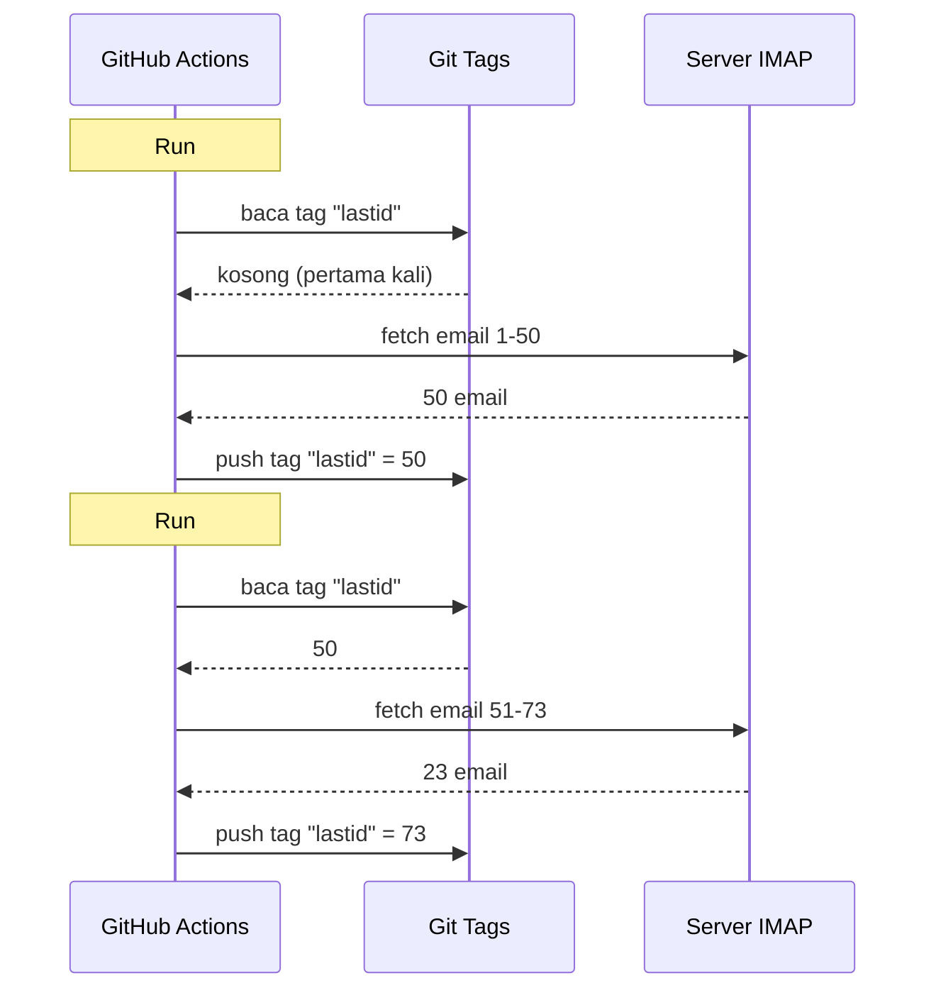

# Saya pakai git sebagai database untuk menjalankan bot gratis di GitHub Actions

Saya punya reply email otomatis yang jalan 24/7.

Dia baca email saya, paham isinya, dan jawab sendiri pakai AI. Dia ingat percakapan sebelumnya. Dia abaikan newsletter dan `noreply@`. Dia forward ke manusia kalau terlalu panas.

Biaya bulanan: **0€**.

Tanpa server. Tanpa VPS. Tanpa database. Cuma GitHub Actions dan hack gila: **pake git sebagai database**.

Kamu kebayang? Belum? OK, berpeganganlah, ini konyol sekaligus brilian.

---

## Masalahnya: GitHub Actions itu stateless

GitHub Actions itu gratis. Kamu bisa jalankan cron tiap 5 menit, jalanin kode, gratis.

Tapi ada masalah: dia **stateless**.

Setiap run mulai dari mesin kosong. Gak ada yang tersimpan antar eksekusi. Run sebelumnya? Dilupakan. Dihapus. Seolah tak pernah ada.

Untuk reply email, ini masalah besar. Misalnya:

> "Email terakhir mana yang sudah saya proses?"

Kalau bot lupa ini tiap run, dia bakal jawab ulang email yang sama (bencana), atau malah kelewat.

Kita butuh state persisten. Dan biasanya, state persisten = database. Tapi database itu server, dan server itu gak gratis.

Nah, di sinilah jadi menarik.

---

## Solusinya: git tags sebagai database

Repo GitHub kamu, itu sudah penyimpanan persisten. Gratis. Versioned. Selalu ada.

Jadi kenapa gak simpan state di situ?

Idenya: setiap run, bot baca UID email terakhir yang diproses dari sebuah **git tag**. Dia proses email baru. Lalu push ulang tag dengan UID baru.



Tag git ITU database-nya. Satu nilai aja, tapi itu yang kita butuhin.

### Membaca state

Di awal job, kita ambil nilai dari tag:

```bash
git fetch origin --tags lastid || true
git show refs/tags/lastid:data/lastId > data/lastId || true
```

`git show refs/tags/lastid:data/lastId` artinya: "kasih saya isi file `data/lastId` seperti yang ada di tag `lastid`".

Boom. Kamu punya nilainya, tanpa database.

### Menulis state

Di akhir, kita buat ulang tag dengan nilai baru:

```bash
git switch --orphan lastid-tmp   # branch kosong tanpa history
git rm -rf .                      # hapus semua
mkdir -p data
printf "%s\n" "${LAST_ID_CONTENT}" > data/lastId

git add data/lastId
git commit -m "lastId snapshot"
git tag -f lastid                 # paksa tag ke commit ini
git push --force ...origin lastid # push tag
```

Kita bikin branch **orphan** (tanpa history), taruh aja file `lastId`, commit, tag, force push.

Kenapa orphan? Biar gak numpuk 10.000 commit state di history repo. Tiap update timpa yang sebelumnya. Tag selalu mengarah ke SATU commit yang berisi SATU nilai.

Bersih. Gratis. Kocak banget xD

---

## Hack kedua: runtime snapshot

Ada masalah lain sama GitHub Actions: `npm install`.

Kalau tiap run (tiap 5 menit) kamu jalanin `npm install` + `npm run build`, kamu buang 60-90 detik tiap kali. Di cron yang sering, itu menit-menit compute yang terbuang percuma.

Solusi: pre-compile kode SEKALI, dan simpan di tag git juga.

Workflow build (yang jalan pas kamu push ke `master`) ngelakuin ini:

```bash
# compile kode
bun install
bun run build

# simpan dist/ + node_modules/ di tag "runtime"
git checkout --orphan temp-runtime
git rm -rf .
cp -r "$TMPDIR"/* .
git add dist node_modules package.json bun.lock data
git commit -m "runtime build"
git tag -f runtime
git push --force ...origin runtime
```

Tag `runtime` berisi kode yang sudah di-compile DAN `node_modules`. Siap jalan.

Dan cron-nya checkout langsung tag ini:

```yaml
- name: Checkout runtime snapshot
  uses: actions/checkout@v4
  with:
    ref: refs/tags/runtime    # kode pre-build, bukan source
    fetch-depth: 1

# gak ada npm install, gak ada build!
- name: Process emails
  run: node dist/index.js --action
```

Gak ada install. Gak ada build. Cron langsung start dan jalanin `node dist/index.js`.

Jadi, kamu punya dua tag yang punya dua tugas:
- `runtime` = kode siap jalan (diupdate pas kamu push kode)
- `lastid` = state persisten (diupdate tiap run)

Elegan banget.

---

## Bot-nya sendiri: auto-reply AI

Oke, hack git-nya keren, tapi bot-nya ngapain sebenernya?

Dia baca email lewat IMAP, pahamin dengan AI (Groq + Llama 3.3 70B), dan jawab otomatis.

Arsitektur dengan services bersih dan dependency injection (InversifyJS):

```
App
├── ImapService      → baca email (IMAP)
├── SmtpService      → kirim jawaban (SMTP)
├── ParserService    → parse konten email
├── ReplyService     → generate jawaban AI
├── SummaryService   → memori percakapan
├── AccountsService  → kelola beberapa akun email
└── ConfigService    → config / env vars
```

### Dua mode operasi

Bot bisa jalan dengan dua cara:

**Mode listener** (real-time): koneksi IMAP permanen dengan exponential backoff. Untuk VPS.

```typescript
this.imapService.on("exists", async (data) => {
  console.log(`[MAIL] Email baru! Total: ${data.count}`);
  // proses email baru langsung
});
```

**Mode action** (batch): proses email baru dari `lastId`, lalu tutup. Untuk cron GitHub Actions.

```bash
node dist/index.js --action
```

Mode `--action` adalah yang pakai hack git. Dia baca `lastId`, proses yang baru, tulis `lastId` baru, selesai.

### JANGAN jawab robot

Kalau bot kamu jawab SEMUA email, dia bakal jawab newsletter, notifikasi, `noreply@`. Bencana. Lebih parah: kalau dua bot saling jawab, kamu dapat infinite loop email. Mimpi buruk.

Makanya filtering agresif:

```typescript
export function isAutomatedSender(address) {
  const automatedPatterns = [
    "noreply", "no-reply", "donotreply",
    "mailer-daemon", "postmaster", "bounce",
    "newsletter", "notification", "marketing",
    "billing", "receipt", "promo", ...
  ];
  const local = address.split("@")[0].toLowerCase();
  return automatedPatterns.some(p => local.includes(p));
}
```

Dan juga deteksi lewat header email:

```typescript
export function isAutomatedByHeaders(headers) {
  return (
    ["bulk", "list", "junk"].includes(headers.precedence) ||
    headers["auto-submitted"] !== "no" ||
    headers["list-unsubscribe"] !== "" ||   // newsletter punya ini
    /mailchimp|sendgrid|mailgun|brevo/i.test(headers["x-mailer"])
  );
}
```

`List-Unsubscribe` di headers? Itu newsletter. `Precedence: bulk`? Mass-mailing. `X-Mailer: Mailchimp`? Udah kebayang. Kita abaikan.

Ini kayak bouncer klub malam: robot gak lolos xD

### Trigger ajaib

AI bisa mutusin gak jawab sama sekali, atau kasih ke manusia. Caranya? Dengan trigger khusus di jawabannya.

System prompt-nya bilang:

> Kalau ini email otomatis/newsletter → jawab `<no_reply>`
> Kalau terlalu penting/sensitif (legal, finansial...) → jawab `<manual_reply_required>`
> Kalau nggak → tulis jawaban beneran

Dan kode bacanya:

```typescript
const aiReply = completion.choices[0].message.content.trim();
const manualTrigger = aiReply.includes(MANUAL_REPLY_TRIGGER);
const noReply = aiReply.includes(NO_REPLY_TRIGGER);

if (noReply) {
  console.log("[MAIL] AI mutusin buat diabaikan. Skip.");
  return;
}

if (manualTrigger) {
  console.log("[MAIL] Kepanasan, saya forward ke manusia.");
  await this.smtpService.sendManualForward(...);
  return;
}

// kalo nggak, kirim jawaban AI
await this.smtpService.sendReply(...);
```

Jadi AI punya hak buat bilang "gak, ini gak saya sentuh, panggil manusia beneran". Bijak.

---

## Memori percakapan

Satu detail yang bikin beda: bot **ingat** percakapan.

Pas dia jawab seseorang, dia simpan ringkasan pertukaran. Nanti pas orang itu nulis lagi, ringkasannya dimasukin lagi ke prompt.

Penyimpanan: satu file JSON per kontak.

```
data/customers/
├── moi%40gmail.com/
│   ├── alice%40example.com.json
│   └── bob%40client.fr.json
```

Dan ringkasan itu sendiri di-generate oleh AI, yang menggabung ringkasan lama dengan pesan baru:

```typescript
const completion = await groq.chat.completions.create({
  model: "llama-3.3-70b-versatile",
  messages: [
    { role: "system", content: "Kamu adalah asisten memori. Gabungkan ringkasan lama dengan pesan baru tanpa kehilangan info." },
    { role: "user", content: `Ringkasan yang ada:\n${existing}\n\nPesan baru:\n${incomingContent}` }
  ],
  temperature: 0.0,  // deterministik, tanpa kreativitas
  max_tokens: 800,
});
```

Jadi bot membangun memori terkompresi seiring waktu. Gak perlu simpan semua email, cukup ringkasan yang makin cerdas.

Dan file-file JSON ini? Ya... disimpan di git juga, di runtime tag. Git di mana-mana xD

---

## Trik cerdas dengan panjang prompt

Detail teknis kecil yang bikin saya senyum.

Model punya batas token. Kalau email + ringkasan + persona prompt kelebihan, API balikin error.

Kode menanganinya dengan **truncation berantai** + retry:

```typescript
try {
  // percobaan pertama dengan batas normal
  completion = await groq.chat.completions.create({...});
} catch (error) {
  if (!this.isLengthError(error)) throw error;

  // error panjang: coba lagi dengan batas lebih ketat
  ({ systemContent, userContent } = this.buildPromptPayload({
    ...,
    limits: {
      systemPromptChars: 2200,  // dari 3000
      summaryChars: 1800,       // dari 4000
      personaChars: 900,        // dari 1500
      userContentChars: 2200,   // dari 8000
    },
  }));
  completion = await groq.chat.completions.create({...});  // retry
}
```

Kalau masih gak bisa, kita potong lebih pendek dan coba lagi. Simpel, efektif, gak crash.

---

## Nah, secara konkret, gimana cara kerjanya?

Flow lengkap dari satu run cron:

```
1. GitHub Actions terpicu (cron tiap 5 menit)
2. Checkout tag "runtime" (kode pre-build)
3. git show refs/tags/lastid → ambil UID terakhir yang diproses
4. node dist/index.js --action
   ├── koneksi IMAP
   ├── fetch email sejak lastId+1
   ├── untuk setiap email:
   │   ├── parse konten
   │   ├── filter robot (skip kalau automated)
   │   ├── cocokkan akun tujuan
   │   ├── ambil memori percakapan
   │   ├── generate jawaban AI (Groq)
   │   ├── <no_reply> ? skip
   │   ├── <manual_reply_required> ? forward manusia
   │   ├── kalau nggak: kirim jawaban (SMTP)
   │   └── update memori percakapan
   └── tulis lastId baru
5. git push --force tag "lastid" dengan nilai baru
```

Dan ini berulang lagi dalam 5 menit. Selamanya. Gratis.

---

**3 hal yang perlu diingat:**

1. **Git = database gratis** -- Tag orphan bisa menyimpan state persisten di antara dua run stateless. `git show refs/tags/X:fichier` untuk baca, force-push untuk tulis. Gak perlu DB.

2. **Pre-compile dalam tag runtime** -- Daripada `npm install` tiap run cron, simpan kode compiled + node_modules di tag git. Cron jalan instan.

3. **Bot AI harus tahu kapan diam** -- Trigger `<no_reply>` dan `<manual_reply_required>` biarin AI mutusin gak jawab atau kasih ke manusia. Plus filtering anti-robot. Kalau gak, kamu bikin infinite loop email.

Serverless cron dengan state persisten, AI, memori, semuanya 0€/bulan. Ini konyol banget dan saya suka xD
