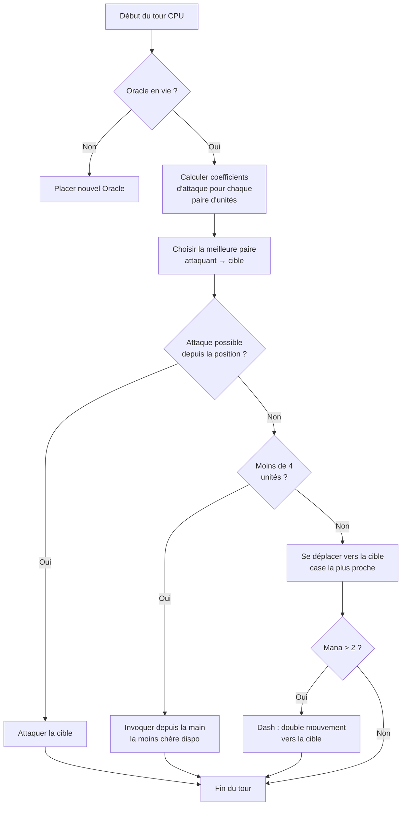

## AI Konyolku untuk Nausicaa

Ada proyek yang dimulai dengan "bagaimana kalau aku bikin game catur dengan mitologi?" dan berakhir dengan sesuatu yang punya AI yang memutuskan hyper-parameternya sendiri setiap 5 giliran.

Nausicaa seperti itu. Game papan bergiliran di mana kamu membangun deck makhluk mitologis, mengelola mana, dan menempatkan unit di papan 10x8. Dan ada AI yang mengalami krisis kepribadian.

Aku menghabiskan cukup banyak waktu untuk AI ini, dan hasilnya cukup kacau xD

## Game yang Sebenarnya

Sebelum bicara soal otak, kita perlu memahami tubuhnya:

- Papan 10x8, zona penempatan 2 baris per pemain
- Mana mulai dari 1, +1 per giliran, maks 6. Kamu habiskan untuk memanggil, menyerang, menggunakan kemampuan
- Tujuan: bunuh Oracle lawan

12 unit, dengan biaya dan pola gerakan berbeda:

| Unit | Biaya | Gerakan | HP |
| --- | --- | --- | --- |
| Oracle | 0 | Raja (8 arah) | 1 |
| Goblin | 1 | Maju 3 petak | 1 |
| Harpy | 1 | Raja (8 arah) | 1 |
| Naiad | 1 | Diagonal | 1 |
| Griffin | 2 | Lompat 2 petak | 2 |
| Sirene | 2 | Samping | 1 |
| Centaur | 2 | Kuda (bentuk L) | 2 |
| Pemanah | 3 | Samping | 1 |
| Phoenix | 3 | Diagonal (petak gelap) | 1 |
| Shapeshifter | 4 | Tukar tempat | 1 |
| Peramal | 4 | Tidak ada (menghasilkan mana) | 1 |
| Titan | 6 | Terbatas (serangan area) | 3 |

Setiap unit memiliki pola serangannya sendiri. Sirene menyerang ke 4 diagonal, Pemanah jarak jauh sejauh 3 petak, Titan menghancurkan segala sesuatu di sekitarnya saat dipanggil. Singkatnya game catur dengan mitologi dan deckbuilding xD

## Bagaimana Aku Membuat CPU Berpikir

Ide dasarnya sangat sederhana: **setiap unit musuh memiliki koefisien daya tarik**. Semakin berbahaya, semakin AI ingin mengurusinga.

```javascript
const UNITS_ATTRACTIVENESS = {
    "oracle": 100,
    "titan": 95,
    "shapeshifter": 90,
    "phoenix": 80,
    "siren": 70,
    "archer": 70,
    "seer": 70,
    "griffin": 60,
    "centaur": 60,
    "harpy": 50,
    "naiad": 30,
    "gobelin": 20
};
```

Oracle 100 -- logis, itu win condition. Titan 95 karena dia OS apa pun di sampingnya saat dipanggil. Goblin 20, itu prajurit biasa, kita tidak peduli.

Lalu untuk setiap pasangan unit (satu sekutu, satu musuh), aku hitung:

```
interet = attractivite × coeff_attract / (distance × coeff_dist)
```

Intinya: semakin berbahaya dan dekat, semakin AI ingin menghajarmu.

```javascript
calculateAttackCoefficient(x1, y1, x2, y2) {
    const distance = this.calculateEuclideanDistance(x1, y1, x2, y2);
    if (distance === 0) return Infinity;
    return (UNITS_ATTRACTIVENESS[unit.type] * COEFFICIENTS_IMPORTANCE["attractiveness"]) / distance;
}
```

### Trik Koefisien yang Berubah

Yang lucu adalah koefisien kepentingan **berubah secara acak setiap 5 giliran**.

```javascript
if (this.turnCount % 5 === 0) {
    const distanceCoefficient = parseInt(Math.random() * 100);
    const attractivenessCoefficient = parseInt(Math.random() * 100);
    this.regulateImportanceCoefficients({
        distance: distanceCoefficient,
        attractiveness: attractivenessCoefficient
    });
}
```

Sekali waktu AI akan sangat agresif (daya tarik 95, jarak 5), dia menerobos segalanya untuk membunuh Oracle-mu. Giliran berikutnya dia memprioritaskan jarak dan reposisi.

Ini terinspirasi dari hantu Pac-Man -- Blinky mengejar, Pinky menyergap. Di sini AI berubah "kepribadian" setiap fase.

**Hasil: tidak mungkin memprediksi AI dalam satu permainan penuh.** CPU tidak pernah melakukan pertandingan yang sama dua kali.

### Oracle Itu Pengecut

Oracle lawan kabur. Secara harfiah.

```javascript
const awayFromTarget = {
    row: Math.max(0, Math.min(7, botUnitElement.row + (botUnitElement.row - targetUnitElement.row))),
    col: Math.max(0, Math.min(9, botUnitElement.col + (botUnitElement.col - targetUnitElement.col)))
};
```

Dia menghitung arah berlawanan dari ancaman dan kabur. Kalau ada dinding, dia cari petak kosong terdekat di arah itu.

Kamu habiskan 3 giliran mendekati Oracle, dan bam dia kabur seperti pengecut xD

### Loop Pengambilan Keputusan

Begini cara AI memutuskan:

1. Jika Oracle sudah mati, tempatkan Oracle baru
2. Hitung koefisien untuk setiap pasangan unit sekutu → unit musuh
3. Pilih pasangan terbaik
4. Jika unit bisa menyerang target dari posisinya → serang
5. Jika unit kurang dari 4 → panggil yang paling murah dari tangan
6. Jika tidak, bergerak menuju target (petak gerakan terdekat ke musuh)
7. Jika mana cukup (> 2), dash (gerakan ganda) untuk mendekat lebih lanjut
8. Jika unit adalah Oracle → kabur



```javascript
async makeAction(dash=false) {
    // tout ça en séquence
    // le CPU dash si il a assez de mana
    if(botPlayer.mana > 2) {
        this.makeAction(true);
    }
}
```

### Kenapa Jarak Euclidean

Aku menggunakan jarak Euclidean:

```javascript
calculateEuclideanDistance(x1, y1, x2, y2) {
    const deltaX = Math.pow(x1 - x2, 2);
    const deltaY = Math.pow(y1 - y2, 2);
    return Math.sqrt(deltaX + deltaY) * COEFFICIENTS_IMPORTANCE["distance"];
}
```

Kenapa bukan Manhattan? Karena unit memiliki pola gerakan yang bervariasi (L seperti kuda, diagonal, dll). Jarak garis lurus adalah perkiraan bahaya yang lebih baik.

## Kenapa Bukan Minimax

Aku bisa saja membuat minimax klasik. Tapi dengan 12 jenis unit, pola gerakan berbeda, kemampuan khusus... pohon permainan meledak begitu cepat sehingga tidak bisa dimainkan. Pendekatan heuristik membuat pilihan cerdas tanpa menjelajahi 10 juta state.

## Yang Keren

Sistem daya tarik menciptakan dilema lucu:

- Peramal (70) menghasilkan mana. Kalau kamu biarkan hidup, lawan punya lebih banyak sumber daya. Tapi Titan (95) masih lebih berbahaya.
- Shapeshifter (90) bisa bertukar tempat dengan unit mana pun. Dia bisa mencuri Oracle-mu.
- Harpy (50) memiliki serangan eksplosif yang juga membunuhnya. Tidak prioritas... sampai dia berada di samping 3 unit-mu.

AI mengevaluasi bahaya global berdasarkan posisi, bukan hanya stat mentah.

Ada juga fungsi `activateSimulation()` untuk menguji skenario tanpa memulai permainan baru:

```javascript
activateSimulation() {
    // Place des unités spécifiques sur le plateau
    // Utile pour debugger l'IA
    this.game.board = simulation.board;
    this.game.players = simulation.players;
}
```

## Yang Kurang

Kalau aku punya lebih banyak waktu:

- AI bereaksi terhadap keadaan saat ini, tidak memprediksi apa yang akan dilakukan pemain
- Dia tidak merencanakan tangan untuk beberapa giliran
- Shapeshifter dan Centaur memiliki kemampuan yang kurang dimanfaatkan
- Reinforcement learning: membuatnya bermain melawan dirinya sendiri untuk menyesuaikan koefisien

Tapi untuk game browser, ini sudah cukup. Teman-teman bisa kalah melawannya, jadi ini ok xD

## Coba

Tersedia di [nausicaa-game.github.io](https://nausicaa-game.github.io/). Kamu klik "MAIN", CPU mode ON, dan lihat AI bekerja.

Saran: biarkan AI bermain melawan dirinya sendiri. Kamu akan melihat fase agresif, lalu tiba-tiba dia mundur semua.

Kode ada di [GitHub](https://github.com/nausicaa-game/nausicaa-game.github.io) di `js/cpu.js`.

**3 hal:**

1. **Koefisien heuristik** -- tanpa minimax, setiap unit memiliki daya tarik
2. **Koefisien berubah setiap 5 giliran** -- AI bergantian antara agresif dan kontrol, ala Pac-Man
3. **Oracle kabur** -- dia menghitung arah berlawanan dari ancaman dan kabur

Kalau kamu punya ide untuk membuat AI lebih jahat lagi, buka issue. Aku punya rencana untuk versi yang belajar dari kekalahannya, tapi itu untuk artikel berikutnya xD
