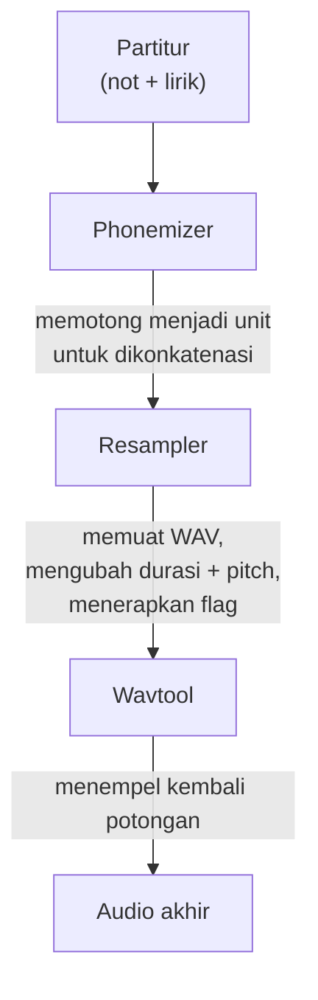

## UTAU : bagaimana sebuah perangkat lunak Visual Basic 6 mendemokratisasi suara sintetis

Aku sudah sempat menyinggungnya di halaman utamaku: aku suka UTAU. Inilah alasannya.

Pada tahun 2008, jika kamu ingin membuat suara sintetis bernyanyi, cuma ada satu opsi: VOCALOID. Perangkat lunak dari Yamaha. Mahal, proprietary, dengan suara resmi yang tidak bisa kamu buat sendiri.

Lalu ada seorang pria Jepang, Ameya/Ayame, yang merilis sesuatu buatannya sendiri. Sebuah perangkat lunak yang dikode dalam **Visual Basic 6**. Gratis. Yang memungkinkanmu membuat suaramu sendiri dengan... file WAV yang kamu rekam sendiri.

Benda itu bernama **UTAU** (歌う, "bernyanyi" dalam bahasa Jepang). Dan untuk zamannya, itu adalah sihir.

Aku selalu merasa perangkat lunak ini mempesona. Bukan karena ia bersih secara teknis (spoiler: sebenarnya ya, butuh pemikiran sungguhan untuk membuat benda ini--pokoknya berantakan, aku menangisi ayam ini), tapi karena ia melakukan sesuatu yang tidak dilakukan orang lain: ia memberikan sintesis suara kepada masyarakat umum. Kayak kamu, aku, siapa pun yang punya mikrofon.

Biarkan aku jelaskan kenapa ini keren.

---

## Pertama, kenapa sintesis nyanyian itu sulit

Suara bernyanyi itu bukan sekadar not. Ada konsonan yang menyerang, vokal yang bertahan, napas, transisi di antaranya. "Sa" dari "salam" itu adalah "s" yang mendesis lalu meluncur ke "a" yang terbuka, dan pergeseran itulah yang membuatnya terdengar manusiawi atau tidak.

Sekarang kita menyelesaikannya dengan deep learning: kamu melatih model pada jam-jam nyanyian dan ia menghasilkan suara (Synthesizer V, DiffSinger). Tapi itu 2020+. Di tahun 2008, nggak ada.

UTAU menggunakan metode lama, lebih tua dan lebih cerdik: **sintesis konkatenatif**.

---

## Sintesis konkatenatif: copy-paste potongan suara

Idenya sederhana banget: kamu merekam potongan-potongan kecil suara lalu menempelkannya bersama untuk membentuk kata. "salam" = sampel "sa" + "lam", dirangkai. Sebuah puzzle suara yang dijalankan oleh partitur.

Ini prinsip yang sama dengan YouTube Poop di mana orang memotong ulang kata-kata karakter untuk membuatnya mengatakan apa saja -- cuma di sini lebih rapi dan otomatis.

Dan UTAU benar-benar berasal dari situ. Sebelumnya ada **"Jinriki Vocaloid"** (人力ボーカロイド, "Vocaloid manual"): orang-orang memotong secara manual trek vokal, mengekstrak fonem, mengubah pitch, dan merakit ulang semuanya di editor audio untuk meniru suara VOCALOID. Manual. Bayangkan repotnya.

Ameya melihat kerepotan ini dan mengkode alat untuk mengotomatiskannya. Awalnya UTAU hanyalah itu: sebuah asisten untuk Vocaloid manual.

---

## Kenapa ini revolusioner: KAMU yang menciptakan suara

Ini dia hal yang mengubah segalanya.

VOCALOID, kamu membeli suara. Miku, Luka, dll. Dibuat oleh profesional, dijual oleh Yamaha. Nggak ada cara untuk membuatnya sendiri. UTAU, **siapa pun bisa merekam suaranya dan menjadikannya instrumen bernyanyi**.

Mode CV (paling sederhana) adalah: kamu merekam ~100 suku kata dasar bahasa Jepang ("a", "ka", "sa", "ta"...), mengatur titik potong, dan jadilah voicebank-mu. Beberapa jam kerja.

Hasilnya: ekosistemnya meledak. Ribuan voicebank diciptakan oleh komunitas -- suara fans, teman, karakter buatan. Seluruh alam semesta penyanyi virtual, gratis. Dan perangkat lunaknya sudah disertai **Defoko** (Utane Uta), suara default yang dihasilkan melalui mesin TTS AquesTalk, jadi kamu bisa mulai bahkan tanpa mikrofon.

---

## oto.ini: jantung sistem

Bagaimana UTAU tahu di mana memotong dan menempel suara? Melalui file konfigurasi per voicebank: **`oto.ini`**. Untuk setiap WAV, ia menentukan titik potong (dalam milidetik):

- **Offset** → hening yang harus dibuang di awal
- **Preutterance** → titik di mana konsonan beralih ke vokal (batas "s"→"a" dalam "sa")
- **Overlap** → seberapa banyak not sebelumnya tumpang tindih dengan yang ini
- **Fixed region** → bagian yang TIDAK boleh diregangkan pada not panjang (biasanya konsonan)
- **Cutoff** → di mana memotong bagian akhir

**Preutterance** adalah parameter paling cerdas. Satu suku kata selalu memiliki sebagian konsonan sebelum vokal. Agar not jatuh tepat pada ketukan, *vokal* yang harus jatuh tepat, bukan konsonan. Jadi UTAU menggeser sampel ke belakang: "a" dari "sa" mendarat tepat di ketukan, "s" meluber sedikit sebelumnya. Seperti drummer yang mengantisipasi pukulannya agar suara jatuh tepat -- cuma di sini ada di dalam `.ini`.

Secara visual, pada sampel "ka", area `oto.ini` terpotong seperti ini:

```mermaid
flowchart LR
    A["🔇 hening<br/>(offset)"] --> B["🅺 konsonan<br/>(fixed region,<br/>tidak diregang)"]
    B --> C["🅰 vokal<br/>(zona bisa diregang)"]
    C --> D["🔇 ujung dipotong<br/>(cutoff)"]
    style B fill:#3b4a6b
    style C fill:#5b3b6b
```



Batas antara konsonan dan vokal adalah preutterance. Vokal adalah zona yang diregangkan untuk not panjang; konsonan tetap utuh, jika tidak "k"-mu akan berdurasi dua detik dan terdengar mengerikan.

```ini
# oto.ini (disederhanakan)
# file=alias,offset,consonant,cutoff,preutterance,overlap
_ka.wav=ka,120,80,-200,90,40
```

Lima nilai per suara, pada semua sampelmu, dan UTAU merakit kata apa pun dengan rapi.

---

## CV, VCV, CVVC: perlombaan menuju realisme

Mode dasar, **CV** (Konsonan-Vokal), adalah satu suara per suku kata. Sederhana tapi agak robotik: sambungan antarsuku kata kasar.

Pada 2010 komunitas menemukan **VCV** (Vokal-Konsonan-Vokal). Alih-alih merekam "ka" saja, kamu merekam "a ka" -- dengan ekor vokal sebelumnya. Transisinya menjadi alami karena *ada* dalam rekaman, bukan dihitung setelahnya.

Detail yang menarik: **VOCALOID tidak memiliki VCV sebelum VOCALOID3, pada 2011.** Freeware dalam VB6 yang dikode oleh satu orang sendirian mendahului Yamaha satu tahun dalam hal realisme transisi. Komunitas fans lebih cepat daripada perusahaan multinasional.

Setelah itu muncullah **CVVC**, **ARPAsing** (Inggris), **VCCV**... setiap metode mendorong realisme lebih jauh, semuanya ditemukan dan didokumentasikan oleh komunitas.

---

## Pipeline lengkap: bagaimana kata menjadi suara

Saat kamu menempatkan not dan mengetik lirik, inilah yang terjadi di belakang layar:



**Resampler** adalah komponen utamanya: ia mengambil sampel "ka"-mu yang direkam pada pitch tertentu dan meregangkan/mengubah pitch-nya agar sesuai dengan not yang diinginkan -- hanya meregangkan zona yang bisa diregang dan menjaga konsonan tetap utuh (dari situlah `oto.ini` berasal).

Dan ia bersifat **modular**. UTAU hadir dengan resampler bawaan, tetapi komunitas menciptakan yang lain (moresampler, TIPS...), masing-masing dengan karakter suaranya sendiri. Kamu bisa mengganti mesin sintesis seperti plugin. Di tahun 2008. Pada freeware.

---

## Kekacauan di balik kap mesin (dan kenapa ini menggemaskan)

Harus jujur soal kondisi teknis benda ini:

- **Dikode dalam Visual Basic 6.** Bahasa yang sudah mati di tahun 2008. Perlu runtime VB6 untuk menjalankannya.
- **Awalnya Windows only** (porting Mac, UTAU-Synth, baru hadir di 2011).
- **Encoding Shift-JIS wajib.** Jika file-mu tidak di-encode dalam Shift-JIS Jepang, UTAU tidak mengerti apa pun. Bahkan sampai sekarang sering harus mengatur PC ke locale Jepang atau menggunakan AppLocale untuk menjalankannya.
- **Antarmuka ala kadarnya**, dokumentasi hampir 100% bahasa Jepang pada masanya.

Dan tetap saja. Tetap saja benda ini menciptakan gerakan global. Puluhan ribu voicebank. Lagu yang didengarkan jutaan kali.

Contoh terbaik: **Kasane Teto**. Karakter yang diciptakan pada 2008 dan diluncurkan sebagai lelucon 1 April, berpura-pura menjadi VOCALOID. Itu cuma bercanda. Tapi orang-orang menyukai karakter tersebut, voicebank UTAU asli dibuat setelahnya, dan Teto menjadi salah satu penyanyi virtual paling terkenal di dunia. Pada 2023 ia bahkan mendapatkan suara Synthesizer V resmi. Karakter yang lahir dari lelucon April Mop pada perangkat lunak gratis.

---

## Kenapa ini masih berarti

UTAU adalah contoh sempurna dari teknologi "miskin" yang menang karena keterbukaan.

VOCALOID secara teknis lebih unggul, lebih didanai, lebih pro. Tapi tertutup. UTAU dibuat seadanya, jelek, dalam VB6 -- tapi ia membiarkan semua orang berpartisipasi. Membuat suara, membuat resampler, membuat plugin, membuat metode perekaman. Komunitas melakukan sisanya.

Dan konsepnya masih bertahan sepenuhnya hingga hari ini. **OpenUtau**, penerus open-source modern, mengambil ide tersebut dan membersihkannya (multi-platform, UTF-8, dukungan resampler modern DAN AI). Sintesis konkatenatif masih bertahan di samping model deep learning, karena ia memiliki sesuatu yang tidak dimiliki model-model itu: kamu mengerti persis apa yang terjadi, dan kamu mengontrol setiap milidetik.

Itulah yang selalu aku suka dari UTAU. Kamu melihat persis apa yang terjadi. Ini bukan AI yang memuntahkan sesuatu yang ajaib yang tidak kamu pahami: kamu punya WAV-mu, titik potongmu, dan kaulah yang memutuskan segalanya. Ketika suaranya jelek, kamu tahu kenapa dan kamu bisa memperbaikinya. Aku suka kendali semacam itu.

---

**3 Hal yang perlu diingat:**

1. **Sintesis konkatenatif = puzzle suara** -- UTAU menempelkan sampel WAV kecil bersama untuk membentuk kata. `oto.ini` menentukan di mana memotong dan menempel setiap suara. Kamu mengontrol semuanya, hingga milidetik, tanpa kotak hitam.

2. **Keterbukaan mengalahkan teknik** -- VOCALOID lebih baik tapi tertutup. UTAU dibuat seadanya tapi membiarkan semua orang membuat suaranya sendiri. Komunitas meledakkan ekosistem, dan bahkan mendahului Yamaha dalam VCV.

3. **Ide bagus bertahan lebih lama dari kodenya** -- VB6, Shift-JIS, Windows only... dan tetap saja konsepnya masih berjalan melalui OpenUtau. Teknologi hebat bisa dikode dengan cara yang amburadul.

Sejujurnya, hanya untuk Kasane Teto yang lahir dari lelucon April Mop, perangkat lunak ini layak dihormati xD
