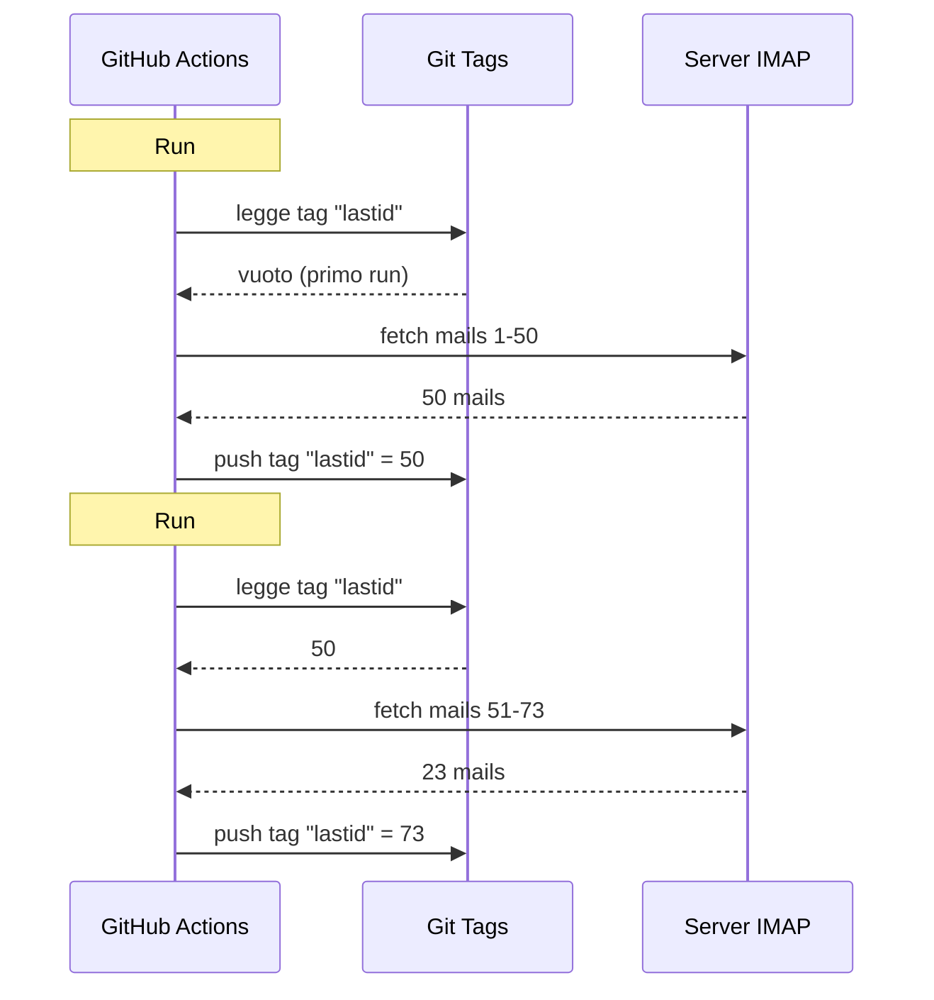

# Ho usato git come database per far girare un bot gratis su GitHub Actions

Ho un risponditore automatico email che gira 24/7.

Legge le mie mail, capisce di cosa parlano, e risponde da solo con un'IA. Si ricorda delle conversazioni precedenti. Ignora le newsletter e i `noreply@`. Inoltra a un umano quando è troppo caldo.

Costo mensile: **0€**.

Niente server. Niente VPS. Niente database. Solo GitHub Actions e un hack pazzesco: **usare git come database**.

Vedi dove voglio arrivare? No? Beh, tieniti forte, è stupido e geniale allo stesso tempo.

---

## Il problema: GitHub Actions è stateless

GitHub Actions è gratuito. Puoi lanciare un cron ogni 5 minuti, far girare il tuo codice, gratis.

Ma c'è un problema: è **stateless**.

Ogni run parte in una macchina vergine. Niente viene salvato tra un'esecuzione e l'altra. Il run precedente? Dimenticato. Cancellato. Come se non fosse mai esistito.

Per un risponditore email, è un problema enorme. Tipo:

> "Qual è l'ultima mail che ho già processato?"

Se il bot se lo dimentica a ogni run, o risponde sempre agli stessi messaggi in loop (catastrofe), oppure si perde delle mail.

Serve uno stato persistente. E normalmente, stato persistente = database. Ma un database è un server, e un server non è più gratuito.

È qui che diventa interessante.

---

## La soluzione: git tags come database

Il tuo repo GitHub è già storage persistente. Gratuito. Versionato. Sempre lì.

Allora perché non usarci per salvare lo stato?

L'idea: a ogni run, il bot legge l'ultimo UID email processato da un **git tag**. Processa le nuove mail. Poi re-pusha il tag col nuovo UID.



Il tag git È il database. Un singolo valore, ma è tutto quello che serve.

### Leggere lo stato

All'inizio del job, recuperi il valore dal tag:

```bash
git fetch origin --tags lastid || true
git show refs/tags/lastid:data/lastId > data/lastId || true
```

`git show refs/tags/lastid:data/lastId` significa: "dammi il contenuto del file `data/lastId` così com'era nel tag `lastid`".

Boom. Hai il tuo valore, senza database.

### Scrivere lo stato

Alla fine, ricrei il tag col nuovo valore:

```bash
git switch --orphan lastid-tmp   # branch vergine senza storico
git rm -rf .                      # si svuota tutto
mkdir -p data
printf "%s\n" "${LAST_ID_CONTENT}" > data/lastId

git add data/lastId
git commit -m "lastId snapshot"
git tag -f lastid                 # forza il tag su questo commit
git push --force ...origin lastid # push del tag
```

Si crea un branch **orfano** (senza storico), si mette solo il file `lastId`, si committa, si targa, si force pusha.

Perché orfano? Per non accumulare 10 000 commit di stato nello storico del repo. Ogni update sovrascrive il precedente. Il tag punta sempre a UN singolo commit che contiene UN singolo valore.

È pulito. È gratuito. È completamente rotto xD

---

## Il secondo hack: lo snapshot del runtime

C'è un altro problema con GitHub Actions: il `npm install`.

Se a ogni run (ogni 5 minuti) fai `npm install` + `npm run build`, sprechi 60-90 secondi ogni volta. Su un cron frequente, sono minuti di compute sprecati per niente.

Soluzione: pre-compilare il codice UNA volta, e conservarlo in un tag git.

Il workflow di build (che gira quando pushi su `master`) fa questo:

```bash
# compila il codice
bun install
bun run build

# salva dist/ + node_modules/ in un tag "runtime"
git checkout --orphan temp-runtime
git rm -rf .
cp -r "$TMPDIR"/* .
git add dist node_modules package.json bun.lock data
git commit -m "runtime build"
git tag -f runtime
git push --force ...origin runtime
```

Il tag `runtime` contiene il codice compilato E i `node_modules`. Tutto pronto per girare.

E il cron, invece, fa checkout direttamente di questo tag:

```yaml
- name: Checkout runtime snapshot
  uses: actions/checkout@v4
  with:
    ref: refs/tags/runtime    # il codice pre-build, non il sorgente
    fetch-depth: 1

# niente npm install, niente build!
- name: Process emails
  run: node dist/index.js --action
```

Niente install. Niente build. Il cron parte istantaneamente ed esegue solo `node dist/index.js`.

Praticamente hai due tag che fanno due lavori:
- `runtime` = il codice pronto per girare (aggiornato quando pushi codice)
- `lastid` = lo stato persistente (aggiornato a ogni run)

È elegante da far schifo.

---

## Il bot stesso: auto-risponditore IA

Ok, l'hack git è figo, ma il bot cosa fa esattamente?

Legge le tue mail via IMAP, le capisce con un'IA (Groq + Llama 3.3 70B), e risponde automaticamente.

Architettura in servizi puliti con dependency injection (InversifyJS):

```
App
├── ImapService      → legge le mail (IMAP)
├── SmtpService      → invia le risposte (SMTP)
├── ParserService    → analizza il contenuto delle mail
├── ReplyService     → genera la risposta IA
├── SummaryService   → memoria di conversazione
├── AccountsService  → gestisce più account email
└── ConfigService    → config / env vars
```

### Due modalità di funzionamento

Il bot può girare in due modi:

**Modalità listener** (tempo reale): connessione IMAP permanente con reconnect esponenziale. Per un VPS.

```typescript
this.imapService.on("exists", async (data) => {
  console.log(`[MAIL] Nuova mail! Totale: ${data.count}`);
  // processa la nuova mail immediatamente
});
```

**Modalità action** (batch): processa le nuove mail dal `lastId`, poi si chiude. Per il cron di GitHub Actions.

```bash
node dist/index.js --action
```

La modalità `--action` è quella che usa l'hack git. Legge `lastId`, processa ciò che è nuovo, scrive il nuovo `lastId`, fine.

### NON rispondere ai bot

Se il tuo bot risponde a TUTTE le mail, risponderà a newsletter, notifiche, `noreply@`. Catastrofe. Peggio: se due bot si rispondono a vicenda, hai un loop infinito di mail. L'incubo.

Quindi filtraggio aggressivo:

```typescript
export function isAutomatedSender(address) {
  const automatedPatterns = [
    "noreply", "no-reply", "donotreply",
    "mailer-daemon", "postmaster", "bounce",
    "newsletter", "notification", "marketing",
    "billing", "receipt", "promo", ...
  ];
  const local = address.split("@")[0].toLowerCase();
  return automatedPatterns.some(p => local.includes(p));
}
```

E anche rilevazione tramite gli header email:

```typescript
export function isAutomatedByHeaders(headers) {
  return (
    ["bulk", "list", "junk"].includes(headers.precedence) ||
    headers["auto-submitted"] !== "no" ||
    headers["list-unsubscribe"] !== "" ||   // le newsletter hanno questo
    /mailchimp|sendgrid|mailgun|brevo/i.test(headers["x-mailer"])
  );
}
```

`List-Unsubscribe` negli header? È una newsletter. `Precedence: bulk`? Mass-mailing. `X-Mailer: Mailchimp`? Hai capito il tipo. Ignoriamo.

È come un buttafuori di discoteca: i robot non passano xD

### I trigger magici

L'IA può decidere di non rispondere affatto, o di passare la mano a un umano. Come? Con trigger speciali nella sua risposta.

Il prompt di sistema le dice:

> Se è una mail automatica/newsletter → rispondi `<no_reply>`
> Se è troppo importante/sensibile (legale, finanziario...) → rispondi `<manual_reply_required>`
> Altrimenti → scrivi una risposta vera

E il codice legge così:

```typescript
const aiReply = completion.choices[0].message.content.trim();
const manualTrigger = aiReply.includes(MANUAL_REPLY_TRIGGER);
const noReply = aiReply.includes(NO_REPLY_TRIGGER);

if (noReply) {
  console.log("[MAIL] L'IA ha deciso di ignorare. Skip.");
  return;
}

if (manualTrigger) {
  console.log("[MAIL] Troppo caldo, inoltro a un umano.");
  await this.smtpService.sendManualForward(...);
  return;
}

// altrimenti si invia la risposta IA
await this.smtpService.sendReply(...);
```

Tipo l'IA ha il diritto di dire "no, qui non ci metto le mani, chiama un umano vero". È saggia.

---

## La memoria di conversazione

Un dettaglio che cambia tutto: il bot **si ricorda** delle conversazioni.

Quando risponde a qualcuno, salva un riassunto dello scambio. La prossima volta che quella persona scrive, il riassunto viene reiniettato nel prompt.

Storage: un file JSON per contatto.

```
data/customers/
├── moi%40gmail.com/
│   ├── alice%40example.com.json
│   └── bob%40client.fr.json
```

E il riassunto è esso stesso generato dall'IA, che fa il merge del vecchio riassunto col nuovo messaggio:

```typescript
const completion = await groq.chat.completions.create({
  model: "llama-3.3-70b-versatile",
  messages: [
    { role: "system", content: "Sei un assistente di memoria. Fai il merge del vecchio riassunto col nuovo messaggio senza perdere informazioni." },
    { role: "user", content: `Riassunto esistente:\n${existing}\n\nNuovo messaggio:\n${incomingContent}` }
  ],
  temperature: 0.0,  // deterministico, niente creatività
  max_tokens: 800,
});
```

Quindi il bot costruisce una memoria compressa nel tempo. Non c'è bisogno di conservare tutte le mail, solo un riassunto che cresce intelligentemente.

E questi file JSON? Beh... sono salvati in git anche loro, nel tag runtime. Git dappertutto xD

---

## La cosa furba con la lunghezza del prompt

Piccolo dettaglio tecnico che mi ha fatto sorridere.

I modelli hanno un limite di token. Se la tua mail + il riassunto + il persona prompt sforano, l'API restituisce un errore.

Il codice gestisce tutto con un **troncamento a cascata** + retry:

```typescript
try {
  // primo tentativo con i limiti normali
  completion = await groq.chat.completions.create({...});
} catch (error) {
  if (!this.isLengthError(error)) throw error;

  // era un errore di lunghezza: si riprova con limiti più stretti
  ({ systemContent, userContent } = this.buildPromptPayload({
    ...,
    limits: {
      systemPromptChars: 2200,  // invece di 3000
      summaryChars: 1800,       // invece di 4000
      personaChars: 900,        // invece di 1500
      userContentChars: 2200,   // invece di 8000
    },
  }));
  completion = await groq.chat.completions.create({...});  // retry
}
```

Se non passa, tagli più corto e riprovi. Semplice, efficace, niente crash.

---

## Ok, e concretamente, come gira?

Il flow completo di un run del cron:

```
1. GitHub Actions si attiva (cron ogni 5 min)
2. Checkout del tag "runtime" (codice pre-build)
3. git show refs/tags/lastid → recupera l'ultimo UID processato
4. node dist/index.js --action
   ├── connessione IMAP
   ├── fetch delle mail da lastId+1
   ├── per ogni mail :
   │   ├── analizza il contenuto
   │   ├── filtra i bot (skip se automated)
   │   ├── matcha l'account destinatario
   │   ├── recupera la memoria di conversazione
   │   ├── genera la risposta IA (Groq)
   │   ├── <no_reply> ? skip
   │   ├── <manual_reply_required> ? inoltro umano
   │   ├── altrimenti : invia la risposta (SMTP)
   │   └── aggiorna la memoria di conversazione
   └── scrive il nuovo lastId
5. git push --force tag "lastid" col nuovo valore
```

E ricomincia tra 5 minuti. Per sempre. Gratis.

---

**Le 3 cose da ricordare:**

1. **Git = database gratuito** -- Un tag orfano può salvare il tuo stato persistente tra due run stateless. `git show refs/tags/X:file` per leggere, force-push per scrivere. Niente DB.

2. **Pre-compila in un tag runtime** -- Invece di `npm install` a ogni run del cron, salva il codice compilato + node_modules in un tag git. Il cron parte istantaneamente.

3. **Un bot IA deve saper stare zitto** -- I trigger `<no_reply>` e `<manual_reply_required>` lasciano che l'IA decida di non rispondere o di passare la mano. Più il filtraggio anti-bot. Altrimenti crei un loop infinito di mail.

Serverless cron con stato persistente, IA, memoria, tutto a 0€/mese. È completamente rotto e lo adoro xD
