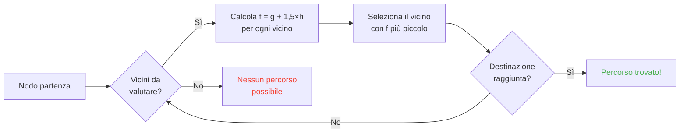

## Introduzione

Ho passato ore a guardare pecore sbattere contro i muri.

Miglior investimento della mia vita xD

Più guardi questi mob, più realizzi che nei loro movimenti non c'è niente di casuale. Ogni passo è programmato, prevedibile e, cosa più importante, sfruttabile. Alla fine mi sono messo a spulciare il codice sorgente di Minecraft per capire esattamente come funziona il pathfinding, e ho scoperto che puoi letteralmente controllare i mob con la mente. Tipo, forzarli ad andare dove VUOI tu, non dove decide il caso.

Questa guida è tutto quello che ho scoperto mentre scavavo. Il sistema AI, l'algoritmo A*, i valori nascosti di malus, gli exploit che puoi usare in survival. Prendi il tuo piccone.

---

## Come Funziona la Mob AI (spoiler: è un po' tonta)

### Goals

Ogni mob ha una lista di *goal*. Cose che PUÒ fare, e quanto tanto le VUOLE fare. Numero più basso = priorità più alta. Tipo una lista di cose da fare infernale.

```java
protected void registerGoals() {
   this.goalSelector.addGoal(4, new Zombie.ZombieAttackTurtleEggGoal(this, 1.0, 3));
   this.goalSelector.addGoal(8, new LookAtPlayerGoal(this, Player.class, 8.0F));
   this.goalSelector.addGoal(8, new RandomLookAroundGoal(this));
   this.addBehaviourGoals();
}
```

Mai visto uno zombie ignorare un uovo di tartaruga per inseguire te invece? Ecco perché: `ZombieAttackTurtleEggGoal` ha priorità 4, mentre `ZombieAttackGoal` (il goal "mangiami la faccia") ha priorità 2. Gli zombie preferiscono spuntini col polso.

Il goal che ci interessa davvero è `WaterAvoidingRandomStrollGoal`, priorità 7. Il goal "non ho niente di meglio da fare quindi giro a caso". È qui che inizia il divertimento.

### Movimento (ovvero "come un random walk ha 1 possibilità su 60 per tick")

Ogni tick (ogni 0.05 secondi), il gioco chiama `canUse()` per controllare se il mob ha voglia di muoversi. 1 possibilità su 60 per tick. Design orribilmente inefficiente, e lo adoro.

```java
public boolean canUse() {
   if (this.mob.hasControllingPassenger()) {
      return false;
   } else {
      if (!this.forceTrigger) {
         if (this.checkNoActionTime && this.mob.getNoActionTime() >= 100) {
            return false;
         }
         if (this.mob.getRandom().nextInt(reducedTickDelay(this.interval)) != 0) {
            return false;
         }
      }
      Vec3 $$0 = this.getPosition();
      if ($$0 == null) {
         return false;
      } else {
         this.wantedX = $$0.x;
         this.wantedY = $$0.y;
         this.wantedZ = $$0.z;
         this.forceTrigger = false;
         return true;
      }
   }
}
```

Quindi, per riassumere: se stai cavalcando il mob -> no, se il mob non ha fatto niente per 5 secondi -> no, se l'RNG dice no -> no. Il gioco NON VUOLE davvero che i mob si muovano.

Ma quando si muove, `getPosition()` prende il controllo:

```java
protected Vec3 getPosition() {
   if (this.mob.isInWater()) {
      Vec3 $$0 = LandRandomPos.getPos(this.mob, 15, 7);
      return $$0 == null ? super.getPosition() : $$0;
   } else {
      return this.mob.getRandom().nextFloat() >= this.probability
         ? LandRandomPos.getPos(this.mob, 10, 7)
         : super.getPosition();
   }
}
```

Quei due numeri alla fine? Raggio XZ e raggio Y. In acqua, il mob cerca più lontano (15 vs 10). Se non trova terra, ripiega su `super.getPosition()` che accetta l'acqua. **Risultato: i mob VOGLIONO uscire dall'acqua.** Ecco perché i tuoi animali nuotano come pazzi verso la riva.

Dettaglio divertente: c'è letteralmente lo 0.1% di possibilità che il mob scelga `super.getPosition()` invece di `LandRandomPos`. Uno su mille. Mojang immagino xD

### LandRandomPos: l'ottimizzazione che rompe tutto

Questo è il MIO passo preferito. Il più bel casino tecnico che rende il pathfinding sfruttabile.

```java
public static Vec3 getPos(PathfinderMob $$0, int $$1, int $$2, ToDoubleFunction<BlockPos> $$3) {
   boolean $$4 = GoalUtils.mobRestricted($$0, $$1);
   return RandomPos.generateRandomPos(() -> {
      BlockPos $$4xx = RandomPos.generateRandomDirection($$0.getRandom(), $$1, $$2);
      BlockPos $$5 = generateRandomPosTowardDirection($$0, $$1, $$4, $$4xx);
      return $$5 == null ? null : movePosUpOutOfSolid($$0, $$5);
   }, $$3);
}
```

`movePosUpOutOfSolid`. Il nome dice tutto. Se la posizione scelta è dentro un blocco solido, il gioco la spinge verso l'alto finché non è in aria.

È un'ottimizzazione: invece di perdere tempo a saltare posizioni sottoterra, il gioco le spinge direttamente in superficie. Intelligente? Sì. Ma crea un ENORME bias: **i mob preferiscono le zone alte**.

Pensaci. Tanti blocchi sottoterra, il gioco genera 10 posizioni casuali. Quelle dentro ai blocchi vengono spinte su. Le aree dense (sotto una collina) producono più posizioni valide delle aree vuote. Risultato: il mob va statisticamente più spesso verso la collina.

Fidati, stiamo per spaccare tutto quanto.

### La selezione: vince il blocco migliore

10 posizioni, un vincitore, una gara a punti:

```java
public static Vec3 generateRandomPos(Supplier<BlockPos> $$0, ToDoubleFunction<BlockPos> $$1) {
   double $$2 = Double.NEGATIVE_INFINITY;
   BlockPos $$3 = null;
   for(int $$4 = 0; $$4 < 10; ++$$4) {
      BlockPos $$5 = (BlockPos)$$0.get();
      if ($$5 != null) {
         double $$6 = $$1.applyAsDouble($$5);
         if ($$6 > $$2) {
            $$2 = $$6;
            $$3 = $$5;
         }
      }
   }
   return $$3 != null ? Vec3.atBottomCenterOf($$3) : null;
}
```

La posizione col punteggio più alto VINCE. E se conosci i criteri di punteggio, puoi far vincere LA TUA posizione. È come truccare un'elezione.

---

## Preferenze dei Mob (ovvero "perché la tua mucca ha attraversato la strada")

Ogni mob ha gusti diversi. E cambia tutto.

| Mob | Ama |
| --- | --- |
| **Animali** (mucche, pecore, maiali) | Blocchi d'erba, luce |
| **Mostri** (zombie, scheletri) | Buio (hipster) |
| **Tartarughe** | Acqua > sabbia > luce |
| **Hoglin** | `crimson_nylium`; odiano `warped_fungus` |
| **Strider** | Lava e NULL'ALTRO |
| **Silverfish** | Blocchi infestabili |
| **Guardian** | Acqua + luce (snob) |
| **Mooshroom** | Micelio + luce |
| **Api** | Aria. Sì, preferiscono l'ARIA. |

```java
// Animale: guarda giù, se erba -> punteggio massimo
public float getWalkTargetValue(BlockPos $$0, LevelReader $$1) {
   return $$1.getBlockState($$0.below()).is(Blocks.GRASS_BLOCK) ? 10.0F : $$1.getPathfindingCostFromLightLevels($$0);
}

// Mostro: letteralmente l'opposto
public float getWalkTargetValue(BlockPos $$0, LevelReader $$1) {
   return -$$1.getPathfindingCostFromLightLevels($$0);
}
```

I mostri sono tipo "se c'è luce, punteggio negativo, me ne vado." Si INCAZZANO con i livelli di luce xD

Quindi puoi -- letteralmente -- guidare gli animali con erba e luce, e i mostri con l'oscurità. È stupido e geniale allo stesso tempo.

---

## A* in Minecraft (la formula segreta)

Minecraft usa A* (A-star) per il pathfinding. Ma Mojang ci ha messo il suo tocco:

```
f(n) = g(n) + 1.5 × h(n)
```

- **g(n)** = distanza già percorsa (1 per blocco, ~1.41 in diagonale)
- **h(n)** = distanza in linea retta verso il target
- **1.5** = perché a Mojang piacciono le cose leggermente rotte

L'A* normale usa `f(n) = g(n) + h(n)`. MOJANG HA AGGIUNTO UN MOLTIPLICATORE 1.5. Perché? Così l'algoritmo punta dritto alla destinazione più velocemente e pota meno rami di ricerca. Risultato: il percorso è "abbastanza buono" ma non sempre ottimale. È un A* ubriaco.



Limitazione chiave: **un mob può fare pathfinding solo per 16 blocchi** (il suo *follow range*). Se la destinazione è troppo lontana, sceglie il blocco raggiungibile più vicino. Questo significa che puoi costruire un monolito fuori portata e il mob farà pathfinding verso il blocco più vicino che lo avvicina -- rendendo il suo movimento completamente prevedibile.

### I due exploit che rompono il gioco

#### 1. Gli aggiornamenti dei blocchi forzano il ricalcolo

```java
public boolean shouldRecomputePath(BlockPos $$0) {
   if (this.hasDelayedRecomputation) return false;
   if (this.path != null && !this.path.isDone() && this.path.getNodeCount() != 0) {
      Node $$1 = this.path.getEndNode();
      Vec3 $$2 = new Vec3(
         ((double)$$1.x + this.mob.getX()) / 2.0,
         ((double)$$1.y + this.mob.getY()) / 2.0,
         ((double)$$1.z + this.mob.getZ()) / 2.0
      );
      return $$0.closerToCenterThan($$2, (double)(this.path.getNodeCount() - this.path.getNextNodeIndex()));
   }
   return false;
}
```

Ogni aggiornamento di blocco vicino al percorso del mob forza un ricalcolo A* con un cooldown di 1 secondo. Metti un clock da 1 secondo accanto a un mob e lui ricalcola COSTANTEMENTE. È come un GPS che si resetta ogni secondo.

E se lo fai con 50 mob? Lag city. RIP TPS.

#### 2. Malus di Pathfinding (penalità sui blocchi)

Alcuni blocchi spaventano i mob. Letteralmente. Ogni blocco ha un costo associato definito da un enum:

| Blocco / Condizione | Malus |
| --- | --- |
| **Blocco di miele** | +8 per attraversarlo |
| **Neve polverosa** | Impraticabile |
| **Porte chiuse** | Impraticabile |
| **Fuoco** | +16 dentro, +8 adiacente |
| **Animali & Villager** | Fuoco = -1 (NO ASSOLUTO) |
| **Cactus / Bacche dolci** | Impraticabile; adiacente = +8 |
| **Acqua** | +8 dentro o adiacente |
| **Magma** | +8 adiacente |

Gli animali vanno anche oltre:

```java
protected Animal(EntityType<? extends Animal> $$0, Level $$1) {
   super($$0, $$1);
   this.setPathfindingMalus(PathType.DANGER_FIRE, 16.0F);
   this.setPathfindingMalus(PathType.DAMAGE_FIRE, -1.0F);
}
```

DAMAGE_FIRE a -1.0F è letteralmente "vietato." Un animale preferirebbe saltare nel vuoto piuttosto che camminare nel fuoco.

### Esercizio: la grande gara di percorsi

Un villager che sceglie tra più percorsi:

- **Percorso A**: 15 blocchi ma 6 confinanti con acqua (+8 ciascuno)
- **Percorso B**: 18 blocchi con 2 blocchi d'acqua (+8) + 1 adiacente all'acqua (+8)
- **Percorso C**: 14 blocchi dritti... ma fuoco -> IMPRATICABILE per i villager
- **Percorso D**: 16 blocchi con 1 adiacente a magma (+8) + 1 adiacente a miele (+8)
- **Percorso E**: 25 blocchi con cactus dappertutto (+8 ovunque) -> 90.82 totale LOL

Il vincitore è di solito il **Percorso B**: la deviazione ripaga perché l'acqua è COSTOSA.

Un villager è praticamente una calcolatrice di costi con le gambe xD

### Ogni mob sceglie percorsi diversi

Un villager: "fuoco? NOPE CIAO"
Uno zombie: "fuoco? OK boomer *ci cammina dentro in fiamme*"

Puoi letteralmente costruire autostrade che i villager prendono e gli zombie no -- o viceversa.

---

## Villager: il caos finale

I villager sono la cosa più fraintesa di Minecraft. Ma dopo aver letto il codice, realizzi che sono solo macchine prevedibili con orari d'ufficio.

### Sensori e memorie

9 sensori che girano ogni 20 tick (1 secondo). Ognuno scansiona un raggio attorno al villager e salva il risultato in memoria. Il villager vede tutto, ricorda tutto, e agisce di conseguenza.

### Pacchetti di attività

Il cervello di un villager è diviso in pacchetti di attività che si attivano in base all'ora:

| Pacchetto | Orario | Il villager... |
| --- | --- | --- |
| **Core** | 24/7 | Apre porte, nuota (80% del tempo), ACQUISISCE POI |
| **Lavoro** | 8:00-15:00 | "Devo lavorare" -- va alla postazione |
| **Incontro** | 15:00-17:00 | "Happy hour!" -- va alla campana, socializza |
| **Riposo** | 18:00-6:00 | "Ora di dormire" -- va a letto |
| **Ozioso** | 6:00-8:00, 17:00-18:00 | "Mi annoio" -- vaga, si riproduce, salta sui letti |
| **Panico** | Danno / ostile | "CORRI" -- SCAPPA |

**Panico** è l'unico pacchetto che può interrompere TUTTI gli altri. Anche se il villager sta dormendo o lavorando, se c'è uno zombie, MODALITÀ PANICO.

### Acquisisci POI: la meccanica che abilita la redstone wireless

```java
Set<Pair<Holder<PoiType>, BlockPos>> $$12 = (Set)$$10xx.findAllClosestFirstWithType(
   $$0, $$11, $$8x.blockPosition(), 48, PoiManager.Occupancy.HAS_SPACE
)
```

`Acquisisci POI` scansiona un raggio di 48 blocchi per tutti i punti d'interesse validi. Tiene i 5 più vicini, controlla se esiste un percorso, e acquisisce il più vicino raggiungibile. Ogni POI ha slot limitati:
- **Postazioni di lavoro**: 1 slot
- **Letti**: 1 slot
- **Campane**: 32 slot

La cosa FOLLE: **lo slot viene riservato al momento dell'ACQUISIZIONE, non all'arrivo**. Un villager può bloccarti un composter dall'altra parte della mappa senza mai raggiungerlo.

Vedi dove voglio arrivare?

### Redstone wireless. Sì, WIRELESS.

1. Metti un villager in un minecart con un percorso verso un composter
2. Lui acquisisce il composter (slot occupato, nessun altro può usarlo)
3. Il villager è troppo lontano per cliccarlo -- la farina d'ossa resta
4. MUOVI questo villager DOVUNQUE nel mondo, lui mantiene lo slot
5. Quando vuoi attivare la tua cosa, UCCIDI il villager
6. Lo slot si libera, un altro villager acquisisce il composter, rimuove la farina d'ossa
7. AGGIORNAMENTO BLOCCO -> qualsiasi circuito redstone attivato

Hai creato redstone wireless, trasmissibile attraverso l'intero mondo, senza bisogno di caricare chunk sul percorso. Collegala a una camera di stasi con ender pearl e teletrasportati da qualsiasi posto uccidendo un villager.

Il mio uso preferito? Un minigioco cacciatore di taglie: villager multipli con composter, il giocatore deve uccidere IL VILLAGER GIUSTO per attivare l'uscita. Meccanica completamente wtf xD

### Lo Stallo del Pathfinding (ovvero "il villager che si congela per sempre")

C'è un bug tra `Acquisisci POI` (che vede un percorso) e la navigazione reale (che si rifiuta di seguirlo). Succede quando il blocco sopra una postazione di lavoro non è camminabile. Risultato:

- Pacchetto Core: "Voglio acquisire il POI"
- Navigazione: "Non ci posso camminare"
- Risultato: il villager rimane CONGELATO, per sempre, in lotta con sé stesso.

Villager letteralmente congelati, usabili come decorazione o oggetti di scena. Un armor stand tank? Sì. Una guardia che non si muove? Sì. Macabro? Forse. Efficace? Totalmente xD

---

## Conclusione

Il pathfinding dei mob in Minecraft non è casuale. È un sistema deterministico basato su punteggi, prevedibile E sfruttabile.

**Tre cose da ricordare:**

1. **Blocchi solidi sotto = bias di altezza** -- riempi o svuota il sottosuolo per guidare i mob
2. **Il malus è diverso per ogni mob** -- crea percorsi che alcuni prendono e altri no
3. **Slot POI riservati a distanza** -- redstone wireless gratuita, teletrasporto, tutto quanto

Il codice sorgente di Minecraft è una miniera d'oro di meccaniche poco sfruttate. Ho passato ore a leggere Java decompilato e onestamente? Ogni riga è un Easter Egg funzionale. Tranne che queste funzionano in survival per la redstone wireless con i villager. Miglior gioco confermato xD
